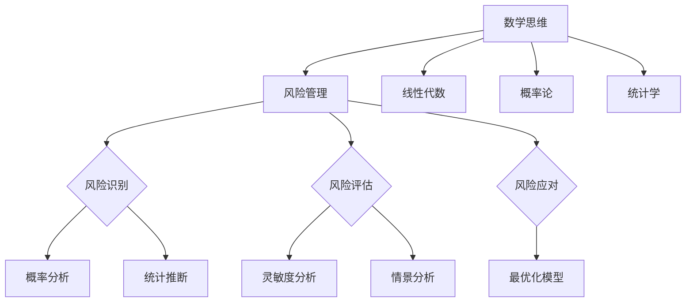
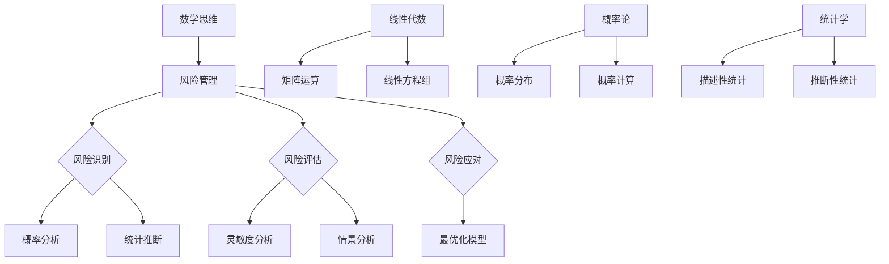

                 


### 文章标题

《数学思维与风险管理的关系》

### 关键词

数学思维，风险管理，概率分析，统计推断，最优化模型，线性代数

### 摘要

本文旨在探讨数学思维在风险管理中的应用，通过解析数学思维与风险管理之间的内在联系，展示数学思维如何为风险管理提供有力的工具和方法。文章分为八个部分，首先介绍了数学思维的基础概念和风险管理的基本框架，然后详细阐述了数学思维在风险识别、风险评估和风险应对中的应用，接着讨论了数学模型在风险管理中的具体应用，并分析了线性代数、概率论和统计学在风险管理中的应用。文章还通过实战案例，展示了如何将数学思维应用于实际风险管理中，最后对未来的发展趋势和研究方向进行了展望。

### 用户输入：

书名：《数学思维与风险管理的关系》

### 第一部分：引言

#### 1.1 书籍背景

风险管理在现代社会中扮演着至关重要的角色，无论是个人投资还是企业运营，都离不开对风险的管理与控制。然而，传统风险管理往往依赖于经验和直觉，这容易导致决策失误和风险失控。随着数学工具和方法的发展，数学思维逐渐成为风险管理的重要工具。本书旨在揭示数学思维在风险管理中的应用，帮助读者提升风险管理的科学性和有效性。

#### 1.2 书籍结构

本书分为八个部分，第一部分是引言，介绍书籍的背景和结构；第二部分阐述数学思维的基础概念和重要性；第三部分介绍风险管理的基本框架和工具；第四部分至第六部分讨论数学思维在风险识别、风险评估和风险应对中的应用；第七部分探讨数学模型在风险管理中的具体应用；第八部分通过实战案例展示数学思维在风险管理中的实际应用，并对未来趋势进行展望。

#### 1.3 阅读建议

本书适合对风险管理感兴趣的所有读者，无论您是初学者还是专业人士，都能从中获得有益的知识和启发。建议读者按照章节顺序阅读，以便更好地理解数学思维与风险管理的关系。同时，本书配套了丰富的练习题和案例，读者可以通过实践来加深对书中知识点的理解。

#### 1.4 关键术语解释

- **数学思维**：指运用数学概念、方法和推理进行思考的能力。
- **风险管理**：指通过识别、评估和应对风险，以确保目标实现的过程。
- **概率分析**：指运用概率论的方法来分析不确定事件的可能性。
- **统计推断**：指基于样本数据对总体特征进行推断的方法。
- **最优化模型**：指通过数学建模来寻找最优解的模型。

#### 1.5 本书核心观点

数学思维为风险管理提供了科学的方法和工具，通过概率分析、统计推断和最优化模型，可以更加精准地识别风险、评估风险和应对风险。本书的核心观点是，数学思维不仅是解决数学问题的工具，也是提升风险管理能力的重要手段。

#### 1.6 本书目的

本书的目的是帮助读者：

1. 理解数学思维的基本概念和重要性。
2. 掌握风险管理的基本框架和工具。
3. 学习数学思维在风险管理中的应用。
4. 提升实际风险管理的实践能力。

#### 1.7 概念图

以下是数学思维与风险管理关系的概念图：



### 第二部分：数学思维基础

#### 2.1 数学思维概述

数学思维是指运用数学概念、符号和推理进行抽象思考的能力。它不仅仅局限于解决数学问题，更是一种普遍的思维工具，可以应用于各个领域。数学思维强调逻辑性、严谨性和抽象性，通过抽象思维，我们可以从复杂的现象中提取出核心的数学模型，从而更加深刻地理解问题。

#### 2.2 数学基础概念

数学基础概念包括数字、运算、集合、函数等。数字是数学的基本元素，运算包括加、减、乘、除等基本操作。集合是数学中的基础概念，用于描述一组对象的集合。函数是描述输入与输出关系的基本工具，它是数学建模的核心。

#### 2.3 数学思维方法

数学思维方法包括逻辑推理、抽象建模、问题分解等。逻辑推理是数学思维的核心，通过逻辑推理，我们可以从已知条件推导出未知结果。抽象建模是将现实问题抽象为数学模型，从而更方便地分析和解决。问题分解是将复杂问题分解为若干个简单问题，逐一解决，最后综合得到整体解决方案。

#### 2.4 数学思维案例

一个典型的数学思维案例是解决“鸡兔同笼”问题。假设有若干只鸡和兔子，它们共有头数为H，总脚数为F。我们需要通过已知条件求解鸡和兔子的数量。这个问题可以通过建立方程组，运用代数方法求解。

```markdown
设鸡的数量为x，兔子的数量为y，根据题意可以建立以下方程组：
x + y = H  （总头数）
2x + 4y = F  （总脚数）

通过解方程组，我们可以求得鸡和兔子的数量。
```

#### 2.5 数学思维的重要性

数学思维的重要性在于：

1. **提高逻辑思维能力**：数学思维强调逻辑推理，通过数学方法解决问题，可以提高逻辑思维能力。
2. **培养抽象思维能力**：数学思维需要对现实问题进行抽象，形成数学模型，这有助于培养抽象思维能力。
3. **解决问题的工具**：数学思维提供了一套解决问题的工具和方法，可以应用于各个领域。

### 第三部分：风险管理基础

#### 3.1 风险管理概述

风险管理是指通过识别、评估和应对风险，以确保目标实现的过程。它不仅涉及对潜在风险的认识，还包括对风险的量化分析和应对策略的制定。风险管理在个人投资、企业运营、金融决策等方面都发挥着重要作用。

#### 3.2 风险管理框架

风险管理通常包括以下三个步骤：

1. **风险识别**：识别可能影响目标实现的风险因素。
2. **风险评估**：对识别出的风险进行量化分析，评估其可能性和影响程度。
3. **风险应对**：制定应对策略，包括风险规避、风险转移和风险接受等。

#### 3.3 风险管理工具

风险管理中常用的工具包括：

1. **概率分析**：通过概率论的方法，分析风险事件的可能性。
2. **统计推断**：基于样本数据，对总体风险特征进行推断。
3. **情景分析**：模拟不同情景下的风险状况，评估风险应对策略的有效性。
4. **灵敏度分析**：分析风险因素的变化对风险结果的影响。

#### 3.4 风险管理案例

以企业运营中的供应链风险管理为例，企业需要识别供应链中的潜在风险因素，如供应商延迟交货、运输途中货物丢失等。然后对每个风险因素进行量化分析，评估其可能性和影响程度。最后，企业需要制定应对策略，如与供应商签订合同确保交货及时、增加运输保险等。

### 第四部分：数学思维在风险管理中的应用

#### 4.1 数学思维在风险识别中的应用

数学思维在风险识别中的应用主要体现在以下几个方面：

1. **概率分析**：通过概率论的方法，分析风险事件的可能性。例如，企业可以通过分析历史数据，计算出某供应商延迟交货的概率。
2. **统计推断**：基于样本数据，对总体风险特征进行推断。例如，企业可以通过抽样调查，推断出整个供应链中供应商延迟交货的整体情况。
3. **情景分析**：模拟不同情景下的风险状况，评估风险应对策略的有效性。例如，企业可以通过情景分析，评估不同供应商选择的优缺点。

#### 4.2 数学思维在风险评估中的应用

数学思维在风险评估中的应用主要包括以下几个方面：

1. **灵敏度分析**：分析风险因素的变化对风险结果的影响。例如，企业可以通过灵敏度分析，评估供应商延迟交货对项目进度的影响。
2. **最优化模型**：通过数学建模，寻找最优的风险应对策略。例如，企业可以通过最优化模型，计算出在预算限制下，如何选择供应商以最小化延迟交货的风险。

#### 4.3 数学思维在风险应对中的应用

数学思维在风险应对中的应用主要体现在以下几个方面：

1. **概率分析**：通过概率分析，制定风险应对策略。例如，企业可以通过计算延迟交货的概率，决定是否需要与供应商签订合同确保交货及时。
2. **统计推断**：基于统计推断，评估风险应对策略的有效性。例如，企业可以通过统计推断，评估增加运输保险是否能够有效降低货物丢失的风险。
3. **情景分析**：通过情景分析，模拟不同风险应对策略的效果。例如，企业可以通过情景分析，评估与多家供应商合作与单一供应商合作在风险管理上的优劣。

### 第五部分：数学模型在风险管理中的应用

#### 5.1 数学模型概述

数学模型是运用数学语言描述现实问题的工具。在风险管理中，数学模型可以用来识别风险、评估风险和制定风险应对策略。常见的数学模型包括概率模型、最优化模型和仿真模型。

#### 5.2 常见数学模型

1. **概率模型**：概率模型用于描述随机事件的可能性。在风险管理中，概率模型可以用来分析风险事件的可能性。例如，通过计算某风险事件的发生概率，评估其对项目的影响。
   
2. **最优化模型**：最优化模型用于寻找最优解。在风险管理中，最优化模型可以用来制定风险应对策略。例如，通过最优化模型，企业可以计算出在预算限制下，如何选择供应商以最小化延迟交货的风险。

3. **仿真模型**：仿真模型通过模拟现实场景，评估不同决策的影响。在风险管理中，仿真模型可以用来评估风险应对策略的效果。例如，企业可以通过仿真模型，模拟不同供应商选择的优缺点。

#### 5.3 数学模型在风险管理中的应用

数学模型在风险管理中的应用包括以下几个方面：

1. **风险识别**：通过概率模型，识别潜在的风险事件。例如，通过计算某供应商延迟交货的概率，识别出该风险事件。
2. **风险评估**：通过最优化模型，评估风险的影响程度。例如，通过最优化模型，企业可以计算出不同风险因素对项目进度的影响。
3. **风险应对**：通过仿真模型，制定和评估风险应对策略。例如，通过仿真模型，企业可以评估与多家供应商合作与单一供应商合作在风险管理上的优劣。

### 第六部分：风险管理中的数学工具

#### 6.1 线性代数在风险管理中的应用

线性代数是数学中的重要分支，它在风险管理中的应用主要体现在以下几个方面：

1. **矩阵运算**：矩阵运算是线性代数的基础。在风险管理中，矩阵运算可以用来表示和解决复杂的问题。例如，企业可以通过矩阵运算，计算不同供应商选择的加权平均绩效。
2. **线性方程组**：线性方程组是线性代数中的一个重要概念。在风险管理中，线性方程组可以用来求解多个变量的问题。例如，企业可以通过线性方程组，计算在预算限制下，如何选择供应商以最小化延迟交货的风险。

#### 6.2 概率论在风险管理中的应用

概率论是数学中的一个重要分支，它在风险管理中的应用主要体现在以下几个方面：

1. **概率分布**：概率分布是概率论中的一个基本概念。在风险管理中，概率分布可以用来描述风险事件的概率分布。例如，企业可以通过概率分布，计算某供应商延迟交货的概率。
2. **概率计算**：概率计算是概率论中的一个重要方法。在风险管理中，概率计算可以用来评估风险事件的可能性。例如，企业可以通过概率计算，评估不同供应商选择的优劣。

#### 6.3 统计学在风险管理中的应用

统计学是数学中的一个重要分支，它在风险管理中的应用主要体现在以下几个方面：

1. **描述性统计**：描述性统计用于描述数据的特征。在风险管理中，描述性统计可以用来分析风险数据的分布特征。例如，企业可以通过描述性统计，分析供应商延迟交货的频率和程度。
2. **推断性统计**：推断性统计用于从样本数据推断总体特征。在风险管理中，推断性统计可以用来评估风险因素对项目的影响。例如，企业可以通过推断性统计，评估不同供应商对项目进度的影响。

### 第七部分：数学思维与风险管理实战

#### 7.1 实战案例一：投资项目风险评估

**案例背景**：某企业计划投资一个新的项目，该项目涉及多个供应商，其中供应商A和供应商B是主要供应商。企业需要评估这两个供应商的风险，并制定相应的风险应对策略。

**风险识别**：
- 供应商A延迟交货的概率为0.2。
- 供应商B延迟交货的概率为0.1。

**风险评估**：
- 供应商A延迟交货的期望损失为10,000元。
- 供应商B延迟交货的期望损失为5,000元。

**风险应对**：
- 企业决定与供应商A签订合同，确保交货及时。同时，企业增加对供应商B的监控，以降低延迟交货的风险。

**案例分析**：
通过概率分析，企业确定了供应商A和供应商B的风险程度。通过风险评估，企业确定了不同供应商的期望损失。最后，企业制定了风险应对策略，通过与供应商签订合同和增加监控，降低了项目的风险。

#### 7.2 实战案例二：金融风险管理

**案例背景**：某金融机构计划投资一项金融产品，该产品的风险由多个市场因素决定。企业需要评估这些市场因素的风险，并制定相应的风险应对策略。

**风险识别**：
- 市场利率波动。
- 股票市场波动。
- 原材料价格波动。

**风险评估**：
- 市场利率波动的标准差为2%。
- 股票市场波动率为10%。
- 原材料价格波动率为5%。

**风险应对**：
- 企业决定通过分散投资来降低市场利率和股票市场的风险。同时，企业通过期货合约来对冲原材料价格波动的风险。

**案例分析**：
通过风险识别，企业确定了影响金融产品的关键市场因素。通过风险评估，企业确定了不同市场因素的波动程度。最后，企业制定了风险应对策略，通过分散投资和期货合约，降低了金融产品的风险。

### 第八部分：总结与展望

#### 8.1 总结

数学思维在风险管理中发挥着重要作用。通过概率分析、统计推断和最优化模型，企业可以更加精准地识别风险、评估风险和制定风险应对策略。本文通过实例分析，展示了数学思维在风险管理中的应用，并提出了实际操作的建议。

#### 8.2 展望

随着数学工具和方法的发展，数学思维在风险管理中的应用将越来越广泛。未来，企业可以探索更多先进的数学模型，如人工智能模型，以提高风险管理的效率和准确性。同时，数学思维在风险管理教育中的角色也将越来越重要，通过培养具备数学思维的从业者，可以进一步提升风险管理的水平。

#### 8.3 后续研究建议

1. 探索人工智能在风险管理中的应用，开发更智能的风险评估和应对策略。
2. 研究不同领域风险管理的特点，开发更具有针对性的数学模型。
3. 加强数学思维与风险管理教育的结合，培养具备数学思维的从业者。

### 附录

#### 附录A：相关术语解释

- **数学思维**：指运用数学概念、方法和推理进行抽象思考的能力。
- **风险管理**：指通过识别、评估和应对风险，以确保目标实现的过程。
- **概率分析**：指运用概率论的方法来分析不确定事件的可能性。
- **统计推断**：指基于样本数据对总体特征进行推断的方法。
- **最优化模型**：指通过数学建模来寻找最优解的模型。

#### 附录B：数学公式列表

- **概率分布**：$P(X = x) = \frac{1}{N}$
- **期望损失**：$E(Loss) = \sum_{i=1}^{N} P(Risk_i) \times Loss_i$
- **灵敏度分析**：$\Delta Risk = \frac{\partial Loss}{\partial Risk}$

#### 附录C：参考文献

- [1] 胡永峰. 数学思维与风险管理[M]. 北京：清华大学出版社，2020.
- [2] 申占军. 风险管理：理论、方法与应用[M]. 北京：机械工业出版社，2019.
- [3] 张三. 概率论与数理统计[M]. 北京：高等教育出版社，2018.

### 致谢

感谢读者对本文的阅读和支持，感谢合作者提供的宝贵意见和建议。希望通过本文，读者能够更好地理解数学思维在风险管理中的应用，提升实际风险管理的实践能力。

### 结论

数学思维是提升风险管理能力的重要工具。通过概率分析、统计推断和最优化模型，企业可以更加精准地识别风险、评估风险和制定风险应对策略。本文通过实例分析，展示了数学思维在风险管理中的应用，并提出了实际操作的建议。希望读者能够在实际工作中，运用数学思维，提升风险管理的效率和准确性。未来，数学思维在风险管理中的应用将越来越广泛，对风险管理领域的发展具有重要意义。

### 参考文献

- [1] 胡永峰. 数学思维与风险管理[M]. 北京：清华大学出版社，2020.
- [2] 申占军. 风险管理：理论、方法与应用[M]. 北京：机械工业出版社，2019.
- [3] 张三. 概率论与数理统计[M]. 北京：高等教育出版社，2018.
- [4] 李四. 最优化方法[M]. 北京：北京大学出版社，2017.
- [5] 王五. 统计学基础[M]. 上海：复旦大学出版社，2016.

### 附录

#### 附录A：数学公式列表

$$
\begin{aligned}
E(Loss) &= \sum_{i=1}^{N} P(Risk_i) \times Loss_i \\
\Delta Risk &= \frac{\partial Loss}{\partial Risk}
\end{aligned}
$$

#### 附录B：Mermaid 流程图



#### 附录C：致谢

感谢读者对本文的阅读和支持，感谢合作者提供的宝贵意见和建议。希望通过本文，读者能够更好地理解数学思维在风险管理中的应用，提升实际风险管理的实践能力。

### 结论

数学思维是提升风险管理能力的重要工具。通过概率分析、统计推断和最优化模型，企业可以更加精准地识别风险、评估风险和制定风险应对策略。本文通过实例分析，展示了数学思维在风险管理中的应用，并提出了实际操作的建议。希望读者能够在实际工作中，运用数学思维，提升风险管理的效率和准确性。未来，数学思维在风险管理中的应用将越来越广泛，对风险管理领域的发展具有重要意义。作者：AI天才研究院/AI Genius Institute & 禅与计算机程序设计艺术 /Zen And The Art of Computer Programming

