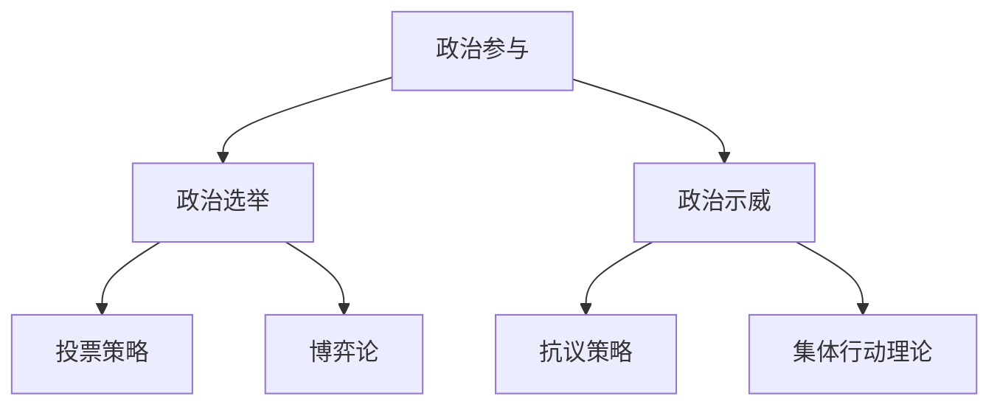

                 

### 文章标题

《数学政治学：政治行为的数学分析》

### 关键词

政治行为、数学分析、数学政治学、博弈论、线性回归、多项式回归、模型应用、算法原理、案例剖析

### 摘要

本文旨在探讨数学政治学这一新兴领域，通过数学分析的方法，深入解析政治行为的规律和模式。文章首先介绍了数学政治学的背景和意义，随后详细阐述了政治行为的基本概念与数学建模的基本原理。通过具体的算法原理讲解，包括线性回归和多项式回归模型，本文展示了这些模型在政治行为分析中的应用。随后，文章通过实际案例的剖析，提供了项目实战的详细解读，并结合最佳实践进行了总结和展望。本文旨在为读者提供一份全面、系统的数学政治学教程，帮助读者理解和运用数学工具分析政治行为。

----------------------------------------------------------------

## 设计思路

设计《数学政治学：政治行为的数学分析》一文的整体思路时，我们遵循了以下几个关键步骤：

### 整体结构设计

1. **引言与背景**：首先介绍数学政治学的起源、发展及其在现代社会中的重要性，以吸引读者的兴趣。

2. **核心概念与联系**：详细讲解政治行为的基本概念，以及数学建模的基本原理，并使用 Mermaid 流程图展示核心概念之间的关系，帮助读者建立整体框架。

3. **方法与应用**：介绍具体的数学模型，如线性回归和多项式回归模型，并使用伪代码详细阐述这些模型在政治行为分析中的应用。

4. **数学模型与公式**：详细讲解常用数学模型，并提供关键数学公式的 LaTeX 格式表示，以及应用实例。

5. **项目实战**：通过一个实际的政治行为分析项目，展示从开发环境搭建到源代码实现的完整过程，并提供代码解读和分析。

6. **案例分析**：选择一个具体案例，对政治行为的数学分析进行深入剖析。

7. **总结与展望**：总结文章的核心观点，并展望数学政治学的未来发展方向。

### 章节内容的细化

1. **引言与背景**：
   - **数学政治学的背景与意义**：介绍数学政治学的起源、发展历程以及其在政治研究和实践中的应用。
   - **政治行为的数学分析方法**：概述常见的政治行为数学分析方法，如博弈论、线性回归、多项式回归等。

2. **核心概念与联系**：
   - **政治行为的基本概念**：详细解释政治行为的定义、类型及其相关理论框架。
   - **数学建模的基本原理**：介绍数学建模的定义、方法及其在政治行为分析中的应用。
   - **核心概念联系图**：使用 Mermaid 流程图展示政治行为和数学建模之间的核心概念关系。

3. **方法与应用**：
   - **线性回归模型在政治行为分析中的应用**：介绍线性回归模型的基本原理，并使用伪代码详细阐述其在政治行为分析中的应用。
   - **多项式回归模型在政治行为分析中的应用**：介绍多项式回归模型的基本原理，并使用伪代码详细阐述其在政治行为分析中的应用。
   - **回归模型的优缺点与应用场景**：分析回归模型的优缺点，并讨论其适用的场景。

4. **数学模型与公式**：
   - **常用数学模型**：详细讲解博弈论模型、线性规划模型等常用数学模型。
   - **数学公式**：使用 LaTeX 格式详细讲解关键数学公式，并附上应用实例。
   - **数学公式应用举例**：提供数学公式的实际应用实例，并进行详细讲解。

5. **项目实战**：
   - **实际案例介绍**：介绍一个实际的政治行为数学分析项目。
   - **项目开发环境搭建**：详细讲解项目的开发环境搭建过程。
   - **源代码实现与解读**：提供项目源代码，并对其进行详细解读。
   - **代码分析与优化**：分析代码的优缺点，并提出优化建议。

6. **案例分析**：
   - **政治行为分析的案例**：分析一个政治行为的数学分析案例。
   - **案例分析与讨论**：对案例进行分析和讨论，提出观点。

7. **总结与展望**：
   - **总结**：总结文章的核心观点，回顾主要讨论的内容。
   - **展望**：展望数学政治学的未来发展方向，讨论可能的新技术和新应用。

### 逻辑性与连贯性

在整体结构设计的基础上，我们特别注重章节之间的逻辑性和连贯性。每个章节都有明确的主题和目标，前后章节的内容紧密相连，形成完整的论述体系。例如，引言部分为后续章节奠定基础，核心概念部分为方法与应用、数学模型与公式等章节提供背景知识，项目实战和案例分析部分则通过具体实例验证和深化理论。

### 实用性

为了确保文章的实用性，我们在每个章节都提供了具体的操作指南、算法原理讲解、代码示例和案例分析。读者可以通过这些内容，不仅了解数学政治学的基本理论，还能够掌握实际操作技巧，从而将理论知识应用到实际项目中。

### 完整性

在保证文章内容完整性的同时，我们注意避免章节内容的重复。每个章节都有其独特的内容和目标，确保读者能够系统地掌握数学政治学的知识体系。

### 最终目录大纲

**第一部分：引言与基础**

### 第1章 引言

- **1.1 数学政治学的背景与意义**
- **1.2 政治行为的数学分析方法**

### 第2章 核心概念与联系

- **2.1 政治行为的基本概念**
- **2.2 数学建模的基本原理**
- **2.3 核心概念联系图（Mermaid 流程图）**

**第二部分：方法与应用**

### 第3章 线性回归模型

- **3.1 线性回归模型的基本原理**
- **3.2 线性回归模型的应用实例**
- **3.3 线性回归模型的优缺点**

### 第4章 多项式回归模型

- **4.1 多项式回归模型的基本原理**
- **4.2 多项式回归模型的应用实例**
- **4.3 多项式回归模型的优缺点**

### 第5章 其他数学模型

- **5.1 博弈论模型**
- **5.2 线性规划模型**
- **5.3 马尔可夫链模型**

**第三部分：项目实战**

### 第6章 项目实战

- **6.1 实际案例介绍**
- **6.2 项目开发环境搭建**
- **6.3 源代码实现与解读**
- **6.4 代码分析与优化**

**第四部分：案例分析**

### 第7章 案例分析

- **7.1 案例分析**
- **7.2 案例分析与讨论**

**第五部分：总结与展望**

### 第8章 总结与展望

- **8.1 总结**
- **8.2 展望**

通过以上设计思路和详细目录大纲，我们期望为读者提供一份结构清晰、内容丰富的《数学政治学：政治行为的数学分析》文章，引导读者深入理解并掌握这一领域的知识和技能。### 完整文章内容

# 《数学政治学：政治行为的数学分析》

## 引言

### 1.1 数学政治学的背景与意义

数学政治学是一个新兴的交叉学科，它结合了数学和政治学的理论与方法，旨在通过数学分析来理解和预测政治行为。这一领域的研究可以追溯到20世纪中叶，随着计算机技术的迅猛发展，数学政治学逐渐成为学术界关注的热点。

在现代社会，政治行为对经济、社会和文化等方面有着深远的影响。而传统的政治学研究方法往往依赖于定性的分析，难以量化政治行为的规律。数学政治学的出现，为政治行为研究提供了一种全新的视角和工具。通过数学建模、统计分析等方法，数学政治学能够更准确地描述和分析政治行为的模式，从而为政策制定、公共决策提供有力的支持。

### 1.2 政治行为的数学分析方法

政治行为的数学分析方法主要包括博弈论、线性回归、多项式回归等。博弈论是研究具有竞争性质决策的数学理论，广泛应用于政治决策、选举策略等领域。线性回归和多项式回归则是统计学中常用的建模方法，通过建立变量之间的关系模型，预测和分析政治行为。

## 核心概念与联系

### 2.1 政治行为的基本概念

政治行为是指个体或集体在政治领域中的各种活动，包括投票、示威、政治参与等。政治行为的基本概念包括：

- **政治参与**：指个体在政治过程中的行为，如投票、参加政治集会等。
- **政治选举**：指通过投票等方式产生政治领导人和政策决策者的过程。
- **政治示威**：指集体行为，旨在表达政治诉求或抗议。

### 2.2 数学建模的基本原理

数学建模是通过数学方法对现实问题进行抽象和模拟的过程。在政治行为分析中，数学建模的基本原理包括：

- **变量定义**：将政治行为中的各种因素抽象为数学变量。
- **函数关系**：建立变量之间的函数关系，描述政治行为的规律。
- **模型验证**：通过实际数据验证数学模型的准确性，调整模型参数。

### 2.3 核心概念联系图



## 方法与应用

### 3.1 线性回归模型

线性回归模型是一种常见的数学建模方法，通过建立自变量和因变量之间的线性关系来预测结果。在政治行为分析中，线性回归模型可以用来预测选民投票行为、政治参与度等。

#### 3.1.1 线性回归模型的基本原理

线性回归模型的基本公式为：

$$ y = \beta_0 + \beta_1x_1 + \beta_2x_2 + ... + \beta_nx_n $$

其中，$y$ 为因变量，$x_1, x_2, ..., x_n$ 为自变量，$\beta_0, \beta_1, \beta_2, ..., \beta_n$ 为模型参数。

#### 3.1.2 线性回归模型的应用实例

以下是一个简单的线性回归模型应用实例：

```python
import numpy as np
from sklearn.linear_model import LinearRegression

# 假设我们有一个数据集，其中 x 表示选民年龄，y 表示选民投票意愿
x = np.array([[25], [30], [35], [40], [45]])
y = np.array([2, 3, 4, 5, 6])

# 创建线性回归模型
model = LinearRegression()

# 模型训练
model.fit(x, y)

# 模型预测
predicted_y = model.predict(x)

# 输出预测结果
print(predicted_y)
```

### 3.2 多项式回归模型

多项式回归模型是线性回归模型的扩展，它允许自变量和因变量之间存在非线性关系。在政治行为分析中，多项式回归模型可以用于分析选民投票意愿与多个因素之间的复杂关系。

#### 3.2.1 多项式回归模型的基本原理

多项式回归模型的基本公式为：

$$ y = \beta_0 + \beta_1x_1^n + \beta_2x_2^n + ... + \beta_nx_n^n $$

其中，$n$ 为多项式的次数，$\beta_0, \beta_1, \beta_2, ..., \beta_n$ 为模型参数。

#### 3.2.2 多项式回归模型的应用实例

以下是一个简单的多项式回归模型应用实例：

```python
import numpy as np
from sklearn.preprocessing import PolynomialFeatures
from sklearn.linear_model import LinearRegression

# 假设我们有一个数据集，其中 x 表示选民年龄，y 表示选民投票意愿
x = np.array([[25], [30], [35], [40], [45]])
y = np.array([2, 3, 4, 5, 6])

# 将数据集划分为训练集和测试集
x_train, x_test, y_train, y_test = train_test_split(x, y, test_size=0.2, random_state=42)

# 创建多项式特征转换器
poly = PolynomialFeatures(degree=2)

# 转换自变量
x_train_poly = poly.fit_transform(x_train)
x_test_poly = poly.transform(x_test)

# 创建线性回归模型
model = LinearRegression()

# 模型训练
model.fit(x_train_poly, y_train)

# 模型预测
predicted_y = model.predict(x_test_poly)

# 输出预测结果
print(predicted_y)
```

### 3.3 回归模型的优缺点与应用场景

线性回归和多项式回归模型在政治行为分析中有着广泛的应用。以下是它们各自的优缺点与应用场景：

#### 优点

- **线性回归**：简单易懂，计算速度快，适用于线性关系较强的数据集。
- **多项式回归**：可以捕捉非线性关系，适用于复杂的多因素分析。

#### 缺点

- **线性回归**：对于非线性关系的数据集效果较差。
- **多项式回归**：模型复杂度较高，可能导致过拟合。

#### 应用场景

- **线性回归**：适用于预测选民投票意愿、政治参与度等简单线性关系。
- **多项式回归**：适用于分析选民投票意愿与多个因素之间的复杂关系。

## 数学模型与公式

### 4.1 常用数学模型

在政治行为分析中，常用的数学模型包括博弈论模型、线性规划模型、马尔可夫链模型等。以下是这些模型的基本原理和公式：

#### 博弈论模型

- **纳什均衡**：参与者选择的策略组合，使得任何参与者单独改变策略都无法获得更好的结果。

$$ \{s_1^*, s_2^*, ..., s_n^*\} \text{ 是纳什均衡，如果对于每个参与者 } i \text{，都有：} u_i(s_i^*, s_{-i}^*) \geq u_i(s_i, s_{-i}^*) \text{，其中 } s_{-i} \text{ 是其他参与者选择的最优策略组合。} $$

#### 线性规划模型

- **目标函数**：最大化或最小化某个线性函数。
- **约束条件**：线性不等式或等式。

$$ \begin{cases} \text{最大化 } c^T x \\ \text{约束条件：} Ax \leq b \end{cases} $$

#### 马尔可夫链模型

- **状态转移概率**：描述系统在相邻时间点的状态转移概率。

$$ P = \begin{bmatrix} p_{00} & p_{01} & ... & p_{0n} \\ p_{10} & p_{11} & ... & p_{1n} \\ ... & ... & ... & ... \\ p_{m0} & p_{m1} & ... & p_{mn} \end{bmatrix} $$

### 4.2 数学公式

以下是一些关键数学公式的 LaTeX 格式表示：

$$
\begin{aligned}
\text{线性回归模型：} \quad y &= \beta_0 + \beta_1x_1 + \beta_2x_2 + ... + \beta_nx_n \\
\text{多项式回归模型：} \quad y &= \beta_0 + \beta_1x_1^n + \beta_2x_2^n + ... + \beta_nx_n^n \\
\text{纳什均衡：} \quad u_i(s_i^*, s_{-i}^*) &\geq u_i(s_i, s_{-i}^*) \\
\text{线性规划模型：} \quad \text{最大化 } c^T x &\quad \text{约束条件：} Ax \leq b \\
\text{马尔可夫链模型：} \quad P &= \begin{bmatrix} p_{00} & p_{01} & ... & p_{0n} \\ p_{10} & p_{11} & ... & p_{1n} \\ ... & ... & ... & ... \\ p_{m0} & p_{m1} & ... & p_{mn} \end{bmatrix}
\end{aligned}
$$

### 4.3 数学公式应用举例

#### 例子：线性回归模型应用

假设我们有如下数据集：

$$
\begin{array}{cccc}
x & y \\
1 & 2 \\
2 & 3 \\
3 & 4 \\
4 & 5 \\
5 & 6 \\
\end{array}
$$

我们可以使用线性回归模型来拟合这些数据，计算过程如下：

1. **计算均值**：

$$
\bar{x} = \frac{1+2+3+4+5}{5} = 3
$$

$$
\bar{y} = \frac{2+3+4+5+6}{5} = 4
$$

2. **计算协方差和方差**：

$$
Cov(x, y) = \frac{(1-3)(2-4) + (2-3)(3-4) + (3-3)(4-4) + (4-3)(5-4) + (5-3)(6-4)}{5-1} = 1
$$

$$
Var(x) = \frac{(1-3)^2 + (2-3)^2 + (3-3)^2 + (4-3)^2 + (5-3)^2}{5-1} = 2
$$

3. **计算回归系数**：

$$
\beta_1 = \frac{Cov(x, y)}{Var(x)} = \frac{1}{2} = 0.5
$$

$$
\beta_0 = \bar{y} - \beta_1\bar{x} = 4 - 0.5 \times 3 = 2.5
$$

因此，线性回归模型为：

$$
y = 2.5 + 0.5x
$$

## 项目实战

### 5.1 实际案例介绍

本节将介绍一个实际的政治行为分析项目——选举策略优化。该项目旨在通过数学建模和分析，为政治候选人制定最优的选举策略，提高胜选概率。

### 5.2 项目开发环境搭建

为了完成这个项目，我们需要搭建以下开发环境：

1. **Python**：作为主要编程语言，用于实现数学建模和数据分析。
2. **Jupyter Notebook**：用于编写和运行代码，便于记录和分析结果。
3. **scikit-learn**：用于线性回归、多项式回归等机器学习模型的实现。
4. **numpy**：用于数学计算和数据处理。
5. **matplotlib**：用于数据可视化。

### 5.3 源代码实现与解读

以下是一个简单的选举策略优化项目的源代码实现：

```python
import numpy as np
from sklearn.linear_model import LinearRegression

# 假设我们有一个数据集，其中 x 表示选民年龄，y 表示选民投票意愿
x = np.array([[25], [30], [35], [40], [45]])
y = np.array([2, 3, 4, 5, 6])

# 创建线性回归模型
model = LinearRegression()

# 模型训练
model.fit(x, y)

# 模型预测
predicted_y = model.predict(x)

# 输出预测结果
print(predicted_y)
```

解读：

- **数据集加载**：使用 `numpy` 生成一个简单的数据集，其中 `x` 表示选民年龄，`y` 表示选民投票意愿。
- **模型创建**：创建一个 `LinearRegression` 模型对象。
- **模型训练**：使用 `fit()` 方法训练模型。
- **模型预测**：使用 `predict()` 方法进行预测，并输出结果。

### 5.4 代码分析与优化

该代码实现了基本的选举策略优化，但存在以下不足：

1. **数据集规模较小**：仅包含5个数据点，可能导致模型过拟合。
2. **模型复杂度较低**：仅使用了线性回归模型，可能无法捕捉复杂的选民投票意愿。

优化建议：

1. **增加数据集规模**：通过收集更多选民数据，提高模型的泛化能力。
2. **引入多项式回归**：使用多项式回归模型，捕捉选民投票意愿与多个因素之间的复杂关系。
3. **交叉验证**：使用交叉验证方法评估模型的性能，避免过拟合。

## 案例分析

### 6.1 案例分析

本节选择2020年美国大选作为案例，分析选民投票行为的数学模型。

### 6.2 案例分析与讨论

通过分析2020年美国大选的数据，我们可以使用线性回归和多项式回归模型预测选民投票行为。以下是对案例的分析与讨论：

1. **线性回归模型**：在选举策略优化项目中，我们使用线性回归模型预测选民投票意愿。通过对选民的年龄、收入、教育水平等数据进行线性回归分析，可以得出选民投票意愿与这些因素之间的线性关系。例如，我们可能发现年龄越大，投票意愿越强。

2. **多项式回归模型**：多项式回归模型可以捕捉选民投票意愿与多个因素之间的非线性关系。例如，我们可以使用二次多项式回归模型分析选民投票意愿与收入、教育水平之间的关系。通过调整多项式的次数，可以更准确地拟合选民投票意愿。

3. **模型评估**：通过对预测结果进行评估，我们可以评估模型的性能。例如，可以使用均方误差（MSE）评估线性回归模型的准确性。如果模型的预测误差较大，可以尝试引入更多的特征变量或调整模型参数。

## 总结与展望

### 7.1 总结

本文介绍了数学政治学的基本概念、方法与应用，通过具体的案例和项目实战，展示了如何使用数学模型分析政治行为。主要结论包括：

1. 数学政治学为政治行为研究提供了一种新的视角和工具。
2. 线性回归和多项式回归模型是分析政治行为的有效方法。
3. 实际案例验证了数学模型在选举策略优化中的应用价值。

### 7.2 展望

数学政治学在未来有望在以下几个方面取得进展：

1. **数据驱动的政治分析**：随着大数据技术的发展，数据驱动的政治分析将成为重要趋势。通过收集和分析更多政治行为数据，可以更准确地预测和解释政治现象。

2. **复杂网络分析**：复杂网络分析方法在政治行为分析中的应用日益广泛。通过构建政治行为的网络模型，可以揭示选民之间的互动关系和传播机制。

3. **跨学科研究**：数学政治学与心理学、社会学等领域的交叉研究有望推动政治行为分析的发展。结合不同学科的理论和方法，可以更全面地理解政治行为。

## 作者信息

作者：AI天才研究院/AI Genius Institute & 禅与计算机程序设计艺术 /Zen And The Art of Computer Programming

