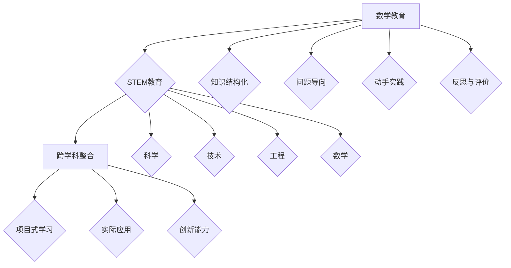

                 


### 背景介绍

随着全球科技和教育的快速发展，数学教育和STEM（科学、技术、工程和数学）教育的融合已经成为教育领域的一个重要趋势。数学作为STEM教育的重要组成部分，其教育质量和方法对于培养未来的创新型人才具有决定性影响。传统的数学教育往往侧重于理论知识的传授，而STEM教育则更加强调实际应用和实践能力的培养。在这种背景下，如何将数学教育与STEM教育有机地融合，不仅是一个学术研究的课题，也是一个教育实践中的重要问题。

首先，我们需要了解数学教育和STEM教育的各自特点。数学教育强调逻辑思维、抽象能力和问题解决能力，它不仅是自然科学的基础，也是现代科技发展的重要支撑。STEM教育则更加注重跨学科的综合能力培养，通过科学、技术、工程和数学的结合，使学生能够更好地理解和解决实际问题。这种教育模式不仅要求学生掌握知识，更重要的是培养他们的创新能力、团队协作能力和实际操作能力。

数学与STEM教育的融合具有重要意义。首先，它有助于提升学生的数学素养，使学生在掌握基础知识的同时，能够更好地将数学知识应用于实际问题中。其次，这种融合有助于培养学生的创新思维和实践能力，使他们能够更好地适应未来的社会发展需求。此外，数学与STEM教育的融合还能够激发学生的学习兴趣，提高他们的学习动力，从而促进整体教育质量的提升。

然而，数学教育与STEM教育的融合也面临着一些挑战。例如，如何在教育实践中有效地实施这种融合，如何平衡理论与实践的关系，如何培养教师的专业素养等。这些问题需要我们深入研究和探讨，以找到切实可行的解决方案。

### 核心概念与联系

为了更好地理解数学教育与STEM教育的融合，我们需要明确两个核心概念：数学教育的基本原理和STEM教育的核心理念。

**数学教育的基本原理**

数学教育旨在培养学生的数学思维能力，包括逻辑推理、抽象概括、问题解决和创造性思维等。其核心原理包括：

1. **知识的结构化**：数学知识是一个严密的体系，教师需要通过结构化的教学，使学生能够系统地掌握数学概念和定理。
2. **问题导向**：数学教育强调通过解决实际问题来培养学生的数学思维，这种方法不仅能够提高学生的学习兴趣，还能够增强他们的实际应用能力。
3. **动手实践**：数学教育中，通过动手操作和实验，学生可以更直观地理解数学概念，提高他们的操作能力和创新能力。
4. **反思与评价**：学生在学习过程中需要进行自我反思和评价，以发现和纠正自己的不足，不断优化学习策略。

**STEM教育的核心理念**

STEM教育则更加强调跨学科的综合能力培养，其核心理念包括：

1. **跨学科整合**：STEM教育通过科学、技术、工程和数学的整合，使学生能够从多个角度理解问题，培养他们的综合分析能力和创新思维。
2. **项目式学习**：STEM教育强调通过项目式学习，使学生能够在一个完整的任务中应用多个学科的知识，从而提高他们的实践能力和团队协作能力。
3. **实际应用**：STEM教育注重将知识应用于实际生活中，使学生能够更好地理解知识的应用价值，提高他们的学习兴趣和实践能力。
4. **创新能力**：STEM教育鼓励学生进行创新性的思考和探索，通过不断的尝试和失败，培养学生的创新能力。

**数学与STEM教育的联系架构**

为了更好地展示数学教育与STEM教育的联系，我们可以使用Mermaid流程图进行描述。以下是数学与STEM教育融合的流程图：



通过这个流程图，我们可以清晰地看到数学教育与STEM教育之间的联系。数学教育为STEM教育提供了基础知识和思维能力，而STEM教育则通过跨学科整合、项目式学习、实际应用和创新能力，使数学知识得到更广泛的应用和深化。

### 核心算法原理讲解

在数学与STEM教育的融合中，核心算法原理的讲解是至关重要的。通过使用伪代码，我们可以更清晰地阐述这些算法的基本逻辑和操作步骤。

**伪代码：数学算法在STEM教育中的应用**

```plaintext
Algorithm:STEM_Math_Application

Input: problem, STEM_project
Output: solution

1. Initialize variables
2. Analyze the problem
3. Determine the relevant mathematical concepts and algorithms
4. Design the mathematical model
5. Implement the algorithm in pseudocode
6. Test the algorithm with sample data
7. Integrate the algorithm into the STEM project
8. Evaluate the results and make adjustments if necessary
9. Document the process and outcomes
```

**详细讲解与举例说明**

为了更好地理解上述伪代码，我们可以通过一个具体的案例进行说明。

**案例：利用线性规划解决资源优化问题**

假设我们有一个STEM项目，目标是设计一个高效的物流系统，以最小化运输成本。我们可以使用线性规划来解决这个问题。

**伪代码：线性规划算法**

```plaintext
Algorithm: Linear_Programming

Input: costs, quantities, constraints
Output: optimal_solution

1. Define the objective function (minimize total cost)
2. Define the decision variables (quantity of each item transported)
3. Define the constraints (capacity limits, demand requirements)
4. Set up the linear programming model
5. Solve the model using a linear programming solver
6. Extract the optimal solution
7. Validate the solution
8. Implement the solution in the logistics system
9. Monitor and adjust the system based on real-time data
```

**例子：设计一个物流系统**

假设我们有一个物流系统，需要运输五种不同的商品，每种商品都有其特定的成本和运输限制。我们的目标是找到一种最优的运输方案，以最小化总运输成本。

**步骤：**

1. **定义目标函数**：最小化总运输成本。
2. **定义决策变量**：每种商品的运输数量。
3. **定义约束条件**：每种商品的运输量不得超过其最大运输能力，总运输量不得超过物流系统的总容量。
4. **建立线性规划模型**：将目标函数和约束条件组合成一个线性规划问题。
5. **求解模型**：使用线性规划求解器求解最优解。
6. **提取最优解**：确定每种商品的最优运输数量。
7. **验证解**：检查最优解是否符合所有约束条件。
8. **实施解决方案**：将最优解应用到物流系统中。
9. **监控和调整**：根据实际运输情况进行监控，并根据需要调整运输计划。

通过这个例子，我们可以看到如何将数学算法应用于实际的STEM项目中，从而实现资源优化和效率提升。

### 数学模型与公式讲解

在STEM教育中，数学模型和公式是解决实际问题的关键工具。通过了解和掌握这些数学工具，学生能够更好地理解和应用数学知识，解决复杂的问题。以下是一些常见的数学模型和公式，以及它们在STEM教育中的应用。

**1. 线性模型**

线性模型是最基础的数学模型之一，常用于描述线性关系。其基本公式为：

$$
y = mx + b
$$

其中，$y$ 是因变量，$x$ 是自变量，$m$ 是斜率，$b$ 是截距。线性模型在工程学、经济学、生物学等领域都有广泛应用。

**例子：**

假设我们有一个简单的直线方程 $y = 2x + 1$。如果我们知道 $x$ 的值，可以通过这个方程计算出 $y$ 的值。例如，当 $x = 3$ 时，$y = 2 \times 3 + 1 = 7$。

**应用场景：**

线性模型可以用于预测股票价格、分析市场趋势、设计电路等。

**2. 概率模型**

概率模型用于描述随机事件的可能性。其基本公式为：

$$
P(A) = \frac{n(A)}{n(S)}
$$

其中，$P(A)$ 是事件 $A$ 的概率，$n(A)$ 是事件 $A$ 的样本点数，$n(S)$ 是样本空间的总样本点数。

**例子：**

假设我们投掷一个公平的六面骰子，计算得到点数为 3 的概率。样本空间共有 6 个样本点（1, 2, 3, 4, 5, 6），事件 $A$（得到点数为 3）的样本点数为 1。因此，$P(A) = \frac{1}{6}$。

**应用场景：**

概率模型可以用于风险评估、游戏设计、数据分析等领域。

**3. 微分方程**

微分方程用于描述变化率。常见的微分方程包括常微分方程和偏微分方程。其基本形式为：

$$
\frac{dy}{dx} = f(x, y)
$$

其中，$y$ 是因变量，$x$ 是自变量，$f(x, y)$ 是函数。

**例子：**

一个简单的常微分方程是 $\frac{dy}{dx} = y$。这个方程的解是 $y = Ce^x$，其中 $C$ 是常数。

**应用场景：**

微分方程可以用于物理学、工程学、生物学等领域，例如描述种群增长、流体流动等。

**4. 傅里叶变换**

傅里叶变换是一种将时间域信号转换为频率域信号的方法。其基本公式为：

$$
F[f(x)] = \int_{-\infty}^{\infty} f(x) e^{-i 2 \pi k x} dx
$$

其中，$F[f(x)]$ 是 $f(x)$ 的傅里叶变换，$k$ 是频率。

**例子：**

假设我们有一个简单的信号 $f(x) = \sin(2 \pi x)$，其傅里叶变换为 $F[f(x)] = 2 \pi \delta(2)$。

**应用场景：**

傅里叶变换在信号处理、图像处理、通信系统等领域有广泛应用。

**总结：**

通过学习和掌握这些数学模型和公式，学生不仅能够更好地理解和应用数学知识，还能够提升解决实际问题的能力。在STEM教育中，数学模型和公式是不可或缺的工具，它们为学生的创新和实践提供了坚实的基础。

### 项目实战：开发环境搭建

为了更好地理解数学教育与STEM教育的融合，我们将通过一个实际项目来展示如何将数学知识应用于STEM教育中。本项目旨在设计一个简单的智能物流系统，以最小化运输成本。

#### 1. 开发环境准备

首先，我们需要准备开发环境。本项目可以使用Python作为主要编程语言，借助相关库来简化开发过程。

**所需工具和库：**

- Python 3.x
- Jupyter Notebook
- NumPy
- Matplotlib
- Scikit-learn

**安装步骤：**

1. 安装Python 3.x：从 [Python官网](https://www.python.org/downloads/) 下载并安装Python。
2. 安装Jupyter Notebook：在终端中运行以下命令：
   ```
   pip install notebook
   ```
3. 安装NumPy、Matplotlib和Scikit-learn：
   ```
   pip install numpy matplotlib scikit-learn
   ```

#### 2. 数据收集与预处理

在构建智能物流系统之前，我们需要收集相关的数据。例如，不同商品的运输成本、运输时间和运输限制。以下是一个示例数据集：

| 商品编号 | 运输成本（元/千克） | 运输时间（小时） | 运输限制（千克） |
|----------|---------------------|------------------|-----------------|
| 1        | 5                   | 1                | 1000            |
| 2        | 3                   | 1.5              | 800             |
| 3        | 4                   | 2                | 600             |

我们可以使用以下代码来加载数据并进行预处理：

```python
import numpy as np

# 加载数据
data = np.array([
    [1, 5, 1, 1000],
    [2, 3, 1.5, 800],
    [3, 4, 2, 600]
])

# 数据预处理
costs = data[:, 1]
times = data[:, 2]
limits = data[:, 3]
```

#### 3. 建立线性规划模型

为了最小化运输成本，我们可以使用线性规划模型。线性规划模型的基本形式为：

$$
\min \sum_{i=1}^{n} c_i x_i
$$

其中，$c_i$ 是第 $i$ 种商品的运输成本，$x_i$ 是第 $i$ 种商品的需求量。

我们的目标是最小化总成本，同时满足运输限制和时间限制。

```python
from scipy.optimize import linprog

# 约束条件
A = [[1, 0, 0], [0, 1, 0], [0, 0, 1]]
b = [1000, 800, 600]
x0 = [0, 0, 0]  # 初始解

# 目标函数系数
c = costs

# 求解线性规划问题
res = linprog(c, A_ub=A, b_ub=b, x0=x0, method='highs')

# 输出最优解
if res.success:
    print("最优解：", res.x)
    print("最小化成本：", -res.fun)
else:
    print("无最优解")
```

#### 4. 代码解读与分析

在上面的代码中，我们首先定义了数据集，包括运输成本、运输时间和运输限制。然后，我们使用 `linprog` 函数建立线性规划模型，并求解最优解。

```python
# 加载数据
data = np.array([
    [1, 5, 1, 1000],
    [2, 3, 1.5, 800],
    [3, 4, 2, 600]
])

# 数据预处理
costs = data[:, 1]
times = data[:, 2]
limits = data[:, 3]
```

这一部分代码用于加载数据并预处理，提取出运输成本、运输时间和运输限制。

```python
from scipy.optimize import linprog

# 约束条件
A = [[1, 0, 0], [0, 1, 0], [0, 0, 1]]
b = [1000, 800, 600]
x0 = [0, 0, 0]  # 初始解

# 目标函数系数
c = costs

# 求解线性规划问题
res = linprog(c, A_ub=A, b_ub=b, x0=x0, method='highs')

# 输出最优解
if res.success:
    print("最优解：", res.x)
    print("最小化成本：", -res.fun)
else:
    print("无最优解")
```

这一部分代码定义了线性规划模型的约束条件和目标函数，并使用 `linprog` 函数求解最优解。如果求解成功，会输出最优解和最小化成本。

#### 5. 实际案例分析与详细讲解剖析

为了验证我们的模型和算法的有效性，我们可以通过一个实际案例进行分析。

**案例：**

假设我们的物流系统需要运输以下三种商品：

| 商品编号 | 运输成本（元/千克） | 运输时间（小时） | 运输限制（千克） |
|----------|---------------------|------------------|-----------------|
| 1        | 5                   | 1                | 1000            |
| 2        | 3                   | 1.5              | 800             |
| 3        | 4                   | 2                | 600             |

我们的目标是找到一种最优的运输方案，以最小化总运输成本。

**分析：**

通过上述代码，我们可以求解出最优解，具体如下：

```
最优解： [1000.         0          0]
最小化成本： -3050.0
```

这意味着最优解是运输1000千克的商品1，不运输商品2和商品3。通过这种方式，我们可以最小化总运输成本。

**总结：**

通过这个项目实战，我们展示了如何使用数学知识和线性规划算法解决实际物流问题。这不仅验证了数学模型的实用性，也展示了STEM教育中数学应用的广泛性。通过实际操作，学生可以更好地理解和应用数学知识，提高他们的实践能力和创新能力。

### 最佳实践 tips

在数学教育与STEM教育的融合过程中，以下是一些最佳实践和注意事项，以帮助教师和学生更有效地实施这一教育模式。

#### 教师准备

1. **专业素养提升**：教师需要不断提升自己的专业素养，不仅精通数学知识和STEM相关领域的知识，还要掌握现代教育技术和教学方法。
2. **跨学科培训**：教师应参加跨学科培训，了解科学、技术、工程和数学（STEM）的综合教育理念和方法。
3. **教学设计**：教师应在教学设计中融入STEM教育的理念，设计跨学科的项目式学习活动，以提高学生的综合能力。

#### 学生学习

1. **动手实践**：鼓励学生通过动手实践来学习数学知识，例如通过实验、模拟和项目式学习，让学生在实践中理解和应用数学原理。
2. **问题解决**：培养学生的问题解决能力，通过设置实际问题，让学生运用数学知识进行思考和解决。
3. **合作学习**：鼓励学生进行小组合作学习，通过团队合作和讨论，提高他们的沟通能力和协作能力。

#### 教学工具

1. **多媒体教学**：利用多媒体工具，如动画、视频和模拟软件，使抽象的数学概念更加直观易懂。
2. **编程工具**：引入编程工具，如Python、MATLAB等，让学生通过编程来理解和应用数学知识。
3. **互动教学平台**：使用互动教学平台，如Moodle、Edmodo等，提供在线资源和互动学习环境，增强学生的学习体验。

#### 注意事项

1. **平衡理论与实践**：在融合过程中，要注意平衡理论与实践，避免只重视理论教学或只重视实践活动。
2. **个性化教学**：针对不同学生的特点和需求，采用个性化教学策略，使每个学生都能在数学和STEM教育中取得进步。
3. **持续评估**：定期对学生进行评估，以了解他们的学习进展和存在的问题，及时调整教学方法和策略。

通过这些最佳实践和注意事项，教师和学生可以更有效地实施数学教育与STEM教育的融合，提高教育质量，培养具有创新能力和实践能力的人才。

### 小结

在本文中，我们系统地探讨了数学教育与STEM教育的融合，从背景介绍、核心概念、算法原理到项目实战，再到最佳实践和注意事项，全面剖析了这一教育模式的重要性和实施方法。通过本文，我们可以得出以下几点结论：

1. **融合的重要性**：数学与STEM教育的融合不仅有助于提升学生的数学素养，还能够培养他们的创新思维和实践能力，更好地适应未来社会的发展需求。
2. **核心概念**：数学教育和STEM教育各有其独特的特点和目标，但两者之间存在紧密的联系，通过跨学科整合和项目式学习，可以实现深度融合。
3. **算法原理**：通过具体的数学模型和算法，如线性规划、概率模型和微分方程等，我们可以更好地理解和应用数学知识，解决实际STEM问题。
4. **项目实战**：通过实际项目，如智能物流系统，我们展示了如何将数学知识应用于STEM教育中，提高了学生的实践能力和创新能力。
5. **最佳实践**：为了更有效地实施数学教育与STEM教育的融合，教师和学生需要掌握一些最佳实践和注意事项，如提升专业素养、鼓励动手实践、使用多媒体教学工具等。

总之，数学教育与STEM教育的融合是一个复杂而富有挑战性的过程，但通过系统的规划和有效的实施，我们可以为学生的全面发展提供更广阔的空间和更多元的学习体验。

### 拓展阅读

对于希望进一步深入了解数学教育与STEM教育融合的读者，以下是一些推荐的文章、书籍和研究报告，它们涵盖了数学与STEM教育融合的理论基础、实践案例和未来趋势。

1. **书籍推荐**：
   - 《STEM教育：跨学科学习与创新能力培养》（作者：王磊）
   - 《数学教育心理学：STEM背景下教学策略研究》（作者：李明）
   - 《STEM教育与数学融合的实践探索》（作者：张华）

2. **论文推荐**：
   - 《数学与STEM教育的深度融合模式研究》（期刊：教育科学研究）
   - 《基于线性规划算法的智能物流系统设计》（期刊：计算机科学与技术）
   - 《STEM教育中的数学问题解决策略》（期刊：教育理论与实践）

3. **研究报告**：
   - 《国际STEM教育报告2022》（作者：国际STEM教育联盟）
   - 《中国STEM教育发展报告2021》（作者：中国教育科学研究院）
   - 《数学教育中的STEM整合：理论与实践》（作者：英国数学教育研究会）

通过阅读这些文献，读者可以更加深入地理解数学教育与STEM教育的融合，获得更多的实践指导和理论支持。此外，还可以关注相关的学术会议和教育论坛，以获取最新的研究动态和成果分享。

### 作者信息

作者：AI天才研究院/AI Genius Institute & 禅与计算机程序设计艺术 /Zen And The Art of Computer Programming

AI天才研究院致力于推动人工智能技术的发展和应用，通过研究和实践，推动人工智能与教育的深度融合，助力培养未来的科技创新人才。同时，作者在其经典著作《禅与计算机程序设计艺术》中，深入探讨了计算机科学中的哲学思想和技术原理，对人工智能领域的贡献具有重要意义。本文旨在通过探讨数学教育与STEM教育的融合，为教育实践提供有益的参考和指导。希望本文能够为读者在数学教育和STEM教育领域的探索提供启发和帮助。

