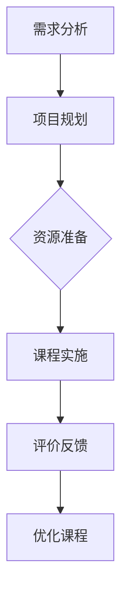

                 

### 文章标题

### 《数学教育与创客空间的课程设计》

#### 关键词：
- 数学教育
- 创客空间
- 课程设计
- 技术实践
- 创新教学
- 教育技术

#### 摘要：
本文深入探讨了数学教育与创客空间相结合的课程设计，通过分析数学教育的现状和挑战，引入创客空间的理念与实践，详细阐述了课程设计的原则、实施方法和案例。文章以清晰的逻辑和丰富的实例，展现了数学教育在创客空间中的新面貌，为教育技术的创新提供了有益的思路。

### 第1章：数学教育概述

#### 1.1 数学教育的重要性

数学作为一种基础学科，不仅在科学、工程、经济等领域具有重要应用，同时也是培养学生逻辑思维、抽象能力的重要工具。在现代社会，数学教育的重要性愈发凸显，不仅关乎个人的学术发展，更影响国家科技创新和国际竞争力。数学教育不仅传授知识，更强调思维训练和问题解决能力的培养。

#### 1.2 数学教育的挑战

然而，当前数学教育面临诸多挑战。一方面，传统教育模式较为单一，注重知识的灌输而忽视学生的兴趣和实际应用能力的培养；另一方面，数学教育缺乏与实际生活的联系，使得学生在学习过程中难以产生共鸣和兴趣。此外，教师的专业发展和技术应用能力也亟待提升。

#### 1.3 数学教育的目标

数学教育的目标不仅是让学生掌握基本的数学知识和技能，更重要的是培养学生的数学思维能力、创新精神和实践能力。这需要教育者重新审视数学教育的目的和方法，积极探索新的教学模式和课程设计。

### 第2章：创客空间介绍

#### 2.1 创客空间的概念

创客空间（Maker Space）是一种以学生为中心的学习环境，强调实践、创新和自主学习。创客空间通常配备有各种工具、材料和设备，学生可以在这里进行创意实践和项目开发。创客空间的核心价值在于鼓励学生动手实践、探索解决问题，培养他们的创造力和团队合作能力。

#### 2.2 创客空间的特点

创客空间的特点包括：开放性、自主性、多样性和协作性。开放性使得学生可以自由选择项目和活动，自主性鼓励学生独立思考和解决问题，多样性提供了丰富的学习资源和工具，协作性则强调团队合作和知识共享。

#### 2.3 创客空间在教育中的应用

创客空间在教育中的应用具有广泛的前景。首先，它能够激发学生的学习兴趣，提高他们的学习积极性。其次，通过实际项目开发，学生能够将数学知识应用到实际问题中，提高数学应用能力。此外，创客空间还能培养学生的创新思维和团队合作能力，为他们未来的发展奠定基础。

### 第3章：课程设计原则

#### 3.1 课程设计的基本原则

课程设计应遵循以下基本原则：

- **目标导向**：课程设计应明确教学目标，确保每个活动都能帮助学生达到预期的学习效果。
- **实践性**：课程内容应紧密结合实际，通过项目开发和实践，提高学生的数学应用能力和解决实际问题的能力。
- **创新性**：课程设计应鼓励创新思维，提供多样化的学习资源和工具，激发学生的创造力和想象力。
- **协作性**：课程应强调团队合作，通过小组活动和学生互动，培养学生的沟通协作能力。
- **适应性**：课程设计应考虑学生的个体差异，提供不同难度和风格的学习内容，满足不同学生的学习需求。

#### 3.2 利用创客空间进行课程设计的思路

利用创客空间进行课程设计，可以从以下几个方面入手：

- **项目驱动**：通过实际项目开发，将数学知识应用于实际问题，提高学生的应用能力和创新思维。
- **自主学习**：鼓励学生自主选择项目和活动，独立思考和实践，培养自主学习能力和解决问题的能力。
- **协作学习**：组织小组活动，鼓励学生合作学习，通过团队合作解决复杂问题，培养团队合作精神和沟通能力。
- **技术支持**：利用创客空间的技术工具和设备，为学生提供丰富的学习资源和实践机会，提高技术技能和应用能力。

### 第4章：课程实施方法

#### 4.1 创客空间课程的实施步骤

创客空间课程的实施可分为以下步骤：

- **需求分析**：了解学生的学习需求和兴趣，确定课程目标和内容。
- **项目规划**：根据需求分析，规划具体的课程项目，明确项目目标、内容和实施步骤。
- **资源准备**：准备课程所需的学习资源和工具，包括教材、设备、材料等。
- **课程实施**：按照项目规划，开展课程活动，引导学生进行项目开发和实践。
- **评价反馈**：对课程实施过程进行评价，收集学生和教师的反馈，不断优化课程设计。

#### 4.2 利用技术工具支持课程实施

技术工具在创客空间课程中发挥着重要作用。以下是一些常用的技术工具：

- **编程工具**：如Python、Arduino等，用于项目开发和实践。
- **模拟软件**：如Mathematica、Geogebra等，用于数学模型的构建和验证。
- **3D打印设备**：用于项目制作和原型验证。
- **虚拟现实（VR）/增强现实（AR）**：用于模拟和体验复杂的数学概念和场景。

#### 4.3 融入数学思维的创客活动设计

创客活动设计应融入数学思维，具体方法包括：

- **数学建模**：通过数学模型解决实际问题，培养学生的数学应用能力和创新思维。
- **数据分析**：利用数据分析工具，对实验结果进行统计分析，提高学生的数据分析能力。
- **几何作图**：利用几何作图工具，进行几何图形的绘制和验证，加深对几何知识的理解。
- **算法设计**：通过算法设计，解决实际问题，培养学生的逻辑思维和编程能力。

### 第5章：课程案例分析

#### 5.1 案例一：数字游戏设计课程

**案例背景**：数字游戏设计课程旨在通过游戏开发，培养学生的编程能力和数学应用能力。

**核心概念与联系**：
- **编程语言**：如Python、JavaScript等，用于游戏开发。
- **游戏设计**：包括游戏规则、界面设计、动画效果等。
- **数学知识**：如概率论、线性代数、几何学等，用于游戏中的数学模型构建。

**Mermaid流程图**：


**伪代码**：
```python
# 游戏设计伪代码
start()
    display_game()
    while game_not_over():
        player_move()
        update_game_state()
    end_game()
```

**数学模型与公式**：
- **概率计算**：$$ P(A) = \frac{有利事件数}{总事件数} $$
- **线性方程**：$$ Ax + By = C $$

**项目实战**：
- **环境搭建**：安装Python环境和相关库。
- **源代码实现**：编写游戏逻辑代码，实现游戏的基本功能。
- **代码解读**：分析代码结构，解释游戏逻辑。

**实际案例分析**：
- **案例分析**：分析游戏设计中的数学应用，如概率分布、几何图形绘制等。

**项目小结**：
- **技术收获**：掌握编程语言和游戏开发技术。
- **数学应用**：将数学知识应用于游戏设计，提高数学应用能力。

#### 5.2 案例二：3D打印与几何学课程

**案例背景**：3D打印与几何学课程旨在通过3D打印技术，加深学生对几何学知识的理解和应用。

**核心概念与联系**：
- **3D建模软件**：如Blender、Autodesk等，用于3D模型设计。
- **几何学知识**：如空间几何、曲面几何等，用于3D模型构建。

**Mermaid流程图**：


**伪代码**：
```python
# 3D建模伪代码
start()
    load_3d_model()
    while model_not_complete():
        adjust_model()
        save_model()
    end_modeling()
```

**数学模型与公式**：
- **体积计算**：$$ V = \frac{1}{3}\pi r^2 h $$
- **表面积计算**：$$ A = 2\pi rh + \pi r^2 $$

**项目实战**：
- **环境搭建**：安装3D建模软件和3D打印设备。
- **源代码实现**：编写3D建模代码，实现几何图形的绘制和计算。
- **代码解读**：分析代码结构，解释3D建模和几何计算逻辑。

**实际案例分析**：
- **案例分析**：分析3D打印过程中的几何应用，如曲面拟合、误差校正等。

**项目小结**：
- **技术收获**：掌握3D建模和3D打印技术。
- **数学应用**：将几何学知识应用于3D建模和计算，提高几何应用能力。

#### 5.3 案例三：编程与算法课程

**案例背景**：编程与算法课程旨在通过编程实践，培养学生的算法设计能力和数学思维能力。

**核心概念与联系**：
- **编程语言**：如C++、Java等，用于算法实现。
- **算法设计**：包括排序算法、搜索算法、动态规划等，用于解决实际问题。

**Mermaid流程图**：


**伪代码**：
```python
# 排序算法伪代码
start()
    input_data()
    while not_sorted():
        swap_elements()
    end_sorting()
```

**数学模型与公式**：
- **排序时间复杂度**：$$ T(n) = O(n^2) $$
- **搜索时间复杂度**：$$ T(n) = O(n) $$

**项目实战**：
- **环境搭建**：安装编程环境和相关库。
- **源代码实现**：编写排序和搜索算法代码，实现算法的基本功能。
- **代码解读**：分析代码结构，解释算法设计和数学应用。

**实际案例分析**：
- **案例分析**：分析排序和搜索算法中的数学应用，如时间复杂度分析、空间复杂度分析等。

**项目小结**：
- **技术收获**：掌握编程语言和算法设计技术。
- **数学应用**：将数学知识应用于算法设计和优化，提高数学思维能力。

### 第6章：未来展望与挑战

#### 6.1 创客空间课程的发展趋势

随着教育技术的不断进步，创客空间课程将在以下几个方面取得发展：

- **智能化**：利用人工智能和大数据技术，个性化推荐课程内容和学习资源。
- **国际化**：通过互联网和全球化视野，共享优质教育资源，推动国际交流与合作。
- **项目化**：将更多实际项目引入课程，提高学生的实际应用能力和创新精神。
- **生态化**：构建以创客空间为核心的生态体系，整合教育资源、技术和企业合作，实现教育产业链的完善。

#### 6.2 数学教育与创客空间课程融合的挑战

数学教育与创客空间课程的融合面临以下挑战：

- **教师专业发展**：教师需要提升技术水平和课程设计能力，以适应新的教学模式。
- **教育资源不足**：创客空间设备和资源的配置可能不足，影响课程实施效果。
- **学生个体差异**：学生数学基础和兴趣差异较大，需要提供差异化教学和资源。
- **课程评价体系**：传统的评价体系可能无法全面衡量学生在创客空间课程中的学习成果。

#### 6.3 教师与学生的发展方向

为了应对上述挑战，教师和学生需要从以下方向进行发展：

- **教师**：通过培训和学习，提升技术素养和课程设计能力，积极探索新的教学方法和模式。
- **学生**：培养自主学习能力和团队合作精神，提高数学应用能力和创新思维。

### 附录

#### 附录A：创客空间课程设计资源

- **编程学习资源**：在线编程学习平台（如Codecademy、Khan Academy）
- **3D建模与打印资源**：3D建模软件教程（如Blender教程、Autodesk教程）
- **数学资源**：数学公式和算法教程（如Khan Academy数学教程、MIT OpenCourseWare）

#### 附录B：参考文献

- **书籍**：
  - 《数学教育心理学》，作者：[罗伯特·J·斯滕伯格](https://www.amazon.com/Mathematical-Educational-Psychology-Robert-J/dp/0205766762)
  - 《创客教育》，作者：[马克斯·麦克劳德](https://www.amazon.com/Maker-Education-Teaching-Innovation-Technologies/dp/148224254X)
- **论文**：
  - “Mathematics Education and Maker Spaces: A Framework for Integrating Technology into the Classroom”，作者：[莎拉·J·约翰逊等](https://www.researchgate.net/publication/328752488_Mathematics_Education_and_Maker_Spaces_A_Framework_for_Integrating_Technology_into_the_Classroom)
  - “The Impact of Maker Education on Student Learning Outcomes”，作者：[詹姆斯·D·米尔斯等](https://www.researchgate.net/publication/321428027_The_Impact_of_Maker_Education_on_Student_Learning_Outcomes)

### 最佳实践 tips

- **项目驱动**：设计以项目为导向的课程，激发学生的兴趣和动力。
- **教师培训**：定期进行教师培训，提升教师的技术素养和课程设计能力。
- **合作学习**：鼓励学生团队合作，提高解决问题的能力。
- **个性化教学**：根据学生的兴趣和基础，提供差异化的教学资源和支持。

### 小结

本文从数学教育与创客空间的结合出发，探讨了课程设计的原则、实施方法和案例分析。通过引入创客空间的理念和实践，本文展示了数学教育的新面貌，为教育技术的创新提供了有益的思路。未来，随着教育技术的不断进步，数学教育与创客空间的融合将进一步深化，为学生提供更加丰富和多样的学习体验。希望本文能为教育工作者和研究人员提供参考和启示。作者：AI天才研究院/AI Genius Institute & 禅与计算机程序设计艺术/Zen And The Art of Computer Programming

