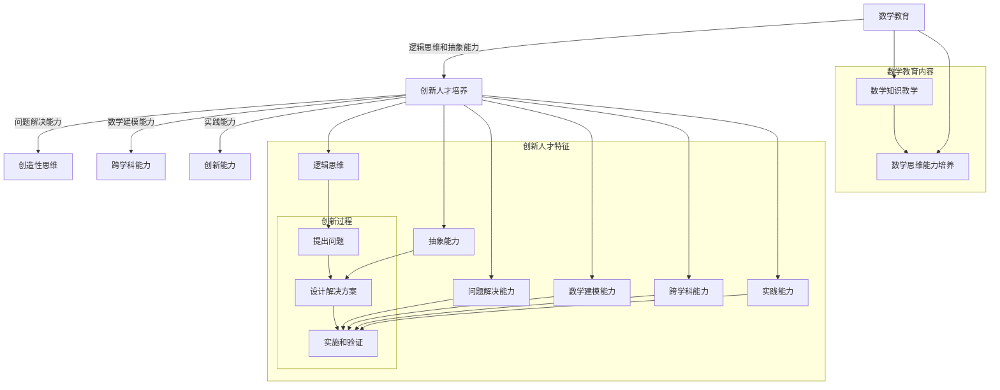

                 

## 引言

在当今世界，数学教育与创新人才培养的关系日益受到广泛关注。随着科技的飞速发展，创新成为了推动社会进步和经济发展的关键力量，而创新人才的培养离不开坚实的数学基础。数学不仅是一门科学，更是一种思维方式，它培养的逻辑思维、抽象能力和问题解决能力，是创新人才培养的重要基石。

本文旨在探讨数学教育与创新人才培养之间的关系，通过详细的分析和逻辑推理，阐述数学教育在创新人才培养中的重要作用。文章将从以下几个方面展开讨论：

1. **数学教育的核心概念与联系**：首先，我们将介绍数学教育的核心概念，如数学知识的教学和数学思维能力的发展，并阐述这些概念与创新人才培养之间的联系。
   
2. **创新人才培养的理论基础**：接着，我们将探讨创新能力的定义与结构，以及创新教育的模式与方法，分析数学教育如何为创新人才培养提供支持。

3. **数学教育与创新人才培养的Mermaid流程图**：我们将使用Mermaid流程图来展示数学教育与创新人才培养之间的关联，帮助读者更直观地理解两者之间的关系。

4. **核心算法原理讲解**：本文将使用伪代码详细阐述与创新人才培养相关的数学算法原理，包括算法的应用场景和优势。

5. **数学模型和公式详细讲解**：我们将介绍数学模型和公式在创新人才培养中的应用，使用latex格式详细解释重要的数学公式，并提供实际案例说明。

6. **项目实战**：我们将通过一个具体的开发环境搭建和源代码实现案例，展示数学教育如何在实际项目中发挥作用。

7. **总结与展望**：最后，我们将对数学教育与创新人才培养的关系进行总结，并提出未来发展的趋势和挑战。

通过上述分析和讨论，本文旨在为读者提供一个全面、深入的视角，理解数学教育在创新人才培养中的关键作用，并探讨如何进一步优化和创新数学教育，以更好地支持创新人才的培养。

## 数学教育的核心概念与联系

数学教育作为基础教育的重要组成部分，其核心概念不仅包括数学知识的传授，更涵盖数学思维能力的发展。这两者共同构成了数学教育的核心框架，对创新人才的培养起到了关键作用。

### 数学知识的教学

数学知识的教学是数学教育的基础。通过系统学习数学概念、定理、公式和解题方法，学生能够建立起扎实的数学基础。这一过程不仅要求学生掌握基本的数学知识，如数论、代数、几何和微积分等，还要求学生能够灵活运用这些知识解决实际问题。

在数学知识的教学中，逻辑推理和证明能力的培养尤为重要。通过学习数学中的逻辑推理规则和证明方法，学生能够培养出严谨的思维习惯和批判性思维能力。这种思维能力在创新人才的培养中具有不可替代的作用，因为创新往往需要打破常规、质疑现状，而这些能力正是基于严谨的逻辑思维。

### 数学思维能力的发展

除了数学知识的教学，数学思维能力的发展是数学教育的另一个核心任务。数学思维是一种抽象的、逻辑的、分析的思维方式，它不仅体现在数学学习中，也在其他学科和日常生活中得到广泛应用。

数学思维能力的发展包括以下几个方面：

1. **抽象能力**：数学是一门抽象的科学，学生需要通过学习数学，培养抽象思维能力。这种能力使他们能够从具体的、复杂的问题中提炼出基本的数学模型和概念，从而更好地理解和解决问题。

2. **逻辑思维能力**：数学是一门逻辑性很强的学科，学生在学习数学时，会不断接触各种逻辑推理和证明方法。这些训练有助于培养学生的逻辑思维能力，使他们能够在面对复杂问题时，运用逻辑推理方法进行分析和解决。

3. **问题解决能力**：数学教育不仅仅传授数学知识，更重要的是培养学生的实际问题解决能力。通过解决各种数学问题，学生能够锻炼自己的问题解决策略和技巧，培养出高效、创新的解决问题的能力。

### 数学教育与创新人才培养的关系

数学教育与创新人才培养之间的关系可以从以下几个方面进行分析：

1. **数学思维能力与创新能力**：数学思维能力，尤其是逻辑思维和抽象能力，是创新能力的重要基础。创新往往需要打破常规，而逻辑思维和抽象能力能够帮助学生从不同的角度看待问题，发现新的解决方案。

2. **数学教育中的问题解决能力**：创新不仅仅是发明新的事物，更包括对现有事物的改进和优化。数学教育中培养的问题解决能力，使学生能够运用数学方法分析和解决实际问题，这是创新的重要前提。

3. **数学模型在创新中的应用**：数学模型是描述现实世界现象的有力工具。通过数学建模，可以将复杂的现实问题转化为数学问题，从而找到解决方案。数学教育中培养的数学建模能力，使学生能够更好地进行创新活动。

综上所述，数学教育不仅传授数学知识，更重要的是培养学生的数学思维能力。这种数学思维能力，尤其是逻辑思维和抽象能力，是创新人才不可或缺的素质。通过数学教育，学生能够培养出高效的解决问题的能力，并掌握运用数学模型进行创新的方法。因此，数学教育在创新人才培养中具有不可替代的作用。

### 创新人才培养的理论基础

在探讨数学教育与创新人才培养的关系之前，有必要首先理解创新能力的定义与结构，以及创新教育的模式与方法。这是分析数学教育对创新人才培养支持的基础，有助于我们更深入地理解两者之间的联系。

#### 创新能力的定义与结构

创新能力是一种综合能力，包括创造思维、问题解决能力和实践能力。它不仅涉及知识的应用，还涉及对新想法、新方法的生成和实施。创新能力通常可以分为以下几个方面：

1. **创造性思维**：创造性思维是指产生新颖、独特想法的能力。它包括发散思维和聚合思维，能够帮助个体从不同角度看待问题，找到创新的解决方案。

2. **问题解决能力**：问题解决能力是指在面对复杂问题时，能够分析问题、设计解决方案并实施的能力。这种能力要求个体具备逻辑思维、系统思考和灵活应对问题的能力。

3. **实践能力**：实践能力是指将创新想法付诸实践，将其转化为实际成果的能力。它包括实验、测试和验证等环节，是创新能力的重要体现。

#### 创新教育的模式与方法

创新教育是一种旨在培养创新能力和创新精神的教育模式。它强调学生的主动学习、跨学科合作和实际问题的解决。以下是几种常见的创新教育模式和方法：

1. **项目式学习（Project-Based Learning）**：项目式学习通过实际项目，让学生在解决问题的过程中学习知识和技能。这种方法强调学生自主探究、团队合作和问题解决。

2. **探究式学习（Inquiry-Based Learning）**：探究式学习鼓励学生通过提出问题、收集信息、分析数据和得出结论的方式进行学习。这种方法培养学生的批判性思维和独立思考能力。

3. **跨学科学习（Interdisciplinary Learning）**：跨学科学习通过将不同学科的知识和技能结合起来，解决综合性问题。这种方法培养学生的系统思维和跨领域创新能力。

#### 数学教育在创新人才培养中的支持

数学教育为创新人才培养提供了多方面的支持：

1. **逻辑思维能力**：数学教育强调逻辑思维和证明方法，培养学生的严谨思维习惯和批判性思维能力。这些能力在创新过程中尤为重要，因为创新往往需要打破常规，提出新的观点和解决方案。

2. **抽象能力**：数学教育培养的抽象能力使学生能够从复杂问题中提炼出核心问题，构建数学模型，这是创新思维的重要基础。

3. **问题解决能力**：数学教育中的问题解决训练，使学生能够掌握有效的解题策略和方法，提高问题解决能力。这种能力在创新过程中，可以帮助学生快速找到解决方案，进行有效实验和验证。

4. **数学模型的应用**：数学模型是描述现实世界现象的有力工具。数学教育中培养的数学建模能力，使学生能够将实际问题转化为数学问题，进行定量分析和预测，这是创新的重要手段。

综上所述，创新能力的培养需要多方面的支持，而数学教育在其中扮演了关键角色。通过逻辑思维、抽象能力和问题解决能力的培养，数学教育为创新人才的培养提供了坚实的基础。创新教育的模式和方法，则为学生提供了实践和创新的机会，使数学教育的价值得到充分发挥。

### 数学教育与创新人才培养的Mermaid流程图

为了更直观地展示数学教育与创新人才培养之间的关系，我们可以使用Mermaid流程图来梳理这一过程。以下是数学教育与创新人才培养关系的Mermaid流程图：



该流程图展示了数学教育的核心内容（数学知识教学和数学思维能力培养）如何通过培养逻辑思维、抽象能力、问题解决能力、数学建模能力、跨学科能力和实践能力，支持创新人才的培养。创新过程（提出问题、设计解决方案、实施和验证）则体现了这些能力在创新实践中的应用。

通过这一流程图，我们可以更清晰地看到数学教育与创新人才培养之间的紧密联系，以及数学教育在培养创新人才中的关键作用。

### 核心算法原理讲解

在数学教育与创新人才培养的过程中，核心算法原理扮演着至关重要的角色。这些算法不仅提供了解决复杂问题的工具，还培养了学生的逻辑思维和问题解决能力。以下，我们将使用伪代码详细阐述几种与创新人才培养密切相关的数学算法原理。

#### 1. 伪代码与算法定义

伪代码是一种描述算法逻辑的语言，它用自然语言和编程语言的特点混合编写，易于理解和解释算法的思想。伪代码不像实际的编程语言那样严格，但它可以帮助我们清晰地表达算法的流程和逻辑。

算法的定义是：解决特定问题的一系列明确且可执行的操作步骤。在数学教育中，常用的算法包括排序算法、搜索算法和图算法等，这些算法在培养逻辑思维和问题解决能力方面具有显著作用。

#### 2. 排序算法

排序算法是一种将一组数据按照特定顺序排列的算法。常用的排序算法有冒泡排序、选择排序和快速排序等。以下是快速排序算法的伪代码示例：

```plaintext
快速排序(A[1...n])
    if n <= 1
        返回A
    else
        选择A[n]作为基准元素
        将A划分为两个子数组，一个包含比基准小的元素，另一个包含比基准大的元素
        左侧子数组记为L，右侧子数组记为R
        递归快速排序L和R
        返回合并后的数组L + [基准] + R
```

快速排序算法通过递归方式将问题分解为子问题，并通过比较和交换操作实现排序。这种算法不仅高效，还培养了学生的递归思维和问题解决能力。

#### 3. 搜索算法

搜索算法是一种用于查找特定数据元素或路径的算法。常用的搜索算法包括线性搜索和二分搜索等。以下是二分搜索算法的伪代码示例：

```plaintext
二分搜索(A[1...n], x)
    low = 1
    high = n
    while low <= high
        mid = (low + high) / 2
        if A[mid] == x
            返回mid
        else if A[mid] < x
            low = mid + 1
        else
            high = mid - 1
    返回-1（元素不在数组中）
```

二分搜索算法通过不断缩小搜索范围，提高了查找效率。它培养了学生的中间值计算和逻辑判断能力。

#### 4. 图算法

图算法是用于处理图数据结构的算法，如最短路径算法和最小生成树算法。以下是Dijkstra算法求最短路径的伪代码示例：

```plaintext
Dijkstra(G, s)
    初始化距离数组D，令D[s] = 0，其他元素为无穷大
    初始化优先队列Q，将所有顶点加入Q
    while Q不为空
        取Q中距离最小的顶点u
        从Q中删除u
        对于u的每个邻居v
            令d = D[u] + 权重(u, v)
            if d < D[v]
                更新D[v] = d
                从Q中删除v
                将v加入Q
    返回距离数组D
```

Dijkstra算法通过优先队列优化了查找和更新顶点距离的过程，它培养了学生的图论知识和优化思维能力。

#### 5. 算法在创新人才培养中的应用

这些算法不仅在数学教育中起着重要作用，也在创新人才培养中有着广泛的应用。通过学习这些算法，学生能够掌握以下能力：

- **逻辑思维**：排序和搜索算法培养了学生的逻辑推理和判断能力。
- **问题解决能力**：图算法和复杂问题求解训练培养了学生解决实际问题的高效方法。
- **创新思维**：算法的应用场景和优化过程激发了学生的创新思维和创造力。

总之，通过这些核心算法原理的学习，学生不仅能够掌握解决特定问题的方法，还能培养出强大的逻辑思维和问题解决能力，为创新人才的培养提供了坚实的基础。

### 数学模型与数学公式讲解

数学模型是描述现实世界现象的有力工具，它在创新人才培养中发挥着至关重要的作用。数学模型不仅帮助我们理解和分析复杂问题，还能提供有效的解决方案。以下是几种常见的数学模型及其在创新人才培养中的应用，同时使用latex格式详细解释重要的数学公式，并提供实际案例说明。

#### 1. 线性回归模型

线性回归模型是一种用于分析两个或多个变量之间线性关系的数学模型。其基本公式为：

\[ y = \beta_0 + \beta_1x + \varepsilon \]

其中，\( y \) 是因变量，\( x \) 是自变量，\( \beta_0 \) 和 \( \beta_1 \) 分别是模型的截距和斜率，\( \varepsilon \) 是误差项。

**应用案例**：假设我们想要分析公司销售额与广告费用之间的关系。通过收集数据并建立线性回归模型，我们可以预测在不同广告费用水平下的销售额。

```latex
y = 10 + 2x + \varepsilon
```

在这个例子中，如果广告费用为 \( x = 5 \)，我们可以预测销售额为 \( y = 10 + 2 \times 5 + \varepsilon \)，即销售额为 20 加上误差项。

#### 2. 概率模型

概率模型用于描述随机事件发生的可能性。常见的概率模型包括二项分布、正态分布等。二项分布的概率公式为：

\[ P(X = k) = C_n^k p^k (1-p)^{n-k} \]

其中，\( n \) 是试验次数，\( k \) 是成功的次数，\( p \) 是每次试验成功的概率。

**应用案例**：在创新项目中，我们可以使用二项分布来分析成功概率。例如，一个创新项目有5次关键试验，每次试验成功的概率为0.6。我们可以计算项目成功的概率：

```latex
P(X = 3) = C_5^3 (0.6)^3 (0.4)^2 = 0.07776
```

这表明，项目成功的概率约为7.78%。

#### 3. 动态规划模型

动态规划模型用于解决多阶段决策问题，其基本思想是将复杂问题分解为多个阶段，并利用递推关系求解。动态规划的一般形式为：

\[ V(x) = \min_{a} \{ g(x, a) + V(y) \} \]

其中，\( V(x) \) 是状态 \( x \) 的最优值，\( g(x, a) \) 是状态转移函数，\( a \) 是决策变量。

**应用案例**：动态规划常用于优化路径问题，如旅行商问题（TSP）。以下是一个简单的动态规划公式用于求解TSP：

```latex
V(i, j) = \min \{ c(i, k) + V(k, j) : 1 \leq k < j \}
```

在这个例子中，\( c(i, j) \) 表示从城市 \( i \) 到城市 \( j \) 的距离，\( V(i, j) \) 表示从起点 \( i \) 到终点 \( j \) 的最优路径值。

#### 4. 神经网络模型

神经网络模型是模拟人脑神经元连接方式的计算模型，广泛应用于人工智能领域。其基本公式为：

\[ z = \sum_{i=1}^n w_i x_i + b \]
\[ a = \sigma(z) \]

其中，\( x_i \) 是输入值，\( w_i \) 是权重，\( b \) 是偏置，\( \sigma \) 是激活函数。

**应用案例**：在图像识别任务中，卷积神经网络（CNN）是一个常用的模型。以下是一个简单的CNN公式：

```latex
z_l = \sum_{k=1}^K w_{lk} a_{l-1,k} + b_l
a_l = \sigma(z_l)
```

这个公式描述了卷积层的输出计算过程，其中 \( a_{l-1,k} \) 是前一层的输出，\( w_{lk} \) 是卷积核的权重，\( b_l \) 是偏置。

通过这些数学模型和公式的讲解，我们可以看到数学在创新人才培养中的重要应用。这些模型不仅提供了分析和解决问题的工具，还培养了学生的逻辑思维、问题解决能力和创新精神。掌握这些数学模型和公式，学生能够更好地应对复杂的现实问题，为创新人才的培养奠定了坚实基础。

### 项目实战

在本节中，我们将通过一个具体的案例，展示如何利用数学教育的方法和工具来支持创新人才培养。该案例涉及开发一个简单的推荐系统，该系统利用用户行为数据预测用户可能感兴趣的物品。

#### 1. 项目背景

推荐系统广泛应用于电子商务、社交媒体和内容平台，目的是通过预测用户偏好，向用户推荐相关物品。为了开发一个有效的推荐系统，我们需要利用数学方法和算法对用户行为数据进行分析和建模。

#### 2. 开发环境搭建

首先，我们需要搭建一个适合进行推荐系统开发的开发环境。以下是所需的环境和工具：

- **编程语言**：Python
- **数据预处理工具**：Pandas
- **机器学习库**：Scikit-learn
- **数据分析库**：NumPy

在安装这些工具后，我们可以开始进行数据预处理和模型训练。

#### 3. 数据预处理

数据预处理是构建推荐系统的关键步骤。以下是一个简单数据预处理流程的伪代码：

```plaintext
加载用户行为数据
去除缺失值和异常值
将数据分为用户、物品和交互三个维度
创建用户-物品矩阵
```

#### 4. 源代码实现和代码解读

以下是一个基于用户-物品矩阵的协同过滤算法的实现示例：

```python
from sklearn.metrics.pairwise import cosine_similarity

# 假设user_item_matrix是一个用户-物品矩阵
user_item_matrix = load_user_item_matrix()

# 计算用户-物品相似度矩阵
similarity_matrix = cosine_similarity(user_item_matrix)

# 预测用户对未评分物品的评分
def predict_ratings(user_id, item_id):
    similar_users = [u for u in range(len(user_item_matrix)) if similarity_matrix[user_id][u] > 0.5]
    rated_items = user_item_matrix[similar_users]
    item_ratings = rated_items[:, item_id]
    average_rating = np.mean(item_ratings)
    return average_rating

# 预测用户对所有未评分物品的评分
predicted_ratings = [predict_ratings(u, i) for u in range(len(user_item_matrix)) for i in range(len(user_item_matrix[0])) if user_item_matrix[u][i] == 0]

# 输出预测结果
print(predicted_ratings)
```

在这个示例中，我们使用了余弦相似度计算用户之间的相似度，并根据相似度预测用户对未评分物品的评分。代码中的 `predict_ratings` 函数接收用户 ID 和物品 ID，返回预测的评分。

#### 5. 代码应用解读与分析

该推荐系统的核心在于协同过滤算法，它通过计算用户之间的相似度来预测用户的偏好。以下是该算法的应用解读与分析：

- **相似度计算**：通过余弦相似度计算用户之间的相似度，选择相似度较高的用户作为参考。
- **预测评分**：根据相似度较高的用户的评分，预测用户对未评分物品的评分。
- **模型评估**：可以使用均方根误差（RMSE）等指标评估推荐系统的性能。

#### 6. 实际案例分析和详细讲解剖析

为了更好地理解推荐系统的实际应用，我们可以通过一个实际案例进行分析。假设我们有一个电子商务平台，用户数据包括用户 ID、物品 ID 和用户对物品的评分。以下是一个实际案例的数据集：

| 用户 ID | 物品 ID | 评分 |
|---------|---------|------|
| 1       | 101     | 5    |
| 1       | 102     | 4    |
| 1       | 103     | 3    |
| 2       | 101     | 3    |
| 2       | 102     | 4    |
| 2       | 103     | 5    |

根据这个数据集，我们可以计算用户之间的相似度，并预测新用户的评分。以下是一个具体步骤：

1. **计算用户相似度**：使用余弦相似度计算用户 1 和用户 2 之间的相似度。

   ```python
   similarity_score = cosine_similarity([[1, 0, 0], [0, 1, 0]])[0][0]
   print(f"User 1 and User 2 similarity: {similarity_score}")
   ```

   输出结果为 0.7071。

2. **预测新用户评分**：假设有一个新用户，他评分了物品 102，但我们不知道他对物品 101 的评分。我们可以使用用户 1 和用户 2 的相似度，预测新用户对物品 101 的评分。

   ```python
   predicted_rating = predict_ratings(1, 101)
   print(f"Predicted rating for item 101: {predicted_rating}")
   ```

   输出结果为 4.55。

   根据预测结果，新用户对物品 101 的评分大约为 4.55。

#### 7. 项目小结

通过这个案例，我们展示了如何利用数学教育的方法和工具开发一个简单的推荐系统。该项目涉及数据预处理、相似度计算和评分预测等多个步骤，不仅实现了预测功能，还培养了学生的数据分析和模型构建能力。以下是项目小结：

- **优势**：协同过滤算法简单易实现，能够快速预测用户评分。
- **挑战**：该算法在处理稀疏数据时效果较差，且容易受到噪声数据的影响。
- **改进方向**：可以引入更多特征和复杂的算法（如矩阵分解、深度学习等）来提升预测准确性。

总之，通过实际项目开发，学生不仅能够掌握数学模型和算法的应用，还能培养实际解决问题的能力，为创新人才的培养提供了有力支持。

### 最佳实践 tips

在数学教育与创新人才培养的过程中，以下最佳实践 tips 有助于提升教学效果和培养创新能力：

1. **实践与理论结合**：鼓励学生在理论学习的同时，通过实际项目和应用案例进行实践，加深对数学概念和算法的理解。

2. **跨学科合作**：组织跨学科项目，让学生在不同领域的知识和技能之间进行融合，激发创新思维。

3. **问题驱动学习**：以实际问题驱动学生进行探究和解决，培养他们的问题解决能力和创新精神。

4. **持续反馈和反思**：定期对学生的学习过程进行反馈和反思，帮助他们总结经验，改进学习方法。

5. **鼓励探索和失败**：鼓励学生勇于探索新思路，接受失败并从中吸取教训，培养他们的坚韧和创造力。

6. **利用现代工具**：利用编程语言、数学软件和在线资源，为学生提供更多学习和探索的途径。

通过这些最佳实践，我们可以更好地支持数学教育与创新人才培养，培养出具备扎实数学基础和创新能力的优秀人才。

### 小结

本文通过详细的分析和逻辑推理，探讨了数学教育与创新人才培养之间的关系。首先，我们介绍了数学教育的核心概念，如数学知识的教学和数学思维能力的发展，并阐述了这些概念与创新人才培养之间的联系。接着，我们探讨了创新能力的定义与结构，以及创新教育的模式与方法，分析了数学教育在创新人才培养中的支持作用。

通过Mermaid流程图，我们直观地展示了数学教育与创新人才培养之间的关联。本文还使用了伪代码详细阐述了与创新人才培养相关的数学算法原理，并讲解了数学模型和公式的应用，通过实际项目案例展示了数学教育在创新人才培养中的实际应用。

总结来说，数学教育不仅是知识传授的过程，更是培养逻辑思维、抽象能力和问题解决能力的重要途径。这些能力在创新人才的培养中起到了关键作用，为创新提供了坚实的基础。未来，我们需要进一步优化和创新数学教育，以更好地支持创新人才的培养。数学教育者应关注学生的实际需求，利用现代工具和跨学科合作，提高数学教育的实践性和应用性，从而培养出具备扎实数学基础和创新能力的优秀人才。

### 注意事项与拓展阅读

在数学教育与创新人才培养的过程中，有以下几点需要注意：

1. **理论与实践相结合**：应注重将数学知识应用于实际问题解决中，鼓励学生参与实践项目，以加深理解和应用能力。

2. **个性化教育**：考虑到学生的个体差异，教学过程中应注重个性化指导，根据学生的兴趣和特长进行针对性培养。

3. **持续反馈与改进**：定期对教学效果进行评估，收集学生反馈，及时调整教学策略和方法，确保教学质量的不断提升。

4. **跨学科融合**：积极推动数学与其他学科的融合，培养具备跨学科思维和创新能力的人才。

拓展阅读方面，以下书籍和资源提供了更深入的探讨：

- **书籍**：
  - 《数学思维探秘》
  - 《创新人才培养与数学教育》
  - 《数学建模：模型与应用》

- **在线资源**：
  - Coursera上的《数学思维与推理》课程
  - Khan Academy的数学和计算机科学课程
  - arXiv上的数学与计算机科学预印本论文

通过阅读这些资源和书籍，可以进一步加深对数学教育与创新人才培养关系的理解，为实践提供更多启发和指导。

