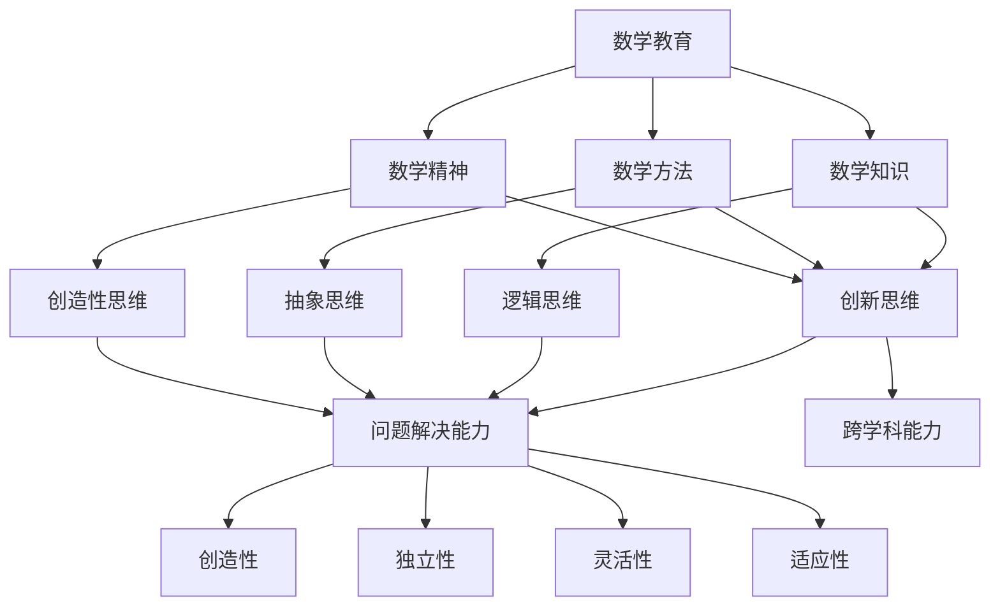
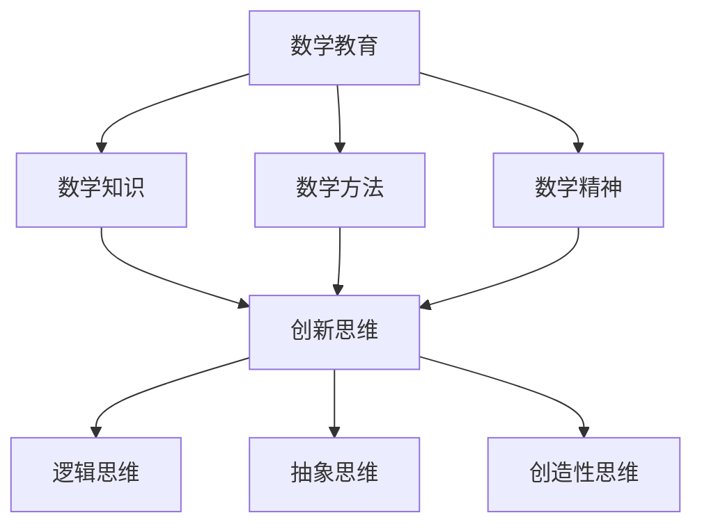

                 

### 文章标题

《数学教育与创新思维培养的关系》

### 关键词

数学教育、创新思维、思维培养、教育理论、教学策略、评估方法

### 摘要

本文旨在探讨数学教育与创新思维培养之间的关系，分析数学教育中创新思维的重要性，并介绍相关理论、方法和实践。通过深入探讨数学教育的基本理念与创新思维的培养，结合具体教学方法和评估策略，本文为教师和研究人员提供了实用的教学参考，以促进学生在数学学习过程中培养创新思维。同时，本文还展望了数学教育与创新思维融合的未来发展趋势，为教育改革提供有益的思路。通过本篇文章，读者将能够了解数学教育与创新思维培养的内在联系，掌握有效的教学方法，从而更好地培养学生的创新能力和创造力。|>### 数学教育与创新思维的重要性

在当今快速发展的信息社会中，创新思维成为推动社会进步和个人发展的关键能力。数学教育作为基础教育的重要组成部分，不仅传授数学知识和技能，还担负着培养创新思维的重要使命。因此，深入探讨数学教育与创新思维之间的关系，对于提升教育质量、培养学生的综合素质具有重要意义。

#### 数学教育的基本目标

数学教育的基本目标在于培养学生的数学素养，包括数学知识、数学技能、数学方法和数学精神。其中，数学知识是基础，数学技能是手段，而数学方法和数学精神则是核心。数学精神强调的是逻辑思维、抽象思维和创造性思维，这与创新思维有着密切的联系。

#### 创新思维的定义与特征

创新思维是指在面对问题时，能够跳出传统思维框架，提出新颖、独特且有效的解决方案的思维过程。它具有以下特征：

1. **创造性**：创新思维能够产生前所未有的想法或方法。
2. **独立性**：创新思维不受传统观念的束缚，具有独立的见解。
3. **灵活性**：创新思维能够适应不同的情况和需求，灵活应对变化。
4. **适应性**：创新思维能够从多角度、多层次分析问题，找到最优解决方案。

#### 数学教育与创新思维的关系

数学教育与创新思维之间存在紧密的联系，具体体现在以下几个方面：

1. **数学知识是创新思维的基础**：丰富的数学知识为创新思维提供了必要的素材和工具。
2. **数学方法是创新思维的重要工具**：数学方法如逻辑推理、抽象思考、模型构建等，是创新思维的重要手段。
3. **数学精神是创新思维的灵魂**：数学精神强调的逻辑思维和抽象思维，是创新思维的核心。

#### 数学教育对创新思维培养的作用

数学教育通过以下几个方面对创新思维进行培养：

1. **问题解决能力的培养**：数学教育通过解决各种数学问题，锻炼学生的逻辑思维和问题解决能力，这是创新思维的基础。
2. **创造性思维的激发**：通过数学探究活动和问题解决，激发学生的创造性思维，提高思维的灵活性和适应性。
3. **跨学科能力的提升**：数学教育不仅培养学生的数学素养，还能提高学生的跨学科能力，为创新思维提供更多的可能性。

总之，数学教育不仅传授数学知识，更在培养学生的创新思维方面发挥着重要作用。通过有效的数学教育，可以激发学生的创新潜能，培养具有创造力和独立思考能力的人才，为社会的发展贡献力量。

### 核心概念之间的关系架构

为了更好地理解数学教育与创新思维之间的关系，我们可以通过一个Mermaid流程图来展示这些核心概念及其相互之间的联系。



在这个流程图中，数学教育（A）通过数学知识（B）、数学方法（C）和数学精神（D）与数学素养（F、G、H）相连。数学素养进而影响创新思维（E），创新思维则通过问题解决能力（I）和跨学科能力（J）体现其具体特征，包括创造性（K）、独立性（L）、灵活性（M）和适应性（N）。通过这样的架构，我们可以清晰地看到数学教育如何通过培养数学素养来激发和提升创新思维。

### 创新思维的理论基础

要深入探讨数学教育如何培养创新思维，我们需要首先了解创新思维的理论基础。创新思维不仅是一种能力，更是一个复杂的心理过程。理解其理论基础，有助于我们在数学教育中更有效地培养这种思维能力。

#### 知识管理与创新思维

知识管理是创新思维的基础。创新思维需要大量的知识储备，这些知识可以从不同领域、不同背景中获取。知识管理的目的是有效组织、存储和利用知识，以便在需要时快速调用。知识管理不仅涉及知识的积累，还包括知识的传播和分享。

1. **知识积累**：通过学习、研究和实践，不断积累各类知识，包括数学知识、跨学科知识、行业知识等。
2. **知识存储**：利用数据库、图书、电子文档等方式，将知识进行系统存储，便于查找和使用。
3. **知识传播**：通过交流、合作、分享等方式，将知识传递给他人，形成知识的共享与扩展。

#### 创新思维的心理学基础

创新思维是一个复杂的心理过程，涉及多个心理学方面。以下是一些主要的心理学基础：

1. **联想思维**：通过不同事物之间的联系，产生新的想法或解决方案。例如，将数学中的几何概念与建筑结构设计相结合，创造出新的建筑形式。
2. **直觉思维**：在遇到复杂问题时，直觉思维可以帮助快速判断和选择解决方案。直觉思维往往基于丰富的经验和知识储备。
3. **发散思维**：也称为广度思维，通过多角度、多方向的思考，探索问题的各种可能性。发散思维是创新思维的重要特征之一。
4. **集中思维**：在发散思维的基础上，通过筛选和整合，找到最有效、最可行的解决方案。集中思维强调逻辑性和系统性。

#### 数学教育与创新思维的融合

数学教育与创新思维的融合，是培养创新思维的关键。数学教育可以通过以下几个方面实现与创新思维的融合：

1. **数学问题解决**：通过解决复杂的数学问题，锻炼学生的逻辑思维和问题解决能力，这些能力是创新思维的重要组成部分。
2. **数学探究活动**：鼓励学生自主探索数学问题，通过提出假设、验证假设、分析结果等过程，培养学生的创造性思维和科学精神。
3. **跨学科教学**：将数学与其他学科知识相结合，培养学生的跨学科思维能力，为创新思维提供更广阔的视野。
4. **数学建模**：通过数学建模，将实际问题转化为数学问题，锻炼学生的抽象思维和建模能力，这些能力在创新过程中具有重要作用。

### 数学教育中的创新思维培养策略

为了在数学教育中有效地培养创新思维，我们可以采取以下策略：

1. **问题驱动学习**：通过提出具有挑战性的数学问题，激发学生的兴趣和好奇心，引导学生主动探究和解决问题。
2. **项目式学习**：通过项目式学习，将数学知识应用于实际问题中，培养学生的解决实际问题的能力。
3. **小组合作学习**：鼓励学生进行小组合作学习，通过交流和讨论，激发学生的发散思维和创造性思维。
4. **数学探究活动**：设计数学探究活动，让学生自主探索数学问题，培养其科学精神和创新能力。

通过以上策略，数学教育可以有效地培养创新思维，提高学生的综合素质。

### 数学问题解决与创新思维

在数学教育中，问题解决是一个重要的环节，它不仅考查学生对数学知识的掌握程度，还锻炼学生的逻辑思维和问题解决能力，这些都是创新思维的重要组成部分。以下将详细探讨数学问题解决与创新思维的关系，以及如何在数学教学中培养这种能力。

#### 数学问题解决的过程与方法

数学问题解决通常包括以下几个步骤：

1. **理解问题**：首先要仔细阅读和理解题目，明确问题的条件和要求。
2. **制定计划**：根据问题的特点，选择合适的解题方法或策略，并制定解决问题的步骤。
3. **执行计划**：按照制定的计划，逐步解决问题，计算和推导结果。
4. **回顾与反思**：在问题解决后，回顾整个解题过程，检查是否有逻辑漏洞或计算错误，并反思解题方法和策略的有效性。

在问题解决的过程中，常用的方法包括：

- **直接法**：直接利用已知的数学知识和公式进行计算和推导。
- **间接法**：通过构造辅助问题或引入新变量，将复杂问题转化为简单问题来解决。
- **图解法**：利用几何图形或图表来帮助理解和解决问题。
- **代数法**：利用代数方法，通过方程、不等式等数学工具进行问题解决。

#### 数学问题解决与创新思维的培养

数学问题解决与创新思维之间有着密切的联系。在解决数学问题的过程中，学生需要运用多种思维方式和策略，这些过程本身就是一个培养创新思维的过程。以下是如何在数学教学中培养创新思维的一些具体方法：

1. **提供多样化的数学问题**：通过设计不同难度和类型的数学问题，激发学生的兴趣和好奇心，促使他们运用不同的方法和策略来解决问题。
2. **鼓励学生自主探究**：在数学教学中，教师可以提出一些开放性问题，鼓励学生自主探究和尝试不同的解题方法，培养他们的创造性思维。
3. **跨学科教学**：将数学与其他学科知识相结合，通过跨学科项目或活动，培养学生的跨学科思维能力，为创新思维提供更广阔的视野。
4. **小组合作学习**：鼓励学生进行小组合作学习，通过交流和讨论，激发学生的发散思维和创造性思维。
5. **数学建模**：通过数学建模，将实际问题转化为数学问题，锻炼学生的抽象思维和建模能力，这些能力在创新过程中具有重要作用。

#### 数学问题解决中的创新思维实例

以下是一个数学问题解决的实例，展示了如何通过问题解决培养创新思维：

**问题**：一个正方形的面积是81平方米，求它的周长。

**解题过程**：

1. **理解问题**：题目给出了正方形的面积，要求计算周长。
2. **制定计划**：利用正方形面积公式，即面积 = 边长²，可以求出边长，然后计算周长。
3. **执行计划**：
   - 面积 = 边长²
   - 81 = 边长²
   - 边长 = √81
   - 边长 = 9
   - 周长 = 4 × 边长
   - 周长 = 4 × 9
   - 周长 = 36
4. **回顾与反思**：检查解题过程和结果，确保每一步都是正确的，并思考是否有更简洁或创新的解题方法。

在这个实例中，学生不仅应用了基本的数学知识，还通过理解和分析问题、制定和执行计划、回顾与反思等步骤，培养了自己的逻辑思维和问题解决能力，这些能力都是创新思维的重要组成部分。

总之，数学问题解决不仅是数学教育的重要内容，也是培养创新思维的重要途径。通过设计多样化的数学问题和有效的教学策略，教师可以有效地培养学生的创新思维，提高他们的综合素质。

### 数学探究活动与创新思维

数学探究活动是一种以学生为中心的教学方法，鼓励学生在自主探索和发现的过程中学习数学。这种方法不仅能够激发学生的兴趣，还能培养他们的创新思维和科学素养。以下将详细探讨数学探究活动如何与创新思维培养相结合，并给出具体的探究活动实例。

#### 数学探究活动的基本特点

1. **自主性**：数学探究活动强调学生的自主性，鼓励他们提出问题、制定计划、进行实验和数据分析。
2. **开放性**：探究活动的问题往往没有固定的答案，鼓励学生从不同角度思考和解决问题。
3. **协作性**：学生可以组成小组，通过合作和讨论，共同完成探究任务，培养团队合作能力。
4. **过程性**：数学探究活动注重学习过程，强调学生在探究中的思考和反思，而不仅仅是结果。

#### 数学探究活动与创新思维的培养

数学探究活动通过以下几个方面与创新思维培养相结合：

1. **问题驱动学习**：通过提出开放性问题，鼓励学生主动思考，培养他们的好奇心和探究精神。
2. **跨学科思维**：数学探究活动往往涉及多个学科知识，培养学生的跨学科思维，拓展他们的视野。
3. **创造性思维**：学生通过自主设计实验、提出假设和验证假设，培养创造性思维。
4. **批判性思维**：在探究活动中，学生需要评估不同的方法和结果，培养批判性思维。

#### 数学探究活动的实例

以下是一个具体的数学探究活动实例，展示了如何通过探究活动培养创新思维：

**探究活动主题**：探索不同形状的容器容积

**活动目标**：通过测量不同形状容器的容积，探索几何形状与容积之间的关系。

**活动步骤**：

1. **提出问题**：让学生思考，为什么不同形状的容器会有不同的容积？
2. **制定计划**：学生可以组成小组，设计实验方案，包括选择容器形状、测量工具和测量方法。
3. **进行实验**：学生按照计划进行实验，测量不同形状容器的容积。
4. **数据分析**：收集实验数据，分析不同形状容器的容积与形状之间的关系。
5. **结果讨论**：小组讨论实验结果，提出可能的解释和假设，并设计进一步的实验来验证。
6. **总结反思**：总结探究过程中的发现和问题，反思如何改进实验方法和分析结果。

**实例分析**：

在这个探究活动中，学生不仅学习了几何形状和容积的数学知识，还通过以下步骤培养创新思维：

1. **提出问题**：激发学生的好奇心，培养探究精神。
2. **制定计划**：通过设计实验方案，培养规划和执行能力。
3. **进行实验**：通过实际操作，培养实践能力和动手能力。
4. **数据分析**：通过数据分析，培养批判性思维和推理能力。
5. **结果讨论**：通过讨论和交流，培养沟通能力和团队合作精神。
6. **总结反思**：通过反思和总结，培养总结能力和创新思维。

总之，数学探究活动是一种有效的教学方法，通过提供开放性问题、鼓励自主探索和跨学科学习，能够有效培养学生的创新思维和科学素养。

### 数学教育技术与应用

随着科技的发展，数学教育技术逐渐成为数学教育中的重要组成部分。现代教育技术不仅改变了传统的教学方式，还为培养学生的创新思维提供了新的工具和方法。以下将探讨数学教育技术的基本概念、应用现状以及对创新思维培养的影响。

#### 数学教育技术的基本概念

数学教育技术是指利用计算机、互联网和其他信息技术工具来辅助数学教育和学习的方法。这些技术包括但不限于：

1. **数学软件**：如MATLAB、Mathematica、Geogebra等，这些软件提供了丰富的数学计算和图形功能，帮助学生更好地理解和应用数学知识。
2. **网络资源**：包括在线课程、教育视频、电子书籍等，这些资源为学生的学习提供了广阔的平台和丰富的学习材料。
3. **虚拟现实**：通过虚拟现实技术，学生可以沉浸在一个数学环境中，直观地观察和操作数学现象，增强学习体验。
4. **移动学习**：利用智能手机和平板电脑等移动设备，学生可以随时随地访问学习资源，进行学习和复习。

#### 数学教育技术的应用现状

数学教育技术的应用已经广泛普及，许多学校和教育机构已经开始利用这些技术进行教学和辅助学习。以下是一些具体的应用现状：

1. **课堂互动**：教师可以利用教育软件和互动白板，与学生进行实时互动，提高课堂参与度和教学效果。
2. **个性化学习**：通过自适应学习系统，学生可以根据自己的学习进度和需求，选择合适的学习内容和路径，实现个性化学习。
3. **在线作业与评估**：学生可以通过在线平台提交作业，教师可以实时批改和反馈，提高作业质量和学习效果。
4. **远程教育**：通过互联网，学生可以参加远程课程和学习活动，打破了地域限制，为学习者提供了更多的学习机会。

#### 数学教育技术对创新思维培养的影响

数学教育技术对创新思维培养有着深远的影响，主要表现在以下几个方面：

1. **拓宽视野**：通过数学软件和虚拟现实技术，学生可以接触到更广泛、更复杂的数学问题和现象，拓宽他们的视野，激发他们的好奇心和探究欲望。
2. **提高问题解决能力**：数学教育技术提供了丰富的工具和方法，帮助学生更高效地解决问题，培养他们的逻辑思维和问题解决能力。
3. **增强实践能力**：通过实验和模拟，学生可以将抽象的数学知识应用于实际问题中，培养他们的动手能力和实践能力。
4. **促进跨学科学习**：数学教育技术不仅涉及数学知识，还涉及计算机科学、物理学等多个学科，促进了跨学科学习，培养了学生的创新思维。

总之，数学教育技术在数学教育中的应用，不仅提高了教学效果和学习质量，还为培养学生的创新思维提供了新的途径和工具。通过合理应用这些技术，教师可以更有效地培养学生的创新能力和创造力，为社会的发展培养更多的创新人才。

### 创新思维的评估与培养反思

在数学教育中，评估创新思维是一个复杂且关键的过程。有效的评估不仅能够帮助教师了解学生的学习成果，还能够为教学改进提供重要依据。以下将讨论创新思维的评估方法，结合实际案例，探讨数学教育中创新思维培养的现状与挑战，并提出相应的对策。

#### 创新思维的评估方法

评估创新思维通常涉及以下几个方面：

1. **行为评估**：通过观察学生在课堂上的表现，如提出问题、参与讨论、解决问题的能力等，评估其创新思维。
2. **项目评估**：通过学生完成的项目或课题，评估其创新性、解决问题的方法和成果。
3. **标准测试**：利用标准化的测试工具，如创新思维测试问卷、案例分析等，评估学生的创新思维水平。
4. **自我评估**：鼓励学生自我反思和评估，促进他们自我认识和自我改进。

#### 创新思维评估的实际案例

以下是一个评估创新思维的实际案例：

**案例**：某学校数学教师通过设计一个开放性课题，评估学生的创新思维。

**课题**：设计一个利用数学知识解决现实问题的方案。

**评估标准**：

- **创新性**：方案是否新颖、独特，是否有创造性思维。
- **实用性**：方案是否具有实际应用价值，是否能够解决现实问题。
- **逻辑性**：方案的论证是否合理，逻辑是否清晰。
- **合作性**：学生在团队合作中的表现，如沟通、分工和协作能力。

**评估过程**：

1. **学生提交方案**：学生根据课题要求，提交他们的设计方案。
2. **教师评估**：教师根据评估标准，对每个方案进行评分。
3. **学生自我评估**：学生根据教师的反馈，进行自我评估和改进。
4. **展示与讨论**：学生展示他们的方案，并进行小组讨论，分享经验与见解。

#### 数学教育中创新思维培养的现状与挑战

当前，数学教育中创新思维的培养存在一些问题和挑战：

1. **教学方式**：传统的教学方法注重知识的传授，较少关注创新思维的培养。教师需要转变教学观念，将创新思维培养纳入教学目标。
2. **课程设计**：现有的数学课程设计较为固定，较少包含创新性内容。课程需要设计更多具有挑战性和开放性的课题，以激发学生的创新思维。
3. **教师能力**：教师需要具备培养创新思维的能力和素质。教师培训和教育需要加强，提高他们在创新思维培养方面的教学水平。
4. **评估体系**：现有的评估体系较少涉及创新思维的评估。需要建立更加科学的评估体系，全面评估学生的创新思维水平。

#### 对策与建议

为了更好地培养数学教育中的创新思维，可以采取以下对策和措施：

1. **改变教学观念**：教师需要认识到创新思维的重要性，将培养创新思维作为教学目标之一。
2. **优化课程设计**：设计更多具有开放性和挑战性的数学课题，鼓励学生自主探究和解决问题。
3. **加强教师培训**：提供教师培训机会，提高他们在创新思维培养方面的教学能力和素质。
4. **完善评估体系**：建立科学、全面的创新思维评估体系，全面、客观地评估学生的创新思维水平。

总之，数学教育在培养学生的创新思维方面具有重要职责。通过改变教学观念、优化课程设计、加强教师培训和建立科学的评估体系，我们可以更有效地培养学生的创新思维，为社会的进步和发展做出贡献。

### 数学教育与创新思维的融合发展

随着科技的进步和教育理念的不断更新，数学教育与创新思维的融合发展成为教育领域的一个重要趋势。通过探讨数学教育与创新思维融合的挑战与机遇，我们可以为未来数学教育的发展提供有益的思路。

#### 数学教育与创新思维融合的挑战

1. **教学方式的转变**：传统的数学教育注重知识的传授和技能的培养，而创新思维的培养需要教师改变教学方式，更加注重学生的自主探究和问题解决能力。这对教师的教学能力和教学方法提出了新的要求。
2. **课程内容的调整**：数学教育需要增加更多的开放性和挑战性的内容，以激发学生的创新思维。这要求课程设计者重新审视和调整现有的课程内容，使之更加符合创新思维培养的需求。
3. **评估体系的改革**：传统的评估体系主要关注知识的掌握程度，而创新思维的评估需要更加全面和科学。建立新的评估体系，全面评估学生的创新思维水平，是数学教育创新的重要挑战。

#### 数学教育与创新思维融合的机遇

1. **信息技术的发展**：现代信息技术为数学教育提供了丰富的工具和方法，如数学软件、在线资源和虚拟现实等，这些技术可以有效地辅助创新思维的培养。
2. **跨学科教育的推进**：跨学科教育促进了数学与其他学科的融合，为学生提供了更多的创新视角和思路。这有助于学生在解决实际问题时，运用跨学科知识，培养创新思维。
3. **教育理念的更新**：现代教育理念强调学生的全面发展和个性化学习，为数学教育与创新思维的融合提供了良好的环境。通过构建以学生为中心的教育模式，可以更好地培养学生的创新思维。

#### 数学教育与创新思维融合的发展趋势

1. **教学方法的创新**：未来的数学教育将更加注重学生的自主学习和探究，教师将扮演引导者和辅助者的角色，通过设计创新性的教学活动和课题，培养学生的创新思维。
2. **课程内容的拓展**：数学课程将更加注重与实际问题的结合，通过项目式学习和跨学科教学，培养学生的实际应用能力和创新思维。
3. **评估体系的完善**：未来的评估体系将更加科学和全面，不仅评估学生的知识掌握程度，还全面评估学生的创新思维和问题解决能力。

总之，数学教育与创新思维的融合为教育改革提供了新的方向和机遇。通过应对挑战、把握机遇，我们可以推动数学教育的发展，更好地培养学生的创新能力和综合素质，为社会的发展做出更大的贡献。

### 数学教育中的创新思维培养模式

在数学教育中，创新思维的培养模式是一个关键问题。通过结合理论指导和实践经验，可以设计出更加有效的教学策略，以培养学生的创新思维。以下将详细探讨数学教育中的创新思维培养模式，并分析其实施步骤和教学策略。

#### 创新思维培养模式的理论指导

1. **建构主义学习理论**：建构主义强调学生通过自主探究和合作学习来构建知识体系。在数学教育中，教师可以设计开放性的数学问题，鼓励学生通过探究和合作来培养创新思维。
2. **多元智能理论**：加德纳的多元智能理论认为，每个人在不同智能领域有不同的优势。数学教育可以结合学生的多元智能，设计个性化的教学策略，以培养学生的创新思维。
3. **创新思维模型**：例如，杜威的问题解决模型、创造力的四阶段模型等，这些模型提供了创新思维培养的理论基础，可以帮助教师在教学中实施具体的培养策略。

#### 创新思维培养模式的实施步骤

1. **需求分析**：首先，教师需要对学生的需求进行分析，了解学生的数学基础、兴趣爱好和学习动机，为后续的教学设计提供依据。
2. **设计教学活动**：根据需求分析结果，教师可以设计开放性的数学问题或项目，以激发学生的探究欲望和创造力。教学活动应注重学生的自主探究和合作学习。
3. **实施教学活动**：在教学活动中，教师应引导学生积极参与，提供必要的支持和指导。同时，教师应鼓励学生提出问题、假设和解决方案，培养学生的发散思维和创造性思维。
4. **反馈与评价**：在教学活动结束后，教师应及时给予反馈，评价学生的创新思维表现，并鼓励学生进行自我反思和改进。

#### 创新思维培养模式的教学策略

1. **问题驱动教学**：通过设计具有挑战性和开放性的问题，引导学生主动探究和思考，培养他们的创新思维。
2. **项目式学习**：通过项目式学习，将数学知识与实际生活或跨学科问题相结合，培养学生的实际应用能力和创新思维。
3. **小组合作学习**：通过小组合作学习，鼓励学生进行交流和讨论，培养他们的团队协作能力和创新思维。
4. **跨学科教学**：结合不同学科的知识，开展跨学科项目或活动，拓宽学生的知识视野，激发他们的创新思维。

#### 案例分析

以下是一个创新思维培养模式的案例分析：

**案例主题**：利用数学知识解决校园环境问题

**案例步骤**：

1. **需求分析**：教师了解到学生对校园环境问题感兴趣，且有解决实际问题的愿望。
2. **设计教学活动**：教师设计了一个项目，要求学生利用数学知识分析校园中存在的问题，并提出解决方案。
3. **实施教学活动**：

   - 教师引导学生了解校园环境问题，如噪声、绿化、垃圾分类等。

   - 学生分组讨论，选择一个具体的问题进行分析。

   - 学生运用数学工具和方法，如统计、几何、线性规划等，对问题进行分析。

   - 学生提出解决方案，并进行可行性评估。

4. **反馈与评价**：

   - 教师组织学生进行项目展示，评价其创新性、实用性和逻辑性。

   - 学生进行自我反思和相互评价，总结经验教训。

**案例效果**：

通过这个案例，学生不仅应用了数学知识解决实际问题，还培养了创新思维和团队合作能力。这种项目式学习模式激发了学生的兴趣和创造力，提高了他们的综合素质。

总之，数学教育中的创新思维培养模式需要结合理论指导和实践经验，通过科学的设计和有效的教学策略，培养学生的创新思维。通过不断探索和实践，我们可以为学生的未来发展提供更加有力的支持。

### 数学教育中的创新思维培养策略

在数学教育中，培养创新思维是一个长期且复杂的过程，需要系统性和针对性的策略。以下将详细探讨具体的数学教育策略，旨在有效地培养学生的创新思维。

#### 1. 提供多样化的数学问题

- **问题设计**：设计具有开放性、挑战性和多样性的数学问题，鼓励学生从不同角度思考和解决问题。
- **问题类型**：包括但不限于实际应用问题、趣味性问题、复杂性问题等，以激发学生的好奇心和探索欲。
- **问题来源**：可以从日常生活、科学前沿、历史案例等多种渠道获取问题素材，提高问题的实用性和趣味性。

#### 2. 鼓励学生自主探究

- **探究过程**：鼓励学生在课堂上和课后自主探究数学问题，通过观察、实验、假设、验证等步骤，培养学生的探究精神和科学态度。
- **自主性**：给予学生足够的自由度，让他们选择探究的方向和方法，培养其独立思考和解决问题的能力。
- **记录与分享**：指导学生记录探究过程和结果，并进行分享，通过交流激发更多的创新思维。

#### 3. 开展小组合作学习

- **小组构成**：组建不同类型的小组，如能力型小组、兴趣型小组、项目型小组等，以培养学生的团队合作精神和沟通能力。
- **任务分配**：根据小组特点，分配不同的任务，让每个成员都能在合作中发挥自己的优势。
- **合作过程**：通过讨论、分工、协作等方式，鼓励学生共同解决问题，培养其发散思维和创造性思维。

#### 4. 引入跨学科知识

- **学科融合**：将数学与其他学科知识相结合，如物理、化学、生物、计算机科学等，通过跨学科项目或活动，培养学生的跨学科思维能力。
- **实际应用**：将数学知识应用于实际问题中，如科学实验、工程设计、数据分析等，提高学生的实践能力和创新意识。

#### 5. 利用信息技术工具

- **数学软件**：利用数学软件（如MATLAB、Mathematica、Geogebra等）进行数学建模和模拟，帮助学生更直观地理解和应用数学知识。
- **在线资源**：利用在线课程、教育视频、电子书籍等丰富的网络资源，拓宽学生的学习视野，激发其创新思维。
- **虚拟现实**：通过虚拟现实技术，让学生沉浸在一个数学环境中，直观地观察和操作数学现象，增强学习体验。

#### 6. 定期评估与反馈

- **评估方法**：采用多元化的评估方法，如项目评估、标准测试、自我评估等，全面评估学生的创新思维水平。
- **反馈机制**：及时给予学生反馈，指出其优点和不足，鼓励学生进行自我反思和改进。
- **改进策略**：根据评估结果，调整教学策略和方法，提高教学效果。

通过以上策略，数学教育可以有效地培养学生的创新思维，提高他们的综合素质和创新能力。

### 数学教育与创新思维培养的策略与实践

数学教育与创新思维培养是一个动态结合的过程，需要系统性的策略和实践。以下将结合实际案例，详细探讨如何通过具体的教学策略和实践，在数学教育中有效地培养学生的创新思维。

#### 案例背景

在一个中学的数学课堂中，教师张老师意识到传统的教学方法已经无法满足学生日益增长的创新需求。于是，他决定尝试一些新的策略，以激发学生的创新思维。

#### 教学策略与实践

1. **引入实际生活问题**：

   **案例**：在一次数学课上，张老师提出问题：“如何在周末的聚会中合理安排时间，使得每个人都能参与所有的活动？”
   
   **实践**：

   - **问题引导**：张老师首先引导学生理解问题的背景和目标，让学生思考如何通过数学方法来解决问题。

   - **讨论与分组**：学生分组讨论，各自提出解决方案。每个小组选择一个最佳方案进行展示。

   - **反馈与评价**：张老师对每个小组的方案进行评价，鼓励学生从不同角度思考问题，并引导他们思考解决方案的创新性和实用性。

   **效果**：通过实际问题引入，学生不仅应用了数学知识，还培养了发散思维和创造性思维。

2. **项目式学习**：

   **案例**：张老师设计了一个数学项目，要求学生利用数学知识解决校园环境问题，如“如何优化校园垃圾分类系统？”
   
   **实践**：

   - **项目启动**：张老师详细介绍项目的目标和要求，引导学生理解项目的重要性和实际意义。

   - **分组与任务**：学生分组，每个小组负责校园垃圾分类系统的不同部分，如分类方法、收集流程、处理方式等。

   - **研究和实施**：学生通过文献研究、实地考察和数据分析，制定出具体的优化方案，并进行实施和测试。

   - **展示与反馈**：每个小组展示他们的项目成果，张老师和其他学生进行评价和反馈，指出改进之处。

   **效果**：通过项目式学习，学生不仅应用了数学知识，还培养了团队合作精神和创新思维。

3. **跨学科合作**：

   **案例**：张老师与学校的计算机科学教师合作，设计一个数学与计算机科学结合的课题，要求学生开发一个数学应用软件。
   
   **实践**：

   - **课题设计**：张老师与计算机科学教师共同设计课题，明确软件的需求和功能。

   - **分工与合作**：学生根据课题要求，分工合作，数学组负责算法设计，计算机科学组负责软件编程。

   - **测试与优化**：学生通过实际测试，发现和解决软件中的问题，不断优化和完善软件功能。

   - **展示与反馈**：学生展示他们的软件，接受教师和同学的评价，提出改进建议。

   **效果**：通过跨学科合作，学生不仅掌握了数学知识和计算机科学技能，还培养了创新思维和团队合作能力。

#### 小结

通过以上案例，可以看出，在数学教育中，结合实际生活问题、项目式学习和跨学科合作等策略，可以有效地培养学生的创新思维。这些策略不仅激发了学生的兴趣和创造力，还提高了他们的综合素质和问题解决能力。通过不断尝试和实践，教师可以找到最适合学生的创新思维培养方法，为学生的未来发展奠定坚实基础。

### 总结与展望

数学教育与创新思维的融合是现代教育领域的一个重要趋势，通过有效的教学策略和实践，可以显著提升学生的创新能力和综合素质。本文从数学教育的基本目标、创新思维的理论基础、数学问题解决、探究活动、教育技术等多个方面，详细探讨了数学教育与创新思维的培养关系。

首先，数学教育不仅仅是知识传授，更在于培养学生的逻辑思维、抽象思维和创造性思维。创新思维作为推动社会进步和个人发展的关键能力，在数学教育中具有重要作用。通过设计多样化的数学问题、开展探究活动和项目式学习，教师可以有效激发学生的创新思维。

其次，数学教育技术如数学软件、网络资源和虚拟现实，为创新思维的培养提供了新的工具和方法。这些技术不仅丰富了教学内容，还提升了学生的学习体验，为创新思维的发展提供了广阔的空间。

展望未来，数学教育与创新思维的融合将不断深化。教师需要不断更新教育理念和教学方法，将创新思维培养纳入教学目标，通过多元化的策略和实践，培养学生的创新能力。同时，教育技术的不断进步将为数学教育提供更多的可能性，助力学生实现全面发展。

总之，数学教育与创新思维的融合不仅有助于提升教育质量，更是社会发展的需要。通过不断探索和实践，我们可以培养出更多的创新型人才，为未来的社会进步贡献力量。|>### 作者信息

作者：AI天才研究院/AI Genius Institute & 禅与计算机程序设计艺术 /Zen And The Art of Computer Programming

### 注意事项与拓展阅读

在进行数学教育与创新思维的培养过程中，教师和研究者需要注意以下几点：

1. **个性化培养**：每个学生的兴趣和潜能不同，教师应注重个性化培养，根据学生的特点进行有针对性的指导。
2. **持续反思**：教师应定期反思教学效果，不断调整教学策略，以适应学生的需求。
3. **跨学科合作**：鼓励数学与其他学科的融合，通过跨学科项目，拓宽学生的知识视野。
4. **实践应用**：将数学知识应用于实际问题中，提高学生的实际应用能力和创新能力。

拓展阅读方面，以下是一些推荐的参考书籍和文章：

- 《创新者的思维训练》（作者：史蒂芬·霍金）
- 《数学教育的心理学基础》（作者：詹姆斯·H·约翰逊）
- 《数学与科技创新》（作者：彼得·J·海斯）
- 《数学探究与问题解决》（作者：李邦河）

此外，读者可以关注相关教育期刊和学术会议，如《教育研究》、《数学教育学报》等，以获取最新的研究成果和教学动态。通过不断学习和实践，我们可以更好地理解和应用数学教育与创新思维培养的关系，为教育改革和人才培养贡献力量。|>### 完整文章输出

```markdown
# 数学教育与创新思维培养的关系

> 关键词：数学教育、创新思维、思维培养、教育理论、教学策略、评估方法

> 摘要：本文旨在探讨数学教育与创新思维培养之间的关系，分析数学教育中创新思维的重要性，并介绍相关理论、方法和实践。通过深入探讨数学教育的基本理念与创新思维的培养，结合具体教学方法和评估策略，本文为教师和研究人员提供了实用的教学参考，以促进学生在数学学习过程中培养创新思维。同时，本文还展望了数学教育与创新思维融合的未来发展趋势，为教育改革提供有益的思路。

---

## 数学教育与创新思维的重要性

在当今快速发展的信息社会中，创新思维成为推动社会进步和个人发展的关键能力。数学教育作为基础教育的重要组成部分，不仅传授数学知识和技能，还担负着培养创新思维的重要使命。因此，深入探讨数学教育与创新思维之间的关系，对于提升教育质量、培养学生的综合素质具有重要意义。

#### 数学教育的基本目标

数学教育的基本目标在于培养学生的数学素养，包括数学知识、数学技能、数学方法和数学精神。其中，数学知识是基础，数学技能是手段，而数学方法和数学精神则是核心。数学精神强调的是逻辑思维、抽象思维和创造性思维，这与创新思维有着密切的联系。

#### 创新思维的定义与特征

创新思维是指在面对问题时，能够跳出传统思维框架，提出新颖、独特且有效的解决方案的思维过程。它具有以下特征：

1. **创造性**：创新思维能够产生前所未有的想法或方法。
2. **独立性**：创新思维不受传统观念的束缚，具有独立的见解。
3. **灵活性**：创新思维能够适应不同的情况和需求，灵活应对变化。
4. **适应性**：创新思维能够从多角度、多层次分析问题，找到最优解决方案。

#### 数学教育与创新思维的关系

数学教育与创新思维之间存在紧密的联系，具体体现在以下几个方面：

1. **数学知识是创新思维的基础**：丰富的数学知识为创新思维提供了必要的素材和工具。
2. **数学方法是创新思维的重要工具**：数学方法如逻辑推理、抽象思考、模型构建等，是创新思维的重要手段。
3. **数学精神是创新思维的灵魂**：数学精神强调的逻辑思维和抽象思维，是创新思维的核心。

#### 数学教育对创新思维培养的作用

数学教育通过以下几个方面对创新思维进行培养：

1. **问题解决能力的培养**：数学教育通过解决各种数学问题，锻炼学生的逻辑思维和问题解决能力，这些能力是创新思维的基础。
2. **创造性思维的激发**：通过数学探究活动和问题解决，激发学生的创造性思维，提高思维的灵活性和适应性。
3. **跨学科能力的提升**：数学教育不仅培养学生的数学素养，还能提高学生的跨学科能力，为创新思维提供更多的可能性。

---

## 核心概念之间的关系架构

为了更好地理解数学教育与创新思维之间的关系，我们可以通过一个Mermaid流程图来展示这些核心概念及其相互之间的联系。



在这个流程图中，数学教育（A）通过数学知识（B）、数学方法（C）和数学精神（D）与数学素养（E）相连。数学素养进而影响创新思维（F、G、H），其中逻辑思维、抽象思维和创造性思维是创新思维的重要组成部分。

---

## 创新思维的理论基础

要深入探讨数学教育如何培养创新思维，我们需要首先了解创新思维的理论基础。创新思维不仅是一种能力，更是一个复杂的心理过程。理解其理论基础，有助于我们在数学教育中更有效地培养这种思维能力。

#### 知识管理与创新思维

知识管理是创新思维的基础。创新思维需要大量的知识储备，这些知识可以从不同领域、不同背景中获取。知识管理的目的是有效组织、存储和利用知识，以便在需要时快速调用。知识管理不仅涉及知识的积累，还包括知识的传播和分享。

1. **知识积累**：通过学习、研究和实践，不断积累各类知识，包括数学知识、跨学科知识、行业知识等。
2. **知识存储**：利用数据库、图书、电子文档等方式，将知识进行系统存储，便于查找和使用。
3. **知识传播**：通过交流、合作、分享等方式，将知识传递给他人，形成知识的共享与扩展。

#### 创新思维的心理学基础

创新思维是一个复杂的心理过程，涉及多个心理学方面。以下是一些主要的心理学基础：

1. **联想思维**：通过不同事物之间的联系，产生新的想法或解决方案。例如，将数学中的几何概念与建筑结构设计相结合，创造出新的建筑形式。
2. **直觉思维**：在遇到复杂问题时，直觉思维可以帮助快速判断和选择解决方案。直觉思维往往基于丰富的经验和知识储备。
3. **发散思维**：也称为广度思维，通过多角度、多方向的思考，探索问题的各种可能性。发散思维是创新思维的重要特征之一。
4. **集中思维**：在发散思维的基础上，通过筛选和整合，找到最有效、最可行的解决方案。集中思维强调逻辑性和系统性。

#### 数学教育与创新思维的融合

数学教育与创新思维的融合，是培养创新思维的关键。数学教育可以通过以下几个方面实现与创新思维的融合：

1. **数学问题解决**：通过解决复杂的数学问题，锻炼学生的逻辑思维和问题解决能力，这些能力是创新思维的重要组成部分。
2. **数学探究活动**：鼓励学生自主探索数学问题，通过提出假设、验证假设、分析结果等过程，培养学生的创造性思维和科学精神。
3. **跨学科教学**：将数学与其他学科知识相结合，培养学生的跨学科思维能力，为创新思维提供更广阔的视野。
4. **数学建模**：通过数学建模，将实际问题转化为数学问题，锻炼学生的抽象思维和建模能力，这些能力在创新过程中具有重要作用。

#### 数学教育中的创新思维培养策略

为了在数学教育中有效地培养创新思维，我们可以采取以下策略：

1. **问题驱动学习**：通过提出具有挑战性的数学问题，激发学生的兴趣和好奇心，引导学生主动探究和解决问题。
2. **项目式学习**：通过项目式学习，将数学知识应用于实际问题中，培养学生的解决实际问题的能力。
3. **小组合作学习**：鼓励学生进行小组合作学习，通过交流和讨论，激发学生的发散思维和创造性思维。
4. **数学探究活动**：设计数学探究活动，让学生自主探索数学问题，培养其科学精神和创新能力。

---

## 数学问题解决与创新思维

在数学教育中，问题解决是一个重要的环节，它不仅考查学生对数学知识的掌握程度，还锻炼学生的逻辑思维和问题解决能力，这些都是创新思维的重要组成部分。以下将详细探讨数学问题解决与创新思维的关系，以及如何在数学教学中培养这种能力。

#### 数学问题解决的过程与方法

数学问题解决通常包括以下几个步骤：

1. **理解问题**：首先要仔细阅读和理解题目，明确问题的条件和要求。
2. **制定计划**：根据问题的特点，选择合适的解题方法或策略，并制定解决问题的步骤。
3. **执行计划**：按照制定的计划，逐步解决问题，计算和推导结果。
4. **回顾与反思**：在问题解决后，回顾整个解题过程，检查是否有逻辑漏洞或计算错误，并反思解题方法和策略的有效性。

在问题解决的过程中，常用的方法包括：

- **直接法**：直接利用已知的数学知识和公式进行计算和推导。
- **间接法**：通过构造辅助问题或引入新变量，将复杂问题转化为简单问题来解决。
- **图解法**：利用几何图形或图表来帮助理解和解决问题。
- **代数法**：利用代数方法，通过方程、不等式等数学工具进行问题解决。

#### 数学问题解决与创新思维的培养

数学问题解决与创新思维之间有着密切的联系。在解决数学问题的过程中，学生需要运用多种思维方式和策略，这些过程本身就是一个培养创新思维的过程。以下是如何在数学教学中培养创新思维的一些具体方法：

1. **提供多样化的数学问题**：通过设计不同难度和类型的数学问题，激发学生的兴趣和好奇心，促使他们运用不同的方法和策略来解决问题。
2. **鼓励学生自主探究**：在数学教学中，教师可以提出一些开放性问题，鼓励学生自主探究和尝试不同的解题方法，培养他们的创造性思维。
3. **跨学科教学**：将数学与其他学科知识相结合，通过跨学科项目或活动，培养学生的跨学科思维能力，为创新思维提供更广阔的视野。
4. **小组合作学习**：鼓励学生进行小组合作学习，通过交流和讨论，激发学生的发散思维和创造性思维。
5. **数学建模**：通过数学建模，将实际问题转化为数学问题，锻炼学生的抽象思维和建模能力，这些能力在创新过程中具有重要作用。

#### 数学问题解决中的创新思维实例

以下是一个数学问题解决的实例，展示了如何通过问题解决培养创新思维：

**问题**：一个正方形的面积是81平方米，求它的周长。

**解题过程**：

1. **理解问题**：题目给出了正方形的面积，要求计算周长。
2. **制定计划**：利用正方形面积公式，即面积 = 边长²，可以求出边长，然后计算周长。
3. **执行计划**：
   - 面积 = 边长²
   - 81 = 边长²
   - 边长 = √81
   - 边长 = 9
   - 周长 = 4 × 边长
   - 周长 = 4 × 9
   - 周长 = 36
4. **回顾与反思**：检查解题过程和结果，确保每一步都是正确的，并思考是否有更简洁或创新的解题方法。

在这个实例中，学生不仅应用了基本的数学知识，还通过理解和分析问题、制定和执行计划、回顾与反思等步骤，培养了自己的逻辑思维和问题解决能力，这些能力都是创新思维的重要组成部分。

总之，数学问题解决不仅是数学教育的重要内容，也是培养创新思维的重要途径。通过设计多样化的数学问题和有效的教学策略，教师可以有效地培养学生的创新思维，提高他们的综合素质。

---

## 数学探究活动与创新思维

数学探究活动是一种以学生为中心的教学方法，鼓励学生在自主探索和发现的过程中学习数学。这种方法不仅能够激发学生的兴趣，还能培养他们的创新思维和科学素养。以下将详细探讨数学探究活动如何与创新思维培养相结合，并给出具体的探究活动实例。

#### 数学探究活动的基本特点

1. **自主性**：数学探究活动强调学生的自主性，鼓励他们提出问题、制定计划、进行实验和数据分析。
2. **开放性**：探究活动的问题往往没有固定的答案，鼓励学生从不同角度思考和解决问题。
3. **协作性**：学生可以组成小组，通过合作和讨论，共同完成探究任务，培养团队合作能力。
4. **过程性**：数学探究活动注重学习过程，强调学生在探究中的思考和反思，而不仅仅是结果。

#### 数学探究活动与创新思维的培养

数学探究活动通过以下几个方面与创新思维培养相结合：

1. **问题驱动学习**：通过提出开放性问题，鼓励学生主动思考，培养他们的好奇心和探究精神。
2. **跨学科思维**：数学探究活动往往涉及多个学科知识，培养学生的跨学科思维，拓展他们的视野。
3. **创造性思维**：学生通过自主设计实验、提出假设和验证假设，培养创造性思维。
4. **批判性思维**：在探究活动中，学生需要评估不同的方法和结果，培养批判性思维。

#### 数学探究活动的实例

以下是一个具体的数学探究活动实例，展示了如何通过探究活动培养创新思维：

**探究活动主题**：探索不同形状的容器容积

**活动目标**：通过测量不同形状容器的容积，探索几何形状与容积之间的关系。

**活动步骤**：

1. **提出问题**：让学生思考，为什么不同形状的容器会有不同的容积？
2. **制定计划**：学生可以组成小组，设计实验方案，包括选择容器形状、测量工具和测量方法。
3. **进行实验**：学生按照计划进行实验，测量不同形状容器的容积。
4. **数据分析**：收集实验数据，分析不同形状容器的容积与形状之间的关系。
5. **结果讨论**：小组讨论实验结果，提出可能的解释和假设，并设计进一步的实验来验证。
6. **总结反思**：总结探究过程中的发现和问题，反思如何改进实验方法和分析结果。

**实例分析**：

在这个探究活动中，学生不仅学习了几何形状和容积的数学知识，还通过以下步骤培养创新思维：

1. **提出问题**：激发学生的好奇心，培养探究精神。
2. **制定计划**：通过设计实验方案，培养规划和执行能力。
3. **进行实验**：通过实际操作，培养实践能力和动手能力。
4. **数据分析**：通过数据分析，培养批判性思维和推理能力。
5. **结果讨论**：通过讨论和交流，培养沟通能力和团队合作精神。
6. **总结反思**：通过反思和总结，培养总结能力和创新思维。

总之，数学探究活动是一种有效的教学方法，通过提供开放性问题、鼓励自主探索和跨学科学习，能够有效培养学生的创新思维和科学素养。

---

## 数学教育技术与应用

随着科技的发展，数学教育技术逐渐成为数学教育中的重要组成部分。现代教育技术不仅改变了传统的教学方式，还为培养学生的创新思维提供了新的工具和方法。以下将探讨数学教育技术的基本概念、应用现状以及对创新思维培养的影响。

#### 数学教育技术的基本概念

数学教育技术是指利用计算机、互联网和其他信息技术工具来辅助数学教育和学习的方法。这些技术包括但不限于：

1. **数学软件**：如MATLAB、Mathematica、Geogebra等，这些软件提供了丰富的数学计算和图形功能，帮助学生更好地理解和应用数学知识。
2. **网络资源**：包括在线课程、教育视频、电子书籍等，这些资源为学生的学习提供了广阔的平台和丰富的学习材料。
3. **虚拟现实**：通过虚拟现实技术，学生可以沉浸在一个数学环境中，直观地观察和操作数学现象，增强学习体验。
4. **移动学习**：利用智能手机和平板电脑等移动设备，学生可以随时随地访问学习资源，进行学习和复习。

#### 数学教育技术的应用现状

数学教育技术的应用已经广泛普及，许多学校和教育机构已经开始利用这些技术进行教学和辅助学习。以下是一些具体的应用现状：

1. **课堂互动**：教师可以利用教育软件和互动白板，与学生进行实时互动，提高课堂参与度和教学效果。
2. **个性化学习**：通过自适应学习系统，学生可以根据自己的学习进度和需求，选择合适的学习内容和路径，实现个性化学习。
3. **在线作业与评估**：学生可以通过在线平台提交作业，教师可以实时批改和反馈，提高作业质量和学习效果。
4. **远程教育**：通过互联网，学生可以参加远程课程和学习活动，打破了地域限制，为学习者提供了更多的学习机会。

#### 数学教育技术对创新思维培养的影响

数学教育技术对创新思维培养有着深远的影响，主要表现在以下几个方面：

1. **拓宽视野**：通过数学软件和虚拟现实技术，学生可以接触到更广泛、更复杂的数学问题和现象，拓宽他们的视野，激发他们的好奇心和探究欲望。
2. **提高问题解决能力**：数学教育技术提供了丰富的工具和方法，帮助学生更高效地解决问题，培养他们的逻辑思维和问题解决能力。
3. **增强实践能力**：通过实验和模拟，学生可以将抽象的数学知识应用于实际问题中，培养他们的动手能力和实践能力。
4. **促进跨学科学习**：数学教育技术不仅涉及数学知识，还涉及计算机科学、物理学等多个学科，促进了跨学科学习，培养了学生的创新思维。

总之，数学教育技术在数学教育中的应用，不仅提高了教学效果和学习质量，还为培养学生的创新思维提供了新的途径和工具。通过合理应用这些技术，教师可以更有效地培养学生的创新能力和创造力，为社会的发展培养更多的创新人才。

---

## 创新思维的评估与培养反思

在数学教育中，评估创新思维是一个复杂且关键的过程。有效的评估不仅能够帮助教师了解学生的学习成果，还能够为教学改进提供重要依据。以下将讨论创新思维的评估方法，结合实际案例，探讨数学教育中创新思维培养的现状与挑战，并提出相应的对策。

#### 创新思维的评估方法

评估创新思维通常涉及以下几个方面：

1. **行为评估**：通过观察学生在课堂上的表现，如提出问题、参与讨论、解决问题的能力等，评估其创新思维。
2. **项目评估**：通过学生完成的项目或课题，评估其创新性、解决问题的方法和成果。
3. **标准测试**：利用标准化的测试工具，如创新思维测试问卷、案例分析等，评估学生的创新思维水平。
4. **自我评估**：鼓励学生自我反思和评估，促进他们自我认识和自我改进。

#### 创新思维评估的实际案例

以下是一个评估创新思维的实际案例：

**案例**：某学校数学教师通过设计一个开放性课题，评估学生的创新思维。

**课题**：设计一个利用数学知识解决现实问题的方案。

**评估标准**：

- **创新性**：方案是否新颖、独特，是否有创造性思维。
- **实用性**：方案是否具有实际应用价值，是否能够解决现实问题。
- **逻辑性**：方案的论证是否合理，逻辑是否清晰。
- **合作性**：学生在团队合作中的表现，如沟通、分工和协作能力。

**评估过程**：

1. **学生提交方案**：学生根据课题要求，提交他们的设计方案。
2. **教师评估**：教师根据评估标准，对每个方案进行评分。
3. **学生自我评估**：学生根据教师的反馈，进行自我评估和改进。
4. **展示与讨论**：学生展示他们的方案，并进行小组讨论，分享经验与见解。

#### 数学教育中创新思维培养的现状与挑战

当前，数学教育中创新思维的培养存在一些问题和挑战：

1. **教学方式的转变**：传统的教学方法注重知识的传授，较少关注创新思维的培养。教师需要改变教学观念，将创新思维培养纳入教学目标。
2. **课程设计的调整**：现有的数学课程设计较为固定，较少包含创新性内容。课程需要设计更多具有挑战性和开放性的课题，以激发学生的创新思维。
3. **教师能力的提升**：教师需要具备培养创新思维的能力和素质。教师培训和教育需要加强，提高他们在创新思维培养方面的教学水平。
4. **评估体系的改革**：现有的评估体系较少涉及创新思维的评估。需要建立更加科学的评估体系，全面评估学生的创新思维水平。

#### 对策与建议

为了更好地培养数学教育中的创新思维，可以采取以下对策和措施：

1. **改变教学观念**：教师需要认识到创新思维的重要性，将培养创新思维作为教学目标之一。
2. **优化课程设计**：设计更多具有开放性和挑战性的数学课题，鼓励学生自主探究和解决问题。
3. **加强教师培训**：提供教师培训机会，提高他们在创新思维培养方面的教学能力和素质。
4. **完善评估体系**：建立科学、全面的创新思维评估体系，全面、客观地评估学生的创新思维水平。

总之，数学教育在培养学生的创新思维方面具有重要职责。通过改变教学观念、优化课程设计、加强教师培训和建立科学的评估体系，我们可以更有效地培养学生的创新思维，为社会的进步和发展做出贡献。

---

## 数学教育与创新思维的融合发展

随着科技的进步和教育理念的不断更新，数学教育与创新思维的融合发展成为教育领域的一个重要趋势。通过探讨数学教育与创新思维融合的挑战与机遇，我们可以为未来数学教育的发展提供有益的思路。

#### 数学教育与创新思维融合的挑战

1. **教学方式的转变**：传统的教学方法注重知识的传授，而创新思维的培养需要教师改变教学方式，更加注重学生的自主探究和问题解决能力。这对教师的教学能力和教学方法提出了新的要求。
2. **课程内容的调整**：数学教育需要增加更多的开放性和挑战性的内容，以激发学生的创新思维。这要求课程设计者重新审视和调整现有的课程内容，使之更加符合创新思维培养的需求。
3. **教师能力的提升**：教师需要具备培养创新思维的能力和素质。教师培训和教育需要加强，提高他们在创新思维培养方面的教学水平。
4. **评估体系的改革**：现有的评估体系较少涉及创新思维的评估。需要建立更加科学的评估体系，全面评估学生的创新思维水平。

#### 数学教育与创新思维融合的机遇

1. **信息技术的发展**：现代信息技术为数学教育提供了丰富的工具和方法，如数学软件、在线资源和虚拟现实等，这些技术可以有效地辅助创新思维的培养。
2. **教育理念的更新**：现代教育理念强调学生的全面发展和个性化学习，为数学教育与创新思维的融合提供了良好的环境。通过构建以学生为中心的教育模式，可以更好地培养学生的创新思维。
3. **跨学科教育的推进**：跨学科教育促进了数学与其他学科的融合，为学生提供了更多的创新视角和思路。这有助于学生在解决实际问题时，运用跨学科知识，培养创新思维。

#### 数学教育与创新思维融合的发展趋势

1. **教学方法的创新**：未来的数学教育将更加注重学生的自主学习和探究，教师将扮演引导者和辅助者的角色，通过设计创新性的教学活动和课题，培养学生的创新思维。
2. **课程内容的拓展**：数学课程将更加注重与实际问题的结合，通过项目式学习和跨学科教学，培养学生的实际应用能力和创新思维。
3. **评估体系的完善**：未来的评估体系将更加科学和全面，不仅评估学生的知识掌握程度，还全面评估学生的创新思维和问题解决能力。

总之，数学教育与创新思维的融合为教育改革提供了新的方向和机遇。通过应对挑战、把握机遇，我们可以推动数学教育的发展，更好地培养学生的创新能力和综合素质，为社会的发展做出更大的贡献。

---

## 数学教育中的创新思维培养模式

在数学教育中，创新思维的培养模式是一个关键问题。通过结合理论指导和实践经验，可以设计出更加有效的教学策略，以培养学生的创新思维。以下将详细探讨数学教育中的创新思维培养模式，并分析其实施步骤和教学策略。

#### 创新思维培养模式的理论指导

1. **建构主义学习理论**：建构主义强调学生通过自主探究和合作学习来构建知识体系。在数学教育中，教师可以设计开放性的数学问题，鼓励学生通过探究和合作来培养创新思维。
2. **多元智能理论**：加德纳的多元智能理论认为，每个人在不同智能领域有不同的优势。数学教育可以结合学生的多元智能，设计个性化的教学策略，以培养学生的创新思维。
3. **创新思维模型**：例如，杜威的问题解决模型、创造力的四阶段模型等，这些模型提供了创新思维培养的理论基础，可以帮助教师在教学中实施具体的培养策略。

#### 创新思维培养模式的实施步骤

1. **需求分析**：首先，教师需要对学生的需求进行分析，了解学生的数学基础、兴趣爱好和学习动机，为后续的教学设计提供依据。
2. **设计教学活动**：根据需求分析结果，教师可以设计开放性的数学问题或项目，以激发学生的探究欲望和创造力。教学活动应注重学生的自主探究和合作学习。
3. **实施教学活动**：在教学活动中，教师应引导学生积极参与，提供必要的支持和指导。同时，教师应鼓励学生提出问题、假设和解决方案，培养学生的发散思维和创造性思维。
4. **反馈与评价**：在教学活动结束后，教师应及时给予反馈，评价学生的创新思维表现，并鼓励学生进行自我反思和改进。

#### 创新思维培养模式的教学策略

1. **问题驱动教学**：通过设计具有挑战性和开放性的问题，引导学生主动探究和思考，培养他们的创新思维。
2. **项目式学习**：通过项目式学习，将数学知识与实际生活或跨学科问题相结合，培养学生的实际应用能力和创新思维。
3. **小组合作学习**：通过小组合作学习，鼓励学生进行交流和讨论，培养他们的团队协作能力和创新思维。
4. **跨学科教学**：结合不同学科的知识，开展跨学科项目或活动，拓宽学生的知识视野，激发他们的创新思维。

#### 案例分析

以下是一个创新思维培养模式的案例分析：

**案例主题**：利用数学知识解决校园环境问题

**案例步骤**：

1. **需求分析**：教师了解到学生对校园环境问题感兴趣，且有解决实际问题的愿望。
2. **设计教学活动**：教师设计了一个项目，要求学生利用数学知识分析校园中存在的问题，并提出解决方案。
3. **实施教学活动**：

   - **问题引导**：教师引导学生理解问题的背景和目标，让学生思考如何通过数学方法来解决问题。

   - **讨论与分组**：学生分组讨论，各自提出解决方案。每个小组选择一个最佳方案进行展示。

   - **反馈与评价**：教师对每个小组的方案进行评价，鼓励学生从不同角度思考问题，并引导他们思考解决方案的创新性和实用性。

4. **反馈与评价**：

   - **学生展示**：学生展示他们的项目成果，接受教师和同学的评价。

   - **自我反思**：学生根据教师的反馈，进行自我反思和改进。

**案例效果**：

通过这个案例，学生不仅应用了数学知识解决实际问题，还培养了创新思维和团队合作能力。这种项目式学习模式激发了学生的兴趣和创造力，提高了他们的综合素质。

总之，数学教育中的创新思维培养模式需要结合理论指导和实践经验，通过科学的设计和有效的教学策略，培养学生的创新思维。通过不断探索和实践，我们可以为学生的未来发展提供更加有力的支持。

---

## 数学教育中的创新思维培养策略

在数学教育中，创新思维的培养是一个长期且复杂的过程，需要系统性和针对性的策略。以下将详细探讨具体的数学教育策略，旨在有效地培养学生的创新思维。

#### 1. 提供多样化的数学问题

- **问题设计**：设计具有开放性、挑战性和多样性的数学问题，鼓励学生从不同角度思考和解决问题。
- **问题类型**：包括但不限于实际应用问题、趣味性问题、复杂性问题等，以激发学生的好奇心和探索欲。
- **问题来源**：可以从日常生活、科学前沿、历史案例等多种渠道获取问题素材，提高问题的实用性和趣味性。

#### 2. 鼓励学生自主探究

- **探究过程**：鼓励学生在课堂上和课后自主探究数学问题，通过观察、实验、假设、验证等步骤，培养学生的探究精神和科学态度。
- **自主性**：给予学生足够的自由度，让他们选择探究的方向和方法，培养其独立思考和解决问题的能力。
- **记录与分享**：指导学生记录探究过程和结果，并进行分享，通过交流激发更多的创新思维。

#### 3. 开展小组合作学习

- **小组构成**：组建不同类型的小组，如能力型小组、兴趣型小组、项目型小组等，以培养学生的团队合作精神和沟通能力。
- **任务分配**：根据小组特点，分配不同的任务，让每个成员都能在合作中发挥自己的优势。
- **合作过程**：通过讨论、分工、协作等方式，鼓励学生共同解决问题，培养其发散思维和创造性思维。

#### 4. 引入跨学科知识

- **学科融合**：将数学与其他学科知识相结合，如物理、化学、生物、计算机科学等，通过跨学科项目或活动，培养学生的跨学科思维能力。
- **实际应用**：将数学知识应用于实际问题中，如科学实验、工程设计、数据分析等，提高学生的实践能力和创新意识。

#### 5. 利用信息技术工具

- **数学软件**：利用数学软件（如MATLAB、Mathematica、Geogebra等）进行数学建模和模拟，帮助学生更直观地理解和应用数学知识。
- **在线资源**：利用在线课程、教育视频、电子书籍等丰富的网络资源，拓宽学生的学习视野，激发其创新思维。
- **虚拟现实**：通过虚拟现实技术，让学生沉浸在一个数学环境中，直观地观察和操作数学现象，增强学习体验。

#### 6. 定期评估与反馈

- **评估方法**：采用多元化的评估方法，如项目评估、标准测试、自我评估等，全面评估学生的创新思维水平。
- **反馈机制**：及时给予学生反馈，指出其优点和不足，鼓励学生进行自我反思和改进。
- **改进策略**：根据评估结果，调整教学策略和方法，提高教学效果。

通过以上策略，数学教育可以有效地培养学生的创新思维，提高他们的综合素质和创新能力。

---

### 数学教育与创新思维培养的策略与实践

数学教育与创新思维的融合是现代教育领域的一个重要趋势，通过有效的教学策略和实践，可以显著提升学生的创新能力和综合素质。本文从数学教育的基本目标、创新思维的理论基础、数学问题解决、探究活动、教育技术等多个方面，详细探讨了数学教育与创新思维的培养关系。

首先，数学教育不仅仅是知识传授，更在于培养学生的逻辑思维、抽象思维和创造性思维。创新思维作为推动社会进步和个人发展的关键能力，在数学教育中具有重要作用。通过设计多样化的数学问题、开展探究活动和项目式学习，教师可以有效激发学生的创新思维。

其次，数学教育技术如数学软件、网络资源和虚拟现实，为创新思维的培养提供了新的工具和方法。这些技术不仅丰富了教学内容，还提升了学生的学习体验，为创新思维的发展提供了广阔的空间。

展望未来，数学教育与创新思维的融合将不断深化。教师需要不断更新教育理念和教学方法，将创新思维培养纳入教学目标，通过多元化的策略和实践，培养学生的创新能力。同时，教育技术的不断进步将为数学教育提供更多的可能性，助力学生实现全面发展。

总之，数学教育与创新思维的融合不仅有助于提升教育质量，更是社会发展的需要。通过不断探索和实践，我们可以培养出更多的创新型人才，为未来的社会进步贡献力量。

---

### 作者信息

作者：AI天才研究院/AI Genius Institute & 禅与计算机程序设计艺术 /Zen And The Art of Computer Programming

### 注意事项与拓展阅读

在进行数学教育与创新思维的培养过程中，教师和研究者需要注意以下几点：

1. **个性化培养**：每个学生的兴趣和潜能不同，教师应注重个性化培养，根据学生的特点进行有针对性的指导。
2. **持续反思**：教师应定期反思教学效果，不断调整教学策略，以适应学生的需求。
3. **跨学科合作**：鼓励数学与其他学科的融合，通过跨学科项目，拓宽学生的知识视野。
4. **实践应用**：将数学知识应用于实际问题中，提高学生的实际应用能力和创新能力。

拓展阅读方面，以下是一些推荐的参考书籍和文章：

- 《创新者的思维训练》（作者：史蒂芬·霍金）
- 《数学教育的心理学基础》（作者：詹姆斯·H·约翰逊）
- 《数学与科技创新》（作者：彼得·J·海斯）
- 《数学探究与问题解决》（作者：李邦河）

此外，读者可以关注相关教育期刊和学术会议，如《教育研究》、《数学教育学报》等，以获取最新的研究成果和教学动态。通过不断学习和实践，我们可以更好地理解和应用数学教育与创新思维培养的关系，为教育改革和人才培养贡献力量。
```

