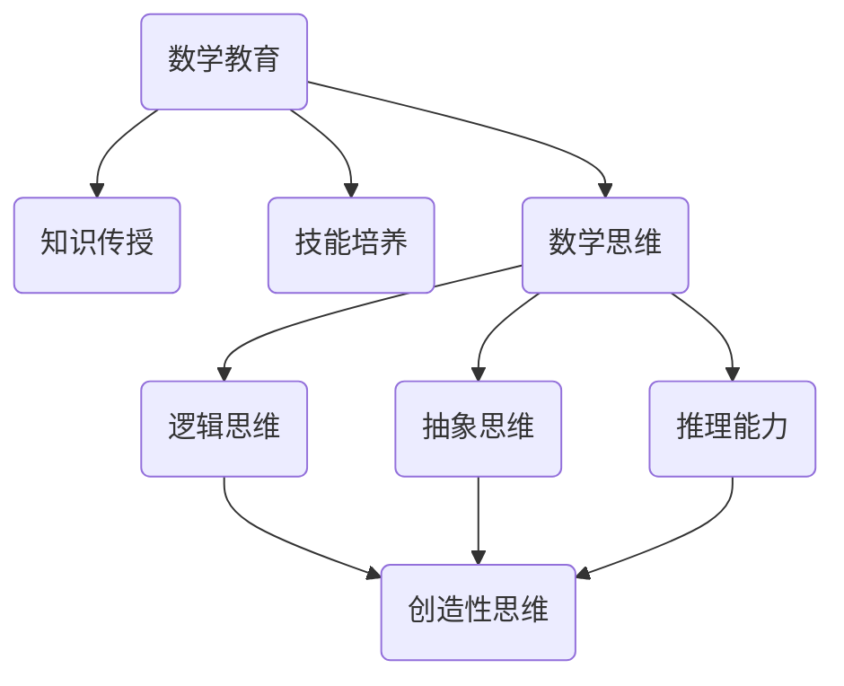

                 


## 数学教育与创造性思维培养的方法

### 背景介绍

数学教育作为基础学科之一，一直被重视，它不仅传授知识，更培养学生的思维能力和解决问题的方法。然而，在信息爆炸和知识快速更新的时代，数学教育如何培养具有创新意识和创造力的新一代，成为了教育领域的重要课题。创造性思维作为一种高阶思维能力，不仅对个人的事业发展至关重要，更是社会进步的推动力。

数学教育在创造性思维培养中的作用不可小觑。通过数学学习，学生可以锻炼逻辑思维、抽象思维、推理能力等，这些都是创造性思维的基石。此外，数学问题的解决过程，往往需要发散思维、联想思维、逆向思维等多种创造性思维方式的综合运用。因此，探索数学教育如何有效培养创造性思维，对于提升学生综合素质具有重要意义。

### 核心概念与联系

要深入理解数学教育与创造性思维培养，我们需要明确几个核心概念：

1. **数学教育**：包括数学知识传授、数学技能培养、数学思维能力发展等方面。
2. **创造性思维**：指在已有知识和经验的基础上，形成新的想法、解决方案或创造新事物的能力。
3. **数学思维**：包括逻辑思维、抽象思维、推理能力等，这些是创造性思维的重要组成部分。

这些概念之间的关系可以用以下 Mermaid 流程图表示：



### 核心算法原理讲解

要培养创造性思维，数学教育需要采用一系列的教学方法和策略。以下是一个简单的伪代码，用于描述这一过程：

```python
def educate_for_creative_thinking():
    # 知识传授
    teach_knowledge()
    # 技能培养
    develop_skills()
    # 数学思维能力培养
    enhance_math_thinking()

    # 创造性思维培养
    cultivate_creative_thinking()

    # 反馈与调整
    feedback_and_adjustment()
```

在这个伪代码中，`teach_knowledge()` 代表数学知识传授，`develop_skills()` 代表数学技能培养，`enhance_math_thinking()` 代表数学思维能力的培养。`cultivate_creative_thinking()` 是核心步骤，涉及到创造性思维的培养方法。`feedback_and_adjustment()` 则是反馈和调整的过程，以确保教学策略的有效性。

### 数学模型和公式

在数学教育中，一些数学模型和公式对于创造性思维的培养至关重要。以下是一个简单的例子：

1. **牛顿迭代法**

$$
x_{n+1} = x_n - \frac{f(x_n)}{f'(x_n)}
$$

牛顿迭代法是一种用于求解非线性方程的方法，其迭代过程体现了创造性思维中的试错和优化过程。

2. **高斯消元法**

$$
a_{ij} = a_{i1} \times a_{1j} - a_{i2} \times a_{2j} + \ldots + (-1)^{j+1} a_{in} \times a_{nj}
$$

高斯消元法是解决线性方程组的一种方法，其过程体现了逻辑思维和推理能力。

3. **组合数学中的卡塔兰数**

$$
C_n = \frac{1}{n+1} \binom{2n}{n}
$$

卡塔兰数在组合数学中有着广泛的应用，例如在图论和组合设计中的计数问题，其计算过程可以培养学生的抽象思维和推理能力。

### 项目实战

为了更好地理解数学教育如何培养创造性思维，我们可以通过一个具体的案例来分析。以下是使用 Python 实现一个简单的数学问题解决过程的案例：

#### 问题：使用牛顿迭代法求解方程 $f(x) = x^2 - 2 = 0$

```python
def newton_method(x0, tolerance, max_iterations):
    x = x0
    for i in range(max_iterations):
        f = x ** 2 - 2
        df = 2 * x
        x = x - f / df
        if abs(f) < tolerance:
            return x
    return None

# 初始化参数
x0 = 1.0
tolerance = 1e-6
max_iterations = 100

# 运行牛顿迭代法
result = newton_method(x0, tolerance, max_iterations)
if result is not None:
    print(f"方程的解为：{result}")
else:
    print("未能找到解。")
```

在这个案例中，我们通过编程实现了牛顿迭代法求解非线性方程的过程。这个过程中，我们不仅应用了数学公式，还涉及到了编程技巧和问题解决策略，这些都是创造性思维的体现。

### 最佳实践 tips

1. **鼓励学生自主学习**：自主学习是培养创造性思维的重要途径。教师应该提供更多的自主探索空间，让学生在问题解决过程中培养创造性思维。

2. **多学科交叉融合**：数学教育可以与其他学科如物理、计算机科学等相结合，通过跨学科项目培养学生的创造性思维。

3. **实践与理论相结合**：通过数学建模、数学竞赛等活动，让学生在实践过程中应用数学知识，锻炼创造性思维。

4. **鼓励批判性思维**：在数学教育中，培养学生的批判性思维，鼓励他们质疑传统观念，提出新的想法。

### 小结

数学教育在培养创造性思维方面具有重要作用。通过知识传授、技能培养、数学思维发展和创造性思维培养，数学教育可以为学生提供丰富的创造性思维训练。未来的数学教育应该更加注重培养学生的创新意识和创造力，以适应快速变化的社会需求。

### 注意事项

1. 在设计数学教育课程时，要充分考虑学生的认知水平和学习兴趣。
2. 教师应该不断更新自己的教学方法和知识体系，以适应创造性思维培养的需要。

### 拓展阅读

1. 《数学思维与创造性思维培养》
2. 《数学教育心理学》
3. 《创造性思维：理论与实践》

---

**作者：AI天才研究院/AI Genius Institute & 禅与计算机程序设计艺术 /Zen And The Art of Computer Programming**

本文系统地探讨了数学教育与创造性思维培养之间的关系，并通过具体的案例和实践方法，展示了如何在数学教育中有效地培养创造性思维。文章强调了数学教育在知识传授、技能培养和思维能力发展方面的作用，并提出了多种实践策略。未来，数学教育应该更加注重培养学生的创新意识和创造力，以应对未来社会的挑战。作者希望通过本文，为数学教育工作者和研究人员提供有价值的参考和启示。

