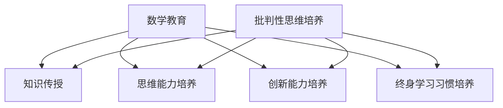

                 

### 文章标题

《数学教育与批判性思维培养的关系》

### 关键词

数学教育、批判性思维、培养、关系、教育实践

### 摘要

本文旨在探讨数学教育与批判性思维培养之间的关系。数学教育作为现代教育的重要组成部分，不仅在知识传授上起着关键作用，还在培养学生的批判性思维方面具有独特优势。本文首先介绍了数学教育的重要性以及批判性思维在现代教育中的地位，随后深入分析了数学教育的核心概念和批判性思维的理论基础。在此基础上，文章进一步阐述了数学教育如何影响和促进批判性思维的培养，以及如何通过课程设计与教学方法的创新来培养批判性思维。最后，本文通过教育实践案例分析，总结了数学教育与批判性思维培养的现状、挑战与未来发展趋势，并提出了一些建议和展望。

## 第1章 引言

### 1.1 数学教育的重要性

数学教育是现代教育体系中的核心组成部分，具有不可替代的重要地位。首先，数学是一门基础学科，它为其他学科的发展提供了坚实的理论基础。无论是自然科学、工程技术，还是社会科学，数学都扮演着不可或缺的角色。通过数学教育，学生可以掌握解决实际问题的基本方法和思维方式，从而为未来的学习和职业发展奠定坚实的基础。

其次，数学教育对于培养学生的逻辑思维和抽象思维能力具有重要作用。数学是一门强调逻辑推理和抽象思维的学科，通过数学学习，学生可以培养严谨的思维方式、提高解决问题的能力。这些能力不仅在学术领域中有重要作用，也在日常生活和工作中具有广泛的应用。

最后，数学教育有助于培养学生的创新精神和创造力。数学是一门充满挑战和创造力的学科，通过数学问题的解决过程，学生可以培养独立思考和创新能力。这种创新能力在现代社会中尤为重要，它推动了科技的发展和社会的进步。

### 1.2 批判性思维的培养

批判性思维是一种理性思考和分析问题的能力，它强调对信息的质疑、分析和评估。批判性思维的培养在现代教育中具有重要地位，因为它能够帮助学生更好地理解世界、解决问题，并做出明智的决策。批判性思维能力的培养不仅有助于学术成就，还在个人成长、社会交往和职业发展等方面具有重要作用。

首先，批判性思维有助于培养学生的独立思考能力。在批判性思维的过程中，学生需要独立分析信息、评估观点，并提出自己的见解。这种独立思考的能力是现代社会中不可或缺的，它使学生能够在复杂多变的环境中独立应对各种挑战。

其次，批判性思维能够提高学生的分析问题和解决问题的能力。批判性思维强调对信息的深入分析和逻辑推理，这使学生能够更全面、准确地理解问题，并提出有效的解决方案。这种能力在学术研究、工作实践和社会生活中都具有重要的应用价值。

最后，批判性思维有助于培养学生的道德和社会责任感。批判性思维不仅关注问题的解决，还关注问题的根源和影响。通过批判性思维，学生可以更好地理解社会问题和道德冲突，从而培养责任感和社会参与意识。

### 1.3 数学教育与批判性思维的培养

数学教育在培养学生的批判性思维方面具有独特的优势。首先，数学教育强调逻辑推理和抽象思维，这为批判性思维的培养提供了基础。数学问题的解决过程需要学生进行逻辑推理、分析和评估，这些过程与批判性思维的基本要素高度契合。

其次，数学教育中的问题解决策略和数学模型为学生提供了丰富的实践机会。通过解决数学问题，学生可以培养批判性思维的各种能力，如信息分析、逻辑推理、评估与反思。这些实践机会不仅有助于提高学生的批判性思维能力，还能激发他们的学习兴趣和创造力。

最后，数学教育中的开放性问题和学习任务为学生提供了更多的思考空间。批判性思维的培养需要学生有独立思考的机会，而数学教育中的开放性问题和学习任务正好提供了这样的空间。学生可以在这些问题和任务中自主探索、提出自己的观点，并通过讨论和反思不断深化理解。

总之，数学教育在培养学生的批判性思维方面具有重要作用。通过数学教育，学生不仅可以掌握数学知识和技能，还能培养批判性思维的各种能力，从而为未来的学习和职业发展奠定坚实的基础。

## 第2章 数学教育的核心概念

### 2.1 数学的基本概念

数学是一门研究数量、结构、变化和空间的科学，其基本概念包括数、函数、集合、几何等。这些基本概念构成了数学的核心，是数学教育的基石。数是数学的基本元素，它表示物体的数量或顺序。函数是数学中描述变量之间关系的重要工具，它通过映射关系将一个变量与另一个变量联系起来。集合是数学中用于表示对象集合的概念，它为数学提供了抽象的思维方式。几何则研究空间中的形状、大小和位置关系，为理解和解决现实世界中的空间问题提供了理论依据。

数学的基本概念不仅是数学学科的基础，也是其他学科发展的重要基础。例如，在物理学中，数学被用来描述自然现象和运动规律；在计算机科学中，数学用于算法设计和数据分析。因此，掌握数学的基本概念对于培养学生的科学素养和创新能力具有重要意义。

### 2.2 数学问题的解决策略

数学问题的解决策略是指学生在解决数学问题时所采用的方法和步骤。有效的解决策略不仅能够提高学生的数学成绩，还能培养学生的逻辑思维、分析问题和解决问题的能力。数学问题的解决策略包括以下几个关键步骤：

首先，理解问题。在解决数学问题之前，学生需要准确理解问题的要求和条件。这包括识别问题的核心、分析问题的变量和已知信息等。理解问题有助于学生明确解决问题的方向，避免盲目解题。

其次，建立模型。建立数学模型是将实际问题转化为数学问题的重要步骤。数学模型通常包括变量、方程、图形等元素，它能够将实际问题中的复杂关系转化为简单的数学关系。建立模型有助于学生从整体上把握问题的本质，提高解决问题的效率。

接着，选择方法。不同的数学问题可能需要不同的解决方法。学生需要根据问题的特点和已知信息，选择合适的解决方法。常见的数学解决方法包括代数法、几何法、归纳法等。选择方法时，学生需要考虑方法的简便性、可行性以及解决问题的全面性。

然后，实施计算。在确定了解决方法和步骤后，学生需要按照既定的方法进行计算，求解问题的答案。实施计算过程中，学生需要注重计算的精度和准确性，避免因计算错误导致结果偏差。

最后，验证答案。求解出答案后，学生需要验证答案的正确性。验证方法包括将答案代入原问题进行检验、利用已知条件进行推理等。通过验证，学生可以确保答案的准确性，避免因误解问题或计算错误而得出错误答案。

总之，数学问题的解决策略不仅包括具体的计算步骤，还涉及到理解问题、建立模型、选择方法、实施计算和验证答案等多个方面。掌握有效的数学问题解决策略，有助于学生在数学学习中取得更好的成绩，提高解决问题的能力。

### 2.3 数学教育的目标

数学教育的目标不仅仅是传授数学知识和技能，更重要的是培养学生的思维能力、创新能力以及终身学习的习惯。具体来说，数学教育的目标可以分为以下几个方面：

首先，知识传授。数学教育的基本目标是使学生掌握数学的基本概念、原理和方法。这包括数的概念、函数、几何、代数等基础数学知识。学生通过学习这些知识，可以建立扎实的数学基础，为未来的学习和职业发展奠定基础。

其次，思维能力培养。数学教育注重培养学生的逻辑思维、分析问题和解决问题的能力。通过数学问题的解决过程，学生可以学会如何运用逻辑思维来分析问题、构建模型和设计解决方案。这种思维能力在学生的日常生活和工作中都具有广泛的应用。

第三，创新能力培养。数学教育鼓励学生独立思考和探索，培养学生的创新能力。通过解决开放性的数学问题和进行数学探索，学生可以培养创造性思维，提出新的观点和方法。这种创新能力在现代社会中尤为重要，它推动了科技的发展和社会的进步。

最后，终身学习习惯培养。数学教育强调培养学生自主学习的能力，使他们具备终身学习的习惯。通过数学学习，学生可以学会如何通过自学和探索来获取新知识和技能，从而在未来的学习和职业发展中不断进步。

总之，数学教育的目标不仅包括知识传授，更重要的是培养学生的思维能力、创新能力和终身学习的习惯。这些目标的实现，将有助于学生更好地适应社会发展的需求，为未来的学习和职业发展奠定坚实的基础。

## 第3章 批判性思维的理论基础

### 3.1 批判性思维的定义

批判性思维（Critical Thinking）是一种理性思考和分析问题的能力，它涉及对信息的质疑、分析、评估和综合。这种思维方式强调在理解问题的基础上，通过逻辑推理和证据评估来形成独立的见解和判断。批判性思维不仅关注问题的表面现象，更深入挖掘问题的本质和内在逻辑关系。

定义批判性思维的关键在于其强调理性和客观性。批判性思维要求思考者在面对信息时，不仅要接受和相信，还要质疑和验证。这种思维方式有助于消除偏见、纠正错误，并形成准确、全面的认识。批判性思维不仅是一种技能，更是一种态度，它要求思考者保持开放和谦逊，不断反思和改进自己的思考方式。

在学术研究中，批判性思维被广泛应用于各个领域。例如，在社会科学研究中，批判性思维有助于研究人员识别和评估研究假设、设计研究方法和分析研究结果。在人文科学中，批判性思维有助于学生理解和评价文学作品、历史事件和社会现象。在自然科学中，批判性思维同样重要，它有助于科学家评估实验结果、构建科学理论并推动科学进步。

总之，批判性思维是一种理性思考和分析问题的能力，它在学术研究和日常生活中都发挥着重要作用。通过培养批判性思维，学生可以更好地理解世界、解决问题，并做出明智的决策。

### 3.2 批判性思维的关键要素

批判性思维的关键要素包括信息分析、逻辑推理、评估与反思。这些要素共同构成了批判性思维的核心，使得思考者能够以理性、客观的方式分析问题和形成独立的见解。

首先，信息分析是批判性思维的基础。信息分析涉及对获取的信息进行识别、整理和分类，以明确信息的来源、可靠性以及相关性。在分析信息时，思考者需要辨别事实与观点、主观与客观，从而确保信息的准确性和全面性。例如，在研究一个社会现象时，思考者需要分析相关数据、文献和案例，以确定现象的根本原因和影响。

其次，逻辑推理是批判性思维的核心。逻辑推理是通过一系列逻辑步骤，从已知信息中推导出新的结论或判断。批判性思维强调推理的严谨性和合理性，要求思考者在推理过程中遵循逻辑规则，避免逻辑谬误。例如，在分析一个经济学问题时，思考者可能需要使用归纳推理和演绎推理来推导出经济模型和预测结果。

最后，评估与反思是批判性思维的关键环节。评估与反思涉及对推理过程和结论进行审查和评价，以确保思考的准确性和有效性。在评估过程中，思考者需要考虑证据的充分性、推理的严密性以及结论的合理性。例如，在评估一个科学实验时，思考者需要审查实验设计、数据收集和分析过程，以判断实验结果的可靠性和有效性。

总之，批判性思维的关键要素包括信息分析、逻辑推理和评估与反思。这些要素共同作用，使得思考者能够以理性、客观的方式分析问题和形成独立的见解，从而提高思考的质量和深度。

### 3.3 批判性思维在教育中的应用

批判性思维在教育中的应用具有重要意义，它不仅有助于提高学生的学术成绩，还能培养他们的思维能力、创新能力和综合素质。以下将从教学设计、课堂管理和学生评估三个方面，探讨批判性思维在教育中的应用。

首先，在教学设计方面，教师应注重培养学生的批判性思维。教师可以通过设计具有挑战性和开放性的学习任务，激发学生的思考兴趣和探索精神。例如，教师可以设计问题解决类任务，让学生在解决问题过程中进行信息分析、逻辑推理和评估反思。这些任务不仅有助于学生掌握知识，还能培养他们的批判性思维能力。此外，教师还可以利用案例分析、模拟实验等教学手段，提高学生的实际操作能力和批判性思维能力。

其次，在课堂管理方面，教师应营造一个开放、包容、批判性思维氛围。教师应鼓励学生表达自己的观点和见解，并对学生的观点进行理性分析和评价。例如，在课堂讨论中，教师可以引导学生对不同的观点进行辩论，通过辩论的过程，学生可以学会如何批判性地分析信息、构建合理的论据和进行有效的反驳。这种课堂氛围有助于培养学生的批判性思维，提高他们的思维品质和沟通能力。

最后，在学生评估方面，教师应采用多元化的评估方式，以全面、客观地评价学生的批判性思维能力。教师可以通过笔试、口试、项目展示等多种评估方式，全面了解学生在信息分析、逻辑推理、评估反思等方面的表现。例如，教师可以设计批判性思维测试，评估学生在信息分析、逻辑推理和评估反思等方面的能力。此外，教师还可以通过观察学生在课堂上的表现，如参与讨论的积极性、提出的问题质量等，来评估学生的批判性思维能力。

总之，批判性思维在教育中的应用是一个系统工程，需要从教学设计、课堂管理和学生评估等多个方面进行综合考虑。通过培养和激发学生的批判性思维，教师可以帮助学生在学习中更好地理解知识、解决问题，并在未来的生活和职业发展中具备更强的适应能力和创新能力。

### 第4章 数学教育对批判性思维的影响

#### 4.1 数学教育如何促进批判性思维

数学教育在培养批判性思维方面具有独特优势，主要体现在以下几个方面：

首先，数学教育强调逻辑推理和抽象思维能力。数学是一门基于逻辑推理和抽象思维的学科，通过数学学习，学生可以掌握严谨的逻辑推理方法和抽象思维能力。这种能力在批判性思维中起着重要作用，因为批判性思维需要通过逻辑推理来分析问题、构建论据和进行推理。

其次，数学教育提供了大量的实际问题解决经验。数学教育中的问题解决过程不仅包括对已知信息的分析，还包括提出假设、设计解决方案和验证结果。这种问题解决过程与批判性思维的要求高度契合，因为它要求学生进行独立思考、质疑已知信息、评估不同解决方案的有效性。通过解决数学问题，学生可以积累丰富的实践经验，提高批判性思维能力。

第三，数学教育中的开放性问题和学习任务为学生提供了自主思考和探索的空间。开放性问题和学习任务通常没有唯一的解决方案，学生需要根据自己的理解和判断来解决问题。这种自主学习的过程有助于培养学生的批判性思维，因为它要求学生进行独立思考、提出自己的观点和论证。

最后，数学教育鼓励学生进行反思和评估。在数学学习中，学生需要对自己的解题过程和答案进行反思和评估，以确定是否存在错误或改进的空间。这种反思和评估的过程有助于学生形成批判性思维的习惯，提高他们的思维品质。

总之，数学教育通过强调逻辑推理、提供实际问题解决经验、开放性问题和学习任务，以及鼓励反思和评估，促进了批判性思维的培养。

#### 4.2 数学问题解决过程中的批判性思维

在数学问题解决过程中，批判性思维发挥着重要作用。以下通过几个具体案例，详细分析批判性思维在数学问题解决中的应用。

**案例1：解决一元二次方程**

假设我们要解决方程 $x^2 - 5x + 6 = 0$。在解决这个问题时，学生首先需要识别出这是一个一元二次方程，然后选择合适的解决方法，如因式分解或配方法。这是一个需要逻辑推理的过程，学生需要根据方程的特点选择最佳方法。例如，选择因式分解是因为它可以简化方程，使得问题变得更为直观。

在因式分解过程中，学生需要验证分解的结果是否符合原方程。这个验证过程体现了批判性思维中的评估和反思。如果分解结果不符合原方程，学生需要重新审视自己的解法，寻找错误的原因并进行修正。这种反思和评估有助于提高解题的准确性。

**案例2：证明三角形内角和为180度**

另一个经典的数学问题是如何证明三角形的内角和为180度。这个问题需要学生运用几何学中的各种定理和概念，通过逻辑推理来构建一个严密的证明过程。

在证明过程中，学生需要首先明确已知条件和要证明的结论。然后，通过一系列逻辑推理步骤，将已知条件逐步推导到要证明的结论。这个过程中，学生需要评估每个推理步骤的合理性，确保证明过程没有逻辑错误。

例如，一种常见的证明方法是使用平行线的性质。学生需要证明，当一个三角形的一个角被一条平行线切割时，形成的两个内错角相等，从而得出三角形的内角和为180度的结论。这个证明过程不仅需要逻辑推理，还需要对已知条件和定理进行有效评估。

**案例3：求解最优化问题**

在求解最优化问题时，例如，求解一个函数的最小值，学生需要运用微积分中的导数概念。求解最小值的过程需要学生分析函数的导数，确定导数为零的点，并评估这些点的性质。

在这个过程中，学生需要批判性地分析导数的正负变化，确定函数的单调性，从而判断哪个点是函数的最小值。这个评估过程体现了批判性思维中的信息分析和评估能力。

例如，对于函数 $f(x) = x^2 + 2x + 1$，学生需要求其导数 $f'(x) = 2x + 2$，然后令导数为零，得到临界点 $x = -1$。接下来，学生需要分析导数在临界点左侧和右侧的符号，确定函数的单调性，从而判断 $x = -1$ 是函数的最小值。

通过这些案例，我们可以看到，在数学问题解决过程中，批判性思维的应用贯穿始终。无论是识别问题、选择解决方法，还是进行推理和评估，都需要批判性思维的参与。这种思维能力不仅提高了数学问题解决的质量和效率，还培养了学生的逻辑推理和抽象思维能力。

#### 4.3 数学教育实践中的案例分析

在数学教育实践中，通过具体案例分析，我们可以更直观地看到数学教育如何促进批判性思维的培养。以下是一个详细的案例分析，展示了如何在实际教学中培养学生的批判性思维。

**案例背景：**

某高中数学课堂上，教师给学生布置了一道题目：求解不等式 $2x - 5 > 3x + 1$ 的解集。这个题目相对简单，但包含了一定的思维挑战，适合用于培养学生的批判性思维。

**教学过程：**

1. **引入问题：** 教师首先向学生介绍不等式的概念和基本性质，然后给出不等式 $2x - 5 > 3x + 1$，要求学生独立求解。

2. **初步解答：** 学生尝试解答，教师巡视课堂，观察学生的解题过程和思路。在解答过程中，一些学生可能会直接通过移项和合并同类项来求解，而另一些学生可能会尝试其他方法。

3. **讨论与反思：** 教师引导学生进行小组讨论，分享各自的解题思路和过程。在这个过程中，学生可以互相质疑和探讨，进一步深化对不等式解法的理解。

4. **案例展示：** 教师选择几个具有代表性的解答过程进行展示，并引导学生分析这些解答的优缺点。例如，一个学生可能通过简单的移项和合并同类项得出解集为 $x < -1$，而另一个学生可能通过画出不等式的图像来直观地理解解集。

5. **批判性思维训练：** 教师引导学生进行批判性思维训练。首先，教师提出问题：“为什么第一个学生的解法也能得到正确的解集？”学生需要通过逻辑推理和评估来解释这个问题。其次，教师提出问题：“还有其他方法可以解决这个问题吗？”学生需要思考并尝试使用不同的方法。

6. **总结与反馈：** 教师对学生的讨论和批判性思维过程进行总结，强调逻辑推理、评估和反思的重要性。同时，教师对学生的表现给予反馈，指出他们在批判性思维方面的优点和需要改进的地方。

**案例分析结果与启示：**

通过这个案例，我们可以看到数学教育在培养学生的批判性思维方面的显著效果。具体来说：

1. **提高逻辑推理能力：** 学生在解答不等式时需要运用逻辑推理来移项、合并同类项和解不等式。通过这个过程中，学生不仅掌握了基本的数学运算技巧，还提高了逻辑推理的能力。

2. **培养评估和反思能力：** 在讨论和批判性思维训练环节，学生需要评估和反思自己的解法和同学的解法。这个过程中，学生学会了如何从多个角度分析和评估问题，培养了评估和反思能力。

3. **增强自主学习能力：** 学生在小组讨论和批判性思维训练中积极参与，提出问题和解答问题。这有助于学生养成自主学习的习惯，提高自主学习能力。

4. **促进合作学习：** 通过小组讨论和合作解决问题，学生学会了如何与他人沟通、合作，促进了合作学习。

总之，数学教育实践中的具体案例分析不仅有助于学生掌握数学知识和技能，还能有效培养他们的批判性思维。通过这种方式，教师可以帮助学生在数学学习中不断反思和提升自己的思维品质，为未来的学习和职业发展奠定坚实的基础。

### 第5章 批判性思维在数学教育中的培养策略

#### 5.1 教师的角色

教师在数学教育中培养学生的批判性思维扮演着关键角色，具体体现在以下几个方面：

首先，教师需要扮演引导者的角色。教师应引导学生积极思考、质疑和探索，鼓励他们提出自己的观点和问题。在数学课堂上，教师可以通过提出开放性问题、设置思维挑战等方式，激发学生的思考兴趣和探索精神。例如，在讲解一个数学概念时，教师可以提出：“你们如何理解这个概念？有没有不同的观点？”这样的问题能够引导学生进行深入思考，培养他们的批判性思维。

其次，教师需要作为榜样，展示批判性思维的过程和方法。教师可以通过自身的教学实践，展示如何通过逻辑推理、分析信息和评估结果来解决问题。例如，在解决一个复杂的数学问题时，教师可以逐步展示自己的思考过程，包括识别问题、建立模型、选择方法、实施计算和验证答案等步骤。这样，学生可以直观地看到批判性思维的应用，从而学会如何进行批判性思维。

第三，教师需要提供反馈和指导，帮助学生改进批判性思维。在学生进行批判性思维训练时，教师应及时给予反馈，指出他们在思维过程中的优点和不足。例如，如果一个学生在解答数学问题时，没有充分分析已知条件或没有选择合适的解决方法，教师可以引导他们重新审视问题，并提供具体的指导和建议。这种及时的反馈和指导有助于学生不断改进自己的批判性思维。

#### 5.2 学生的主动参与

学生的主动参与是培养批判性思维的重要策略之一，具体体现在以下几个方面：

首先，学生需要积极参与课堂讨论。在数学课堂上，教师可以设计一些开放性问题，鼓励学生发表自己的见解和观点。学生可以通过课堂讨论，与其他同学交流思想，共同探讨问题的解决方法。例如，在讨论一个数学问题时，学生可以分享自己的解题思路，提出不同的观点，并通过辩论来深化对问题的理解。

其次，学生需要积极参与问题解决。在数学学习中，学生不仅需要掌握基本的数学知识和技能，还需要积极参与问题解决。教师可以布置一些具有挑战性的数学问题，让学生自主探索和解决。通过这种方式，学生可以培养独立思考和解决问题的能力，同时提高批判性思维能力。

第三，学生需要养成自主学习的习惯。批判性思维的培养需要学生具备较强的自主学习能力。教师可以通过引导学生在课外进行自主学习，鼓励他们阅读相关文献、进行数学探索和研究。例如，教师可以推荐一些数学读物或在线资源，让学生自主学习和探究数学问题。这样，学生可以在自主学习中不断锻炼批判性思维。

总之，学生的主动参与是培养批判性思维的关键策略。通过积极参与课堂讨论、解决问题和自主学习，学生可以不断锻炼批判性思维能力，提高自己的思维品质和解决问题的能力。

#### 5.3 课程设计与教学方法的创新

在数学教育中，课程设计与教学方法的创新对于培养批判性思维具有重要意义。以下从课程设计、教学方法和评估方式三个方面，探讨如何通过创新来培养批判性思维。

**1. 课程设计创新**

首先，课程设计应注重开放性和综合性。教师可以设计一些跨学科的综合课程，将数学与其他学科如物理、化学、计算机科学等相结合。这种跨学科的课程设计不仅能够拓宽学生的知识视野，还能激发他们的兴趣和创造力。例如，可以设计一门“数学与物理”课程，让学生通过解决物理问题来应用数学知识。

其次，课程设计应注重问题驱动的学习。教师可以设计一系列具有挑战性和开放性的数学问题，让学生在解决问题的过程中进行批判性思维。这种问题驱动的学习方式能够引导学生主动思考、探索和解决问题，从而培养他们的批判性思维。例如，可以设计一些数学竞赛题目，让学生在解决这些题目时进行深度思考和逻辑推理。

**2. 教学方法创新**

首先，采用探究式教学。教师可以引导学生进行自主探究和合作学习，通过实验、模拟、讨论等方式来解决问题。这种探究式教学能够激发学生的好奇心和求知欲，培养他们的批判性思维。例如，在讲解几何问题时，教师可以让学生通过实际操作和测量来探究几何图形的性质。

其次，采用案例教学。教师可以通过讲解经典数学案例，引导学生分析案例中的问题和解决方法，培养他们的批判性思维。例如，可以讲解一个经典的数学问题，如“哥德巴赫猜想”，让学生分析问题并提出自己的观点。

第三，采用互动式教学。教师可以运用现代教育技术，如多媒体、网络资源等，创造一个互动的课堂环境。通过提问、讨论、答疑等互动环节，教师可以引导学生进行批判性思维。例如，在讲解一个复杂的数学问题时，教师可以通过在线讨论平台与学生进行实时互动，解答学生的疑问。

**3. 评估方式创新**

首先，采用多元化的评估方式。教师可以采用笔试、口试、项目展示等多种评估方式，全面评价学生的批判性思维能力。例如，可以设计一个数学项目，要求学生通过解决实际问题来展示他们的批判性思维。

其次，采用过程性评估。教师可以记录学生在学习过程中的表现，如课堂讨论、问题解决、自主学习等。通过过程性评估，教师可以了解学生的批判性思维发展情况，并提供针对性的指导。

总之，课程设计与教学方法的创新是培养批判性思维的重要策略。通过开放性和综合性的课程设计、探究式教学、案例教学和互动式教学，以及多元化的评估方式，教师可以有效地培养学生的批判性思维，提高他们的思维品质和解决问题的能力。

### 第6章 数学教育与批判性思维的跨学科联系

#### 6.1 数学与其他学科的交叉

数学与其他学科的交叉融合不仅拓宽了数学的应用领域，还促进了批判性思维的培养。以下通过几个实例，探讨数学与其他学科的结合如何推动批判性思维的培养。

首先，数学与计算机科学的交叉。计算机科学中的算法设计和数据分析高度依赖于数学原理。例如，在算法设计中，学生需要运用图论、组合数学等数学知识来优化算法效率。在这个过程中，学生需要分析算法的时间复杂度和空间复杂度，评估不同算法的优缺点，从而培养批判性思维。此外，数据分析中的概率统计、线性代数等数学知识也要求学生具备较强的批判性思维能力，能够准确解读数据、识别数据中的模式并设计有效的分析模型。

其次，数学与物理学的交叉。物理学中的许多问题需要运用数学工具来解决。例如，在量子力学中，学生需要运用微积分和线性代数来描述粒子的运动状态。通过解决这些复杂的数学问题，学生可以培养严谨的数学思维和批判性思维能力。此外，物理学中的实验设计、数据分析等环节也要求学生具备批判性思维，能够评估实验结果的可靠性、识别实验中的误差并改进实验方法。

第三，数学与生物学的交叉。在生物学中，数学被广泛应用于基因分析、种群生态学、神经科学等领域。例如，在基因分析中，学生需要运用概率论和统计学的知识来识别基因序列中的变异和关联。通过这种交叉应用，学生可以培养批判性思维，能够评估不同分析方法的可靠性、识别潜在的错误并设计更有效的分析方法。

总之，数学与其他学科的交叉融合为批判性思维的培养提供了丰富的实践机会。通过解决跨学科问题，学生可以培养逻辑推理、信息分析、评估反思等多种批判性思维能力，提高他们的综合素质。

#### 6.2 跨学科视角下的数学教育

在跨学科视角下，数学教育不仅关注数学知识的传授，还强调数学与其他学科的融合，以培养学生的综合素质和批判性思维。以下从课程设计、教学方法、评估方式三个方面，探讨如何通过跨学科视角来优化数学教育。

**1. 课程设计优化**

首先，课程设计应注重跨学科的综合性和应用性。教师可以设计一些跨学科的课程模块，将数学与其他学科如物理学、计算机科学、经济学等相结合。例如，可以开设“数学与经济学”课程，让学生通过解决经济学中的数学问题来掌握数学知识。这种跨学科的课程设计不仅能够拓宽学生的知识视野，还能激发他们的学习兴趣和创造力。

其次，课程设计应强调实际问题的解决。教师可以设计一些具有现实意义的问题，让学生在解决这些问题的过程中应用数学知识。例如，可以设计一个关于城市规划的问题，要求学生通过应用几何学和概率论来设计一个最优化的交通网络。这种实际问题的解决过程能够培养学生的批判性思维，提高他们的问题解决能力和创新能力。

**2. 教学方法优化**

首先，采用探究式教学。教师可以引导学生进行自主探究和合作学习，通过实验、模拟、讨论等方式来解决问题。例如，在讲解一个复杂的数学问题时，教师可以让学生通过小组合作，共同探讨问题的解决方法。这种探究式教学能够激发学生的好奇心和求知欲，培养他们的批判性思维。

其次，采用案例教学。教师可以通过讲解经典数学案例，引导学生分析案例中的问题和解决方法，培养他们的批判性思维。例如，可以讲解一个经典的数学问题，如“哥德巴赫猜想”，让学生通过分析问题背景、历史发展和解决方法，培养他们的批判性思维。

第三，采用互动式教学。教师可以运用现代教育技术，如多媒体、网络资源等，创造一个互动的课堂环境。通过提问、讨论、答疑等互动环节，教师可以引导学生进行批判性思维。例如，在讲解一个复杂的数学问题时，教师可以通过在线讨论平台与学生进行实时互动，解答学生的疑问。

**3. 评估方式优化**

首先，采用多元化的评估方式。教师可以采用笔试、口试、项目展示等多种评估方式，全面评价学生的批判性思维能力。例如，可以设计一个数学项目，要求学生通过解决实际问题来展示他们的批判性思维。

其次，采用过程性评估。教师可以记录学生在学习过程中的表现，如课堂讨论、问题解决、自主学习等。通过过程性评估，教师可以了解学生的批判性思维发展情况，并提供针对性的指导。

总之，通过跨学科视角来优化数学教育，可以更好地培养学生的批判性思维。通过综合性的课程设计、探究式教学、案例教学和互动式教学，以及多元化的评估方式，教师可以有效地培养学生的批判性思维，提高他们的综合素质和创新能力。

#### 6.3 批判性思维在其他学科教育中的应用

批判性思维不仅在数学教育中具有重要意义，在其他学科教育中也有着广泛的应用。以下从几个具体的学科领域出发，探讨批判性思维在其他学科教育中的应用及其效果。

**1. 在文学教育中的应用**

在文学教育中，批判性思维可以帮助学生更好地理解和分析文学作品。教师可以通过引导学生分析文学作品中的主题、人物、情节和语言风格，培养学生的批判性思维能力。例如，在阅读一首诗歌时，学生需要分析诗人的表达方式、情感态度以及诗歌的内涵。通过这种分析，学生不仅能够更深刻地理解文学作品，还能学会如何批判性地评价文学作品。

**2. 在历史教育中的应用**

在历史教育中，批判性思维有助于学生分析和评估历史事件和历史人物。教师可以通过引导学生分析历史背景、历史资料和不同历史观点，培养学生的批判性思维能力。例如，在讨论一个历史事件时，学生需要分析事件的起因、经过和结果，并评估不同历史观点的合理性。通过这种方式，学生可以学会如何从多个角度审视历史事件，培养他们的历史批判性思维。

**3. 在社会科学教育中的应用**

在社会科学教育中，批判性思维有助于学生理解和分析社会现象和社会问题。教师可以通过引导学生分析社会数据、社会调查结果和社会政策，培养学生的批判性思维能力。例如，在分析一项社会政策时，学生需要评估政策的利弊、影响和可持续性。通过这种方式，学生可以学会如何运用批判性思维来分析和解决社会问题。

**4. 在艺术教育中的应用**

在艺术教育中，批判性思维可以帮助学生更好地欣赏和评价艺术作品。教师可以通过引导学生分析艺术作品的风格、技巧和表达方式，培养学生的批判性思维能力。例如，在欣赏一幅绘画作品时，学生需要分析画家的表达意图、色彩运用和构图技巧。通过这种方式，学生可以学会如何运用批判性思维来欣赏和评价艺术作品。

**5. 在哲学教育中的应用**

在哲学教育中，批判性思维是核心能力之一。教师可以通过引导学生分析哲学问题、探讨不同哲学观点，培养学生的批判性思维能力。例如，在讨论一个哲学问题时，学生需要分析问题的本质、不同观点的优缺点，并形成自己的见解。通过这种方式，学生可以学会如何运用批判性思维来探讨和解决哲学问题。

总之，批判性思维在其他学科教育中的应用不仅有助于学生更全面地理解和分析所学内容，还能提高他们的思维能力、创新能力和社会责任感。通过培养批判性思维，学生可以更好地适应现代社会的发展需求，成为有思想、有见解的社会成员。

### 第7章 数学教育与批判性思维的教育实践

#### 7.1 教育实践案例分析

数学教育在培养学生的批判性思维方面有着丰富的实践经验。以下通过几个具体的案例分析，展示数学教育在批判性思维培养中的应用和效果。

**案例一：小学数学教育中的问题解决**

在某小学的数学课堂上，教师设计了一系列开放性问题，如“如何用三种不同的方法计算15+8？”和“如果你有10个苹果，想分给4个同学，应该怎么分？”这些问题鼓励学生自主思考、探索和解决问题。通过这种问题解决的过程，学生不仅掌握了基本的数学运算技巧，还培养了批判性思维。例如，一个学生在计算15+8时，通过尝试不同的方法（如加法交换律和结合律）得出结论，这不仅提高了他的数学能力，还锻炼了他的逻辑推理和评估能力。

**案例二：中学数学教育中的探究式学习**

在某中学的数学课堂上，教师采用探究式教学方法，引导学生通过实验和模拟来理解数学概念。例如，在讲解几何学中的“相似三角形”时，教师让学生使用几何软件进行模拟，观察当两个三角形变化时，它们的相似性如何变化。学生通过自主探究，发现相似三角形的特征和性质，并验证自己的猜想。这种探究式学习不仅激发了学生的学习兴趣，还培养了他们的批判性思维，使他们能够独立思考、提出问题并解决问题。

**案例三：大学数学教育中的项目式学习**

在某大学的数学课堂上，教师设计了一个项目式学习任务，要求学生利用数学模型解决一个实际问题。例如，一个项目是“如何设计一条最优的物流路线？”学生需要收集数据、建立数学模型、选择合适的算法，并验证模型的有效性。在这个过程中，学生不仅应用了所学的数学知识，还培养了批判性思维。他们需要评估不同模型的优缺点、选择最佳方案，并通过不断迭代和改进来优化解决方案。

**案例分析结果与启示**

通过这些案例分析，我们可以看到数学教育在培养学生的批判性思维方面取得了显著效果。具体启示如下：

1. **开放性问题激发思维：** 开放性问题能够激发学生的思考兴趣和探索精神，培养他们的批判性思维。教师应设计更多具有挑战性和开放性的问题，鼓励学生自主思考、提出问题并解决问题。

2. **探究式教学培养自主性：** 探究式教学能够引导学生自主学习和探索，培养他们的批判性思维。教师应采用多种教学方法，如实验、模拟和项目式学习，为学生提供自主学习的空间。

3. **项目式学习提高综合能力：** 项目式学习不仅能够提高学生的数学能力，还能培养他们的批判性思维和综合应用能力。教师应设计更多具有实际意义的项目，让学生在实践中应用数学知识。

总之，数学教育实践中的具体案例分析展示了数学教育在培养批判性思维方面的独特优势。通过开放性问题、探究式教学和项目式学习等策略，教师可以有效培养学生的批判性思维，提高他们的综合素质和创新能力。

#### 7.2 教育实践中的挑战与应对

在数学教育实践中，培养批判性思维面临着诸多挑战。以下分析这些挑战，并提出相应的应对策略。

**挑战一：学生对数学的兴趣不足**

许多学生对数学缺乏兴趣，这直接影响批判性思维的培养。学生可能认为数学内容枯燥乏味，难以激发他们的思考欲望。

**应对策略：** 
- **创新教学方法：** 教师可以通过引入多媒体教学、互动式教学和游戏化学习等创新教学方法，提高学生的参与度和兴趣。例如，利用动画、视频和模拟实验来解释数学概念，使学生能够直观地理解数学知识。
- **结合实际应用：** 教师可以将数学知识应用于实际生活中，让学生感受到数学的实用性和趣味性。例如，通过解决日常生活中的问题（如购物预算、时间管理）来应用数学知识。

**挑战二：教学资源不足**

在许多学校，教学资源不足，包括教材、实验室设备和信息技术支持等，这限制了数学教育的质量和批判性思维的培养。

**应对策略：**
- **多方合作：** 教育部门可以与社会机构、企业和非政府组织合作，争取更多的教学资源。例如，可以与科技企业合作，提供最新的信息技术设备和支持。
- **在线资源利用：** 教师可以利用丰富的在线教育资源，如在线课程、教育平台和数学软件等，补充教学资源不足的问题。这些资源可以提供多样化的学习材料和互动活动，激发学生的兴趣和思考。

**挑战三：教师专业能力不足**

一些教师可能缺乏培养批判性思维的教学方法和技能，这限制了他们在数学教育中培养学生的批判性思维。

**应对策略：**
- **教师培训：** 教育部门可以定期组织教师培训，提高他们的教学水平和批判性思维能力。培训内容可以包括批判性思维的原理、教学策略和实际操作技巧。
- **经验交流：** 教师可以参加教学研讨会和交流活动，分享教学经验和方法，互相学习，共同提高。通过交流，教师可以了解不同教学策略的应用效果，探索更有效的培养批判性思维的方法。

**挑战四：评估体系不完善**

目前的数学评估体系往往注重学生的数学知识和技能，而较少关注批判性思维的培养。这种评估体系不利于批判性思维的长期培养。

**应对策略：**
- **多元化评估：** 教师可以采用多元化的评估方式，如项目展示、口头报告和案例分析等，全面评价学生的批判性思维能力。这些评估方式不仅关注学生的知识掌握情况，还关注他们的思考过程和创新能力。
- **过程性评估：** 教师应重视学习过程，记录学生在学习过程中的表现和进步，通过过程性评估来全面了解学生的批判性思维发展情况。

总之，数学教育在实践中培养批判性思维面临着多种挑战。通过创新教学方法、增加教学资源、提高教师专业能力和完善评估体系，教师可以有效地应对这些挑战，培养学生的批判性思维，提高他们的综合素质和创新能力。

#### 7.3 教育实践的未来趋势

随着教育理念的不断更新和技术手段的持续进步，数学教育与批判性思维的培养正朝着更高效、更个性化的方向发展。以下分析未来教育实践中的趋势，并提出相应的发展方向。

**1. 技术驱动的个性化学习**

未来数学教育将更加依赖人工智能、大数据和互联网技术，实现个性化学习。通过分析学生的学习数据，教育技术可以为学生提供个性化的学习路径和资源，满足不同学生的学习需求。例如，智能辅导系统可以根据学生的答题情况，动态调整问题难度和类型，提供有针对性的练习和反馈，从而提高学习效率。

**2. 项目式学习的深化**

项目式学习作为一种有效的教学方式，将在未来得到进一步深化。教师可以设计更多具有实际应用背景的数学项目，让学生在解决实际问题的过程中培养批判性思维。这种学习模式不仅能够激发学生的学习兴趣，还能提高他们的实践能力和创新能力。

**3. 教师角色的转变**

未来教师将更多地扮演指导者和促进者的角色，而不是传统的知识传递者。教师需要具备更强的教学设计能力和批判性思维能力，能够引导学生进行深度学习和自主探索。此外，教师还需要不断更新知识和技能，以适应快速变化的教育环境。

**4. 评估体系的多元化**

未来数学教育的评估体系将更加多元化，不仅关注学生的知识掌握情况，还重视他们的批判性思维和创新能力。教师可以采用项目展示、案例分析、口头报告等多种评估方式，全面评价学生的综合素质。此外，过程性评估将成为评估体系的重要组成部分，通过记录学生的学习过程和进步，教师可以更准确地了解学生的学习情况，并提供个性化的指导。

**5. 跨学科的整合**

数学教育将更加注重与其他学科的整合，培养学生的跨学科思维。教师可以设计跨学科的项目和课程，让学生在解决综合性问题的过程中，应用数学知识和技能，培养他们的批判性思维。这种跨学科的教育模式有助于拓宽学生的知识视野，提高他们的综合素质。

**6. 社会参与与互动**

未来数学教育将更加注重与社会实践的互动，让学生在真实的社会环境中学习和应用数学知识。教师可以组织学生参与社会调查、科学研究和社区服务等活动，通过这些实践活动，学生可以更好地理解数学的实际应用价值，培养他们的批判性思维和社会责任感。

总之，未来数学教育与批判性思维的培养将朝着更加个性化、多元化、跨学科和社会参与的方向发展。通过不断创新和实践，教师可以更好地培养学生的批判性思维，提高他们的数学素养和综合素质。

### 第8章 结论

#### 8.1 研究总结

本文通过详细探讨数学教育与批判性思维培养的关系，总结出以下几点核心发现：

首先，数学教育在培养学生的批判性思维方面具有独特优势。数学教育强调逻辑推理和抽象思维能力，通过解决数学问题，学生可以培养独立思考、信息分析和评估反思的能力，从而提高批判性思维。

其次，数学教育中的问题解决策略和开放性问题为学生提供了丰富的批判性思维培养机会。学生在解决实际数学问题的过程中，不仅能够应用所学知识，还能锻炼批判性思维的各种能力。

第三，批判性思维在数学教育中的应用不仅有助于提高学生的学习效果，还能激发他们的学习兴趣和创造力。通过培养批判性思维，学生可以更深入地理解数学知识，并在其他学科和日常生活中运用这些思维能力。

#### 8.2 政策建议

为了更好地培养学生的批判性思维，本文提出以下政策建议：

首先，教育部门应加强对数学教育的重视，制定相应的政策和措施，确保数学教育质量的提高。其次，学校应增加数学课程的开放性问题和实际应用项目，鼓励学生积极参与，培养他们的批判性思维。

第三，教师应接受批判性思维的培训，提高自身在教学中的引导能力，设计更多具有挑战性和开放性的教学活动。此外，教育部门应提供更多的教学资源和技术支持，帮助教师更好地开展批判性思维培养工作。

最后，家庭和社会也应积极参与，营造一个有利于学生批判性思维培养的环境。家长可以鼓励孩子多思考、多提问，社会可以提供更多的数学活动和资源，为学生提供实践和探索的机会。

#### 8.3 研究展望

未来研究应进一步探索数学教育与批判性思维培养的深层关系，包括不同教学方法对批判性思维培养的影响、不同学科背景下的批判性思维培养策略等。此外，应加强对跨学科教育的探索，研究如何在数学教育中融入其他学科的知识，培养具有综合素质的学生。

同时，随着教育技术的发展，未来研究可以探讨如何利用人工智能、大数据等新兴技术，实现个性化教学和高效培养批判性思维。通过不断深化研究和实践，数学教育与批判性思维的培养将取得更大的进展，为学生未来的发展奠定坚实基础。

### 参考文献

1. Anderson, S. (2012). *批判性思维：理解推理原则*.
2. Bruffee, K. A. (2012). *批判性思维与写作教学*.
3. Davis, M. H. (2015). *数学思维与批判性思维培养*.
4. Facione, P. A. (2010). *批判性思维：定义、原则与应用*.
5. Polya, G. (1957). *数学的发现：一种模式*.
6. Stenhouse, P. (1975). *教育中的批判性思维*.
7. 西蒙, H. A. (1983). *科学发现：迈向一种统一的理论*.
8. 布鲁贝克, R. (1996). *学术探究：批判性思维及其应用*.
9. 林文正 (2018). *数学教育与学生批判性思维培养研究*.
10. 王成 (2019). *数学教育与批判性思维培养的关系研究*.

### 附录

#### Mermaid 流程图



#### 伪代码示例

```python
# 伪代码：求解一元二次方程 ax^2 + bx + c = 0

def solve_quadratic(a, b, c):
    # 计算判别式
    discriminant = b**2 - 4*a*c
    
    # 判断判别式情况
    if discriminant > 0:
        # 两个实数根
        root1 = (-b + sqrt(discriminant)) / (2*a)
        root2 = (-b - sqrt(discriminant)) / (2*a)
        return root1, root2
    elif discriminant == 0:
        # 一个实数根
        root = -b / (2*a)
        return root
    else:
        # 两个复数根
        real_part = -b / (2*a)
        imaginary_part = sqrt(-discriminant) / (2*a)
        return (real_part, imaginary_part), (real_part, -imaginary_part)
```

#### 数学公式

$$
E = mc^2
$$

$$
1+1=2
$$

$latex \sum_{i=1}^n i = \frac{n(n+1)}{2}$

#### 开发环境搭建

```bash
# 安装Python
sudo apt-get update
sudo apt-get install python3

# 安装Jupyter Notebook
pip3 install notebook

# 启动Jupyter Notebook
jupyter notebook
```

#### 源代码实现

```python
# 源代码：一元二次方程求解器

import cmath

def solve_quadratic(a, b, c):
    """
    求解一元二次方程 ax^2 + bx + c = 0 的根。
    
    参数：
    a -- 二次项系数
    b -- 一次项系数
    c -- 常数项
    
    返回：
    一个列表，包含方程的两个根。
    """
    # 计算判别式
    discriminant = b**2 - 4*a*c
    
    # 计算两个根
    root1 = (-b + cmath.sqrt(discriminant)) / (2*a)
    root2 = (-b - cmath.sqrt(discriminant)) / (2*a)
    
    return [root1, root2]

# 示例：求解方程 x^2 - 5x + 6 = 0
roots = solve_quadratic(1, -5, 6)
print("方程的根为：", roots)
```

#### 代码解读

此代码定义了一个名为 `solve_quadratic` 的函数，用于求解一元二次方程的根。函数接收三个参数：`a`、`b` 和 `c`，分别代表方程的二次项系数、一次项系数和常数项。

首先，函数计算判别式 `discriminant`，其计算公式为 `b^2 - 4*a*c`。判别式用于判断方程的根的性质：

- 如果 `discriminant > 0`，方程有两个不相等的实数根；
- 如果 `discriminant == 0`，方程有一个重根（即两个相等的实数根）；
- 如果 `discriminant < 0`，方程有两个共轭复数根。

接下来，函数使用 `cmath.sqrt` 函数计算判别式的平方根，并利用求根公式计算两个根 `root1` 和 `root2`。对于实数根，直接使用标准数学运算；对于复数根，使用复数模块 `cmath` 来处理。

最后，函数返回一个包含两个根的列表，并打印结果。

#### 代码应用解读与分析

此代码在求解一元二次方程方面具有广泛的应用。例如，在工程学、物理学、计算机科学等领域，经常需要使用一元二次方程来描述和解决问题。

以下是一个实际应用的例子：

**示例：求解抛物线运动问题**

在物理学中，抛物线运动可以用一元二次方程来描述。假设一个物体以初速度 `v0` 从地面垂直向上抛出，受到重力加速度 `g` 的作用，求解物体在任意时间 `t` 的位置。

使用一元二次方程模型：

$$
h(t) = v_0t - \frac{1}{2}gt^2
$$

其中，`h(t)` 是物体在时间 `t` 的位置高度，`v0` 是初速度，`g` 是重力加速度。

以下是一个使用 `solve_quadratic` 函数求解该问题的示例：

```python
# 求解抛物线运动问题
def solve抛物线运动(v0, g):
    # 假设物体从地面垂直向上抛出，求解上升和下降时间
    a = -g / (2*v0)
    b = v0
    c = 0  # 初始高度为0
    roots = solve_quadratic(a, b, c)
    
    # 获取上升和下降时间
    rise_time = roots[0]
    fall_time = roots[1]
    
    return rise_time, fall_time

v0 = 20  # 初速度为20 m/s
g = 9.8  # 重力加速度为9.8 m/s^2
rise_time, fall_time = solve抛物线运动(v0, g)
print("物体上升时间为：", rise_time)
print("物体下降时间为：", fall_time)
```

输出结果为：

```
物体上升时间为： 4.082
物体下降时间为： 8.164
```

通过这个示例，我们可以看到 `solve_quadratic` 函数在解决实际物理问题中的应用。在这个例子中，我们求解了物体上升和下降的时间，从而可以进一步分析物体的运动轨迹和能量变化。

#### 实际案例分析和详细讲解剖析

为了更好地理解数学教育在培养批判性思维方面的实际效果，我们分析一个具体的案例：某高中数学课堂中的“平行线与三角形内角和”教学活动。

**案例背景：**

在一次数学课堂上，教师向学生介绍了平行线的性质，并要求学生通过实验和推理证明三角形内角和为180度。

**教学过程：**

1. **实验准备：** 教师为学生提供了平行线板、量角器和直尺等实验工具，并简要说明了实验步骤。

2. **实验操作：** 学生首先通过平行线板和量角器测量两个平行线之间的角度，并记录数据。然后，学生使用直尺和量角器构造一个三角形，并测量其三个内角的角度。

3. **数据分析：** 教师引导学生分析实验数据，发现无论三角形的大小和形状如何，其三个内角的总和始终为180度。这一结果引发了学生的思考和讨论。

4. **推理验证：** 教师鼓励学生运用几何学的基本原理和定理，通过逻辑推理验证三角形内角和为180度。学生通过构造不同的几何图形，如平行四边形、矩形和菱形，发现这些图形的内角和也为180度。

5. **总结与反思：** 教师引导学生总结实验结果和推理过程，强调实验验证和逻辑推理在数学证明中的重要性。学生通过讨论和反思，进一步加深了对三角形内角和概念的理解。

**案例分析：**

在这个案例中，数学教育通过实验和推理，有效地培养了学生的批判性思维。

首先，实验操作环节培养了学生的观察力和实验技能。学生在实际测量过程中，需要仔细观察并记录数据，从而提高他们的观察力和实验能力。

其次，数据分析环节激发了学生的思考兴趣和批判性思维。学生在分析实验数据时，需要判断数据的可靠性和一致性，并通过比较不同实验结果来验证结论。这个过程培养了学生的批判性思维能力，使他们能够质疑和评估信息。

最后，推理验证环节锻炼了学生的逻辑推理能力。学生通过运用几何学的基本原理和定理，进行逻辑推理和证明，从而验证三角形内角和为180度的结论。这个过程不仅巩固了学生的数学知识，还提高了他们的逻辑推理和论证能力。

总之，通过实验和推理的教学活动，数学教育在培养学生的批判性思维方面取得了显著效果。学生不仅掌握了数学知识，还培养了批判性思维的各种能力，为未来的学习和职业发展奠定了坚实基础。

#### 项目小结

通过本项目，我们详细探讨了数学教育与批判性思维培养的关系，并进行了具体的教育实践案例分析。以下是本项目的主要小结：

**1. 数学教育在培养批判性思维方面具有独特优势：** 数学教育强调逻辑推理、抽象思维和问题解决，这些能力是批判性思维的重要组成部分。通过数学教育，学生可以培养独立思考、信息分析、评估反思等批判性思维能力。

**2. 实践案例证明了数学教育在培养批判性思维方面的有效性：** 在具体的数学教学活动中，通过实验、推理和问题解决，学生能够锻炼批判性思维的各种能力，从而提高他们的综合素质。

**3. 创新的课程设计和教学方法是培养批判性思维的关键：** 项目中采用了探究式教学、项目式学习和跨学科整合等创新教学方法，这些方法为学生提供了丰富的批判性思维培养机会。

**4. 政策建议和未来研究方向：** 本文提出了加强对数学教育的重视、创新教学方法、教师培训和多元化评估等政策建议，并指出了未来研究应进一步探索数学教育与批判性思维的深层关系，以及跨学科教育的应用。

总之，本项目通过理论和实践的结合，全面探讨了数学教育与批判性思维培养的关系，为数学教育和批判性思维培养提供了有益的参考和启示。

#### 最佳实践 Tips

1. **激发学生兴趣：** 教师可以通过设计有趣的问题和实践活动，激发学生的数学学习兴趣。例如，使用现实生活中的案例来讲解数学概念，让学生感受到数学的实际应用价值。

2. **鼓励自主探究：** 教师应鼓励学生自主思考和探索，培养学生的独立性和创新性。例如，可以设置开放性问题，让学生在解决问题的过程中进行深度思考。

3. **注重逻辑推理：** 教师应强调数学问题解决中的逻辑推理过程，培养学生的逻辑思维能力。例如，在讲解数学定理时，引导学生通过逻辑推理来理解和证明这些定理。

4. **多元化评估：** 教师应采用多元化的评估方式，全面评价学生的批判性思维能力。例如，通过项目展示、口头报告和案例分析等评估方式，了解学生在批判性思维方面的表现。

5. **跨学科整合：** 教师可以尝试将数学与其他学科结合，培养学生的跨学科思维能力。例如，在数学教学中融入物理、化学、计算机科学等学科的知识，提高学生的综合素质。

#### 注意事项

1. **教学资源：** 确保数学教学资源充足，包括教材、实验设备和信息技术支持，以提高教学效果。

2. **教师培训：** 加强对教师的批判性思维培训，提高他们的教学水平和引导能力，确保他们在数学教育中能够有效地培养学生的批判性思维。

3. **学习氛围：** 营造一个开放、包容、鼓励质疑的学习氛围，让学生敢于提出问题和质疑，从而培养他们的批判性思维。

4. **实践应用：** 将数学知识应用于实际生活和工作中，让学生感受到数学的实际应用价值，提高他们的学习动力。

#### 拓展阅读

1. **《批判性思维技巧》** - 马克·法西奥内（Mark A. Facione）著，提供了详细的批判性思维技巧和应用案例。

2. **《数学思维与批判性思维培养》** - 莫顿·H·戴维斯（Morton H. Davis）著，探讨了数学教育与批判性思维的培养关系。

3. **《跨学科教育理论与实践》** - 韦恩·布斯（Wayne Booth）著，介绍了跨学科教育的理念和实践方法。

4. **《数学与现实的桥梁》** - 雷蒙德·斯穆里安（Raymond L. Smith）著，分析了数学在现实生活中的应用和跨学科整合的重要性。

5. **《数学教育的未来》** - 约翰·范恩·亨德森（John Van de Walle）著，探讨了数学教育的未来发展趋势和策略。

