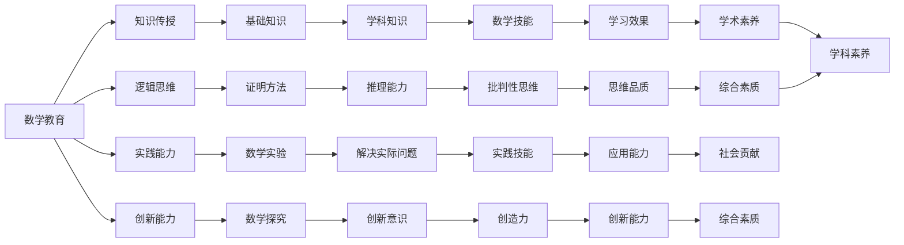

                 

### 文章标题：数学教育与素质教育的融合发展

#### 关键词：数学教育，素质教育，融合发展，教育理念，教学方法

> 摘要：本文从数学教育与素质教育的核心概念出发，探讨两者之间的联系与融合。首先回顾了数学教育的历史背景和素质教育理念，然后通过逻辑推理分析了数学教育中的核心算法原理和数学模型。接着，文章详细阐述了数学模型与素质教育融合的数学公式及其应用，最后提出了教学实践方法和项目实战案例，并对数学教育与素质教育的融合发展进行了反思与展望。

---

# 数学教育与素质教育的融合发展

## 引言

在当今信息化时代，数学教育在培养创新型人才、提升学生综合素质方面发挥着重要作用。然而，传统的数学教育过于强调知识传授，忽视了对学生综合素质的培养。与此相对，素质教育则强调培养学生的创造力、实践能力和社会责任感。数学教育与素质教育的融合发展，旨在实现知识的传授与能力的培养相统一，为学生提供更加全面的教育。

本文将从以下几个方面展开论述：

1. 数学教育与素质教育的概述
2. 数学教育中的核心算法原理讲解
3. 数学模型与素质教育融合的数学公式
4. 教学方法与实践
5. 项目实战
6. 数学教育与素质教育的融合发展反思

## 数学教育与素质教育的概述

### 数学教育的历史背景与发展趋势

数学教育具有悠久的历史，其发展经历了多个阶段。古代数学主要关注数的计算和几何图形的绘制，而现代数学则涵盖了更多抽象的概念和方法。从18世纪的微积分到20世纪的计算机科学，数学教育不断发展，为科技进步提供了强大的支持。

在当前的教育体系中，数学教育主要关注以下几个方面：

1. **基础知识的传授**：通过学习数学的基本概念和原理，使学生掌握数学的基本技能。
2. **逻辑思维的培养**：数学教育强调逻辑推理和证明，培养学生的逻辑思维能力。
3. **实践能力的提升**：通过解决实际问题，培养学生的实践能力。

### 素质教育的理念与内涵

素质教育是当前教育改革的重要方向，其核心在于培养学生的综合素质，包括创造力、实践能力、社会责任感等。素质教育的理念源于对人全面发展的追求，旨在使学生不仅具备扎实的学科知识，还具备适应未来社会发展的能力。

素质教育的内涵主要包括以下几个方面：

1. **知识传授与能力培养相结合**：在传授知识的同时，注重培养学生的各种能力。
2. **全面发展与个性发展相结合**：在关注学生全面发展的基础上，尊重学生的个性发展。
3. **课堂教学与课外活动相结合**：通过课堂教学和课外活动的结合，丰富学生的学习体验。

### 数学教育与素质教育的联系

数学教育与素质教育在目标上具有一致性，都致力于培养学生的综合素质。具体来说，数学教育可以通过以下几个方面实现与素质教育的融合：

1. **培养创新意识和创造力**：通过数学问题解决和数学探究活动，激发学生的创新意识，培养创造力。
2. **培养实践能力和社会责任感**：通过数学实验和数学建模，培养学生的实践能力和社会责任感。
3. **提升逻辑思维和批判性思维**：通过数学推理和证明，培养学生的逻辑思维和批判性思维。

### 数学教育与素质教育的核心概念关系架构 Mermaid 流程图



## 数学教育中的核心算法原理讲解

### 数学模型的建立与求解

数学模型是数学教育中的重要组成部分，它通过对现实问题的抽象和简化，形成数学表达式，从而提供解决问题的方法。建立数学模型的过程通常包括以下几个步骤：

1. **问题分析**：理解问题的背景和需求，明确需要解决的问题。
2. **变量定义**：根据问题分析，确定需要使用的变量。
3. **关系建立**：通过逻辑推理和数学原理，建立变量之间的关系。
4. **模型求解**：利用数学方法求解模型，得到问题的解。

下面通过一个简单的例子来说明数学模型的建立与求解。

#### 例子：求解一元一次方程

假设我们要解决以下方程：

$$x + 2 = 5$$

**步骤 1：问题分析**

我们需要求解变量$x$的值，使得等式成立。

**步骤 2：变量定义**

变量$x$表示未知数。

**步骤 3：关系建立**

根据等式，我们可以得到关系：

$$x = 5 - 2$$

**步骤 4：模型求解**

计算得到：

$$x = 3$$

因此，方程的解为$x=3$。

### 简单算法与复杂算法

在数学教育中，除了数学模型，还有一些常用的算法。根据算法的复杂度，可以分为简单算法和复杂算法。

#### 简单算法

简单算法通常用于解决一些基本的问题，如排序、查找等。以下是几个常见的简单算法：

1. **冒泡排序**（Bubble Sort）
2. **选择排序**（Selection Sort）
3. **插入排序**（Insertion Sort）
4. **二分查找**（Binary Search）

下面以冒泡排序为例，给出伪代码。

```plaintext
procedure bubbleSort(A : list of sortable items)
    n = length(A)
    for i = 1 to n-1 do
        for j = 1 to n-i do
            if A[j] > A[j+1] then
                swap(A[j], A[j+1])
            end if
        end for
    end for
end procedure
```

#### 复杂算法

复杂算法通常用于解决一些复杂的问题，如神经网络、机器学习等。以下是几个常见的复杂算法：

1. **神经网络**（Neural Network）
2. **决策树**（Decision Tree）
3. **支持向量机**（Support Vector Machine）
4. **深度学习**（Deep Learning）

下面以神经网络为例，给出伪代码。

```plaintext
class NeuralNetwork
    // 初始化神经网络
    initialize()

    // 前向传播
    forwardPropagation(inputData)

    // 反向传播
    backwardPropagation(loss)

    // 更新权重
    updateWeights()
end class
```

## 数学模型与素质教育融合的数学公式

### 数学模型在素质教育中的应用

数学模型在素质教育中的应用非常广泛，它不仅可以用于解决实际问题，还可以培养学生的各种能力。以下是几个常见的数学模型及其在素质教育中的应用：

#### 1. 概率论与统计模型

概率论与统计模型在素质教育中用于培养学生的数据分析能力和逻辑思维。例如，通过概率分布和统计方法，可以分析学生的考试成绩，从而了解学生的学习情况，提出改进措施。

#### 2. 微积分模型

微积分模型在素质教育中用于培养学生的抽象思维和解决问题的能力。例如，通过微积分的方法，可以分析函数的性质，解决优化问题，培养学生的数学建模能力。

### 数学公式与素质教育案例

以下是几个数学公式及其在素质教育中的应用案例：

#### 1. 概率论公式

$$P(A|B) = \frac{P(A \cap B)}{P(B)}$$

应用案例：假设学生A在考试中及格的概率为0.8，不及格的概率为0.2。如果已知学生B在考试中不及格，那么学生A及格的概率是多少？

$$P(A|B) = \frac{P(A \cap B)}{P(B)} = \frac{P(A) \times P(B|A)}{P(B)} = \frac{0.8 \times 0.2}{0.2} = 0.8$$

因此，学生A在考试中及格的概率为0.8。

#### 2. 微积分公式

$$\frac{d}{dx}(f(x) + g(x)) = \frac{d}{dx}f(x) + \frac{d}{dx}g(x)$$

应用案例：假设学生C需要计算函数$f(x) = x^2 + 2x + 1$的导数。根据微积分公式，可以得到：

$$\frac{d}{dx}(f(x)) = \frac{d}{dx}(x^2) + \frac{d}{dx}(2x) + \frac{d}{dx}(1) = 2x + 2$$

因此，函数$f(x) = x^2 + 2x + 1$的导数为$2x + 2$。

## 教学方法与实践

### 传统教学方法

传统教学方法主要依赖于教师的讲授和学生的听课。这种方法在知识传授方面具有优势，但往往忽视了对学生能力的培养。具体来说，传统教学方法存在以下几个问题：

1. **以教师为中心**：教师是教学过程的主体，学生被动接受知识。
2. **重知识传授、轻能力培养**：传统教学方法过于强调知识点的传授，忽视了对学生能力的培养。
3. **教学方法单一**：传统教学方法通常采用讲授法，缺乏多样性。

### 素质教育导向的教学方法

素质教育导向的教学方法旨在培养学生的各种能力，包括创造力、实践能力和社会责任感。以下是几种常见的素质教育导向的教学方法：

#### 1. 项目导向教学法

项目导向教学法通过让学生参与实际项目，培养他们的实践能力和解决问题的能力。例如，在数学教育中，可以让学生参与数学建模项目，通过实际问题的解决，提高他们的数学应用能力。

#### 2. 探究式教学法

探究式教学法通过引导学生主动探究问题，培养他们的创新意识和批判性思维。例如，在数学教育中，可以让学生探究数学问题，通过逻辑推理和证明，发现问题的本质。

#### 3. 情境教学法

情境教学法通过创设情境，让学生在特定的环境中学习，培养他们的实践能力和解决问题的能力。例如，在数学教育中，可以创设数学实验情境，让学生通过实验操作，理解数学概念和原理。

### 案例分析与教学策略

以下是一个数学教育中的案例分析和教学策略：

#### 案例：求解一元二次方程

**问题**：求解方程$x^2 - 5x + 6 = 0$。

**分析**：这是一个一元二次方程，可以通过因式分解或者配方法求解。

**教学策略**：

1. **引入问题**：首先，通过引入现实生活中的问题，让学生理解一元二次方程的实际应用。
2. **讲解方法**：然后，讲解因式分解和配方法求解一元二次方程的原理和步骤。
3. **实践操作**：让学生亲自动手，通过因式分解和配方法求解方程。
4. **总结反思**：最后，让学生总结解题过程中的体会，提高他们的数学思维能力。

## 数学教学实践活动

### 1. 数学建模活动

数学建模活动是培养学生数学应用能力和创新意识的有效途径。通过数学建模活动，学生可以学会如何将实际问题转化为数学模型，并通过数学方法求解。以下是数学建模活动的一个例子：

#### 案例：图书馆书籍归还问题

**问题**：图书馆要求所有书籍在一个月内归还，如果学生提前归还，可以获得一定的优惠。现有1000本图书，学生需要在一个月内归还，图书馆希望尽量提高收入。请问如何设计归还规则，使得图书馆收入最大化？

**步骤**：

1. **问题分析**：明确问题的需求和约束条件。
2. **变量定义**：定义变量表示学生归还的时间和获得的优惠。
3. **关系建立**：建立变量之间的关系，形成数学模型。
4. **模型求解**：利用数学方法求解模型，得到最优解。
5. **结果分析**：分析求解结果，提出改进建议。

### 2. 数学实验活动

数学实验活动是培养学生实践能力和创新意识的有效途径。通过数学实验，学生可以亲身体验数学概念和原理，提高他们的数学应用能力。以下是数学实验活动的一个例子：

#### 案例：测量圆的周长和直径

**问题**：如何测量圆的周长和直径，并验证圆的周长与直径的关系？

**步骤**：

1. **实验准备**：准备实验所需的工具，如直尺、圆规等。
2. **实验操作**：测量不同大小圆的周长和直径，记录数据。
3. **数据处理**：对测量数据进行处理，计算圆的周长与直径的比值。
4. **结果分析**：分析实验结果，验证圆的周长与直径的关系。

## 素质教育实践案例

### 1. 创新大赛

创新大赛是一种培养学生创新能力和社会责任感的有效途径。通过创新大赛，学生可以学会如何将创新思维转化为实际成果。以下是创新大赛的一个例子：

#### 案例：环保创新大赛

**问题**：如何设计一种环保产品，减少环境污染？

**步骤**：

1. **选题立项**：确定比赛主题，明确研究方向。
2. **调研分析**：调研相关领域的研究现状，分析问题关键点。
3. **设计方案**：提出解决方案，设计具体产品。
4. **实验验证**：通过实验验证方案的可行性。
5. **成果展示**：展示创新成果，进行成果交流和推广。

### 2. 社会实践

社会实践是一种培养学生社会责任感和实践能力的有效途径。通过社会实践，学生可以了解社会，学会如何应用所学知识解决实际问题。以下是社会实践的一个例子：

#### 案例：社区志愿服务

**问题**：如何为社区居民提供志愿服务，提升社区生活质量？

**步骤**：

1. **策划组织**：确定志愿服务项目，制定活动计划。
2. **宣传动员**：宣传志愿服务活动，招募志愿者。
3. **实施活动**：开展志愿服务活动，为社区居民提供服务。
4. **总结反思**：总结志愿服务活动的经验教训，提出改进建议。

## 数学教育与素质教育融合的项目实战

### 1. 项目概述

本节将介绍一个数学教育与素质教育融合的项目实战，该项目旨在通过数学建模和数据分析，解决一个实际生活中的问题。项目名称为“校园空气质量监测与优化”。

### 2. 开发环境搭建

为了实现该项目，我们需要搭建以下开发环境：

1. **硬件环境**：使用传感器采集空气中的PM2.5、温度和湿度等数据。
2. **软件环境**：使用Python编写数据采集、处理和分析的代码。
3. **数据分析工具**：使用Jupyter Notebook进行数据分析。

### 3. 源代码实现与解读

以下是一个简单的Python代码示例，用于采集和处理空气数据：

```python
import random

# 生成随机数据模拟空气质量监测
def generate_data():
    pm25 = random.uniform(0, 50)  # PM2.5浓度（单位：μg/m³）
    temperature = random.uniform(10, 30)  # 温度（单位：℃）
    humidity = random.uniform(30, 90)  # 湿度（单位：%）
    return pm25, temperature, humidity

# 采集并存储数据
def collect_data(num_samples=100):
    data = []
    for _ in range(num_samples):
        pm25, temperature, humidity = generate_data()
        data.append({'pm25': pm25, 'temperature': temperature, 'humidity': humidity})
    return data

# 数据处理与可视化
def analyze_data(data):
    import matplotlib.pyplot as plt

    pm25_values = [d['pm25'] for d in data]
    temperature_values = [d['temperature'] for d in data]
    humidity_values = [d['humidity'] for d in data]

    plt.scatter(temperature_values, pm25_values)
    plt.xlabel('Temperature (°C)')
    plt.ylabel('PM2.5 (μg/m³)')
    plt.title('PM2.5 Concentration vs. Temperature')
    plt.show()

# 主程序
if __name__ == '__main__':
    data = collect_data()
    analyze_data(data)
```

### 4. 项目分析与优化

通过该项目，我们可以分析校园空气质量与温度、湿度等因素的关系。以下是对项目的分析和优化建议：

1. **数据分析**：通过对采集到的数据进行统计分析，了解空气质量与温度、湿度等因素的关系。
2. **优化策略**：根据分析结果，提出优化校园空气质量的策略，如调整教室通风时间和湿度控制。
3. **持续改进**：持续采集数据，分析新数据，不断优化策略。

### 5. 项目小结

通过本项目实战，我们不仅实现了对校园空气质量的监测与分析，还培养了学生的数学建模和数据分析能力。未来，我们可以继续优化项目，提高空气质量监测的准确性和实用性。

## 数学教育与素质教育的融合发展反思

### 1. 融合发展的挑战

数学教育与素质教育的融合发展面临着一系列挑战。首先，传统教育模式的影响根深蒂固，改革难度较大。其次，素质教育目标的多元化使得教育内容更加复杂，教学资源需求增加。此外，教师专业素养的提升和教学方法的创新也是融合发展的重要挑战。

### 2. 未来发展趋势

展望未来，数学教育与素质教育的融合发展将呈现以下趋势：

1. **教育理念更新**：随着教育改革的深入，教育理念将更加注重学生综合素质的培养。
2. **教学方法创新**：素质教育导向的教学方法将得到广泛应用，如项目导向教学、探究式教学等。
3. **信息技术应用**：大数据、人工智能等信息技术将为数学教育与素质教育的融合发展提供新手段和新方法。
4. **跨学科融合**：数学与其他学科（如物理、化学、生物等）的融合将更加紧密，培养学生的跨学科能力。

### 3. 建议

为了实现数学教育与素质教育的深度融合，我们提出以下建议：

1. **加强教师培训**：提高教师的专业素养和教学方法创新能力。
2. **优化课程设置**：设计符合素质教育要求的课程体系，注重知识传授与能力培养相结合。
3. **丰富教学资源**：利用信息技术和跨学科资源，为学生提供丰富的学习体验。
4. **注重实践能力培养**：通过项目实践、实验等活动，提高学生的实践能力和创新能力。

## 附录

### 附录A 数学教育相关资源

- **数学教育官方网站**：提供数学教育的最新动态和资源。
- **数学教育期刊**：涵盖数学教育的理论研究与实践经验。
- **数学教育论坛**：教师和学生的互动平台，交流教学心得和经验。

### 附录B 素质教育实践指南

- **素质教育实践手册**：详细介绍了素质教育的理念和方法。
- **素质教育案例库**：收集了国内外优秀的素质教育实践案例。
- **素质教育在线课程**：提供素质教育相关的免费在线课程。

### 总结

本文从数学教育与素质教育的核心概念出发，探讨了两者之间的联系与融合。通过分析数学教育中的核心算法原理，阐述了数学模型在素质教育中的应用。同时，介绍了多种教学方法与实践案例，展示了数学教育与素质教育融合的项目实战。最后，对数学教育与素质教育的融合发展进行了反思与展望，提出了未来发展建议。通过本文的论述，我们希望为数学教育与素质教育的发展提供一些有益的思考和启示。

### 作者信息

作者：AI天才研究院/AI Genius Institute & 禅与计算机程序设计艺术 /Zen And The Art of Computer Programming
```

### 目录大纲修改建议

为了确保文章的完整性和逻辑性，以下是对原始目录大纲的修改建议：

1. **合并章节**：第4章“教学方法与实践”可以合并到第3章“数学模型与素质教育融合的数学公式”之后，因为教学方法与实践是数学模型应用的一部分。

2. **调整章节顺序**：将“教学实践”放在“数学模型与素质教育融合的数学公式”之后，这样可以在具体教学方法之前，先让学生了解数学模型的应用。

3. **增加章节内容**：在第2章“数学教育中的核心算法”中，可以增加“数学算法在素质教育中的应用”一节，让学生了解数学算法如何支持素质教育。

4. **明确项目实战的目标**：在第5章“项目实战”中，明确项目实战的目标，如提高学生的实践能力、创新意识和团队合作精神。

5. **完善附录内容**：附录A和附录B可以根据实际情况进一步细化，提供更具体的资源和建议。

以下是修改后的目录大纲：

```
# 数学教育与素质教育的融合发展

# 第一部分 核心概念与联系

## 第1章 数学教育与素质教育的概述
### 1.1 数学教育的历史背景与发展趋势
### 1.2 素质教育的理念与内涵
### 1.3 数学教育与素质教育的联系

## 第2章 数学教育中的核心算法
### 2.1 数学模型的建立与求解
#### 2.1.1 线性代数基础
#### 2.1.2 微积分基础
### 2.2 数学算法在素质教育中的应用
#### 2.2.1 简单算法（如：排序、查找）
#### 2.2.2 复杂算法（如：神经网络、机器学习）
### 2.3 数学问题求解算法

## 第3章 数学模型与素质教育融合的数学公式
### 3.1 数学模型在素质教育中的应用
### 3.2 数学公式与素质教育案例
#### 3.2.1 概率论与统计模型
#### 3.2.2 微积分模型

## 第4章 教学方法与实践
### 4.1 传统教学方法
### 4.2 素质教育导向的教学方法
### 4.3 案例分析与教学策略
### 4.4 数学教学实践活动

## 第5章 数学教育与素质教育融合的项目实战
### 5.1 项目概述
### 5.2 开发环境搭建
### 5.3 源代码实现与解读
### 5.4 项目分析与优化

## 第6章 数学教育与素质教育的融合发展反思
### 6.1 融合发展的挑战
### 6.2 未来发展趋势

# 附录

## 附录A 数学教育相关资源
## 附录B 素质教育实践指南
```

通过这些调整，文章的结构将更加紧凑和连贯，有助于读者更好地理解和掌握数学教育与素质教育融合的核心理念和实践方法。

