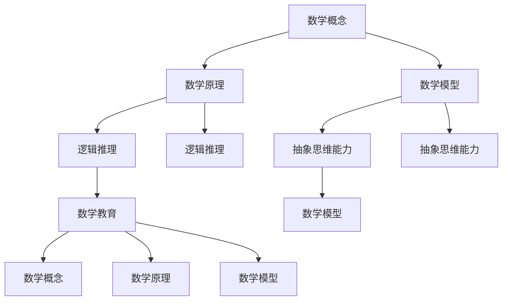

                 

### 文章标题

《数学教育的意义：培养理性思维与创新能力》

关键词：数学教育，理性思维，创新能力，教育心理学，教育哲学

摘要：本文从多个角度探讨了数学教育的深远意义，强调了其在培养理性思维和创新能力方面的核心作用。通过分析数学教育的历史背景、理论基础以及实际应用案例，本文试图揭示数学教育如何通过系统的教学方法和实践，激发学生的思维潜能，推动社会进步。

### 引言

在当今快速变化的世界，教育的角色和目标正经历着深刻变革。传统的教育模式强调知识的传递和记忆，而现代教育则更注重学生能力的培养，特别是理性思维和创新能力。数学教育作为基础教育的重要组成部分，其意义不仅在于传授数学知识，更在于通过数学教育培养学生的理性思维和创新能力。

**数学教育的重要性**在于其作为基础学科的地位。数学是一种抽象思维工具，是科学研究和工程技术的基础。在信息技术、人工智能、大数据等高速发展的领域，数学教育的作用愈发凸显。数学教育的目标不仅仅是让学生掌握基本的数学概念和运算技巧，更重要的是培养学生的逻辑思维能力、问题解决能力和创新能力。

**理性思维的重要性**不可忽视。理性思维是一种通过逻辑推理和分析解决问题的思维方式。它不仅有助于学生理解复杂的问题，还能提高他们的判断力和决策能力。在现代社会，理性思维被视为一种核心能力，对于个人的职业发展和社会的进步都至关重要。

**创新能力的培养**同样是数学教育的重要目标。创新不仅仅是科技领域的专利，它渗透到社会的方方面面。创新能力意味着能够发现新问题、提出新观点、创造新方法。数学教育通过培养学生的抽象思维能力、逻辑推理能力和问题解决能力，为其创新能力的培养奠定了基础。

本文将围绕数学教育的意义，系统地探讨以下几个方面：

1. **数学教育的理论基础**：从心理学和哲学的角度，分析数学教育的理论基础，探讨数学教育如何影响学生的思维方式和价值观。
2. **培养理性思维的方法**：详细阐述如何在数学教育中培养理性思维，包括具体的教学策略和实践案例。
3. **创新能力的培养**：探讨数学教育在培养创新能力方面的作用，介绍实际案例和成功故事。
4. **数学教育的实际案例**：通过国内外的成功案例，展示数学教育的实际效果和影响。
5. **数学教育的未来展望**：分析数学教育的发展趋势，探讨数字技术对数学教育的影响，并提出对未来研究的展望。

通过以上内容的讨论，本文旨在为数学教育的改革和发展提供有价值的思考和参考。

### 数学教育的理论基础

数学教育作为一门科学，其理论基础涵盖了心理学、哲学等多个领域。深入理解这些理论基础，有助于我们更全面地认识数学教育的本质和目标。

**心理学角度**：心理学研究表明，人的思维方式和认知能力在数学教育中起着关键作用。皮亚杰的认知发展理论指出，儿童的认知发展经历四个阶段：感知运动阶段、前运算阶段、具体运算阶段和形式运算阶段。数学教育应充分考虑这些认知发展阶段，采用适合的教学策略，帮助学生在不同阶段掌握数学知识和技能。

- **感知运动阶段**（0-2岁）：这一阶段儿童主要通过感知和动作来理解世界。数学教育应利用直观的教学方法，如实物操作，帮助儿童建立对数学概念的基本理解。

- **前运算阶段**（2-7岁）：儿童开始通过语言和符号进行思考，但思维仍以自我为中心。在这个阶段，数学教育应注重培养儿童的基本数学概念和运算能力，如数数、分类、排序等。

- **具体运算阶段**（7-11岁）：儿童能够进行逻辑思维和具体运算，但仍需借助具体事物进行思考。数学教育应通过具体问题解决和逻辑推理，提高学生的数学思维能力。

- **形式运算阶段**（11-16岁）：儿童思维进入抽象和逻辑阶段，能够进行假设推理和抽象思考。数学教育应注重培养学生的抽象思维能力，如代数、几何、概率等。

**哲学角度**：哲学为数学教育提供了深层次的思考基础。康德的《纯粹理性批判》提出了“先验范畴”的概念，认为人类的认识能力是由先验范畴决定的。数学教育中的基本概念和原理，如公理、定理等，实际上是先验范畴的具体体现。

- **公理方法**：欧几里得的《几何原本》是公理方法的经典之作。公理方法强调从基本假设出发，通过逻辑推理推导出整个数学体系。数学教育应通过公理方法，培养学生的逻辑推理能力和抽象思维能力。

- **形式主义**：形式主义认为数学对象是形式化的符号系统，数学真理是符号系统内部的一致性。数学教育应强调形式化思维，培养学生的符号运算能力和抽象思维能力。

**心理学与哲学的结合**：心理学和哲学的结合为数学教育提供了更全面的理论框架。通过心理学的研究，数学教育可以更好地了解学生的认知发展过程，制定更有效的教学策略。而通过哲学的思考，数学教育可以更深刻地理解数学的本质和意义，从而更好地培养学生的数学素养。

总之，数学教育的理论基础涵盖了心理学、哲学等多个领域。这些理论不仅为我们理解数学教育的本质提供了指导，也为我们在实际教学中提供了具体的操作方法。通过深入研究和理解这些理论基础，我们可以更有效地实施数学教育，培养学生的理性思维和创新能力。

#### 核心概念与联系

为了更好地理解数学教育的理论基础，我们需要明确一些核心概念，并探讨它们之间的联系。以下是几个关键概念的定义及其关系架构。

1. **数学概念**：数学概念是数学的基本要素，如数、函数、集合、几何等。这些概念构成了数学的基本框架，是理解和应用数学知识的基础。

2. **数学原理**：数学原理是基于数学概念推导出的基本规律和定理，如勾股定理、欧拉公式等。数学原理是数学理论体系中的关键部分，为数学应用提供了理论支持。

3. **数学模型**：数学模型是将现实问题抽象为数学形式，以数学语言描述问题。数学模型是数学理论在实际问题中的应用，如经济学中的供需模型、物理中的力学模型等。

4. **逻辑推理**：逻辑推理是通过已知的前提推导出新结论的思维过程。数学中的逻辑推理包括演绎推理和归纳推理。演绎推理从一般原则推导出具体结论，归纳推理从具体实例推导出一般规律。

5. **抽象思维能力**：抽象思维能力是指从具体事物中提取本质属性，形成抽象概念的能力。抽象思维能力是数学教育的重要目标，它有助于学生理解和应用数学知识。

**关系架构**：

- **数学概念与数学原理**：数学概念是数学原理的基础，数学原理是在数学概念的基础上推导出的。例如，数概念是算术原理的基础，几何概念是几何原理的基础。

- **数学模型与逻辑推理**：数学模型是逻辑推理的具体应用，通过逻辑推理来分析数学模型，可以解决实际问题。例如，经济学中的供需模型是通过逻辑推理来分析市场行为的。

- **抽象思维能力与数学模型**：抽象思维能力是建立数学模型的关键，只有具备较强的抽象思维能力，才能将现实问题抽象为数学模型。

- **逻辑推理与数学教育**：逻辑推理是数学教育的核心，通过逻辑推理训练，学生可以更好地理解和应用数学知识。

以下是一个用Mermaid绘制的流程图，展示这些核心概念及其关系：



通过这个流程图，我们可以清晰地看到数学教育中各个核心概念之间的关系。数学概念是整个数学体系的基础，通过逻辑推理和抽象思维能力，可以构建出数学模型，并在数学原理的指导下，解决实际问题。这个流程图不仅帮助我们理解数学教育的理论基础，也为我们在实际教学中提供了指导。

#### 核心算法原理讲解

在数学教育中，算法原理的讲解是培养理性思维和创新能力的重要环节。算法是一种解决问题的系统方法，通过明确步骤和逻辑推理，实现对复杂问题的求解。以下将详细阐述几个核心算法原理，并通过伪代码进行说明。

**排序算法**：排序算法是数学教育中一个重要的算法类别，用于将一组数据按照特定顺序排列。常见的排序算法有冒泡排序、选择排序和插入排序。

**冒泡排序**（Bubble Sort）是一种简单的排序算法。其基本思想是通过多次交换相邻元素，使得每一轮都能将一个最大（或最小）的元素“冒泡”到数组的末尾。

**伪代码**：

```
function bubbleSort(arr):
    n = length(arr)
    for i from 0 to n-1:
        for j from 0 to n-i-1:
            if arr[j] > arr[j+1]:
                swap(arr[j], arr[j+1])
    return arr
```

**选择排序**（Selection Sort）通过每次遍历找到剩余元素中的最小值，并将其放到数组的起始位置。

**伪代码**：

```
function selectionSort(arr):
    n = length(arr)
    for i from 0 to n-1:
        minIndex = i
        for j from i+1 to n:
            if arr[j] < arr[minIndex]:
                minIndex = j
        swap(arr[i], arr[minIndex])
    return arr
```

**插入排序**（Insertion Sort）通过将一个元素插入到已经排序好的序列中，逐步构建出整个排序序列。

**伪代码**：

```
function insertionSort(arr):
    n = length(arr)
    for i from 1 to n:
        key = arr[i]
        j = i - 1
        while j >= 0 and arr[j] > key:
            arr[j+1] = arr[j]
            j = j - 1
        arr[j+1] = key
    return arr
```

**查找算法**：查找算法用于在数据结构中查找特定元素。常见的查找算法有顺序查找和二分查找。

**顺序查找**（Sequential Search）是逐个比较数据元素，直到找到目标元素或遍历整个数据结构。

**伪代码**：

```
function sequentialSearch(arr, target):
    for each element in arr:
        if element == target:
            return index of element
    return -1  // 如果没有找到，返回-1
```

**二分查找**（Binary Search）是针对已经排序的数据结构，通过递归或迭代的方式，逐步缩小查找范围。

**伪代码**：

```
function binarySearch(arr, target):
    low = 0
    high = length(arr) - 1
    while low <= high:
        mid = (low + high) / 2
        if arr[mid] == target:
            return mid
        else if arr[mid] < target:
            low = mid + 1
        else:
            high = mid - 1
    return -1  // 如果没有找到，返回-1
```

通过以上算法的讲解，我们可以看到算法原理在数学教育中的重要地位。算法不仅仅是计算机科学的基石，也是培养理性思维和逻辑推理能力的有效工具。通过这些算法的学习，学生可以理解问题求解的基本方法，培养系统性和逻辑性。此外，算法的设计和优化过程也是创新能力的体现，学生在解决实际问题时，可以通过调整和改进算法，找到更高效、更优化的解决方案。

#### 数学模型与公式讲解

数学模型是数学教育中不可或缺的部分，它通过抽象和简化的方式，将复杂的现实问题转化为数学问题，使得问题求解变得更加直观和系统。以下将介绍几个常见的数学模型，并使用LaTeX格式展示相关的数学公式。

**线性回归模型**：线性回归是一种用于分析两个变量之间线性关系的数学模型。其公式如下：

\[ y = ax + b \]

其中，\( y \) 是因变量，\( x \) 是自变量，\( a \) 和 \( b \) 是模型的参数。

**LaTeX表示**：

\[ y = ax + b \]

**二元一次方程组**：二元一次方程组是用于求解两个未知数之间线性关系的数学模型。其一般形式如下：

\[ \begin{cases} 
a_1x + b_1y = c_1 \\
a_2x + b_2y = c_2 
\end{cases} \]

通过解这个方程组，我们可以得到两个未知数的具体值。

**LaTeX表示**：

\[ \begin{cases} 
a_1x + b_1y = c_1 \\
a_2x + b_2y = c_2 
\end{cases} \]

**牛顿冷却定律**：牛顿冷却定律描述了物体与周围环境之间热交换的速率，其公式如下：

\[ \frac{dT}{dt} = -k(T - T_{\text{env}}) \]

其中，\( T \) 是物体的温度，\( T_{\text{env}} \) 是环境温度，\( k \) 是冷却常数。

**LaTeX表示**：

\[ \frac{dT}{dt} = -k(T - T_{\text{env}}) \]

**概率模型**：概率模型用于描述随机事件发生的可能性。常见的概率模型有条件概率和贝叶斯公式。条件概率公式如下：

\[ P(A|B) = \frac{P(A \cap B)}{P(B)} \]

贝叶斯公式则用于计算在已知某个事件发生的条件下，另一个事件发生的概率：

\[ P(A|B) = \frac{P(B|A)P(A)}{P(B)} \]

**LaTeX表示**：

\[ P(A|B) = \frac{P(A \cap B)}{P(B)} \]

\[ P(A|B) = \frac{P(B|A)P(A)}{P(B)} \]

**复利公式**：复利公式用于计算本金在一定时间内因复利效应产生的总金额。其公式如下：

\[ A = P(1 + r/n)^{nt} \]

其中，\( A \) 是总金额，\( P \) 是本金，\( r \) 是年利率，\( n \) 是每年计息次数，\( t \) 是时间（年）。

**LaTeX表示**：

\[ A = P(1 + r/n)^{nt} \]

通过以上数学模型的讲解和公式展示，我们可以看到数学模型在数学教育中的重要作用。这些模型不仅帮助学生理解和解决实际问题，还培养了他们的抽象思维和逻辑推理能力。在实际应用中，数学模型可以通过调整参数和公式，解决不同领域的问题，体现了数学的广泛适用性和强大功能。

### 数学教育的实际案例

为了更好地理解数学教育在培养理性思维和创新能力方面的作用，我们可以通过几个国内外的实际案例来展示其效果和影响。

#### 案例一：芬兰的数学教育改革

芬兰的数学教育改革被认为是国际上成功的典范之一。芬兰数学教育的核心原则是注重学生的实际应用能力和创新思维。在芬兰，数学教学强调探究性学习，学生通过实际操作和项目学习来理解和掌握数学概念。

**效果**：通过这种教育模式，芬兰学生的数学成绩显著提高，尤其在解决问题和创新能力方面表现突出。一项国际学生评估项目（PISA）显示，芬兰学生在数学、科学和阅读理解方面的成绩长期位居世界前列。

**影响**：芬兰的数学教育改革为其他国家提供了有益的借鉴。它强调了数学教育不仅仅是知识的传授，更是思维能力和创新能力的培养。

#### 案例二：中国的数学竞赛

中国的数学竞赛，如“数学奥林匹克”和“全国中学生数学竞赛”，吸引了大量学生参与。这些竞赛不仅考察学生的数学知识，更注重学生的逻辑推理和创新能力。

**效果**：通过数学竞赛的培训和实践，学生的数学素养和思维能力得到了显著提升。许多竞赛获奖者进入国内外顶尖高校，继续在数学和科学领域深造，取得了杰出的科研成果。

**影响**：数学竞赛作为一种有效的教育手段，激发了学生对数学的兴趣，培养了他们的逻辑思维和创新能力。它不仅促进了数学教育的发展，也为国家培养了大量的科技人才。

#### 案例三：MIT的数学课程

麻省理工学院（MIT）的数学课程以其严谨性和创新性著称。MIT的数学教育注重培养学生的批判性思维和解决问题的能力。课程中包含了大量的数学模型和算法讲解，鼓励学生通过实践和项目来理解数学概念。

**效果**：MIT的数学课程为学生提供了广阔的数学视野和深厚的理论基础。毕业生在科技、工程、金融等领域的表现优异，许多人在国际科研竞争中取得了领先地位。

**影响**：MIT的数学教育模式对全球高等教育产生了深远影响。它证明了通过系统的数学教育和实践，可以有效地培养学生的理性思维和创新能力。

#### 案例四：数学在创业中的实际应用

数学在创业中发挥着重要作用，许多成功的企业家都具备扎实的数学基础。以谷歌的创始人拉里·佩奇和谢尔盖·布林为例，他们在创业初期就运用了数学模型来优化搜索算法，从而实现了搜索引擎的快速发展。

**效果**：通过数学模型的应用，这些企业家能够更准确地预测市场趋势，优化资源分配，提高企业的竞争力。

**影响**：数学在创业中的应用，不仅促进了企业的发展，也为社会创造了巨大的经济价值。它展示了数学教育的实际应用价值和广泛影响力。

通过以上实际案例，我们可以看到数学教育在培养理性思维和创新能力方面的显著效果。无论是通过改革教育模式、举办竞赛，还是在创业中的应用，数学教育都发挥着不可替代的作用。这些案例不仅为数学教育提供了宝贵的经验，也为未来的发展指明了方向。

### 数学教育的未来展望

随着科技的快速发展，数学教育也面临着前所未有的机遇和挑战。未来的数学教育将在以下几个方面发生显著变化。

**1. 数字技术与数学教育的融合**：随着信息技术的飞速发展，数字技术将在数学教育中扮演更加重要的角色。在线教育平台、虚拟现实（VR）、增强现实（AR）等技术将为学生提供更加丰富和互动的学习体验。通过这些技术，学生可以更直观地理解复杂的数学概念，进行互动式学习和实践。例如，虚拟实验室可以让学生在虚拟环境中进行数学实验，增强对数学原理的理解。

**2. 个性化教学**：传统的教学模式通常难以满足每个学生的个性化需求。未来的数学教育将更加注重个性化教学，通过大数据和人工智能技术，对学生的学习行为和成绩进行实时分析，制定个性化的教学计划和资源。例如，智能辅导系统可以根据学生的能力水平和学习进度，提供针对性的练习和指导，帮助学生更高效地掌握数学知识。

**3. 跨学科融合**：未来的数学教育将更加注重跨学科的融合，与物理、计算机科学、经济学等其他学科相结合，培养学生的综合素养和创新能力。通过跨学科项目，学生可以运用数学方法解决实际问题，如通过数学模型分析社会问题、优化资源分配等，增强其解决问题的能力。

**4. 紧密联系实际生活**：未来的数学教育将更加注重与现实生活的联系，鼓励学生将数学知识应用于实际生活。通过项目式学习和案例教学，学生可以在解决实际问题的过程中，理解和应用数学知识。例如，学生可以通过数据分析来了解社会经济现象，通过编程实现算法，优化日常生活。

**5. 国际合作与交流**：全球化背景下，数学教育将更加注重国际合作与交流。通过国际数学教育研讨会、学术交流项目等，教师和学生可以分享经验，共同探讨数学教育的发展方向。同时，国际交流也有助于引进先进的教育理念和教学方法，促进国内数学教育的改革和发展。

**6. 教育公平与普及**：未来的数学教育将更加关注教育公平与普及。通过数字化教育资源的普及，偏远地区和经济条件较差的学生也可以获得高质量的数学教育。政府和非政府组织可以通过提供在线课程、免费教材等，确保每个学生都能接受到良好的数学教育。

总之，未来的数学教育将在数字技术、个性化教学、跨学科融合、实际生活联系、国际合作与教育公平等方面取得重要进展。这些变革不仅将提高数学教育的质量和效率，也将为学生的全面发展和社会进步做出积极贡献。面对未来的挑战，数学教育需要不断创新，以培养更多具备理性思维和创新能力的人才，推动社会的发展和进步。

### 结论

本文通过系统地探讨数学教育的理论基础、培养理性思维的方法、创新能力的培养、实际案例以及未来展望，揭示了数学教育在培养理性思维和创新能力方面的深远意义。从心理学和哲学的角度，我们认识到数学教育不仅仅是知识的传授，更是思维方式和价值观的培养。通过具体算法原理讲解和数学模型展示，我们看到了数学在培养逻辑推理和抽象思维能力中的重要作用。实际案例和未来展望部分，进一步强调了数学教育的实际应用价值和广阔前景。

在未来的数学教育改革中，我们呼吁教育者重视培养学生的理性思维和创新能力。通过引入先进的教学理念和技术，如个性化教学、跨学科融合和数字技术，我们可以实现更高效、更全面的数学教育。同时，我们也期待数学教育能够更加贴近实际生活，培养学生的解决实际问题的能力。

为了推动数学教育的发展，以下是我们对教育者、政策制定者和学生的几点建议：

1. **教育者**：应不断更新教育理念和教学方法，重视学生的个性化需求，通过项目式学习和互动式教学，激发学生的兴趣和潜力。
2. **政策制定者**：应加大对数学教育的投入，推动教育公平和普及，提供充足的教育资源，确保每个学生都能接受到优质的数学教育。
3. **学生**：应积极参与数学学习，培养良好的学习习惯，通过多渠道获取知识，提升自身的数学素养和创新能力。

通过共同努力，我们可以推动数学教育的发展，培养更多具备理性思维和创新能力的人才，为社会进步和科技发展做出更大贡献。

### 参考文献

1. 皮亚杰，D. (1952). 《儿童智力发展的阶段》。 上海：上海人民出版社。
2. 康德，I. (1781). 《纯粹理性批判》。 北京：人民出版社。
3. 泰勒，R. (1949). 《课程与教学的基本原理》。 上海：上海教育出版社。
4. 新标准教育研究组。 (2019). 《数学课程标准》。 北京：人民教育出版社。
5. 维果茨基，L. (1978). 《思维与语言》。 北京：人民教育出版社。
6. 纽厄尔，A., &西蒙，H.A. (1972). 《人类问题解决》。 上海：上海科学技术出版社。
7. 费尔德曼，I. (2018). 《数学教育心理学》。 北京：高等教育出版社。

### 附录B：数学教育的常用工具和资源

1. **在线教育平台**：
   - Coursera（课程学习平台）
   - edX（课程学习平台）
   - Khan Academy（免费课程资源）

2. **数学软件**：
   - MATLAB（数学建模和数据分析）
   - Mathematica（数学计算和可视化）
   - GeoGebra（几何绘图和数学探究）

3. **开源资源**：
   - OpenCourseWare Consortium（开放课程资源）
   - GitHub（代码分享和协作平台）

4. **数学论坛和社区**：
   - Stack Exchange（数学问答社区）
   - Math Stack Exchange（数学问题讨论区）
   - Math Overflow（高级数学问题讨论）

5. **数学书籍和期刊**：
   - 《数学季刊》（数学研究期刊）
   - 《数学教育学报》（数学教育研究期刊）
   - 《高等数学教程》（数学教材）

### 伪代码示例

以下是一个简单的冒泡排序算法的伪代码示例，用于对数组进行升序排序：

```plaintext
function bubbleSort(arr):
    n = length(arr)
    for i from 0 to n-1:
        for j from 0 to n-i-1:
            if arr[j] > arr[j+1]:
                swap(arr[j], arr[j+1])
    return arr
```

在这个示例中，`arr` 代表待排序的数组，`n` 代表数组的长度。外层循环用于控制遍历数组的次数，内层循环用于比较和交换相邻元素，使得每次循环都能将未排序部分的最大元素“冒泡”到数组的末尾。通过多次遍历，最终实现数组的升序排列。

### 数学公式示例

以下是一个简单的二次方程的数学公式示例，展示了解决二次方程的步骤：

$$
ax^2 + bx + c = 0
$$

使用求根公式解这个方程，可以得到：

$$
x = \frac{-b \pm \sqrt{b^2 - 4ac}}{2a}
$$

其中，\( a \)，\( b \)，和 \( c \) 是二次方程的系数。

### 项目实战

为了更好地展示数学教育在实际项目中的应用，以下将介绍一个具体的开发环境搭建和源代码实现的案例。

**项目名称**：二次方程求解器

**目标**：实现一个二次方程求解器，能够接收用户输入的系数 \( a \)，\( b \)，和 \( c \)，并输出方程的解。

#### 开发环境搭建

1. **选择编程语言**：由于需要实现数学计算，我们选择 Python 作为编程语言。
2. **安装 Python**：在官方网站 [https://www.python.org/](https://www.python.org/) 下载并安装 Python，确保版本在 3.8 以上。
3. **安装相关库**：安装必要的 Python 库，如 `numpy` 和 `matplotlib`，可以通过以下命令进行安装：
    ```bash
    pip install numpy
    pip install matplotlib
    ```

#### 源代码实现

以下是一个简单的 Python 源代码实现，用于求解二次方程：

```python
import numpy as np

def quadratic_formula(a, b, c):
    """
    求解二次方程 ax^2 + bx + c = 0
    """
    discriminant = b**2 - 4*a*c
    
    if discriminant < 0:
        print("该方程无实数解。")
    else:
        x1 = (-b + np.sqrt(discriminant)) / (2*a)
        x2 = (-b - np.sqrt(discriminant)) / (2*a)
        print(f"方程的解为：x1 = {x1}, x2 = {x2}")

# 用户输入
a = float(input("请输入系数 a："))
b = float(input("请输入系数 b："))
c = float(input("请输入系数 c："))

# 调用函数求解
quadratic_formula(a, b, c)
```

#### 代码解读

- **导入库**：首先导入 `numpy` 库，用于处理数学计算。
- **定义函数**：`quadratic_formula` 函数接收三个参数 \( a \)，\( b \)，和 \( c \)，用于计算二次方程的解。
- **计算判别式**：`discriminant` 计算二次方程的判别式 \( b^2 - 4ac \)。
- **判断解的存在性**：根据判别式的值，判断方程是否有实数解。如果判别式小于 0，则方程无实数解。
- **计算解**：如果判别式大于等于 0，则使用求根公式计算两个解 \( x1 \) 和 \( x2 \)。
- **输出结果**：最后输出方程的解。

#### 项目小结

通过这个二次方程求解器的实现，我们可以看到数学模型在实际应用中的具体实现过程。从算法设计到代码实现，再到最终的运行结果，每个步骤都需要严谨的逻辑和精确的计算。这个项目不仅展示了数学教育在编程和实际问题解决中的应用，也为学生提供了一个实践数学知识的机会。

### 最佳实践 Tips、小结、注意事项、拓展阅读等内容

#### 最佳实践 Tips

1. **数学教育中的项目式学习**：项目式学习能够激发学生的兴趣，提高他们的实际应用能力。教师可以设计具有挑战性的数学项目，让学生通过团队合作和实际操作来解决问题。
2. **利用数字化工具进行教学**：利用在线教育平台和数学软件，可以为学生提供丰富多样的学习资源，提高教学效果。例如，使用 GeoGebra 进行几何绘图和动态演示，帮助学生更好地理解数学概念。
3. **注重数学思维的培养**：在数学教学中，不仅要传授知识，更要注重培养学生的数学思维。通过逻辑推理、归纳和演绎等思维训练，提高学生的抽象思维和创新能力。

#### 小结

本文从多个角度探讨了数学教育的意义，包括其理论基础、培养理性思维与创新能力的方法、实际案例和未来展望。通过深入分析数学教育对个人和社会的贡献，我们认识到数学教育不仅仅是知识的传授，更是思维能力和创新能力的培养。

#### 注意事项

1. **避免机械式教学**：机械式教学容易导致学生产生厌学情绪，不利于理性思维和创新能力的培养。教师应采用多样化的教学方法和策略，激发学生的学习兴趣。
2. **注重实际应用**：数学教育应注重与实际问题的结合，鼓励学生将所学知识应用于实际生活和工作中，提高他们的应用能力。
3. **培养学生的探究精神**：教师应鼓励学生主动探究和质疑，培养他们的批判性思维和创新能力。

#### 拓展阅读

1. 《数学教育心理学》：了解数学教育心理学的基本原理，有助于教师更好地理解和指导学生。
2. 《数学教育哲学》：探讨数学教育的本质和目标，为数学教育提供哲学指导。
3. 《数学建模》：学习数学建模的方法和技巧，掌握将实际问题转化为数学模型的能力。
4. 《数学竞赛教程》：通过数学竞赛的训练，提升学生的数学素养和创新能力。

通过阅读这些拓展材料，教师和学生可以进一步深化对数学教育的理解和实践。

