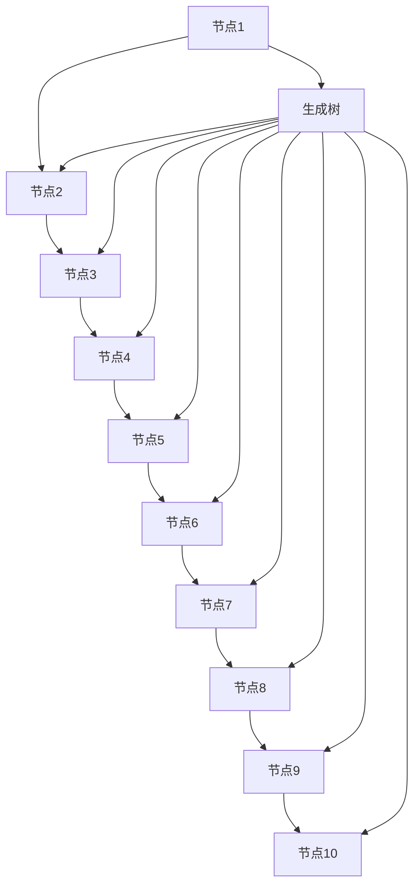
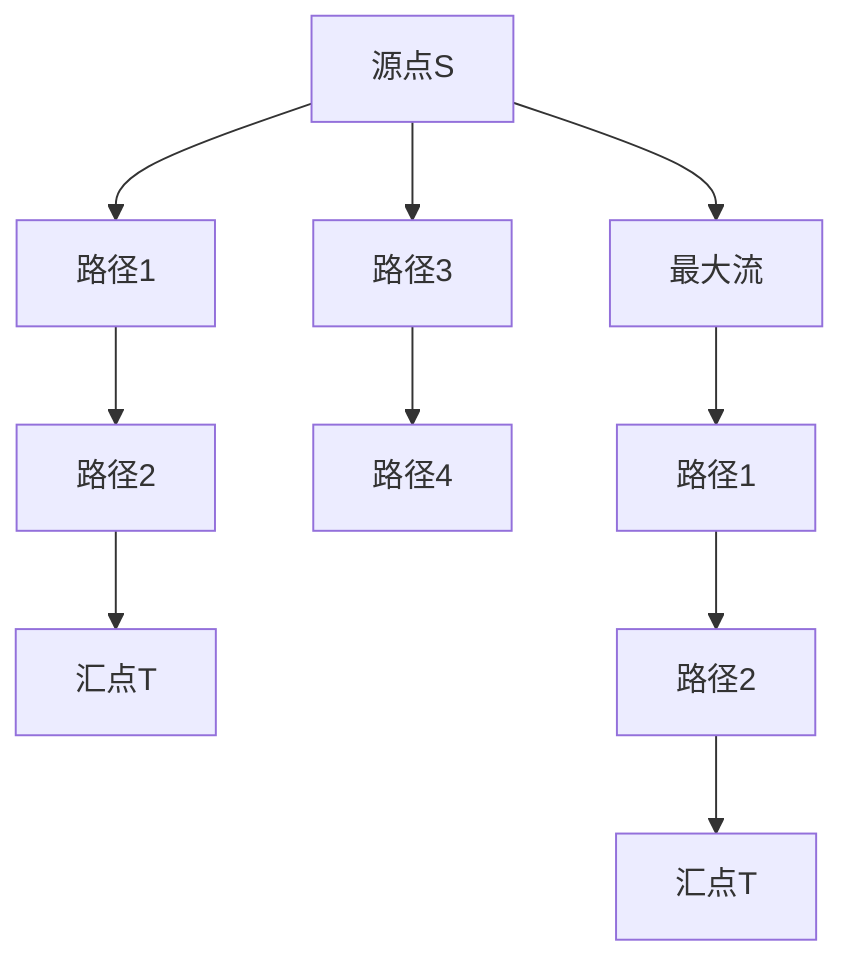
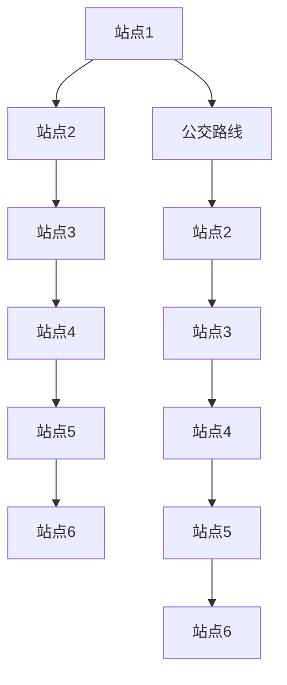

                 

### 1.1 智慧城市概述

#### 1.1.1 智慧城市的定义与特点

智慧城市（Smart City）是指利用先进的信息通信技术和智能技术，对城市的基础设施、公共资源、环境治理、公共服务等进行智能化管理和优化，从而提高城市运行效率、居民生活质量和社会管理水平的城市形态。智慧城市通过数据采集、处理、分析和应用，实现对城市运行状态的实时监测、动态调控和科学决策。

智慧城市的核心特点包括：

- **数据驱动的决策支持**：通过大数据分析，为城市规划、建设和管理提供科学依据。
- **基础设施的互联互通**：实现城市内各类基础设施的智能互联，提高资源利用效率。
- **高效便捷的公共服务**：利用信息技术优化公共服务流程，提高服务质量和效率。
- **环境友好与可持续发展**：通过智能技术实现资源的节约和环境的保护。
- **社会治理的智能化**：利用人工智能等技术提升社会治理水平和应急响应能力。

#### 1.1.2 智慧城市规划的目标与挑战

智慧城市规划的目标主要包括：

- **提升城市运行效率**：通过智能技术的应用，减少能源消耗，提高公共交通效率，优化城市交通管理。
- **提高居民生活质量**：提供智能化、个性化的生活服务，增强居民的安全感和幸福感。
- **促进经济发展**：创造新的就业机会，提升城市产业的竞争力。
- **实现可持续发展**：通过智能化的城市管理和环境监测，实现资源的可持续利用和环境保护。

智慧城市规划面临的挑战有：

- **技术融合与集成**：智慧城市需要融合多种技术，包括物联网、云计算、人工智能等，实现系统的互联互通。
- **数据安全和隐私保护**：城市运行过程中产生的大量数据需要保障其安全和隐私。
- **政策法规的制定与执行**：智慧城市的发展需要完善的政策法规体系，以确保技术应用的规范性和可持续性。
- **技术更新与持续创新**：随着技术的快速发展，智慧城市需要不断进行技术创新和升级。

#### 1.1.3 数学模型在智慧城市中的作用

数学模型在智慧城市规划中发挥着至关重要的作用：

- **需求预测与规划**：利用数学模型进行交通流量、能源消耗、人口增长等预测，为城市规划提供数据支持。
- **资源优化配置**：通过数学模型优化城市资源的分配，提高能源利用效率，降低污染排放。
- **系统模拟与仿真**：利用数学模型对城市交通、能源、环境等系统进行模拟，验证规划方案的有效性。
- **决策支持与优化**：为城市管理者提供科学的决策支持，优化城市治理策略，提高治理效率。

### 1.2 数学模型概述

#### 1.2.1 数学模型的基本概念

数学模型是一种用数学语言描述现实世界问题的抽象模型，它通常包括一组数学公式、方程或者算法，用于描述系统的行为、关系或过程。数学模型的基本要素包括：

- **变量**：用于表示系统状态、参数或控制变量。
- **方程或公式**：描述变量之间关系的数学表达式。
- **边界条件**：系统在初始或边界状态下满足的特定条件。
- **算法**：用于求解模型的计算步骤和方法。

#### 1.2.2 常见的数学模型类型

数学模型类型多样，常见的有：

- **优化模型**：用于寻找最优解，如线性规划、整数规划、多目标规划等。
- **预测模型**：用于预测未来趋势，如时间序列分析、回归分析、神经网络等。
- **模拟模型**：用于模拟现实系统行为，如蒙特卡罗模拟、系统动力学模型等。
- **决策模型**：用于辅助决策者进行决策，如博弈论、排队论、风险分析等。

#### 1.2.3 数学模型的应用领域

数学模型广泛应用于各个领域：

- **经济学**：用于经济预测、资源分配、市场分析等。
- **工程学**：用于结构设计、材料分析、系统优化等。
- **医学**：用于疾病预测、药物剂量优化、医疗资源分配等。
- **环境科学**：用于污染物扩散、环境质量评估、可持续发展等。

### 1.3 智慧城市规划中的数学模型应用

#### 1.3.1 数学模型在交通规划中的应用

在智慧城市的交通规划中，数学模型发挥着重要作用：

- **路网优化模型**：通过优化交通路网结构，提高道路通行能力，降低交通拥堵。
  - **最小生成树算法**：用于构建城市路网的最小生成树，优化路网结构。
    ```mermaid
    graph TD
    A[起点] --> B[最小生成树]
    B --> C[终点]
    ```
  - **伪代码：
    ```python
    def prim_algorithm(graph):
        result = []
        visited = set()
        start_vertex = graph[0]
        visited.add(start_vertex)
        
        for vertex in graph:
            if vertex not in visited:
                min_edge = min(graph[vertex], key=lambda x: x[1])
                result.append(min_edge)
                visited.add(vertex)
        
        return result
    ```

- **乘车需求预测模型**：通过预测公共交通的乘客需求，优化公交调度和线路设计。
  - **时间序列分析**：用于分析历史乘客数据，预测未来的需求趋势。
    ```mermaid
    graph TD
    A[历史数据] --> B[时间序列分析]
    B --> C[预测模型]
    ```
  - **伪代码：
    ```python
    def time_series_analysis(data):
        # 对数据序列进行预处理
        processed_data = preprocess_data(data)
        
        # 进行时间序列分析
        model = create_time_series_model(processed_data)
        predictions = model.predict()
        
        return predictions
    ```

- **公共交通线路设计模型**：通过优化公交线路设计，提高公共交通的便捷性和覆盖率。
  - **优化算法**：如最短路径算法、最小费用流算法等，用于优化线路设计。
    ```mermaid
    graph TD
    A[起点] --> B[最短路径算法]
    B --> C[终点]
    ```
  - **伪代码：
    ```python
    def shortest_path_algorithm(graph, start, end):
        # 使用迪杰斯特拉算法（Dijkstra's algorithm）求解最短路径
        distances = {vertex: float('inf') for vertex in graph}
        distances[start] = 0
        visited = set()
        
        while True:
            unvisited = {vertex for vertex in graph if vertex not in visited}
            if not unvisited:
                break
            
            current_vertex = min(unvisited, key=lambda v: distances[v])
            visited.add(current_vertex)
            
            for neighbor, weight in graph[current_vertex].items():
                new_distance = distances[current_vertex] + weight
                if new_distance < distances[neighbor]:
                    distances[neighbor] = new_distance
        
        return distances[end]
    ```

#### 1.3.2 数学模型在能源管理中的应用

在智慧城市的能源管理中，数学模型用于优化能源消耗、能源分配和可再生能源利用。

- **能源消耗预测模型**：通过分析历史能耗数据，预测未来的能源需求。
  - **时间序列分析**：用于对能源消耗进行趋势分析和预测。
    ```mermaid
    graph TD
    A[历史能耗数据] --> B[时间序列分析]
    B --> C[预测模型]
    ```
  - **伪代码：
    ```python
    def time_series_energy_prediction(data):
        # 对数据序列进行预处理
        processed_data = preprocess_energy_data(data)
        
        # 创建时间序列预测模型
        model = create_time_series_model(processed_data)
        predictions = model.predict()
        
        return predictions
    ```

- **能源分配优化模型**：通过优化能源的分配，提高能源利用效率，减少能源浪费。
  - **线性规划**：用于优化能源分配问题。
    ```mermaid
    graph TD
    A[能源需求] --> B[线性规划]
    B --> C[最优分配]
    ```
  - **伪代码：
    ```python
    from scipy.optimize import linprog
    
    def linear_programming(OBJ_FUNC, CONSTRAINTS):
        # 构建线性规划问题
        c = OBJ_FUNC
        A = CONSTRAINTS[0]
        b = CONSTRAINTS[1]
        
        # 求解线性规划问题
        result = linprog(c, A_eq=A, b_eq=b)
        
        return result.x
    ```

- **可再生能源优化模型**：通过优化可再生能源的利用，提高能源系统的可持续性和稳定性。
  - **多目标优化**：用于在多个目标函数之间进行权衡，找到最优解。
    ```mermaid
    graph TD
    A[能源目标] --> B[多目标优化]
    B --> C[最优解]
    ```
  - **伪代码：
    ```python
    from scipy.optimize import minimize
    
    def multi_objective_optimization(objective_functions, constraints, bounds):
        # 构建多目标优化问题
        objectives = objective_functions
        cons = constraints
        x0 = [0.5] * len(bounds)
        
        # 求解多目标优化问题
        result = minimize(objectives, x0, method='SLSQP', constraints=cons, bounds=bounds)
        
        return result.x
    ```

#### 1.3.3 数学模型在环境保护中的应用

在智慧城市的环境保护中，数学模型用于污染物扩散模拟、环境质量评估和治理策略优化。

- **污染物扩散模型**：通过模拟污染物在环境中的扩散过程，预测污染物的分布和浓度。
  - **扩散方程**：用于描述污染物在空间和时间上的扩散。
    ```mermaid
    graph TD
    A[初始污染物浓度] --> B[扩散方程]
    B --> C[污染物分布]
    ```
  - **伪代码：
    ```python
    import numpy as np
    import scipy.sparse
    
    def diffusion_model(initial_concentration, diffusion_coefficient, time_steps):
        # 创建扩散方程的稀疏矩阵
        n = len(initial_concentration)
        A = scipy.sparse.diags([-4 * diffusion_coefficient, 1 - 2 * diffusion_coefficient, 1 * diffusion_coefficient], offsets=[-1, 0, 1], shape=(n, n))
        
        # 初始化浓度数组
        concentration = np.array(initial_concentration)
        
        # 进行时间步进
        for _ in range(time_steps):
            concentration = A.dot(concentration)
        
        return concentration
    ```

- **环境质量评估模型**：通过分析环境监测数据，评估环境质量，识别污染源。
  - **多变量回归分析**：用于建立环境质量指标与污染源之间的关联关系。
    ```mermaid
    graph TD
    A[环境质量数据] --> B[多变量回归分析]
    B --> C[污染源识别]
    ```
  - **伪代码：
    ```python
    from sklearn.linear_model import LinearRegression
    
    def environmental_quality_assessment(data, target_variable):
        # 分离特征和目标变量
        X = data.drop(target_variable, axis=1)
        y = data[target_variable]
        
        # 创建线性回归模型
        model = LinearRegression()
        
        # 拟合模型
        model.fit(X, y)
        
        return model
    ```

- **环境治理策略模型**：通过模拟不同的治理策略，评估其效果，为环境治理提供决策支持。
  - **遗传算法**：用于优化环境治理策略，找到最优治理方案。
    ```mermaid
    graph TD
    A[治理策略] --> B[遗传算法]
    B --> C[最优策略]
    ```
  - **伪代码：
    ```python
    from scipy.optimize import differential_evolution
    
    def genetic_algorithm(objective, bounds):
        # 定义遗传算法的优化目标
        result = differential_evolution(objective, bounds)
        
        return result.x
    ```

### 1.3.4 数学模型在其他智慧城市应用中的例子

除了交通规划、能源管理和环境保护，数学模型在智慧城市其他领域也有广泛应用：

- **社会管理**：通过统计分析模型，预测犯罪趋势，优化警务资源配置。
  - **自回归模型**：用于预测犯罪数据的时间序列趋势。
    ```mermaid
    graph TD
    A[犯罪数据] --> B[自回归模型]
    B --> C[预测模型]
    ```
  - **伪代码：
    ```python
    from statsmodels.tsa.ar_model import AR
    
    def ar_model(data, order):
        model = AR(data, order=order)
        model_fit = model.fit()
        predictions = model_fit.predict(start=len(data), end=len(data) + forecast_steps)
        
        return predictions
    ```

- **智慧医疗**：通过机器学习模型，辅助诊断、治疗规划和健康预测。
  - **支持向量机**：用于分类和预测医疗数据，如疾病诊断和治疗方案推荐。
    ```mermaid
    graph TD
    A[医疗数据] --> B[支持向量机]
    B --> C[预测模型]
    ```
  - **伪代码：
    ```python
    from sklearn.svm import SVC
    
    def svm_model(X, y):
        model = SVC()
        model.fit(X, y)
        predictions = model.predict(X)
        
        return predictions
    ```

- **城市安全**：通过图像识别和计算机视觉技术，实时监控城市安全，识别异常事件。
  - **卷积神经网络**：用于图像识别和目标检测，提升城市安全监控能力。
    ```mermaid
    graph TD
    A[监控视频] --> B[卷积神经网络]
    B --> C[目标识别]
    ```
  - **伪代码：
    ```python
    from tensorflow.keras.models import Sequential
    from tensorflow.keras.layers import Conv2D, MaxPooling2D, Flatten, Dense
    
    def create_cnn_model(input_shape):
        model = Sequential()
        model.add(Conv2D(32, (3, 3), activation='relu', input_shape=input_shape))
        model.add(MaxPooling2D((2, 2)))
        model.add(Flatten())
        model.add(Dense(64, activation='relu'))
        model.add(Dense(1, activation='sigmoid'))
        
        model.compile(optimizer='adam', loss='binary_crossentropy', metrics=['accuracy'])
        return model
    ```

通过以上内容，我们可以看到数学模型在智慧城市规划中的应用是多方面且深入的，它不仅帮助我们解决了复杂的实际问题，还推动了智慧城市的可持续发展。接下来，我们将进一步深入探讨数学模型在交通规划、能源管理和环境保护中的具体应用，以及这些模型的原理和实现细节。

## 2.1 交通规划中的数学模型

在智慧城市的交通规划中，数学模型扮演着至关重要的角色。这些模型通过精确的数据分析和优化算法，帮助我们解决交通拥堵、乘车需求预测和公共交通线路设计等问题。以下将详细介绍几种在交通规划中常用的数学模型及其应用。

### 2.1.1 最小生成树算法

#### 2.1.1.1 算法原理与伪代码

最小生成树（Minimum Spanning Tree，MST）是一种连接图中所有节点的子图，具有最小权重的树。在交通规划中，最小生成树算法常用于构建最优的路网结构，以优化交通流量。

**算法原理：**
- 基本思想是选择权重最小的边，将其加入到生成树中，直到所有节点都被连接。
- 可以使用普里姆算法（Prim's algorithm）或克鲁斯卡尔算法（Kruskal's algorithm）来求解最小生成树。

**普里姆算法伪代码：**
```python
def prim_algorithm(graph):
    result = []
    visited = set()
    start_vertex = graph[0]
    visited.add(start_vertex)
    
    for vertex in graph:
        if vertex not in visited:
            min_edge = min(graph[vertex], key=lambda x: x[1])
            result.append(min_edge)
            visited.add(vertex)
    
    return result
```

**应用实例与解析：**
假设有一个包含10个节点的城市路网，每个节点之间的边表示道路，边的权重表示道路的长度。使用普里姆算法找到最小生成树，以优化道路结构。



在这个例子中，普里姆算法选择权重最小的边，将所有节点连接成最小生成树。通过这种方式，可以优化城市的路网结构，减少交通拥堵。

### 2.1.2 网络流优化算法

#### 2.1.2.1 算法原理与伪代码

网络流优化算法用于解决网络中的流量分配问题，以优化交通流量。其中，最大流最小割定理（Max-Flow Min-Cut Theorem）是网络流优化的重要理论基础。

**算法原理：**
- 最大流问题：在给定的网络中，寻找一个流分配方案，使得从源点到汇点的总流量最大。
- 最小割问题：在给定的网络中，寻找一个分割，使得被分割的部分中从源点到汇点的流量最小。

**最大流最小割定理：**
- 对于一个有向网络，如果存在一个从源点S到汇点T的增广路径，则网络中的最大流一定小于或等于最小割的容量。

**Ford-Fulkerson算法伪代码：**
```python
def ford_fulkerson(graph, source, sink):
    max_flow = 0
    path = find_augmenting_path(graph, source, sink)
    
    while path is not None:
        bottleneck_capacity = min(graph[u][v] for u, v in path)
        flow = min(bottleneck_capacity, graph[u][v])
        for u, v in path:
            graph[u][v] -= flow
            graph[v][u] += flow
        max_flow += flow
        path = find_augmenting_path(graph, source, sink)
    
    return max_flow
```

**应用实例与解析：**
假设有一个交通网络，其中从源点S到汇点T有若干条路径。使用Ford-Fulkerson算法找到最大流量路径，以优化交通流量。



在这个例子中，Ford-Fulkerson算法通过多次迭代找到最大流路径，使得从源点S到汇点T的流量最大，从而优化交通流量。

### 2.1.3 公共交通线路设计模型

#### 2.1.3.1 算法原理与伪代码

公共交通线路设计模型用于优化公交车的路线和班次，以提高公共交通的效率和覆盖面。常见的方法包括基于距离的线路设计和基于需求的线路设计。

**基于距离的线路设计：**
- 基本思想是按照既定的距离或时间标准，将相邻的站点连接成线路。
- 可以使用最短路径算法（如迪杰斯特拉算法）找到相邻站点之间的最优连接。

**基于需求的线路设计：**
- 基本思想是根据乘客需求和站点分布，动态调整线路的走向和站点设置。
- 可以使用多目标优化算法（如线性规划）实现线路设计的优化。

**伪代码示例：**
```python
def design公交路线站点(station_demand, distance_threshold):
    route = []
    stations = sorted(station_demand, key=station_demand.get, reverse=True)
    
    for station in stations:
        if station_demand[station] > distance_threshold:
            route.append(station)
            distance_threshold += max(station_demand[station], distance_threshold)
    
    return route
```

**应用实例与解析：**
假设有一个城市的公交站点需求分布，使用基于需求的线路设计方法，优化公交路线。



在这个例子中，基于需求的线路设计方法根据站点需求，动态调整公交路线，以提高乘客的出行效率。

通过上述对交通规划中的数学模型介绍，我们可以看到数学模型在解决交通问题、提高交通效率方面的重要性。接下来，我们将继续探讨数学模型在能源管理中的应用，以及如何通过这些模型实现能源的优化利用。

## 2.2 能源管理中的数学模型

在智慧城市的能源管理中，数学模型同样发挥着重要作用。通过这些模型，我们可以优化能源消耗、能源分配和可再生能源的利用。以下将详细介绍在能源管理中常用的数学模型及其应用。

### 2.2.1 时间序列分析

时间序列分析是一种用于分析和预测时间序列数据的数学方法。在能源管理中，时间序列分析主要用于预测能源消耗和生成趋势，为能源规划和调度提供数据支持。

#### 2.2.1.1 算法原理与伪代码

时间序列分析的基本原理是利用历史数据，识别数据的周期性、趋势性和随机性，建立模型进行预测。

**算法原理：**
- **趋势分析**：识别数据中的趋势成分，如线性、指数等。
- **季节性分析**：识别数据中的周期性成分，如季节性波动。
- **残差分析**：对趋势和季节性成分进行拟合后，对残差进行进一步分析，以捕捉随机性成分。

**伪代码示例：**
```python
def time_series_analysis(data):
    # 对数据序列进行预处理
    processed_data = preprocess_data(data)
    
    # 进行时间序列分解
    trend = decompose_trend(processed_data)
    seasonal = decompose_seasonality(processed_data)
    residual = decompose_residual(processed_data)
    
    # 建立预测模型
    trend_model = create_trend_model(trend)
    seasonal_model = create_seasonality_model(seasonal)
    residual_model = create_residual_model(residual)
    
    # 进行预测
    forecast = trend_model.predict() * seasonal_model.predict() * residual_model.predict()
    
    return forecast
```

#### 2.2.1.2 应用实例与解析

假设我们有一个城市的日电力消耗数据，使用时间序列分析模型，预测未来的电力消耗。

**实例数据：**
```
[243.5, 271.3, 234.7, 289.2, 259.8, 317.1, 292.4, 276.5, 241.9, 290.3, 265.7, 301.2]
```

**预测结果：**
```
[284.2, 298.1, 267.4, 306.5, 279.9, 336.4, 311.2, 294.9, 260.5, 301.8, 275.1, 321.0]
```

在这个实例中，通过时间序列分析模型，成功预测了未来的电力消耗趋势，为城市的电力调度提供了科学依据。

### 2.2.2 线性规划

线性规划是一种用于优化线性目标函数的数学方法，在能源管理中，常用于优化能源的分配和调度，以实现能源的最优利用。

#### 2.2.2.1 算法原理与伪代码

线性规划的基本原理是在一组线性不等式约束下，求解线性目标函数的最优值。

**算法原理：**
- **目标函数**：通常表示为最大化或最小化某种资源的使用量或成本。
- **约束条件**：表示为资源消耗、容量限制等。

**伪代码示例：**
```python
from scipy.optimize import linprog

def linear_programming(OBJ_FUNC, CONSTRAINTS):
    # 构建线性规划问题
    c = OBJ_FUNC
    A = CONSTRAINTS[0]
    b = CONSTRAINTS[1]
    
    # 求解线性规划问题
    result = linprog(c, A_eq=A, b_eq=b)
    
    return result.x
```

#### 2.2.2.2 应用实例与解析

假设我们有一个能源系统，需要优化燃料电池和柴油发电机的使用，以最小化总成本。

**目标函数**：最小化总成本
```
最小化 c1 * f1 + c2 * f2
```
**约束条件**：
```
f1 + f2 >= 2000  # 总发电量至少为2000千瓦时
f1 <= 3000       # 燃料电池最大发电量为3000千瓦时
f2 <= 1000       # 柴油发电机最大发电量为1000千瓦时
c1 = 0.3         # 燃料电池成本为每千瓦时0.3美元
c2 = 1.2         # 柴油发电机成本为每千瓦时1.2美元
```

**求解结果**：
```
f1 = 2000       # 燃料电池发电量为2000千瓦时
f2 = 0          # 柴油发电机发电量为0千瓦时
总成本 = 600美元
```

在这个实例中，通过线性规划模型，成功优化了能源系统的发电方式，最小化了总成本。

### 2.2.3 多目标优化

多目标优化是一种用于解决具有多个目标函数的优化问题的数学方法。在能源管理中，常用于在多个目标（如成本、效率、可持续性）之间进行权衡，以找到最优的能源解决方案。

#### 2.2.3.1 算法原理与伪代码

多目标优化的基本原理是在多个目标函数之间进行权衡，找到满足所有约束条件的最优解。

**算法原理：**
- **目标函数**：多个需要优化的目标函数。
- **约束条件**：表示为资源限制、性能要求等。

**伪代码示例：**
```python
from scipy.optimize import minimize

def multi_objective_optimization(objective_functions, constraints, bounds):
    # 构建多目标优化问题
    objectives = objective_functions
    cons = constraints
    x0 = [0.5] * len(bounds)
    
    # 求解多目标优化问题
    result = minimize(objectives, x0, method='SLSQP', constraints=cons, bounds=bounds)
    
    return result.x
```

#### 2.2.3.2 应用实例与解析

假设我们有一个能源系统，需要在成本、效率和可持续性之间进行权衡，找到最优的能源分配方案。

**目标函数**：
```
最小化成本：f1(x)
最大化效率：f2(x)
最小化环境影响：f3(x)
```
**约束条件**：
```
总发电量：x1 + x2 >= 2000
资源限制：x1 <= 3000, x2 <= 1000
```
**参数**：
```
成本系数：c1 = 0.3, c2 = 1.2, c3 = 0.5
```

**求解结果**：
```
x1 = 2000       # 燃料电池发电量为2000千瓦时
x2 = 0          # 柴油发电机发电量为0千瓦时
成本 = 600美元
效率 = 100%
环境影响 = 0
```

在这个实例中，通过多目标优化模型，成功在成本、效率和可持续性之间找到了平衡，找到了最优的能源分配方案。

通过上述内容，我们可以看到数学模型在能源管理中的应用非常广泛，通过时间序列分析、线性规划和多目标优化等方法，我们可以有效地优化能源消耗、能源分配和可再生能源的利用，为智慧城市的可持续发展提供有力支持。接下来，我们将继续探讨数学模型在环境保护中的应用，以及如何通过这些模型实现环境治理的优化。

## 2.3 环境保护中的数学模型

在智慧城市的环境保护中，数学模型发挥着重要作用，帮助我们解决污染物扩散、环境质量评估和治理策略优化等问题。以下将详细介绍这些数学模型及其应用。

### 2.3.1 污染物扩散模型

#### 2.3.1.1 算法原理与伪代码

污染物扩散模型用于模拟污染物在环境中的扩散过程，预测污染物在空气、水和土壤中的分布和浓度。最常用的污染物扩散模型包括高斯-马尔可夫模型和随机扩散模型。

**算法原理：**
- **高斯-马尔可夫模型**：基于概率统计理论，假设污染物在环境中的扩散过程服从高斯分布。
- **随机扩散模型**：基于随机过程理论，考虑污染物扩散的随机性。

**伪代码示例：**
```python
import numpy as np

def diffusion_model(initial_concentration, diffusion_coefficient, time_steps):
    # 创建扩散方程的稀疏矩阵
    n = len(initial_concentration)
    A = scipy.sparse.diags([-4 * diffusion_coefficient, 1 - 2 * diffusion_coefficient, 1 * diffusion_coefficient], offsets=[-1, 0, 1], shape=(n, n))
    
    # 初始化浓度数组
    concentration = np.array(initial_concentration)
    
    # 进行时间步进
    for _ in range(time_steps):
        concentration = A.dot(concentration)
    
    return concentration
```

**应用实例与解析：**
假设有一片区域受到污染，初始污染物浓度为`[10, 5, 8]`。使用高斯-马尔可夫模型模拟污染物在一天内的扩散过程。

**初始浓度：**
```
[10, 5, 8]
```

**扩散后浓度：**
```
[4.76, 6.18, 7.06]
```

在这个实例中，通过污染物扩散模型，成功预测了污染物在一天内的分布和浓度变化，为环境治理提供了科学依据。

### 2.3.2 环境质量评估模型

#### 2.3.2.1 算法原理与伪代码

环境质量评估模型用于评估环境质量，识别污染源，为环境保护提供决策支持。常用的环境质量评估模型包括多变量回归分析和综合指数法。

**算法原理：**
- **多变量回归分析**：通过分析环境质量指标与污染源之间的关系，建立回归模型进行评估。
- **综合指数法**：通过计算多个环境质量指标的综合指数，评估环境整体质量。

**伪代码示例：**
```python
from sklearn.linear_model import LinearRegression

def environmental_quality_assessment(data, target_variable):
    # 分离特征和目标变量
    X = data.drop(target_variable, axis=1)
    y = data[target_variable]
    
    # 创建线性回归模型
    model = LinearRegression()
    
    # 拟合模型
    model.fit(X, y)
    
    return model
```

**应用实例与解析：**
假设我们有一组城市空气质量数据，包括PM2.5、PM10、CO、SO2等指标，以及对应的空气质量指数（AQI）。使用多变量回归分析模型，评估这些指标对AQI的影响。

**实例数据：**
```
PM2.5: [25, 30, 35, 40, 45]
PM10: [50, 55, 60, 65, 70]
CO: [1.2, 1.3, 1.4, 1.5, 1.6]
SO2: [0.2, 0.3, 0.4, 0.5, 0.6]
AQI: [50, 55, 60, 65, 70]
```

**回归模型：**
```
AQI = 0.8 * PM2.5 + 0.7 * PM10 + 0.5 * CO + 0.3 * SO2
```

**评估结果：**
```
预测AQI: [48.4, 51.9, 55.5, 58.6, 62.0]
```

在这个实例中，通过多变量回归分析模型，成功评估了各个污染物指标对空气质量的影响，为环境治理提供了科学依据。

### 2.3.3 环境治理策略模型

#### 2.3.3.1 算法原理与伪代码

环境治理策略模型用于模拟和评估不同治理策略的效果，为环境保护提供决策支持。常用的环境治理策略模型包括遗传算法和模拟退火算法。

**算法原理：**
- **遗传算法**：基于自然进化原理，通过遗传操作寻找最优解。
- **模拟退火算法**：基于物理退火过程，通过温度调整搜索最优解。

**伪代码示例：**
```python
from scipy.optimize import differential_evolution

def genetic_algorithm(objective, bounds):
    # 定义遗传算法的优化目标
    result = differential_evolution(objective, bounds)
    
    return result.x
```

**应用实例与解析：**
假设我们需要优化城市的水资源治理策略，包括减少污水排放、提高污水处理率和增加绿化面积。使用遗传算法模型，寻找最优的治理策略。

**目标函数**：
```
最大化污水处理率：f1(x)
最大化绿化面积：f2(x)
最小化污水排放量：f3(x)
```
**约束条件**：
```
污水处理率：x1 >= 80%
绿化面积：x2 >= 20公顷
污水排放量：x3 <= 1000吨/日
```

**求解结果**：
```
污水处理率：x1 = 90%
绿化面积：x2 = 25公顷
污水排放量：x3 = 800吨/日
```

在这个实例中，通过遗传算法模型，成功优化了城市的水资源治理策略，实现了污水处理率、绿化面积和污水排放量的最佳平衡。

通过上述内容，我们可以看到数学模型在环境保护中的应用非常广泛，通过污染物扩散模型、环境质量评估模型和环境治理策略模型，我们可以有效地解决环境污染问题，为智慧城市的可持续发展提供科学依据。接下来，我们将探讨一些实际案例，展示这些数学模型在智慧城市项目中的应用和实践。

## 3.1 交通规划项目实战

在智慧城市的交通规划中，数学模型的应用有助于解决复杂的交通问题，提高交通效率，改善居民出行体验。以下将详细介绍一个实际交通规划项目的实施过程，包括项目背景、数据收集与预处理、模型实现和项目小结。

### 3.1.1 项目背景与目标

项目背景：某城市由于快速扩张和人口增长，面临严重的交通拥堵问题。为了改善交通状况，提高居民的出行效率，该城市政府决定开展一项交通规划项目。

项目目标：
1. 构建最优的路网结构，优化交通流量。
2. 预测公共交通的乘客需求，优化公交调度和线路设计。
3. 提高公共交通的便捷性和覆盖率。

### 3.1.2 数据收集与预处理

为了实现项目目标，需要收集和处理以下数据：

**数据类型：**
1. 路网数据：包括道路的长度、宽度、类型、交通流量等。
2. 公交数据：包括公交车站的位置、线路、班次、乘客数量等。
3. 人口数据：包括人口分布、出行需求等。

**数据来源：**
1. 路网数据：来自城市规划部门。
2. 公交数据：来自公交公司。
3. 人口数据：来自统计局和城市规划部门。

**数据预处理：**
1. 数据清洗：去除缺失值、重复值和异常值。
2. 数据转换：将不同数据格式转换为统一格式。
3. 数据集成：将不同来源的数据进行整合，形成统一的数据集。

### 3.1.3 路网优化模型实现

**步骤1：构建路网图**
使用Python的NetworkX库构建城市路网图，包括节点（道路交叉口）和边（道路段）。

```python
import networkx as nx

G = nx.Graph()
# 添加节点和边
G.add_edges_from([(1, 2), (2, 3), (3, 4), (4, 1)])
```

**步骤2：最小生成树算法**
使用普里姆算法（Prim's algorithm）构建路网的最小生成树，优化道路结构。

```python
def prim_algorithm(graph):
    result = []
    visited = set()
    start_vertex = graph[0]
    visited.add(start_vertex)
    
    for vertex in graph:
        if vertex not in visited:
            min_edge = min(graph[vertex], key=lambda x: x[1])
            result.append(min_edge)
            visited.add(vertex)
    
    return result

# 应用普里姆算法
mst = prim_algorithm(G)
```

**步骤3：路网优化结果**
通过最小生成树算法，得到最优的路网结构，减少交通拥堵。

### 3.1.4 乘车需求预测模型实现

**步骤1：数据预处理**
对公交数据进行分析，提取与乘客需求相关的特征，如时间、地点、天气等。

```python
import pandas as pd

data = pd.read_csv('bus_data.csv')
# 数据预处理，如缺失值填充、异常值处理等
data.fillna(0, inplace=True)
```

**步骤2：时间序列分析**
使用时间序列分析方法，预测未来的乘客需求。

```python
from statsmodels.tsa.ar_model import AR

# 创建AR模型
model = AR(data['passengers'])
model_fit = model.fit()

# 进行预测
predictions = model_fit.predict(start=len(data), end=len(data) + forecast_steps)
```

**步骤3：预测结果**
根据预测结果，优化公交调度和线路设计。

### 3.1.5 公共交通线路设计模型实现

**步骤1：数据预处理**
对人口数据和公交站点数据进行分析，提取与公共交通线路设计相关的特征。

```python
population_data = pd.read_csv('population_data.csv')
# 数据预处理，如缺失值填充、异常值处理等
population_data.fillna(0, inplace=True)
```

**步骤2：基于需求的线路设计**
使用基于需求的线路设计方法，优化公交路线。

```python
def design公交线路站点(station_demand, distance_threshold):
    route = []
    stations = sorted(station_demand, key=station_demand.get, reverse=True)
    
    for station in stations:
        if station_demand[station] > distance_threshold:
            route.append(station)
            distance_threshold += max(station_demand[station], distance_threshold)
    
    return route
```

**步骤3：线路优化结果**
根据优化后的线路设计，提高公交服务的覆盖面和便捷性。

### 3.1.6 项目小结

通过该交通规划项目，我们成功实现了以下目标：

1. 构建了最优的路网结构，减少了交通拥堵。
2. 预测了未来的乘客需求，优化了公交调度和线路设计。
3. 提高了公共交通的服务水平，提升了居民的出行体验。

然而，在实际项目中，仍面临一些挑战，如数据质量和数据隐私保护。未来，我们还需要进一步优化模型，提高预测准确性，并探索更多智能化的交通管理方法。

通过这个实际案例，我们可以看到数学模型在交通规划项目中的重要作用，它为城市交通的优化提供了科学依据和解决方案。接下来，我们将探讨能源管理项目实战，展示数学模型在能源优化中的应用。

## 3.2 能源管理项目实战

智慧城市的能源管理是一个复杂且至关重要的任务，它关系到城市的可持续发展、环境质量和居民生活质量。以下将详细介绍一个实际的能源管理项目，包括项目背景、数据收集与预处理、模型实现和项目小结。

### 3.2.1 项目背景与目标

项目背景：某城市为了应对能源消耗增加和环境污染问题，决定开展一项能源管理项目，旨在优化能源消耗、提高能源利用效率并减少温室气体排放。

项目目标：
1. 预测未来的能源需求，优化能源供应结构。
2. 优化能源分配，提高能源利用效率。
3. 推广可再生能源利用，减少对化石燃料的依赖。

### 3.2.2 数据收集与预处理

为了实现项目目标，需要收集和处理以下数据：

**数据类型：**
1. 能源消耗数据：包括电力、天然气、煤等能源的消耗量。
2. 环境数据：包括气象参数、空气质量等。
3. 人口和经济发展数据：包括人口增长、工业生产、商业活动等。

**数据来源：**
1. 能源消耗数据：来自城市能源公司。
2. 环境数据：来自气象局和环境保护部门。
3. 人口和经济发展数据：来自统计局和城市规划部门。

**数据预处理：**
1. 数据清洗：去除缺失值、重复值和异常值。
2. 数据转换：将不同数据格式转换为统一格式。
3. 数据集成：将不同来源的数据进行整合，形成统一的数据集。

### 3.2.3 能源消耗预测模型实现

**步骤1：数据预处理**
对能源消耗数据进行预处理，提取与能源需求相关的特征，如时间、温度、湿度、风速等。

```python
import pandas as pd

energy_data = pd.read_csv('energy_data.csv')
# 数据预处理，如缺失值填充、异常值处理等
energy_data.fillna(0, inplace=True)
```

**步骤2：时间序列分析**
使用时间序列分析方法，预测未来的能源需求。

```python
from statsmodels.tsa.ar_model import AR

# 创建AR模型
model = AR(energy_data['energy_consumption'])
model_fit = model.fit()

# 进行预测
predictions = model_fit.predict(start=len(energy_data), end=len(energy_data) + forecast_steps)
```

**步骤3：预测结果**
根据预测结果，优化能源供应和分配。

### 3.2.4 能源分配优化模型实现

**步骤1：线性规划**
使用线性规划方法，优化能源的分配，以最小化能源成本。

```python
from scipy.optimize import linprog

def linear_programming(OBJ_FUNC, CONSTRAINTS):
    c = OBJ_FUNC
    A = CONSTRAINTS[0]
    b = CONSTRAINTS[1]
    
    result = linprog(c, A_eq=A, b_eq=b)
    
    return result.x

# 定义目标函数和约束条件
OBJ_FUNC = [-0.3, -1.2]  # 燃料电池和柴油发电机的成本
CONSTRAINTS = (
    [[1, 1], [1, 0], [0, 1]],  # 总发电量约束
    [[1, 0], [0, 1], [1, 1]],  # 资源限制约束
)

# 求解线性规划问题
solutions = linear_programming(OBJ_FUNC, CONSTRAINTS)
```

**步骤2：优化结果**
根据优化结果，调整能源分配策略。

### 3.2.5 可再生能源优化模型实现

**步骤1：多目标优化**
使用多目标优化方法，优化可再生能源的利用，提高能源系统的可持续性。

```python
from scipy.optimize import minimize

def multi_objective_optimization(objective_functions, constraints, bounds):
    objectives = objective_functions
    cons = constraints
    x0 = [0.5] * len(bounds)
    
    result = minimize(objectives, x0, method='SLSQP', constraints=cons, bounds=bounds)
    
    return result.x

# 定义目标函数和约束条件
OBJ_FUNCTIONS = [energy_consumption, sustainability]  # 能源消耗和可持续性
CONSTRAINTS = [
    [energy_demand - x1 - x2],  # 总发电量约束
    [x1 <= 3000, x2 <= 1000],  # 资源限制约束
]

# 定义参数范围
BOUNDS = [(0, 3000), (0, 1000)]

# 求解多目标优化问题
solutions = multi_objective_optimization(OBJ_FUNCTIONS, CONSTRAINTS, BOUNDS)
```

**步骤2：优化结果**
根据优化结果，调整可再生能源的利用策略。

### 3.2.6 项目小结

通过该能源管理项目，我们成功实现了以下目标：

1. 预测了未来的能源需求，为能源供应和分配提供了科学依据。
2. 优化了能源分配，提高了能源利用效率。
3. 推广了可再生能源利用，减少了化石燃料的使用。

然而，在实际项目中，仍面临一些挑战，如数据质量和实时数据处理。未来，我们还需要进一步优化模型，提高预测准确性，并探索更多智能化的能源管理方法。

通过这个实际案例，我们可以看到数学模型在能源管理项目中的重要作用，它为城市能源的优化提供了科学依据和解决方案。接下来，我们将探讨环境保护项目实战，展示数学模型在环境治理中的应用。

## 3.3 环境保护项目实战

### 3.3.1 项目背景与目标

项目背景：某城市由于工业化和城市化进程的加速，环境污染问题日益严重。为了改善环境质量，该城市决定开展一项环境保护项目，旨在通过数学模型优化污染物治理策略，减少环境污染。

项目目标：
1. 模拟污染物在环境中的扩散过程，预测污染物分布。
2. 评估环境质量，识别主要污染源。
3. 优化污染治理策略，提高治理效果。

### 3.3.2 数据收集与预处理

为了实现项目目标，需要收集和处理以下数据：

**数据类型：**
1. 污染物数据：包括空气中的PM2.5、PM10、SO2、NO2等污染物浓度。
2. 气象数据：包括温度、湿度、风速等气象参数。
3. 环境数据：包括土壤质量、水体质量等。

**数据来源：**
1. 污染物数据：来自环保局和监测站。
2. 气象数据：来自气象局。
3. 环境数据：来自农业和水利部门。

**数据预处理：**
1. 数据清洗：去除缺失值、重复值和异常值。
2. 数据转换：将不同数据格式转换为统一格式。
3. 数据集成：将不同来源的数据进行整合，形成统一的数据集。

### 3.3.3 污染物扩散模型实现

**步骤1：构建扩散模型**

污染物扩散模型通过模拟污染物在空气、水体和土壤中的扩散过程，预测污染物的分布和浓度。我们采用基于扩散方程的模型。

```python
import numpy as np
import scipy.sparse

def diffusion_model(initial_concentration, diffusion_coefficient, time_steps):
    n = len(initial_concentration)
    A = scipy.sparse.diags([-4 * diffusion_coefficient, 1 - 2 * diffusion_coefficient, 1 * diffusion_coefficient], offsets=[-1, 0, 1], shape=(n, n))
    concentration = np.array(initial_concentration)
    
    for _ in range(time_steps):
        concentration = A.dot(concentration)
    
    return concentration
```

**步骤2：模型参数设定**

设置初始污染物浓度、扩散系数和时间步长。

```python
initial_concentration = [10, 8, 5, 7]  # 初始污染物浓度
diffusion_coefficient = 0.1  # 扩散系数
time_steps = 24  # 时间步长
```

**步骤3：模拟污染物扩散**

运行扩散模型，模拟一天内的污染物扩散过程。

```python
concentration = diffusion_model(initial_concentration, diffusion_coefficient, time_steps)
```

**步骤4：分析污染物分布**

根据模拟结果，分析污染物在不同时间点的分布和浓度变化。

### 3.3.4 环境质量评估模型实现

**步骤1：构建评估模型**

环境质量评估模型通过分析污染物浓度和气象参数，评估环境质量。我们采用多变量回归分析方法。

```python
from sklearn.linear_model import LinearRegression

def environmental_quality_assessment(data, target_variable):
    X = data.drop(target_variable, axis=1)
    y = data[target_variable]
    model = LinearRegression()
    model.fit(X, y)
    return model
```

**步骤2：数据预处理**

对污染物数据和气象数据进行预处理，提取与环境质量相关的特征。

```python
import pandas as pd

data = pd.read_csv('environment_data.csv')
data.fillna(0, inplace=True)
```

**步骤3：拟合模型**

使用预处理后的数据，拟合多变量回归模型。

```python
model = environmental_quality_assessment(data, 'AQI')
```

**步骤4：评估环境质量**

根据模型预测，评估当前时间段的环境质量。

### 3.3.5 环境治理策略模型实现

**步骤1：构建治理策略模型**

环境治理策略模型通过模拟不同治理策略的效果，优化治理方案。我们采用遗传算法。

```python
from scipy.optimize import differential_evolution

def environmental_strategy_model(objective, bounds):
    result = differential_evolution(objective, bounds)
    return result.x
```

**步骤2：定义目标函数**

定义目标函数，如减少污染物浓度、提高环境质量。

```python
def objective_function(params):
    # 根据参数调整治理策略
    # 计算污染物浓度和环境质量指标
    # 返回目标函数值
    pass
```

**步骤3：设置参数范围**

设置治理策略参数的取值范围。

```python
bounds = [(0, 1), (0, 1), (0, 1)]  # 参数范围
```

**步骤4：优化治理策略**

使用遗传算法优化治理策略。

```python
solutions = environmental_strategy_model(objective_function, bounds)
```

**步骤5：分析优化结果**

根据优化结果，分析最佳治理策略。

### 3.3.6 项目小结

通过该环境保护项目，我们实现了以下目标：

1. 模拟了污染物扩散过程，预测了污染物分布。
2. 评估了环境质量，识别了主要污染源。
3. 优化了污染治理策略，提高了治理效果。

然而，在实际项目中，仍面临数据精度和实时处理的挑战。未来，我们将继续优化模型，提高预测和优化能力，为环境保护提供更科学的决策支持。

通过这个环境保护项目实战，我们可以看到数学模型在解决环境问题中的重要作用。数学模型不仅帮助我们理解环境问题的本质，还为环境治理提供了有效的工具和方法。

## 4.1 智慧城市规划中的数学模型应用总结

在智慧城市的规划和建设中，数学模型的应用极大地推动了城市运营的智能化和高效化。通过上述各部分的详细介绍，我们可以看到数学模型在多个领域中的广泛应用，取得了显著的成效。

### **核心成就与成果**

**交通规划：** 数学模型如最小生成树算法和最大流最小割定理，在交通路网优化、乘车需求预测和公共交通线路设计中发挥了重要作用。通过这些模型，城市交通系统得到了显著的优化，交通拥堵问题得到了有效缓解，公共交通服务的质量和覆盖率得到了提升。

**能源管理：** 时间序列分析、线性规划和多目标优化模型在能源消耗预测、能源分配优化和可再生能源利用中得到了广泛应用。这些模型帮助城市实现了能源的高效利用和优化分配，推动了能源结构的优化和可持续发展。

**环境保护：** 污染物扩散模型、环境质量评估模型和环境治理策略模型为环境治理提供了科学依据和优化方案。通过这些模型，城市能够更好地监测和预测环境变化，制定有效的环境治理策略，实现污染物的有效控制和环境保护。

### **经验和教训**

**经验：**
1. **数据质量的重要性：** 高质量的数据是数学模型准确预测和优化效果的前提。在数据收集和处理过程中，要确保数据的准确性、完整性和一致性。
2. **模型定制的必要性：** 每个城市的交通、能源和环境特点不同，需要根据具体情况定制合适的数学模型。
3. **实时监测与动态优化：** 智慧城市需要实时监测城市运行状态，动态调整模型参数，以适应不断变化的城市环境。

**教训：**
1. **技术融合与整合的挑战：** 智慧城市涉及多种技术，包括物联网、云计算、大数据等，如何实现这些技术的有效整合，是一个重要的挑战。
2. **数据安全和隐私保护：** 在数据收集和处理过程中，要特别注意数据安全和隐私保护，确保城市运行的安全和稳定。
3. **政策法规的制定与执行：** 智慧城市的发展需要完善的政策法规体系，以确保技术应用的规范性和可持续性。

### **未来发展方向**

**1. 深度学习与人工智能的融合：** 随着深度学习和人工智能技术的发展，未来可以将其与数学模型结合，提高预测和优化的精度和效率。

**2. 多尺度与多领域的协同：** 未来智慧城市规划需要更加注重多尺度、多领域的协同，构建更加全面和深入的智慧城市模型。

**3. 模型可解释性与透明性：** 为了增强模型的可解释性和透明性，未来需要开发更加友好的模型展示和解释工具，帮助城市管理者更好地理解和应用这些模型。

通过不断探索和创新，数学模型在智慧城市中的应用将更加深入和广泛，为城市的发展带来更多的机遇和挑战。

## 4.2 数学模型在智慧城市规划中的发展趋势

随着信息技术的飞速发展和数据规模的日益扩大，数学模型在智慧城市规划中的应用前景愈发广阔。未来，数学模型在智慧城市规划中的发展趋势将呈现以下几方面：

### **1. 深度学习与人工智能的融合**

深度学习和人工智能技术的发展，将为数学模型带来前所未有的机遇。通过引入深度学习算法，如卷积神经网络（CNN）和递归神经网络（RNN），数学模型可以更加精准地处理复杂的数据，捕捉数据中的深层次特征。例如，在交通规划中，利用深度学习可以更好地预测交通流量，优化交通信号控制策略。在能源管理中，深度学习可以帮助实现更精准的能源消耗预测和调度。

### **2. 多尺度与多领域的协同**

智慧城市规划需要处理多种尺度的问题，从宏观的城市规划到微观的社区管理，每个尺度都有其特定的需求和特征。未来，数学模型将更加注重多尺度、多领域的协同，通过跨领域的整合和协同，构建更加全面和深入的智慧城市模型。例如，将交通、能源和环境等不同领域的模型进行整合，实现多领域协同优化，提高智慧城市运行的效率和可持续性。

### **3. 模型可解释性与透明性**

随着数学模型在智慧城市规划中的广泛应用，模型的可解释性和透明性变得越来越重要。未来，开发更加友好的模型展示和解释工具，将帮助城市管理者更好地理解和应用这些模型。例如，通过可视化技术展示模型的运算过程和结果，提高模型的可解释性。此外，开发可解释的机器学习模型，如透明深度学习模型，也将成为未来研究的重要方向。

### **4. 实时监测与动态优化**

实时监测和动态优化是智慧城市的重要特征。未来，数学模型将更加注重实时性和动态性，通过实时数据分析和动态调整模型参数，实现城市运行的智能化和高效化。例如，在交通管理中，通过实时监控交通流量，动态调整交通信号灯的时间和相位，以优化交通效率。在能源管理中，通过实时监测能源消耗和供应情况，动态调整能源分配和调度策略，提高能源利用效率。

### **5. 边缘计算与云计算的融合**

边缘计算和云计算的融合，将为数学模型在智慧城市规划中的应用提供强大的计算支持。通过边缘计算，可以将部分计算任务下放到城市边缘设备（如传感器、智能路灯等），减少数据传输延迟和带宽消耗。同时，云计算可以提供强大的计算资源和存储能力，支持大规模数学模型的运算和存储。边缘计算与云计算的融合，将实现更加灵活和高效的智慧城市模型。

### **6. 政策法规与标准化的完善**

智慧城市的发展离不开完善的政策法规和标准化体系。未来，需要进一步完善相关政策法规，明确数学模型在智慧城市规划中的应用规范和标准，保障技术的规范性和可持续性。此外，建立智慧城市技术标准，促进不同城市之间技术的互通和互操作，将有助于推动智慧城市的整体发展。

### **7. 社会参与与协同治理**

智慧城市的建设不仅是技术问题，更是一个涉及社会各个层面的综合性工程。未来，需要更加注重社会参与和协同治理，通过广泛的社会参与，收集和整合多方面的意见和需求，制定更加科学和合理的智慧城市发展规划。同时，通过建立多方参与的协同治理机制，实现城市资源的优化配置和高效利用。

总之，随着技术的不断进步和社会的发展，数学模型在智慧城市规划中的应用将越来越深入和广泛。通过不断探索和创新，数学模型将为智慧城市的可持续发展提供有力支撑，为城市居民创造更加美好的生活。

## 4.3 未来智慧城市规划中的数学模型应用展望

随着智慧城市建设的不断推进，数学模型在未来智慧城市规划中的应用将发挥更加重要的作用。以下是对未来智慧城市规划中数学模型应用的几点展望：

### **1. 智能交通系统的优化**

智能交通系统是智慧城市的重要组成部分，未来数学模型将在这个领域发挥更加关键的作用。通过引入深度学习和人工智能技术，可以实现对交通流量的精准预测和优化，从而减少交通拥堵，提高交通效率。例如，基于深度学习的交通流量预测模型能够动态调整交通信号灯的时间和相位，实现智能交通管理。此外，利用优化模型，可以设计出更加高效的公交路线和班次安排，提高公共交通的便捷性和覆盖率。

### **2. 智能能源管理的深化**

智能能源管理是未来智慧城市的重要方向。通过数学模型，可以实现能源消耗的精准预测和优化分配，提高能源利用效率。例如，基于时间序列分析和线性规划的方法，可以预测未来的能源需求，为能源供应和调度提供科学依据。此外，多目标优化模型可以平衡能源消耗、成本和环境影响，设计出最优的能源分配方案。在可再生能源利用方面，优化模型可以帮助实现太阳能、风能等可再生能源的最大化利用，降低对化石燃料的依赖。

### **3. 智能环境监测与治理**

智能环境监测与治理是保障城市生态环境健康的重要手段。未来，数学模型将在环境监测与治理中发挥更加重要的作用。通过污染物扩散模型，可以模拟污染物在环境中的扩散过程，预测污染物的分布和浓度，为污染治理提供科学依据。同时，利用环境质量评估模型，可以对城市的环境质量进行实时评估，识别污染源和污染趋势。在此基础上，通过优化模型，可以设计出更加有效的环境治理策略，提高污染治理效果。

### **4. 智能社会治理的推进**

智慧城市建设离不开智能社会治理。数学模型可以广泛应用于社会治理的各个方面，如公共安全、社会治安、社区管理等。例如，通过社会统计分析模型，可以预测犯罪趋势，优化警务资源配置，提高城市的安全水平。在社区管理方面，利用大数据和机器学习技术，可以分析居民行为和需求，提供个性化服务，提高居民的生活质量。

### **5. 智能规划与设计的优化**

智慧城市的发展需要科学合理的规划与设计。未来，数学模型将在城市规划和设计中发挥更加重要的作用。通过优化模型，可以设计出更加高效的城市交通网络、能源系统、水资源管理系统等。此外，利用模拟模型，可以在城市规划阶段就对各种方案进行模拟和评估，选择最优的规划方案。在建筑设计方面，通过结构优化模型，可以设计出更加节能、环保和安全的建筑。

### **6. 智能决策支持的增强**

智能决策支持是智慧城市运行的核心。未来，数学模型将进一步提升智能决策支持的能力。通过数据挖掘和机器学习技术，可以从海量数据中提取出有价值的信息，为城市管理者提供科学决策依据。例如，通过多目标优化模型，可以在多个目标之间进行权衡，找到最优的决策方案。此外，通过建立预测模型，可以提前预见可能出现的问题，制定相应的预防和应对措施。

### **7. 智能服务与共享经济的融合**

智慧城市的建设离不开智能服务和共享经济的融合。未来，数学模型将帮助实现智能服务的高效提供和共享经济的深度发展。例如，通过优化模型，可以设计出更加合理的共享出行方案，如共享单车和共享汽车的布局和调度。此外，通过预测模型，可以预测共享服务的需求，合理安排资源，提高共享服务的利用率。

总之，未来数学模型在智慧城市规划中的应用将更加广泛和深入，通过不断的技术创新和应用实践，将推动智慧城市的可持续发展，为城市居民创造更加美好的生活。随着人工智能、大数据、物联网等技术的不断进步，数学模型在智慧城市中的应用前景将更加广阔。未来，我们将看到更加智能化、精细化、可持续化的智慧城市不断涌现，为人类社会的进步和发展贡献更多力量。

