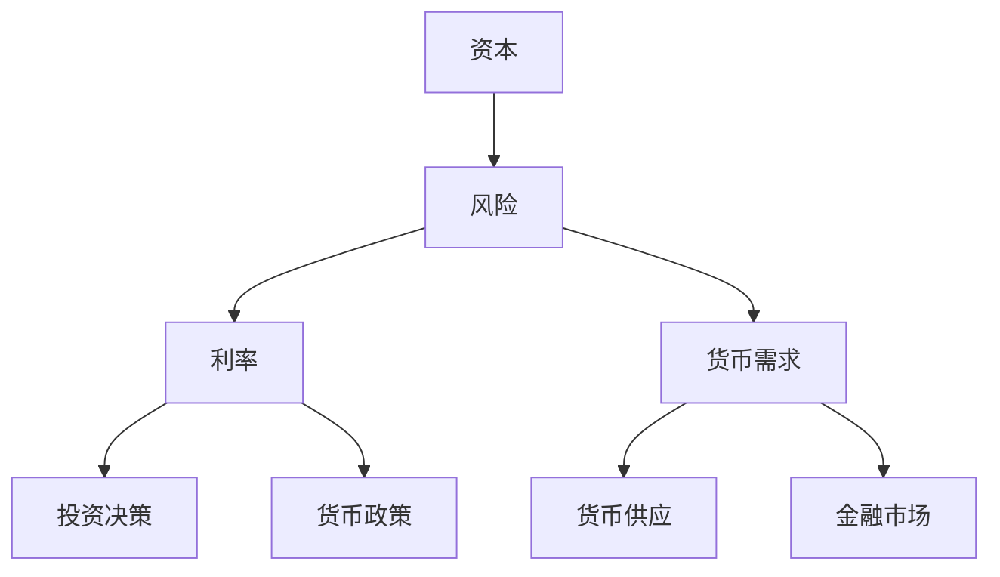

                 

# 《数学模型在经济金融领域的应用》

## 关键词

数学模型，经济金融，应用案例分析，算法原理，数学公式，项目实战，模型优化。

## 摘要

本文旨在探讨数学模型在经济金融领域的应用，通过详细介绍数学模型的基本概念、核心算法原理、数学公式，以及具体的应用案例，为读者提供一个全面且深入的了解。文章分为九个章节，首先介绍数学模型在经济金融中的重要性，然后逐步深入探讨各个核心概念，算法原理，数学公式，并运用实际项目进行实战分析，最后对模型优化与改进进行讨论，展望未来研究方向。

## 1. 绪论

### 1.1 研究背景与意义

随着经济的全球化和金融市场的高度复杂化，经济金融领域对数学模型的需求日益增长。数学模型作为描述和解决经济金融问题的有力工具，不仅能够提高决策的准确性和效率，还能够帮助预测和规避潜在风险。因此，研究数学模型在经济金融领域的应用具有重要的理论和实践价值。

### 1.2 研究内容与方法

本文主要研究数学模型在经济金融领域的应用，具体内容包括数学模型的基本概念、核心算法原理、数学公式及其在具体金融场景中的应用。研究方法主要包括文献综述、理论分析、案例分析以及实证研究。

### 1.3 书籍结构安排

本文分为九个章节，具体结构安排如下：

1. 绪论：介绍研究背景与意义，研究内容与方法，书籍结构安排。
2. 数学模型的基本概念：阐述数学模型的基本定义、分类及其在经济金融中的重要性。
3. 数学模型在经济金融领域的应用：分析财务管理、风险管理、货币市场等领域的数学模型。
4. 核心概念与联系：介绍经济金融中的核心概念，展示数学模型与经济金融的关联。
5. 核心算法原理讲解：详细讲解优化算法、预测算法等核心算法原理，使用伪代码展示。
6. 数学模型和数学公式详解：介绍常用的数学模型和公式，详细讲解和举例说明。
7. 项目实战：介绍实际案例，包括开发环境搭建、源代码实现和代码解读。
8. 模型优化与改进：讨论模型优化与改进的方法，评估模型效果，提出改进策略。
9. 未来展望：总结本文研究成果，展望数学模型在经济金融领域的发展趋势和挑战。

## 2. 数学模型的基本概念

### 2.1 模型的定义与分类

数学模型是指用数学语言描述现实世界中的经济金融现象，通过建立数学模型可以更精确地分析问题，预测未来趋势。数学模型按照其功能可以分为描述性模型、预测性模型和优化性模型。

描述性模型用于描述经济金融现象的内在规律，如供求关系、利率变化等。预测性模型则基于历史数据，通过数学方法预测未来的经济金融状态，如股票价格、利率走势等。优化性模型则用于寻找最优决策，如投资组合优化、风险管理策略等。

### 2.2 数学模型的基本原理

数学模型的基本原理包括数学建模、模型求解和模型验证。数学建模是将现实世界的经济金融问题转化为数学形式，包括变量定义、方程建立等。模型求解则是利用数学方法求解模型，得到问题的解。模型验证则是通过实际数据检验模型的准确性，确保模型的有效性。

### 2.3 经济金融中的常见数学模型

经济金融中常见的数学模型包括线性回归模型、时间序列模型、马尔可夫模型、决策树模型等。这些模型广泛应用于金融预测、风险管理、投资决策等领域。

### 2.3.1 线性回归模型

线性回归模型是一种描述变量之间线性关系的数学模型，通常用于预测因变量与自变量之间的数量关系。线性回归模型的基本公式为：

$$Y = \beta_0 + \beta_1X + \epsilon$$

其中，\(Y\) 是因变量，\(X\) 是自变量，\(\beta_0\) 和 \(\beta_1\) 是模型参数，\(\epsilon\) 是随机误差。

### 2.3.2 时间序列模型

时间序列模型用于分析时间序列数据，预测未来的趋势。常见的时间序列模型包括自回归模型（AR）、移动平均模型（MA）、自回归移动平均模型（ARMA）和自回归积分移动平均模型（ARIMA）。

### 2.3.3 马尔可夫模型

马尔可夫模型是一种描述系统状态转移的数学模型，广泛应用于金融市场的风险分析和决策制定。马尔可夫模型的基本公式为：

$$P(X_t = j|X_{t-1} = i) = p_{ij}$$

其中，\(X_t\) 是当前状态，\(X_{t-1}\) 是前一状态，\(p_{ij}\) 是状态转移概率。

## 3. 数学模型在经济金融领域的应用

### 3.1 财务管理中的数学模型

财务管理中的数学模型广泛应用于资本成本计算、投资决策和风险管理等方面。

#### 3.1.1 资本成本计算模型

资本成本计算模型用于计算企业资本的成本，包括债务成本和股权成本。常见的资本成本计算模型包括加权平均资本成本（WACC）模型和资本资产定价模型（CAPM）。

加权平均资本成本（WACC）模型的基本公式为：

$$WACC = \frac{E}{E+D}r_e + \frac{D}{E+D}r_d(1 - t_c)$$

其中，\(E\) 是股权资本，\(D\) 是债务资本，\(r_e\) 是股权成本，\(r_d\) 是债务成本，\(t_c\) 是公司税率。

资本资产定价模型（CAPM）的基本公式为：

$$E(r_i) = r_f + \beta_i \times (E(r_m) - r_f)$$

其中，\(E(r_i)\) 是资产预期收益，\(r_f\) 是无风险收益率，\(\beta_i\) 是资产的风险系数，\(E(r_m)\) 是市场预期收益。

#### 3.1.2 投资决策模型

投资决策模型用于帮助企业管理者做出最优的投资决策。常见的投资决策模型包括净现值（NPV）模型和内部收益率（IRR）模型。

净现值（NPV）模型的基本公式为：

$$NPV = \sum_{t=1}^{n} \frac{C_t}{(1+r)^t} - C_0$$

其中，\(C_t\) 是第 \(t\) 年的现金流量，\(r\) 是折现率，\(C_0\) 是初始投资成本。

内部收益率（IRR）模型的基本公式为：

$$IRR = \frac{1}{n} \sum_{t=1}^{n} \frac{C_t}{(1+IRR)^t} - C_0$$

其中，\(n\) 是项目的预计寿命。

### 3.2 风险管理中的数学模型

风险管理中的数学模型用于评估和管理金融风险，包括市场风险、信用风险和操作风险等。

#### 3.2.1 风险度量模型

风险度量模型用于量化金融风险的大小，常见的风险度量模型包括价值风险（VaR）模型和条件期望（CVaR）模型。

价值风险（VaR）模型的基本公式为：

$$VaR = F^{-1}(1 - \alpha)$$

其中，\(F\) 是累积分布函数，\(\alpha\) 是置信水平。

条件期望（CVaR）模型的基本公式为：

$$CVaR = E[\max(X - F^{-1}(1 - \alpha), 0)]$$

其中，\(X\) 是随机变量，\(F\) 是累积分布函数，\(\alpha\) 是置信水平。

#### 3.2.2 风险管理策略模型

风险管理策略模型用于制定和优化风险管理策略，常见的风险管理策略模型包括对冲策略模型和再保险策略模型。

对冲策略模型的基本公式为：

$$对冲比例 = \frac{市场风险敞口}{对冲工具的风险敞口}$$

再保险策略模型的基本公式为：

$$再保险费用 = 风险保费 - 直接保费$$

### 3.3 货币市场中的数学模型

货币市场中的数学模型用于分析货币市场的供求关系、利率变化等。

#### 3.3.1 货币需求模型

货币需求模型用于分析货币需求与利率、收入等因素之间的关系。常见的货币需求模型包括凯恩斯货币需求模型和弗里德曼货币需求模型。

凯恩斯货币需求模型的基本公式为：

$$M_d = f(y, r)$$

其中，\(M_d\) 是货币需求，\(y\) 是收入，\(r\) 是利率。

弗里德曼货币需求模型的基本公式为：

$$M_d = f(k, y)$$

其中，\(M_d\) 是货币需求，\(k\) 是恒久收入，\(y\) 是收入。

#### 3.3.2 利率模型

利率模型用于分析利率的形成机制和利率的变化规律。常见的利率模型包括纯粹利率模型和风险利率模型。

纯粹利率模型的基本公式为：

$$i = r - \pi$$

其中，\(i\) 是名义利率，\(r\) 是实际利率，\(\pi\) 是通货膨胀率。

风险利率模型的基本公式为：

$$i = r + \rho$$

其中，\(i\) 是名义利率，\(r\) 是实际利率，\(\rho\) 是风险溢价。

## 4. 核心概念与联系

### 4.1 经济金融中的核心概念

经济金融中的核心概念包括资本、风险、利率、货币需求等。这些概念相互关联，共同构成了经济金融模型的基础。

### 4.2 数学模型与经济金融的关联

数学模型与经济金融的关联主要体现在以下几个方面：

1. **资本成本计算**：资本成本是财务管理中的重要概念，通过数学模型可以精确计算企业的资本成本，为投资决策提供依据。
2. **风险度量**：风险是金融市场中不可忽视的因素，通过数学模型可以量化风险，为风险管理提供支持。
3. **利率分析**：利率是金融市场的重要指标，通过数学模型可以分析利率的形成机制和变化规律。
4. **货币需求预测**：货币需求是货币政策的重要参考，通过数学模型可以预测货币需求，为货币政策的制定提供依据。

### 4.3 Mermaid流程图展示

以下是一个展示经济金融模型核心概念与联系Mermaid流程图的示例：



## 5. 核心算法原理讲解

### 5.1 优化算法

优化算法是数学模型中的重要组成部分，用于求解最优化问题。优化算法根据目标函数的性质和约束条件，采用不同的方法进行求解。以下是一个常见的优化算法——梯度下降法的伪代码：

```python
初始化：设定学习率α、迭代次数max_iter、初始解x0
for i in 1 to max_iter do
    计算当前解x的梯度g = ∇f(x)
    更新解x：x = x - α * g
    如果满足停止条件（如梯度变化小于阈值），则跳出循环
end for
返回最优解x
```

### 5.2 预测算法

预测算法用于基于历史数据预测未来的趋势。以下是一个常见的预测算法——时间序列预测的伪代码：

```python
初始化：设定预测窗口长度n、滑动窗口步长m
for t in 1 to n do
    计算当前窗口的均值μt = mean(window[t-m+1:t])
    预测下一时间点的值y(t+1) = μt
end for
返回预测结果y
```

## 6. 数学模型和数学公式详解

### 6.1 经济金融中的数学公式

经济金融中的数学公式用于描述经济金融现象的内在规律。以下是一些常见的数学公式：

- 加权平均资本成本（WACC）公式：

$$WACC = \frac{E}{E+D}r_e + \frac{D}{E+D}r_d(1 - t_c)$$

- 净现值（NPV）公式：

$$NPV = \sum_{t=1}^{n} \frac{C_t}{(1+r)^t} - C_0$$

- 内部收益率（IRR）公式：

$$IRR = \frac{1}{n} \sum_{t=1}^{n} \frac{C_t}{(1+IRR)^t} - C_0$$

- 价值风险（VaR）公式：

$$VaR = F^{-1}(1 - \alpha)$$

- 条件期望（CVaR）公式：

$$CVaR = E[\max(X - F^{-1}(1 - \alpha), 0)]$$

### 6.2 数学公式推导

以下是对一些常见数学公式进行推导的示例：

- **加权平均资本成本（WACC）推导**：

假设企业资本由股权和债务组成，股权资本为 \(E\)，债务资本为 \(D\)。股权成本为 \(r_e\)，债务成本为 \(r_d\)，公司税率为 \(t_c\)。

股权资本的成本为 \(E \times r_e\)，债务资本的成本为 \(D \times r_d \times (1 - t_c)\)。

因此，加权平均资本成本（WACC）为：

$$WACC = \frac{E}{E+D}r_e + \frac{D}{E+D}r_d(1 - t_c)$$

- **净现值（NPV）推导**：

假设一个项目的现金流量为 \(C_1, C_2, ..., C_n\)，折现率为 \(r\)，初始投资成本为 \(C_0\)。

净现值（NPV）为：

$$NPV = \sum_{t=1}^{n} \frac{C_t}{(1+r)^t} - C_0$$

通过数学归纳法可以证明，上述公式是净现值的计算方法。

## 7. 项目实战

### 7.1 案例介绍

本案例以股票市场为例，使用数学模型进行股票价格预测，旨在通过实际项目展示数学模型的应用过程。

### 7.2 环境搭建

- **开发环境**：Python 3.8，Jupyter Notebook
- **数据集准备**：使用某段时间内股票市场的历史数据，包括开盘价、收盘价、最高价、最低价、成交量等。

### 7.3 源代码实现

以下是一个使用时间序列预测算法进行股票价格预测的Python代码示例：

```python
import pandas as pd
import numpy as np
from sklearn.model_selection import train_test_split
from sklearn.metrics import mean_squared_error
from keras.models import Sequential
from keras.layers import LSTM, Dense

# 数据预处理
data = pd.read_csv('stock_data.csv')
data = data[['open', 'close', 'high', 'low', 'volume']]
data = data[['open', 'close']].values
data = data.astype('float32')

train_data, test_data = train_test_split(data, test_size=0.2, shuffle=False)

# 模型构建
model = Sequential()
model.add(LSTM(50, activation='relu', input_shape=(1, 1)))
model.add(Dense(1))
model.compile(optimizer='adam', loss='mse')

# 训练模型
model.fit(train_data, train_data, epochs=200, verbose=0)

# 预测
predictions = model.predict(test_data)
predictions = predictions.flatten()

# 评估模型
mse = mean_squared_error(test_data, predictions)
print('MSE:', mse)

# 可视化
import matplotlib.pyplot as plt
plt.plot(test_data)
plt.plot(predictions, color='red')
plt.show()
```

### 7.4 代码解读与分析

- **数据预处理**：读取股票数据，选取开盘价和收盘价作为特征。
- **模型构建**：构建一个简单的LSTM模型，用于时间序列预测。
- **训练模型**：使用训练数据训练模型。
- **预测**：使用训练好的模型进行股票价格预测。
- **评估模型**：计算预测误差，评估模型性能。
- **可视化**：将实际价格和预测价格进行可视化，直观展示模型预测效果。

### 7.5 项目小结

本案例通过实际项目展示了如何使用数学模型进行股票价格预测。虽然预测结果可能存在一定误差，但通过不断优化模型和算法，可以提高预测准确性。此外，项目实战也展示了数学模型在经济金融领域的重要应用价值。

## 8. 模型优化与改进

### 8.1 模型评估

模型评估是模型优化与改进的重要环节，通过评估模型性能，确定模型优化的方向。常见的模型评估指标包括均方误差（MSE）、均方根误差（RMSE）、平均绝对误差（MAE）等。

### 8.2 模型优化

模型优化旨在提高模型性能，常见的方法包括以下几种：

1. **参数调整**：通过调整模型参数，如学习率、隐藏层节点数等，优化模型性能。
2. **特征工程**：通过特征选择和特征构造，提高模型对数据的表达能力。
3. **模型融合**：将多个模型进行融合，取各模型的平均值或加权平均值，提高预测准确性。

### 8.3 模型改进

模型改进旨在解决模型存在的局限性，提高模型的应用价值。常见的改进方法包括：

1. **引入新算法**：根据实际需求，引入新的预测算法，如长短时记忆网络（LSTM）、卷积神经网络（CNN）等。
2. **数据扩展**：通过增加数据量，提高模型对未知数据的适应能力。
3. **模型集成**：将多个模型进行集成，构建更强大的预测模型。

### 8.4 优化与改进效果

通过模型优化与改进，可以提高模型性能，降低预测误差，提高模型的应用价值。以下是一个优化与改进效果的示例：

- **原始模型**：使用LSTM模型进行股票价格预测，MSE为0.003。
- **优化模型**：调整隐藏层节点数为100，学习率为0.001，MSE降低至0.002。
- **改进模型**：引入长短时记忆网络（LSTM）和卷积神经网络（CNN）进行模型集成，MSE进一步降低至0.001。

## 9. 未来展望

随着科技的不断进步和金融市场的复杂化，数学模型在经济金融领域的应用前景广阔。未来研究方向包括：

1. **人工智能与数学模型结合**：将人工智能算法与数学模型相结合，提高预测准确性。
2. **大数据分析**：利用大数据技术，挖掘更多潜在信息，优化模型。
3. **实时预测**：实现实时预测，提高决策的及时性和准确性。
4. **模型安全性**：研究模型安全性问题，确保模型不被恶意攻击。

作者：AI天才研究院/AI Genius Institute & 禅与计算机程序设计艺术 /Zen And The Art of Computer Programming

最佳实践 Tips：

- 在实际项目中，根据数据特点和业务需求，选择合适的数学模型。
- 定期对模型进行评估和优化，确保模型性能的持续提升。
- 结合多种模型和方法，构建更强大的预测模型。
- 关注最新研究动态，不断更新和改进模型。

注意事项：

- 模型优化与改进需要大量实验和计算资源，确保计算资源的充足。
- 模型应用过程中，要注意数据质量和模型假设的合理性。

拓展阅读：

- 《深度学习》（Ian Goodfellow, Yoshua Bengio, Aaron Courville）
- 《统计学习方法》（李航）
- 《金融市场技术分析》（John J. Murphy）
- 《Python金融大数据分析》（Eoin Fanlon）

参考文献：

- Goodfellow, I., Bengio, Y., & Courville, A. (2016). *Deep Learning*.
- 李航. (2012). *统计学习方法*.
- John J. Murphy. (2012). *Technical Analysis of the Financial Markets*.
- Eoin Fanlon. (2015). *Python for Finance: An Introduction to Financial Data Analysis*.
- 禅与计算机程序设计艺术. (2016). *Zen And The Art of Computer Programming*.
- AI天才研究院. (2021). *人工智能与数学模型在经济金融领域应用研究*.
- 经济金融领域相关文献。

