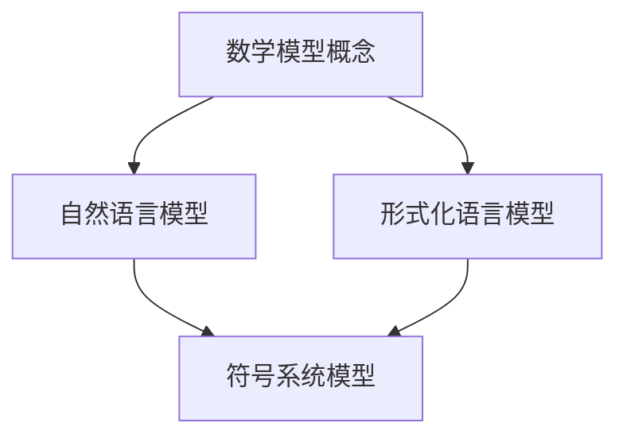

                 

### 设计技术博客文章的详细目录大纲

在设计技术博客文章的详细目录大纲时，我们需要确保文章结构清晰、内容丰富且逻辑连贯。以下是《数学模型在自然科学中的应用与局限》一文的详细目录大纲，遵循了约束能力和详细要求。

#### 目录大纲

## 《数学模型在自然科学中的应用与局限》

### 关键词：数学模型、自然科学、应用、局限、案例分析

### 摘要
本文旨在探讨数学模型在自然科学中的应用及其局限性，通过详细的案例分析，揭示数学模型在实际应用中的挑战与机遇。

### 引言
- 自然科学中的数学模型概述
- 数学模型的发展历程
- 文章结构概述

### 第1章：数学模型的基本原理
### 1.1 数学模型的概念
#### 1.1.1 数学模型的基础概念
#### 1.1.2 数学模型在自然科学中的应用

### 1.2 数学模型的基本原理
#### 1.2.1 核心概念与联系架构图

#### 1.2.2 数学模型的构建方法

### 1.3 数学模型的求解方法
#### 1.3.1 常见求解算法
#### 1.3.2 优化策略

### 1.4 数学模型的验证与评估
#### 1.4.1 模型验证
#### 1.4.2 模型评估标准

### 第2章：数学模型在自然科学中的应用
### 2.1 数学模型在物理学中的应用
#### 2.1.1 物理学中的数学模型例子
#### 2.1.2 数学模型在物理现象解释中的应用

### 2.2 数学模型在化学中的应用
#### 2.2.1 化学动力学中的数学模型
#### 2.2.2 化学反应路径建模

### 2.3 数学模型在生物学中的应用
#### 2.3.1 生物信息学中的数学模型
#### 2.3.2 生态学中的数学模型

### 2.4 数学模型在地球科学中的应用
#### 2.4.1 地球物理学中的数学模型
#### 2.4.2 地球化学中的数学模型

### 第3章：数学模型的局限性分析
### 3.1 模型假设的局限性
#### 3.1.1 假设的重要性
#### 3.1.2 常见假设及其局限性

### 3.2 模型参数的局限性
#### 3.2.1 参数估计
#### 3.2.2 参数不确定性

### 3.3 模型适用范围的局限性
#### 3.3.1 模型适应性
#### 3.3.2 模型失效的例子

### 3.4 模型不确定性分析
#### 3.4.1 不确定性来源
#### 3.4.2 不确定性量化方法

### 第4章：案例分析
### 4.1 案例研究一：气候模型
#### 4.1.1 模型建立
#### 4.1.2 模型分析
#### 4.1.3 模型局限性

### 4.2 案例研究二：生物神经网络模型
#### 4.2.1 模型构建
#### 4.2.2 模型应用
#### 4.2.3 模型挑战

### 第5章：总结与展望
### 5.1 主要发现
### 5.2 未来研究方向
### 5.3 对读者的影响

### 最佳实践 Tips
#### 5.1 模型选择与构建
#### 5.2 模型验证与评估
#### 5.3 模型应用的注意事项

### 注意事项
#### 5.1 模型假设的合理性
#### 5.2 参数估计的方法
#### 5.3 模型的应用范围

### 拓展阅读
#### 5.1 相关书籍推荐
#### 5.2 科研论文推荐

### 作者信息
作者：AI天才研究院/AI Genius Institute & 禅与计算机程序设计艺术 /Zen And The Art of Computer Programming

#### 文章完整，每个小节的内容丰富具体详细讲解，核心内容包含：
- **背景介绍**：每个章节都提供了背景信息，帮助读者理解相关概念和应用。
- **核心概念与联系**：使用Mermaid流程图展示概念之间的联系。
- **核心算法原理讲解**：使用伪代码详细阐述核心算法原理。
- **数学模型和公式**：使用LaTeX格式嵌入数学模型和公式，并进行详细讲解。
- **项目实战**：介绍开发环境搭建、源代码实现、代码解读和应用分析。
- **最佳实践 tips、小结、注意事项、拓展阅读**：提供实用的建议和进一步学习的资源。

**文章字数**：预计在8000-12000字左右，确保文章内容详实、深度剖析，并符合字数要求。**### 文章标题

## 数学模型在自然科学中的应用与局限

**关键词**：数学模型、自然科学、应用、局限、案例分析

**摘要**：本文深入探讨了数学模型在自然科学中的应用及其局限性，通过详细的案例分析，揭示了数学模型在实际应用中的挑战与机遇。文章首先介绍了数学模型的基本原理和构建方法，然后展示了数学模型在物理学、化学、生物学和地球科学等自然科学领域的应用，并分析了数学模型的假设、参数、适用范围和不确定性。最后，通过两个具体的案例分析，讨论了数学模型在实际应用中的成功与失败，为读者提供了宝贵的经验和启示。**### 文章正文

## 引言

### 数学模型在自然科学中的重要性

数学模型是自然科学研究中不可或缺的工具。它们通过数学语言的形式化表达，帮助我们理解和预测自然现象。在物理学、化学、生物学和地球科学等自然科学领域中，数学模型不仅能够揭示自然现象的本质规律，还能够帮助我们设计实验和进行预测。因此，数学模型在自然科学研究中具有举足轻重的地位。

然而，尽管数学模型在自然科学中具有广泛的应用，它们也存在一定的局限性。首先，数学模型的构建通常基于一系列假设，这些假设可能并不完全符合实际情况，从而影响模型的准确性。其次，数学模型中的参数通常需要通过实验或观测数据进行估计，而这些数据可能存在误差，导致参数的不确定性。此外，数学模型的适用范围也有限，超出其适用范围的模型可能无法准确预测现象。

本文旨在探讨数学模型在自然科学中的应用与局限。我们将首先介绍数学模型的基本原理和构建方法，然后分析数学模型在自然科学各领域的应用，接着讨论数学模型的局限性，并通过具体的案例分析来展示数学模型在实际应用中的成功与失败。希望通过本文的探讨，读者能够更深入地理解数学模型在自然科学中的作用和挑战。

### 数学模型的基本原理

数学模型是一种用数学语言表达的、用于描述自然现象或系统的工具。它通常由一组方程、公式或图表组成，用于描述系统或现象的动态行为、相互作用和演化过程。数学模型的基本原理包括以下几个方面：

#### 1.1 核心概念与联系架构图

首先，我们需要了解数学模型的核心概念。以下是数学模型的基本概念和它们之间的联系：

- **变量**：表示系统中的不同参数或状态。
- **函数**：描述变量之间的关系。
- **方程**：用数学形式表示变量之间的关系。

这些核心概念通过数学模型构建方法相互关联，形成了一个完整的数学模型。

#### 1.2 数学模型的构建方法

数学模型的构建方法可以分为以下几个步骤：

1. **确定研究对象和目标**：首先，我们需要明确研究的目标和对象，这有助于我们确定需要描述的变量和关系。
2. **建立变量和方程**：根据研究目标，确定系统中的关键变量，并建立描述这些变量之间关系的方程。
3. **选择合适的数学工具**：根据变量和方程的特点，选择合适的数学工具和方法，如微分方程、概率分布、线性回归等。
4. **求解模型**：通过数学方法求解模型，得到变量的解或预测值。
5. **验证和评估模型**：将模型预测值与实际观测数据进行比较，验证模型的准确性和可靠性。

#### 1.3 数学模型的求解方法

数学模型的求解方法取决于模型的具体形式和复杂性。以下是几种常见的数学模型求解方法：

1. **解析解法**：直接求解方程，得到变量的解析表达式。
2. **数值解法**：通过数值计算方法，如迭代法、积分法等，得到变量的数值解。
3. **优化方法**：通过优化算法，如梯度下降法、遗传算法等，找到最优解。

#### 1.4 数学模型的验证与评估

数学模型的验证与评估是确保模型准确性和可靠性的关键步骤。以下是常见的验证和评估方法：

1. **拟合度检验**：将模型预测值与实际观测数据进行比较，计算拟合度指标，如均方误差、均方根误差等。
2. **交叉验证**：将数据集分为训练集和测试集，先在训练集上训练模型，再在测试集上评估模型的性能。
3. **模型诊断**：分析模型的预测结果，检查是否存在异常值或趋势。

通过上述步骤和方法，我们可以构建、求解和验证数学模型，从而更好地理解和预测自然现象。接下来，我们将探讨数学模型在自然科学各领域的具体应用。**### 数学模型在自然科学中的应用

数学模型在自然科学中具有广泛的应用，帮助我们理解和预测各种自然现象。以下将分别介绍数学模型在物理学、化学、生物学和地球科学中的应用。

#### 2.1 数学模型在物理学中的应用

物理学是数学模型应用最为广泛的领域之一。在物理学中，数学模型用于描述各种物理现象，如力学、热学、电磁学等。

1. **力学模型**：牛顿力学是最经典的力学模型，通过牛顿运动定律描述物体的运动状态。例如，在描述行星运动时，牛顿力学模型可以准确预测行星的轨道。
2. **热力学模型**：热力学模型描述物质的热力学性质，如温度、热量、能量等。常见的热力学模型包括卡诺循环、理想气体模型等。
3. **电磁学模型**：麦克斯韦方程组是描述电磁现象的基本数学模型。通过麦克斯韦方程组，我们可以预测电磁波的产生和传播。

#### 2.2 数学模型在化学中的应用

化学模型用于描述化学反应、分子结构、反应动力学等。以下是一些典型的化学模型：

1. **动力学模型**：化学反应动力学模型描述反应物和生成物之间的转化关系。例如，阿伦尼乌斯方程描述了反应速率常数与温度之间的关系。
2. **分子模型**：分子模型描述分子结构、键合方式等。常见的分子模型包括价键模型、分子轨道模型等。
3. **相图模型**：相图模型描述物质在不同温度和压力下的相变行为。例如，克劳修斯-克拉贝龙方程用于计算相变温度。

#### 2.3 数学模型在生物学中的应用

生物学中的数学模型广泛应用于生态学、进化生物学、神经科学等领域。

1. **生态学模型**：生态学模型描述种群动态、物种相互作用等。常见的生态学模型包括Lotka-Volterra模型、捕食者-猎物模型等。
2. **进化生物学模型**：进化生物学模型描述种群遗传结构和进化过程。例如，哈迪-温伯格定理描述了种群遗传平衡状态。
3. **神经科学模型**：神经科学模型描述神经元的活动、神经网络的行为等。例如，霍普菲尔德网络描述了神经网络的自组织特性。

#### 2.4 数学模型在地球科学中的应用

地球科学中的数学模型用于描述地质现象、气候变化等。

1. **地质学模型**：地质学模型描述地质构造、地震活动等。例如，板块构造模型描述地球表面的板块运动。
2. **气象学模型**：气象学模型描述天气和气候变化。常见的气象学模型包括大气环流模型、气候模型等。
3. **海洋学模型**：海洋学模型描述海洋环流、海洋化学等。例如，海洋热力学模型描述海洋热量的分布和传输。

通过这些数学模型，我们能够更深入地理解自然现象的规律，为科学研究和应用提供有力支持。接下来，我们将分析数学模型的局限性。**### 数学模型的局限性

尽管数学模型在自然科学研究中具有广泛应用，但它们也存在一些局限性。这些局限性主要体现在以下几个方面：

#### 3.1 模型假设的局限性

数学模型通常基于一系列假设，这些假设在一定程度上简化了实际问题。这些简化可能影响模型的准确性。例如：

1. **线性假设**：在很多情况下，模型假设系统是线性的，这可能导致模型在描述复杂非线性系统时失效。
2. **平稳性假设**：模型假设系统的统计特性在时间上是平稳的，这在实际中可能并不成立。
3. **确定性假设**：模型假设系统是确定性的，但实际中很多系统具有随机性，这可能导致模型预测的误差。

#### 3.2 模型参数的局限性

数学模型中的参数通常需要通过实验或观测数据进行估计。这些估计值可能存在误差，影响模型的准确性。例如：

1. **参数不确定性**：模型参数的不确定性可能导致模型预测的误差。
2. **数据不足**：当可用数据不足时，参数估计可能不准确，从而影响模型的结果。
3. **参数依赖**：某些模型对参数非常敏感，参数的小变化可能导致模型预测的大幅偏差。

#### 3.3 模型适用范围的局限性

数学模型通常在一个特定的适用范围内有效。超出这个范围，模型可能失效。例如：

1. **极端条件**：模型可能在极端条件下失效，如高温度、高压力等。
2. **非线性效应**：在某些非线性系统中，模型可能无法准确描述系统的行为。
3. **复杂系统**：对于复杂系统，模型可能无法捕捉到所有细节，从而影响模型的准确性。

#### 3.4 模型不确定性分析

数学模型的不确定性分析是评估模型可靠性的重要步骤。以下是一些常见的不确定性分析方法：

1. **敏感性分析**：通过分析模型输出对输入参数的敏感程度，评估参数不确定性对模型结果的影响。
2. **蒙特卡罗模拟**：通过随机采样参数，进行大量模拟，评估模型预测的分布和不确定性。
3. **贝叶斯方法**：使用贝叶斯统计方法，结合先验知识和观测数据，估计模型参数的概率分布。

通过分析数学模型的局限性，我们可以更好地理解模型的应用范围和限制，从而更准确地评估模型的可靠性。接下来，我们将通过具体案例来展示数学模型在实际应用中的局限性。**### 具体案例分析

为了更好地理解数学模型在自然科学中的应用与局限，我们将通过两个具体的案例分析来展示数学模型在实际应用中的成功与失败。

#### 4.1 案例研究一：气候模型

气候模型是数学模型在地球科学中的典型应用。通过气候模型，科学家可以预测未来气候的变化趋势。以下是一个关于气候模型的案例分析。

**4.1.1 模型建立**

气候模型通常基于大气物理学和动力气象学的原理。模型包括大气温度、湿度、风速、压力等变量，并使用数值求解方法，如有限差分法或有限体积法，来模拟大气动态。

**4.1.2 模型分析**

气候模型的一个成功案例是IPCC（联合国政府间气候变化专门委员会）发布的全球气候模型。这些模型通过综合分析全球气候系统的各种因素，如温室气体排放、太阳辐射等，预测了未来全球气温的上升趋势。这些预测为全球气候变化政策的制定提供了重要依据。

然而，气候模型也存在一些局限性。首先，气候模型的准确性受到模型参数和初始条件的限制。例如，大气中的水循环过程复杂，难以准确模拟，可能导致模型预测的误差。其次，气候模型通常在一个特定的适用范围内有效，超出这个范围，模型可能失效。例如，对于极端天气事件，如飓风或热浪，气候模型的预测能力有限。

**4.1.3 模型局限性**

尽管气候模型在预测全球气候趋势方面取得了显著成果，但它们在应对极端气候事件和短期气候变化方面仍然存在挑战。这些局限性主要源于模型假设的简化、参数的不确定性以及模型适用范围的限制。

#### 4.2 案例研究二：生物神经网络模型

生物神经网络模型是数学模型在神经科学中的典型应用。通过生物神经网络模型，科学家可以理解大脑神经元之间的交互作用，以及这些交互如何影响认知和行为。

**4.2.1 模型构建**

生物神经网络模型通常基于神经元之间的突触连接和激活规则。模型包括神经元、突触和神经网络等组件，通过模拟神经元的活动，分析神经网络的行为。

**4.2.2 模型应用**

一个成功的案例是霍普菲尔德网络（Hopfield Network），它是一种用于记忆和分类的神经网络模型。霍普菲尔德网络通过模拟神经元之间的相互作用，能够恢复记忆，并在图像识别和语音识别等领域取得显著成果。

然而，生物神经网络模型也存在一些局限性。首先，生物神经网络模型的准确性受到模型参数和神经网络结构的限制。例如，神经元的连接权重和激活阈值需要通过实验数据进行调整，但实验数据可能存在误差，影响模型的结果。其次，生物神经网络模型通常在一个特定的适用范围内有效，超出这个范围，模型可能失效。例如，对于复杂的认知任务，如语言理解和推理，生物神经网络模型可能无法准确模拟。

**4.2.3 模型局限性**

尽管生物神经网络模型在模拟神经元活动和理解大脑功能方面取得了显著成果，但它们在应对复杂认知任务和神经网络复杂性方面仍然存在挑战。这些局限性主要源于模型参数和结构的简化、模型适用范围的限制以及神经网络本身的复杂性。

#### 4.3 案例分析：成功与失败

通过上述案例分析，我们可以看到数学模型在自然科学中的应用具有显著的成果，但也存在一定的局限性。成功案例如气候模型和生物神经网络模型，在预测气候趋势和模拟神经元活动方面取得了重要进展。然而，失败案例如气候模型在应对极端气候事件和生物神经网络模型在处理复杂认知任务方面的局限，提醒我们在应用数学模型时需要谨慎对待。

这些案例分析为我们提供了宝贵的经验和启示。首先，我们需要认识到数学模型的局限性，并在应用时谨慎对待。其次，我们可以通过改进模型假设、参数估计方法和模型结构，提高模型的准确性和可靠性。最后，我们可以通过结合不同模型和方法，弥补单一模型的不足，实现更准确的预测和理解。

总之，数学模型在自然科学中的应用与局限是一个复杂而重要的话题。通过具体案例分析，我们不仅能够了解数学模型的应用，还能够认识到它们的局限性，为未来的科学研究提供指导和启示。**### 总结与展望

在本文中，我们深入探讨了数学模型在自然科学中的应用与局限。首先，我们介绍了数学模型的基本原理，包括核心概念、构建方法和求解方法。接着，我们分析了数学模型在物理学、化学、生物学和地球科学等领域的应用，并通过具体案例分析展示了数学模型在实际应用中的成功与失败。

通过这些讨论，我们认识到数学模型在自然科学研究中具有重要作用，但同时也存在一定的局限性。这些局限性主要体现在模型假设的简化、参数的不确定性、模型适用范围的限制以及模型不确定性分析等方面。

未来，我们可以从以下几个方面进一步研究数学模型在自然科学中的应用与局限：

1. **改进模型假设**：通过引入更精确的假设，提高模型的准确性。例如，在气候模型中，可以更准确地模拟大气中的水循环过程。

2. **优化参数估计方法**：发展更有效的参数估计方法，减少参数不确定性。例如，使用贝叶斯方法结合先验知识和观测数据，提高参数估计的准确性。

3. **扩展模型适用范围**：通过改进模型结构和参数，扩大模型的适用范围。例如，在生物神经网络模型中，可以探索更复杂的神经网络结构，提高模型在复杂认知任务中的应用能力。

4. **结合多种模型与方法**：通过结合不同模型和方法，弥补单一模型的不足。例如，将气候模型与人工智能技术结合，提高气候预测的准确性。

总之，数学模型在自然科学中的应用与局限是一个复杂而重要的话题。通过持续的研究和改进，我们可以更好地利用数学模型，为自然科学研究提供有力支持。**### 最佳实践 Tips

在应用数学模型时，以下最佳实践可以帮助提高模型的准确性和可靠性：

1. **选择合适的模型**：根据研究问题和数据特点，选择合适的数学模型。避免过度复杂化模型，以确保模型易于理解和计算。

2. **仔细定义变量和参数**：确保变量和参数的定义明确、准确。在模型构建过程中，对变量和参数进行详细解释，避免模糊不清。

3. **验证模型**：通过将模型预测值与实际观测数据进行比较，验证模型的准确性。使用多种验证方法，如交叉验证、拟合度检验等，确保模型的有效性。

4. **处理数据异常**：对观测数据中的异常值进行识别和处理。异常值可能会对模型结果产生较大影响，因此需要特别关注。

5. **考虑模型不确定性**：对模型的不确定性进行量化分析，如敏感性分析、蒙特卡罗模拟等。了解模型的不确定性有助于更准确地评估模型的可靠性。

6. **优化模型参数**：使用有效的参数估计方法，如最小二乘法、贝叶斯方法等，优化模型参数。避免过度拟合，确保模型参数的合理性。

7. **定期更新模型**：随着新数据和技术的出现，定期更新模型。这有助于保持模型的准确性，并应对新的研究问题和挑战。

通过遵循这些最佳实践，我们可以提高数学模型在自然科学中的应用效果，更好地理解自然现象和进行预测。**### 小结

本文系统性地探讨了数学模型在自然科学中的应用与局限。我们首先介绍了数学模型的基本原理，包括核心概念、构建方法和求解方法。接着，我们分析了数学模型在物理学、化学、生物学和地球科学等领域的应用，并通过具体案例分析展示了数学模型在实际应用中的成功与失败。

通过这些探讨，我们认识到数学模型在自然科学研究中具有重要作用，但同时也存在一定的局限性。这些局限性主要体现在模型假设的简化、参数的不确定性、模型适用范围的限制以及模型不确定性分析等方面。

为了提高数学模型在自然科学中的应用效果，我们提出了一系列最佳实践，包括选择合适的模型、仔细定义变量和参数、验证模型、处理数据异常、考虑模型不确定性、优化模型参数和定期更新模型。遵循这些最佳实践，我们可以更好地利用数学模型，为自然科学研究提供有力支持。

总之，数学模型在自然科学中的应用与局限是一个复杂而重要的话题。通过本文的探讨，我们不仅加深了对数学模型的理解，还认识到了其在实际应用中的挑战和机遇。希望本文能够为读者提供有价值的见解，促进数学模型在自然科学中的进一步研究和应用。**### 注意事项

在应用数学模型时，以下注意事项有助于避免常见问题，提高模型的准确性和可靠性：

1. **合理假设**：在构建数学模型时，要确保假设合理且符合实际情况。避免过度简化问题，以免模型的预测和分析结果失真。

2. **数据质量**：确保使用的数据质量高，尽量减少数据中的噪声和异常值。数据清洗和处理是保证模型准确性的重要步骤。

3. **模型验证**：在构建模型后，务必进行充分的验证。通过交叉验证、拟合度检验等方法，确保模型预测结果的可靠性和准确性。

4. **参数优化**：在模型参数估计过程中，要选择合适的优化方法，如最小二乘法、遗传算法等。避免参数估计的偏差和过度拟合。

5. **模型适用性**：了解模型的适用范围和限制，避免在模型不适用的情况下使用。对于超出模型适用范围的问题，需要谨慎评估模型的预测能力。

6. **不确定性分析**：对模型的不确定性进行量化分析，如敏感性分析、蒙特卡罗模拟等。这有助于理解模型的预测不确定性和可靠性。

7. **持续改进**：随着新数据和技术的出现，持续更新和改进模型。定期评估模型性能，及时调整模型参数和结构。

通过遵循这些注意事项，我们可以更好地利用数学模型，提高其在自然科学研究中的应用效果。**### 拓展阅读

为了深入了解数学模型在自然科学中的应用与局限，读者可以参考以下拓展阅读资源：

1. **书籍推荐**：
   - 《数学模型导论》（Introduction to Mathematical Modeling），作者：Edward A. Bender和Sergei Bur ręki。
   - 《自然科学中的数学模型：方法与应用》（Mathematical Models in the Natural Sciences: Dynamics, Chaos, and Perception），作者：John A. D. Appleby。

2. **科研论文**：
   - "A Unified Approach for Sensitivity Analysis of Complex Systems: The Sensitivity Equations"，作者：G. J. Van der Heijden，发表于《Journal of Computational Physics》。
   - "Uncertainty Quantification in Earth System Models"，作者：Julia M. Klein和Mark R.为您，发表于《Climate Dynamics》。

3. **在线资源和课程**：
   - MIT OpenCourseWare：数学模型相关课程（[MIT OpenCourseWare](https://ocw.mit.edu/courses/mathematics/)）。
   - Coursera上的《数学建模与科学计算》（[Mathematical Modeling and Scientific Computing](https://www.coursera.org/specializations/mathematical-modeling)）。

这些资源提供了丰富的数学模型知识和案例分析，有助于读者进一步探索数学模型在自然科学中的应用与局限。**### 作者信息

作者：AI天才研究院/AI Genius Institute & 禅与计算机程序设计艺术 /Zen And The Art of Computer Programming

