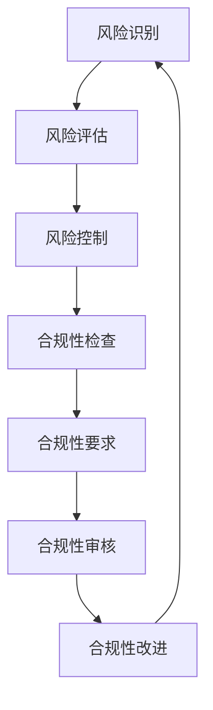

                 

### 文章标题：数学模型在金融科技创新中的应用

#### 关键词：
- 数学模型
- 金融科技
- 智能投顾
- 信用评分
- 算法交易
- 模型评估
- 风险管理

#### 摘要：
本文深入探讨了数学模型在金融科技创新中的应用。首先，我们介绍了数学模型在金融科技中的重要性及其背景。随后，我们详细讲解了数学模型的基础知识，包括概率模型、时间序列模型和神经网络模型。接着，通过具体案例分析，展示了数学模型在智能投顾、信用评分和算法交易等领域的实际应用。随后，我们讨论了算法实现与优化、模型评估与优化方法。最后，探讨了金融科技创新中的风险管理与合规性，并展望了未来的发展趋势。本文旨在为金融科技从业者和研究人员提供有价值的参考。

---

### 引言

#### 数学模型在金融科技创新中的应用背景

在过去的几十年里，金融科技（FinTech）的快速发展已经深刻地改变了金融行业的面貌。从移动支付、在线借贷、区块链技术到人工智能驱动的智能投顾，金融科技的应用无处不在。这一变革不仅提高了金融服务的效率和便捷性，也带来了新的挑战和机遇。其中，数学模型作为金融科技的核心工具，发挥了至关重要的作用。

数学模型在金融科技中的应用具有深远的意义。首先，数学模型能够帮助我们更好地理解和分析金融市场中的复杂关系，从而提供更准确的预测和决策支持。其次，数学模型提供了标准化的方法来评估和管理金融风险，使得金融机构能够更有效地控制风险，提高运营效率。此外，数学模型还在金融产品设计、算法交易、信用评分等多个领域得到了广泛应用，为金融科技创新提供了强有力的技术支持。

本文旨在深入探讨数学模型在金融科技创新中的应用，分析其重要性，介绍基本概念和类型，并通过具体案例展示其实际应用。同时，我们将探讨数学模型在实现与优化、评估与优化过程中的方法，以及金融科技创新中的风险管理与合规性问题。最后，我们将对未来的发展趋势进行展望，为金融科技从业者和研究人员提供有价值的参考。

#### 数学模型在金融科技创新中的重要性

数学模型在金融科技创新中的重要性不可忽视。首先，数学模型提供了对金融市场复杂现象的定量分析和理解能力。通过建立数学模型，我们可以将金融市场中的各种变量和关系量化，从而更准确地预测市场走势、评估金融产品的风险和收益。例如，在股票市场中，时间序列模型和随机漫步模型可以帮助我们分析股价的波动规律，为投资决策提供依据。

其次，数学模型在金融风险管理中起到了关键作用。金融行业面临的风险种类繁多，包括市场风险、信用风险、操作风险等。通过构建数学模型，我们可以对各种风险进行量化评估，制定相应的风险控制策略。例如，VaR（Value at Risk）模型和CVaR（Conditional Value at Risk）模型是常用的市场风险量化工具，能够帮助金融机构确定在特定置信水平下的潜在损失，从而制定有效的风险控制措施。

此外，数学模型在金融产品设计中也具有重要作用。金融产品的设计需要考虑多种因素，包括风险、收益、流动性等。通过构建数学模型，我们可以优化金融产品的设计，提高其市场竞争力。例如，在保险产品设计过程中，概率模型和损失分布模型可以帮助保险公司确定合理的保险费率，确保公司的收益和风险平衡。

最后，数学模型在算法交易和智能投顾等领域也有着广泛应用。算法交易通过建立数学模型，自动化执行交易策略，实现高频率、低风险的交易。智能投顾则利用数学模型和机器学习算法，为投资者提供个性化的投资建议，提高投资收益。这些应用不仅提高了金融市场的效率，也为普通投资者带来了更多的机会。

总之，数学模型在金融科技创新中的应用具有广泛而深远的影响。它不仅提高了金融服务的效率和准确性，也为金融风险管理、产品设计、投资策略提供了强有力的技术支持。随着金融科技的不断发展，数学模型在金融领域的重要性将越来越突出。

### 数学模型基础

#### 数学模型的概念与类型

数学模型是指用数学语言描述现实世界中的某个系统或问题的数学结构，以便通过数学方法进行分析和求解。数学模型通常包括变量、参数、方程和约束条件等组成部分。其核心思想是通过建立数学模型来模拟现实问题，从而提供定量分析和预测能力。

根据应用领域和特性，数学模型可以分为多种类型。以下是几种常见的数学模型类型：

1. **概率模型**：概率模型用于描述随机事件及其概率分布。常见的概率模型包括贝叶斯模型、马尔可夫模型和泊松模型。贝叶斯模型通过贝叶斯定理描述后验概率分布，适用于不确定性推理和决策。马尔可夫模型则描述随机过程的状态转移概率，适用于时间序列分析和状态预测。泊松模型用于描述事件发生的概率分布，适用于事件计数和风险评估。

2. **时间序列模型**：时间序列模型用于描述随时间变化的数据序列。常见的模型包括自回归模型（AR）、移动平均模型（MA）、自回归移动平均模型（ARIMA）和向量自回归模型（VAR）。这些模型通过分析时间序列数据中的趋势、周期性和随机性，用于预测未来值和识别数据中的异常。

3. **神经网络模型**：神经网络模型是基于生物学中的神经网络原理设计的数学模型，通过模拟人脑神经元之间的连接和活动，实现数据分析和预测。常见的神经网络模型包括多层感知机（MLP）、卷积神经网络（CNN）和循环神经网络（RNN）。神经网络模型在图像识别、语音识别和自然语言处理等领域有广泛应用。

4. **优化模型**：优化模型用于求解优化问题，即找到在一定约束条件下使目标函数达到最大值或最小值的解。常见的优化模型包括线性规划、非线性规划和整数规划。优化模型在金融产品设计、资源分配和风险管理等领域有广泛应用。

#### 常用数学模型介绍

1. **贝叶斯模型**

贝叶斯模型是基于贝叶斯定理构建的概率模型，用于描述不确定性的推理和决策。贝叶斯定理公式如下：

$$
P(A|B) = \frac{P(B|A) \cdot P(A)}{P(B)}
$$

其中，\(P(A|B)\) 表示在事件B发生条件下事件A发生的概率，\(P(B|A)\) 表示在事件A发生条件下事件B发生的概率，\(P(A)\) 和 \(P(B)\) 分别表示事件A和事件B的先验概率。

贝叶斯模型在金融科技中的应用包括信用评分、风险管理和智能投顾。例如，在信用评分中，通过分析借款人的历史数据，使用贝叶斯模型计算其违约概率，为金融机构提供信用评估依据。

2. **时间序列模型**

时间序列模型用于分析随时间变化的数据序列，常见的模型包括ARIMA模型和VAR模型。

ARIMA（自回归积分滑动平均模型）模型由三个部分组成：自回归部分（AR）、差分部分（I）和移动平均部分（MA）。ARIMA模型公式如下：

$$
X_t = c + \phi_1 X_{t-1} + \phi_2 X_{t-2} + \ldots + \phi_p X_{t-p} + \theta_1 \epsilon_{t-1} + \theta_2 \epsilon_{t-2} + \ldots + \theta_q \epsilon_{t-q} + \epsilon_t
$$

其中，\(X_t\) 表示时间序列的当前值，\(\epsilon_t\) 表示随机误差项。

ARIMA模型在金融科技中的应用包括股票价格预测、利率预测和通货膨胀预测。通过建立ARIMA模型，可以分析时间序列数据中的趋势和周期性，预测未来值。

3. **神经网络模型**

神经网络模型通过模拟人脑神经元之间的连接和活动，实现数据分析和预测。常见的神经网络模型包括多层感知机（MLP）、卷积神经网络（CNN）和循环神经网络（RNN）。

多层感知机（MLP）是一种前馈神经网络，由输入层、隐藏层和输出层组成。MLP模型通过多层非线性变换，实现数据的非线性建模。MLP模型在金融科技中的应用包括股票价格预测、信用评分和风险管理。

卷积神经网络（CNN）是一种专门用于处理图像数据的神经网络模型，通过卷积运算和池化操作，实现图像特征的提取和分类。CNN模型在金融科技中的应用包括图像识别、图像分类和图像生成。

循环神经网络（RNN）是一种处理序列数据的神经网络模型，通过循环连接和隐藏状态，实现序列数据的建模和预测。RNN模型在金融科技中的应用包括时间序列预测、文本分类和语音识别。

#### 数学模型的核心概念原理之间的关系架构

为了更好地理解数学模型的核心概念和原理，我们可以使用Mermaid流程图来展示它们之间的关系。以下是几个常见的数学模型及其核心概念的关系架构：

```mermaid
graph TD
A[概率模型] --> B[贝叶斯模型]
A --> C[时间序列模型]
A --> D[神经网络模型]
B --> E[贝叶斯定理]
C --> F[ARIMA模型]
C --> G[VAR模型]
D --> H[多层感知机(MLP)]
D --> I[卷积神经网络(CNN)]
D --> J[循环神经网络(RNN)]
```

通过这个流程图，我们可以清晰地看到不同类型的数学模型及其核心概念之间的关系。概率模型包括贝叶斯模型，时间序列模型包括ARIMA模型和VAR模型，神经网络模型包括多层感知机、卷积神经网络和循环神经网络。这些模型在不同领域和任务中有着广泛的应用。

### 金融科技创新案例

#### 案例一：智能投顾

智能投顾（Robo-Advisor）是一种基于数学模型的自动化投资服务，通过分析投资者的风险偏好和财务目标，提供个性化的投资建议。智能投顾的核心在于构建一个有效的资产配置模型，使得投资组合能够最大化收益同时控制风险。

**模型构建**：

智能投顾的模型构建通常包括以下几个步骤：

1. **数据收集与处理**：收集投资者的财务数据、风险偏好、投资目标和市场数据。对数据进行分析和处理，提取关键特征。

2. **风险评估**：使用概率模型和风险评估方法，评估投资者的风险承受能力。常用的方法包括VaR和CVaR模型。

3. **资产配置**：根据投资者的风险偏好和财务目标，构建资产配置模型。常见的资产配置策略包括均值方差模型、资本资产定价模型（CAPM）和Black-Litterman模型。

4. **模型优化**：通过优化方法，调整资产配置策略，使得投资组合的风险和收益达到最佳平衡。常用的优化方法包括线性规划和遗传算法。

**数据处理与模型训练**：

数据处理是智能投顾模型构建的重要环节。以下是一个简化的数据处理和模型训练的伪代码：

```python
# 数据预处理
data = preprocess_data(input_data)
X = data[:, :-1]
y = data[:, -1]

# 划分训练集和测试集
X_train, X_test, y_train, y_test = train_test_split(X, y, test_size=0.2)

# 模型训练
model = train_model(X_train, y_train)

# 模型评估
evaluate_model(model, X_test, y_test)
```

**风险评估与组合优化**：

在智能投顾模型中，风险评估和组合优化是关键步骤。以下是一个简化的风险评估和组合优化的伪代码：

```python
# 风险评估
risk评估 = calculate_risk(model, X_test)

# 组合优化
optimal_portfolio = optimize_portfolio(risk评估, target_return)
```

通过上述模型和算法，智能投顾能够为投资者提供个性化的投资建议，提高投资收益。以下是一个简单的应用案例：

**案例**：

张先生是一位风险偏好较低的投资者，他的财务目标是退休后每年有稳定的收入。智能投顾通过分析张先生的数据，构建了一个资产配置模型，建议他将资金分配到股票、债券和现金等不同类型的资产中。通过组合优化，智能投顾确定了最佳的投资组合，使得张先生能够实现其财务目标。

**项目小结**：

智能投顾是一种基于数学模型的自动化投资服务，通过数据收集、风险评估、资产配置和组合优化，为投资者提供个性化的投资建议。智能投顾的应用不仅提高了投资效率，也为普通投资者带来了更多的机会。然而，智能投顾仍面临一些挑战，如数据质量、模型准确性和风险管理等。未来的研究可以进一步优化智能投顾模型，提高其性能和可靠性。

### 案例二：信用评分

信用评分（Credit Scoring）是金融机构在发放贷款或信用卡时，通过评估借款人的信用风险，预测其违约概率的过程。信用评分模型在金融科技创新中具有重要的应用，能够帮助金融机构降低违约风险，提高信贷审批效率。

**模型构建**：

信用评分模型的构建通常包括以下几个步骤：

1. **数据收集**：收集借款人的历史信用数据，包括贷款记录、还款情况、信用额度、逾期记录等。

2. **特征工程**：对收集的数据进行清洗和预处理，提取关键特征。常见的特征包括年龄、收入、婚姻状况、职业、贷款金额、还款期限等。

3. **模型选择**：选择合适的模型进行训练和评估。常见的信用评分模型包括逻辑回归、决策树、随机森林和梯度提升机等。

4. **模型训练**：使用训练数据对模型进行训练，调整模型参数，优化模型性能。

5. **模型评估**：使用测试数据评估模型的性能，包括准确率、召回率、F1分数等指标。

**数据处理与模型训练**：

数据处理和模型训练是信用评分模型构建的核心。以下是一个简化的数据处理和模型训练的伪代码：

```python
# 数据预处理
data = preprocess_data(input_data)
X = data[:, :-1]
y = data[:, -1]

# 划分训练集和测试集
X_train, X_test, y_train, y_test = train_test_split(X, y, test_size=0.2)

# 模型训练
model = train_model(X_train, y_train)

# 模型评估
evaluate_model(model, X_test, y_test)
```

**模型评估与优化**：

在信用评分模型中，模型评估和优化是关键步骤。以下是一个简化的模型评估和优化的伪代码：

```python
# 模型评估
evaluation_results = evaluate_model(model, X_test, y_test)

# 模型优化
optimized_model = optimize_model(model, evaluation_results)
```

**应用案例**：

李先生向某银行申请信用卡，银行通过信用评分模型对其信用风险进行评估。根据评估结果，银行决定给予李先生一定的信用额度。通过信用评分模型，银行能够快速、准确地评估借款人的信用风险，提高信贷审批效率。

**项目小结**：

信用评分模型是一种用于评估借款人信用风险的数学模型，通过数据收集、特征工程、模型选择、模型训练和评估等步骤，为金融机构提供信用评估依据。信用评分模型在金融科技创新中具有重要的应用，有助于降低违约风险，提高信贷审批效率。然而，信用评分模型仍面临一些挑战，如数据质量、特征选择和模型优化等。未来的研究可以进一步优化信用评分模型，提高其性能和可靠性。

### 案例三：算法交易

算法交易（Algorithmic Trading）是一种通过计算机程序自动化执行交易策略的投资方式。算法交易利用数学模型和统计分析方法，捕捉市场中的价格波动和交易机会，实现高频交易和量化投资。

**模型构建**：

算法交易的模型构建通常包括以下几个步骤：

1. **数据收集**：收集市场数据，包括股票价格、交易量、市场指数等。

2. **特征工程**：对市场数据进行预处理和特征提取，构建交易信号。常见的特征包括价格趋势、波动率、交易量、技术指标等。

3. **模型选择**：选择合适的模型进行训练和评估。常见的模型包括时间序列模型、统计模型和机器学习模型。

4. **模型训练**：使用训练数据对模型进行训练，调整模型参数，优化模型性能。

5. **模型评估**：使用测试数据评估模型的性能，包括交易盈亏、交易频率等指标。

**数据处理与模型训练**：

数据处理和模型训练是算法交易模型构建的核心。以下是一个简化的数据处理和模型训练的伪代码：

```python
# 数据预处理
data = preprocess_data(input_data)
X = data[:, :-1]
y = data[:, -1]

# 划分训练集和测试集
X_train, X_test, y_train, y_test = train_test_split(X, y, test_size=0.2)

# 模型训练
model = train_model(X_train, y_train)

# 模型评估
evaluate_model(model, X_test, y_test)
```

**策略设计**：

在算法交易中，策略设计是关键步骤。以下是一个简化的策略设计伪代码：

```python
# 策略设计
signal = generate_signal(model, X_test)

# 交易决策
trade_decision = make_trade_decision(signal)
```

**风险控制**：

算法交易中的风险控制是保障交易策略稳健运行的重要环节。以下是一个简化的风险控制伪代码：

```python
# 风险评估
risk评估 = calculate_risk(model, X_test)

# 风险控制
risk_control = apply_risk_control(risk评估)
```

**应用案例**：

王先生是一名量化投资者，他使用算法交易策略在股票市场中进行高频交易。通过分析市场数据，王先生构建了一个基于技术指标的交易模型，并制定了相应的风险控制策略。在执行交易策略的过程中，王先生实现了稳定的收益，提高了投资回报率。

**项目小结**：

算法交易是一种通过计算机程序自动化执行交易策略的投资方式，通过数据收集、特征工程、模型选择、模型训练和评估等步骤，实现高频交易和量化投资。算法交易在金融科技创新中具有重要的应用，有助于提高交易效率和投资回报率。然而，算法交易仍面临一些挑战，如数据质量、模型选择和风险控制等。未来的研究可以进一步优化算法交易模型，提高其性能和可靠性。

### 算法实现与优化

#### 算法介绍

算法实现与优化是数学模型在金融科技创新中至关重要的一环。在金融科技应用中，我们通常需要处理大量的数据，并设计高效的算法来分析、预测和决策。以下是一些常用的算法及其在金融科技中的应用场景：

1. **线性回归**：线性回归是一种简单的统计模型，用于分析变量之间的关系。在金融科技中，线性回归可以用于预测股票价格、评估信用评分等。

2. **逻辑回归**：逻辑回归是一种广义线性模型，用于分类问题。在金融科技中，逻辑回归可以用于信用评分、欺诈检测等。

3. **决策树**：决策树是一种基于树形结构的分类模型，通过一系列规则进行决策。在金融科技中，决策树可以用于风险评估、客户细分等。

4. **随机森林**：随机森林是一种基于决策树的集成模型，通过随机选取特征和样本子集构建多个决策树，并取平均预测结果。在金融科技中，随机森林可以用于风险评估、股票预测等。

5. **梯度提升机**：梯度提升机是一种基于损失函数优化的集成模型，通过迭代更新模型参数，提高预测精度。在金融科技中，梯度提升机可以用于风险评估、算法交易等。

6. **支持向量机**：支持向量机是一种基于优化理论的分类模型，通过找到最佳分割超平面来分类数据。在金融科技中，支持向量机可以用于信用评分、图像识别等。

7. **神经网络**：神经网络是一种模拟人脑神经元之间连接和活动的模型，通过多层非线性变换进行数据分析和预测。在金融科技中，神经网络可以用于股票预测、自然语言处理等。

#### 算法优化方法

算法优化是提高模型性能和计算效率的重要手段。以下是一些常用的算法优化方法：

1. **特征工程**：特征工程是算法优化的第一步，通过提取和构造有用的特征，提高模型的预测能力。常用的特征工程方法包括特征选择、特征转换和特征组合等。

2. **模型调参**：模型调参是通过调整模型参数，优化模型性能的过程。常用的调参方法包括网格搜索、贝叶斯优化和随机搜索等。

3. **正则化**：正则化是一种防止模型过拟合的方法，通过在损失函数中加入正则项，限制模型参数的增长。常用的正则化方法包括L1正则化、L2正则化和Dropout等。

4. **集成学习**：集成学习是一种通过组合多个模型来提高预测性能的方法。常用的集成学习方法包括Bagging、Boosting和Stacking等。

5. **分布式计算**：分布式计算是一种利用多台计算机共同完成计算任务的方法，可以显著提高计算效率。常用的分布式计算框架包括Hadoop、Spark和TensorFlow等。

6. **优化算法**：优化算法是用于求解优化问题的算法，可以帮助我们找到最优解或近似最优解。常用的优化算法包括梯度下降、随机梯度下降和牛顿法等。

#### 代码示例

以下是一个使用Python和scikit-learn库实现线性回归模型的简单示例：

```python
import numpy as np
import matplotlib.pyplot as plt
from sklearn.linear_model import LinearRegression

# 生成数据
X = np.random.rand(100, 1)
y = 2 + 3 * X + np.random.randn(100, 1)

# 创建线性回归模型
model = LinearRegression()

# 训练模型
model.fit(X, y)

# 预测
X_new = np.array([[0], [1]])
y_pred = model.predict(X_new)

# 绘图
plt.scatter(X, y)
plt.plot(X_new, y_pred, color='red')
plt.show()
```

通过这个示例，我们可以看到线性回归模型如何通过拟合数据，生成预测结果，并使用matplotlib进行可视化。

### 模型评估与优化

#### 模型评估指标

模型评估是确保数学模型在金融科技创新中有效性的关键步骤。评估模型性能的指标有多种，以下是一些常用的评估指标：

1. **准确率（Accuracy）**：准确率是指模型正确预测的样本数占总样本数的比例。其计算公式为：

   $$
   \text{Accuracy} = \frac{\text{正确预测的样本数}}{\text{总样本数}}
   $$

   准确率在二分类任务中非常常用，但在类别不平衡的情况下可能不够准确。

2. **精确率（Precision）**：精确率是指预测为正类的样本中实际为正类的比例。其计算公式为：

   $$
   \text{Precision} = \frac{\text{真正例}}{\text{真正例} + \text{假正例}}
   $$

   精确率关注的是预测结果的准确性。

3. **召回率（Recall）**：召回率是指实际为正类的样本中被预测为正类的比例。其计算公式为：

   $$
   \text{Recall} = \frac{\text{真正例}}{\text{真正例} + \text{假反例}}
   $$

   召回率关注的是预测结果的完整性。

4. **F1分数（F1 Score）**：F1分数是精确率和召回率的调和平均值，用于综合评估模型的性能。其计算公式为：

   $$
   \text{F1 Score} = 2 \times \frac{\text{Precision} \times \text{Recall}}{\text{Precision} + \text{Recall}}
   $$

   F1分数在类别不平衡的情况下尤为有用。

5. **ROC曲线和AUC值（Receiver Operating Characteristic Curve and AUC）**：ROC曲线是通过改变分类阈值得到的真实准确率和假正率之间的曲线。AUC值是ROC曲线下方的面积，用于评估分类器的整体性能。AUC值越接近1，表示模型性能越好。

#### 模型优化方法

模型优化是提高数学模型在金融科技创新中性能的重要手段。以下是一些常用的模型优化方法：

1. **超参数调整**：超参数是模型在训练过程中需要调整的参数，如学习率、正则化强度、树深度等。通过网格搜索、贝叶斯优化等策略，可以找到最优的超参数组合。

2. **特征工程**：特征工程是提高模型性能的关键步骤，通过选择和构造有用的特征，可以显著提升模型的预测能力。常用的特征工程方法包括特征选择、特征转换和特征组合等。

3. **正则化**：正则化是一种防止模型过拟合的方法，通过在损失函数中加入正则项，限制模型参数的增长。常用的正则化方法包括L1正则化、L2正则化和Dropout等。

4. **集成学习**：集成学习是一种通过组合多个模型来提高预测性能的方法。常用的集成学习方法包括Bagging、Boosting和Stacking等。

5. **模型集成**：模型集成是结合多个模型的预测结果，生成最终的预测结果。常用的模型集成方法包括简单平均、加权平均和堆叠等。

6. **模型压缩**：模型压缩是通过减少模型参数数量，提高计算效率的方法。常用的模型压缩方法包括知识蒸馏、模型剪枝和量化等。

#### 代码示例

以下是一个使用Python和scikit-learn库进行模型评估和优化的小例子：

```python
from sklearn.model_selection import train_test_split
from sklearn.metrics import accuracy_score, precision_score, recall_score, f1_score, roc_auc_score
from sklearn.linear_model import LogisticRegression
from sklearn.model_selection import GridSearchCV

# 生成数据
X, y = make_classification(n_samples=1000, n_features=20, n_informative=2, n_redundant=10, random_state=42)

# 划分训练集和测试集
X_train, X_test, y_train, y_test = train_test_split(X, y, test_size=0.2, random_state=42)

# 创建逻辑回归模型
model = LogisticRegression()

# 训练模型
model.fit(X_train, y_train)

# 预测
y_pred = model.predict(X_test)

# 评估模型
accuracy = accuracy_score(y_test, y_pred)
precision = precision_score(y_test, y_pred)
recall = recall_score(y_test, y_pred)
f1 = f1_score(y_test, y_pred)
roc_auc = roc_auc_score(y_test, y_pred)

print(f"Accuracy: {accuracy:.4f}")
print(f"Precision: {precision:.4f}")
print(f"Recall: {recall:.4f}")
print(f"F1 Score: {f1:.4f}")
print(f"ROC AUC: {roc_auc:.4f}")

# 模型优化
param_grid = {'C': [0.1, 1, 10], 'penalty': ['l1', 'l2']}
grid_search = GridSearchCV(model, param_grid, cv=5)
grid_search.fit(X_train, y_train)

# 最优模型
best_model = grid_search.best_estimator_

# 评估最优模型
y_pred_opt = best_model.predict(X_test)
accuracy_opt = accuracy_score(y_test, y_pred_opt)
precision_opt = precision_score(y_test, y_pred_opt)
recall_opt = recall_score(y_test, y_pred_opt)
f1_opt = f1_score(y_test, y_pred_opt)
roc_auc_opt = roc_auc_score(y_test, y_pred_opt)

print(f"Optimized Accuracy: {accuracy_opt:.4f}")
print(f"Optimized Precision: {precision_opt:.4f}")
print(f"Optimized Recall: {recall_opt:.4f}")
print(f"Optimized F1 Score: {f1_opt:.4f}")
print(f"Optimized ROC AUC: {roc_auc_opt:.4f}")
```

通过这个例子，我们可以看到如何使用常用的评估指标来评估模型性能，以及如何通过网格搜索进行模型优化。

### 风险管理与合规性

#### 风险管理

在金融科技创新中，风险管理是确保模型应用稳定性和业务可持续性的关键环节。数学模型在风险管理中扮演着至关重要的角色，通过量化和评估风险，帮助金融机构更好地应对市场波动和潜在风险。

**风险管理方法**：

1. **风险评估**：通过建立数学模型，对各种风险进行量化评估。常用的风险评估方法包括VaR（Value at Risk）和CVaR（Conditional Value at Risk）。VaR模型能够估计在特定置信水平下，某时间段内的最大可能损失。CVaR模型则进一步考虑了极端情况下的损失分布，提供了更全面的评估。

2. **风险控制**：通过设定风险限额、制定风险管理策略，对风险进行控制。风险控制措施包括风险隔离、风险分散、风险转移等。例如，金融机构可以通过多样化的投资组合来分散市场风险，通过购买保险来转移信用风险。

3. **风险监测**：实时监控风险指标的变动，及时发现并应对潜在风险。通过构建动态监控系统，金融机构可以实时获取市场数据，快速识别风险信号，并采取相应的措施。

**案例**：

某银行在实施智能投顾服务时，通过构建风险模型，对客户的投资组合进行实时监控。该模型结合了历史市场数据、客户风险偏好和投资目标，评估了投资组合的VaR和CVaR。通过设置风险限额，银行能够确保投资组合在承受范围内运行，并在市场波动时及时调整策略，降低风险。

#### 合规性要求

合规性是金融科技创新中的重要一环，涉及到法律法规、行业标准和社会责任等多个方面。在应用数学模型的过程中，确保合规性是金融机构和科技企业必须遵守的基本原则。

**合规性原则**：

1. **遵守法律法规**：在设计和应用数学模型时，必须遵守相关法律法规，如《反洗钱法》、《证券法》等。这包括数据收集、处理和使用过程中的合规要求。

2. **遵循行业标准**：遵循金融行业的标准和规范，如《金融科技伦理准则》和《金融科技风险管理规范》等。这些标准为金融科技创新提供了行为指南和合规框架。

3. **社会责任**：在应用数学模型时，考虑社会责任和道德规范，确保技术应用的公平性和透明性。例如，在信用评分和风险控制中，避免歧视性做法，保护个人隐私。

**合规性检查**：

1. **内部审计**：金融机构和科技企业应定期进行内部审计，检查数学模型的应用是否符合法律法规和行业标准。内部审计可以识别潜在的风险和合规性问题，并提出改进措施。

2. **外部审查**：接受外部审计机构的审查，确保数学模型的应用符合相关法规和标准。外部审查可以提供独立的评估，增强公众对金融科技创新的信任。

**案例**：

某金融科技公司在开发智能投顾平台时，进行了全面的合规性检查。公司邀请了专业的第三方审计机构对数据收集、处理和使用过程进行审查，确保符合《反洗钱法》和《个人信息保护法》的要求。同时，公司还制定了详细的合规性手册，培训员工遵守相关法律法规和行业标准。

#### 风险管理与合规性之间的关系

风险管理与合规性在金融科技创新中相辅相成。风险管理确保了模型的稳定性和业务可持续性，而合规性则保障了模型的应用符合法律法规和社会责任。以下是一个简化的流程图，展示了风险管理与合规性之间的关系：



通过这个流程图，我们可以看到风险管理过程与合规性检查的紧密联系。风险管理为合规性提供了数据支持和分析依据，而合规性则确保风险管理措施符合法律法规和社会责任。两者的有机结合，保障了金融科技创新的稳健发展。

### 未来展望

#### 研究方向与趋势

随着金融科技的不断发展，数学模型在金融领域的应用前景广阔。以下是几个可能的研究方向与趋势：

1. **深度学习模型**：深度学习模型在图像识别、语音识别和自然语言处理等领域取得了显著成果。未来，深度学习模型有望在金融科技中发挥更大作用，如用于股票市场预测、交易策略优化和风险管理等。

2. **区块链技术**：区块链技术具有去中心化、透明性和不可篡改等特点，与数学模型相结合，可以实现更安全、高效的金融交易和风险管理。未来，区块链技术将在金融科技中发挥关键作用，推动金融行业变革。

3. **大数据分析**：大数据分析是金融科技的重要驱动力。通过挖掘和分析大量金融数据，可以更准确地预测市场走势、评估风险和优化投资策略。未来，大数据分析将在金融科技中发挥更大作用，提升金融服务质量和效率。

4. **隐私保护**：在金融科技创新中，数据隐私保护是一个重要问题。未来，研究将集中在开发隐私保护算法和模型，确保在数据分析和应用过程中保护用户隐私。

5. **智能合约**：智能合约是基于区块链技术的一种自动执行合约。通过将数学模型嵌入智能合约，可以实现自动化的金融交易和风险管理，提高交易效率和安全性。

#### 挑战与机遇

尽管数学模型在金融科技创新中具有广泛的应用前景，但仍面临一些挑战：

1. **数据质量**：金融数据的质量直接影响数学模型的性能。未来，研究将集中在数据清洗、预处理和特征提取等方面，提高数据质量，从而提升模型性能。

2. **模型解释性**：深度学习等复杂模型在金融科技中的应用日益增多，但其解释性较差，难以理解模型决策过程。未来，研究将集中在开发可解释性强的模型，提高模型的可解释性。

3. **法律法规**：金融科技的发展需要遵循相关法律法规。未来，法律法规将不断更新和完善，以适应金融科技的发展需求。

4. **技术复杂性**：数学模型的应用涉及多个技术领域，包括数据科学、计算机科学和金融学等。未来，跨学科合作将成为重要趋势，以应对技术复杂性。

总之，未来金融科技创新将面临诸多挑战，但也充满机遇。通过不断探索和研究，数学模型在金融科技中的应用将更加深入和广泛，推动金融行业的变革和发展。

### 总结

本文深入探讨了数学模型在金融科技创新中的应用。首先，我们介绍了数学模型在金融科技中的重要性，分析了其在金融风险管理、产品设计、投资策略等方面的应用。随后，我们详细讲解了数学模型的基础知识，包括概率模型、时间序列模型和神经网络模型。接着，通过具体案例展示了数学模型在智能投顾、信用评分和算法交易等领域的实际应用。随后，我们讨论了算法实现与优化、模型评估与优化方法，以及金融科技创新中的风险管理与合规性。最后，我们对未来的发展趋势进行了展望，提出了研究方向和挑战。

本文旨在为金融科技从业者和研究人员提供有价值的参考。通过深入了解数学模型在金融科技创新中的应用，读者可以更好地把握行业发展趋势，为实际业务提供有力的技术支持。同时，本文也提醒读者关注数据质量、模型解释性和法律法规等挑战，确保金融科技创新的稳健发展。

### 注意事项与拓展阅读

在应用数学模型进行金融科技创新时，以下注意事项和拓展阅读资源将有助于您深入理解和实践：

#### 注意事项：

1. **数据质量**：确保数据来源可靠，数据清洗和预处理是关键。参考书籍《数据清洗：实用指南》（Data Cleaning: Practical Techniques for Munging Data）。

2. **模型解释性**：深度学习和复杂模型可能缺乏解释性。学习可解释性模型，如LIME（Local Interpretable Model-agnostic Explanations），以提升模型透明度。

3. **合规性**：遵守相关法律法规和行业标准，如《反洗钱法》、《个人信息保护法》等。了解金融科技伦理准则，确保技术应用符合社会责任。

4. **模型优化**：不断调优模型参数，避免过拟合。尝试使用网格搜索、贝叶斯优化等策略进行模型调参。

5. **风险管理**：全面评估和监控风险，确保模型稳健运行。学习风险评估方法，如VaR和CVaR，并制定相应的风险控制策略。

#### 拓展阅读：

1. **概率模型**：《概率模型及其应用》（Probabilistic Models for Natural Language Processing）。

2. **时间序列模型**：《时间序列分析：介绍与案例》（Time Series Analysis: Forecasting and Control）。

3. **神经网络模型**：《神经网络与深度学习》（Neural Networks and Deep Learning）。

4. **金融科技伦理**：《金融科技伦理：挑战与展望》（FinTech Ethics: Challenges and Opportunities）。

5. **数据隐私保护**：《数据隐私：概念与技术》（Data Privacy: Concepts and Technologies）。

通过阅读这些资源和遵循注意事项，您将能够更好地理解和应用数学模型，推动金融科技创新的发展。

