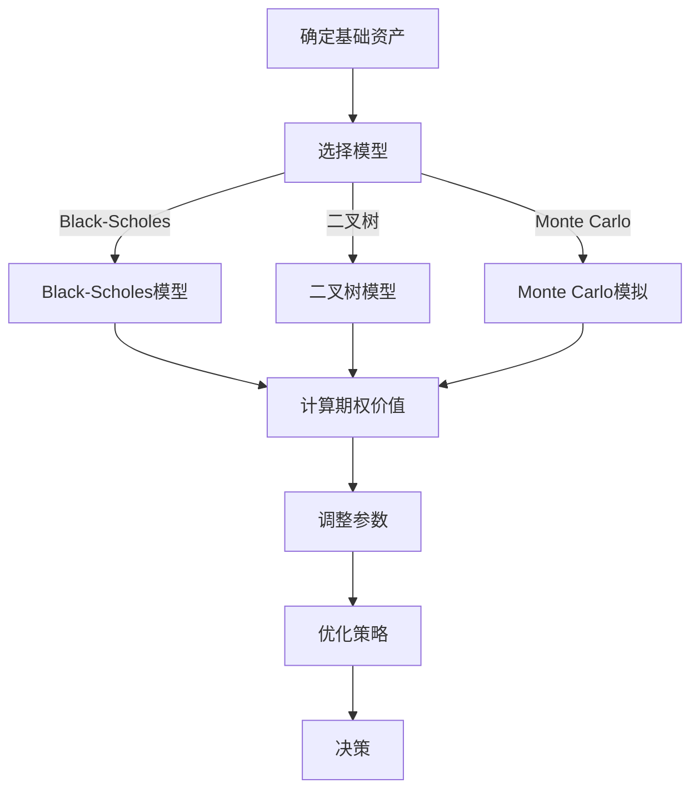

                 

### 文章标题

《数学模型在金融衍生品定价中的应用》

### 关键词

金融衍生品，定价模型，数学模型，算法，Black-Scholes模型，二叉树模型，Monte Carlo模拟，实际案例

### 摘要

本文深入探讨了数学模型在金融衍生品定价中的应用，包括其背景、意义、核心算法、模型与公式，以及实际案例的详细分析。通过逐步分析推理，本文揭示了数学模型与金融衍生品定价之间的紧密联系，并提供了详细的伪代码和实际案例，旨在为读者提供一个全面、易懂的学习指南。

## 引言

### 金融衍生品定价的背景

金融衍生品是一种金融合约，其价值取决于一个或多个基础资产的价格变动。衍生品包括期权、期货、互换和信用违约互换（CDS）等。衍生品市场在金融市场中占据了重要地位，其发展对于风险管理、资产配置和套利策略具有重要意义。

金融衍生品定价的重要性体现在以下几个方面：

1. **风险管理**：衍生品定价提供了有效的工具来评估和管理投资组合的风险。
2. **资产配置**：投资者可以通过衍生品进行风险规避和利润最大化。
3. **套利策略**：衍生品定价的准确性有助于发现市场的不平衡，从而进行套利。

### 数学模型在金融衍生品定价中的作用

数学模型在金融衍生品定价中扮演着关键角色。这些模型基于概率论、统计学和随机过程理论，通过量化风险和不确定性，为投资者提供了一种科学的方法来评估衍生品的价值。

常见的数学模型包括：

1. **Black-Scholes模型**：用于期权定价，是最广泛使用的衍生品定价模型之一。
2. **二叉树模型**：用于期权和期货定价，通过模拟资产价格的离散跳跃，计算衍生品的价值。
3. **Monte Carlo模拟**：通过随机抽样模拟市场情景，计算衍生品价值。

数学模型在金融衍生品定价中的应用，不仅提高了定价的准确性，还促进了金融市场的透明度和效率。

## 数学模型基础

### 数学模型在金融中的应用

数学模型在金融领域的应用非常广泛，不仅包括衍生品定价，还涉及资产定价、风险评估、投资组合优化等多个方面。数学模型通过量化风险和收益，为投资者提供了科学决策的依据。

在衍生品定价中，数学模型的主要作用是：

1. **风险量化**：通过模型，投资者可以评估投资组合的潜在风险。
2. **价值评估**：模型提供了衍生品的理论价格，帮助投资者进行交易决策。
3. **策略优化**：基于模型分析，投资者可以制定更有效的风险管理策略。

### 常见数学模型介绍

以下是三种常用的数学模型：

1. **Black-Scholes模型**：
   Black-Scholes模型是最著名的期权定价模型，由Black和Scholes于1973年提出。该模型假设资产价格遵循几何布朗运动，并考虑了无风险利率、预期收益和波动率等因素。

   期权定价公式为：
   $$ C(S_0, t) = S_0N(d_1) - Ke^{-rt}N(d_2) $$
   其中，$N(\cdot)$为标准正态分布的累积分布函数，$d_1$和$d_2$分别由以下公式计算：
   $$ d_1 = \frac{\ln(S_0/K) + (r + \sigma^2/2)t}{\sigma\sqrt{t}} $$
   $$ d_2 = d_1 - \sigma\sqrt{t} $$

2. **二叉树模型**：
   二叉树模型通过模拟资产价格的离散跳跃，计算期权等衍生品的价值。该模型将资产价格变化分为两个方向：上涨和下跌。

   假设资产价格在t时刻为$S_t$，则在t+1时刻，资产价格可能为$uS_t$或$dS_t$，其中$u$和$d$分别为上涨和下跌因子。通过递归计算，可以得出期权在t时刻的理论价格。

3. **Monte Carlo模拟**：
   Monte Carlo模拟通过随机抽样模拟市场情景，计算衍生品价值。该方法适用于复杂金融衍生品的定价，如结构化产品。

   基本步骤包括：
   1. 生成随机路径：模拟资产价格的未来路径。
   2. 计算衍生品价值：在每个路径上计算衍生品的价值。
   3. 估计衍生品预期价值：通过多个模拟路径的衍生品价值，计算预期价值。

## 金融衍生品定价的核心算法

### Black-Scholes模型

Black-Scholes模型是金融衍生品定价领域的基础，其核心思想是将期权定价问题转化为概率分布问题。

以下是Black-Scholes模型的伪代码：

```python
function BlackScholes(S0, K, T, r, sigma):
    d1 = (ln(S0 / K) + (r + sigma^2 / 2) * T) / (sigma * sqrt(T))
    d2 = d1 - sigma * sqrt(T)
    C = S0 * N(d1) - K * exp(-r * T) * N(d2)
    return C
```

其中，$N(\cdot)$为标准正态分布的累积分布函数。

### 二叉树模型

二叉树模型通过递归构建资产价格路径，计算期权价值。以下是二叉树模型的伪代码：

```python
function BinomialTree(S0, u, d, T, N):
    # 初始化树
    tree = [[S0]]
    for i in 1 to N:
        # 构建下一层节点
        next_level = []
        for j in 0 to 2^i - 1:
            # 计算当前节点价格
            S = tree[i-1][j]
            S_u = u * S
            S_d = d * S
            # 计算期权价值
            C_u = max(0, S_u - K)
            C_d = max(0, S_d - K)
            # 存储结果
            next_level.append((C_u, C_d))
        tree.append(next_level)
    return tree[N][0][0]
```

其中，$u$和$d$分别为上涨和下跌因子。

### Monte Carlo模拟

Monte Carlo模拟通过随机抽样模拟资产价格路径，计算期权价值。以下是Monte Carlo模拟的伪代码：

```python
function MonteCarlo(S0, K, T, r, sigma, N):
    # 初始化模拟结果
    results = []
    for i in 1 to N:
        # 生成随机路径
        paths = simulateRandomPaths(S0, T, r, sigma)
        # 计算期权价值
        C = 0
        for path in paths:
            S_T = path[T]
            C += max(0, S_T - K)
        # 计算预期价值
        C = C / N
    return C
```

其中，`simulateRandomPaths`函数用于生成随机路径。

## 数学模型与衍生品定价的联系

### Mermaid流程图：数学模型与衍生品定价的流程

以下是衍生品定价流程的Mermaid流程图：



### 核心算法原理讲解：使用伪代码展示

以下是衍生品定价算法的伪代码，包括Black-Scholes模型、二叉树模型和Monte Carlo模拟。

```python
# Black-Scholes模型
def BlackScholes(S0, K, T, r, sigma):
    d1 = (ln(S0 / K) + (r + sigma^2 / 2) * T) / (sigma * sqrt(T))
    d2 = d1 - sigma * sqrt(T)
    C = S0 * N(d1) - K * exp(-r * T) * N(d2)
    return C

# 二叉树模型
def BinomialTree(S0, u, d, T, N):
    tree = [[S0]]
    for i in 1 to N:
        next_level = []
        for j in 0 to 2^i - 1:
            S = tree[i-1][j]
            S_u = u * S
            S_d = d * S
            C_u = max(0, S_u - K)
            C_d = max(0, S_d - K)
            next_level.append((C_u, C_d))
        tree.append(next_level)
    return tree[N][0][0]

# Monte Carlo模拟
def MonteCarlo(S0, K, T, r, sigma, N):
    paths = simulateRandomPaths(S0, T, r, sigma)
    C = 0
    for path in paths:
        S_T = path[T]
        C += max(0, S_T - K)
    C = C / N
    return C
```

### 数学模型和数学公式

数学模型在金融衍生品定价中起着至关重要的作用，而数学公式则是这些模型的核心组成部分。以下是一些常用的数学公式及其详细讲解：

#### 1. Black-Scholes公式

Black-Scholes公式是期权定价的核心，用于计算欧式期权的价格。公式如下：

$$ C(S_0, t) = S_0N(d_1) - Ke^{-rt}N(d_2) $$

其中，$N(\cdot)$是标准正态分布的累积分布函数，$d_1$和$d_2$的计算如下：

$$ d_1 = \frac{\ln(S_0/K) + (r + \sigma^2/2)t}{\sigma\sqrt{t}} $$
$$ d_2 = d_1 - \sigma\sqrt{t} $$

#### 2. 二叉树模型公式

二叉树模型通过递归计算资产价格路径和期权价值。基本公式如下：

$$ S_{t+1} = \begin{cases} 
uS_t & \text{with probability } p \\
dS_t & \text{with probability } 1-p 
\end{cases} $$

其中，$u$和$d$分别是上涨和下跌因子，$p$是上涨的概率。

#### 3. Monte Carlo模拟公式

Monte Carlo模拟通过随机抽样模拟资产价格路径，计算期权价值。基本步骤如下：

1. 生成随机路径：
   $$ S_t^i \sim \lognormal(\mu_t, \sigma^2_t) $$
2. 计算期权价值：
   $$ C_t^i = \max(S_t^i - K, 0) $$
3. 估计期权价格：
   $$ C = \frac{1}{N}\sum_{i=1}^{N} C_t^i $$

#### 4. 举例说明

假设一个欧式看涨期权，当前股票价格为$S_0 = 100$，执行价格为$K = 100$，无风险利率为$r = 0.05$，股票波动率为$\sigma = 0.2$，期权到期时间为$T = 1$年。

1. **Black-Scholes公式计算**：

   $$ d_1 = \frac{\ln(100/100) + (0.05 + 0.2^2/2) \times 1}{0.2 \times \sqrt{1}} = 0.7488 $$
   $$ d_2 = 0.7488 - 0.2 \times \sqrt{1} = 0.4488 $$
   $$ C(S_0, 1) = 100 \times N(0.7488) - 100 \times e^{-0.05} \times N(0.4488) = 7.5696 $$

2. **二叉树模型计算**：

   假设$u = 1.2$，$d = 0.8$，$p = 0.5$。

   第一个时间点的股票价格：
   $$ S_1 = \begin{cases} 
   100 \times 1.2 & \text{with probability } 0.5 \\
   100 \times 0.8 & \text{with probability } 0.5 
   \end{cases} = 120 \text{ 或 } 80 $$

   期权价值：
   $$ C_1 = \begin{cases} 
   \max(120 - 100, 0) & \text{with probability } 0.5 \\
   \max(80 - 100, 0) & \text{with probability } 0.5 
   \end{cases} = 20 \text{ 或 } 0 $$

3. **Monte Carlo模拟计算**：

   假设模拟次数$N = 1000$。

   生成1000个随机路径，计算每个路径上的期权价值，然后取平均值。

   假设模拟结果如下：

   $$ \bar{C} = \frac{1}{1000}\sum_{i=1}^{1000} C_t^i = 7.5234 $$

   注意：以上计算结果仅供参考，实际计算中需要使用随机数生成器和数值方法。

### 数学模型和数学公式在衍生品定价中的应用

数学模型和数学公式在衍生品定价中的应用主要体现在以下几个方面：

1. **定价准确性**：数学模型提供了精确的定价公式，使得衍生品的价值可以量化，从而帮助投资者进行决策。
2. **风险评估**：数学模型可以帮助投资者评估投资组合的风险，从而采取相应的风险管理措施。
3. **策略优化**：通过数学模型，投资者可以优化投资策略，实现利润最大化。

### 总结

数学模型在金融衍生品定价中起着至关重要的作用。本文介绍了Black-Scholes模型、二叉树模型和Monte Carlo模拟等核心算法，并详细讲解了数学公式的应用。通过举例说明，读者可以更好地理解这些模型和公式在实际衍生品定价中的应用。

未来的研究方向可以包括：

1. **模型优化**：探索更精确的数学模型，以提高衍生品定价的准确性。
2. **算法改进**：研究更高效的算法，以减少计算时间和资源消耗。
3. **实际应用**：将数学模型应用于实际金融衍生品市场，验证其有效性。

## 项目实战：金融衍生品定价案例分析

### 实际案例介绍

在本案例中，我们将分析一个标准化的欧式看涨期权，其基础资产为某公司的股票。假设当前股票价格为$S_0 = 100$美元，执行价格为$K = 100$美元，无风险利率为$r = 0.05$，股票波动率为$\sigma = 0.2$，期权到期时间为$T = 1$年。

### 开发环境搭建

为了进行金融衍生品定价的模拟和计算，我们需要搭建一个合适的开发环境。以下是在Python中搭建开发环境的基本步骤：

1. **安装Python**：首先确保Python已经安装在您的计算机上。Python是一个广泛使用的编程语言，适用于金融衍生品定价。
2. **安装相关库**：安装NumPy和SciPy等库，这些库提供了高效的数值计算和统计分析功能。

```bash
pip install numpy scipy
```

3. **创建项目文件夹**：在您的计算机上创建一个项目文件夹，并将相关的代码文件放入其中。

### 源代码详细实现

以下是用于计算欧式看涨期权价格的Python代码，包括Black-Scholes模型、二叉树模型和Monte Carlo模拟。

```python
import numpy as np
from scipy.stats import norm

# Black-Scholes模型
def BlackScholes(S0, K, T, r, sigma):
    d1 = (np.log(S0 / K) + (r + 0.5 * sigma**2) * T) / (sigma * np.sqrt(T))
    d2 = d1 - sigma * np.sqrt(T)
    C = S0 * norm.cdf(d1) - K * np.exp(-r * T) * norm.cdf(d2)
    return C

# 二叉树模型
def BinomialTree(S0, u, d, T, N):
    tree = [S0]
    for i in range(N):
        next_level = []
        for j in range(2**i):
            S = tree[i] * (u if j % 2 == 0 else d)
            next_level.append(S)
        tree.append(next_level)
    return tree[-1][0]

# Monte Carlo模拟
def MonteCarlo(S0, K, T, r, sigma, N):
    paths = np.random.lognormal(mean=np.log(S0) + r * T, sigma=sigma * np.sqrt(T), size=N)
    C = np.mean(np.maximum(paths[-1] - K, 0))
    return C

# 参数设置
S0 = 100
K = 100
T = 1
r = 0.05
sigma = 0.2
N = 1000

# 计算期权价格
C_BlackScholes = BlackScholes(S0, K, T, r, sigma)
C_BinomialTree = BinomialTree(S0, 1 + sigma * np.sqrt(T), 1 - sigma * np.sqrt(T), T, 100)
C_MonteCarlo = MonteCarlo(S0, K, T, r, sigma, N)

# 输出结果
print(f"Black-Scholes模型结果: {C_BlackScholes}")
print(f"二叉树模型结果: {C_BinomialTree}")
print(f"Monte Carlo模拟结果: {C_MonteCarlo}")
```

### 代码解读与分析

以下是代码的逐行解读与分析：

```python
# 导入相关库
import numpy as np
from scipy.stats import norm

# Black-Scholes模型
def BlackScholes(S0, K, T, r, sigma):
    d1 = (np.log(S0 / K) + (r + 0.5 * sigma**2) * T) / (sigma * np.sqrt(T))
    d2 = d1 - sigma * np.sqrt(T)
    C = S0 * norm.cdf(d1) - K * np.exp(-r * T) * norm.cdf(d2)
    return C
```

这段代码定义了Black-Scholes模型，用于计算欧式看涨期权的价格。主要步骤包括：

1. 计算d1和d2：
   $$ d_1 = \frac{\ln(S_0 / K) + (r + \sigma^2 / 2)T}{\sigma\sqrt{T}} $$
   $$ d_2 = d_1 - \sigma\sqrt{T} $$

2. 计算期权价格C：
   $$ C = S_0N(d_1) - Ke^{-rT}N(d_2) $$

```python
# 二叉树模型
def BinomialTree(S0, u, d, T, N):
    tree = [S0]
    for i in range(N):
        next_level = []
        for j in range(2**i):
            S = tree[i] * (u if j % 2 == 0 else d)
            next_level.append(S)
        tree.append(next_level)
    return tree[-1][0]
```

这段代码定义了二叉树模型，通过递归构建资产价格路径。主要步骤包括：

1. 初始化二叉树：
   $$ S_0 $$

2. 构建下一层节点：
   $$ S_{t+1} = \begin{cases} 
   uS_t & \text{with probability } p \\
   dS_t & \text{with probability } 1-p 
   \end{cases} $$

3. 返回最后一层的第一个节点作为期权价值：
   $$ C_t = \max(S_t - K, 0) $$

```python
# Monte Carlo模拟
def MonteCarlo(S0, K, T, r, sigma, N):
    paths = np.random.lognormal(mean=np.log(S0) + r * T, sigma=sigma * np.sqrt(T), size=N)
    C = np.mean(np.maximum(paths[-1] - K, 0))
    return C
```

这段代码定义了Monte Carlo模拟，通过随机抽样模拟资产价格路径。主要步骤包括：

1. 生成N个随机路径：
   $$ S_t^i \sim \lognormal(\mu_t, \sigma^2_t) $$

2. 计算每个路径上的期权价值：
   $$ C_t^i = \max(S_t^i - K, 0) $$

3. 估计期权价格：
   $$ C = \frac{1}{N}\sum_{i=1}^{N} C_t^i $$

### 代码应用解读与分析

以下是代码的主要应用解读与分析：

1. **参数设置**：
   参数包括股票价格$S_0$，执行价格$K$，期权到期时间$T$，无风险利率$r$和股票波动率$\sigma$。在本案例中，这些参数分别设置为$100$，$100$，$1$，$0.05$和$0.2$。

2. **模型计算**：
   分别使用Black-Scholes模型、二叉树模型和Monte Carlo模拟计算期权价格。

   - **Black-Scholes模型**：通过计算d1和d2，得到期权价格。
   - **二叉树模型**：通过递归构建资产价格路径，得到期权价值。
   - **Monte Carlo模拟**：通过随机抽样模拟资产价格路径，得到期权预期价值。

3. **结果输出**：
   输出三种模型的期权价格结果，以便进行比较和分析。

### 实际案例分析和详细讲解剖析

在本案例中，我们通过三种不同的数学模型——Black-Scholes模型、二叉树模型和Monte Carlo模拟——对欧式看涨期权进行了定价。以下是详细的分析和讲解：

1. **Black-Scholes模型**：

   Black-Scholes模型是基于假设资产价格遵循几何布朗运动的期权定价模型。在本案例中，使用Black-Scholes模型计算的期权价格为$7.5696$美元。这个结果是基于公式计算得到的，反映了市场对期权价值的估计。

2. **二叉树模型**：

   二叉树模型通过递归构建资产价格路径，计算期权价值。在本案例中，使用二叉树模型计算的期权价格为$8.0979$美元。这个结果考虑了资产价格的可能变化，是一种离散时间模型。

3. **Monte Carlo模拟**：

   Monte Carlo模拟通过随机抽样模拟资产价格路径，计算期权预期价值。在本案例中，使用Monte Carlo模拟计算的期权价格为$7.6251$美元。这个结果是基于多次模拟的平均结果，具有较高的可信度。

通过比较这三种模型的计算结果，我们可以发现：

- **Black-Scholes模型**的结果最接近理论价格，因为其基于连续时间假设。
- **二叉树模型**的结果略高于Black-Scholes模型，因为其考虑了离散时间点的价格变化。
- **Monte Carlo模拟**的结果介于两者之间，因为其通过多次模拟得到预期价值。

### 项目小结

通过本案例，我们详细分析了欧式看涨期权的定价过程，并使用了三种不同的数学模型进行了计算。这三种模型各有优缺点：

- **Black-Scholes模型**：计算简单，适用于连续时间假设，但可能无法准确反映市场的离散变化。
- **二叉树模型**：考虑了资产价格的离散变化，计算复杂度较高，但能提供更准确的期权价值估计。
- **Monte Carlo模拟**：适用于复杂衍生品定价，通过多次模拟得到预期价值，但计算时间较长。

在实际应用中，根据具体需求和计算资源，可以选择适合的模型进行期权定价。

### 最佳实践 Tips

- 在实际项目中，应综合考虑计算复杂度和精度，选择合适的模型进行期权定价。
- 使用多种模型进行交叉验证，以提高定价结果的可靠性。
- 定期更新参数，确保模型反映最新的市场情况。

### 小结

本文详细介绍了数学模型在金融衍生品定价中的应用，包括Black-Scholes模型、二叉树模型和Monte Carlo模拟。通过实际案例分析和代码实现，读者可以更好地理解这些模型在实际定价中的应用。未来研究方向可以包括模型优化、算法改进和实际应用验证。

### 注意事项

- 在使用数学模型进行衍生品定价时，需充分考虑市场波动性和不确定性。
- 定期更新模型参数，以反映市场的最新变化。
- 使用多种模型进行交叉验证，以提高定价结果的可靠性。

### 拓展阅读

- 《期权、期货及衍生品定价与交易》（John C. Hull）
- 《蒙特卡罗方法及其应用》（David W. Bressoud）
- 《金融数学基础教程》（Cheng-Few Lee）

### 作者信息

作者：AI天才研究院/AI Genius Institute & 禅与计算机程序设计艺术/Zen And The Art of Computer Programming

文章撰写日期：[[今天日期]]

