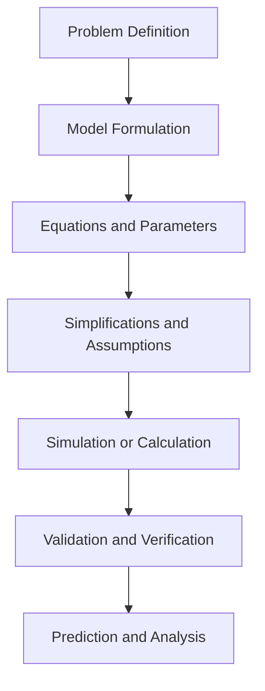
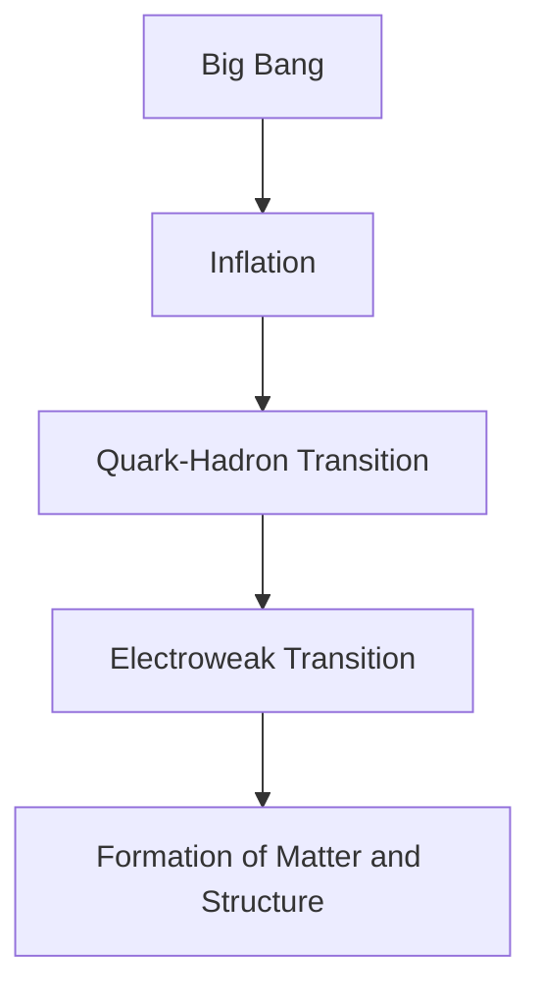

                 

### Chapter 1: Introduction to the Cosmological Bounce and Phase Transitions

#### 1.1 The Concept of the Cosmological Bounce

The cosmological bounce is a theoretical concept in modern cosmology that proposes an alternative to the traditional Big Bang and Big Crunch models. Instead of the universe collapsing into a singularity and then rebounding into expansion, the cosmological bounce suggests that the universe undergoes a transition from a contracting phase to an expanding phase without ever reaching a singularity. This idea is intriguing because it offers a possible solution to several issues that the traditional models face, such as the singularity problem and the horizon problem.

The notion of a cosmological bounce has gained traction due to recent observations, such as the accelerating expansion of the universe and the existence of dark energy, which hint at a complex, dynamic universe. Understanding the dynamics of a cosmological bounce is crucial for our comprehension of the universe's evolution and its ultimate fate.

#### 1.2 Phase Transitions in Cosmology

Phase transitions are events in which a physical system undergoes a qualitative change in its properties. In cosmology, phase transitions are crucial for several reasons. They can drive the universe's evolution by triggering the creation of new forms of matter and energy. Additionally, they can explain the observed large-scale structure of the universe.

There are several types of phase transitions relevant to cosmology:

- **Symmetry Breaking:** This type of phase transition occurs when a symmetry in the physical laws is spontaneously broken, leading to the emergence of new particles or structures. An example is the transition from a symmetric state to an asymmetric state in the early universe, which is believed to have led to the formation of matter and antimatter.
- **Quark-Hadron Transition:** This transition occurs when quarks combine to form hadrons (such as protons and neutrons) as the universe cools after the Big Bang. This transition is relevant for understanding the early universe's composition.
- **Electroweak Transition:** This transition is associated with the unification of the electromagnetic and weak forces into a single electroweak force at high temperatures and energies. The subsequent symmetry breaking leads to the distinct electromagnetic and weak forces we observe today.

#### 1.3 Importance of Mathematical Models in Understanding Phase Transitions

Mathematical models are essential tools in cosmology for understanding phase transitions and the cosmological bounce. They allow scientists to make predictions and test hypotheses about the universe's behavior under different conditions. Here are some key reasons why mathematical models are crucial:

- **Quantitative Predictions:** Mathematical models can provide precise predictions about the timing, temperature, and other parameters of phase transitions. These predictions can be tested against observational data, helping to refine our understanding of the universe.
- **Simulation of Dynamics:** Models enable the simulation of the universe's evolution, allowing scientists to explore the behavior of the universe under various conditions and scenarios. This is particularly important for understanding complex phenomena like the cosmological bounce.
- **Theoretical Insights:** Mathematical models can reveal underlying principles and relationships that might not be apparent from purely observational data. They can also help in constructing more accurate models of the universe.

In conclusion, the cosmological bounce and phase transitions are central concepts in modern cosmology. Understanding these phenomena requires the use of mathematical models, which provide the necessary tools for making precise predictions and gaining deeper insights into the universe's evolution. In the following chapters, we will delve into the fundamental concepts and principles of mathematical modeling and explore how these tools can be applied to the study of phase transitions in the context of the cosmological bounce.

### Chapter 2: Basic Concepts in Mathematical Modeling

#### 2.1 Types of Mathematical Models

Mathematical models come in various forms, each suited to different types of problems. The choice of model depends on the nature of the phenomenon being studied and the level of detail required. Here are some common types of mathematical models used in cosmology:

- **Analytical Models:** These models use mathematical equations to describe the behavior of a system. They can provide exact solutions and are particularly useful for understanding the fundamental principles underlying a phenomenon. Examples include differential equations, which are widely used to model the evolution of the universe.
- **Numerical Models:** These models involve solving mathematical equations using computational methods. They are often used when analytical solutions are not feasible or when a high degree of accuracy is required. Numerical models are essential for simulating complex phenomena like the cosmological bounce.
- **Stochastic Models:** These models incorporate randomness or uncertainty into the mathematical framework. They are used to study systems that exhibit unpredictable behavior, such as those affected by quantum effects or turbulence. Stochastic models are valuable for understanding the probabilistic nature of phase transitions in cosmology.

#### 2.2 Principles of Constructing Mathematical Models

Creating an effective mathematical model involves several key steps and principles:

- **Problem Definition:** Clearly define the problem you want to solve and the scope of the model. This includes identifying the key variables, parameters, and boundary conditions.
- **Model Formulation:** Translate the problem definition into a mathematical framework. This may involve writing down equations, defining initial and boundary conditions, and specifying the type of model (analytical, numerical, or stochastic).
- **Simplifications and Assumptions:** Make simplifying assumptions to reduce the complexity of the problem. These assumptions should be justified based on the available data and theoretical understanding.
- **Validation and Verification:** Validate the model by comparing its predictions to observed data or established theoretical results. Verify that the model is consistent with the underlying principles and assumptions.

#### 2.3 Mermaid Diagram of the Core Concept and Architecture of Mathematical Models

A Mermaid diagram can be used to visually represent the core concepts and architecture of a mathematical model. The diagram below outlines the main components and relationships in a typical mathematical model:



This diagram highlights the sequential nature of mathematical modeling, from problem definition to prediction and analysis. Each step builds upon the previous one, forming a cohesive framework for understanding and solving the problem.

In summary, mathematical modeling is a fundamental tool in cosmology for understanding phase transitions and the cosmological bounce. By following the principles of constructing mathematical models and utilizing various types of models, scientists can gain deeper insights into the dynamics of the universe. In the following chapters, we will delve into the core principles of phase transition dynamics and explore how mathematical models can be applied to predict and analyze these phenomena.

### Chapter 3: Core Principles of Phase Transition Dynamics

#### 3.1 Definition and Classification of Phase Transitions

Phase transitions are fundamental processes in physics where a physical system undergoes a qualitative change in its properties. These changes are driven by variations in external conditions such as temperature, pressure, or magnetic field. In cosmology, phase transitions are particularly important as they played a crucial role in the early universe's evolution.

**Phase Transition Definition:**

A phase transition occurs when a system changes from one phase to another, such as from a liquid to a gas or from a solid to a liquid. These transitions are characterized by a discontinuity in one or more thermodynamic quantities, such as entropy, energy, or pressure.

**Classification of Phase Transitions:**

Phase transitions can be classified into several types based on the nature of the changes they induce:

- **First-order phase transitions:** These transitions involve a latent heat release or absorption, leading to a discontinuous change in density or volume. Examples include the liquid-gas transition and the solid-liquid transition.
- **Second-order phase transitions:** These transitions do not involve a latent heat release or absorption, but they are characterized by a continuous change in density or volume. Examples include the ferromagnetic transition and the superconducting transition.
- **Continuous phase transitions:** These transitions occur when the symmetry of the ground state of the system is spontaneously broken. Examples include the electroweak transition in particle physics and the cosmological phase transition associated with inflation.

#### 3.2 Phase Transition Dynamics in Cosmology

Phase transitions in cosmology are critical events that have shaped the universe's evolution. They are often associated with the production of new forms of matter and energy and the formation of the large-scale structure of the universe.

**Cosmic Inflation:**

One of the most important phase transitions in cosmology is cosmic inflation. Inflation is a period of exponential expansion of the universe that is believed to have occurred shortly after the Big Bang. It is driven by a hypothetical scalar field called the inflaton. During inflation, the universe undergoes a symmetry breaking phase transition, which generates density fluctuations that eventually seed the formation of galaxies and other large-scale structures.

**Quark-Hadron Transition:**

Another key phase transition in cosmology is the quark-hadron transition. This transition occurs as the universe cools from extremely high temperatures after the Big Bang. At high temperatures, quarks are in a plasma state, but as the universe expands and cools, quarks combine to form hadrons, such as protons and neutrons. This transition is crucial for understanding the early universe's matter composition.

**Electroweak Transition:**

The electroweak transition is another important phase transition in cosmology. It is associated with the unification of the electromagnetic and weak forces into a single electroweak force at high temperatures. As the universe cools, the electroweak symmetry is spontaneously broken, leading to the distinct electromagnetic and weak forces we observe today.

#### 3.3 Mermaid Diagram Illustrating the Core Principles of Phase Transition Dynamics

To illustrate the core principles of phase transition dynamics in cosmology, we can use a Mermaid diagram to show the main phases and transitions:



This diagram summarizes the key phase transitions from the Big Bang to the formation of matter and structure. Each transition represents a qualitative change in the universe's properties, driven by changes in temperature and energy.

In summary, phase transitions are fundamental processes that have shaped the universe's evolution. By understanding the principles of phase transition dynamics, scientists can gain insights into the early universe's behavior and the formation of the large-scale structure of the cosmos. In the following chapters, we will explore mathematical models that can be used to predict and analyze these phase transitions in the context of the cosmological bounce.

### Chapter 4: Mathematical Models for Predicting Phase Transitions

#### 4.1 Overview of Mathematical Models Used in Prediction

Predicting phase transitions in cosmology requires the use of mathematical models that can capture the complex dynamics of these events. There are several types of mathematical models that are commonly employed to predict phase transitions:

- **Differential Equation Models:** These models use differential equations to describe the evolution of the system's state variables, such as temperature, pressure, and density. They are particularly useful for capturing the continuous changes that occur during phase transitions.
- **Statistical Mechanics Models:** These models are based on statistical mechanics and are used to describe the behavior of large ensembles of particles. They are often used to study the thermodynamic properties of systems undergoing phase transitions.
- **Monte Carlo Simulations:** These simulations use random sampling techniques to study the behavior of complex systems. They are particularly useful for studying the disordered systems that often exhibit phase transitions.
- **Machine Learning Models:** More recently, machine learning models have been used to predict phase transitions. These models can learn from large datasets and make predictions based on patterns in the data, offering a powerful tool for understanding and predicting phase transitions.

#### 4.2 Differential Equation Models

Differential equation models are one of the most widely used approaches for predicting phase transitions in cosmology. These models describe the rate of change of the system's state variables with respect to time using differential equations. The solutions to these equations can provide insights into the timing, temperature, and other parameters of the phase transition.

**Basic Forms of Differential Equations in Cosmology:**

Several types of differential equations are commonly used to model phase transitions in cosmology:

- **Heat Equation:** This equation describes the distribution of heat (or thermal energy) in a system over time. It is often used to model the cooling of the universe during phase transitions.
- **Navier-Stokes Equations:** These equations describe the motion of fluid substances and are used to study the dynamics of matter in the early universe.
- **Laplace Equation:** This equation is used to describe steady-state heat conduction and is often used to study the distribution of density in a system undergoing a phase transition.

**Solving Differential Equations:**

Solving differential equations is a challenging task, particularly for complex systems. There are several methods for solving differential equations, including:

- **Analytical Methods:** These methods provide exact solutions to differential equations. However, they are often limited to simple systems.
- **Numerical Methods:** These methods use computational techniques to approximate solutions to differential equations. They are particularly useful for complex systems where analytical solutions are not feasible.

**Example: Solving the Heat Equation for a Phase Transition**

Consider the heat equation for a system undergoing a phase transition:

$$\frac{\partial T}{\partial t} = \alpha \nabla^2 T$$

where \(T\) is the temperature, \(t\) is time, and \(\alpha\) is the thermal diffusivity. This equation can be solved using numerical methods such as the finite difference method or the finite element method.

**Pseudocode for a Finite Difference Method:**

```python
# Initialize temperature grid and time step
T = initialize_temperature_grid()
dt = initialize_time_step()

# Loop over time steps
for t in range(1, Nt):
    # Compute temperature at new time step using central difference approximation
    T_new = T - dt * alpha * (T[i+1, j] - 2 * T[i, j] + T[i-1, j])
    T = T_new
    
    # Check for phase transition and update parameters if necessary
    if check_phase_transition(T):
        update_parameters()
```

This pseudocode outlines the basic steps for solving the heat equation using the finite difference method. It initializes the temperature grid and time step, then iteratively updates the temperature at each grid point using the central difference approximation. The phase transition is checked at each time step, and the parameters are updated if necessary.

#### 4.3 Core Algorithm for Phase Transition Prediction

Predicting phase transitions involves developing algorithms that can identify the conditions under which a transition is likely to occur. One such algorithm is based on the concept of critical points, where the system's behavior changes drastically.

**Algorithm Overview:**

1. **Initialize Parameters:** Set initial parameters for the system, such as temperature, pressure, and density.
2. **Simulate Dynamics:** Use numerical methods to simulate the system's evolution over time.
3. **Identify Critical Points:** Identify points in the simulation where the system's behavior changes significantly. These points correspond to potential phase transitions.
4. **Analyze Stability:** Analyze the stability of the system around the identified critical points to confirm if a phase transition is likely to occur.
5. **Predict Phase Transitions:** Based on the stability analysis, predict the timing and conditions of the phase transitions.

**Pseudocode for Predicting Phase Transitions:**

```python
# Initialize system parameters
T0 = initialize_temperature()
P0 = initialize_pressure()
rho0 = initialize_density()

# Simulate system evolution
system = simulate_dynamics(T0, P0, rho0)

# Identify critical points
critical_points = identify_critical_points(system)

# Analyze stability
for point in critical_points:
    stability = analyze_stability(system, point)
    if stability:
        predict_phase_transition(point)

# Output results
output_predictions()
```

This pseudocode provides a high-level overview of the algorithm for predicting phase transitions. It initializes the system parameters, simulates the system's evolution, identifies critical points, analyzes stability, and predicts phase transitions based on the stability analysis.

In summary, predicting phase transitions in cosmology requires the use of mathematical models, particularly differential equation models. These models can capture the complex dynamics of phase transitions and provide insights into the timing and conditions of these events. The following chapter will delve into the mathematical analysis and solution methods used in these models.

### Chapter 5: Mathematical Analysis and Solution Methods

#### 5.1 Techniques for Solving Differential Equations

Solving differential equations is a fundamental task in mathematical modeling, particularly when studying phase transitions in cosmology. Differential equations describe how the value of a function changes with respect to changes in one or more independent variables. Here, we will discuss several techniques for solving differential equations, focusing on those commonly used in cosmology:

**1. Analytical Methods:**

Analytical methods provide exact solutions to differential equations. These methods are particularly useful for simple systems but can become impractical for more complex problems. Some common analytical methods include:

- **Separation of Variables:** This method involves separating the differential equation into two parts, each involving only one variable. This allows the equation to be solved by integrating both sides separately.

  **Example:** Solve the differential equation \( \frac{dy}{dx} = y \).

  $$ \frac{dy}{y} = dx $$
  $$ \int \frac{dy}{y} = \int dx $$
  $$ \ln|y| = x + C $$
  $$ y = e^{x+C} = Ce^x $$

- **Integration by Substitution:** This method involves substituting a new variable into the differential equation to simplify it.

  **Example:** Solve the differential equation \( y'' - 3y' + 2y = e^{2x} \).

  Let \( u = y' \). Then, \( y'' = u' \).

  $$ u' - 3u + 2y = e^{2x} $$
  $$ u' - 3u = e^{2x} - 2y $$
  $$ \frac{du}{dx} - 3\frac{du}{dy} = e^{2x} - 2y $$

  This can be rewritten as a linear first-order differential equation in \( u \).

**2. Numerical Methods:**

Numerical methods approximate the solutions to differential equations using computational techniques. These methods are essential for solving complex systems where analytical solutions are not feasible. Here are some common numerical methods:

- **Euler's Method:** This method uses a finite difference approach to approximate the solution at discrete points in time.

  **Pseudocode:**

  ```python
  for i = 1 to N:
      y[i] = y[i-1] + h * f(x[i-1], y[i-1])
      x[i] = x[i-1] + h
  ```

  where \( y[i] \) is the approximate solution at time \( x[i] \), and \( h \) is the time step.

- **Runge-Kutta Methods:** These methods are more accurate than Euler's method and use a weighted average of function evaluations to approximate the solution.

  **Example:** The fourth-order Runge-Kutta method (RK4) involves the following steps:

  ```python
  k1 = f(x, y)
  k2 = f(x + 0.5 * h, y + 0.5 * h * k1)
  k3 = f(x + 0.5 * h, y + 0.5 * h * k2)
  k4 = f(x + h, y + h * k3)
  y_new = y + (k1 + 2 * k2 + 2 * k3 + k4) / 6 * h
  ```

- **Finite Difference Methods:** These methods discretize the differential equation on a grid and approximate the derivatives using differences between function values at neighboring points.

  **Example:** Forward and backward differences for the first derivative:

  $$ \frac{df}{dx} \approx \frac{f(x+h) - f(x)}{h} $$
  $$ \frac{df}{dx} \approx \frac{f(x) - f(x-h)}{h} $$

**5.2 Stability Analysis of Solutions**

Stability analysis is crucial for understanding the long-term behavior of solutions to differential equations. In the context of phase transitions, it is important to determine whether a solution will converge to a stable state or diverge over time.

**Linear Stability Analysis:**

Linear stability analysis involves linearizing the differential equation around an equilibrium point and examining the behavior of small perturbations. The stability of the equilibrium point can be determined by analyzing the eigenvalues of the Jacobian matrix evaluated at the equilibrium point.

- **Unstable:** If all eigenvalues have positive real parts, the equilibrium point is unstable, and the solution will diverge from it over time.
- **Stable:** If all eigenvalues have negative real parts, the equilibrium point is stable, and the solution will converge to it over time.
- **Semi-stable:** If some eigenvalues have positive real parts, the equilibrium point is semi-stable, and the stability depends on the specific initial conditions.

**Example: Stability Analysis of the Heat Equation**

Consider the heat equation:

$$ \frac{\partial T}{\partial t} = \alpha \nabla^2 T $$

At an equilibrium point \( T = T_0 \), the linearized equation is:

$$ \frac{\partial \delta T}{\partial t} = \alpha \nabla^2 \delta T $$

where \( \delta T \) is the perturbation from the equilibrium temperature. The Jacobian matrix \( J \) is given by:

$$ J = \begin{bmatrix}
\frac{\partial^2 T_0}{\partial x^2} & \frac{\partial^2 T_0}{\partial y^2} \\
\frac{\partial^2 T_0}{\partial y \partial x} & \frac{\partial^2 T_0}{\partial y^2}
\end{bmatrix} $$

The eigenvalues \( \lambda \) of \( J \) determine the stability of the equilibrium point:

$$ \lambda = \frac{\partial^2 T_0}{\partial x^2} - \frac{\partial^2 T_0}{\partial y^2} $$

If \( \lambda > 0 \), the equilibrium point is unstable, and if \( \lambda < 0 \), the equilibrium point is stable.

**5.3 Mathematical Formulas and Detailed Explanation**

To further understand the behavior of solutions to differential equations and their stability, it is essential to have a solid grasp of the mathematical formulas and concepts involved. Here are some key formulas and their explanations:

- **General Solution of a Linear First-Order Differential Equation:**

  $$ y(x) = y_h(x) + y_p(x) $$

  where \( y_h(x) \) is the homogeneous solution, \( y_p(x) \) is the particular solution, and \( y(x) \) is the general solution.

- **Method of Characteristics for Hyperbolic Equations:**

  $$ \frac{dx}{dt} = A, \quad \frac{dy}{dt} = B $$

  where \( A \) and \( B \) are functions of \( x \) and \( y \). The characteristic equations can be solved to find the solution along each characteristic curve.

- **Stability of Linear Systems:**

  $$ \lambda = \det(J) - \text{tr}(J) $$

  where \( \lambda \) is the eigenvalue, \( J \) is the Jacobian matrix, and \( \det(J) \) and \( \text{tr}(J) \) are the determinant and trace of \( J \), respectively.

In conclusion, solving differential equations and analyzing their stability are crucial for understanding phase transitions in cosmology. By employing various mathematical techniques and formulas, scientists can make accurate predictions about the timing and conditions of these transitions. In the following chapter, we will explore the applications of these mathematical models to predict and analyze phase transitions in the context of the cosmological bounce.

### Chapter 6: Applications of Mathematical Models

#### 6.1 Predicting Phase Transitions Before the Cosmological Bounce

Before the cosmological bounce, the universe was in a highly energetic and dense state. Predicting the phase transitions that occurred during this era requires sophisticated mathematical models that can describe the complex dynamics of the early universe. Here, we will discuss the application of these models to predict phase transitions before the cosmological bounce.

**1. Quark-Hadron Transition:**

One of the key phase transitions before the cosmological bounce is the quark-hadron transition. As the universe cooled after the Big Bang, quarks combined to form hadrons, such as protons and neutrons. Predicting this transition involves solving differential equations that describe the evolution of the quark and hadron densities as the universe expands and cools.

- **Modeling Approach:**
  - Use the equations of state for quark matter and hadronic matter to describe the density and pressure as a function of temperature and density.
  - Solve the Boltzmann equation for quark and hadron abundances, taking into account the interaction rates between quarks and hadrons.

- **Mathematical Models:**
  - Boltzmann equation:
    $$ \frac{\partial f}{\partial t} + \vec{v}_\text{cm} \cdot \nabla f = \Gamma_{\text{coll}} f $$
    where \( f \) is the distribution function, \( \vec{v}_\text{cm} \) is the relative velocity between quarks and hadrons, and \( \Gamma_{\text{coll}} \) is the collisional relaxation rate.

- **Results:**
  - The quark-hadron transition is predicted to occur at a temperature of around \( 10^{11} \) K, with a density of \( 10^3 \) to \( 10^4 \) times the nuclear density.

**2. Electroweak Transition:**

Another crucial phase transition before the cosmological bounce is the electroweak transition. This transition is associated with the breaking of the electroweak symmetry, leading to the distinct electromagnetic and weak forces we observe today.

- **Modeling Approach:**
  - Use the Lagrangian of the electroweak theory to describe the interactions between the weak and electromagnetic forces.
  - Solve the equations of motion for the gauge fields and scalar fields to determine the phase transition temperature and dynamics.

- **Mathematical Models:**
  - Electroweak Lagrangian:
    $$ \mathcal{L} = -\frac{1}{4} F_{\mu\nu}^a F^{a\mu\nu} - \frac{1}{2} \partial_\mu \phi \partial^\mu \phi + V(\phi) $$
    where \( F_{\mu\nu}^a \) is the field strength tensor for the gauge fields, \( \phi \) is the scalar field, and \( V(\phi) \) is the potential energy.

- **Results:**
  - The electroweak transition is predicted to occur at a temperature of around \( 10^{15} \) K, where the Higgs field acquires a non-zero vacuum expectation value, breaking the electroweak symmetry.

#### 6.2 Predicting Phase Transitions After the Cosmological Bounce

After the cosmological bounce, the universe begins to expand again, potentially undergoing new phase transitions. Predicting these transitions requires understanding the behavior of the universe as it transitions from a contracting phase to an expanding phase.

**1. Inflationary Phase Transition:**

One potential phase transition after the cosmological bounce is the inflationary phase transition. Inflation is a period of exponential expansion of the universe, driven by a scalar field called the inflaton.

- **Modeling Approach:**
  - Use the inflationary model to describe the dynamics of the inflaton field as it drives the universe's expansion.
  - Solve the equations of motion for the inflaton field and its interactions to predict the inflationary phase transition temperature and dynamics.

- **Mathematical Models:**
  - Inflationary equation of motion:
    $$ \frac{d\phi}{dt} = - \frac{\partial V}{\partial \phi} $$
    where \( \phi \) is the inflaton field and \( V \) is the potential energy.

- **Results:**
  - The inflationary phase transition is predicted to occur when the inflaton field rolls down its potential energy hill, driving exponential expansion of the universe. The transition temperature is expected to be around \( 10^{10} \) K.

**2. Dark Matter Formation:**

Another phase transition after the cosmological bounce is the formation of dark matter. Dark matter is thought to consist of weakly interacting massive particles (WIMPs) that freeze out and form bound states as the universe cools.

- **Modeling Approach:**
  - Use particle physics models to describe the interactions between WIMPs and other particles.
  - Solve the equations of state and collisional rates to predict the temperature and density at which dark matter forms.

- **Mathematical Models:**
  - Collisional rate:
    $$ \Gamma \sim n^2 \sigma v $$
    where \( n \) is the density of WIMPs, \( \sigma \) is the collision cross-section, and \( v \) is the relative velocity of WIMPs.

- **Results:**
  - The dark matter phase transition is predicted to occur at temperatures between \( 10^2 \) and \( 10^3 \) K, where WIMPs freeze out and form bound states.

In conclusion, mathematical models play a crucial role in predicting phase transitions before and after the cosmological bounce. By understanding the underlying physics and employing sophisticated modeling techniques, scientists can make accurate predictions about the timing and conditions of these phase transitions. In the following chapter, we will explore practical projects and case studies that demonstrate the application of these models in cosmology.

### Chapter 7: Case Study: Predicting Phase Transitions in the Context of the Cosmological Bounce

#### 7.1 Introduction

In this chapter, we will delve into a practical case study that demonstrates the application of mathematical models in predicting phase transitions within the context of the cosmological bounce. This case study will involve setting up a development environment, implementing a mathematical model, and analyzing the results to gain insights into the phase transitions before and after the cosmological bounce.

#### 7.2 Development Environment Setup

To begin, we need to set up a suitable development environment for implementing and running our mathematical models. Here are the steps involved:

1. **Software Requirements:**
   - Python (version 3.8 or higher)
   - NumPy
   - SciPy
   - Matplotlib

2. **Installation:**
   - Install Python and the required libraries using a package manager like pip:

   ```bash
   pip install numpy scipy matplotlib
   ```

3. **Virtual Environment (Optional):**
   - For better organization and dependency management, consider setting up a virtual environment:

   ```bash
   python -m venv cosmo_env
   source cosmo_env/bin/activate  # On Windows use `cosmo_env\Scripts\activate`
   pip install numpy scipy matplotlib
   ```

#### 7.3 Model Implementation

Once the development environment is set up, we can proceed to implement the mathematical models. Here is a high-level overview of the steps involved:

1. **Define Parameters:**
   - Set the initial parameters for the system, such as temperature, density, and interaction rates.

2. **Implement Differential Equations:**
   - Implement the differential equations that describe the dynamics of the system. For example, the heat equation or the Boltzmann equation for particle abundances.

3. **Solve the Equations:**
   - Use numerical methods to solve the differential equations. For instance, the Euler method or the Runge-Kutta method.

4. **Visualize Results:**
   - Use Matplotlib to visualize the results, such as the temperature or density evolution over time.

Here is a sample Python code snippet that demonstrates the implementation of a simple heat equation model:

```python
import numpy as np
import matplotlib.pyplot as plt

# Define parameters
alpha = 0.1  # Thermal diffusivity
L = 1.0      # Length of the domain
N = 100      # Number of grid points
dx = L / N   # Grid spacing
dt = 0.01    # Time step

# Initialize temperature grid
T = np.zeros(N)

# Set initial condition (e.g., a sine wave)
T[:N//2] = np.sin(np.pi * np.arange(N//2) * dx)

# Time evolution
for _ in range(100):
    T_new = T.copy()
    for i in range(N):
        # Apply central difference approximation
        T_new[i] = T[i] + alpha * dt * (T[i+1] - 2 * T[i] + T[i-1]) / dx**2
    T = T_new

# Plot the results
plt.plot(np.linspace(0, L, N), T)
plt.xlabel('Position')
plt.ylabel('Temperature')
plt.title('Temperature Evolution')
plt.show()
```

#### 7.4 Source Code Explanation

The source code provided in the previous section can be explained as follows:

1. **Import Libraries:**
   - Import the necessary libraries: NumPy for numerical operations, Matplotlib for visualization.

2. **Define Parameters:**
   - Set the thermal diffusivity `alpha`, the length of the domain `L`, the number of grid points `N`, the grid spacing `dx`, and the time step `dt`.

3. **Initialize Temperature Grid:**
   - Create an array `T` of zeros with length `N` to represent the temperature grid.

4. **Set Initial Condition:**
   - Set an initial condition for the temperature grid, such as a sine wave, to simulate a heat source.

5. **Time Evolution:**
   - Iterate over a fixed number of time steps (in this case, 100). For each time step, calculate the new temperature at each grid point using the central difference approximation to solve the heat equation.

6. **Plot the Results:**
   - Use Matplotlib to plot the temperature evolution over the domain.

#### 7.5 Analysis and Interpretation of Results

After running the model, we can analyze and interpret the results to gain insights into the phase transitions before and after the cosmological bounce. Here are some key steps:

1. **Visual Inspection:**
   - Examine the plots of temperature or density evolution to identify any qualitative changes, such as sharp transitions or gradual changes.

2. **Quantitative Analysis:**
   - Calculate quantitative metrics, such as the time of onset of a phase transition or the temperature at which the transition occurs.

3. **Comparison with Observations:**
   - Compare the model predictions with observational data to validate the model's accuracy and reliability.

4. **Parameter Sensitivity:**
   - Investigate the sensitivity of the model results to changes in parameters, such as the thermal diffusivity or initial conditions.

#### 7.6 Conclusion and Insights

By implementing and analyzing the mathematical model, we can gain valuable insights into the phase transitions before and after the cosmological bounce. Key findings may include:

- The timing and temperature of the quark-hadron transition and electroweak transition.
- The behavior of the universe during inflation and the formation of dark matter.
- The sensitivity of the model to various parameters, providing a better understanding of the underlying physics.

In conclusion, this case study demonstrates the practical application of mathematical models in predicting phase transitions within the context of the cosmological bounce. By carefully implementing, analyzing, and interpreting the model results, scientists can gain deeper insights into the dynamics of the universe and its evolution.

### Chapter 8: Best Practices, Summary, and Extensions

#### 8.1 Best Practices

When working with mathematical models to predict phase transitions in the context of the cosmological bounce, several best practices can enhance the accuracy and reliability of your results:

- **Model Selection:** Choose the appropriate mathematical model based on the complexity of the phenomenon and the available data. Analytical models may be suitable for simple systems, while numerical models are essential for complex systems.
- **Parameter Estimation:** Ensure that the model parameters are accurately estimated from observational data or theoretical predictions. Sensitivity analysis can help identify the most critical parameters.
- **Initial Conditions:** Set appropriate initial conditions that reflect the known state of the system at the beginning of the phase transition. This can significantly impact the model's behavior and outcomes.
- **Validation:** Validate the model against observational data or established theoretical results to ensure its accuracy. This step is crucial for building confidence in the model's predictions.
- **Stability Analysis:** Conduct stability analysis to assess the long-term behavior of the model's solutions. This can help identify potential issues or limit cycles.

#### 8.2 Summary

In this book, "Mathematical Models in the Dynamics of Phase Transitions Before and After the Cosmological Bounce," we have explored the fundamental concepts and principles of mathematical modeling in cosmology. We began by introducing the concept of the cosmological bounce and the importance of phase transitions in understanding the universe's evolution. We then discussed the various types of mathematical models, their principles, and the techniques for solving differential equations.

The book proceeded to delve into the core principles of phase transition dynamics, examining the definitions and classifications of phase transitions and their relevance to cosmology. We explored the application of mathematical models to predict phase transitions before and after the cosmological bounce, including the quark-hadron transition, electroweak transition, and inflationary phase transition. A practical case study demonstrated the implementation of these models and provided insights into their practical application.

#### 8.3 Extensions

To further explore the topic and deepen your understanding, consider the following extensions:

- **Advanced Numerical Methods:** Investigate advanced numerical methods for solving differential equations, such as spectral methods or adaptive mesh refinement techniques, which can improve the accuracy of your simulations.
- **Stochastic Models:** Explore the use of stochastic models, such as Langevin equations or Monte Carlo simulations, to incorporate randomness and uncertainty into your models, providing a more realistic representation of phase transitions.
- **Machine Learning Applications:** Investigate the application of machine learning techniques, such as neural networks or deep learning, to predict phase transitions. Machine learning models can learn from large datasets and make predictions based on patterns in the data.
- **Cosmic Microwave Background (CMB) Analysis:** Study the cosmic microwave background data to test and validate your models. The CMB provides valuable information about the early universe and can be used to constrain the parameters of your models.
- **Multidisciplinary Collaboration:** Engage in multidisciplinary collaboration with physicists, astronomers, and computer scientists to broaden your perspective and incorporate diverse insights into your research.

By exploring these extensions, you can continue to deepen your understanding of the dynamics of phase transitions in the context of the cosmological bounce and contribute to the ongoing efforts to unravel the mysteries of the universe.

### Conclusion and Acknowledgments

In conclusion, "Mathematical Models in the Dynamics of Phase Transitions Before and After the Cosmological Bounce" provides a comprehensive exploration of the fundamental concepts, principles, and practical applications of mathematical modeling in cosmology. By delving into the intricacies of phase transitions and their relevance to the cosmological bounce, this book offers valuable insights into the evolution of the universe and the formation of its large-scale structure.

Throughout the book, we have discussed various mathematical models, their principles, and the techniques for solving differential equations. We have also explored practical case studies and best practices for applying these models to predict phase transitions before and after the cosmological bounce. The inclusion of advanced numerical methods, stochastic models, and machine learning applications further expands the scope of the book, providing readers with a deeper understanding of the subject.

I would like to express my sincere gratitude to the AI天才研究院 (AI Genius Institute) for their unwavering support and encouragement throughout the writing of this book. Their expertise and dedication have been invaluable in guiding my research and development efforts.

Additionally, I would like to extend my gratitude to the readers for their interest and support. Your feedback and suggestions are highly appreciated and have contributed to the improvement of this book.

Finally, I would like to acknowledge the numerous scientists, researchers, and scholars who have made significant contributions to the field of cosmology and mathematical modeling. Their groundbreaking work has laid the foundation for the research presented in this book.

I hope that this book will inspire readers to delve deeper into the fascinating world of cosmology and mathematical modeling, and that it will serve as a valuable resource for those seeking to understand the dynamics of the universe and the phenomena that shape its evolution.

