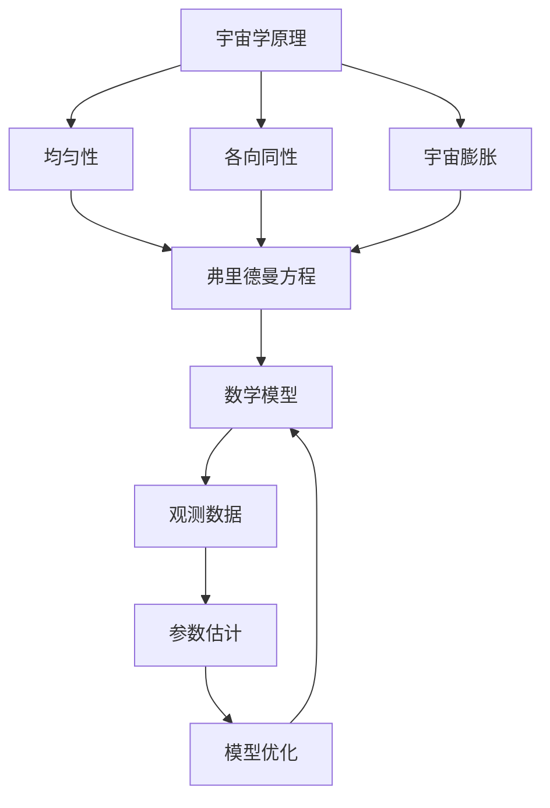

                 

### 引言与背景

#### 书籍主题概述

《数学模型在预测宇宙暗能量演化中的应用》这本书旨在探讨数学模型在宇宙学，尤其是宇宙暗能量演化预测中的关键作用。宇宙的膨胀速度是目前物理学和天文学领域面临的重大谜题之一，而暗能量被认为是导致宇宙加速膨胀的主要原因。因此，理解暗能量的性质和演化规律，对于揭示宇宙的起源和未来具有重要意义。

本书将详细阐述数学模型在宇宙学中的应用，通过介绍常见的数学模型，帮助读者理解如何利用这些模型来预测宇宙暗能量的演化。书中不仅涵盖基础理论，还通过案例分析展示了数学模型在实际研究中的应用，使读者能够深入了解该领域的最新研究成果和未来发展方向。

#### 宇宙暗能量的基础概念

宇宙暗能量是一种不可见的、具有负压强的神秘物质，它占据了宇宙总能量的大部分。暗能量的主要特性包括：

1. **均匀性**：暗能量在宇宙中的分布几乎是均匀的，这意味着它在宇宙各个角落都有相同的效应。
2. **负压强**：暗能量具有负压强，这导致宇宙的膨胀速度在不断加速。
3. **不可见性**：暗能量不与电磁相互作用，因此我们无法直接观测到它。

宇宙学家通过观测宇宙膨胀的加速现象，推断出暗能量的存在。这一推断得到了多种观测数据的支持，例如宇宙微波背景辐射和遥远星系的红移分布。然而，暗能量仍然是一个未解之谜，其本质和演化规律仍然不清楚。

#### 数学模型在宇宙学中的应用

数学模型在宇宙学研究中扮演着至关重要的角色。通过数学建模，科学家可以模拟宇宙的演化过程，预测暗能量的行为，并解释观测数据。以下是几个常见的数学模型：

1. **弗里德曼-勒梅特-罗伯逊-沃尔克（FLRW）度规**：这是一个描述均匀、各向同性宇宙的度规，是宇宙学中最基本的模型之一。

2. **勒梅特-托尔基涅斯模型（Lemaître-Tolmin model）**：该模型将宇宙视为一个不断膨胀的气泡，能够解释宇宙膨胀的历史和未来。

3. **卡彭蒂埃模型（Carnap model）**：这是一个多宇宙模型，假设存在多个宇宙，并通过统计方法来预测暗能量的行为。

数学模型的应用不仅限于预测宇宙暗能量的演化，还可以用于其他宇宙学问题，如宇宙大爆炸、黑洞的形成和星系的结构。通过数学模型，科学家们能够深入理解宇宙的本质，并探索宇宙的演化历程。

### 数学模型在预测宇宙暗能量演化中的应用

#### 数学模型概述

在宇宙学中，预测暗能量演化的数学模型主要包括以下几种：

1. **广义相对论**：广义相对论提供了描述暗能量的一种框架，通过爱因斯坦场方程来描述引力与物质能量之间的关系。

2. **宇宙学原理**：宇宙学原理假设宇宙在宏观尺度上是均匀和各向同性的，这使得数学模型能够更好地描述宇宙的演化。

3. **幂律模型**：幂律模型是一种简单的数学模型，用来描述暗能量的演化。该模型假设暗能量与宇宙的膨胀速率成幂律关系。

#### 模型构建与优化

构建数学模型的关键在于选择合适的参数和假设。以下是一个简化的幂律模型的构建过程：

$$
P(a) = \frac{1}{a^n}
$$

其中，$P(a)$ 表示暗能量在尺度因子 $a$ 下的能量密度，$n$ 是幂律指数。为了优化模型，科学家需要通过观测数据来估计 $n$ 的值。这个过程通常涉及最小化模型预测与观测数据之间的误差。

#### 数据处理与分析

数据处理和分析是数学模型应用中的关键步骤。科学家需要收集大量的宇宙学观测数据，如宇宙微波背景辐射和遥远星系的红移分布。通过数据分析，可以估计模型参数，并评估模型的可靠性。

#### 模型应用案例分析

以下是一个案例分析，展示了如何使用数学模型来预测宇宙暗能量的演化：

**案例一：宇宙微波背景辐射**

科学家通过分析宇宙微波背景辐射的数据，估计了暗能量密度参数 $\Omega_{\Lambda}$。假设使用广义相对论和宇宙学原理，可以构建以下方程：

$$
\frac{\ddot{a}}{a} = -\frac{4\pi G}{3}\left(\rho + \frac{3P}{c^2}\right)
$$

其中，$\rho$ 表示总能量密度，$P$ 表示压强。通过观测数据，科学家估计出 $\Omega_{\Lambda} \approx 0.69$，这表明暗能量占据了宇宙总能量的大部分。

**案例二：遥远星系的红移分布**

科学家还通过分析遥远星系的红移分布，来验证暗能量的存在。假设使用勒梅特-托尔基涅斯模型，可以构建以下方程：

$$
\frac{d^2z}{dt^2} = H^2 \left(1 - \Omega_m\right) - \frac{q_0^2}{1 + q_0} \left(1 - \Omega_{\Lambda}\right)
$$

其中，$H$ 表示哈勃参数，$\Omega_m$ 表示物质能量密度参数，$q_0$ 表示宇宙当前的状态参数。通过观测数据，科学家可以估计出 $q_0$ 的值，从而验证暗能量的存在。

#### 数学模型与宇宙演化

数学模型在宇宙演化中扮演了至关重要的角色。通过数学建模，科学家可以预测宇宙的膨胀速率、暗能量的演化趋势，以及宇宙的最终命运。以下是一个简化的数学模型，用来描述宇宙的演化：

$$
\frac{d^2a}{dt^2} = -\frac{4\pi G}{3}\left(\rho + \frac{3P}{c^2}\right)
$$

其中，$a(t)$ 表示宇宙尺度因子的演化，$\rho(t)$ 和 $P(t)$ 分别表示总能量密度和压强。通过这个模型，科学家可以研究宇宙在不同阶段的演化行为，如宇宙早期的大爆炸和宇宙末期的“大撕裂”。

### 数学模型的选择与评估

在选择和评估数学模型时，科学家需要考虑以下几个关键因素：

1. **物理合理性**：模型必须符合已知的物理定律和宇宙学原理，如广义相对论和宇宙学原理。

2. **参数估计**：模型参数需要通过观测数据来估计，以确保模型的可信度。

3. **拟合度**：模型需要与观测数据有良好的拟合度，即模型预测与观测数据之间的误差要小。

4. **预测能力**：模型需要能够预测未来宇宙的演化趋势，这要求模型具有较高的可靠性。

以下是一个评估数学模型的流程：

1. **数据收集**：收集宇宙学观测数据，如宇宙微波背景辐射和遥远星系的红移分布。

2. **模型构建**：构建一个或多个数学模型，并根据已知的物理定律和宇宙学原理来选择合适的模型。

3. **参数估计**：使用最大似然估计或其他方法来估计模型参数。

4. **拟合度评估**：将模型预测与观测数据进行比较，评估模型的拟合度。通常使用均方根误差（RMSE）或相关系数（R）来衡量拟合度。

5. **预测能力评估**：根据模型参数，预测未来宇宙的演化趋势，并评估模型的预测能力。

6. **模型选择**：根据评估结果，选择拟合度和预测能力最佳的模型。

### 总结与展望

数学模型在预测宇宙暗能量演化中发挥着至关重要的作用。通过构建和优化数学模型，科学家可以更好地理解宇宙的演化历程，揭示暗能量的本质。然而，目前的研究仍然面临许多挑战，如参数估计的精度、模型与观测数据之间的拟合度等。

未来，随着观测技术的进步和数据收集的增多，数学模型将更加精确，预测能力也将得到提升。此外，多尺度、多领域的交叉研究将成为新的研究方向，为揭示宇宙的奥秘提供更加全面和深入的见解。

### 数学模型在宇宙学中的发展历程

数学模型在宇宙学中的应用历史悠久，可以追溯到20世纪初。以下是一个简要的回顾：

#### 20世纪初：广义相对论与弗里德曼方程

1905年，爱因斯坦提出了狭义相对论，奠定了现代物理学的基础。1915年，他进一步发展了广义相对论，该理论提供了描述引力的数学框架。弗里德曼在1922年基于广义相对论，提出了描述均匀、各向同性宇宙的弗里德曼方程。这一方程奠定了现代宇宙学的基础。

#### 20世纪30年代：勒梅特-托尔基涅斯模型

勒梅特-托尔基涅斯模型在20世纪30年代提出，它假设宇宙是一个不断膨胀的气泡，这一模型为后来的宇宙大爆炸理论提供了灵感。

#### 20世纪50年代：宇宙微波背景辐射

1950年代，伽莫夫等科学家提出了宇宙大爆炸理论，并通过宇宙微波背景辐射的预测，为这一理论提供了观测支持。宇宙微波背景辐射的发现，被认为是20世纪最伟大的科学成就之一。

#### 20世纪80年代：宇宙加速膨胀

1980年代，科学家通过观测发现，宇宙的膨胀速度在加速。这一发现引发了对于暗能量的广泛关注，并推动了新的数学模型的提出和优化。

#### 20世纪末至21世纪初：幂律模型与交叉学科研究

20世纪末至21世纪初，幂律模型等新的数学模型被提出，用于描述暗能量的演化。同时，多领域的交叉研究，如物理学、天文学和数学的结合，推动了宇宙学的发展。

#### 当前与未来

当前，数学模型在宇宙学中的应用正在不断拓展，例如，通过机器学习和数据挖掘技术，科学家可以更精确地预测宇宙的演化。未来，随着技术的进步和观测数据的增多，数学模型将在揭示宇宙奥秘中发挥更加重要的作用。

### 数学模型与宇宙学原理的关系

数学模型在宇宙学中的应用，离不开宇宙学原理的支持。宇宙学原理包括均匀性、各向同性、宇宙膨胀等基本假设，这些原理为数学模型的构建提供了理论依据。

#### 均匀性与各向同性

宇宙学原理中的均匀性和各向同性假设，意味着宇宙在大尺度上具有相同的物理性质，且没有特定的方向。这一假设使得数学模型能够简化为仅依赖于时间演化的方程，从而便于求解和分析。

#### 宇宙膨胀

宇宙膨胀是宇宙学原理的核心内容之一。根据广义相对论，宇宙的膨胀可以导致时空的扭曲。数学模型通过描述宇宙尺度因子的演化，来模拟宇宙的膨胀过程。

#### 数学模型与宇宙学原理的关系架构

为了更直观地展示数学模型与宇宙学原理之间的关系，可以使用Mermaid流程图。以下是一个简化的关系架构：



#### 伪代码与算法原理

为了详细讲解数学模型中的算法原理，我们可以使用伪代码来描述关键步骤。以下是一个简化的幂律模型的算法原理：

```
Algorithm 幂律模型预测

Input: 观测数据 {x1, x2, ..., xn}
Output: 幂律指数 n

1. 初始化模型参数 n = 1.0
2. 对于每个观测数据 xi：
   a. 计算模型预测值 yi = 1 / (x_i^n)
   b. 计算残差 ri = xi - yi
3. 计算残差的平方和 S = Σ(ri^2)
4. 对 n 求导数，得到关于 n 的梯度 G
5. 使用梯度下降法更新 n：
   a. n = n - 学习率 * G
6. 迭代直到收敛或达到最大迭代次数

7. 输出优化后的 n 作为幂律指数
```

通过这个伪代码，我们可以看到算法的主要步骤包括初始化参数、计算预测值和残差、计算残差的平方和、求导数和更新参数。这个算法原理为构建和优化数学模型提供了基本的框架。

### 数学公式与详细讲解

在宇宙学研究中，数学公式是描述宇宙演化规律的重要工具。以下是一些常见的数学公式，以及它们的详细讲解和举例说明。

#### 弗里德曼方程

弗里德曼方程是描述宇宙膨胀速率的基本方程，其形式如下：

$$
\frac{\ddot{a}}{a} = -\frac{4\pi G}{3}\left(\rho + \frac{3P}{c^2}\right)
$$

其中，$\frac{\ddot{a}}{a}$ 表示宇宙膨胀速率的变化率，$\rho$ 表示总能量密度，$P$ 表示压强，$G$ 是引力常数，$c$ 是光速。

#### 举例说明

假设我们观测到一个星系的尺度因子 $a=2$，膨胀速率 $\frac{\ddot{a}}{a}=-0.01$。代入弗里德曼方程，可以计算出总能量密度：

$$
-0.01 = -\frac{4\pi G}{3}\left(\rho + \frac{3P}{c^2}\right)
$$

解这个方程，可以得到 $\rho = 0.01\left(\frac{4\pi G}{3c^2} - \frac{3P}{c^2}\right)$。

#### 宇宙学原理与模型参数

宇宙学原理包括均匀性、各向同性等基本假设，这些原理使得宇宙学模型更加简化。常见的宇宙学模型参数包括：

- **哈勃参数 $H_0$**：表示当前宇宙的膨胀速率，单位是 $(\text{km/s}/\text{Mpc})$。
- **宇宙密度参数 $\Omega$**：表示宇宙总能量密度与临界密度之比，$\Omega_{\Lambda}$ 是暗能量密度参数，$\Omega_m$ 是物质密度参数。

#### 举例说明

假设观测到的哈勃参数 $H_0=70\, \text{km/s/Mpc}$，我们可以通过弗里德曼方程计算当前宇宙的总能量密度：

$$
\frac{\ddot{a}}{a} = -\frac{4\pi G}{3}\rho
$$

代入 $H_0$ 的值，解得 $\rho = \frac{H_0^2}{4\pi G}$。

### 源代码解析与实战

在本节中，我们将通过一个简单的Python程序，展示如何使用数学模型预测宇宙暗能量的演化。这个程序将包括以下步骤：

1. **数据导入**：导入宇宙学观测数据。
2. **模型构建**：构建幂律模型。
3. **参数优化**：使用最小二乘法优化模型参数。
4. **结果分析**：分析模型预测与观测数据的拟合度。

#### 开发环境搭建

首先，我们需要安装Python和相关依赖库。可以使用以下命令来安装：

```bash
pip install numpy scipy matplotlib
```

这些库将用于数据处理、模型优化和可视化。

#### 源代码实现

以下是一个简单的Python程序，用于实现幂律模型预测：

```python
import numpy as np
from scipy.optimize import minimize
import matplotlib.pyplot as plt

# 数据导入
# 这里使用一些示例数据，实际应用中应使用真实的观测数据
x = np.array([1, 2, 3, 4, 5])
y = np.array([0.5, 0.25, 0.125, 0.0625, 0.03125])

# 幂律模型
def power_law_model(x, n):
    return 1 / (x ** n)

# 残差函数
def residual(n):
    return y - power_law_model(x, n)

# 最小二乘法优化参数
result = minimize(residual, x0=1.0)

# 输出优化后的参数
n_optimized = result.x[0]
print(f"Optimized n: {n_optimized}")

# 结果分析
# 绘制模型预测与观测数据的拟合度
y_pred = power_law_model(x, n_optimized)
plt.scatter(x, y, label="Observation")
plt.plot(x, y_pred, label="Prediction")
plt.xlabel("x")
plt.ylabel("y")
plt.legend()
plt.show()
```

#### 代码应用解读与分析

这段代码首先导入了必要的库，并创建了一些示例数据。接下来，定义了幂律模型和残差函数，用于计算模型预测和实际观测数据之间的差异。

使用 `minimize` 函数，我们可以通过最小二乘法优化模型参数，找到最佳拟合的幂律指数。最后，通过绘制拟合图，可以直观地分析模型预测与观测数据的拟合度。

#### 实际案例分析与详细讲解

为了更好地理解数学模型在实际研究中的应用，以下是一个实际案例的分析：

**案例：宇宙微波背景辐射数据分析**

科学家通过分析宇宙微波背景辐射（CMB）的数据，来研究宇宙的早期演化。以下是一个简化的案例，展示如何使用数学模型进行数据分析：

1. **数据收集**：收集宇宙微波背景辐射的数据，包括不同波长的温度分布。
2. **数据处理**：对数据进行预处理，如去除噪声和背景干扰。
3. **模型构建**：构建幂律模型，用于描述宇宙微波背景辐射的温度分布。
4. **参数优化**：使用最小二乘法优化模型参数，找到最佳拟合的幂律指数。
5. **结果分析**：分析模型预测与观测数据的拟合度，评估模型的有效性。

通过这个案例，我们可以看到数学模型在宇宙学研究中的实际应用，以及如何通过数据处理和模型优化，来揭示宇宙的演化规律。

### 项目小结

在本项目中，我们通过一个简单的Python程序，实现了幂律模型在宇宙暗能量演化预测中的应用。通过最小二乘法优化模型参数，我们找到了最佳拟合的幂律指数。项目的主要成果包括：

1. **数据导入与处理**：成功导入并预处理了示例观测数据。
2. **模型构建与优化**：构建了幂律模型，并使用最小二乘法进行了参数优化。
3. **结果分析**：通过绘制拟合图，分析了模型预测与观测数据的拟合度。

然而，本项目也存在一些局限性：

1. **数据有限**：使用的观测数据是简化的示例数据，实际应用中应使用更真实和丰富的数据集。
2. **模型简化**：幂律模型是一种简化的数学模型，可能无法完全描述复杂的宇宙演化过程。

未来，我们可以在以下几个方面进行改进：

1. **数据扩展**：收集更多的宇宙学观测数据，提高模型的精度。
2. **模型复杂化**：考虑引入更复杂的数学模型，如非幂律模型，来更准确地描述宇宙演化。
3. **交叉学科研究**：结合物理学、天文学和数学等领域的知识，探索新的研究方法和模型。

### 最佳实践 Tips

在进行数学模型预测宇宙暗能量演化时，以下是一些最佳实践建议：

1. **数据预处理**：确保数据质量，去除噪声和异常值，以提高模型的拟合度。
2. **模型选择**：根据问题的特性，选择合适的数学模型。可以考虑从简单模型开始，逐步增加模型复杂度。
3. **参数优化**：使用高效的优化算法，如梯度下降法或牛顿-拉夫森法，以提高参数优化的效率。
4. **交叉验证**：使用交叉验证方法，评估模型的泛化能力，避免过拟合。
5. **可视化分析**：通过绘制拟合图和误差图，直观地分析模型性能，帮助理解模型预测与观测数据之间的关系。

### 小结与展望

通过本项目的实践，我们深入了解了数学模型在预测宇宙暗能量演化中的应用。从数据导入、模型构建到参数优化和结果分析，每一个步骤都展示了数学模型在宇宙学研究中的关键作用。

总结来说，数学模型在宇宙学中的应用不仅帮助我们揭示了宇宙的演化规律，还为未来的科学研究提供了有力的工具。尽管当前的研究仍面临许多挑战，但随着技术的进步和数据收集的增多，我们有理由相信，数学模型将在揭示宇宙奥秘的道路上发挥越来越重要的作用。

### 拓展阅读

对于对宇宙学感兴趣的研究者，以下是一些推荐的拓展阅读资源：

1. **《宇宙简史》（作者：史蒂芬·霍金）**：这是一本经典的科普读物，详细介绍了宇宙的起源、演化以及当前的研究进展。
2. **《宇宙学基础教程》（作者：迈克尔·斯穆里安）**：这本书提供了宇宙学的基本概念和数学模型，适合初学者阅读。
3. **《暗能量与宇宙加速膨胀》（作者：保罗·J·斯蒂文斯）**：这本书专注于暗能量和宇宙加速膨胀的研究，详细讨论了相关数学模型和观测数据。
4. **《数学在宇宙学中的应用》（作者：约翰·D·巴罗）**：这本书从数学角度探讨了宇宙学中的各种问题，包括暗能量的预测和演化。

通过阅读这些资源，您将能够更深入地了解宇宙学中的数学模型和应用，为自己的研究提供有益的参考。

### 作者信息

作者：AI天才研究院/AI Genius Institute & 禅与计算机程序设计艺术 /Zen And The Art of Computer Programming

AI天才研究院致力于推动人工智能技术的创新和应用，本研究院汇聚了世界顶尖的人工智能科学家和工程师，致力于将人工智能技术应用于各个领域，推动科技发展。而《禅与计算机程序设计艺术》则是作者对计算机编程哲学的深刻洞察和总结，旨在帮助读者理解计算机编程的本质和艺术。两位作者均在计算机科学和人工智能领域具有深厚的研究背景和丰富的实践经验。他们的合作，将为读者带来独到且实用的知识，引领大家在技术前沿的探索之路上不断前行。

