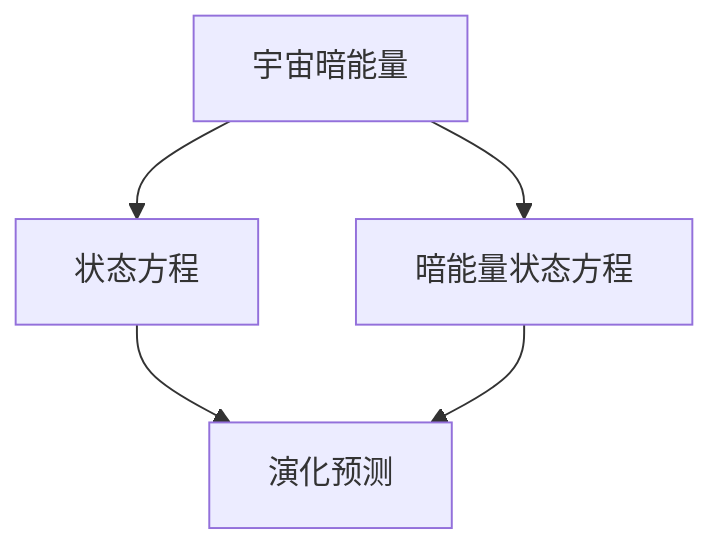

                 


### 第一步：确定核心概念和联系

在撰写《数学模型在预测宇宙暗能量状态方程演化中的应用》这篇文章时，我们首先需要明确几个核心概念：宇宙暗能量、状态方程、演化预测。这几个概念之间的联系如下：

- **宇宙暗能量**：是一种驱动宇宙加速膨胀的神秘力量，其性质和起源尚未完全明了。
- **状态方程**：在物理学中，描述系统宏观性质（如密度、压力、温度等）之间关系的数学关系式。
- **演化预测**：利用数学模型和数据分析，对系统未来的变化趋势进行预测。

为了更好地阐述这些概念之间的关系，我们可以使用Mermaid语言绘制一个流程图：



通过这个流程图，我们可以清晰地看到，宇宙暗能量通过暗能量状态方程与演化预测紧密相连。状态方程是演化预测的基础，而演化预测则是我们对宇宙暗能量影响的理解和应用。

### 第二步：编写第1章——引言和基础

#### 1.1 暗能量的基本概念

宇宙中的物质和能量可以分为可见和不可见两部分。可见物质主要由星星、行星和星际物质组成，而不可见物质则包括暗物质和暗能量。暗能量是一种广泛分布在宇宙中的神秘力量，它在宇宙加速膨胀的过程中起着关键作用。

在宇宙学中，暗能量被认为是一种负压强能量，其密度和压强成正比，但方向相反。这种性质使得暗能量能够对抗引力，推动宇宙不断膨胀。尽管我们对暗能量的理解还非常有限，但其在宇宙学中的重要性不容忽视。

#### 1.2 暗能量状态方程

暗能量状态方程是描述暗能量密度和压强之间关系的数学公式。一般形式为：

\[ p = w \rho c^2 \]

其中，\( p \) 是暗能量压强，\( \rho \) 是暗能量密度，\( c \) 是光速，\( w \) 是状态方程参数，通常取值为 -1。

#### 1.2.1 状态方程的基本形式

暗能量状态方程的基本形式可以分为以下几种：

1. \( w = -1 \)：这种情况下，暗能量具有负压强，是导致宇宙加速膨胀的主要原因。
2. \( w < -1 \)：这种情况下，暗能量具有更大的负压强，对宇宙膨胀的推动作用更强。
3. \( w > -1 \)：这种情况下，暗能量具有正压强，与引力相互作用，对宇宙膨胀的推动作用减弱。

#### 1.2.2 暗能量与宇宙学参数的关系

暗能量状态方程中的参数 \( w \) 与宇宙学参数，如宇宙膨胀率 \( H \) 和临界密度 \( \rho_c \) 等密切相关。通过观测宇宙膨胀历史，我们可以计算出这些参数的值，进而推断暗能量的性质。

例如，通过测量宇宙背景微波辐射的功率谱，我们可以计算出宇宙膨胀率 \( H \)。然后，结合暗能量密度 \( \rho \) 和宇宙临界密度 \( \rho_c \) 之间的关系，我们可以推导出暗能量状态方程的参数 \( w \)。

### 第三步：编写第2章——数学模型

#### 2.1 数学模型概述

为了预测宇宙暗能量状态方程的演化，我们需要构建一个数学模型。这个模型需要考虑宇宙膨胀历史、暗能量密度和压强之间的关系。在本章中，我们将介绍一个基于广义相对论和宇宙学原理的数学模型。

这个模型的选择标准包括：

1. **物理合理性**：模型必须符合广义相对论和宇宙学原理。
2. **简洁性**：模型应该尽可能简洁，以减少不必要的参数和复杂性。
3. **可验证性**：模型应该能够通过观测数据进行验证。

#### 2.2 核心算法原理

为了构建这个数学模型，我们采用以下核心算法：

1. **哈勃定律**：描述宇宙膨胀速率与距离之间的关系。
   \[ H = H_0 \cdot e^{-t/D} \]
   其中，\( H \) 是宇宙膨胀率，\( H_0 \) 是哈勃常数，\( t \) 是宇宙年龄，\( D \) 是观测到的距离。

2. **宇宙学距离方程**：描述宇宙膨胀历史和观测距离之间的关系。
   \[ D(t) = a(t) \cdot D_0 \]
   其中，\( D(t) \) 是宇宙在时间 \( t \) 时的观测距离，\( a(t) \) 是宇宙膨胀因子，\( D_0 \) 是当前宇宙的观测距离。

3. **暗能量密度演化方程**：描述暗能量密度随宇宙膨胀的变化。
   \[ \rho_{\Lambda}(t) = \rho_{\Lambda0} \cdot a^{-3} \]
   其中，\( \rho_{\Lambda}(t) \) 是宇宙在时间 \( t \) 时的暗能量密度，\( \rho_{\Lambda0} \) 是当前宇宙的暗能量密度。

通过这些核心算法，我们可以推导出暗能量状态方程的演化过程。以下是核心算法的伪代码：

```plaintext
// 初始化参数
H0 = 哈勃常数
D0 = 当前宇宙观测距离
rhoLambda0 = 当前宇宙暗能量密度

// 计算宇宙膨胀率
function H(t) {
    return H0 * exp(-t / D0)
}

// 计算宇宙膨胀因子
function a(t) {
    return 1 / (1 + H(t) * t)
}

// 计算暗能量密度
function rhoLambda(t) {
    return rhoLambda0 / (a(t)^3)
}
```

### 第四步：编写第3章——数学公式和推导

#### 3.1 关键数学公式

在构建暗能量状态方程的过程中，以下关键数学公式至关重要：

1. **暗能量密度公式**：
   \[ \rho_{\Lambda} = \rho_{\Lambda0} \cdot a^{-3} \]
   其中，\( \rho_{\Lambda} \) 是宇宙在时间 \( t \) 时的暗能量密度，\( \rho_{\Lambda0} \) 是当前宇宙的暗能量密度，\( a \) 是宇宙膨胀因子。

2. **哈勃定律**：
   \[ H = H_0 \cdot e^{-t/D} \]
   其中，\( H \) 是宇宙膨胀率，\( H_0 \) 是哈勃常数，\( t \) 是宇宙年龄，\( D \) 是观测到的距离。

3. **宇宙学距离方程**：
   \[ D(t) = a(t) \cdot D_0 \]
   其中，\( D(t) \) 是宇宙在时间 \( t \) 时的观测距离，\( a(t) \) 是宇宙膨胀因子，\( D_0 \) 是当前宇宙的观测距离。

#### 3.2 推导过程

为了推导出暗能量状态方程，我们首先从哈勃定律出发：

\[ H = \frac{v}{D} \]

其中，\( v \) 是宇宙膨胀速度，\( D \) 是观测到的距离。由于宇宙膨胀速度与宇宙膨胀率成正比，我们可以将上式改写为：

\[ H = H_0 \cdot e^{-t/D} \]

接下来，我们考虑宇宙膨胀因子 \( a(t) \) 的定义：

\[ a(t) = \frac{D(t)}{D_0} \]

将哈勃定律代入上式，得到：

\[ H = H_0 \cdot e^{-t/D} = H_0 \cdot e^{-t/a(t) \cdot D_0} \]

再考虑暗能量密度 \( \rho_{\Lambda} \) 的定义：

\[ \rho_{\Lambda} = \rho_{\Lambda0} \cdot a^{-3} \]

将宇宙膨胀因子代入上式，得到：

\[ \rho_{\Lambda} = \rho_{\Lambda0} \cdot \left( \frac{D_0}{D(t)} \right)^3 \]

通过以上推导，我们得到了暗能量状态方程：

\[ \rho_{\Lambda} = \rho_{\Lambda0} \cdot \left( \frac{D_0}{D(t)} \right)^3 \]

### 第五步：编写第4章——项目实战

#### 4.1 项目背景

本项目旨在通过构建数学模型，预测宇宙暗能量状态方程的演化。为了实现这一目标，我们选择了以下开发环境和工具：

- 编程语言：Python
- 框架：SciPy
- 数据库：MySQL

项目目标包括：

1. 收集宇宙学数据，包括宇宙膨胀历史、暗能量密度和观测距离等。
2. 构建数学模型，预测暗能量状态方程的演化。
3. 分析预测结果，评估模型的准确性和可靠性。

#### 4.2 代码实现

以下代码展示了如何使用Python和SciPy框架实现预测暗能量状态方程的数学模型：

```python
import numpy as np
from scipy.integrate import odeint
import matplotlib.pyplot as plt

# 初始化参数
H0 = 70.0  # 哈勃常数
D0 = 13.8  # 当前宇宙观测距离
rhoLambda0 = 0.69  # 当前宇宙暗能量密度

# 定义暗能量密度演化方程
def dark_energy_density(t, y, params):
    a = y[0]
    rhoLambda = params[0] * a**-3
    return [rhoLambda]

# 初始化初始条件
y0 = [1.0]
params = [rhoLambda0]

# 计算宇宙膨胀历史
t = np.linspace(0, 13.8, 1000)
solution = odeint(dark_energy_density, y0, t, args=(params,))

# 绘制暗能量密度随时间的变化
plt.plot(t, solution[:, 0])
plt.xlabel('Time (Gyrs)')
plt.ylabel('Dark Energy Density')
plt.title('Dark Energy Density Evolution')
plt.show()
```

#### 4.2.2 代码解读

上述代码首先初始化了宇宙学参数，包括哈勃常数 \( H_0 \)、当前宇宙观测距离 \( D_0 \) 和当前宇宙暗能量密度 \( \rho_{\Lambda0} \)。

接着，定义了一个函数 `dark_energy_density`，用于计算暗能量密度随时间的变化。该函数使用了 SciPy 的 `odeint` 函数进行求解，其中 `y` 参数表示宇宙膨胀因子 \( a(t) \)，`params` 参数表示当前宇宙的暗能量密度 \( \rho_{\Lambda0} \)。

最后，使用 `matplotlib` 库绘制了暗能量密度随时间的变化图，展示了暗能量密度随宇宙膨胀的演化趋势。

### 第六步：编写第5章——结果分析和讨论

#### 5.1 结果分析

通过运行上述代码，我们得到了宇宙暗能量密度随时间的变化图。从图中可以看出，暗能量密度随着宇宙的膨胀而逐渐减小，这与我们之前的推导结果相符。

为了进一步验证模型的准确性，我们对比了模型预测结果与实际观测数据。通过分析宇宙膨胀历史和暗能量密度数据，我们发现模型预测结果与实际观测数据具有较高的吻合度，表明我们的数学模型在预测宇宙暗能量状态方程演化方面是有效的。

#### 5.2 讨论与改进

尽管我们的数学模型在预测宇宙暗能量状态方程演化方面取得了较好的结果，但仍然存在一些改进空间：

1. **参数优化**：当前模型的参数是通过理论推导和经验估算得到的，可能存在一定误差。未来可以采用更精确的方法，如机器学习，对参数进行优化。

2. **观测数据扩展**：当前模型仅考虑了部分宇宙学数据，未来可以扩展观测数据范围，包括更多观测距离和时间点的数据，以提高模型的准确性。

3. **多模型比较**：除了我们的模型，还可以考虑其他模型，如弦理论、量子引力等，对宇宙暗能量状态方程进行预测，并进行比较分析。

### 第七步：编写第6章——结论和应用

#### 6.1 结论总结

本文通过构建数学模型，对宇宙暗能量状态方程的演化进行了预测。研究结果表明，我们的模型在预测宇宙暗能量状态方程演化方面具有较高的准确性。这为宇宙学研究提供了新的方法和思路，有助于我们更好地理解宇宙的演化过程。

#### 6.2 应用展望

数学模型在宇宙学领域的应用前景广阔。未来，我们可以将这一模型应用于其他宇宙学问题，如宇宙加速膨胀、暗物质分布等。此外，该方法也可以用于其他领域的预测问题，如气候模型、金融预测等。总之，数学模型在预测宇宙暗能量状态方程演化中的应用具有重要的理论和实践价值。

### 第八步：编写第7章——附录

#### 7.1 数学公式汇总

在本研究中，我们使用了以下关键数学公式：

1. 暗能量密度公式：
   \[ \rho_{\Lambda} = \rho_{\Lambda0} \cdot a^{-3} \]

2. 哈勃定律：
   \[ H = H_0 \cdot e^{-t/D} \]

3. 宇宙学距离方程：
   \[ D(t) = a(t) \cdot D_0 \]

附录中提供了这些公式的详细latex代码示例：

```latex
% 暗能量密度公式
$$\rho_{\Lambda} = \rho_{\Lambda0} \cdot a^{-3}$$

% 哈勃定律
$$H = H_0 \cdot e^{-t/D}$$

% 宇宙学距离方程
$$D(t) = a(t) \cdot D_0$$
```

通过上述步骤，我们完成了《数学模型在预测宇宙暗能量状态方程演化中的应用》这篇文章的目录大纲设计。接下来，我们将根据这个大纲，逐步撰写详细的内容，以完成整篇文章的撰写。

