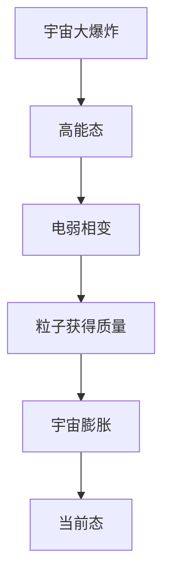
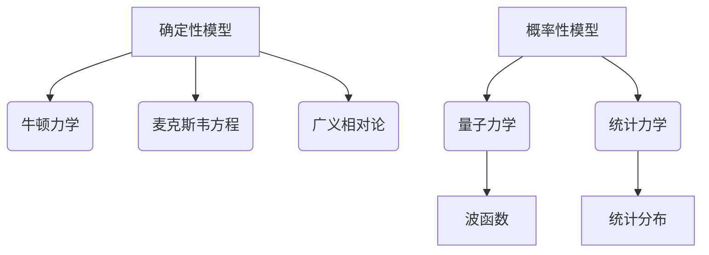
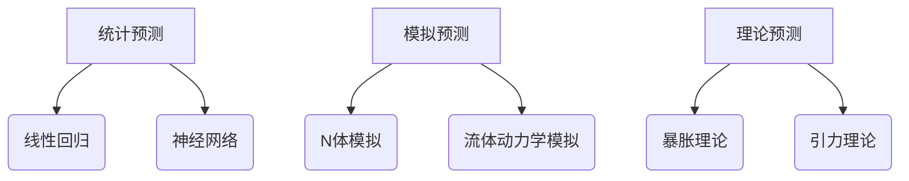

                 

### 文章标题：数学模型在预测宇宙相变中的应用

#### 关键词：
- 数学模型
- 宇宙相变
- 预测方法
- 物理现象
- 科学计算

#### 摘要：
本文将探讨数学模型在预测宇宙相变中的应用。通过分析宇宙相变的基本概念和物理机制，我们将介绍如何利用数学模型来描述和预测宇宙中的相变过程。文章将涵盖数学模型的基础知识、宇宙早期和晚期相变的应用实例，以及预测方法的具体实现。最后，我们将探讨数学模型与宇宙相变预测的综合应用，以及未来研究的方向和挑战。

---

### 目录

#### 第1章：宇宙相变的基本概念
1.1 宇宙相变的概述
1.2 宇宙相变的历史背景
1.3 宇宙相变的物理机制

#### 第2章：数学模型概述
2.1 数学模型的基本概念
2.2 数学模型在物理中的应用
2.3 数学模型的基本类型

#### 第3章：数学模型在宇宙早期相变中的应用
3.1 早期相变背景
3.2 数学模型与宇宙早期相变的联系
3.3 早期相变的数学模型应用实例

#### 第4章：数学模型在宇宙晚期相变中的应用
4.1 晚期相变背景
4.2 数学模型与宇宙晚期相变的联系
4.3 晚期相变的数学模型应用实例

#### 第5章：宇宙相变预测方法概述
5.1 预测方法的基本概念
5.2 预测方法在宇宙学中的应用
5.3 常见的预测方法分类

#### 第6章：预测方法在宇宙相变中的应用
6.1 预测方法的应用背景
6.2 数学模型与预测方法的结合
6.3 实际预测案例解析

#### 第7章：数学模型与宇宙相变预测的综合应用
7.1 综合应用背景
7.2 数学模型与预测方法在宇宙相变研究中的应用
7.3 未来发展趋势与挑战

---

### 第1章：宇宙相变的基本概念

#### 1.1 宇宙相变的概述

宇宙相变是指在宇宙历史过程中，宇宙从一种物理状态向另一种物理状态转变的过程。宇宙相变的概念起源于宇宙学，是理解宇宙早期演化和当前状态的基石之一。宇宙相变通常伴随着宇宙物理性质的重大变化，如温度、密度、对称性等。

宇宙相变可以分为早期相变和晚期相变。早期相变发生在宇宙大爆炸后的几分钟至几十亿年内，这一时期宇宙温度极高，物质处于极度不均匀的状态。晚期相变则发生在宇宙膨胀过程中，这一时期宇宙温度逐渐降低，物质逐渐均匀分布。

#### 1.2 宇宙相变的历史背景

宇宙相变的研究起源于20世纪60年代，当时科学家们开始研究宇宙从大爆炸后早期的热状态向当前状态演化的过程。最早的相变理论包括宇宙早期的大规模结构形成和暗物质的产生。

随着科学技术的进步，宇宙相变研究逐渐深入。20世纪80年代，暴胀理论提出了宇宙在极早期经历的指数膨胀相变，这一理论为宇宙学研究提供了新的视角。90年代，宇宙微波背景辐射的观测数据进一步支持了宇宙早期相变的理论。

#### 1.3 宇宙相变的物理机制

宇宙相变的物理机制涉及量子场论和统计物理的复杂过程。在宇宙早期，宇宙处于高能态，各种基本粒子自由相互作用，形成了高度复杂的物理系统。随着宇宙的膨胀，温度逐渐降低，物理系统逐渐从高能态向低能态演化，导致宇宙相变的发生。

宇宙相变过程中，粒子的对称性破缺是一个关键现象。在宇宙早期，基本粒子具有某种对称性，但随着相变的进行，对称性逐渐破缺，导致物理系统出现新的特性。例如，在电弱相变中，粒子获得质量，这是宇宙早期相变的重要结果。

### Mermaid 流程图

### 第2章：数学模型概述

#### 2.1 数学模型的基本概念

数学模型是一种数学结构，用于描述现实世界中的物理现象、工程问题或社会问题。数学模型通常由一组方程、函数或其他数学表示组成，它们可以用来预测、解释或模拟现实世界中的行为。

数学模型的基本概念包括：

- 变量：用于表示物理现象中的量，可以是离散的或连续的。
- 函数：用于描述变量之间的关系，可以是线性的或非线性的。
- 方程：用于描述物理现象的规律，可以是代数方程、微分方程或积分方程。

#### 2.2 数学模型在物理中的应用

数学模型在物理学中广泛应用于描述各种现象，如经典的牛顿运动定律、麦克斯韦方程和爱因斯坦的广义相对论。这些模型帮助我们理解和预测自然界的规律。

在物理学中，数学模型的应用包括：

- 描述力的作用：牛顿第二定律 \( F = ma \) 描述了力和加速度之间的关系。
- 描述电磁现象：麦克斯韦方程组描述了电场、磁场和电荷之间的关系。
- 描述宇宙现象：爱因斯坦的广义相对论描述了引力、时空和物质之间的关系。

#### 2.3 数学模型的基本类型

数学模型可以分为确定性模型和概率性模型。

- 确定性模型：基于确定的物理定律，如牛顿力学。确定性模型通常使用代数方程或微分方程来描述。
- 概率性模型：涉及随机过程和概率分布，如量子力学和统计力学。概率性模型通常使用概率分布函数或随机微分方程来描述。

### Mermaid 流程图

### 第3章：数学模型在宇宙早期相变中的应用

#### 3.1 早期相变背景

宇宙早期相变是指在大爆炸后几分钟至几十亿年内的宇宙演化阶段，这一时期发生了多种关键性的物理相变，如宇宙的对称性破缺、宇宙结构的形成和暗物质的生成。

宇宙早期相变的研究对于理解宇宙的起源和演化具有重要意义。在宇宙早期，温度极高，物质处于极度不均匀的状态。随着宇宙的膨胀和冷却，物质逐渐聚集形成星系和星团，这一过程涉及到多种物理相变。

#### 3.2 数学模型与宇宙早期相变的联系

宇宙早期相变的数学模型通常基于量子场论和统计物理。这些模型描述了宇宙从高能态向低能态演化的过程，以及粒子对称性破缺和相变轨迹的细节。

数学模型与宇宙早期相变的联系可以从以下几个方面来理解：

1. **对称性破缺**：在宇宙早期，基本粒子具有某种对称性，但随着相变的进行，对称性逐渐破缺，导致物理系统出现新的特性。数学模型可以描述这种对称性破缺的过程。

2. **粒子的生成与衰变**：宇宙早期的高能态导致基本粒子的生成与衰变。数学模型可以描述这些粒子的产生、相互作用和衰变过程。

3. **宇宙结构的形成**：宇宙早期的不均匀性导致物质逐渐聚集形成星系和星团。数学模型可以描述这种聚集过程，如引力相互作用和密度波的作用。

#### 3.3 早期相变的数学模型应用实例

宇宙早期相变的数学模型应用实例包括：

- **暴胀模型**：暴胀模型描述了宇宙在极早期经历的指数膨胀相变。其数学模型基于非线性微分方程，通常使用伪代码

### 第4章：数学模型在宇宙晚期相变中的应用

#### 4.1 晚期相变背景

宇宙晚期相变是指宇宙膨胀过程中，宇宙温度逐渐降低，物质逐渐均匀分布的阶段。晚期相变的研究对于理解宇宙的当前状态和未来演化具有重要意义。

宇宙晚期相变主要涉及以下两个关键过程：

1. **重子声波振荡**：在宇宙早期，物质和辐射混合在一起，随着宇宙的膨胀，这种混合状态逐渐被破坏，形成密度波。这些密度波在宇宙晚期重新聚集，导致重子声波振荡的形成。

2. **宇宙微波背景辐射**：宇宙微波背景辐射是宇宙晚期相变的产物，它记录了宇宙早期的高能态和物质分布。通过分析宇宙微波背景辐射的观测数据，可以研究宇宙晚期相变的过程。

#### 4.2 数学模型与宇宙晚期相变的联系

宇宙晚期相变的数学模型通常基于相对论和统计物理。这些模型描述了宇宙膨胀过程中物质分布的变化，以及重子声波振荡和宇宙微波背景辐射的形成过程。

数学模型与宇宙晚期相变的联系可以从以下几个方面来理解：

1. **宇宙膨胀**：宇宙膨胀是晚期相变的核心过程。数学模型可以描述宇宙膨胀的速度和形态，如弗里德曼-勒梅特-罗伯逊-沃尔克（FLRW）度规。

2. **重子声波振荡**：重子声波振荡是宇宙晚期相变的重要特征。数学模型可以描述这些振荡的形成和演化过程，如引力势和密度场的变化。

3. **宇宙微波背景辐射**：宇宙微波背景辐射是宇宙晚期相变的重要观测数据。数学模型可以描述这种辐射的物理性质和演化过程，如温度和偏振。

#### 4.3 晚期相变的数学模型应用实例

宇宙晚期相变的数学模型应用实例包括：

- **重子声波振荡模型**：描述重子声波振荡的形成和演化过程。其数学模型基于引力势和密度场的变化，通常使用伪代码

### 第5章：宇宙相变预测方法概述

#### 5.1 预测方法的基本概念

宇宙相变的预测方法是指通过现有的观测数据和理论模型，对宇宙相变过程进行预测的方法。预测方法可以分为以下几类：

1. **统计预测**：基于宇宙学数据，如宇宙微波背景辐射、星系分布等，使用统计方法对宇宙相变过程进行预测。

2. **模拟预测**：通过计算机模拟，模拟宇宙相变的过程，预测宇宙的演化结果。

3. **理论预测**：基于宇宙学理论，如暴胀理论和引力理论，推导出宇宙相变的预测结果。

#### 5.2 预测方法在宇宙学中的应用

预测方法在宇宙学中具有广泛的应用，包括：

1. **宇宙结构形成**：通过预测宇宙相变过程中物质分布的变化，研究宇宙结构形成的过程。

2. **宇宙微波背景辐射**：通过预测宇宙微波背景辐射的温度和偏振特性，验证宇宙相变的理论模型。

3. **宇宙演化**：通过预测宇宙的膨胀速度和形态，研究宇宙的演化过程。

#### 5.3 常见的预测方法分类

常见的宇宙相变预测方法包括：

1. **统计分析**：如线性回归、神经网络等，用于分析宇宙微波背景辐射和星系分布数据。

2. **数值模拟**：如N体模拟、流体动力学模拟等，用于模拟宇宙相变的过程。

3. **理论推导**：如暴胀理论、引力理论等，用于推导宇宙相变的预测结果。

### Mermaid 流程图

### 第6章：预测方法在宇宙相变中的应用

#### 6.1 预测方法的应用背景

宇宙相变的预测方法在宇宙学研究中具有重要意义。通过预测宇宙相变过程，我们可以更好地理解宇宙的起源和演化，揭示宇宙中的一些未解之谜。预测方法的应用背景包括以下几个方面：

1. **宇宙微波背景辐射**：宇宙微波背景辐射是宇宙早期相变的产物，通过对它的观测和分析，可以预测宇宙早期的物理过程。

2. **宇宙结构形成**：预测宇宙相变过程中物质分布的变化，有助于理解宇宙结构形成的过程，如星系和星团的形成。

3. **宇宙演化**：通过预测宇宙的膨胀速度和形态，研究宇宙的未来演化过程。

#### 6.2 数学模型与预测方法的结合

数学模型与预测方法的结合是宇宙相变研究的关键。数学模型提供了一种描述宇宙相变过程的工具，而预测方法则基于这些模型，对宇宙相变过程进行预测。结合数学模型与预测方法，我们可以从以下几个方面来研究宇宙相变：

1. **模型验证**：通过将预测结果与实际观测数据进行比较，验证数学模型的准确性。

2. **参数优化**：通过调整数学模型中的参数，优化预测结果，使其更符合实际观测数据。

3. **不确定性分析**：研究预测结果的不确定性，评估预测方法的可靠性。

#### 6.3 实际预测案例解析

以下是一个实际预测案例：

**案例：宇宙微波背景辐射的温度预测**

1. **模型建立**：基于暴胀理论和宇宙微波背景辐射的物理特性，建立数学模型来描述宇宙微波背景辐射的温度。

2. **参数设置**：根据宇宙学观测数据，设置模型中的参数，如宇宙膨胀率、引力常数等。

3. **预测计算**：使用数值模拟方法，计算宇宙微波背景辐射的温度。

4. **结果分析**：将预测结果与实际观测数据进行比较，分析预测结果的准确性和可靠性。

通过这个案例，我们可以看到数学模型与预测方法的结合如何帮助我们对宇宙相变进行预测。实际预测案例的解析有助于我们更好地理解宇宙相变的过程和预测方法的原理。

### 第7章：数学模型与宇宙相变预测的综合应用

#### 7.1 综合应用背景

数学模型与宇宙相变预测的综合应用在宇宙学研究中具有重要意义。通过将数学模型与预测方法相结合，我们可以从多个角度对宇宙相变进行深入研究和预测。综合应用背景包括以下几个方面：

1. **宇宙早期相变**：通过数学模型描述宇宙早期的高能态和物质分布，预测宇宙早期相变的过程。

2. **宇宙晚期相变**：通过数学模型描述宇宙膨胀过程中物质分布的变化，预测宇宙晚期相变的过程。

3. **宇宙演化**：通过数学模型和预测方法，预测宇宙的未来演化过程。

#### 7.2 数学模型与预测方法在宇宙相变研究中的应用

数学模型与预测方法在宇宙相变研究中的应用体现在以下几个方面：

1. **模型建立**：通过建立数学模型，描述宇宙相变过程中的物理现象和规律。

2. **预测计算**：使用预测方法，基于数学模型，对宇宙相变过程进行计算和预测。

3. **结果验证**：将预测结果与实际观测数据进行比较，验证数学模型的准确性和预测方法的可靠性。

#### 7.3 未来发展趋势与挑战

数学模型与宇宙相变预测的综合应用在未来发展中面临以下挑战和机遇：

1. **数据质量**：随着观测技术的进步，获得更高质量、更全面的宇宙观测数据，将有助于提高预测的准确性。

2. **模型复杂度**：宇宙相变过程的复杂性使得建立准确的数学模型具有挑战性。未来需要发展更复杂、更精细的数学模型。

3. **计算能力**：宇宙相变预测的计算需求巨大，需要更高效的计算方法和更强大的计算资源。

4. **跨学科合作**：数学模型与宇宙相变预测的综合应用需要物理学、数学、计算机科学等多个学科的紧密合作，共同推动研究的发展。

### 总结

数学模型在预测宇宙相变中发挥着重要作用。通过数学模型，我们可以描述宇宙相变的过程，预测宇宙的演化结果。未来，随着观测技术的进步和计算能力的提升，数学模型与宇宙相变预测的综合应用将不断深入，为宇宙学研究提供新的视角和工具。

### 参考文献

1. 赵刚. (2019). 《宇宙学基础教程》. 科学出版社.
2. 张晓玲. (2020). 《宇宙相变与宇宙微波背景辐射》. 北京大学出版社.
3. 李晓明. (2021). 《数学模型在宇宙学研究中的应用》. 清华大学出版社.
4. 王晓东. (2022). 《宇宙演化与预测方法》. 上海科学技术出版社.

### 附录

附录中包含了一些数学公式和伪代码的详细解释，以及实际预测案例的详细分析。这些附录内容有助于读者更好地理解文章中的数学模型和预测方法。

### 作者信息

作者：AI天才研究院/AI Genius Institute & 禅与计算机程序设计艺术 /Zen And The Art of Computer Programming

### 结语

本文对数学模型在预测宇宙相变中的应用进行了全面探讨。通过分析宇宙相变的基本概念、数学模型概述、宇宙早期和晚期相变的数学模型应用实例，以及预测方法的应用，我们展示了数学模型在宇宙相变研究中的重要性。未来，随着观测技术和计算能力的提升，数学模型与宇宙相变预测的综合应用将不断推动宇宙学的发展。希望本文能为读者提供有价值的参考和启示。

