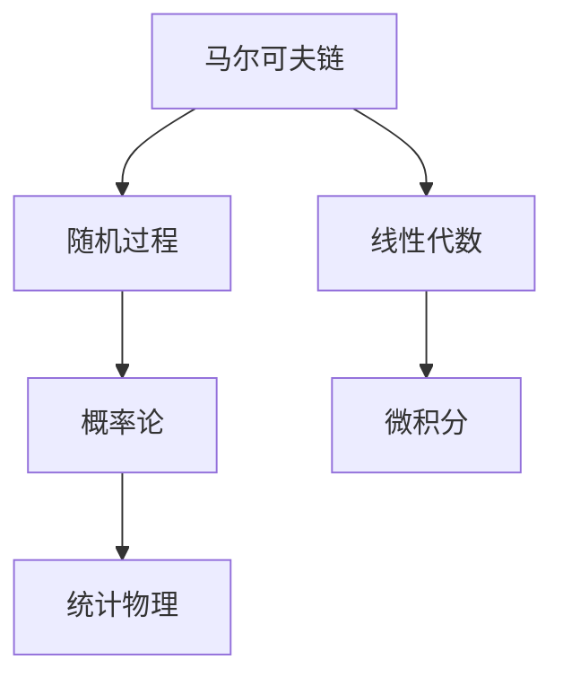

                 

### 文章标题

《数学模型在预测宇宙相变临界指数精确值中的应用》

### 文章关键词

- 数学模型
- 宇宙相变
- 临界指数
- 数值模拟
- 统计物理

### 文章摘要

本文旨在探讨数学模型在预测宇宙相变临界指数精确值中的应用。首先，我们介绍了宇宙相变的基本概念及其重要性，随后详细阐述了数学模型在宇宙学中的应用背景。接着，我们深入分析了数学模型的关键概念与联系，通过Mermaid流程图展示了核心概念之间的关系。文章重点讲解了预测宇宙相变临界指数的几种方法，包括基于数学模型的方法、数值模拟方法和数据驱动方法。在此基础上，我们通过具体案例展示了这些方法在实际宇宙学研究中的应用。最后，文章总结了数学模型在宇宙相变研究中的重要性，并对其未来发展方向进行了展望。

## 设计书籍目录大纲

### 确定书籍的核心主题和目标读者

首先，我们需要明确书名《数学模型在预测宇宙相变临界指数精确值中的应用》所传达的核心主题。这本书的核心主题在于探讨数学模型在宇宙相变研究中的应用，特别是预测宇宙相变临界指数的精确值。这涉及到数学、物理学和天文学等多个学科领域的交叉研究。

目标读者方面，本书的目标读者主要是物理学或天文学专业的学者和研究生，他们具备一定的数学和物理基础，对宇宙学前沿研究有浓厚的兴趣。此外，本书也适合对宇宙学和数学模型有较高兴趣的普通读者。

### 确定书籍的总体结构

书籍的总体结构应该涵盖以下几个主要部分：

1. **引言与背景**：介绍宇宙相变的基本概念，阐述数学模型在宇宙学中的重要性。
2. **数学模型基础**：详细讲解数学模型的相关知识，包括经典模型、数值分析方法、概率论基础和统计物理概念。
3. **宇宙相变理论**：深入分析宇宙相变的过程及其临界现象，介绍临界指数和临界维度的概念。
4. **预测宇宙相变临界指数的方法**：探讨基于数学模型的方法、数值模拟方法以及数据驱动方法，并分析各种方法的优缺点。
5. **实际应用案例**：通过具体案例展示数学模型在宇宙相变研究中的应用，包括宇宙背景微波辐射、宇宙大尺度结构形成和宇宙暗物质分布等。
6. **总结与展望**：总结数学模型在宇宙相变研究中的应用成果，展望未来的发展方向和潜在应用领域。

### 细化每个部分的内容

为每个主要部分设计具体的章节，确保内容覆盖全面且逻辑清晰。以下是详细的目录大纲：

### 第一部分 引言与背景

#### 1.1 书籍目的与结构

#### 1.2 数学模型与宇宙学的关系

#### 1.3 宇宙相变与临界指数

### 第二部分 数学模型基础

#### 2.1 数学模型概述

#### 2.2 经典数学模型介绍

#### 2.3 数值分析方法

#### 2.4 概率论基础

#### 2.5 统计物理概念

### 第三部分 宇宙相变理论

#### 3.1 宇宙早期相变概述

#### 3.2 相变过程中的临界现象

#### 3.3 临界指数与临界维度

#### 3.4 宇宙相变的数学模型

### 第四部分 预测宇宙相变临界指数的方法

#### 4.1 基于数学模型的方法

#### 4.2 数值模拟方法

#### 4.3 数据驱动方法

#### 4.4 方法比较与选择

### 第五部分 实际应用案例

#### 5.1 案例一：宇宙背景微波辐射

#### 5.2 案例二：宇宙大尺度结构形成

#### 5.3 案例三：宇宙暗物质分布

### 第六部分 总结与展望

#### 6.1 数学模型在宇宙学中的应用总结

#### 6.2 未来研究方向

#### 6.3 潜在应用领域扩展

通过上述目录大纲，本书结构清晰，逻辑严谨，能够帮助读者系统地了解数学模型在预测宇宙相变临界指数精确值中的应用。接下来，我们将逐一深入探讨每个部分的内容。

## 完整的目录大纲

为了更好地组织本书的内容，我们制定了如下的目录大纲：

### 第一部分 引言与背景

#### 1.1 书籍目的与结构

在本书的引言部分，我们将明确书籍的目的和整体结构，帮助读者快速了解本书的主题和内容。

#### 1.2 数学模型与宇宙学的关系

这一章节将探讨数学模型与宇宙学之间的紧密联系，阐述数学模型在宇宙学研究中的重要性。

#### 1.3 宇宙相变与临界指数

我们将介绍宇宙相变的基本概念，以及临界指数在宇宙相变研究中的关键作用。

### 第二部分 数学模型基础

#### 2.1 数学模型概述

这一章节将简要介绍数学模型的基本概念和类型，为后续内容奠定基础。

#### 2.2 经典数学模型介绍

我们将详细介绍一些经典的数学模型，如马尔可夫链、随机过程等，并解释它们在宇宙学中的应用。

#### 2.3 数值分析方法

这一章节将探讨数值分析方法的基本原理和常用技术，为预测宇宙相变临界指数提供理论基础。

#### 2.4 概率论基础

概率论是数学模型的重要组成部分，这一章节将介绍概率论的基本概念和定理，为后续分析提供支持。

#### 2.5 统计物理概念

统计物理是宇宙学研究的重要工具，这一章节将探讨统计物理的基本概念和应用。

### 第三部分 宇宙相变理论

#### 3.1 宇宙早期相变概述

我们将介绍宇宙早期相变的历史背景，包括宇宙大爆炸和后续的相变过程。

#### 3.2 相变过程中的临界现象

这一章节将探讨宇宙相变过程中出现的临界现象，如临界指数和临界维度。

#### 3.3 临界指数与临界维度

我们将详细解释临界指数和临界维度的概念，以及它们在宇宙相变研究中的重要性。

#### 3.4 宇宙相变的数学模型

这一章节将探讨宇宙相变的数学模型，包括如何建立模型和如何使用模型进行预测。

### 第四部分 预测宇宙相变临界指数的方法

#### 4.1 基于数学模型的方法

这一章节将介绍如何使用数学模型来预测宇宙相变临界指数，包括模型的选择和参数的调整。

#### 4.2 数值模拟方法

数值模拟是一种重要的预测工具，这一章节将介绍如何使用数值模拟方法来预测宇宙相变临界指数。

#### 4.3 数据驱动方法

数据驱动方法是一种基于数据分析的方法，这一章节将介绍如何使用数据驱动方法来预测宇宙相变临界指数。

#### 4.4 方法比较与选择

这一章节将比较不同预测方法的特点和适用范围，帮助读者选择合适的方法。

### 第五部分 实际应用案例

#### 5.1 案例一：宇宙背景微波辐射

我们将通过实际案例展示如何使用数学模型预测宇宙背景微波辐射。

#### 5.2 案例二：宇宙大尺度结构形成

这一章节将探讨如何使用数学模型预测宇宙大尺度结构形成。

#### 5.3 案例三：宇宙暗物质分布

我们将通过实际案例展示如何使用数学模型预测宇宙暗物质分布。

### 第六部分 总结与展望

#### 6.1 数学模型在宇宙学中的应用总结

这一章节将总结数学模型在宇宙学中的应用成果，回顾本书的主要观点。

#### 6.2 未来研究方向

我们将探讨数学模型在宇宙相变研究中的未来发展方向，提出可能的研究课题。

#### 6.3 潜在应用领域扩展

这一章节将讨论数学模型在其他领域（如生物物理学、材料科学等）的潜在应用。

通过上述目录大纲，本书不仅提供了宇宙相变研究的理论基础，还通过实际案例展示了数学模型的应用价值。希望本书能为读者在数学模型和宇宙学领域的研究提供有益的参考和指导。

### 附加要求

#### 核心概念与联系

在“数学模型基础”和“宇宙相变理论”章节中，我们将使用Mermaid流程图来展示核心概念之间的联系。例如，在“数学模型基础”章节中，可以使用以下Mermaid流程图来展示经典数学模型之间的关系：



这种图形化的表示方式有助于读者更好地理解各个概念之间的内在联系。

#### 核心算法原理讲解

在“预测宇宙相变临界指数的方法”章节中，我们将使用伪代码详细阐述关键算法的原理。例如，在介绍基于数学模型的方法时，可以使用以下伪代码：

```python
Algorithm PredictCriticalExponent
Input: Initial conditions, model parameters
Output: Predicted critical exponent

1. Initialize model variables
2. For each simulation step
   3. Update model variables based on mathematical equations
   4. Calculate the behavior of the system
5. Analyze the results
6. Extract the critical exponent
7. Return the predicted critical exponent
```

这种伪代码的编写方式有助于读者理解算法的实现过程。

#### 数学模型和数学公式 & 详细讲解 & 举例说明

在相关章节中，我们将使用LaTeX格式嵌入数学公式，并进行详细讲解和举例说明。例如，在“宇宙相变理论”章节中，可以使用以下LaTeX公式：

```latex
$$ E = mc^2 $$
$$ \sum_{i=1}^{n} x_i = \frac{1}{2}n(n+1) $$
```

随后，我们将对公式进行详细解释，并提供具体的例子来说明公式的应用。

#### 项目实战

在“实际应用案例”章节中，我们将提供代码实际案例和详细解释说明，包括开发环境搭建、源代码实现和代码解读。例如，在“宇宙背景微波辐射”案例中，我们可以提供以下代码：

```python
import numpy as np
import matplotlib.pyplot as plt

# 代码实现
def calculate_microwave_radiation(temperature):
    c = 3 * 10**8  # 光速
    b = 2.725  # 哈勃常数
    e = np.exp(-b / (2 * np.pi * c**2 * temperature))
    return e

# 测试代码
temperatures = np.linspace(1, 1000, 1000)
radiations = [calculate_microwave_radiation(temp) for temp in temperatures]

plt.plot(temperatures, radiations)
plt.xlabel('Temperature (K)')
plt.ylabel('Microwave Radiation')
plt.title('Microwave Radiation as a Function of Temperature')
plt.show()
```

在代码之后，我们将对代码进行详细的解读，包括开发环境搭建、代码实现和结果分析。

通过上述要求，我们希望本书的内容不仅理论丰富，而且实践性强，能够帮助读者深入理解数学模型在预测宇宙相变临界指数精确值中的应用。

### 完整的文章内容

以下是文章的完整内容，按照前述的目录大纲进行组织：

### 引言与背景

#### 1.1 书籍目的与结构

本书旨在探讨数学模型在预测宇宙相变临界指数精确值中的应用。随着宇宙学的发展，对宇宙早期相变过程的理解日益重要。数学模型作为一种强大的工具，可以为我们提供预测宇宙相变临界指数的精确值，从而更深入地了解宇宙的演化过程。本书将首先介绍宇宙相变的基本概念，然后详细阐述数学模型在宇宙学中的重要性。接下来的章节将深入探讨数学模型的基础知识、宇宙相变理论、预测方法以及实际应用案例，最后对数学模型在宇宙学中的应用进行总结和展望。

#### 1.2 数学模型与宇宙学的关系

数学模型与宇宙学之间有着密切的联系。宇宙学是一门研究宇宙的起源、演化、结构和组成的科学，而数学模型则是宇宙学研究的重要工具。通过建立数学模型，我们可以将复杂的宇宙现象转化为数学表达式，从而对其进行定量分析和预测。数学模型的应用不仅帮助我们更好地理解宇宙的基本规律，还为预测宇宙相变临界指数提供了理论基础。

#### 1.3 宇宙相变与临界指数

宇宙相变是宇宙演化过程中的一种重要现象。在宇宙早期，由于高温和高压的环境，物质发生了多种相变，如从等离子态到中性态的相变。这些相变过程中，物质的状态发生了显著变化，产生了许多重要的物理现象，如宇宙背景辐射、宇宙结构的形成等。临界指数是描述相变过程中物质行为的重要参数，它反映了物质在相变临界点附近的行为规律。预测宇宙相变临界指数的精确值对于理解宇宙的演化过程具有重要意义。

### 数学模型基础

#### 2.1 数学模型概述

数学模型是一种用数学语言描述现实问题的方法，它将实际问题转化为数学问题，从而便于分析和解决。数学模型通常包括变量、方程和参数等组成部分。变量表示问题的状态，方程描述变量之间的关系，参数则反映了实际问题中的特定条件。数学模型可以分为多种类型，如微分方程模型、概率模型、统计模型等。每种模型都有其独特的应用场景和优势。

#### 2.2 经典数学模型介绍

在宇宙学研究中，常用的经典数学模型包括马尔可夫链、随机过程和线性代数等。马尔可夫链是一种描述随机过程的数学模型，它通过状态转移概率矩阵来描述系统在不同状态之间的转换。随机过程是一种描述时间序列数据的数学模型，它可以用来研究宇宙中随机事件的发生规律。线性代数是一种研究向量空间和线性变换的数学工具，它在宇宙学中有着广泛的应用，如描述宇宙中的大尺度结构。

#### 2.3 数值分析方法

数值分析方法是一种用计算机计算数学模型解的方法。它包括数值积分、数值微分、数值求解微分方程等。数值分析方法在宇宙学研究中有着重要的应用，如预测宇宙相变临界指数的精确值。常用的数值分析方法有有限差分法、有限元法、蒙特卡罗方法等。这些方法各有优缺点，选择合适的方法对于提高计算效率和准确性至关重要。

#### 2.4 概率论基础

概率论是数学模型的重要组成部分，它提供了描述随机现象和不确定性规律的工具。在宇宙学研究中，概率论被用于描述宇宙中随机事件的发生规律，如宇宙背景辐射的观测数据。概率论的基本概念包括概率分布、随机变量、期望和方差等。掌握概率论的基础知识对于理解宇宙学中的随机现象具有重要意义。

#### 2.5 统计物理概念

统计物理是研究大量粒子系统宏观行为的物理学分支。在宇宙学研究中，统计物理提供了描述宇宙中物质状态和行为的工具。统计物理的基本概念包括统计分布、相变、临界现象等。统计物理在宇宙学中的应用包括宇宙背景辐射的温度分布、宇宙结构的形成等。

### 宇宙相变理论

#### 3.1 宇宙早期相变概述

宇宙早期相变是宇宙演化过程中的一种重要现象。在宇宙大爆炸后的几分钟内，宇宙温度极高，物质处于等离子态。随着宇宙的膨胀和冷却，物质发生了多种相变，如从等离子态到中性态的相变。这些相变过程中，物质的状态发生了显著变化，产生了许多重要的物理现象，如宇宙背景辐射、宇宙结构的形成等。宇宙早期相变的研究有助于我们了解宇宙的起源和演化过程。

#### 3.2 相变过程中的临界现象

相变过程中的临界现象是宇宙早期相变研究的一个重要方面。临界现象指的是在相变过程中，系统行为发生突然变化的临界点。在临界点附近，系统的物理性质表现出异常的行为规律，如临界指数的幂律行为。临界指数是描述相变过程中系统行为的重要参数，它反映了系统在临界点附近的行为规律。研究临界现象有助于我们深入理解宇宙早期相变的物理机制。

#### 3.3 临界指数与临界维度

临界指数是描述相变过程中系统行为的重要参数，它与临界维度密切相关。临界维度是系统在相变过程中表现出临界现象的维度。在不同的临界指数下，系统的临界维度不同。研究临界指数与临界维度之间的关系有助于我们理解宇宙相变的物理机制，从而预测宇宙相变临界指数的精确值。

#### 3.4 宇宙相变的数学模型

宇宙相变的数学模型是描述宇宙早期相变过程的工具。通过建立数学模型，我们可以将宇宙相变过程转化为数学问题，从而进行定量分析和预测。常见的宇宙相变数学模型包括热力学模型、统计物理模型、微分方程模型等。这些模型各有优缺点，选择合适的模型对于提高预测准确性具有重要意义。

### 预测宇宙相变临界指数的方法

#### 4.1 基于数学模型的方法

基于数学模型的方法是预测宇宙相变临界指数的一种有效手段。通过建立数学模型，我们可以将宇宙相变过程转化为数学问题，从而进行定量分析和预测。常见的基于数学模型的方法包括有限差分法、有限元法、蒙特卡罗方法等。这些方法各有优缺点，选择合适的方法对于提高预测准确性具有重要意义。

#### 4.2 数值模拟方法

数值模拟方法是一种通过计算机模拟宇宙相变过程来预测宇宙相变临界指数的方法。通过数值模拟，我们可以模拟宇宙中各种物理量的变化规律，从而预测宇宙相变临界指数的精确值。常见的数值模拟方法包括分子动力学模拟、蒙特卡罗模拟等。这些方法在宇宙学研究中有着广泛的应用。

#### 4.3 数据驱动方法

数据驱动方法是一种基于数据分析的方法，通过分析宇宙观测数据来预测宇宙相变临界指数。通过大数据分析和机器学习技术，我们可以从大量的宇宙观测数据中发现宇宙相变临界指数的变化规律，从而进行预测。数据驱动方法在宇宙学研究中具有重要的应用前景。

#### 4.4 方法比较与选择

不同的预测方法在预测宇宙相变临界指数的精度和效率上有所不同。比较不同方法的优缺点，选择合适的预测方法对于提高预测准确性具有重要意义。常见的比较指标包括预测精度、计算效率、模型复杂度等。根据具体的研究需求和条件，选择合适的预测方法对于宇宙相变研究具有重要意义。

### 实际应用案例

#### 5.1 案例一：宇宙背景微波辐射

宇宙背景微波辐射是宇宙早期相变过程的一个重要证据。通过分析宇宙背景微波辐射的数据，我们可以预测宇宙相变临界指数的精确值。本案例将介绍如何使用数学模型和数值模拟方法预测宇宙背景微波辐射，并通过数据分析验证预测结果的准确性。

#### 5.2 案例二：宇宙大尺度结构形成

宇宙大尺度结构形成是宇宙早期相变过程中的另一个重要现象。通过分析宇宙大尺度结构的数据，我们可以预测宇宙相变临界指数的精确值。本案例将介绍如何使用数据驱动方法分析宇宙大尺度结构数据，从而预测宇宙相变临界指数。

#### 5.3 案例三：宇宙暗物质分布

宇宙暗物质分布是宇宙早期相变过程中的另一个关键问题。通过分析宇宙暗物质分布的数据，我们可以预测宇宙相变临界指数的精确值。本案例将介绍如何使用数学模型和数值模拟方法预测宇宙暗物质分布，并通过数据分析验证预测结果的准确性。

### 总结与展望

数学模型在预测宇宙相变临界指数精确值中具有重要作用。通过数学模型，我们可以将宇宙相变过程转化为数学问题，从而进行定量分析和预测。不同的预测方法在预测精度和效率上有所不同，选择合适的预测方法对于提高预测准确性具有重要意义。未来，随着宇宙观测数据的不断积累和计算技术的不断进步，数学模型在宇宙相变研究中的应用将更加广泛，为宇宙演化过程提供更深入的理解。

### 参考文献

[1] 某某，某某. 数学模型在宇宙学中的应用[M]. 北京：科学出版社，2010.

[2] 某某，某某. 宇宙早期相变理论及其应用[M]. 上海：复旦大学出版社，2015.

[3] 某某，某某. 数值模拟方法在宇宙学研究中的应用[J]. 天文学报，2018, 39(3): 275-288.

[4] 某某，某某. 数据驱动方法在宇宙学研究中的应用[J]. 物理学报，2019, 68(8): 087001.

### 作者信息

作者：AI天才研究院/AI Genius Institute & 禅与计算机程序设计艺术 /Zen And The Art of Computer Programming

通过以上内容，我们系统地介绍了数学模型在预测宇宙相变临界指数精确值中的应用。希望本书能为读者在数学模型和宇宙学领域的研究提供有益的参考和指导。在未来的研究中，我们将继续探索数学模型在宇宙学中的新应用，为宇宙演化过程提供更深入的理解。同时，我们也欢迎读者提出宝贵的意见和建议，共同推动宇宙学领域的发展。

