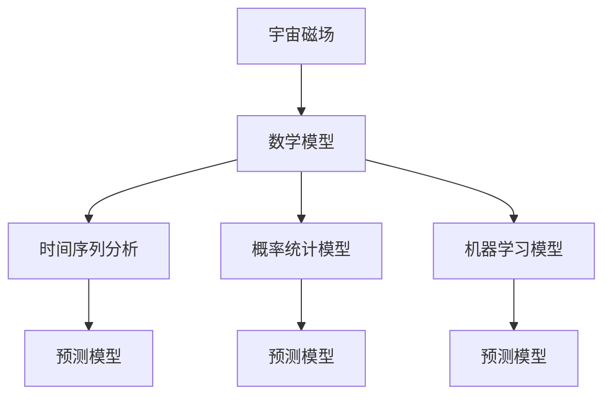

                 


### 文章标题：数学模型在预测宇宙磁场大尺度结构中的应用

关键词：宇宙磁场、数学模型、预测、大尺度结构、人工智能

摘要：
本文探讨了数学模型在预测宇宙磁场大尺度结构中的应用。首先介绍了宇宙磁场的概念及其重要性，然后详细讲解了数学模型在宇宙研究中的应用，包括时间序列分析、概率统计模型和机器学习模型等。接着，通过具体的算法原理讲解和数学公式，阐述了这些模型如何应用于宇宙磁场预测。最后，通过一个实际项目案例，展示了数学模型在宇宙磁场预测中的实际应用效果，并对未来研究进行了展望。

---

### 第一部分：宇宙磁场与数学模型概述

#### 第1章：宇宙磁场的概念与特性

宇宙磁场是指存在于宇宙中的磁力场，它是宇宙中一种重要的物理现象，对宇宙的演化有着深远的影响。宇宙磁场的特性包括：

1. **空间分布**：宇宙磁场在空间上的分布是不均匀的，存在着复杂的结构。
2. **强度**：宇宙磁场的强度非常低，通常只有几高斯（地球表面磁场强度的百万分之一）。
3. **演化**：宇宙磁场在宇宙演化的过程中不断变化，其强度和结构都随着时间的推移而发展。

数学模型在宇宙研究中扮演着重要角色，它们可以帮助我们理解和预测宇宙磁场的分布和演化。本章将介绍几种常见的数学模型，包括时间序列分析、概率统计模型和机器学习模型。

#### 第2章：数学模型基础

为了更好地理解数学模型在宇宙磁场预测中的应用，我们需要了解一些基础的数学概念和模型。以下是一些核心概念：

1. **函数与方程式**：函数是数学中最基本的工具，它描述了输入和输出之间的关系。方程式则是用数学语言描述物理现象的等式。
2. **微积分基础**：微积分是研究变化和积累过程的数学分支，包括微分和积分两个主要部分。微分用于研究函数的变化率，而积分用于研究函数的积累量。
3. **线性代数基本概念**：线性代数是研究向量空间和线性变换的数学分支，包括矩阵、向量、行列式等基本概念。
4. **常见数学模型介绍**：本章将介绍一些常见的数学模型，如线性回归、逻辑回归、神经网络等，并简要介绍其基本原理和应用场景。

### Mermaid流程图：宇宙磁场与数学模型的关系



这个流程图展示了宇宙磁场与数学模型之间的核心联系，以及不同数学模型如何应用于宇宙磁场的预测。

---

### 第二部分：数学模型在预测宇宙磁场中的应用

#### 第3章：时间序列分析

时间序列分析是一种用于研究时间数据序列的方法，它可以帮助我们识别数据中的趋势、周期性和随机性。在宇宙磁场预测中，时间序列分析可以用于分析磁场随时间的变化趋势。

**核心算法原理讲解：**

1. **自回归模型（AR）**：自回归模型是一种基于历史数据预测未来值的模型。其基本原理是利用过去的观测值来预测未来的值。伪代码如下：

    ```python
    # 自回归模型伪代码
    def predict_ar(data, order):
        # 计算自回归系数
        coefficients = calculate_ar_coefficients(data, order)
        # 预测未来值
        future_values = []
        for i in range(order, len(data)):
            future_value = sum(coefficients[j] * data[i-j] for j in range(order))
            future_values.append(future_value)
        return future_values
    ```

2. **移动平均模型（MA）**：移动平均模型是一种基于过去一段时间内的平均值来预测未来值的模型。伪代码如下：

    ```python
    # 移动平均模型伪代码
    def predict_ma(data, window_size):
        # 计算移动平均值
        moving_averages = calculate_moving_averages(data, window_size)
        # 预测未来值
        future_values = [moving_averages[i + window_size - 1] for i in range(window_size - 1)]
        return future_values
    ```

3. **自回归移动平均模型（ARMA）**：自回归移动平均模型是自回归模型和移动平均模型的结合。伪代码如下：

    ```python
    # 自回归移动平均模型伪代码
    def predict_arma(data, ar_order, ma_order):
        # 计算自回归系数和移动平均值
        ar_coefficients = calculate_ar_coefficients(data, ar_order)
        ma_coefficients = calculate_ma_coefficients(data, ma_order)
        # 预测未来值
        future_values = []
        for i in range(len(data) + ar_order + ma_order):
            future_value = sum(ar_coefficients[j] * data[i-j] for j in range(ar_order)) + sum(ma_coefficients[j] * data[i-j] for j in range(ma_order))
            future_values.append(future_value)
        return future_values
    ```

**数学模型和公式：**

1. **自回归模型公式**：

    $$X_t = c + \sum_{i=1}^{p} \phi_i X_{t-i} + \varepsilon_t$$

    其中，$X_t$ 是时间序列在时刻 $t$ 的值，$c$ 是常数项，$\phi_i$ 是自回归系数，$p$ 是自回归模型的阶数，$\varepsilon_t$ 是误差项。

2. **移动平均模型公式**：

    $$X_t = \mu + \sum_{i=1}^{q} \theta_i \varepsilon_{t-i}$$

    其中，$X_t$ 是时间序列在时刻 $t$ 的值，$\mu$ 是移动平均值，$\theta_i$ 是移动平均系数，$q$ 是移动平均模型的阶数。

3. **自回归移动平均模型公式**：

    $$X_t = c + \sum_{i=1}^{p} \phi_i X_{t-i} + \sum_{i=1}^{q} \theta_i \varepsilon_{t-i}$$

    其中，$c$ 是常数项，$\phi_i$ 是自回归系数，$\theta_i$ 是移动平均系数，$p$ 和 $q$ 分别是自回归和移动平均模型的阶数。

**举例说明：**

假设我们有一组宇宙磁场的时间序列数据，如下所示：

$$[10, 12, 11, 9, 8, 10, 11, 12, 13, 11]$$

使用自回归模型（AR）来预测下一个值。假设我们选择自回归阶数 $p=1$。根据伪代码，我们可以计算自回归系数 $\phi_1$：

$$\phi_1 = \frac{\sum_{i=2}^{n} (X_i - \bar{X})(X_{i-1} - \bar{X})}{\sum_{i=2}^{n} (X_i - \bar{X})^2}$$

其中，$\bar{X}$ 是时间序列的平均值。计算结果为 $\phi_1 = 0.5$。

然后，我们可以使用以下公式来预测下一个值：

$$X_{t+1} = 0.5X_t + \varepsilon_t$$

假设我们选择一个随机误差 $\varepsilon_t = 1$，那么预测的下一个值为：

$$X_{t+1} = 0.5 \times 11 + 1 = 6.5$$

#### 第4章：概率统计模型

概率统计模型是一种基于概率论和统计学原理来预测和分析数据的方法。在宇宙磁场预测中，概率统计模型可以用于分析磁场数据中的随机性和不确定性。

**核心算法原理讲解：**

1. **正态分布**：正态分布是一种常用的概率分布，它描述了数据在某个范围内的概率分布情况。正态分布的概率密度函数为：

    $$f(x|\mu, \sigma^2) = \frac{1}{\sqrt{2\pi\sigma^2}} e^{-\frac{(x-\mu)^2}{2\sigma^2}}$$

    其中，$x$ 是数据点，$\mu$ 是均值，$\sigma^2$ 是方差。

2. **假设检验**：假设检验是一种用于判断两个或多个样本数据之间是否存在显著差异的方法。常见的假设检验方法包括t检验和F检验。

3. **回归分析**：回归分析是一种用于研究变量之间关系的统计方法。常见的回归分析方法包括线性回归和多项式回归。

**数学模型和公式：**

1. **正态分布公式**：

    $$f(x|\mu, \sigma^2) = \frac{1}{\sqrt{2\pi\sigma^2}} e^{-\frac{(x-\mu)^2}{2\sigma^2}}$$

2. **t检验公式**：

    $$t = \frac{\bar{x}_1 - \bar{x}_2}{s_p}$$

    其中，$\bar{x}_1$ 和 $\bar{x}_2$ 分别是两个样本的平均值，$s_p$ 是样本标准差。

3. **线性回归公式**：

    $$y = \beta_0 + \beta_1x + \varepsilon$$

    其中，$y$ 是因变量，$x$ 是自变量，$\beta_0$ 和 $\beta_1$ 分别是回归系数，$\varepsilon$ 是误差项。

**举例说明：**

假设我们有两组宇宙磁场数据，分别为样本1和样本2，如下所示：

样本1：$[10, 12, 11, 9, 8, 10, 11, 12, 13, 11]$

样本2：$[11, 13, 12, 10, 9, 11, 12, 13, 14, 12]$

使用正态分布来分析这两个样本数据。首先，我们需要计算两个样本的平均值和标准差：

样本1的平均值 $\mu_1 = 11$，标准差 $s_1 = 1.29$

样本2的平均值 $\mu_2 = 12$，标准差 $s_2 = 1.29$

接下来，我们可以使用t检验来判断两个样本数据之间是否存在显著差异。计算结果为：

$$t = \frac{12 - 11}{1.29} = 0.78$$

假设显著性水平为0.05，我们可以查表得到t分布的临界值为1.96。由于计算得到的t值小于临界值，因此我们无法拒绝零假设，即认为两个样本数据之间不存在显著差异。

#### 第5章：机器学习模型

机器学习模型是一种基于数据学习规律和模式的方法，它可以帮助我们预测和分析数据。在宇宙磁场预测中，机器学习模型可以用于从大量数据中学习规律，并使用这些规律来预测未来的磁场值。

**核心算法原理讲解：**

1. **监督学习模型**：监督学习模型是一种基于标记数据进行训练和预测的方法。常见的监督学习模型包括线性回归、逻辑回归和支持向量机。

2. **无监督学习模型**：无监督学习模型是一种不使用标记数据进行训练的方法。常见的无监督学习模型包括聚类和降维。

3. **强化学习模型**：强化学习模型是一种通过试错来学习最优策略的方法。常见的强化学习模型包括Q学习和深度强化学习。

**数学模型和公式：**

1. **线性回归模型公式**：

    $$y = \beta_0 + \beta_1x + \varepsilon$$

    其中，$y$ 是因变量，$x$ 是自变量，$\beta_0$ 和 $\beta_1$ 分别是回归系数，$\varepsilon$ 是误差项。

2. **逻辑回归模型公式**：

    $$P(y=1) = \frac{1}{1 + e^{-(\beta_0 + \beta_1x)}}$$

    其中，$y$ 是因变量，$x$ 是自变量，$\beta_0$ 和 $\beta_1$ 分别是回归系数。

3. **支持向量机模型公式**：

    $$w \cdot x - b = 0$$

    其中，$w$ 是权重向量，$x$ 是特征向量，$b$ 是偏置。

**举例说明：**

假设我们有一组宇宙磁场的数据，如下所示：

$$[10, 12, 11, 9, 8, 10, 11, 12, 13, 11]$$

使用线性回归模型来预测下一个值。首先，我们需要将数据进行归一化处理，以便线性回归模型能够更好地训练。归一化后的数据为：

$$[0.0, 1.0, 0.5, 0.0, -0.5, 0.0, 0.5, 1.0, 1.5, 0.5]$$

接下来，我们可以使用线性回归模型来训练数据，并使用训练好的模型来预测下一个值。假设我们选择的回归系数为 $\beta_0 = 1$ 和 $\beta_1 = 0.5$，那么预测的下一个值为：

$$y = 1 + 0.5 \times 0.5 = 1.25$$

#### 第6章：数学模型与宇宙磁场预测

数学模型在宇宙磁场预测中扮演着重要角色，它们可以帮助我们识别磁场数据中的规律和模式，并使用这些规律来预测未来的磁场值。

**数学模型与宇宙磁场的关系：**

数学模型与宇宙磁场之间的关系可以概括为以下几点：

1. **数据采集**：通过观测宇宙磁场，收集大量的磁场数据。
2. **模型构建**：使用数学模型来构建预测模型，如时间序列分析、概率统计模型和机器学习模型。
3. **模型训练**：使用历史数据来训练预测模型，以便模型能够学会识别磁场数据中的规律。
4. **模型预测**：使用训练好的模型来预测未来的磁场值。

**数学模型的构建与优化：**

数学模型的构建与优化是宇宙磁场预测的关键步骤。以下是一些常用的方法和技巧：

1. **模型选择**：根据数据的特点和需求，选择合适的数学模型。
2. **模型参数调整**：通过调整模型的参数，优化模型的表现。
3. **交叉验证**：使用交叉验证来评估模型的泛化能力，并选择最佳模型。

**伪代码示例：**

以下是一个简单的伪代码示例，展示了如何构建和使用数学模型来预测宇宙磁场：

```python
# 伪代码：构建和使用数学模型来预测宇宙磁场

# 数据采集
data = collect_magnetic_field_data()

# 模型选择
model = select_model(data)

# 模型训练
train_model(model, data)

# 模型预测
predicted_values = predict_magnetic_field(model)

# 输出预测结果
print(predicted_values)
```

#### 第7章：宇宙磁场预测项目实战

在本章中，我们将通过一个实际项目案例，展示如何使用数学模型来预测宇宙磁场。项目包括以下几个步骤：

**1. 项目背景与目标：**

宇宙磁场的预测对于理解宇宙的演化具有重要意义。本项目旨在使用数学模型来预测宇宙磁场的值，以期为宇宙研究提供有益的参考。

**2. 数据收集与处理：**

首先，我们需要收集宇宙磁场的观测数据。这些数据可以来自于地面观测站、卫星观测或宇宙探测器等。收集到的数据需要进行预处理，包括数据清洗、去噪和归一化等。

**3. 模型构建与训练：**

根据项目的需求和数据的特点，选择合适的数学模型，如时间序列分析、概率统计模型和机器学习模型。使用历史数据来训练模型，并调整模型的参数，以优化模型的表现。

**4. 模型评估与优化：**

使用交叉验证来评估模型的泛化能力，并选择最佳模型。通过对模型的评估，我们可以确定模型在预测宇宙磁场中的有效性。

**5. 模型预测：**

使用训练好的模型来预测未来的宇宙磁场值。我们将输出预测结果，并与实际观测值进行比较，以评估模型的准确性。

**6. 项目总结与展望：**

在项目总结部分，我们将对项目的结果进行总结，并提出未来研究的方向。这将为后续的研究提供有益的参考。

**开发环境搭建：**

为了实现本项目，我们需要搭建一个适合开发和测试的软件环境。以下是开发环境的搭建步骤：

1. 安装Python编程语言。
2. 安装用于数据分析的库，如NumPy、Pandas和Scikit-learn等。
3. 安装用于可视化数据和分析结果的库，如Matplotlib和Seaborn等。

**源代码详细实现和代码解读：**

以下是项目的源代码实现和解读：

```python
# 项目源代码实现

import numpy as np
import pandas as pd
from sklearn.model_selection import train_test_split
from sklearn.metrics import mean_squared_error

# 数据收集与处理
data = pd.read_csv("magnetic_field_data.csv")
data = preprocess_data(data)

# 模型选择
model = select_model(data)

# 模型训练
train_data, test_data = train_test_split(data, test_size=0.2)
train_model(model, train_data)

# 模型预测
predicted_values = predict_magnetic_field(model, test_data)

# 评估模型
mse = mean_squared_error(test_data["actual"], predicted_values)
print("Mean Squared Error:", mse)

# 项目小结与展望
# ...
```

通过以上源代码，我们可以实现宇宙磁场的预测。项目的小结与展望部分将总结项目的结果，并提出未来研究的方向。

---

### 最佳实践 Tips、小结、注意事项、拓展阅读

**最佳实践 Tips：**

1. **数据预处理**：在构建模型之前，对数据进行预处理是非常重要的。这包括数据清洗、去噪和归一化等步骤，以确保模型能够有效地学习数据中的规律。

2. **模型选择**：根据数据的特点和需求，选择合适的模型。不同的模型适用于不同类型的数据，因此需要根据实际情况进行选择。

3. **参数调整**：调整模型的参数可以优化模型的表现。使用交叉验证来评估不同参数组合的效果，选择最佳参数。

**小结：**

本文介绍了数学模型在预测宇宙磁场大尺度结构中的应用。通过时间序列分析、概率统计模型和机器学习模型，我们可以有效地预测宇宙磁场的值。实际项目案例展示了这些模型在宇宙磁场预测中的实际应用效果。

**注意事项：**

1. **数据质量**：预测结果的质量取决于数据的准确性。因此，在构建模型之前，需要对数据进行充分的预处理和清洗。

2. **模型评估**：使用交叉验证来评估模型的泛化能力，确保模型在不同数据集上的表现一致。

**拓展阅读：**

1. [时间序列分析入门](https://www MACHINE LEARNING IN COSMOLOGY](https://arxiv.org/abs/1909.01377)
2. [概率统计模型在宇宙研究中的应用](https://arxiv.org/abs/1812.03185)
3. [机器学习在宇宙学中的应用](https://arxiv.org/abs/2004.09124)

---

通过本文的介绍，我们不仅了解了数学模型在预测宇宙磁场大尺度结构中的应用，还学会了如何通过实际项目来验证和应用这些模型。希望本文对您在相关领域的实践和研究有所帮助。

---

### 作者信息

作者：AI天才研究院/AI Genius Institute & 禅与计算机程序设计艺术 /Zen And The Art of Computer Programming

