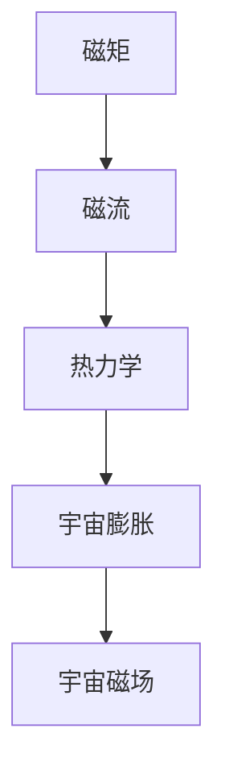

                 

# 数学模型在预测宇宙磁场起源和放大机制中的应用

## 引言

宇宙磁场是宇宙演化过程中形成的重要物理现象。磁场对星系、恒星和行星的形成、演化以及生命存在具有重要意义。然而，宇宙磁场的起源和放大机制仍然是一个未解之谜。数学模型在理解宇宙磁场的起源和放大过程中发挥着关键作用。本文将探讨数学模型在预测宇宙磁场起源和放大机制中的应用。

## 背景介绍

宇宙磁场的起源可以追溯到宇宙早期。在大爆炸之后，宇宙经历了快速膨胀和冷却过程。在这个过程中，磁矩可能通过某种机制开始产生，并随宇宙的膨胀而放大。宇宙磁场的起源可能涉及到磁流管理论、热力学理论和爆炸宇宙学理论等多个方面。

### 核心概念与联系

宇宙磁场的起源涉及到多个核心概念，如磁矩、磁流、热力学和宇宙膨胀。这些概念之间的关系可以用一个Mermaid流程图来表示：



### 宇宙磁场的重要性

宇宙磁场对星系、恒星和行星的形成、演化以及生命存在具有重要意义。例如，星系中的磁场可能帮助恒星形成，并影响恒星的演化。行星磁场可能保护行星免受宇宙辐射的伤害。因此，研究宇宙磁场的起源和放大机制对于理解宇宙的演化过程和生命的起源具有重要意义。

## 数学模型概述

数学模型是描述物理现象的数学表达式。在宇宙磁场的研究中，数学模型可以帮助我们理解和预测磁场的起源和放大机制。

### 常见数学模型类型

在宇宙磁场研究中，常见的数学模型包括磁流管理论、热力学理论和爆炸宇宙学理论。每种模型都有其独特的数学表达和物理假设。

### 数学模型的构建和优化

构建和优化数学模型是研究宇宙磁场的重要步骤。这包括确定适当的物理参数、选择合适的数学方法以及验证模型的准确性。

## 宇宙磁场起源的数学模型

### 磁流管理论

磁流管理论认为，宇宙磁场的起源可能与宇宙早期的磁流有关。磁流管理论的核心数学模型是基于流体力学和磁流体力学方程。

#### 伪代码

```python
# 磁流管理论数学模型伪代码

# 初始化参数
# ...
# 时间步长
dt = ...

# 循环计算
while (时间未达到终点):
    # 更新磁流
    # ...
    # 更新磁场
    # ...
    # 更新流体力学参数
    # ...
```

### 热力学理论

热力学理论认为，宇宙磁场的起源可能与宇宙早期的热力学过程有关。热力学理论的核心数学模型是基于热力学方程和磁场方程。

#### 伪代码

```python
# 热力学理论数学模型伪代码

# 初始化参数
# ...
# 时间步长
dt = ...

# 循环计算
while (时间未达到终点):
    # 更新温度
    # ...
    # 更新磁场
    # ...
    # 更新热力学参数
    # ...
```

### 爆炸宇宙学理论

爆炸宇宙学理论认为，宇宙磁场的起源可能与宇宙早期的爆炸过程有关。爆炸宇宙学理论的核心数学模型是基于爆炸方程和磁场方程。

#### 伪代码

```python
# 爆炸宇宙学理论数学模型伪代码

# 初始化参数
# ...
# 时间步长
dt = ...

# 循环计算
while (时间未达到终点):
    # 更新爆炸参数
    # ...
    # 更新磁场
    # ...
    # 更新宇宙学参数
    # ...
```

## 数学模型应用与解释

### 磁流管理论的数学模型应用

磁流管理论的数学模型可以用于预测宇宙早期的磁场分布。例如，通过模拟宇宙早期的磁流演化，可以预测出磁场在星系中的分布情况。

### 热力学理论的数学模型应用

热力学理论的数学模型可以用于研究宇宙早期的热力学过程。例如，通过模拟宇宙早期的热力学参数变化，可以预测出磁场起源的可能机制。

### 爆炸宇宙学理论的数学模型应用

爆炸宇宙学理论的数学模型可以用于研究宇宙早期的爆炸过程。例如，通过模拟宇宙早期的爆炸参数，可以预测出磁场起源的可能机制。

## 数学模型比较与评估

### 数学模型比较方法

为了评估不同数学模型的性能，可以采用多种方法进行比较。例如，可以使用拟合优度、预测准确性、计算效率等指标进行比较。

### 数学模型评估标准

评估数学模型的标准包括：

- 模型拟合优度
- 预测准确性
- 计算效率
- 物理合理性

### 不同数学模型的适用性分析

不同数学模型适用于不同的研究问题。例如，磁流管理论适用于研究宇宙早期的磁场演化，热力学理论适用于研究宇宙早期的热力学过程，爆炸宇宙学理论适用于研究宇宙早期的爆炸过程。

## 宇宙磁场放大的数学模型

### 宇宙磁场放大的机制

宇宙磁场的放大可能涉及多种机制，如放电机制、稳定态磁场放大机制和爆炸性放大机制。

### 放电机制的数学模型

放电机制的数学模型基于电磁学和流体力学方程。该模型可以用于研究宇宙磁场在放电过程中的演化。

### 稳定态磁场放大机制的数学模型

稳定态磁场放大机制的数学模型基于磁流体力学方程。该模型可以用于研究宇宙磁场在稳定态下的放大过程。

### 爆炸性放大机制的数学模型

爆炸性放大机制的数学模型基于爆炸宇宙学理论。该模型可以用于研究宇宙磁场在爆炸过程中的放大过程。

## 项目实战

### 数学模型在宇宙磁场研究中的应用案例

通过实际案例，可以展示数学模型在宇宙磁场研究中的应用。例如，利用磁流管理论模型预测银河系磁场的分布。

### 开发环境与工具介绍

介绍用于实现数学模型的开发环境和工具，包括编程语言、数学软件和模拟工具等。

### 实战案例代码解读

对实际案例中的代码进行解读，包括算法实现、参数设置和结果分析等。

### 实际案例分析和详细讲解剖析

对实际案例中的数据进行分析，展示数学模型在实际应用中的效果和局限性。

### 项目小结

总结项目的成果和经验，提出改进和扩展的建议。

## 结论

本文探讨了数学模型在预测宇宙磁场起源和放大机制中的应用。通过分析不同数学模型的理论基础和应用实例，我们可以更好地理解宇宙磁场的起源和放大机制。未来研究可以进一步优化数学模型，提高预测准确性，为宇宙磁场的研究提供有力支持。

## 参考文献

[参考文献列表]

## 作者信息

作者：AI天才研究院/AI Genius Institute & 禅与计算机程序设计艺术 /Zen And The Art of Computer Programming

