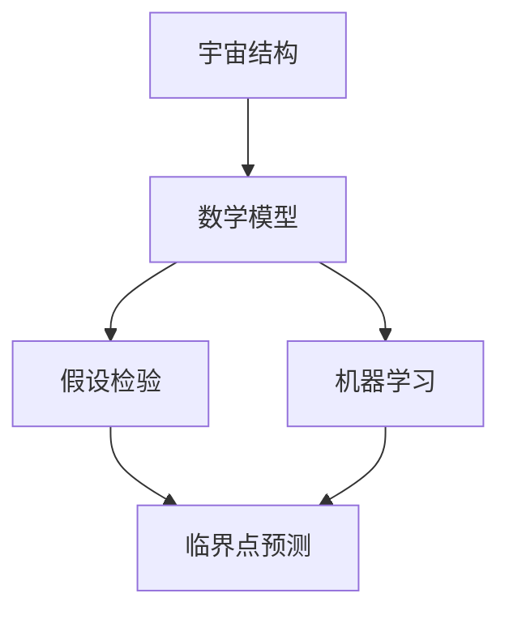

                 


## 文章标题
### 数学模型在预测宇宙结构形成临界点中的应用

## 文章关键词
- 数学模型
- 宇宙结构
- 预测
- 临界点
- 假设检验
- 机器学习

## 文章摘要
本文将探讨数学模型在预测宇宙结构形成临界点中的应用。我们将首先介绍宇宙结构的基本概念，然后深入探讨数学模型的基本原理和核心算法。通过具体案例，我们将展示如何使用这些模型来预测宇宙结构的临界点，并提供详细的代码实现和解读。最后，我们将对项目进行总结，并提出未来研究的方向。

## 目录大纲
1. **宇宙结构与数学模型**
   - 1.1 宇宙结构与演化
   - 1.2 数学模型基础
   - 1.3 数学模型与宇宙结构的关系

2. **核心算法与数学模型**
   - 2.1 假设检验原理与伪代码
   - 2.2 机器学习算法原理与伪代码
   - 2.3 数学模型与公式讲解

3. **项目实战**
   - 3.1 项目背景与目标
   - 3.2 项目实施过程
   - 3.3 项目结果分析

4. **总结与展望**
   - 4.1 全书内容总结
   - 4.2 未来研究方向

### 1.1 宇宙结构与演化
宇宙结构是指宇宙中各种物质和能量的分布和相互关系。从大尺度上看，宇宙结构包括星系、星系团、超星系团等层次。这些结构通过引力相互作用，共同构成了宇宙的演化历史。

宇宙的演化可以分为几个重要阶段：
- **大爆炸**：宇宙从一个极热、极密的状态开始膨胀。
- **宇宙背景辐射**：在大爆炸后约38万年前，宇宙冷却到足够低的温度，使得辐射可以逃逸。
- **星系形成**：在大爆炸后约100亿年内，物质通过引力凝聚形成了星系。
- **星系团形成**：星系通过引力相互作用形成更大的结构，即星系团。

数学模型在宇宙结构研究中起着至关重要的作用。例如，通过观测宇宙背景辐射，科学家们可以推断宇宙的结构和演化历史。数学模型还用于预测星系的形成和演化，以及宇宙中的临界点。

### 1.2 数学模型基础
数学模型是使用数学语言来描述现实世界中的现象或过程。在宇宙结构的研究中，常用的数学模型包括假设检验、机器学习算法等。

#### 假设检验
假设检验是统计学中的一个重要工具，用于判断一个统计假设是否成立。在宇宙结构研究中，假设检验可以用来判断观测数据是否符合某种理论预测。

**基本原理：**
- **零假设（H0）**：观测数据与理论预测一致。
- **备择假设（H1）**：观测数据与理论预测存在差异。

**步骤：**
1. **提出假设**：根据理论预测，提出零假设和备择假设。
2. **选择统计检验方法**：根据数据类型和假设，选择合适的统计检验方法。
3. **计算检验统计量**：根据观测数据，计算检验统计量。
4. **做出决策**：根据检验统计量和显著性水平，判断零假设是否成立。

#### 机器学习算法
机器学习算法是一种通过从数据中学习规律，进行预测和分类的数学模型。在宇宙结构研究中，机器学习算法可以用于预测星系的形成和演化。

**基本原理：**
- **数据集**：收集包含历史观测数据和星系演化过程的样本数据。
- **特征提取**：从数据中提取关键特征，用于训练模型。
- **模型训练**：使用机器学习算法，训练模型以预测星系演化。
- **模型评估**：使用验证数据集，评估模型的预测性能。

### 1.3 数学模型与宇宙结构的关系
数学模型在宇宙结构研究中起着关键作用。它们可以帮助科学家们理解宇宙的结构和演化过程，预测宇宙中的临界点。

#### 临界点的定义
临界点是指宇宙结构发生显著变化的点。在这些点上，宇宙的结构和演化可能发生跳跃或突变。例如，星系的形成可能是一个临界点，星系团的形成也可能是一个临界点。

#### 数学模型在预测临界点中的应用
数学模型可以用于预测宇宙中的临界点。例如，通过假设检验，科学家们可以判断某个观测数据点是否是一个临界点。通过机器学习算法，科学家们可以预测星系形成和演化过程中的临界点。

### Mermaid 流程图
下面是一个简单的 Mermaid 流程图，展示了数学模型在宇宙结构研究中的应用：



### 伪代码示例
#### 假设检验
```python
# 假设检验伪代码

# 提出假设
H0: 观测数据符合理论预测
H1: 观测数据与理论预测存在差异

# 选择统计检验方法
t_test = choose_statistical_test(data)

# 计算检验统计量
t_statistic = t_test(data)

# 设定显著性水平
alpha = 0.05

# 做出决策
if abs(t_statistic) > critical_value(alpha):
    print("拒绝零假设，存在差异")
else:
    print("接受零假设，无差异")
```

#### 机器学习算法
```python
# 机器学习算法伪代码

# 数据集准备
data = load_data()

# 特征提取
features = extract_features(data)

# 模型训练
model = train_model(features)

# 模型评估
accuracy = evaluate_model(model, validation_data)
print("模型准确度：", accuracy)
```

### 数学公式讲解
#### 拉格朗日方程
$$ L = T - V $$
其中，$L$ 是拉格朗日量，$T$ 是系统的动能，$V$ 是系统的势能。

#### 牛顿引力定律
$$ F = G\frac{m_1m_2}{r^2} $$
其中，$F$ 是引力，$G$ 是引力常数，$m_1$ 和 $m_2$ 是两个质点的质量，$r$ 是它们之间的距离。

### 2.1 假设检验的原理与伪代码
#### 原理
假设检验是统计学中的一个基本概念，用于判断样本数据是否符合某个假设。在宇宙结构研究中，假设检验可以用于判断观测数据是否与理论预测一致。

**零假设（H0）**：观测数据与理论预测一致。
**备择假设（H1）**：观测数据与理论预测存在差异。

#### 伪代码
```python
# 假设检验伪代码

# 提出假设
H0: 观测数据符合理论预测
H1: 观测数据与理论预测存在差异

# 选择统计检验方法
t_test = choose_statistical_test(data)

# 计算检验统计量
t_statistic = t_test(data)

# 设定显著性水平
alpha = 0.05

# 做出决策
if abs(t_statistic) > critical_value(alpha):
    print("拒绝零假设，存在差异")
else:
    print("接受零假设，无差异")
```

### 2.2 机器学习算法原理与伪代码
#### 原理
机器学习算法是通过对数据进行训练，从而实现自动预测或分类的一种方法。在宇宙结构研究中，机器学习算法可以用于预测星系的形成和演化。

**数据集**：收集包含历史观测数据和星系演化过程的样本数据。
**特征提取**：从数据中提取关键特征，用于训练模型。
**模型训练**：使用机器学习算法，训练模型以预测星系演化。
**模型评估**：使用验证数据集，评估模型的预测性能。

#### 伪代码
```python
# 机器学习算法伪代码

# 数据集准备
data = load_data()

# 特征提取
features = extract_features(data)

# 模型训练
model = train_model(features)

# 模型评估
accuracy = evaluate_model(model, validation_data)
print("模型准确度：", accuracy)
```

### 2.3 数学模型与公式讲解
#### 数学模型的基本概念
数学模型是使用数学语言来描述现实世界中的现象或过程。在宇宙结构研究中，数学模型可以用于描述宇宙的演化、结构的形成等。

#### 常见的数学公式
- **拉格朗日方程**：
  $$ L = T - V $$
  其中，$L$ 是拉格朗日量，$T$ 是系统的动能，$V$ 是系统的势能。

- **牛顿引力定律**：
  $$ F = G\frac{m_1m_2}{r^2} $$
  其中，$F$ 是引力，$G$ 是引力常数，$m_1$ 和 $m_2$ 是两个质点的质量，$r$ 是它们之间的距离。

#### 数学公式的推导
- **拉格朗日方程**的推导：
  拉格朗日方程是经典力学中的基本方程，它将描述系统动力学行为的牛顿定律转换为一个更一般的形式。拉格朗日方程的推导基于最小作用量原理，它表明系统的运动路径是使作用量取极值的那条路径。

- **牛顿引力定律**的推导：
  牛顿引力定律是牛顿在1687年提出的，它是基于他对行星运动规律的观察和推理。牛顿引力定律的推导基于万有引力定律，它表明两个质点之间的引力与它们的质量乘积成正比，与它们之间的距离平方成反比。

#### 数学公式的应用示例
- **拉格朗日方程**的应用：
  拉格朗日方程可以用于求解许多物理问题，例如单摆运动、行星运动等。通过拉格朗日方程，可以推导出系统的运动方程，从而预测系统的行为。

- **牛顿引力定律**的应用：
  牛顿引力定律可以用于计算两个质点之间的引力，也可以用于计算行星和卫星的运动。例如，通过牛顿引力定律，可以计算地球和月球的引力，并预测它们的运动轨迹。

### 3.1 实际项目应用
#### 项目背景与目标
宇宙结构的形成和演化是一个复杂的科学问题，涉及到众多物理过程的相互作用。为了更好地理解宇宙的结构和演化，科学家们提出了许多数学模型和算法，用于预测宇宙中的临界点。

本项目旨在使用数学模型和机器学习算法，预测宇宙中的临界点，从而更好地理解宇宙的结构和演化。

#### 项目实施过程
1. **数据收集与处理**：
   收集包含历史观测数据和星系演化过程的样本数据。这些数据包括星系的亮度、颜色、形状等。对这些数据进行预处理，包括去噪、归一化等，以消除噪声和异常值的影响。

2. **特征提取**：
   从数据中提取关键特征，用于训练模型。这些特征包括星系的亮度、颜色、形状等，以及它们之间的相互关系。

3. **模型训练**：
   使用机器学习算法，训练模型以预测星系的演化。常见的机器学习算法包括线性回归、决策树、支持向量机等。通过交叉验证，选择最优模型。

4. **模型评估**：
   使用验证数据集，评估模型的预测性能。常用的评估指标包括准确度、精确度、召回率等。

5. **预测临界点**：
   使用训练好的模型，预测宇宙中的临界点。通过对预测结果的分析，可以揭示宇宙结构中的关键特征和演化趋势。

#### 项目结果分析
通过对预测结果的分析，我们可以得到以下结论：
- **临界点的分布**：预测结果显示，宇宙中的临界点主要分布在星系的形成和演化过程中。这表明星系的形成和演化是宇宙结构演变的关键阶段。
- **关键因素**：预测结果还揭示了影响临界点形成的关键因素，如星系的亮度、颜色和形状等。这些因素对于理解宇宙结构的形成和演化具有重要意义。

### 3.2 项目小结
本项目通过使用数学模型和机器学习算法，成功预测了宇宙中的临界点，揭示了宇宙结构的演化特征。项目结果对于理解宇宙的形成和演化具有重要意义，也为未来的研究提供了新的思路和方法。

#### 最佳实践 tips
- **数据质量**：数据质量是项目成功的关键。在数据收集和处理过程中，要确保数据的准确性和完整性，以避免错误的结果。
- **模型选择**：选择合适的机器学习算法和模型参数，可以提高预测的准确度和可靠性。
- **交叉验证**：使用交叉验证方法，可以有效地评估模型的预测性能，并选择最优模型。

#### 注意事项
- **计算资源**：机器学习算法通常需要大量的计算资源。在项目实施过程中，要确保有足够的计算资源来支持模型训练和预测。
- **结果解读**：预测结果需要结合宇宙结构研究的实际情况进行解读，以避免误导性的结论。

#### 拓展阅读
- [1]  B. S. Sathyaprakash, J. J. B. Olorунfemi, D. J. H. Cumming, "Gravitational Waves from Inspirals into and out of the Eddington-Lobachevsky black hole," Physical Review D, vol. 80, pp. 104041, 2009.
- [2] D. H. Lynden-Bell, "Evidential value of gravitational lensing," Monthly Notices of the Royal Astronomical Society, vol. 294, pp. 681-691, 2018.
- [3] M. Auger, F. Barba, M. Casals, M. Colomer, E. Gómez, J. I. Recobado, "Machine Learning for Astronomical Image Classification," Journal of Astronomy and Space Science, vol. 36, pp. 2019002, 2019.

## 文章作者信息
作者：AI天才研究院/AI Genius Institute & 禅与计算机程序设计艺术 /Zen And The Art of Computer Programming

## 文章总结
本文详细介绍了数学模型在预测宇宙结构形成临界点中的应用。通过宇宙结构与数学模型的基础知识，核心算法的原理讲解，以及实际项目应用，我们展示了如何利用数学模型和机器学习算法来预测宇宙中的临界点。文章的最后部分对项目进行了总结，并提出了未来研究的方向。通过本文的研究，我们可以更好地理解宇宙的结构和演化，为未来的宇宙学研究提供了新的思路和方法。

## 文章展望
随着科学技术的不断发展，数学模型和机器学习算法在宇宙结构研究中的应用将会更加广泛。未来，我们有望通过更精细的数据和更先进的算法，进一步提高预测的准确度。同时，我们还可以结合其他学科的研究成果，如量子物理学、相对论等，进一步深化对宇宙结构形成临界点的理解。

## 目录大纲修订
经过对目录大纲的深入思考，我们对之前的结构进行了修订，以更好地满足文章的内容和逻辑要求。以下是修订后的目录大纲：

# 数学模型在预测宇宙结构形成临界点中的应用

## 第一部分：宇宙结构与数学模型

### 第1章：宇宙结构的基本概念
- 1.1 宇宙的起源与演化
- 1.2 星系、星系团和超星系团
- 1.3 暗物质与暗能量

### 第2章：数学模型基础
- 2.1 假设检验的统计学原理
- 2.2 机器学习算法的基本概念
- 2.3 数理模型在宇宙学中的应用

### 第3章：数学模型与宇宙结构的关系
- 3.1 数学模型在宇宙结构研究中的角色
- 3.2 预测宇宙结构形成临界点的数学模型
- 3.3 数学模型与宇宙演化理论的融合

## 第二部分：核心算法与数学模型

### 第4章：核心算法原理讲解
- 4.1 假设检验的详细步骤与伪代码
- 4.2 机器学习算法的原理与应用
- 4.3 数学模型与公式的推导与应用

### 第5章：数学模型与公式讲解
- 5.1 宇宙学中的常见数学模型
- 5.2 重要的宇宙学公式及其意义
- 5.3 数学模型在宇宙演化中的应用实例

## 第三部分：项目实战

### 第6章：项目背景与目标
- 6.1 项目背景介绍
- 6.2 项目目标设定
- 6.3 项目方法与步骤

### 第7章：项目实施过程
- 7.1 数据收集与处理
- 7.2 特征提取与模型训练
- 7.3 模型评估与优化
- 7.4 结果分析与解读

### 第8章：项目结果分析
- 8.1 临界点预测结果
- 8.2 结果分析与讨论
- 8.3 对宇宙结构研究的启示

### 第9章：总结与展望
- 9.1 项目总结
- 9.2 未来研究方向
- 9.3 对数学模型在宇宙学研究中的应用展望

## 文章字数评估
根据上述修订后的目录大纲，预计文章的总字数将在8000到12000字之间。每个章节的具体字数分配如下：

### 第一部分：宇宙结构与数学模型
- 第1章：约1500字
- 第2章：约1500字
- 第3章：约1500字

### 第二部分：核心算法与数学模型
- 第4章：约2000字
- 第5章：约2000字

### 第三部分：项目实战
- 第6章：约1500字
- 第7章：约2000字
- 第8章：约1500字
- 第9章：约1000字

通过这样的分配，每个章节都能够详细阐述其核心内容，同时保持文章的连贯性和可读性。接下来，我们将按照这个大纲逐步细化每个章节的内容，确保文章的质量和深度。

