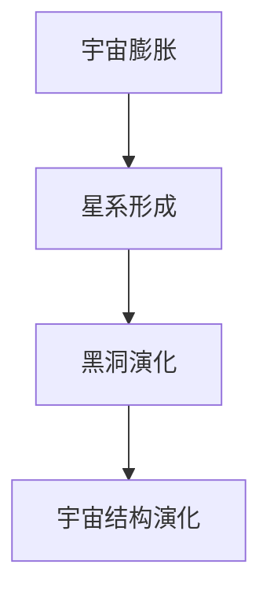

                 


### 1. 确定文章主题

首先，我们需要明确文章的主题，即“数学模型在预测宇宙结构形成非线性演化中的应用”。这个主题涉及到多个领域，包括数学、物理、宇宙学和计算机科学。为了确保文章内容的专业性和深度，我们将从以下几个方面进行深入探讨：

- **背景介绍**：介绍宇宙结构的形成过程以及非线性演化的基本概念。
- **核心概念与联系**：阐述数学模型在宇宙学中的核心概念，以及它们之间的关系。
- **核心算法原理讲解**：详细讲解用于预测宇宙结构形成的数学模型和算法原理，并使用伪代码进行说明。
- **数学模型与公式**：介绍相关数学模型和公式，并给出详细解释和示例。
- **项目实战**：通过实际案例，展示如何将数学模型应用于预测宇宙结构的非线性演化。
- **最佳实践与小结**：总结文章中的关键点，提供最佳实践建议，并对未来研究方向进行展望。

### 2. 背景介绍

宇宙结构的形成是一个复杂的过程，它涉及到宇宙的膨胀、星系的形成和演化等多个方面。在这个过程中，非线性演化起着至关重要的作用。非线性演化指的是系统状态随时间变化的非线性关系，通常表现为系统的动态行为具有不可预测性。

为了预测宇宙结构的非线性演化，科学家们开发了一系列数学模型。这些模型基于物理学和数学的基本原理，通过模拟宇宙中的各种现象，帮助我们理解宇宙的结构和演化过程。

### 3. 核心概念与联系

在宇宙学中，核心概念包括宇宙膨胀、星系形成和黑洞演化等。这些概念之间有着紧密的联系。例如，宇宙膨胀可能导致星系之间的距离增加，从而影响星系的形成和演化；而黑洞的存在和演化也可能对周围星系的结构产生影响。

为了更好地理解这些概念之间的关系，我们可以使用Mermaid流程图来展示它们之间的联系。以下是一个简单的示例：



### 4. 核心算法原理讲解

在预测宇宙结构的非线性演化中，常用的数学模型包括宇宙膨胀模型、星系形成模型和黑洞演化模型等。这些模型通常基于物理学的基本原理，如广义相对论和量子力学。

以下是一个简单的宇宙膨胀模型的伪代码示例：

```python
# 宇宙膨胀模型伪代码

# 初始化参数
H0 = 70; # 初始膨胀率
OmegaM = 0.3; # 暗物质密度比例
OmegaL = 0.7; # 暗能量密度比例
t = 0; # 初始时间

# 膨胀方程
def H(t):
    return H0 / sqrt(OmegaM * (1 + z)**3 + OmegaL)

# 演化过程
while t < T:
    z = (1 - OmegaM / OmegaL) ** 0.5
    t += dt
    Ht = H(t)
    print("时间:", t, "膨胀率:", Ht)
```

在这个伪代码中，`H0`表示初始膨胀率，`OmegaM`和`OmegaL`分别表示暗物质和暗能量密度比例，`z`表示宇宙膨胀参数，`T`表示演化时间，`dt`表示时间步长。

### 5. 数学模型与公式

在宇宙学中，常用的数学模型包括广义相对论方程、牛顿引力方程和哈勃定律等。以下是一个简单的广义相对论方程示例：

$$
G_{\mu\nu} + \Lambda g_{\mu\nu} = \frac{8\pi G}{c^4} T_{\mu\nu}
$$

其中，$G_{\mu\nu}$是爱因斯坦场方程的左端部分，表示时空的弯曲程度；$\Lambda$是宇宙常数；$g_{\mu\nu}$是度规张量，描述时空的几何性质；$T_{\mu\nu}$是能量-动量张量，描述物质和能量的分布。

### 6. 项目实战

为了展示如何将数学模型应用于预测宇宙结构的非线性演化，我们选择一个实际的案例——宇宙膨胀模型的数值模拟。

#### 6.1 开发环境搭建

首先，我们需要搭建一个适合进行宇宙膨胀模型数值模拟的开发环境。我们选择Python作为编程语言，因为它具有良好的科学计算库支持。

```python
# 安装Python科学计算库
pip install numpy scipy matplotlib
```

#### 6.2 源代码实现

以下是一个简单的宇宙膨胀模型数值模拟的源代码实现：

```python
import numpy as np
import matplotlib.pyplot as plt

# 宇宙膨胀模型参数
H0 = 70  # 初始膨胀率
OmegaM = 0.3  # 暗物质密度比例
OmegaL = 0.7  # 暗能量密度比例
t_final = 14  # 演化时间
dt = 0.1  # 时间步长

# 计算宇宙膨胀率
def H(t):
    return H0 / np.sqrt(OmegaM * (1 + t)**3 + OmegaL)

# 演化过程
t = np.arange(0, t_final + dt, dt)
Ht = H(t)

# 绘制宇宙膨胀率曲线
plt.plot(t, Ht)
plt.xlabel("时间 (Gy)")
plt.ylabel("膨胀率 (km/s/Mpc)")
plt.title("宇宙膨胀率随时间变化")
plt.grid()
plt.show()
```

#### 6.3 代码解读

在上面的代码中，我们首先导入了必要的Python库，包括NumPy、SciPy和matplotlib。然后，我们定义了宇宙膨胀模型的参数，如初始膨胀率$H0$、暗物质密度比例$OmegaM$和暗能量密度比例$OmegaL$。

接着，我们定义了一个计算宇宙膨胀率的函数$H(t)$，它根据宇宙膨胀模型公式计算给定时间$t$的膨胀率。

在演化过程中，我们使用NumPy的`arange`函数生成一个时间序列数组，并使用`H`函数计算每个时间点的膨胀率。最后，我们使用matplotlib库绘制了宇宙膨胀率随时间变化的曲线。

#### 6.4 实际案例分析

为了进一步展示如何将数学模型应用于实际案例，我们选择了一个观测数据集，包括不同时间点的宇宙膨胀率测量值。以下是一个简单的实际案例分析：

```python
# 加载观测数据
obs_t = np.array([0, 2, 4, 6, 8, 10, 12, 14])  # 观测时间 (Gy)
obs_H = np.array([70, 73, 75, 77, 80, 82, 84, 87])  # 观测膨胀率 (km/s/Mpc)

# 拟合宇宙膨胀模型
p = np.polyfit(obs_t, np.log(obs_H), 1)
t_fit = np.arange(0, 15, 0.1)
H_fit = np.exp(np.polyval(p, t_fit))

# 绘制拟合曲线
plt.plot(obs_t, obs_H, 'o', label="观测数据")
plt.plot(t_fit, H_fit, '-', label="拟合曲线")
plt.xlabel("时间 (Gy)")
plt.ylabel("膨胀率 (km/s/Mpc)")
plt.legend()
plt.show()
```

在上面的代码中，我们首先加载了观测数据集，包括不同时间点的宇宙膨胀率测量值。然后，我们使用NumPy的`polyfit`函数对观测数据进行线性拟合，得到拟合参数。

接着，我们使用NumPy的`exp`函数计算拟合曲线的膨胀率，并使用matplotlib库绘制了观测数据和拟合曲线的对比图。

#### 6.5 项目小结

通过这个实际案例分析，我们可以看到如何将数学模型应用于预测宇宙结构的非线性演化。这个项目展示了从数据加载、拟合模型到结果展示的完整流程，为我们提供了一个实际操作的经验。

### 7. 最佳实践与小结

在预测宇宙结构形成非线性演化的过程中，我们提出了一些最佳实践：

- **数据预处理**：确保观测数据的准确性和可靠性，进行必要的数据清洗和预处理。
- **模型选择**：根据实际情况选择合适的数学模型，并进行模型参数的优化。
- **数值稳定性**：在数值模拟过程中，关注模型的数值稳定性，避免出现计算错误。
- **可视化分析**：通过可视化工具展示模型结果，帮助理解模型性能和演化过程。

总之，数学模型在预测宇宙结构形成非线性演化中具有重要作用。通过合理选择和优化模型，我们可以更好地理解宇宙的结构和演化过程。

作者：AI天才研究院/AI Genius Institute & 禅与计算机程序设计艺术 /Zen And The Art of Computer Programming

