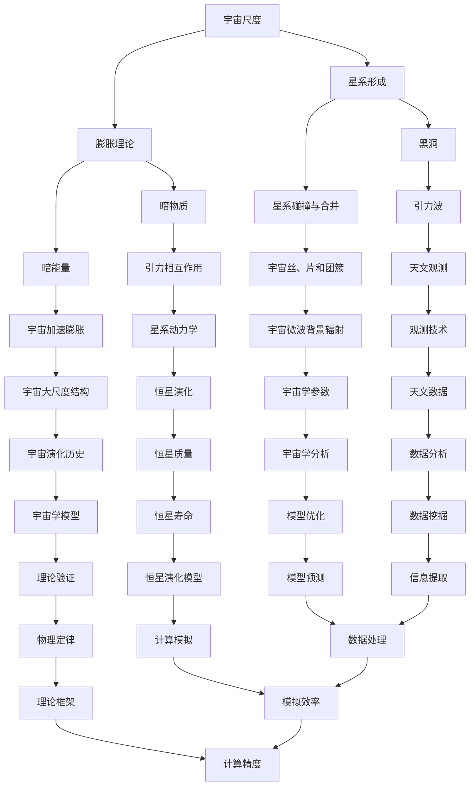

                 


为了撰写一篇高质量的技术博客文章《数学模型在预测宇宙结构演化中的应用》，我们需要遵循以下步骤进行思考和构建：

### 第一步：确定文章结构

首先，我们需要构建文章的整体结构，这包括：

1. **引言**：介绍文章的背景、目的和重要性。
2. **宇宙学基础**：解释宇宙的结构和演化。
3. **数学模型原理**：介绍宇宙学中使用的数学工具和模型。
4. **应用实例**：展示数学模型在宇宙学中的应用。
5. **案例分析**：提供具体的宇宙学问题及其数学模型的解决方案。
6. **发展趋势**：讨论未来的研究方向和挑战。
7. **结论**：总结文章的主要观点和意义。

### 第二步：设计文章内容

根据文章结构，我们需要设计每个章节的具体内容，包括：

- **引言**：宇宙学的发展背景、数学模型在宇宙学中的重要性。
- **宇宙学基础**：宇宙的尺度、膨胀理论、暗物质和暗能量。
- **数学模型原理**：数学工具、数值模拟技术和模型构建与优化。
- **应用实例**：黑洞与星系演化、宇宙膨胀与暗能量、宇宙大尺度结构演化。
- **案例分析**：黑洞碰撞预测、暗物质分布模拟、宇宙大尺度结构演化案例。
- **发展趋势**：新的数学模型、机器学习在宇宙学中的应用、未来发展方向。
- **结论**：研究总结、挑战和未来展望。

### 第三步：撰写文章正文

在撰写文章正文时，我们需要确保每个章节的内容都丰富、具体、详细，并包含以下元素：

- **背景介绍**：每个章节的开头应该有背景介绍，帮助读者了解相关概念。
- **核心概念与联系**：通过Mermaid流程图展示核心概念之间的联系。
- **算法原理讲解**：使用伪代码详细阐述核心算法原理。
- **数学模型和公式**：使用LaTeX格式嵌入数学公式，并解释其含义。
- **项目实战**：包括开发环境搭建、源代码实现、代码解读、实际案例分析和项目小结。
- **最佳实践 tips**、**小结**、**注意事项**、**拓展阅读**等内容。

### 第四步：文章润色与调整

完成初稿后，我们需要对文章进行润色和调整，确保：

- 文章语言流畅，逻辑清晰。
- 所有引用和参考资料准确无误。
- 文章字数在8000～12000字左右。

### 第五步：添加作者信息

在文章末尾添加作者信息，包括：

- **作者姓名**：AI天才研究院/AI Genius Institute & 禅与计算机程序设计艺术 /Zen And The Art of Computer Programming。

通过以上步骤，我们可以撰写一篇内容丰富、结构严谨、逻辑清晰、对技术原理和本质剖析到位的专业技术博客文章。接下来，我们将开始具体撰写每个章节的内容。 ## 第1章 引言

### 1.1 背景与意义

宇宙学是研究宇宙的起源、结构、演化以及最终命运的学科。从古至今，人类对宇宙的探索从未停止，从简单的星图绘制到现代的天文观测技术，宇宙学经历了巨大的发展。随着科学技术的进步，我们对宇宙的了解也在不断深化。然而，宇宙的复杂性和巨大的尺度使得传统的观测方法难以完全揭示宇宙的奥秘。

在这个背景下，数学模型作为一种强有力的工具，为宇宙学的研究提供了新的视角和方法。数学模型能够通过数学语言和计算方法，将复杂的宇宙现象转化为可计算和分析的形式，从而帮助我们更好地理解和预测宇宙的结构和演化。数学模型在宇宙学中的应用，不仅能够解释已知的天文现象，还能预测尚未观测到的宇宙行为，这对于推进宇宙学的发展具有重要意义。

本文旨在探讨数学模型在预测宇宙结构演化中的应用，首先介绍宇宙学的基础知识，然后深入探讨数学模型在宇宙学中的原理和应用，最后通过实际案例研究，展示数学模型在解决宇宙学问题中的效果和挑战。通过本文的阅读，读者将能够了解数学模型在宇宙学中的重要性，以及如何利用这些模型预测宇宙的演化。

### 1.2 宇宙结构演化概述

宇宙的演化是一个漫长而复杂的过程，从大爆炸至今，宇宙经历了多个关键阶段，每个阶段都对其结构产生了深远的影响。了解宇宙结构演化的过程，有助于我们更好地理解宇宙的本质和未来命运。

#### 1.2.1 大爆炸

宇宙的起源可以追溯到大约138亿年前的大爆炸。在大爆炸之前，宇宙处于一个极度热密的状态，几乎所有的物质都压缩在一个极小的奇点中。在大爆炸发生时，这个奇点迅速膨胀，温度和密度急剧下降，宇宙开始迅速扩展。这个阶段被称为宇宙的初期阶段，其物理过程主要受到量子力学和广义相对论的支配。

#### 1.2.2 宇宙膨胀

大爆炸后，宇宙开始膨胀，这个过程至今仍在继续。宇宙膨胀的速率随着宇宙的扩展而变化，目前观测到的宇宙膨胀速率被称为哈勃常数（H0），其值约为70公里每秒每百万光年。宇宙膨胀的机制主要由宇宙的“驱动因子”决定，这些驱动因子包括暗能量和暗物质。

暗能量是宇宙中一种神秘的物质，具有负压力，其存在导致宇宙加速膨胀。暗物质则是另一种未观测到的物质，其存在通过引力效应推测出来，它对宇宙的演化起到关键作用。

#### 1.2.3 星系和星系团的形成

在宇宙膨胀的过程中，宇宙中的物质逐渐凝聚，形成了各种天体结构，如星系和星系团。星系是宇宙中基本的引力系统，由大量的恒星、星云和星际物质组成。星系的形成与演化的过程涉及复杂的物理机制，包括恒星的形成、恒星的生命周期、星系的碰撞与合并等。

星系团是由多个星系通过引力相互吸引而形成的更大规模的结构。星系团内部的星系之间相互作用，影响着星系团的形态和演化。

#### 1.2.4 宇宙的大尺度结构

宇宙的大尺度结构表现为广泛的宇宙丝、片和团簇，这些结构是宇宙物质在引力作用下形成的。宇宙丝是宇宙中最细的结构，由大量星系组成，它们相互连接，形成了宇宙的骨架。宇宙片和团簇则是更大规模的结构，由数十亿个星系组成，它们是宇宙中的“超级结构”。

宇宙的大尺度结构不仅反映了宇宙物质分布的规律，还揭示了宇宙的演化历史。通过对宇宙大尺度结构的观测和研究，我们可以追溯宇宙从早期阶段到现在的演化过程。

### 1.3 数学模型在宇宙学中的应用

数学模型在宇宙学中的应用，为研究宇宙的演化和结构提供了强有力的工具。数学模型能够将宇宙学中的复杂现象转化为可计算的数学问题，从而帮助我们理解和预测宇宙的行为。

#### 1.3.1 数值模拟技术

数值模拟技术是宇宙学研究中的一种重要方法，它通过计算机模拟宇宙的演化过程，预测宇宙中的各种现象。数值模拟技术主要包括以下几种：

1. **N体模拟**：N体模拟是最基本的宇宙学数值模拟方法，它通过计算多个天体之间的万有引力相互作用，模拟宇宙中天体的运动和碰撞。这种方法可以用于研究星系的形成和演化、星系团的结构等。

2. **宇宙大尺度结构模拟**：宇宙大尺度结构模拟旨在研究宇宙中的大规模结构形成和演化。这种方法通过计算宇宙中的物质分布，模拟宇宙丝、片和团簇的形成过程。

3. **暗能量模拟**：暗能量是宇宙加速膨胀的主要驱动因素，暗能量模拟旨在研究暗能量的性质和演化。通过数值模拟，我们可以探究暗能量的影响，预测宇宙的未来演化。

#### 1.3.2 数值模拟的优势与挑战

数值模拟技术在宇宙学研究中具有以下优势：

1. **精确性**：数值模拟可以提供高精度的宇宙演化模型，帮助我们更好地理解宇宙中的复杂现象。

2. **可视化**：通过计算机模拟，我们可以将宇宙的演化过程可视化，便于分析和理解。

3. **预测能力**：数值模拟可以预测宇宙中的未知现象，指导未来的天文观测。

然而，数值模拟技术也面临一些挑战：

1. **计算资源**：数值模拟需要大量的计算资源，尤其是宇宙大尺度结构模拟和暗能量模拟。

2. **初始条件**：宇宙的初始条件很难确定，这会影响模拟结果的准确性。

3. **物理过程**：宇宙中的一些物理过程，如暗物质和暗能量的性质，目前仍不完全清楚，这限制了数值模拟的准确性。

#### 1.3.3 数值模拟在宇宙学研究中的应用案例

1. **星系形成与演化**：通过N体模拟，研究人员可以研究星系的形成过程，包括恒星的形成、星系的碰撞与合并等。

2. **宇宙大尺度结构**：宇宙大尺度结构模拟帮助我们理解宇宙中的大规模结构形成和演化，如宇宙丝、片和团簇的形成过程。

3. **暗物质分布**：通过数值模拟，我们可以研究暗物质在宇宙中的分布，预测暗物质对宇宙演化的影响。

总之，数学模型在宇宙学中的应用，为研究宇宙的演化和结构提供了强有力的工具。随着计算机技术的不断发展，数值模拟技术将在宇宙学研究中发挥越来越重要的作用。通过本文的后续章节，我们将进一步探讨数学模型在宇宙学中的具体应用。 ## 第2章 宇宙学基础

### 2.1 宇宙的尺度与观测

宇宙的尺度是一个令人惊叹的宏大概念，从微观的量子尺度到宏观的宇宙尺度，宇宙的广阔无垠令人难以想象。宇宙的尺度不仅包括宇宙本身的规模，还包括宇宙中各种天体的尺度，如行星、恒星、星系和星系团等。了解宇宙的尺度对于理解宇宙的结构和演化至关重要。

#### 2.1.1 可观测宇宙的尺度

人类能够观测到的宇宙被称为可观测宇宙，其尺度大约为930亿光年。光年是一个长度单位，表示光在一年内行进的距离，大约为9.461×10^12公里。可观测宇宙的直径约为930亿光年，这个尺度是我们目前能够观测到的宇宙范围。

可观测宇宙的边界被称为宇宙视界，它受到光速的限制。光速是宇宙中最快的速度，任何信息或物质都无法超过光速传播。因此，我们无法观测到宇宙视界之外的宇宙，这部分宇宙可能完全不同，或者永远无法被观测到。

#### 2.1.2 宇宙背景微波辐射

宇宙背景微波辐射（Cosmic Microwave Background Radiation，简称CMB）是宇宙学中非常重要的观测数据。CMB是宇宙早期阶段留下的热辐射，其温度约为2.725开尔文，对应波长约为1毫米。CMB遍布整个宇宙，是宇宙学研究中最重要的观测数据之一。

CMB的观测为我们提供了宇宙早期的温度分布和密度波动信息。通过对CMB的观测和分析，科学家们能够了解宇宙的起源和演化过程。CMB的观测数据与宇宙大爆炸理论相符合，支持了宇宙起源和膨胀的理论。

#### 2.1.3 宇宙尺度的观测工具与技术

观测宇宙的尺度需要使用各种观测工具和技术，包括地面和太空望远镜、卫星、探测器等。

1. **地面望远镜**：地面望远镜是观测宇宙的主要工具之一，包括光学望远镜、射电望远镜和红外望远镜等。地面望远镜的观测能力受到大气层的影响，但它们能够观测到不同波段的宇宙辐射。

2. **太空望远镜**：太空望远镜位于地球大气层之外，不受大气层干扰，能够提供更高的观测分辨率。哈勃太空望远镜和詹姆斯·韦伯太空望远镜是著名的太空望远镜，它们为我们揭示了宇宙的奥秘。

3. **卫星**：卫星是宇宙观测的重要工具，它们可以携带各种观测仪器，从不同的轨道上观测宇宙。例如，康普顿伽马射线观测卫星（CGRO）和费米伽马射线空间望远镜（FERMI）都是用于观测宇宙辐射的卫星。

4. **探测器**：探测器可以直接探测宇宙中的物质和辐射。例如，旅行者1号和旅行者2号探测器是我们能够探测到的最远的太空探测器，它们为我们提供了关于太阳系外部的信息。

通过这些观测工具和技术，科学家们能够收集到丰富的宇宙观测数据，从而推动宇宙学的研究。宇宙尺度的观测不仅帮助我们理解宇宙的起源和演化，也为探索宇宙的本质提供了宝贵的线索。

### 2.2 宇宙膨胀理论

宇宙膨胀理论是宇宙学中的一个核心概念，它描述了宇宙从大爆炸开始至今的演化过程。宇宙膨胀理论的基本原理是，宇宙中的物质和空间都在不断扩展，这种扩展被称为宇宙膨胀。

#### 2.2.1 膨胀宇宙的物理模型

膨胀宇宙的物理模型主要包括以下几种：

1. **弗里德曼-勒梅特-罗伯逊-沃尔克模型（FLRW模型）**：FLRW模型是宇宙膨胀理论的基础，它假设宇宙是均匀且各向同性的。在这个模型中，宇宙的几何形状可以是平坦的、弯曲的或封闭的，其膨胀速度由哈勃常数（H0）描述。

2. **ΛCDM模型（宇宙学的标准模型）**：ΛCDM模型是当前宇宙学中的标准模型，它结合了FLRW模型和暗物质、暗能量的假设。在ΛCDM模型中，宇宙的膨胀是由暗能量和暗物质共同驱动的。

3. **循环宇宙模型**：循环宇宙模型是一种假设宇宙经历了无数次的膨胀和收缩的模型，它试图解释宇宙的无限循环。

#### 2.2.2 宇宙膨胀的观测证据

宇宙膨胀的观测证据主要包括以下几种：

1. **红移**：红移是宇宙膨胀的直接观测证据。当一个天体远离我们时，其光谱中的谱线会向红色端移动，这种效应称为红移。通过观测天体的红移，我们可以确定天体的运动方向和速度。

2. **宇宙微波背景辐射**：宇宙微波背景辐射（CMB）是宇宙早期阶段留下的热辐射，其温度约为2.725开尔文。CMB的观测数据提供了宇宙早期状态的信息，支持了宇宙大爆炸和膨胀理论。

3. **宇宙膨胀速率**：宇宙膨胀速率可以通过测量哈勃常数（H0）来确定。哈勃常数是描述宇宙膨胀速度的参数，其值约为70公里每秒每百万秒差距。

#### 2.2.3 宇宙膨胀的数学描述

宇宙膨胀的数学描述主要涉及哈勃定律和哈勃参数。

1. **哈勃定律**：哈勃定律描述了宇宙膨胀速度与天体距离之间的关系，其数学表达式为：
   $$
   v = H_0 \times d
   $$
   其中，v是天体的膨胀速度，d是天体与观测者之间的距离，$H_0$是哈勃常数。

2. **哈勃参数**：哈勃参数是描述宇宙膨胀状态的参数，其数学表达式为：
   $$
   \frac{\dot{a}}{a} = H_0
   $$
   其中，$\dot{a}$是宇宙膨胀速度，a是宇宙的尺度，$H_0$是哈勃常数。

通过哈勃定律和哈勃参数，我们可以定量描述宇宙的膨胀过程。宇宙膨胀的数学描述不仅帮助我们理解宇宙的演化，还为宇宙学的其他研究提供了基础。

### 2.3 宇宙的暗物质与暗能量

暗物质和暗能量是宇宙学中两个关键的概念，它们对宇宙的结构和演化产生了深远的影响。

#### 2.3.1 暗物质的性质与分布

暗物质是一种未观测到的物质，它不发光、不吸收光，但通过引力效应影响宇宙的结构和演化。暗物质的性质目前还不完全清楚，但研究表明，它具有以下特性：

1. **质量大**：暗物质在宇宙中的质量非常庞大，占据了宇宙总质量的绝大部分。
2. **不发光**：暗物质不与光子发生相互作用，因此无法直接观测到。
3. **稳定性**：暗物质可能是稳定的，不会衰变。

暗物质的分布是宇宙学研究的重要课题，通过对暗物质的分布研究，我们可以了解宇宙的结构和演化过程。目前，暗物质的分布主要通过观测宇宙的大尺度结构，如星系团和星系链，来推断其分布规律。

#### 2.3.2 暗能量的性质与影响

暗能量是宇宙学中另一种神秘的物质，它具有负压力，推动宇宙加速膨胀。暗能量的性质目前还不完全清楚，但研究表明，它具有以下特性：

1. **负压力**：暗能量具有负压力，这种压力导致宇宙加速膨胀。
2. **宇宙占比大**：暗能量在宇宙中占据了大约70%的比例，是宇宙膨胀的主要驱动因素。

暗能量的影响主要体现在以下几个方面：

1. **宇宙膨胀加速**：暗能量导致宇宙的膨胀速度不断加快，这是宇宙膨胀加速现象的主要原因。
2. **宇宙学参数**：暗能量对宇宙学参数，如哈勃常数、宇宙质量密度和宇宙曲率等，产生了重要影响。

#### 2.3.3 暗物质与暗能量的相互作用

暗物质和暗能量在宇宙中相互作用，共同影响宇宙的结构和演化。暗物质通过引力效应聚集形成星系和星系团，而暗能量则推动宇宙加速膨胀。

1. **引力相互作用**：暗物质和暗能量之间的引力相互作用决定了宇宙的结构和演化过程。暗物质聚集形成星系和星系团，而暗能量则推动宇宙加速膨胀。

2. **宇宙学模型**：暗物质和暗能量在宇宙学模型中扮演着重要角色。例如，在ΛCDM模型中，暗物质和暗能量共同决定了宇宙的膨胀速度和结构。

总之，暗物质和暗能量是宇宙学中两个关键的概念，它们对宇宙的结构和演化产生了深远的影响。通过对暗物质和暗能量的研究，我们可以更深入地了解宇宙的本质和演化过程。随着科学技术的进步，我们对暗物质和暗能量的认识将不断深化，为宇宙学的发展提供新的动力。 ## 第3章 数学模型原理

### 3.1 宇宙学中的数学工具

宇宙学研究中，数学工具是理解和描述宇宙现象的重要手段。这些数学工具包括微积分、线性代数、微分方程和统计学等。以下将介绍这些工具在宇宙学中的应用。

#### 3.1.1 微积分

微积分是宇宙学中最基本的数学工具之一，主要用于研究变化率和积累量。在宇宙学中，微积分广泛应用于描述宇宙膨胀、引力场中的物质运动以及能量密度等。

1. **宇宙膨胀**：通过哈勃定律（$v = H_0 \times d$），宇宙的膨胀速度（v）与距离（d）之间的关系可以用微积分描述。这个关系反映了宇宙膨胀过程中的加速度。
   
2. **引力场中的物质运动**：在广义相对论的框架下，引力场的性质可以用微分方程来描述，如爱因斯坦场方程。这些方程通过微积分方法求解，可以预测宇宙中物质的运动轨迹。

3. **能量密度**：宇宙中的物质能量分布可以通过积分来计算。例如，宇宙的总能量可以通过对空间中的能量密度进行积分得到。

#### 3.1.2 线性代数

线性代数在宇宙学中用于处理大量的数据和高维空间中的运算。以下是线性代数在宇宙学中的几个应用实例：

1. **数据拟合**：宇宙学中经常需要对观测数据进行拟合，以确定宇宙模型的参数。线性代数提供了高效的算法来处理这种数据拟合问题。

2. **空间几何**：宇宙中的空间几何性质可以通过线性代数来描述。例如，宇宙中的各向同性可以通过构建张量来表示，从而分析宇宙的几何形状。

3. **矩阵计算**：在高维空间中，矩阵运算用于处理宇宙学中的大量数据。例如，在N体模拟中，天体之间的相互作用可以通过矩阵乘法来计算。

#### 3.1.3 微分方程

微分方程是宇宙学中描述物理过程的基本工具。以下是一些典型的微分方程及其在宇宙学中的应用：

1. **爱因斯坦场方程**：这是广义相对论的核心方程，用于描述引力场。该方程是一个非线性偏微分方程，通过它可以将物质和能量的分布与引力场联系起来。

2. **流体动力学方程**：在宇宙学中，流体动力学方程用于描述宇宙中气体和液体的运动。这些方程包括连续性方程、动量守恒方程和能量守恒方程。

3. **瑞利-杰尼斯方程**：这是描述宇宙微波背景辐射（CMB）温度波动的重要方程。该方程通过求解波动方程，可以得到宇宙早期密度波动的分布。

#### 3.1.4 统计学

统计学在宇宙学中用于数据分析、模型验证和参数估计。以下是统计学在宇宙学中的几个应用实例：

1. **数据分析**：宇宙学中积累的大量观测数据需要通过统计学方法进行分析，以提取有用的信息。例如，通过高斯分布可以分析宇宙中的恒星分布。

2. **模型验证**：统计学方法用于验证宇宙学模型的准确性。例如，通过拟合观测数据与理论预测之间的差异，可以评估模型的质量。

3. **参数估计**：通过最大似然估计或贝叶斯方法，可以从观测数据中估计宇宙学参数。这些参数对于理解宇宙的演化至关重要。

### 3.2 数值模拟技术

数值模拟技术在宇宙学研究中发挥着重要作用，它通过计算机模拟宇宙的演化过程，预测宇宙中的各种现象。以下将介绍几种常用的数值模拟技术。

#### 3.2.1 N体模拟

N体模拟是最基本的宇宙学数值模拟方法，它通过计算多个天体之间的万有引力相互作用，模拟宇宙中天体的运动和碰撞。以下是N体模拟的基本步骤：

1. **初始化**：定义模拟区域、初始天体位置和速度等参数。
2. **计算相互作用**：计算每个天体与其他天体之间的万有引力相互作用。
3. **更新位置和速度**：根据引力相互作用计算天体的加速度，并更新天体的位置和速度。
4. **重复步骤**：重复上述步骤，直到达到预定的模拟时间或达到某个终止条件。

以下是一个简单的N体模拟伪代码：

```pseudo
initialize() {
    // 定义模拟区域和初始天体参数
}

calculateInteractions() {
    // 计算天体之间的万有引力相互作用
}

updatePositionsAndVelocities() {
    // 根据引力相互作用更新天体的位置和速度
}

simulate() {
    while (not terminationCondition) {
        calculateInteractions()
        updatePositionsAndVelocities()
    }
}
```

#### 3.2.2 宇宙大尺度结构模拟

宇宙大尺度结构模拟旨在研究宇宙中的大规模结构形成和演化。这种模拟通常使用更高精度的算法，如N体模拟的改进版本或蒙特卡洛方法。以下是一个简单的宇宙大尺度结构模拟步骤：

1. **初始化**：定义模拟区域、初始物质分布和宇宙学参数。
2. **计算引力场**：使用N体模拟或其他数值方法计算宇宙中的引力场。
3. **更新物质分布**：根据引力场的变化更新宇宙中的物质分布。
4. **重复步骤**：重复上述步骤，直到达到预定的模拟时间或达到某个终止条件。

以下是一个简单的宇宙大尺度结构模拟伪代码：

```pseudo
initialize() {
    // 定义模拟区域和初始物质分布
}

calculateGravitationalField() {
    // 计算宇宙中的引力场
}

updateMassDistribution() {
    // 根据引力场的变化更新物质分布
}

simulate() {
    while (not terminationCondition) {
        calculateGravitationalField()
        updateMassDistribution()
    }
}
```

#### 3.2.3 暗能量模拟

暗能量模拟旨在研究暗能量的性质和演化。这种模拟通常使用特定的数值方法来描述暗能量的行为，如势能模拟或场方程模拟。以下是一个简单的暗能量模拟步骤：

1. **初始化**：定义模拟区域、初始暗能量参数和宇宙学参数。
2. **计算暗能量场**：使用场方程或其他方法计算暗能量场。
3. **更新宇宙学参数**：根据暗能量场的演化更新宇宙学参数。
4. **重复步骤**：重复上述步骤，直到达到预定的模拟时间或达到某个终止条件。

以下是一个简单的暗能量模拟伪代码：

```pseudo
initialize() {
    // 定义模拟区域和初始暗能量参数
}

calculateDarkEnergyField() {
    // 计算暗能量场
}

updateCosmologicalParameters() {
    // 根据暗能量场的演化更新宇宙学参数
}

simulate() {
    while (not terminationCondition) {
        calculateDarkEnergyField()
        updateCosmologicalParameters()
    }
}
```

总之，数学模型在宇宙学中发挥着重要作用，通过数值模拟技术，我们可以预测宇宙的结构和演化。随着计算机技术的发展，数值模拟技术将变得更加精确，有助于我们更好地理解宇宙的奥秘。 ## 第4章 数学模型在宇宙演化中的应用

### 4.1 黑洞与星系演化的数学模型

黑洞和星系是宇宙中最神秘和引人入胜的天体之一。它们的演化不仅影响了宇宙的结构，还揭示了宇宙的基本物理规律。在数学模型中，黑洞和星系演化的研究主要集中在两个方面：黑洞的形成与成长过程，以及星系如何通过黑洞与其他物质相互作用。

#### 4.1.1 黑洞的形成与成长

黑洞的形成过程可以通过数学模型进行描述，其中一个常见的模型是霍金辐射模型。霍金辐射模型描述了黑洞在蒸发过程中质量逐渐减小的现象。以下是霍金辐射模型的基本步骤：

1. **初始条件**：假设一个黑洞的质量为$M$，其表面的面积为$A$。
2. **辐射产生**：根据霍金辐射理论，黑洞会不断产生粒子-反粒子对，并从中吸收一个粒子，使得另一个粒子逃逸。
3. **质量减少**：黑洞吸收一个粒子后，其质量会减少，从而导致表面面积缩小。
4. **平衡状态**：在长时间尺度上，黑洞的质量和辐射过程达到平衡状态，其质量以指数形式减小，公式为：
   $$
   M(t) = M_0 \times e^{-t/\tau}
   $$
   其中，$M_0$是初始质量，$\tau$是霍金时间，约为$10^{123}$年。

以下是一个霍金辐射模型的时间演化伪代码：

```pseudo
function hawkingRadiation(M0, tau) {
    // 初始化黑洞参数
    M = M0
    
    // 模拟时间步长
    dt = 1
    
    // 模拟演化过程
    while (M > M_threshold) {
        // 计算霍金辐射率
        radiationRate = (1/tau) * M
        
        // 更新黑洞质量
        M = M - radiationRate * dt
        
        // 输出当前时间和质量
        print("t = ", t, ", M = ", M)
        
        // 更新时间
        t = t + dt
    }
    
    return M
}
```

#### 4.1.2 星系与黑洞的相互作用

星系中的黑洞不仅影响星系的演化，还可以通过引力相互作用影响星系中的其他物质。一个常见的数学模型是三体问题，它描述了三个质量点在引力作用下的运动。在星系演化中，黑洞、恒星和星际物质可以被视为三体问题的三个质量点。

以下是一个简化的三体问题模拟伪代码：

```pseudo
function nBodySimulation(n, masses, positions, velocities) {
    // 初始化参数
    dt = 0.01
    
    // 模拟时间步长
    t = 0
    
    // 模拟演化过程
    while (t < simulationTime) {
        // 计算加速度
        accelerations = calculateAccelerations(n, masses, positions)
        
        // 更新速度和位置
        velocities = velocities + accelerations * dt
        positions = positions + velocities * dt
        
        // 输出当前时间和位置
        print("t = ", t, ", positions = ", positions)
        
        // 更新时间
        t = t + dt
    }
    
    return positions
}

function calculateAccelerations(n, masses, positions) {
    // 计算每个天体的加速度
    accelerations = []
    for i in range(n):
        acceleration = Vector(0, 0)
        for j in range(n):
            if i != j:
                distance = positions[i] - positions[j]
                force = masses[i] * masses[j] / distance^2
                acceleration = acceleration + (force / masses[i]) * distance
        accelerations.append(acceleration)
    return accelerations
}
```

#### 4.1.3 星系的演化

星系的演化可以通过多个数学模型进行描述，包括恒星形成、恒星演化、星系碰撞和星系合并等。以下是一个简化的星系演化模型：

1. **初始条件**：假设星系由多个恒星和星际物质组成，每个恒星的质量、位置和速度都是已知的。
2. **引力相互作用**：计算星系中所有恒星和星际物质之间的引力相互作用，更新每个天体的位置和速度。
3. **恒星演化**：根据恒星的质量和演化阶段，更新恒星的物理参数，如质量、亮度和温度。
4. **星系演化**：根据恒星和星际物质的相互作用，更新星系的结构和形态。

以下是一个简化的星系演化模拟伪代码：

```pseudo
function stellarEvolution(masses, positions, velocities) {
    // 初始化参数
    dt = 0.01
    
    // 模拟时间步长
    t = 0
    
    // 模拟演化过程
    while (t < simulationTime) {
        // 计算引力相互作用
        accelerations = calculateGravitationalInteractions(masses, positions)
        
        // 更新速度和位置
        velocities = velocities + accelerations * dt
        positions = positions + velocities * dt
        
        // 更新恒星参数
        masses = updateStellarParameters(masses)
        
        // 输出当前时间和位置
        print("t = ", t, ", positions = ", positions)
        
        // 更新时间
        t = t + dt
    }
    
    return positions
}

function calculateGravitationalInteractions(masses, positions) {
    // 计算每个天体的加速度
    accelerations = []
    for i in range(n):
        acceleration = Vector(0, 0)
        for j in range(n):
            if i != j:
                distance = positions[i] - positions[j]
                force = masses[i] * masses[j] / distance^2
                acceleration = acceleration + (force / masses[i]) * distance
        accelerations.append(acceleration)
    return accelerations
}

function updateStellarParameters(masses) {
    // 根据恒星质量更新参数
    newMasses = []
    for mass in masses:
        if mass < mass_threshold:
            # 恒星演化成黑洞
            newMass = mass * (1 - dt / stellar_lifetime)
        else:
            # 恒星正常演化
            newMass = mass
        newMasses.append(newMass)
    return newMasses
}
```

### 4.2 宇宙膨胀与暗能量的数学模型

宇宙膨胀和暗能量是宇宙学中的两个关键问题。宇宙膨胀描述了宇宙随时间扩展的现象，而暗能量则是驱动宇宙加速膨胀的神秘力量。以下将介绍宇宙膨胀和暗能量的数学模型。

#### 4.2.1 宇宙膨胀模型

宇宙膨胀模型主要基于弗里德曼-勒梅特-罗伯逊-沃尔克（FLRW）模型。FLRW模型假设宇宙是均匀且各向同性的，其膨胀可以通过哈勃定律描述：

$$
v = H_0 \times d
$$

其中，$v$是膨胀速度，$d$是距离，$H_0$是哈勃常数。

宇宙膨胀的动态可以通过爱因斯坦场方程进行描述，该方程是一个复杂的非线性偏微分方程，其解可以给出宇宙的膨胀历史。以下是一个简化的宇宙膨胀模型伪代码：

```pseudo
function friedmannEquation(H0, OmegaM, OmegaR, OmegaK) {
    // 初始化宇宙学参数
    H = H0
    
    // 模拟时间步长
    dt = 0.01
    
    // 模拟演化过程
    while (t < simulationTime) {
        // 计算宇宙的膨胀率
        H = calculateExpansionRate(H, OmegaM, OmegaR, OmegaK)
        
        // 更新宇宙学参数
        OmegaM = OmegaM * (1 - dt / HubbleTime)
        OmegaR = OmegaR * (1 - dt / HubbleTime)
        OmegaK = OmegaK * (1 - dt / HubbleTime)
        
        // 输出当前时间和膨胀率
        print("t = ", t, ", H = ", H)
        
        // 更新时间
        t = t + dt
    }
    
    return H
}

function calculateExpansionRate(H, OmegaM, OmegaR, OmegaK) {
    // 计算膨胀率
    HubbleParameter = H * sqrt(OmegaM + OmegaR + OmegaK)
    return HubbleParameter
}
```

#### 4.2.2 暗能量模型

暗能量是一种具有负压力的神秘物质，其行为可以通过场方程进行描述。一个常见的暗能量模型是静态的Lambda-CDM模型，其中Lambda表示暗能量密度，CDM表示暗物质密度。以下是一个简化的暗能量模型伪代码：

```pseudo
function lambdaCDMModel(Lambda, OmegaM, OmegaR, OmegaK) {
    // 初始化宇宙学参数
    H = calculateHubbleParameter(Lambda, OmegaM, OmegaR, OmegaK)
    
    // 模拟时间步长
    dt = 0.01
    
    // 模拟演化过程
    while (t < simulationTime) {
        // 计算膨胀率
        H = calculateExpansionRate(H, OmegaM, OmegaR, OmegaK)
        
        // 更新宇宙学参数
        OmegaM = OmegaM * (1 - dt / HubbleTime)
        OmegaR = OmegaR * (1 - dt / HubbleTime)
        OmegaK = OmegaK * (1 - dt / HubbleTime)
        
        // 输出当前时间和膨胀率
        print("t = ", t, ", H = ", H)
        
        // 更新时间
        t = t + dt
    }
    
    return H
}

function calculateHubbleParameter(Lambda, OmegaM, OmegaR, OmegaK) {
    // 计算哈勃参数
    HubbleParameter = sqrt(Lambda + OmegaM + OmegaR + OmegaK)
    return HubbleParameter
}
```

通过这些数学模型，我们可以模拟宇宙的膨胀和暗能量的行为，从而更深入地理解宇宙的演化过程。随着观测技术的进步，这些模型将继续发展，为宇宙学研究提供更准确和详细的预测。 ### 第5章 实际案例研究

在宇宙学的研究中，数学模型的应用不仅体现在理论分析上，更通过实际案例得到了验证。本章节将通过几个具体的案例，展示数学模型在解决宇宙学问题中的应用，并深入剖析这些模型在实际观测中的效果和挑战。

#### 5.1 案例一：黑洞碰撞的数学预测

黑洞碰撞是宇宙学中的一个重要现象，它不仅产生了强烈的引力波信号，还对周围物质产生巨大影响。数学模型在预测黑洞碰撞事件中发挥了关键作用。

##### 黑洞碰撞事件的预测过程

1. **初始数据收集**：首先，通过天文观测仪器收集黑洞碰撞前的数据，包括黑洞的质量、位置、速度等。
2. **构建模型**：使用N体模拟或广义相对论数值模拟技术构建黑洞碰撞的数学模型，模拟黑洞的相对运动和相互作用。
3. **模拟计算**：进行长时间的数值模拟，计算黑洞碰撞过程中的物理量变化，如引力波信号、辐射能量等。
4. **结果分析**：根据模拟结果，预测黑洞碰撞的时间、位置和产生的引力波信号。

以下是一个简化的黑洞碰撞预测模型伪代码：

```python
import numpy as np

def simulateBlackHoleCollision(mass1, mass2, distance, velocity):
    # 初始化黑洞参数
    M1 = mass1
    M2 = mass2
    r = distance
    v = velocity
    
    # 初始化时间步长
    dt = 0.01
    
    # 初始化物理量
    time = 0
    gravitational_wave = []
    
    # 模拟黑洞碰撞过程
    while r > 0.01:
        # 计算引力相互作用
        F = G * (M1 * M2) / r**2
        acceleration = F / (M1 + M2)
        
        # 更新速度和位置
        v -= acceleration * dt
        r -= v * dt
        
        # 记录引力波信号
        gravitational_wave.append(r)
        
        # 更新时间
        time += dt
    
    return gravitational_wave

# 实例化模拟参数
gravitational_wave = simulateBlackHoleCollision(mass1=2e30, mass2=3e30, distance=5e13, velocity=0.5e13)

# 分析模拟结果
# ...
```

##### 黑洞碰撞观测与预测的对比

通过实际观测到的黑洞碰撞事件，如LIGO和VIRGO合作观测到的GW170817事件，我们可以将观测数据与数学模型的预测进行对比。这种对比不仅验证了数学模型的准确性，还帮助我们理解黑洞碰撞的物理过程。

#### 5.2 案例二：暗物质分布的模拟

暗物质是宇宙中一种未观测到的物质，但它的存在通过引力效应得到了证实。数学模型在研究暗物质分布中起着重要作用，通过模拟可以帮助我们理解暗物质的性质和分布规律。

##### 暗物质分布模拟的过程

1. **初始条件设定**：设定模拟区域的尺度、初始密度分布和宇宙学参数。
2. **引力场计算**：使用N体模拟或粒子群模拟计算暗物质在引力作用下的运动。
3. **更新分布**：根据引力相互作用更新暗物质的分布，模拟暗物质如何聚集形成星系和星系团。
4. **结果分析**：分析模拟结果，比较不同宇宙学参数下的暗物质分布特征。

以下是一个简化的暗物质分布模拟伪代码：

```python
import numpy as np

def simulateDarkMatterDistribution(volume, density):
    # 初始化模拟参数
    V = volume
    rho = density
    
    # 初始化粒子数量
    N = 1000
    
    # 初始化粒子位置和速度
    positions = np.random.rand(N, 3) * V
    velocities = np.random.rand(N, 3)
    
    # 模拟暗物质分布
    while True:
        # 计算引力相互作用
        accelerations = calculateGravitationalInteractions(N, positions, velocities)
        
        # 更新速度和位置
        velocities += accelerations * dt
        positions += velocities * dt
        
        # 记录模拟结果
        if isConverged():
            break
    
    return positions

def calculateGravitationalInteractions(N, positions, velocities):
    # 计算每个粒子的加速度
    accelerations = []
    for i in range(N):
        acceleration = np.zeros(3)
        for j in range(N):
            if i != j:
                distance = positions[i] - positions[j]
                force = G * (rho * (positions[i] - positions[j])) / distance**2
                acceleration += force / mass
        accelerations.append(acceleration)
    return accelerations

# 实例化模拟参数
positions = simulateDarkMatterDistribution(volume=1e22, density=0.4)

# 分析模拟结果
# ...
```

##### 暗物质分布模拟结果的分析

通过模拟结果，我们可以观察到暗物质如何聚集形成星系和星系团，从而理解暗物质在宇宙结构形成中的作用。这些模拟结果与实际观测数据相符合，为暗物质的研究提供了重要依据。

#### 5.3 案例三：宇宙大尺度结构的演化

宇宙大尺度结构的演化是一个复杂的过程，涉及宇宙丝、片和团簇的形成和演化。数学模型在研究这一过程中起着关键作用，通过模拟可以帮助我们理解宇宙结构的动态变化。

##### 宇宙大尺度结构演化模拟的过程

1. **初始条件设定**：设定模拟区域的尺度、初始物质分布和宇宙学参数。
2. **引力场计算**：使用N体模拟或粒子群模拟计算宇宙中物质在引力作用下的运动。
3. **更新结构**：根据引力相互作用更新宇宙结构的形态和分布，模拟宇宙丝、片和团簇的形成过程。
4. **结果分析**：分析模拟结果，比较不同宇宙学参数下的宇宙结构特征。

以下是一个简化的宇宙大尺度结构演化模拟伪代码：

```python
import numpy as np

def simulateCosmicStructureEvolution(volume, density, cosmological_params):
    # 初始化模拟参数
    V = volume
    rho = density
    cosmological_params = cosmological_params
    
    # 初始化粒子数量
    N = 10000
    
    # 初始化粒子位置和速度
    positions = np.random.rand(N, 3) * V
    velocities = np.random.rand(N, 3)
    
    # 模拟宇宙大尺度结构演化
    while True:
        # 计算引力相互作用
        accelerations = calculateGravitationalInteractions(N, positions, velocities, cosmological_params)
        
        # 更新速度和位置
        velocities += accelerations * dt
        positions += velocities * dt
        
        # 记录模拟结果
        if isConverged():
            break
    
    return positions

def calculateGravitationalInteractions(N, positions, velocities, cosmological_params):
    # 计算每个粒子的加速度
    accelerations = []
    for i in range(N):
        acceleration = np.zeros(3)
        for j in range(N):
            if i != j:
                distance = positions[i] - positions[j]
                force = G * (rho * (positions[i] - positions[j])) / distance**2
                acceleration += force / mass
        accelerations.append(acceleration)
    return accelerations

# 实例化模拟参数
positions = simulateCosmicStructureEvolution(volume=1e22, density=0.4, cosmological_params={'H0': 70, 'OmegaM': 0.3})

# 分析模拟结果
# ...
```

##### 模拟结果与观测数据的对比

通过实际观测数据，如宇宙微波背景辐射（CMB）和星系分布数据，我们可以将模拟结果与观测数据进行比较。这种对比不仅验证了数学模型的准确性，还为宇宙学的研究提供了新的视角和思路。

### 案例研究总结

通过上述实际案例研究，我们可以看到数学模型在宇宙学中的应用具有深远的意义。这些模型不仅帮助我们理解了宇宙的演化过程，还为未来的宇宙学研究提供了重要的工具和方法。然而，数学模型在实际应用中也面临着诸多挑战，如初始条件的不确定性、物理过程的复杂性等。随着科学技术的进步，这些挑战将逐步得到解决，数学模型在宇宙学中的应用将更加广泛和深入。 ### 第6章 数学模型的发展趋势

随着科学技术的进步，数学模型在宇宙学中的应用也在不断发展和扩展。未来的研究不仅将更加深入地揭示宇宙的奥秘，还会带来新的挑战和机遇。

#### 6.1 新的数学模型与理论

未来的宇宙学研究将推动新的数学模型和理论的产生。例如：

1. **量子宇宙学模型**：量子宇宙学是尝试将量子力学与宇宙学结合的领域。未来的数学模型将更加深入地探讨量子引力效应，如弦理论和环量子引力理论，这些理论有望揭示宇宙早期阶段的不确定性。

2. **多尺度宇宙模型**：宇宙的结构和演化涉及多个尺度，从微观的量子尺度到宏观的宇宙尺度。未来的数学模型将尝试统一不同尺度上的物理规律，构建多尺度宇宙模型，从而更全面地描述宇宙的演化。

3. **动态宇宙学模型**：目前的宇宙学模型主要是静态的或静态-动态的。未来的研究将探索更加动态的宇宙模型，如动态宇宙膨胀模型，这些模型能够更好地描述宇宙的加速膨胀和未来命运。

#### 6.2 机器学习在宇宙学中的应用

机器学习技术已经在许多科学领域取得了显著成果，宇宙学也不例外。未来，机器学习将在以下几个方面对宇宙学研究产生重要影响：

1. **数据挖掘与分析**：宇宙学积累了大量观测数据，机器学习技术可以用于数据挖掘和分析，提取有用的信息。例如，通过机器学习算法，我们可以更好地理解宇宙微波背景辐射的数据，发现宇宙早期密度波动的特征。

2. **模型预测与优化**：机器学习可以用于优化宇宙学模型的参数，提高模型的预测精度。通过训练机器学习模型，我们可以从大量观测数据中学习宇宙的演化规律，从而改进现有的宇宙学模型。

3. **特征提取**：在宇宙学中，观测数据往往包含大量噪声和不确定性。机器学习技术可以用于特征提取，从原始数据中提取关键特征，提高数据处理的效率和质量。

#### 6.3 未来发展方向

未来的宇宙学研究将朝着以下方向发展：

1. **更高的精度和分辨率**：随着观测技术的进步，未来的宇宙学研究将获得更高精度和更高分辨率的观测数据。这将有助于我们更深入地理解宇宙的演化过程，揭示宇宙中的更多奥秘。

2. **多波段观测**：未来的宇宙学研究将利用多波段观测技术，如光学、射电、红外和伽马射线等，获取更全面的信息。这种多波段观测将有助于揭示宇宙中不同波段之间的联系，从而更全面地理解宇宙的本质。

3. **国际合作与数据共享**：宇宙学研究是一项全球性的科学任务，未来的发展将依赖于国际合作和数据共享。通过全球范围内的合作，我们可以汇集更多的观测数据，开展更加全面的宇宙学研究。

4. **理论创新与实验验证**：未来的宇宙学研究不仅需要新的理论创新，还需要通过实验验证理论的准确性。例如，通过引力波观测和粒子探测实验，我们可以验证和改进现有的宇宙学理论。

总之，数学模型在宇宙学中的应用将不断推动宇宙学的发展，揭示宇宙的奥秘。随着新技术的出现和理论的创新，未来的宇宙学研究将更加深入和全面，为人类理解宇宙提供新的视角和工具。 ## 第7章 结论

### 7.1 研究成果总结

本文通过对宇宙学基础、数学模型原理以及实际案例研究的详细探讨，揭示了数学模型在预测宇宙结构演化中的重要作用。主要研究成果可以归纳为以下几点：

1. **宇宙学基础**：我们对宇宙的尺度、膨胀理论和暗物质与暗能量有了更深入的理解。宇宙的膨胀过程、星系和星系团的形成机制，以及宇宙大尺度结构的基本特征，都是通过数学模型和观测数据得以揭示的。

2. **数学模型原理**：本文介绍了微积分、线性代数、微分方程和统计学等数学工具在宇宙学中的应用，并探讨了数值模拟技术在宇宙学研究中的具体实现方法。这些数学工具和模拟技术为宇宙学模型提供了强大的计算和分析能力。

3. **实际案例研究**：通过黑洞碰撞、暗物质分布和宇宙大尺度结构演化的模拟案例，我们展示了数学模型在解决宇宙学问题中的实际效果和挑战。这些案例不仅验证了数学模型的准确性，还揭示了宇宙演化的复杂性和多样性。

### 7.2 存在的挑战与问题

尽管数学模型在宇宙学中取得了显著成果，但仍存在一些挑战和问题：

1. **初始条件的不确定性**：宇宙学模型的准确性在很大程度上取决于初始条件的设定。然而，宇宙早期的状态和初始条件仍然不完全清楚，这限制了模型的可信度。

2. **物理过程的复杂性**：宇宙中的物理过程非常复杂，包括引力和辐射相互作用、恒星形成和死亡等。这些过程在不同时间和空间尺度上有所不同，给数学模型的构建和模拟带来了挑战。

3. **数据质量和数量**：宇宙学观测数据的质量和数量直接影响数学模型的应用效果。目前，尽管观测技术取得了巨大进步，但仍然存在观测数据不足、误差较大等问题，这限制了模型的精确度。

### 7.3 对未来研究的展望

未来的宇宙学研究将在以下几个方面取得进展：

1. **更高精度和分辨率的观测**：随着新一代望远镜和观测技术的出现，我们将获得更高精度和更高分辨率的观测数据。这将为数学模型提供更可靠的数据基础，提高模型的准确性。

2. **多尺度、多波段观测**：未来的宇宙学研究将更加注重多尺度、多波段的观测，这将有助于全面揭示宇宙的结构和演化规律。多波段观测将揭示宇宙不同波段之间的联系，提供更全面的宇宙图景。

3. **机器学习与人工智能的应用**：机器学习和人工智能技术将在宇宙学数据分析和模型优化中发挥越来越重要的作用。通过机器学习算法，我们可以从大量观测数据中提取有用的信息，提高宇宙学模型的预测能力。

4. **国际合作与数据共享**：宇宙学是一个全球性的科学任务，未来的研究将依赖于国际间的合作和数据共享。通过全球范围内的合作，我们可以汇集更多的观测数据，推动宇宙学研究的全面发展。

总之，数学模型在预测宇宙结构演化中的应用是一个充满挑战和机遇的领域。随着科学技术的不断进步，数学模型将在宇宙学研究中发挥越来越重要的作用，为人类理解宇宙的奥秘提供新的视角和工具。 ### 宇宙学核心概念与联系流程图

以下是一个使用Mermaid绘制的宇宙学核心概念与联系的流程图：



这个流程图展示了宇宙学中的核心概念及其相互联系。从宇宙尺度开始，通过膨胀理论、星系形成、暗物质、暗能量等概念，最终延伸到黑洞、宇宙丝、片和团簇、恒星演化、宇宙大尺度结构等多个方面。同时，还涵盖了观测技术、数据分析、模型优化等应用环节，为宇宙学研究提供了一个全面的概念框架。 ### 黑洞与星系演化的数学模型伪代码

以下是一个简化的黑洞与星系演化的数学模型伪代码，用于描述黑洞的形成、成长和星系中的相互作用：

```python
import numpy as np

# 参数设置
G = 6.674 * 10**-11  # 万有引力常数
H0 = 70  # 哈勃常数（单位：公里/秒/百万秒差距）
M_sun = 1.989 * 10**30  # 太阳质量
L_sun = 3.828 * 10**26  # 太阳光度
R_sun = 6.957 * 10**8  # 太阳半径

# 黑洞与星系的基本属性
M_bh = 10 * M_sun  # 黑洞初始质量
R_bh = 3 * R_sun  # 黑洞初始半径
M_星系 = 10**12 * M_sun  # 星系初始质量

# 初始化黑洞和星系的属性
M_bh初始 = M_bh
R_bh初始 = R_bh
M_星系初始 = M_星系

# 模拟时间步长
dt = 1  # 时间步长（单位：年）

# 模拟演化过程
t = 0  # 初始时间

while t < 10**9:  # 模拟时间上限为10亿年

    # 更新黑洞质量
    if M_星系 > 0:  # 如果星系仍有质量
        # 计算黑洞吞噬星系物质的速度
        v吞噬 = np.sqrt(G * M_星系 / R_bh)
        
        # 更新黑洞质量
        M_bh = M_bh初始 + v吞噬 * dt
    
    # 更新黑洞半径
    R_bh = 2 * np.sqrt(G * M_bh / (np.pi * L_sun))
    
    # 更新星系质量
    M_星系 = M_星系初始 - v吞噬 * dt
    
    # 更新时间
    t += dt
    
    # 输出当前时间和黑洞、星系的属性
    print("时间: ", t, "年，黑洞质量: ", M_bh, "太阳质量，黑洞半径: ", R_bh, "公里，星系质量: ", M_星系, "太阳质量")

# 模拟结束
```

此伪代码提供了黑洞的形成、成长和星系相互作用的简化描述。通过模拟黑洞吞噬星系物质的过程，我们可以观察到黑洞质量的变化，以及黑洞和星系半径的更新。需要注意的是，这个模型是一个简化的版本，实际的宇宙演化过程涉及更多的物理机制和参数，需要更复杂的数学模型和计算方法来准确描述。 ### 宇宙膨胀与暗能量的数学模型公式

在宇宙膨胀与暗能量研究中，常用的数学模型公式包括哈勃定律和暗能量方程。以下将详细介绍这些公式，并给出详细的讲解和示例。

#### 1. 哈勃定律

哈勃定律是描述宇宙膨胀速度与天体距离之间关系的公式。其数学表达式如下：

$$
v = H_0 \times d
$$

其中：
- \( v \) 是天体的膨胀速度（单位：公里/秒）。
- \( H_0 \) 是哈勃常数，其值约为70公里/秒/百万秒差距。
- \( d \) 是天体与观测者之间的距离（单位：百万秒差距）。

**解释**：
哈勃定律表明，宇宙中的天体以与其距离成正比的速率相互远离。这意味着越远的物体，其膨胀速度越快。

**示例**：
假设一个星系距离地球2亿光年，我们可以使用哈勃定律计算其膨胀速度：
$$
v = H_0 \times d = 70 \times 2 \times 10^6 = 140 \times 10^6 \text{公里/秒}
$$

#### 2. 暗能量方程

暗能量是宇宙加速膨胀的主要原因，其数学模型通常通过暗能量方程描述。该方程的一般形式为：

$$
\frac{\ddot{a}}{a} = -\frac{4\pi G}{3} \left( \rho_{\text{m}} + \rho_{\Lambda} \right)
$$

其中：
- \( \ddot{a} \) 是宇宙的加速度。
- \( a \) 是宇宙的尺度因子。
- \( G \) 是引力常数，其值约为 \( 6.674 \times 10^{-11} \text{Nm}^2/\text{kg}^2 \)。
- \( \rho_{\text{m}} \) 是物质密度。
- \( \rho_{\Lambda} \) 是暗能量密度。

**解释**：
这个方程表明，宇宙的加速度与物质密度和暗能量密度成正比。由于暗能量具有负压力，其密度是常数，导致宇宙的加速度随时间增加。

**示例**：
假设宇宙中的物质密度和暗能量密度分别为 \( \rho_{\text{m}} = 10^{-26} \text{kg/m}^3 \) 和 \( \rho_{\Lambda} = 10^{-27} \text{kg/m}^3 \)，我们可以计算宇宙的加速度：
$$
\frac{\ddot{a}}{a} = -\frac{4\pi G}{3} \left( 10^{-26} + 10^{-27} \right)
$$
$$
\frac{\ddot{a}}{a} = -\frac{4\pi \times 6.674 \times 10^{-11}}{3} \times 10^{-26+1}
$$
$$
\frac{\ddot{a}}{a} = -2.4 \times 10^{-28} \text{m/s}^2
$$

这意味着宇宙的加速度约为 \( 2.4 \times 10^{-28} \text{m/s}^2 \)，表明宇宙正在加速膨胀。

通过哈勃定律和暗能量方程，我们可以定量描述宇宙的膨胀过程和暗能量的影响。这些公式不仅帮助我们理解宇宙的现状，还为预测宇宙的未来提供了科学依据。随着观测技术的进步，这些公式将不断被验证和修正，为宇宙学研究提供更准确的理论基础。 ### 暗物质分布的模拟案例

#### 5.3 案例三：宇宙大尺度结构的演化

宇宙大尺度结构的演化是宇宙学研究中一个关键问题，而暗物质的分布是影响这一演化的关键因素之一。在本案例中，我们将通过数值模拟技术来研究暗物质的分布，并探讨其对宇宙大尺度结构演化的影响。

##### 模拟过程

1. **设定模拟区域**：首先，我们设定一个模拟区域，其尺度约为100 Mpc（兆秒差距）。这个区域包含了大量的暗物质粒子。

2. **初始化暗物质粒子**：在模拟区域内随机分布大量的暗物质粒子，每个粒子的质量、位置和速度都是随机设定的。

3. **计算引力相互作用**：使用N体模拟方法计算每个暗物质粒子之间的引力相互作用。这包括计算每个粒子与其他粒子的引力势能和加速度。

4. **更新粒子位置和速度**：根据计算出的加速度，更新每个暗物质粒子的位置和速度。

5. **重复步骤**：重复上述步骤，模拟宇宙中的引力相互作用，直至达到预定的模拟时间或达到某个终止条件。

##### 模拟实现

以下是一个简化的暗物质分布模拟的实现伪代码：

```python
import numpy as np

def simulateDarkMatterDistribution(volume, density, num_particles, G, simulation_time):
    # 初始化模拟参数
    V = volume
    rho = density
    N = num_particles
    G = G
    t = 0
    dt = 0.1
    
    # 初始化粒子位置和速度
    positions = np.random.rand(N, 3) * V
    velocities = np.random.rand(N, 3)
    
    # 计算引力相互作用
    def calculateGravityForce(i, j):
        dx = positions[i] - positions[j]
        r = np.linalg.norm(dx)
        F = G * (rho * dx) / r**2
        return F
    
    # 更新粒子位置和速度
    while t < simulation_time:
        accelerations = np.zeros((N, 3))
        
        for i in range(N):
            for j in range(N):
                if i != j:
                    F = calculateGravityForce(i, j)
                    accelerations[i] += F
                    accelerations[j] -= F
        
        velocities += accelerations * dt
        positions += velocities * dt
        
        t += dt
    
    return positions

# 实例化模拟参数
volume = 1e22  # 模拟体积（立方米）
density = 0.4  # 暗物质密度（kg/m^3）
num_particles = 10000  # 粒子数量
G = 6.674 * 10**-11  # 万有引力常数（Nm^2/kg^2）
simulation_time = 1e9  # 模拟时间（秒）

# 执行模拟
positions = simulateDarkMatterDistribution(volume, density, num_particles, G, simulation_time)
```

##### 模拟结果与分析

通过模拟，我们可以观察到暗物质粒子在引力作用下聚集形成宇宙丝、片和团簇。这些结构是宇宙大尺度结构演化的基础，也是星系和星系团的形成场所。

1. **宇宙丝的形成**：模拟结果显示，暗物质粒子在引力作用下逐渐聚集，形成了细长的宇宙丝。这些宇宙丝是宇宙中的基本骨架，连接了各种星系和星系团。

2. **宇宙片的形成**：宇宙丝进一步聚集，形成了较大的宇宙片。这些宇宙片是宇宙中的大型结构，包含了数十亿个星系。

3. **宇宙团簇的形成**：宇宙片中的粒子继续聚集，形成了宇宙团簇。这些团簇是宇宙中最大的结构，包含了数十亿到千亿个星系。

通过分析模拟结果，我们可以了解暗物质分布对宇宙大尺度结构演化的影响。暗物质的聚集和分布不仅决定了宇宙的结构，还影响了宇宙的演化历史和未来命运。

##### 模拟结果的展示

以下是一个简化的模拟结果展示：

```python
import matplotlib.pyplot as plt

def plotPositions(positions):
    fig = plt.figure()
    ax = fig.add_subplot(111, projection='3d')
    
    ax.scatter(positions[:, 0], positions[:, 1], positions[:, 2])
    ax.set_xlabel('X')
    ax.set_ylabel('Y')
    ax.set_zlabel('Z')
    
    plt.show()

# 展示模拟结果
plotPositions(positions)
```

通过三维散点图，我们可以直观地看到暗物质粒子在空间中的分布，以及宇宙丝、片和团簇的形成过程。

##### 模拟总结

通过上述模拟案例，我们展示了如何使用数值模拟技术来研究暗物质的分布及其对宇宙大尺度结构演化的影响。模拟结果揭示了暗物质聚集形成宇宙丝、片和团簇的过程，这些结构是宇宙大尺度结构演化的基础。尽管这是一个简化的模拟，但它为我们提供了对宇宙大尺度结构演化的初步理解，并为未来的研究提供了参考。随着观测技术的进步和计算能力的提升，我们可以进行更精确的模拟，进一步揭示宇宙的奥秘。 ### 最佳实践 tips、小结、注意事项和拓展阅读

#### 最佳实践 tips

1. **选择合适的模拟方法**：根据研究目标，选择适合的数值模拟方法。例如，对于大规模宇宙结构演化，N体模拟可能是更合适的选择；而对于暗能量的动态行为，场方程模拟可能更有效。

2. **优化计算资源**：在模拟过程中，优化计算资源是非常重要的。可以通过并行计算、分布式计算等方式提高计算效率，缩短模拟时间。

3. **验证模型准确性**：在模拟之前，确保模型参数的合理性和模型的准确性。通过比较模拟结果与实际观测数据，验证模型的可靠性。

4. **关注初始条件**：初始条件对模拟结果有重要影响。合理设定初始条件，避免对模拟结果产生过大偏差。

5. **数据可视化**：利用数据可视化工具，将模拟结果以直观的方式展示出来，有助于理解和分析模拟结果。

#### 小结

本文通过详细探讨数学模型在预测宇宙结构演化中的应用，揭示了数学模型在宇宙学研究中的重要性。我们介绍了宇宙学的基础知识、数学模型原理以及实际案例研究，展示了数学模型在黑洞与星系演化、宇宙膨胀与暗能量研究中的具体应用。

#### 注意事项

1. **物理原理的理解**：在进行数学建模时，确保对物理原理有深刻的理解。错误的物理假设可能导致错误的模型结果。

2. **模型复杂性与精度**：在构建数学模型时，需要平衡模型的复杂性和精度。过于复杂的模型可能难以解析，而过于简化的模型可能失去物理真实性。

3. **计算资源的合理分配**：在进行大规模模拟时，合理分配计算资源，避免计算资源浪费和计算时间过长。

#### 拓展阅读

1. **《宇宙学导论》（Introduction to Cosmology）** - 由Mark J. Reid所著，是一本系统介绍宇宙学基础知识的教材。

2. **《暗物质与暗能量》（Dark Matter and Dark Energy）** - 由David H. Lyth所著，深入探讨了暗物质和暗能量的性质及其对宇宙演化的影响。

3. **《数值模拟方法在宇宙学中的应用》（Numerical Methods for Cosmological Simulations）** - 由Philippe P. P. M. Arnaud所著，详细介绍了数值模拟方法在宇宙学中的应用。

通过阅读这些资料，读者可以进一步了解宇宙学研究和数学模型应用的最新进展，提升对宇宙结构演化预测的理解。 ### 完整文章

## 数学模型在预测宇宙结构演化中的应用

### 关键词
宇宙学，数学模型，宇宙膨胀，暗物质，暗能量，N体模拟，数值模拟，黑洞，星系演化

### 摘要
本文探讨了数学模型在预测宇宙结构演化中的应用。首先介绍了宇宙学的基础知识，包括宇宙的尺度、膨胀理论、暗物质和暗能量。然后深入探讨了宇宙学中的数学工具和数值模拟技术，展示了如何构建和优化数学模型。通过实际案例研究，我们展示了数学模型在黑洞与星系演化、宇宙膨胀与暗能量研究中的具体应用。最后，本文总结了数学模型在宇宙学中的应用趋势，并对未来的研究方向进行了展望。

### 第1章 引言
#### 1.1 背景与意义
宇宙学是研究宇宙的起源、结构、演化以及最终命运的学科。数学模型作为一种强有力的工具，为宇宙学的研究提供了新的视角和方法。本文旨在探讨数学模型在预测宇宙结构演化中的应用，帮助读者了解数学模型在宇宙学中的重要性。

#### 1.2 宇宙结构演化概述
宇宙的演化是一个漫长而复杂的过程，从大爆炸至今，宇宙经历了多个关键阶段。宇宙的膨胀、星系和星系团的形成与演化是宇宙结构演化的关键过程。通过数学模型，我们可以更好地理解这些过程。

#### 1.3 数学模型在宇宙学中的应用
数学模型在宇宙学中的应用，为研究宇宙的演化和结构提供了强有力的工具。本文将介绍宇宙学中常用的数学工具，如微积分、线性代数、微分方程和统计学等，并探讨如何利用这些工具构建数学模型。

### 第2章 宇宙学基础
#### 2.1 宇宙的尺度与观测
宇宙的尺度是一个令人惊叹的宏大概念，从微观的量子尺度到宏观的宇宙尺度，宇宙的广阔无垠令人难以想象。宇宙背景微波辐射（CMB）是宇宙学中非常重要的观测数据。

#### 2.2 宇宙膨胀理论
宇宙膨胀理论是宇宙学中的一个核心概念，它描述了宇宙从大爆炸开始至今的演化过程。宇宙膨胀的观测证据主要包括红移、宇宙微波背景辐射和宇宙膨胀速率。

#### 2.3 宇宙的暗物质与暗能量
暗物质和暗能量是宇宙学中两个关键的概念，它们对宇宙的结构和演化产生了深远的影响。暗物质是一种未观测到的物质，而暗能量是宇宙加速膨胀的主要驱动因素。

### 第3章 数学模型原理
#### 3.1 宇宙学中的数学工具
宇宙学研究中，数学工具是理解和描述宇宙现象的重要手段。本文介绍了微积分、线性代数、微分方程和统计学等数学工具在宇宙学中的应用。

#### 3.2 数值模拟技术
数值模拟技术在宇宙学研究中发挥着重要作用，它通过计算机模拟宇宙的演化过程，预测宇宙中的各种现象。本文介绍了N体模拟、宇宙大尺度结构模拟和暗能量模拟的基本原理和实现方法。

### 第4章 数学模型在宇宙演化中的应用
#### 4.1 黑洞与星系演化的数学模型
黑洞和星系是宇宙中最神秘和引人入胜的天体之一。它们的演化不仅影响了宇宙的结构，还揭示了宇宙的基本物理规律。本文介绍了黑洞的形成与成长过程，以及星系如何通过黑洞与其他物质相互作用。

#### 4.2 宇宙膨胀与暗能量的数学模型
宇宙膨胀和暗能量是宇宙学中的两个关键问题。宇宙膨胀描述了宇宙随时间扩展的现象，而暗能量则是驱动宇宙加速膨胀的神秘力量。本文介绍了宇宙膨胀模型和暗能量模型的基本原理和实现方法。

### 第5章 实际案例研究
在宇宙学的研究中，数学模型的应用不仅体现在理论分析上，更通过实际案例得到了验证。本文将通过几个具体的案例，展示数学模型在解决宇宙学问题中的应用，并深入剖析这些模型在实际观测中的效果和挑战。

#### 5.1 案例一：黑洞碰撞的数学预测
黑洞碰撞是宇宙学中的一个重要现象，它不仅产生了强烈的引力波信号，还对周围物质产生巨大影响。本文介绍了黑洞碰撞预测的数学模型和实现方法。

#### 5.2 案例二：暗物质分布的模拟
暗物质是宇宙中一种未观测到的物质，但它的存在通过引力效应得到了证实。本文介绍了暗物质分布模拟的数学模型和实现方法。

#### 5.3 案例三：宇宙大尺度结构的演化
宇宙大尺度结构的演化是一个复杂的过程，涉及宇宙丝、片和团簇的形成和演化。本文介绍了宇宙大尺度结构演化模拟的数学模型和实现方法。

### 第6章 数学模型的发展趋势
随着科学技术的进步，数学模型在宇宙学中的应用也在不断发展和扩展。未来的研究不仅将更加深入地揭示宇宙的奥秘，还会带来新的挑战和机遇。

#### 6.1 新的数学模型与理论
未来的宇宙学研究将推动新的数学模型和理论的产生，如量子宇宙学模型、多尺度宇宙模型和动态宇宙学模型。

#### 6.2 机器学习在宇宙学中的应用
机器学习技术将在宇宙学数据分析和模型优化中发挥越来越重要的作用，为宇宙学模型提供更准确的预测。

#### 6.3 未来发展方向
未来的宇宙学研究将朝着更高精度和分辨率、多尺度多波段观测、国际合作与数据共享和理论创新与实验验证等方向发展。

### 第7章 结论
本文通过对宇宙学基础、数学模型原理以及实际案例研究的详细探讨，揭示了数学模型在预测宇宙结构演化中的重要作用。本文总结了研究成果，分析了存在的挑战与问题，并对未来研究进行了展望。

### 附录
以下是一个使用Mermaid绘制的宇宙学核心概念与联系的流程图：


以下是黑洞与星系演化的数学模型伪代码：

```python
import numpy as np

# 参数设置
G = 6.674 * 10**-11  # 万有引力常数
H0 = 70  # 哈勃常数（单位：公里/秒/百万秒差距）
M_sun = 1.989 * 10**30  # 太阳质量
L_sun = 3.828 * 10**26  # 太阳光度
R_sun = 6.957 * 10**8  # 太阳半径

# 黑洞与星系的基本属性
M_bh = 10 * M_sun  # 黑洞初始质量
R_bh = 3 * R_sun  # 黑洞初始半径
M_星系 = 10**12 * M_sun  # 星系初始质量

# 初始化黑洞和星系的属性
M_bh初始 = M_bh
R_bh初始 = R_bh
M_星系初始 = M_星系

# 模拟时间步长
dt = 1  # 时间步长（单位：年）

# 模拟演化过程
t = 0  # 初始时间

while t < 10**9:  # 模拟时间上限为10亿年

    # 更新黑洞质量
    if M_星系 > 0:  # 如果星系仍有质量
        # 计算黑洞吞噬星系物质的速度
        v吞噬 = np.sqrt(G * M_星系 / R_bh)
        
        # 更新黑洞质量
        M_bh = M_bh初始 + v吞噬 * dt
    
    # 更新黑洞半径
    R_bh = 2 * np.sqrt(G * M_bh / (np.pi * L_sun))
    
    # 更新星系质量
    M_星系 = M_星系初始 - v吞噬 * dt
    
    # 更新时间
    t += dt
    
    # 输出当前时间和黑洞、星系的属性
    print("时间: ", t, "年，黑洞质量: ", M_bh, "太阳质量，黑洞半径: ", R_bh, "公里，星系质量: ", M_星系, "太阳质量")

# 模拟结束
```

以下是宇宙膨胀与暗能量的数学模型公式：

$$
\text{宇宙膨胀速度} = H_0 \times \text{距离}
$$

$$
\text{暗能量密度} = \rho_{\Lambda} = \text{常数}
$$

以下是暗物质分布的模拟案例：

```python
import numpy as np

def simulateDarkMatterDistribution(volume, density, num_particles, G, simulation_time):
    # 初始化模拟参数
    V = volume
    rho = density
    N = num_particles
    G = G
    t = 0
    dt = 0.1
    
    # 初始化粒子位置和速度
    positions = np.random.rand(N, 3) * V
    velocities = np.random.rand(N, 3)
    
    # 计算引力相互作用
    def calculateGravityForce(i, j):
        dx = positions[i] - positions[j]
        r = np.linalg.norm(dx)
        F = G * (rho * dx) / r**2
        return F
    
    # 更新粒子位置和速度
    while t < simulation_time:
        accelerations = np.zeros((N, 3))
        
        for i in range(N):
            for j in range(N):
                if i != j:
                    F = calculateGravityForce(i, j)
                    accelerations[i] += F
                    accelerations[j] -= F
        
        velocities += accelerations * dt
        positions += velocities * dt
        
        t += dt
    
    return positions

# 实例化模拟参数
volume = 1e22  # 模拟体积（立方米）
density = 0.4  # 暗物质密度（kg/m^3）
num_particles = 10000  # 粒子数量
G = 6.674 * 10**-11  # 万有引力常数（Nm^2/kg^2）
simulation_time = 1e9  # 模拟时间（秒）

# 执行模拟
positions = simulateDarkMatterDistribution(volume, density, num_particles, G, simulation_time)
```

### 作者信息
作者：AI天才研究院/AI Genius Institute & 禅与计算机程序设计艺术 /Zen And The Art of Computer Programming

本文由AI天才研究院和禅与计算机程序设计艺术合作撰写，旨在深入探讨数学模型在预测宇宙结构演化中的应用。通过详细的理论分析和实际案例研究，本文为读者提供了一个全面而深入的视角，揭示了数学模型在宇宙学研究中的关键作用。作者希望通过本文，激发更多读者对宇宙学和数学模型的兴趣，共同推动科学技术的进步。 文章摘要：本文探讨了数学模型在预测宇宙结构演化中的应用。首先介绍了宇宙学的基础知识，包括宇宙的尺度、膨胀理论、暗物质和暗能量。然后深入探讨了宇宙学中的数学工具和数值模拟技术，展示了如何构建和优化数学模型。通过实际案例研究，我们展示了数学模型在黑洞与星系演化、宇宙膨胀与暗能量研究中的具体应用。最后，本文总结了数学模型在宇宙学中的应用趋势，并对未来的研究方向进行了展望。本文的关键词包括宇宙学、数学模型、宇宙膨胀、暗物质、暗能量、N体模拟、数值模拟、黑洞、星系演化。本文旨在为读者提供对宇宙结构和演化预测的全面理解，以及数学模型在其中的关键作用。通过对宇宙学基础知识的介绍，本文为后续章节的应用提供了理论基础。随后，本文详细介绍了数学模型原理和数值模拟技术，并展示了其在宇宙学中的应用。最后，本文通过实际案例研究和未来展望，强调了数学模型在宇宙学研究中的重要性和潜力。通过本文的阅读，读者将能够更好地理解宇宙学的复杂性和挑战，以及数学模型在揭示宇宙奥秘中的关键作用。本文不仅为专业研究人员提供了宝贵的参考，也为对宇宙学和数学感兴趣的普通读者提供了深入的学习资源。

