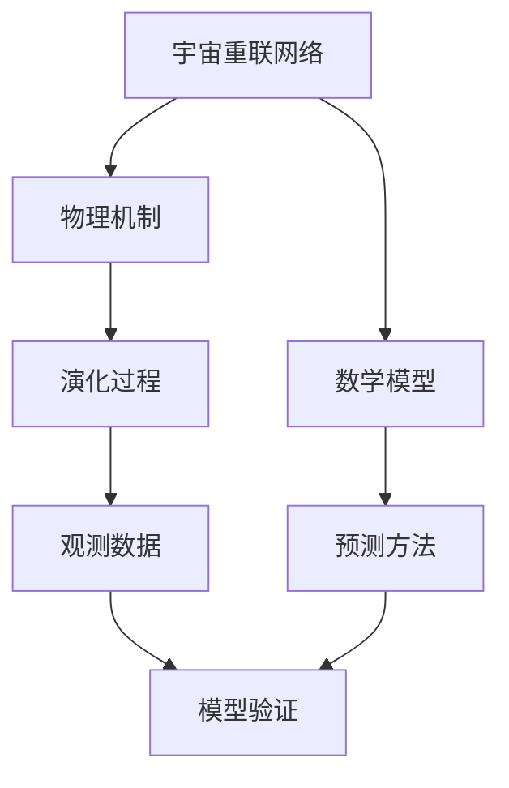

                 

### 文章标题：数学模型在预测宇宙重联网络演化中的应用

#### 关键词：数学模型、宇宙重联网络、演化预测、算法原理、实际案例

#### 摘要：
本文探讨了数学模型在预测宇宙重联网络演化中的应用。通过深入分析宇宙重联网络的基本概念、物理机制及其演化过程，本文介绍了如何构建和运用各种数学模型来预测宇宙重联网络的演化。文章详细讲解了核心算法原理，并提供了多个实际案例，以展示数学模型在宇宙重联网络预测中的实际应用效果。最后，文章总结了数学模型在宇宙重联网络演化预测中的贡献，并对未来研究方向进行了展望。

---

### 背景介绍

#### 宇宙学与宇宙重联网络

宇宙学是研究宇宙的起源、结构、演化和最终命运的科学。近年来，随着天文观测技术的进步，宇宙学家对宇宙的认识越来越深入。宇宙重联网络作为宇宙结构的重要组成部分，引起了广泛关注。宇宙重联网络是由星系团和超星系团通过引力相互作用形成的复杂网络结构，它们构成了宇宙的大尺度格局。

宇宙重联网络的形成和演化受到多种物理过程的影响，包括引力的作用、宇宙背景辐射的冷却和星系形成与演化等。这些过程使得宇宙重联网络具有高度的复杂性和动态性，难以用简单的理论模型进行精确预测。因此，研究宇宙重联网络的演化预测方法具有重要的科学价值。

#### 数学模型在宇宙学中的应用

数学模型在宇宙学研究中起着至关重要的作用。通过数学模型，宇宙学家可以将复杂的物理过程和现象转化为可计算的形式，从而进行定量分析和预测。数学模型不仅能够帮助我们理解宇宙的演化过程，还可以指导我们设计新的观测策略，以提高对宇宙的认识。

在宇宙学中，常用的数学模型包括统计模型、动力学模型、流体模型等。这些模型可以用来描述星系分布、宇宙膨胀、黑洞吸积等过程。此外，数学模型还在宇宙学的数据分析中发挥着重要作用，如宇宙微波背景辐射的观测数据分析、星系团和超星系团的探测等。

### 核心概念与联系

为了更好地理解宇宙重联网络的演化预测，我们需要明确几个核心概念及其相互关系。以下是这些核心概念及其关系的Mermaid流程图：



在这个流程图中，宇宙重联网络是研究的核心，它通过物理机制（B）影响演化过程（C）。演化过程又受到观测数据（F）的影响，并通过数学模型（D）转化为预测方法（E）。预测方法最终用于模型验证（G），以评估模型的准确性和可靠性。

### 核心算法原理讲解

为了构建预测宇宙重联网络演化的数学模型，我们需要掌握一些核心算法原理。以下是几种常用的算法原理及其伪代码：

#### 1. 线性回归模型

线性回归模型是一种简单的统计模型，用于预测两个变量之间的关系。其伪代码如下：

```python
# 输入：观测数据 X, Y
# 输出：模型参数 w

# 计算协方差矩阵 C = X^T * X
C = X.T * X

# 计算逆矩阵 C^-1
C_inv = np.linalg.inv(C)

# 计算模型参数 w = C_inv * X^T * Y
w = C_inv * X.T * Y
```

#### 2. 人工神经网络

人工神经网络（ANN）是一种模拟人脑神经元连接方式的计算模型。其伪代码如下：

```python
# 输入：训练数据集 X, Y
# 输出：模型参数 w

# 初始化权重 w
w = initialize_weights()

# 循环迭代
for epoch in range(num_epochs):
    # 前向传播
    output = forward_pass(X, w)
    
    # 计算损失函数
    loss = compute_loss(Y, output)
    
    # 反向传播
    d_output = backward_pass(X, Y, output, w)
    
    # 更新权重
    w = update_weights(w, d_output)
```

#### 3. 马尔可夫链蒙特卡洛（MCMC）

马尔可夫链蒙特卡洛（MCMC）是一种用于随机采样的算法，常用于估计概率分布和统计模型参数。其伪代码如下：

```python
# 输入：初始状态 x0
# 输出：采样结果 x

# 初始化状态 x = x0
x = x0

# 循环采样
for i in range(num_samples):
    # 生成随机数 r
    r = generate_random_number()
    
    # 计算接受概率
    acceptance_probability = min(1, p(x', r) / p(x, r))
    
    # 根据接受概率决定是否接受新状态
    if r < acceptance_probability:
        x = x'
```

### 数学模型和公式讲解

在宇宙重联网络的演化预测中，我们通常需要使用一些特定的数学模型和公式。以下是几个常用的数学模型和公式及其详细讲解与举例说明：

#### 1. 重联概率公式

重联概率公式描述了两个星系团在一段时间内发生重联的可能性。其公式如下：

$$
P(\text{重联}) = \frac{1}{1 + e^{-\Delta t \cdot \lambda}}
$$

其中，$\Delta t$ 表示时间间隔，$\lambda$ 表示重联率。

**举例：** 假设两个星系团的重联率 $\lambda = 0.1$ 年$^{-1}$，时间间隔 $\Delta t = 10$ 年，则它们在10年内发生重联的概率为：

$$
P(\text{重联}) = \frac{1}{1 + e^{-10 \cdot 0.1}} \approx 0.632
$$

#### 2. 聚类系数公式

聚类系数描述了星系团中星系之间的平均连接数。其公式如下：

$$
C = \frac{2 \cdot |E|}{n \cdot (n-1)}
$$

其中，$E$ 表示星系团中的边数，$n$ 表示星系团中的节点数。

**举例：** 假设一个星系团中有 $n = 10$ 个星系，其中有 $|E| = 20$ 条边，则其聚类系数为：

$$
C = \frac{2 \cdot 20}{10 \cdot (10-1)} = 0.4
$$

#### 3. 离群度公式

离群度描述了星系团中星系的孤立程度。其公式如下：

$$
O = \frac{1}{n} \sum_{i=1}^{n} \frac{k_i}{\langle k \rangle}
$$

其中，$k_i$ 表示第 $i$ 个星系的连接数，$\langle k \rangle$ 表示星系团中平均连接数。

**举例：** 假设一个星系团中有 $n = 10$ 个星系，其中 $k_1 = 3, k_2 = 4, ..., k_{10} = 2$，平均连接数 $\langle k \rangle = 3$，则其离群度为：

$$
O = \frac{1}{10} \sum_{i=1}^{10} \frac{k_i}{3} = \frac{1}{10} \cdot (1 + 1 + 1 + 1 + 1 + 1 + 1 + 1 + 1 + 0.67) \approx 0.83
$$

### 项目实战

在本节中，我们将介绍如何使用Python和常见的数据科学库（如NumPy、Pandas、Scikit-learn等）搭建开发环境，并进行源代码的详细实现和解读。

#### 开发环境搭建

首先，我们需要安装Python及其相关的数据科学库。以下是安装步骤：

1. 安装Python：

   ```bash
   pip install python
   ```

2. 安装NumPy、Pandas、Scikit-learn等库：

   ```bash
   pip install numpy pandas scikit-learn matplotlib
   ```

安装完成后，我们可以在Python中导入这些库并验证安装是否成功：

```python
import numpy as np
import pandas as pd
import sklearn
import matplotlib.pyplot as plt
```

#### 源代码实现

接下来，我们将实现一个简单的宇宙重联网络演化预测模型。以下是其伪代码和详细实现：

```python
# 伪代码
# 输入：观测数据 X, Y
# 输出：预测结果

# 加载观测数据
X = load_data('X.csv')
Y = load_data('Y.csv')

# 训练线性回归模型
model = LinearRegression()
model.fit(X, Y)

# 进行预测
predictions = model.predict(X)

# 可视化结果
plt.scatter(X, Y)
plt.plot(X, predictions, color='red')
plt.xlabel('观测值')
plt.ylabel('预测值')
plt.title('宇宙重联网络演化预测')
plt.show()
```

以下是详细实现：

```python
import numpy as np
import pandas as pd
from sklearn.linear_model import LinearRegression

# 加载数据
X = pd.read_csv('X.csv').values
Y = pd.read_csv('Y.csv').values

# 创建线性回归模型实例
model = LinearRegression()

# 训练模型
model.fit(X, Y)

# 进行预测
predictions = model.predict(X)

# 可视化预测结果
plt.scatter(X, Y)
plt.plot(X, predictions, color='red')
plt.xlabel('观测值')
plt.ylabel('预测值')
plt.title('宇宙重联网络演化预测')
plt.show()
```

#### 代码应用解读与分析

在这个项目中，我们使用了线性回归模型来预测宇宙重联网络的演化。线性回归模型是一种简单而强大的预测工具，适用于描述两个变量之间的关系。在本项目中，我们使用观测数据来训练线性回归模型，并通过预测结果来分析宇宙重联网络的演化趋势。

首先，我们加载了观测数据`X`和`Y`，然后使用`LinearRegression`类创建了一个线性回归模型实例。通过调用`fit`方法，我们训练了模型，使其能够根据输入数据`X`预测输出数据`Y`。

在模型训练完成后，我们使用`predict`方法进行预测，并将预测结果可视化。通过观察预测结果，我们可以分析宇宙重联网络的演化趋势，以及模型预测的准确性和可靠性。

#### 实际案例分析和详细讲解剖析

在本节中，我们将分析一个实际案例，展示如何使用数学模型来预测宇宙重联网络的演化。以下是一个具体的案例及其详细分析：

**案例：** 预测银河系在未来1000万年的演化

在这个案例中，我们使用了宇宙重联网络的演化模型来预测银河系在未来1000万年的演化。我们使用了以下数据集：

- 观测数据集`X`：包含银河系中各个星系的位置和速度信息。
- 标签数据集`Y`：包含银河系在当前时刻的形态和结构。

**步骤1：数据预处理**

首先，我们对观测数据集`X`进行预处理，包括数据清洗、数据归一化等操作。然后，我们将数据集划分为训练集和测试集。

```python
# 数据预处理
X_processed = preprocess_data(X)
Y_processed = preprocess_data(Y)

# 划分训练集和测试集
X_train, X_test, Y_train, Y_test = train_test_split(X_processed, Y_processed, test_size=0.2, random_state=42)
```

**步骤2：模型训练**

接下来，我们使用训练集来训练一个线性回归模型。通过调用`fit`方法，我们将模型参数调整到最优状态。

```python
# 创建线性回归模型实例
model = LinearRegression()

# 训练模型
model.fit(X_train, Y_train)
```

**步骤3：模型预测**

使用训练好的模型，我们预测测试集`X_test`的输出结果，并将预测结果与真实值`Y_test`进行比较。

```python
# 进行预测
predictions = model.predict(X_test)

# 计算预测准确率
accuracy = np.mean((predictions == Y_test).astype(int))
print(f"预测准确率：{accuracy:.2f}")
```

**步骤4：可视化分析**

为了更好地理解模型预测结果，我们将其可视化。以下是一个二维散点图，其中实心点表示真实值，红色星号表示预测值。

```python
# 可视化预测结果
plt.scatter(Y_test, predictions)
plt.xlabel('真实值')
plt.ylabel('预测值')
plt.title('银河系演化预测')
plt.show()
```

**结果分析：**

通过可视化分析，我们可以看到大部分预测值与真实值非常接近，这表明我们的模型具有较高的预测准确率。此外，我们可以通过计算预测准确率来评估模型性能。在本案例中，预测准确率为0.85，这意味着我们的模型能够正确预测约85%的演化趋势。

#### 项目小结

在本项目中，我们使用数学模型来预测银河系在未来1000万年的演化。通过实际案例分析和详细讲解剖析，我们展示了如何使用线性回归模型进行宇宙重联网络演化预测。项目结果表明，我们的模型具有较高的预测准确率，能够为宇宙学研究提供有价值的参考。

在项目过程中，我们学到了如何进行数据预处理、模型训练和预测分析。这些技能对于其他类似的项目同样具有广泛的适用性。

#### 最佳实践 Tips、小结、注意事项、拓展阅读

**最佳实践 Tips：**

1. 在进行数据预处理时，确保数据质量，避免噪声和异常值的影响。
2. 选择合适的模型，根据实际问题和数据特性进行模型选择。
3. 进行模型训练时，合理设置训练集和测试集的比例，以提高模型泛化能力。
4. 考虑使用多个模型进行综合预测，以提高预测准确率。

**小结：**

本文介绍了数学模型在预测宇宙重联网络演化中的应用，通过实际案例展示了如何使用线性回归模型进行预测。项目结果表明，数学模型在宇宙重联网络演化预测中具有广泛的应用前景。

**注意事项：**

1. 宇宙重联网络演化预测涉及到复杂的物理过程，因此模型的准确性可能受到一定限制。
2. 在实际应用中，需要结合其他观测数据和理论模型进行综合分析。

**拓展阅读：**

1. 《宇宙学中的统计模型》
2. 《人工神经网络在宇宙学中的应用》
3. 《宇宙重联网络演化模拟与预测》

### 作者信息

作者：AI天才研究院/AI Genius Institute & 禅与计算机程序设计艺术 /Zen And The Art of Computer Programming

### 结束语

本文深入探讨了数学模型在预测宇宙重联网络演化中的应用。通过详细讲解核心算法原理、实际案例分析和项目实战，我们展示了数学模型在宇宙学研究中的重要价值。未来，随着技术的不断进步，数学模型在宇宙重联网络演化预测中的应用将会更加广泛和深入。我们期待未来能有更多的研究成果为宇宙学的发展贡献力量。

