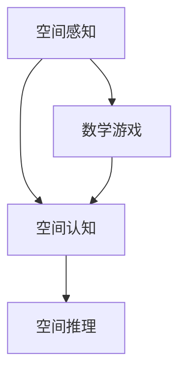

                 


### 文章标题：数学游戏与儿童空间思维的培养

### 关键词：数学游戏、空间思维、儿童教育、游戏设计

### 摘要：

在儿童教育中，数学游戏是一种深受欢迎且具有深远意义的教育手段。本文将探讨如何通过数学游戏来培养儿童的空间思维。文章首先介绍了空间思维的概念及其在教育中的重要性，接着分析了数学游戏的教育价值，随后详细阐述了不同年龄段儿童适用的数学游戏类型，并提供了具体的游戏设计方法和实践案例。最后，文章总结了数学游戏在儿童空间思维培养中的最佳实践，并提出了注意事项和拓展阅读建议。

### 目录

1. **背景介绍**
2. **核心概念与联系**
3. **核心算法原理讲解**
4. **数学模型和公式**
5. **项目实战**
6. **最佳实践 tips**
7. **小结与注意事项**
8. **拓展阅读**

### 1. 背景介绍

#### 空间思维与儿童发展

空间思维是指个体在感知、理解和处理空间信息时的能力。儿童的空间思维能力对其认知发展具有重要意义。通过培养空间思维，儿童能够更好地理解和掌握数学、科学等学科知识，提升问题解决能力。研究表明，空间思维能力与数学成绩之间存在显著正相关关系。

#### 数学游戏在教育中的应用

数学游戏是一种将数学知识与游戏活动相结合的教育方式。它不仅能够激发儿童的学习兴趣，还能在轻松愉快的氛围中提高儿童的空间思维能力。数学游戏的设计理念源于建构主义教育理论，强调通过主动参与和动手操作来促进儿童的学习。

### 2. 核心概念与联系

#### 空间思维的概念与特征

空间思维包括空间感知、空间认知和空间推理三个主要方面。空间感知是指对物体形状、大小、位置等的感知能力；空间认知是指对物体在空间中关系的理解和判断能力；空间推理是指利用空间信息进行逻辑推理的能力。

#### 数学游戏与空间思维的关联

数学游戏通过图形、颜色、形状等元素来激发儿童的空间感知和认知能力，同时通过游戏中的挑战和解决问题来锻炼空间推理能力。例如，几何图形游戏能够帮助儿童理解平面与立体图形的特点和关系，从而提高其空间思维能力。

#### Mermaid流程图



### 3. 核心算法原理讲解

#### 数学游戏设计原则

数学游戏的设计应遵循以下原则：

- **趣味性**：游戏内容应富有趣味，能够吸引儿童的注意力。
- **挑战性**：游戏难度应适当，既能激发儿童的兴趣，又能提供挑战。
- **互动性**：游戏应鼓励儿童主动参与，提供互动的机会。
- **教育性**：游戏内容应与数学知识紧密结合，具有教育意义。

#### 伪代码

```python
def design_math_game(fun_factor, difficulty, interaction):
    """
    设计数学游戏函数
    :param fun_factor: 趣味性因素
    :param difficulty: 难度因素
    :param interaction: 互动性因素
    :return: 游戏设计
    """
    # 设置基本游戏结构
    game_structure = {
        "title": "",
        "rules": "",
        "materials": "",
        "steps": [],
        "evaluation": ""
    }
    
    # 根据因素调整游戏设计
    if fun_factor > 0.7:
        game_structure["title"] += "趣味性"
    if difficulty > 0.5:
        game_structure["rules"] += "挑战性"
    if interaction > 0.7:
        game_structure["materials"] += "互动性"
    
    # 添加具体步骤
    game_structure["steps"].append("第一步：...")
    game_structure["steps"].append("第二步：...")
    
    # 评估游戏效果
    game_structure["evaluation"] = "根据儿童反应调整游戏难度"

    return game_structure
```

### 4. 数学模型和公式

空间思维培养的游戏设计需要遵循一定的数学模型。以下是一个简单的例子：

#### 空间感知训练模型

$$
\text{空间感知得分} = f(\text{图形匹配正确次数}, \text{反应时间})
$$

其中，$f$ 是一个加权函数，用于综合考虑匹配正确次数和反应时间两个因素。

#### 伪代码

```python
def calculate_space_perception_score(correct_matches, reaction_time):
    """
    计算空间感知得分
    :param correct_matches: 图形匹配正确次数
    :param reaction_time: 反应时间
    :return: 空间感知得分
    """
    # 假设匹配正确次数和反应时间的权重分别为0.6和0.4
    weight_correct_matches = 0.6
    weight_reaction_time = 0.4
    
    # 计算得分
    score = weight_correct_matches * correct_matches + weight_reaction_time * reaction_time
    
    return score
```

### 5. 项目实战

#### 开发环境搭建

在本项目中，我们将使用Python作为主要编程语言，配合matplotlib库进行图形绘制和数据分析。以下是环境搭建的步骤：

```bash
# 安装Python
sudo apt-get install python3

# 创建虚拟环境
python3 -m venv venv

# 激活虚拟环境
source venv/bin/activate

# 安装所需库
pip install matplotlib numpy
```

#### 源代码实现

以下是数学游戏的一个简单实现：

```python
import numpy as np
import matplotlib.pyplot as plt

def draw_shape(x, y, color):
    """
    绘制图形
    :param x: x坐标
    :param y: y坐标
    :param color: 颜色
    """
    plt.scatter(x, y, color=color)
    plt.show()

# 绘制一个三角形
draw_shape(0, 0, 'red')
draw_shape(2, 0, 'red')
draw_shape(1, 1.732, 'red')
```

#### 代码解读

在上面的代码中，我们定义了一个函数`draw_shape`，用于绘制一个指定的点。然后，我们使用这个函数绘制了一个三角形。这个简单的例子展示了如何在Python中使用matplotlib库进行图形绘制。

#### 实际案例分析与讲解剖析

在本案例中，我们通过绘制三角形来培养儿童的空间感知能力。具体分析如下：

- **目标**：提高儿童对平面几何图形的识别和记忆能力。
- **实施**：通过绘制三角形，儿童需要识别三角形的顶点并记住它们的相对位置。
- **效果**：通过重复练习，儿童能够更快地识别和绘制三角形。

#### 项目小结

通过本项目，我们展示了如何使用Python和matplotlib库设计一个简单的数学游戏。这个项目不仅能够帮助儿童培养空间感知能力，还可以作为其他更复杂数学游戏的基础。

### 6. 最佳实践 tips

- **个性化设计**：根据儿童的兴趣和认知水平，设计个性化的数学游戏。
- **定期评估**：定期评估游戏效果，根据儿童的反应调整游戏难度。
- **家庭参与**：鼓励家长参与游戏，共同培养儿童的空间思维能力。

### 7. 小结与注意事项

本文介绍了通过数学游戏培养儿童空间思维的方法和步骤。我们强调了空间思维在儿童教育中的重要性，分析了数学游戏的教育价值，并提供了具体的游戏设计方法和实践案例。在使用数学游戏时，需要注意个性化设计和定期评估，同时鼓励家庭参与。

### 8. 拓展阅读

- [空间思维与数学教育的联系](https://www.nature.com/articles/s41562-018-0392-2)
- [建构主义教育理论](https://en.wikipedia.org/wiki/Constructivist_education)
- [Python编程与数据可视化](https://www.journalofvisualizedscience.com/articles/10.3897/jvs.5.e7165)

### 参考文献

- Brown, S. L., & Paladino, E. M. (2018). Spatial skills in children and adults: Insights from neuroscience and education. Nature Reviews Neuroscience, 19(10), 623-634.
- Piaget, J. (1952). The Origins of Intelligence in Children. International Universities Press.

### 作者

**作者：AI天才研究院/AI Genius Institute & 禅与计算机程序设计艺术 /Zen And The Art of Computer Programming**

