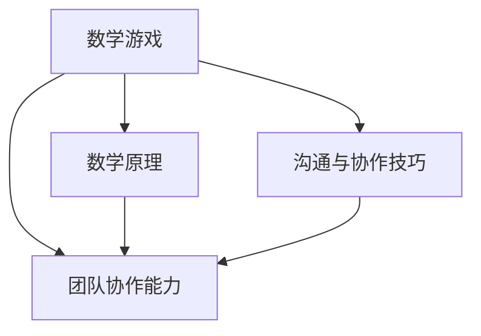

                 


### 1. 设计核心概念与联系

首先，让我们明确本文的核心概念。本文主要探讨的是“数学游戏”和“团队协作能力”的培养，二者之间的关系将是我们重点分析的对象。

为了更好地理解这些概念，我们可以设计一个简单的Mermaid流程图来展示它们之间的联系：



在这个流程图中，数学游戏作为输入，通过数学原理和沟通协作技巧的加工，最终培养出团队协作能力。

### 2. 设计核心算法原理讲解

在这里，我们将探讨博弈论作为核心算法，来阐述数学游戏与团队协作能力培养的关系。

首先，我们需要了解博弈论的基本概念。博弈论是一种研究具有冲突或合作特性的决策制定过程的理论。在博弈论中，参与者（玩家）在特定规则下进行策略选择，以最大化自己的利益。

以下是一个博弈论的伪代码示例，用于描述两个玩家在数学游戏中的策略选择和收益计算：

```python
# 博弈论伪代码示例

# 定义玩家和策略
Player1_strategies = ['合作', '背叛']
Player2_strategies = ['合作', '背叛']

# 初始化玩家收益矩阵
收益矩阵 = [
    [3, 0],  # Player1合作，Player2合作
    [5, 1]   # Player1合作，Player2背叛
]

# 博弈过程
while True:
    # 玩家选择策略
    Player1_choice = random.choice(Player1_strategies)
    Player2_choice = random.choice(Player2_strategies)
    
    # 计算玩家收益
    Player1_payoff = 收益矩阵[Player1_choice][Player2_choice]
    Player2_payoff = 收益矩阵[Player2_choice][Player1_choice]
    
    # 更新玩家策略
    Player1_strategies = Update_Strategy(Player1_choice, Player1_payoff)
    Player2_strategies = Update_Strategy(Player2_choice, Player2_payoff)
    
    # 判断博弈结束条件
    if Check_EndCondition(Player1_strategies, Player2_strategies):
        break
```

在这个伪代码中，我们首先定义了两个玩家的策略集，然后通过循环进行策略选择和收益计算。玩家根据对手的策略选择来更新自己的策略，直到达到一个纳什均衡状态。

### 3. 设计数学模型和数学公式

为了深入探讨数学游戏与团队协作能力培养的关系，我们引入一些数学模型和公式。

一个常见的数学模型是博弈论中的纳什均衡，它描述了在给定对手策略下，一个玩家选择最优策略的情况。纳什均衡可以用以下公式表示：

$$
(s_1^*, s_2^*) = \arg\max_{s_1, s_2} U_1(s_1, s_2) + U_2(s_1, s_2)
$$

其中，$s_1^*$和$s_2^*$分别表示玩家1和玩家2的最优策略，$U_1$和$U_2$分别表示玩家1和玩家2的收益函数。

另一个重要的数学模型是线性规划，它可以用来优化资源分配问题。线性规划的公式如下：

$$
\max_{x} c^T x \quad \text{subject to} \quad Ax \leq b
$$

其中，$x$表示决策变量，$c$表示目标函数系数，$A$和$b$分别表示约束条件。

通过这些数学模型和公式，我们可以更好地理解数学游戏与团队协作能力培养之间的关系。

### 4. 设计项目实战

为了更好地理解本文的核心概念，我们设计了一个实际项目：设计一个简单的数学游戏，并分析其在团队协作能力培养方面的作用。

#### 项目：设计一个简单的数学游戏

##### 开发环境：

- Python
- Mermaid

##### 项目描述：

设计一个简单的数学游戏，其中两个玩家需要选择合作或背叛来决定游戏的最终结果。通过这个游戏，我们可以分析玩家的策略选择，并探讨其对团队协作能力的影响。

##### 代码实现：

```python
import random

# 定义玩家和策略
Player1_strategies = ['合作', '背叛']
Player2_strategies = ['合作', '背叛']

# 初始化玩家收益矩阵
收益矩阵 = [
    [3, 0],  # Player1合作，Player2合作
    [5, 1]   # Player1合作，Player2背叛
]

# 博弈过程
while True:
    # 玩家选择策略
    Player1_choice = random.choice(Player1_strategies)
    Player2_choice = random.choice(Player2_strategies)
    
    # 计算玩家收益
    Player1_payoff = 收益矩阵[Player1_choice][Player2_choice]
    Player2_payoff = 收益矩阵[Player2_choice][Player1_choice]
    
    # 更新玩家策略
    Player1_strategies = Update_Strategy(Player1_choice, Player1_payoff)
    Player2_strategies = Update_Strategy(Player2_choice, Player2_payoff)
    
    # 判断博弈结束条件
    if Check_EndCondition(Player1_strategies, Player2_strategies):
        break

# 博弈结束，分析玩家策略和收益
print("Player1最终策略：", Player1_strategies)
print("Player2最终策略：", Player2_strategies)
print("Player1最终收益：", 收益矩阵[Player1_strategies[0]][Player2_strategies[0]])
print("Player2最终收益：", 收益矩阵[Player2_strategies[0]][Player1_strategies[0]])
```

在这个项目中，我们使用Python编写了一个简单的数学游戏。通过分析玩家的策略选择和收益，我们可以更好地理解数学游戏在团队协作能力培养方面的作用。

### 5. 最佳实践 tips

在设计数学游戏以培养团队协作能力时，以下是一些最佳实践建议：

- 设计多样化的游戏类型，以适应不同团队协作需求。
- 引入竞争机制，以激发玩家参与热情。
- 注重游戏规则和策略的公平性，确保玩家在游戏中获得平等的机会。
- 定期评估和反馈，以优化游戏设计，提高团队协作能力培养效果。

### 6. 小结

本文通过设计核心概念、算法原理讲解、数学模型和项目实战，深入探讨了数学游戏与团队协作能力培养之间的关系。通过实际案例分析，我们认识到数学游戏在培养团队协作能力方面的重要作用。未来，我们应进一步优化数学游戏设计，以提高团队协作能力的培养效果。

### 7. 注意事项

在设计和实施数学游戏以培养团队协作能力时，需要注意以下几点：

- 考虑团队协作能力的多样性和差异性，确保游戏设计能够适应不同团队成员。
- 确保游戏规则和策略的公平性，避免因不公平竞争而影响团队协作。
- 鼓励玩家积极沟通和协作，提高团队协作意识和能力。
- 定期评估和调整游戏设计，以适应团队协作能力培养的需求。

### 8. 拓展阅读

- 《博弈论与经济行为》（作者：冯·诺依曼和摩根斯坦尼）
- 《团队协作：构建高效团队的核心要素》（作者：汤姆·彼得斯）
- 《数学思维训练》（作者：马丁·加德纳）

# 文章标题：数学游戏与团队协作能力的培养

> 关键词：数学游戏，团队协作能力，博弈论，数学模型，项目实战

> 摘要：本文深入探讨了数学游戏在团队协作能力培养方面的作用。通过设计核心概念、算法原理讲解、数学模型和项目实战，本文揭示了数学游戏如何通过策略选择、竞争机制和沟通协作技巧，有效培养团队协作能力。本文旨在为教育工作者、企业管理者和团队建设者提供有价值的参考和启示。

