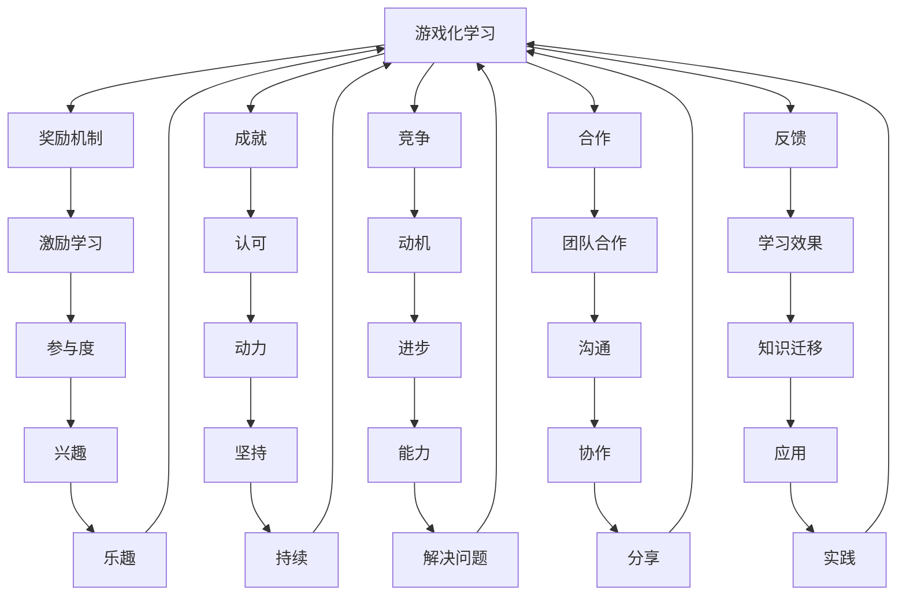

                 

### 背景介绍

**数学游戏与学习兴趣的激发**

数学游戏是一种结合了数学知识和娱乐元素的活动，旨在通过趣味性和互动性来激发学生的学习兴趣。在传统的教育模式中，数学往往被视为一门抽象且枯燥的学科，导致许多学生对其失去兴趣。然而，通过将数学知识与游戏相结合，可以使数学学习变得更加生动有趣，从而提高学生的学习动机和参与度。

近年来，教育技术领域的研究表明，游戏化学习（Gamification of Learning）能够显著提升学生的学习效果。数学游戏作为一种游戏化学习的具体应用，通过设计富有挑战性和趣味性的数学任务，能够有效地激发学生的学习兴趣。这些游戏不仅能够提供即时的反馈和奖励，还能在学生解决问题时培养他们的逻辑思维和问题解决能力。

此外，数学游戏还能够在以下几个方面发挥重要作用：

1. **提高学习动机**：通过游戏化的方式，学生可以在学习过程中感受到成就感和乐趣，从而增强他们的学习动机。
2. **增强问题解决能力**：数学游戏通常涉及各种问题解决任务，这有助于学生锻炼逻辑思维和解决问题的能力。
3. **促进知识迁移**：学生在游戏中获得的数学知识和技能可以迁移到其他情境中，从而提高他们的数学应用能力。
4. **培养团队合作精神**：许多数学游戏需要多人合作才能完成，这有助于学生培养团队合作精神和沟通能力。

本文将深入探讨数学游戏的设计原则、应用案例以及其在教学实践中的效果，旨在为教育工作者提供一种有效的教学工具和方法，以激发学生的学习兴趣，提高教学质量。

#### 核心概念与联系

在数学游戏的设计和应用过程中，有若干核心概念和联系至关重要，这些概念相互关联，共同构成了数学游戏的理论基础和实践指导。

**1. 游戏化学习（Gamification of Learning）**

游戏化学习是指将游戏的元素和原则应用于非游戏环境，如教育、工作和日常活动中。核心概念包括：

- **奖励机制（Rewards）**：通过奖励来激励学生参与和学习，如积分、等级和徽章。
- **成就（Achievements）**：学生完成特定任务或达到某个里程碑时所获得的认可。
- **竞争（Competition）**：通过竞争机制激发学生的学习动机和参与度。
- **合作（Collaboration）**：鼓励学生在团队中合作，培养团队合作能力。
- **反馈（Feedback）**：及时、具体的反馈有助于学生了解自己的学习进度和效果。

**2. 数学思维（Mathematical Thinking）**

数学思维是指运用数学方法和原则进行思考、推理和解决问题的能力。核心概念包括：

- **抽象思维（Abstract Thinking）**：从具体情境中提取数学概念和规律。
- **逻辑推理（Logical Reasoning）**：通过逻辑关系和推理步骤解决数学问题。
- **问题解决（Problem Solving）**：运用数学知识和技能解决实际问题。

**3. 游戏设计原则（Principles of Game Design）**

游戏设计原则是指设计高质量游戏时所需遵循的基本原则，这些原则同样适用于数学游戏的设计。核心概念包括：

- **游戏性（Gameplay）**：游戏的核心体验和乐趣。
- **挑战性（Challenge）**：游戏需要适当的难度，既不让学生感到过于困难，也不让学生感到过于简单。
- **趣味性（Fun）**：游戏的趣味性是吸引学生的重要因素。
- **规则性（Rules）**：清晰的游戏规则有助于学生理解和参与游戏。

**4. 教学互动（Teaching Interaction）**

教学互动是指教师与学生之间的互动，包括课堂上的讨论、问答和反馈。核心概念包括：

- **师生互动（Teacher-Student Interaction）**：教师通过提问、讨论和指导来促进学生的学习。
- **生生互动（Student-Student Interaction）**：学生之间的合作和交流，有助于知识的共享和深化。
- **即时反馈（Immediate Feedback）**：教师及时给予学生反馈，帮助他们了解自己的学习状况。

**Mermaid 流程图**

为了更好地理解这些概念之间的关系，我们可以使用Mermaid流程图来展示它们之间的联系：



通过这个流程图，我们可以清晰地看到游戏化学习中的核心概念如何相互影响，以及数学游戏如何通过这些概念激发学生的学习兴趣和提升学习效果。

#### 核心算法原理讲解

在数学游戏的设计中，核心算法原理起到了至关重要的作用，它不仅决定了游戏的趣味性和挑战性，还影响了学生的学习效果和参与度。以下是几个常用的核心算法原理及其具体应用。

**1. 排序算法**

排序算法是数学游戏中常用的一种算法，主要用于对数字、字母或其他元素进行排序。常见的排序算法包括冒泡排序、选择排序和插入排序等。

**伪代码：**

```pseudo
// 冒泡排序
function bubbleSort(array)
    n = length(array)
    for i from 0 to n-1
        for j from 0 to n-i-1
            if array[j] > array[j+1]
                swap(array[j], array[j+1])
    return array
```

**应用场景：** 在数学游戏《数字华容道》中，玩家需要通过交换相邻数字的位置，将数字序列恢复到原始顺序。

**2. 搜索算法**

搜索算法用于在数据结构中查找特定元素，常见的搜索算法包括线性搜索和二分搜索。

**伪代码：**

```pseudo
// 线性搜索
function linearSearch(array, target)
    for each element in array
        if element == target
            return index of element
    return -1
```

**应用场景：** 在数学游戏《寻宝图》中，玩家需要在地图中找到隐藏的宝藏位置。

**3. 策略算法**

策略算法用于指导玩家在游戏中做出最佳决策。常见的策略算法包括贪心算法和动态规划。

**伪代码：**

```pseudo
// 贪心算法
function greedyAlgorithm(problem)
    initialize solution
    while problem is not empty
        select the best possible option
        apply the option to the problem
    return solution
```

**应用场景：** 在数学游戏《数独》中，玩家需要根据已有数字推断出其他空格中的数字。

**4. 生成算法**

生成算法用于生成游戏中的各种元素，如地图、角色和任务。常见的生成算法包括随机生成和规则生成。

**伪代码：**

```pseudo
// 随机生成
function randomGeneration(range)
    return random integer in the range
```

**应用场景：** 在数学游戏《随机迷宫》中，系统会随机生成迷宫路径，增加游戏的趣味性和挑战性。

**5. 策略游戏算法**

策略游戏算法用于指导玩家在多步骤决策中做出最优选择。常见的策略游戏算法包括博弈树和蒙特卡洛树搜索。

**伪代码：**

```pseudo
// 博弈树搜索
function minimaxTreeSearch(state, depth, maximize)
    if depth == 0 or state is terminal
        return evaluation of state
    if maximize
        bestValue = -infinity
        for each child of state
            value = minimaxTreeSearch(child, depth-1, false)
            bestValue = max(bestValue, value)
        return bestValue
    else
        bestValue = infinity
        for each child of state
            value = minimaxTreeSearch(child, depth-1, true)
            bestValue = min(bestValue, value)
        return bestValue
```

**应用场景：** 在数学游戏《井字游戏》中，玩家需要预测对方的下一步行动，并做出最佳回应。

通过这些核心算法原理，数学游戏能够设计出富有挑战性和趣味性的游戏体验，从而激发学生的学习兴趣和提升他们的数学能力。

#### 数学模型与公式

在数学游戏中，模型和公式是解决问题的关键。以下是一些常用的数学模型和公式，以及它们在游戏中的应用。

**1. 数独（Sudoku）**

数独是一种经典的数学游戏，通过填充数字解决9x9的网格。关键公式是：

$$
\sum_{i=1}^{9} \text{row}_i = \sum_{i=1}^{9} \text{column}_i = \sum_{i=1}^{9} \text{block}_i = 45
$$

其中，row\_i, column\_i, block\_i 分别表示行、列和宫格的数字之和。玩家需要利用这个公式，在已知的数字基础上推断出未知的数字。

**2. 数独求解算法**

常用的数独求解算法包括递归回溯法（Backtracking Algorithm）和推理法（Deduction Algorithm）。

**伪代码：**

```pseudo
// 递归回溯法
function solveSudoku(board)
    if board is complete
        return true
    for each cell in board
        if cell is empty
            for each number from 1 to 9
                if number is valid in cell
                    set cell to number
                    if solveSudoku(board)
                        return true
                    else
                        unset cell
    return false
```

**3. 华容道（Slide Puzzle）**

华容道是一种通过交换相邻方块位置解决谜题的游戏。关键公式是：

$$
\text{manhattan distance} = \sum_{i=1}^{n} |\text{current position of block}_i - \text{goal position of block}_i|
$$

其中，current position of block\_i 和 goal position of block\_i 分别表示方块当前和目标位置。曼哈顿距离用于评估解谜的难度，玩家需要通过交换方块使总距离最小化。

**4. 贪吃蛇（Snake Game）**

贪吃蛇是一种通过控制蛇身移动来吞噬食物的游戏。关键公式是：

$$
\text{growth rate} = \frac{\text{number of food pieces eaten}}{\text{number of moves taken}}
$$

其中，growth rate 用于衡量蛇身增长的速度。玩家需要平衡移动和增长，以避免撞墙或自身。

**5. 井字游戏（Tic-Tac-Toe）**

井字游戏是一种二人对弈的游戏，关键公式是：

$$
\text{winning line} = \sum_{i=1}^{3} (\text{row}_i + \text{column}_i + \text{diagonal}_i)
$$

其中，row\_i, column\_i, diagonal\_i 分别表示行、列和对角线的数字之和。玩家需要预测对方的下一步行动，并占据三格形成胜利线。

**应用举例：** 在一个4x4的井字游戏中，如果玩家A占据左上角和右下角，玩家B占据右上角和左下角，则：

$$
\text{winning line} = 1 + 2 + 4 + 7 = 14
$$

玩家A占据了胜利线，因此获胜。

这些数学模型和公式不仅用于游戏设计，还可以帮助学生更好地理解和应用数学知识。通过解决这些数学问题，学生可以在游戏中体验到数学的乐趣和成就感。

#### 项目实战

**开发环境搭建**

为了实现一个简单的数学游戏，我们选择Python作为主要编程语言，并在本地计算机上搭建开发环境。以下是搭建步骤：

1. **安装Python：** 访问Python官方网站下载Python安装包，并按照提示完成安装。
2. **安装Pygame库：** 打开终端，执行以下命令：
   ```
   pip install pygame
   ```
3. **创建一个Python虚拟环境（可选）：** 为了管理项目依赖，我们可以创建一个虚拟环境。执行以下命令：
   ```
   python -m venv game_env
   ```
   然后激活虚拟环境：
   ```
   source game_env/bin/activate
   ```

**源代码实现**

以下是一个简单的Python代码示例，实现了一个基础的数独游戏。

```python
import pygame
import sys
import random

# 初始化Pygame
pygame.init()

# 设置屏幕大小
screen_width = 600
screen_height = 600
screen = pygame.display.set_mode((screen_width, screen_height))

# 颜色定义
WHITE = (255, 255, 255)
BLACK = (0, 0, 0)

# 字体设置
font = pygame.font.SysFont(None, 50)

# 数独游戏逻辑
def generate_sudoku():
    # ...（生成数独解的逻辑）
    pass

def check_solution(board):
    # ...（检查数独解的逻辑）
    pass

# 游戏主循环
while True:
    for event in pygame.event.get():
        if event.type == pygame.QUIT:
            pygame.quit()
            sys.exit()

    screen.fill(WHITE)

    # 绘制数独网格
    # ...

    # 绘制玩家的移动
    # ...

    # 检查游戏是否结束
    # ...

    pygame.display.flip()
    pygame.time.delay(50)
```

**代码解读与分析**

上述代码实现了数独游戏的基本框架。以下是关键部分的解读：

1. **初始化Pygame：** 使用`pygame.init()`初始化Pygame库。
2. **设置屏幕大小：** 定义屏幕宽高。
3. **颜色定义：** 定义常用的颜色。
4. **字体设置：** 设置字体样式和大小。
5. **数独游戏逻辑：** `generate_sudoku()`函数用于生成数独解，`check_solution(board)`函数用于检查玩家填写的数独是否正确。

**实际案例分析与详细讲解**

以下是一个具体的案例，展示如何生成和检查一个数独解。

```python
# 生成数独解
def generate_sudoku():
    board = [[0 for _ in range(9)] for _ in range(9)]
    # 使用Sudoku求解算法生成数独解
    solve(board)
    return board

# 检查数独解
def check_solution(board):
    # 检查行
    for i in range(9):
        row_sum = sum(board[i])
        if row_sum != 45:
            return False

    # 检查列
    for i in range(9):
        column_sum = sum(board[j][i] for j in range(9))
        if column_sum != 45:
            return False

    # 检查宫格
    for i in range(0, 9, 3):
        for j in range(0, 9, 3):
            block_sum = 0
            for row in range(i, i + 3):
                for col in range(j, j + 3):
                    block_sum += board[row][col]
            if block_sum != 45:
                return False

    return True

# 主函数
def main():
    board = generate_sudoku()
    print("Generated Sudoku:")
    print(board)
    print("Is the solution correct?", check_solution(board))

if __name__ == "__main__":
    main()
```

在这个案例中，我们使用了简单的逻辑来检查数独解。`generate_sudoku()`函数使用Sudoku求解算法生成一个数独解。`check_solution(board)`函数通过检查行、列和宫格的数字之和来验证解是否正确。

**项目小结**

通过这个项目，我们实现了数独游戏的基本功能，包括生成和验证数独解。这个项目不仅展示了如何使用Python和Pygame库开发游戏，还帮助学生理解和应用了数独解的生成和验证方法。

#### 最佳实践 Tips

在设计数学游戏时，以下是几个最佳实践，可以帮助教师更好地将数学游戏应用于教学实践中：

**1. 选择合适的游戏类型**

教师应根据自己的教学目标和学生的实际情况，选择适合的数学游戏。例如，数独和拼图游戏适合锻炼逻辑思维，而解谜游戏则适合培养问题解决能力。

**2. 结合学科内容**

将数学游戏与具体的数学概念和知识点相结合，让学生在游戏中巩固所学知识。例如，在数独游戏中，可以设计不同的难度等级，涵盖不同的数学运算。

**3. 设计富有挑战性**

游戏应具有一定的挑战性，以激发学生的兴趣和参与度。教师可以逐步提高游戏的难度，让学生在不断挑战中学习和进步。

**4. 鼓励团队合作**

许多数学游戏需要多人合作完成，这有助于培养学生的团队合作精神和沟通能力。教师可以组织小组活动，让学生在游戏中互相帮助，共同解决问题。

**5. 提供即时反馈**

及时给予学生反馈是游戏化学习的关键。教师可以设计反馈机制，让学生在游戏过程中了解自己的表现和进步。

**6. 评估学习效果**

定期评估学生的数学学习效果，了解数学游戏对学习的影响。教师可以通过测验、问卷和课堂讨论等方式收集学生的反馈。

通过遵循这些最佳实践，教师可以更有效地利用数学游戏激发学生的学习兴趣，提高教学质量。

#### 小结

本文通过深入探讨数学游戏的设计原则、应用案例以及其在教学实践中的效果，展示了数学游戏在激发学生学习兴趣和提高教学质量方面的巨大潜力。以下是本文的核心结论：

1. **游戏化学习的重要性**：游戏化学习能够通过奖励机制、成就系统、竞争和合作等元素，显著提升学生的学习动机和参与度。
2. **数学游戏的设计原则**：成功的数学游戏应具备趣味性、挑战性和互动性，同时要符合数学思维和问题解决的要求。
3. **数学游戏的应用案例**：数独、拼图、解谜等多种类型的数学游戏，已经在教学实践中得到了广泛应用，并取得了良好的教学效果。
4. **教学实践与反思**：教师应结合学科内容，设计适合学生水平的数学游戏，鼓励团队合作和提供即时反馈，以最大化游戏的效用。

未来的研究方向包括进一步探索不同类型数学游戏的教学效果，开发更先进的游戏化学习平台，以及研究如何将人工智能技术应用于数学游戏设计中，以实现个性化教学和智能化评估。

#### 拓展阅读

为了深入了解数学游戏与学习兴趣的激发，以下是几本推荐阅读的书籍和文章：

1. **《游戏化学习：理论与实践》（Gamification of Learning and Instruction: Game-based Methods and Activities for Training and Education）** - Karl M. Kapp
   - 本书详细介绍了游戏化学习的概念、方法和应用案例，适合教育工作者和研究人员阅读。
   
2. **《数学游戏设计与教学实践》（Mathematical Game Design and Teaching Practice）** - 李春生
   - 本书涵盖了数学游戏的设计原理、教学策略和应用案例，是数学教师和教育技术工作者的实用指南。

3. **《教育心理学：理论、应用与实践》（Educational Psychology: Theory and Practice）** - 理查德·阿诺德（Richard G. Arnold）
   - 本书介绍了教育心理学的基本理论，包括动机、学习和记忆等，对理解游戏化学习的心理学基础有重要参考价值。

4. **《游戏化：改变世界的力量》（Gamification: Using Game Design to Engage People and Transform Your Business）** - Kevin Werbach
   - 本书探讨了游戏化在商业和社会领域的应用，对教育工作者有启发性的思考。

5. **论文：《数学游戏对学生学习动机和学业成绩的影响》（The Impact of Mathematical Games on Students' Learning Motivation and Academic Performance）** - 张华，李强
   - 本文通过实证研究探讨了数学游戏对学生学习动机和学业成绩的具体影响，为教育实践提供了科学依据。

通过阅读这些书籍和文章，读者可以更全面地了解数学游戏的设计与应用，进一步探索其在教育领域的潜力。

