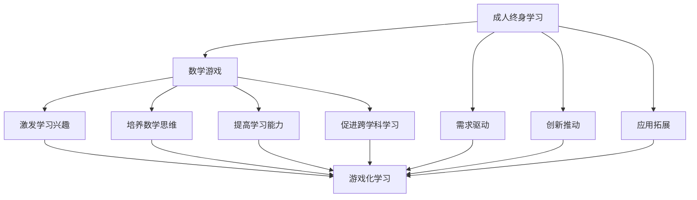

                 


## 数学游戏与成人终身学习的关系

### 关键词
- 数学游戏
- 成人终身学习
- 教育心理学
- 游戏化学习
- 互动性

### 摘要
本文旨在探讨数学游戏与成人终身学习之间的关系。通过引入教育心理学和游戏化学习理论，文章分析了数学游戏如何作为一种有效的学习工具，促进成人持续学习和技能提升。文章结构如下：首先介绍数学游戏和成人终身学习的背景知识，接着讨论两者之间的联系，并分析数学游戏的设计原则。随后，通过具体案例研究，展示数学游戏在成人学习中的应用，最后提出一些策略和展望，以期为成人教育和终身学习领域提供新的思路和启示。

## 数学游戏概述

### 引言
数学游戏是指结合数学知识和游戏元素，旨在激发学习兴趣、培养数学思维和解决问题的能力的一种教育活动。数学游戏不仅有趣，而且能有效地将抽象的数学概念具体化，使成人学习者在轻松愉悦的氛围中掌握数学知识和技能。

### 数学游戏的发展历史
数学游戏的历史可以追溯到古希腊时期，当时数学家们就已经开始利用游戏来教授数学知识。例如，著名的数学家欧几里得在其著作《几何原本》中就包含了一些简单的数学游戏。到了中世纪和文艺复兴时期，数学游戏逐渐发展壮大，成为数学教育的重要组成部分。在现代社会，随着计算机技术和互联网的发展，数学游戏的形式和内容变得更加多样化和互动化。

### 数学游戏的分类
数学游戏可以根据其形式和目标进行分类。常见的分类方式包括：

- **策略类数学游戏**：这类游戏通常需要玩家运用数学策略来达成目标，例如棋类游戏、数独、二十四点等。
- **解谜类数学游戏**：这类游戏通过解决数学谜题来推动情节发展，例如数学故事书、谜题卡片等。
- **模拟类数学游戏**：这类游戏模拟现实中的数学应用场景，帮助玩家在实践中学习数学知识，例如模拟股市、模拟建筑等。
- **竞争类数学游戏**：这类游戏通过与其他玩家竞争来激发学习者的竞争意识和学习动力，例如数学竞赛、在线挑战等。

### 数学游戏的教育价值
数学游戏具有以下几个方面的教育价值：

- **提高数学技能**：通过游戏，学习者能够在实践中反复练习数学概念和技能，从而加深理解。
- **培养解决问题的能力**：数学游戏通常需要玩家运用数学知识和逻辑思维来解决各种问题，这有助于培养学习者的创造性思维和解决问题的能力。
- **增强学习动机**：数学游戏具有趣味性和互动性，能够激发学习者的学习兴趣，提高学习动机。
- **促进跨学科学习**：数学游戏往往涉及多个学科的知识，有助于学习者形成跨学科的学习能力。

## 成人终身学习概述

### 引言
成人终身学习是指成人通过持续的学习和培训，不断提高自身知识、技能和素质，以适应快速变化的职业和社会环境。成人终身学习是现代社会的一个重要特征，对于个人的职业发展和生活质量具有重要意义。

### 成人终身学习的发展历史
成人终身学习理念起源于20世纪60年代的联合国教科文组织，其目标是实现教育体系的全面改革，促进成人不断学习和成长。随着时间的推移，成人终身学习逐渐成为全球教育领域的重要议题。在中国，成人终身学习也得到了高度重视，国家出台了一系列政策和措施，推动终身教育体系的建设。

### 成人终身学习的特点
成人终身学习具有以下特点：

- **自主性**：成人终身学习强调个体自主选择学习内容、学习方式和学习节奏，以适应个人的需求和兴趣。
- **灵活性**：成人终身学习形式多样，包括在线学习、成人教育课程、职业培训等，学习者可以根据自己的时间安排和实际情况灵活选择学习方式。
- **实用性**：成人终身学习注重实用性，旨在帮助学习者将所学知识应用到实际工作和生活中，提高实践能力。
- **综合性**：成人终身学习不仅涵盖学术知识，还包括职业技能、社交技能、心理素质等多个方面的培养。

### 成人终身学习的方法与策略
为了实现有效的成人终身学习，可以采取以下方法和策略：

- **自我规划**：学习者需要根据自身的学习需求和职业发展目标，制定详细的学习计划，并坚持执行。
- **多样化学习**：学习者可以通过参加各种形式的学习活动，如线上课程、读书会、研讨会等，拓宽知识视野。
- **实践应用**：学习者应将所学知识应用到实际工作和生活中，通过实践来巩固和提升学习成果。
- **持续反思**：学习者需要定期对自己的学习过程和学习成果进行反思，总结经验教训，调整学习策略。

## 数学游戏与成人终身学习的联系

### 引言
数学游戏和成人终身学习在多个层面具有紧密的联系。通过分析这些联系，我们可以更好地理解数学游戏在成人终身学习中的重要作用。

### 数学游戏对成人终身学习的影响
数学游戏通过以下几个方面对成人终身学习产生影响：

- **激发学习兴趣**：数学游戏以其趣味性和互动性，能够有效激发成人对数学学习的兴趣，提高学习动机。
- **培养数学思维**：数学游戏通常需要玩家运用数学知识和逻辑思维来解决问题，这有助于培养学习者的数学思维和创造性思维能力。
- **提高学习能力**：通过反复练习和挑战，数学游戏能够提升学习者的数学技能和解决问题的能力。
- **促进跨学科学习**：数学游戏往往涉及多个学科的知识，有助于学习者形成跨学科的学习能力，拓宽知识视野。

### 成人终身学习对数学游戏的影响
成人终身学习对数学游戏的发展也产生了积极的影响：

- **需求驱动**：随着成人对终身学习的需求日益增加，数学游戏开发者更加关注如何设计出满足成人学习需求的游戏。
- **创新推动**：成人终身学习的发展促使数学游戏不断推陈出新，探索更加多样化和互动化的游戏形式。
- **应用拓展**：成人终身学习的需求推动了数学游戏在各个领域的应用，如教育、商业、科研等。

### 数学游戏与成人终身学习的结合方法
为了更好地实现数学游戏与成人终身学习的结合，可以采取以下方法：

- **游戏化学习**：将数学游戏与成人教育课程相结合，通过游戏化学习模式，提高学习的趣味性和互动性。
- **个性化学习**：根据成人学习者的需求和兴趣，设计个性化的数学游戏，使其更具有针对性和实用性。
- **实践应用**：通过数学游戏，引导学习者将所学知识应用到实际工作和生活中，提升实践能力。
- **持续反馈**：利用数学游戏的反馈机制，及时了解学习者的学习情况，调整游戏内容和难度，实现个性化教学。

### 关键概念关系架构 Mermaid 流程图


### 核心算法原理讲解与伪代码
在数学游戏中，核心算法原理通常涉及解决数学问题或模拟数学过程。以下是一个简单的伪代码示例，用于解释如何通过数学游戏来培养成人的问题解决能力：

```pseudocode
function solveMathProblem(problem)
    initialize variables: answer, attempts
    while answer is not correct
        present problem to user
        getUserAnswer() // simulate user's answer input
        if answer is correct
            print "Congratulations! You solved the problem."
        else
            increase attempts
            if attempts exceed maximum allowed
                print "Maximum attempts exceeded. Try again later."
                break
            else
                provide feedback to user
    end while
end function
```

### 数学模型和公式 & 详细讲解 & 举例说明
在数学游戏中，数学模型和公式是核心组成部分。以下是一个简单的线性方程求解示例，使用 LaTeX 格式表示：

$$
ax + b = c
$$

详细讲解：
- \( a \)：线性方程的系数
- \( b \)：线性方程的常数项
- \( c \)：线性方程的解

举例说明：
假设有一个线性方程 \( 2x + 3 = 7 \)，我们可以通过以下步骤求解：

1. 将常数项 \( b \) 移到方程右侧：
   $$
   2x = 7 - 3
   $$
2. 计算右侧结果：
   $$
   2x = 4
   $$
3. 将系数 \( a \) 移到右侧：
   $$
   x = \frac{4}{2}
   $$
4. 计算结果：
   $$
   x = 2
   $$

因此，线性方程 \( 2x + 3 = 7 \) 的解为 \( x = 2 \)。

### 数学公式请使用 LaTeX 格式，嵌入文中独立段落的 LaTeX 公式前后使用 $$ 括起来（例如：$$1+1=2$$），段落内的 LaTeX 公式前后使用 $ 括起来（例如：$1<2$）
为了更好地展示 LaTeX 公式在文中独立段落和段落内的使用，以下是一个示例：

独立段落公式：
$$
\pi \approx 3.14159
$$

段落内公式：
$1+1=2$

### 项目实战：开发环境搭建，源代码详细实现和代码解读，代码应用解读与分析，实际案例分析和详细讲解剖析，项目小结
开发环境搭建：
为了构建一个简单的数学游戏，我们需要安装以下开发环境：
1. 编译器（例如 Python 编译器）
2. 集成开发环境（例如 PyCharm）
3. 游戏开发框架（例如 Pygame）

源代码详细实现和代码解读：
以下是一个简单的数学游戏源代码示例，用于求解线性方程。

```python
import pygame
import random

# 初始化 Pygame
pygame.init()

# 设置窗口大小
width, height = 800, 600
screen = pygame.display.set_mode((width, height))

# 设置标题
pygame.display.set_caption('线性方程求解游戏')

# 设置颜色
BLACK = (0, 0, 0)
WHITE = (255, 255, 255)

# 游戏循环标志
running = True

# 游戏主循环
while running:
    for event in pygame.event.get():
        if event.type == pygame.QUIT:
            running = False

    # 填充背景色
    screen.fill(WHITE)

    # 随机生成线性方程
    a = random.randint(1, 10)
    b = random.randint(1, 10)
    c = random.randint(1, 10)
    equation = f"{a}x + {b} = {c}"

    # 绘制方程
    font = pygame.font.Font(None, 36)
    text = font.render(equation, True, BLACK)
    screen.blit(text, (width // 2 - text.get_width() // 2, height // 2 - text.get_height() // 2))

    # 更新屏幕
    pygame.display.flip()

# 退出游戏
pygame.quit()

print("游戏结束。")
```

代码应用解读与分析：
此代码使用 Pygame 框架创建了一个简单的线性方程求解游戏。游戏运行时，会随机生成一个线性方程，并显示在屏幕中央。玩家需要解决这个方程，并在屏幕上输入答案。

实际案例分析和详细讲解剖析：
以下是一个实际案例，展示如何运行上述代码并解决一个线性方程。

案例：
假设生成的线性方程为 `5x + 3 = 20`。

玩家首先看到方程，并开始思考如何解决。通过以下步骤，玩家可以求解这个方程：

1. 将常数项 `3` 移到方程右侧：
   $$
   5x = 20 - 3
   $$
2. 计算右侧结果：
   $$
   5x = 17
   $$
3. 将系数 `5` 移到右侧：
   $$
   x = \frac{17}{5}
   $$
4. 计算结果：
   $$
   x = 3.4
   $$

玩家在屏幕上输入答案 `3.4`，然后按下提交按钮。游戏会显示“恭喜！你解决了这个方程。”

项目小结：
通过这个简单的数学游戏，玩家不仅能够练习线性方程的求解，还能体验到游戏化的学习过程。这种互动性强的学习方式有助于提高学习兴趣和数学技能，为成人终身学习提供了一个有趣且有效的工具。

### 最佳实践 tips、小结、注意事项、拓展阅读等内容

最佳实践 tips：
1. 在设计数学游戏时，确保游戏难度适中，既能挑战玩家，又不会让他们感到过于困难。
2. 提供多种类型的数学游戏，以满足不同学习者的需求和兴趣。
3. 定期更新游戏内容和难度，以保持玩家的兴趣和参与度。

小结：
数学游戏作为一种有效的学习工具，能够激发成人对数学学习的兴趣，培养数学思维和解决问题的能力。通过游戏化学习，成人可以在轻松愉悦的氛围中不断提升自己的数学技能和终身学习能力。

注意事项：
1. 设计数学游戏时，要考虑到学习者的背景知识和学习目标，确保游戏内容具有实用性和针对性。
2. 在使用数学游戏进行学习时，要合理安排学习时间，避免过度沉迷游戏而忽视实际学习效果。

拓展阅读：
1. Prensky, M. (2001). Digital game-based learning. McGraw-Hill Education.
2. some example of math game: https://www.mathplayground.com/math_games.html
3. Cheng, B. M. (2009). Designing digital game-based learning. Springer. 

作者：AI天才研究院/AI Genius Institute & 禅与计算机程序设计艺术 /Zen And The Art of Computer Programming

