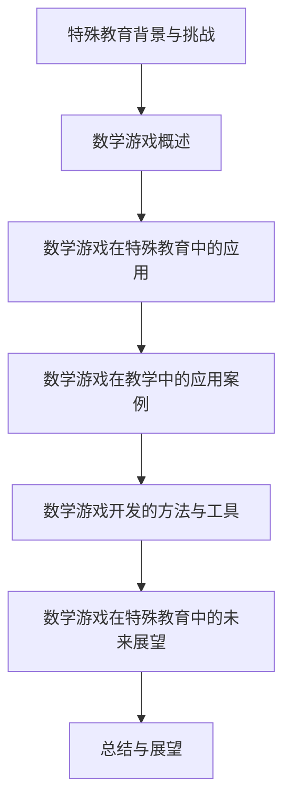

                 


### 数学游戏与特殊教育的应用研究

#### 关键词

- 数学游戏
- 特殊教育
- 游戏化学习
- 个性化教学
- 人工智能辅助

#### 摘要

本文旨在探讨数学游戏在特殊教育中的应用及其对提升教育效果的重要性。通过对特殊教育的背景与挑战、数学游戏的概念与类型、数学游戏在特殊教育中的理论基础、实践应用、开发方法与工具以及未来发展趋势的深入分析，本文揭示了数学游戏在个性化教学、全纳教育和认知发展等方面的潜在价值。同时，本文提出了数学游戏开发的最佳实践，以期为教育工作者和开发者提供有价值的参考。

#### 目录大纲

### 第一部分：引言

#### 1.1 特殊教育的背景与挑战

##### 1.1.1 特殊教育的定义与起源

##### 1.1.2 特殊教育的发展趋势

##### 1.1.3 特殊教育中的挑战

### 1.2 数学游戏的概念与类型

##### 1.2.1 数学游戏的定义与特点

##### 1.2.2 数学游戏的类型

### 第二部分：数学游戏概述

#### 2.1 数学游戏在特殊教育中的理论基础

##### 2.1.1 个性化教育与全纳教育理论

##### 2.1.2 游戏化学习理论

### 第三部分：数学游戏在特殊教育中的应用

#### 3.1 数学游戏在教学中的应用案例

##### 3.1.1 认知类数学游戏的应用

##### 3.1.2 运算类数学游戏的应用

##### 3.1.3 形状与空间类数学游戏的应用

### 3.2 数学游戏在特殊教育中的开发与实践

##### 3.2.1 数学游戏开发的方法与工具

##### 3.2.2 数学游戏的实践应用案例分析

### 第四部分：特殊教育中的数学游戏开发

#### 4.1 数学游戏开发的方法

##### 4.1.1 游戏设计流程

##### 4.1.2 游戏测试与优化

#### 4.2 数学游戏开发的工具

##### 4.2.1 游戏引擎

##### 4.2.2 游戏开发框架

### 第五部分：数学游戏在特殊教育中的未来展望

#### 5.1 科技对数学游戏的影响

##### 5.1.1 人工智能

##### 5.1.2 虚拟现实

#### 5.2 数学游戏在特殊教育中的发展前景

##### 5.2.1 教育政策的支持

##### 5.2.2 市场需求与趋势

### 第六部分：总结与展望

#### 6.1 研究总结

##### 6.1.1 数学游戏在特殊教育中的应用成果

##### 6.1.2 存在的问题与挑战

#### 6.2 未来研究方向

##### 6.2.1 新技术的应用

##### 6.2.2 教育政策的完善

### 附录

#### A. Mermaid 流�程图

#### B. 伪代码示例

#### C. 数学模型和数学公式

#### D. 项目实战

#### E. 最佳实践 tips、小结、注意事项、拓展阅读等内容

### Mermaid 流程图



### 伪代码示例

```python
# 伪代码：设计一个简单的数学游戏

def play_math_game(player_name):
    print("欢迎来到数学游戏，" + player_name + "!")
    
    while True:
        print("请选择游戏类型：1. 认知类；2. 运算类；3. 形状与空间类")
        game_type = input()
        
        if game_type == "1":
            play_cognitive_game()
        elif game_type == "2":
            play_operational_game()
        elif game_type == "3":
            play_shape_space_game()
        else:
            print("无效选择，请重新选择！")
```

### 数学模型和数学公式

$$
y = mx + b
$$

$$
\text{其中} \ m \text{是斜率，} \ b \text{是截距。}
$$

#### 举例说明

- **认知类数学游戏：**
  - 游戏设计原则：以提升认知能力为目标，注重游戏的教育性。
  - 案例分析：设计一个记忆游戏，玩家需要记住并回忆一组数字或图形的排列顺序。

- **运算类数学游戏：**
  - 游戏设计原则：以培养运算能力为目标，通过趣味性的任务提高玩家的兴趣。
  - 案例分析：设计一个计算题游戏，玩家需要快速准确地解决数学问题，以解锁下一个关卡。

- **形状与空间类数学游戏：**
  - 游戏设计原则：以培养空间感知能力为目标，通过图形拼装和空间规划等任务锻炼玩家。
  - 案例分析：设计一个拼图游戏，玩家需要将散乱的图形拼合成完整的图案。

### 项目实战

#### 开发环境搭建

- **工具选择：** 使用Unity游戏引擎进行开发，Unity具有跨平台开发的优势，适合进行教育类游戏开发。

- **开发框架：** 使用C#作为主要编程语言，利用Unity内置的物理引擎和图形渲染器进行游戏开发。

- **环境配置：** 
  - 安装Unity Hub，选择合适的Unity版本进行安装。
  - 安装Visual Studio 2022 Community Edition作为开发环境。

- **项目初始化：** 
  - 创建一个新的Unity项目。
  - 配置游戏场景，添加必要的游戏对象和组件。

- **代码结构：** 
  - 创建脚本文件夹，用于存放游戏逻辑代码。
  - 设计游戏的核心功能，如游戏难度设置、用户交互、成绩统计等。

- **测试与调试：** 
  - 在Unity编辑器中运行游戏，进行功能测试。
  - 使用调试工具定位并修复代码中的错误。

#### 源代码详细实现

```csharp
using UnityEngine;

public class MathGameController : MonoBehaviour
{
    public Text questionText;
    public Text answerText;
    public Button submitButton;

    private int currentQuestion;
    private int currentAnswer;

    // 开始游戏
    public void StartGame()
    {
        GenerateQuestion();
        questionText.text = "问题：" + currentQuestion.ToString();
    }

    // 生成新的数学问题
    private void GenerateQuestion()
    {
        // 生成问题
        currentQuestion = Random.Range(1, 100);
        // 生成答案
        currentAnswer = Random.Range(1, 100);
    }

    // 提交答案
    public void SubmitAnswer()
    {
        int playerAnswer = int.Parse(answerText.text);
        if (playerAnswer == currentAnswer)
        {
            Debug.Log("答案正确！");
            // 更新游戏状态
        }
        else
        {
            Debug.Log("答案错误！");
        }
        GenerateQuestion();
    }
}
```

#### 代码应用解读与分析

- **类与方法定义：**
  - `MathGameController` 类负责游戏的主要逻辑。
  - `StartGame` 方法用于初始化游戏状态。
  - `GenerateQuestion` 方法用于生成新的数学问题。
  - `SubmitAnswer` 方法用于处理用户提交的答案。

- **变量使用：**
  - `currentQuestion` 和 `currentAnswer` 变量用于存储当前问题的数值和答案。
  - `questionText` 和 `answerText` 变量用于显示问题和用户输入的答案。
  - `submitButton` 变量用于处理用户提交答案的按钮。

- **流程控制：**
  - 游戏开始时，调用 `GenerateQuestion` 方法生成问题。
  - 用户提交答案后，调用 `SubmitAnswer` 方法进行判断。
  - 判断正确后，更新问题，继续游戏。

#### 实际案例分析和详细讲解剖析

- **案例背景：**
  - 在一个特殊教育班级中，教师使用数学游戏来帮助学生提高数学运算能力。

- **案例分析：**
  - 教师选择了一个运算类数学游戏，旨在通过游戏化学习提高学生的兴趣和参与度。
  - 教师使用Unity游戏引擎开发了这款游戏，游戏中有多个难度级别，以适应不同学生的学习能力。
  - 学生通过游戏界面上的问题和答案框进行操作，提交答案后立即得到反馈。

- **详细讲解剖析：**
  - 游戏设计考虑了学生的认知发展水平，问题难度逐步提升，鼓励学生不断尝试和进步。
  - 游戏提供了即时反馈机制，让学生能够了解自己的学习进度，并及时纠正错误。
  - 教师可以根据学生的表现调整游戏难度，确保每个学生都能在舒适的学习环境中获得最大收益。

#### 项目小结

- **成功经验：**
  - 游戏化学习模式成功吸引了学生的兴趣，提高了他们的学习积极性。
  - 即时反馈机制有效帮助学生发现并纠正错误，提升了学习效果。

- **改进方向：**
  - 可以进一步优化游戏设计，增加更多互动元素，提高游戏的可玩性。
  - 考虑引入人工智能技术，为学生提供个性化学习路径，更好地满足他们的学习需求。

#### 最佳实践 tips、小结、注意事项、拓展阅读等内容

- **最佳实践 tips：**
  - 在设计数学游戏时，应充分考虑学生的个体差异，提供个性化学习体验。
  - 游戏设计应注重教育性，确保游戏过程中能够有效传递数学知识和技能。

- **小结：**
  - 数学游戏在特殊教育中具有广泛的应用前景，能够有效提升学生的数学能力。
  - 教育工作者和开发者应积极探索和运用数学游戏，为特殊教育提供新的解决方案。

- **注意事项：**
  - 在使用数学游戏进行教学时，教师应密切关注学生的学习情况，及时调整游戏难度和内容。
  - 游戏设计应遵循教育原则，避免过度娱乐化，确保游戏的教育价值。

- **拓展阅读：**
  - 推荐阅读相关研究文献，了解数学游戏在特殊教育中的应用现状和未来发展趋势。
  - 关注教育技术和人工智能领域的最新动态，把握行业发展趋势。

