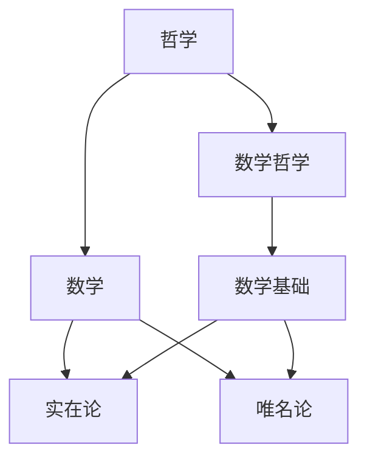
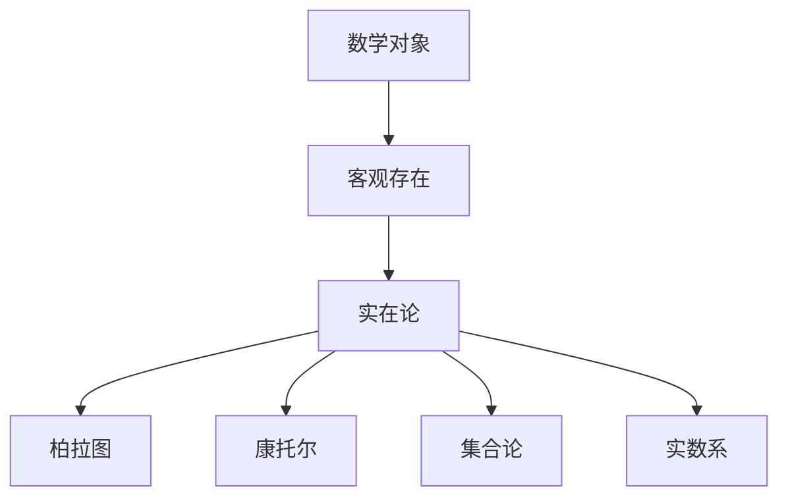
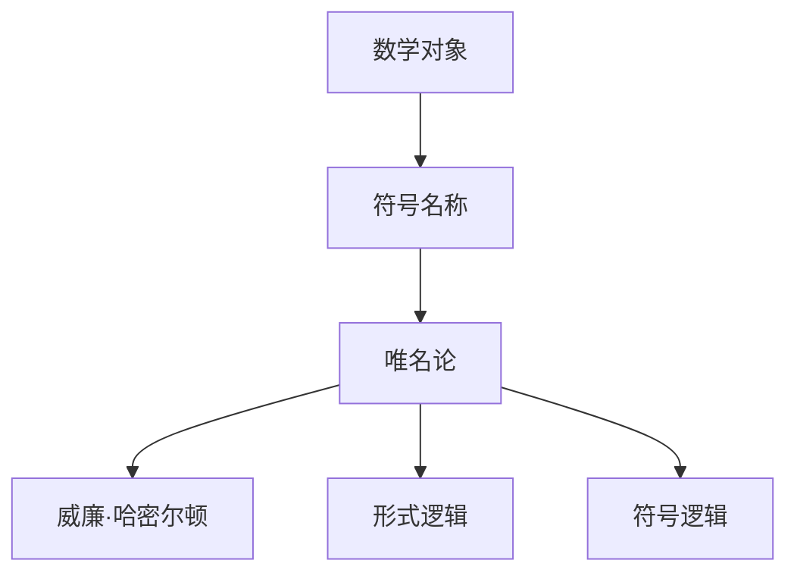
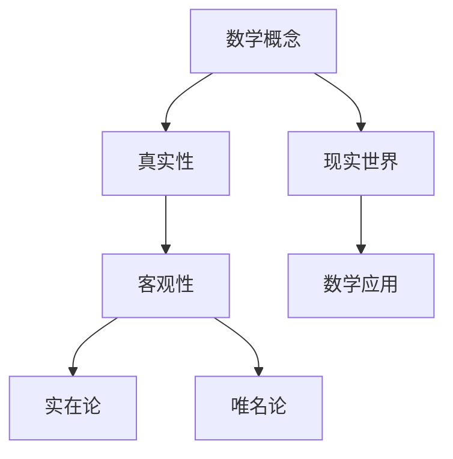
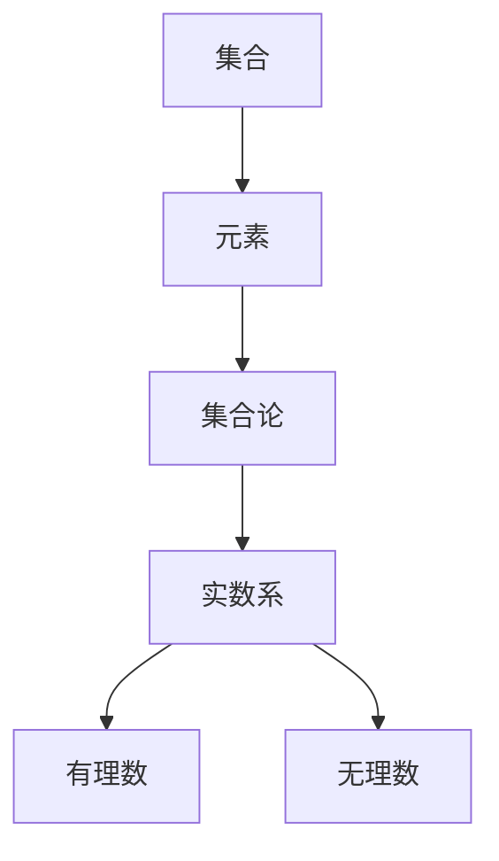
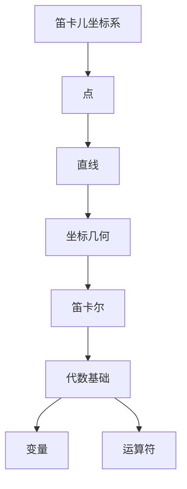
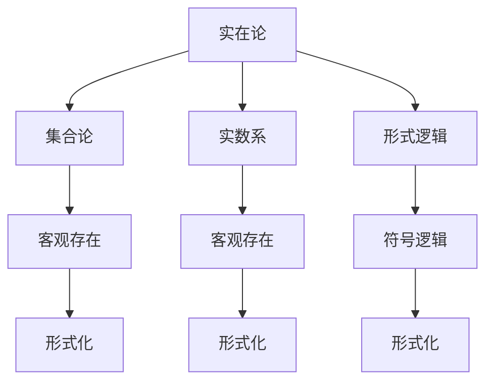
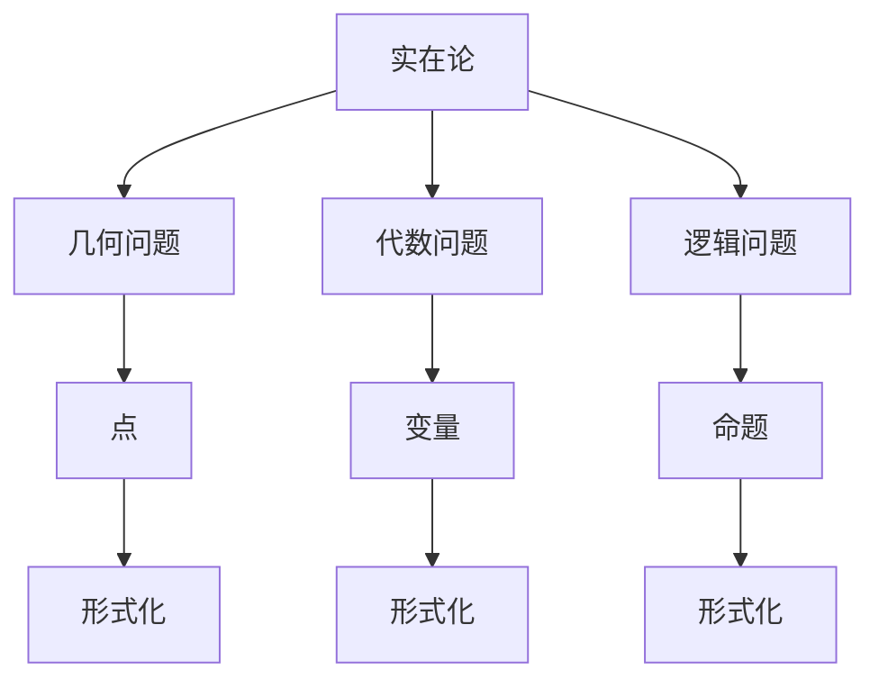
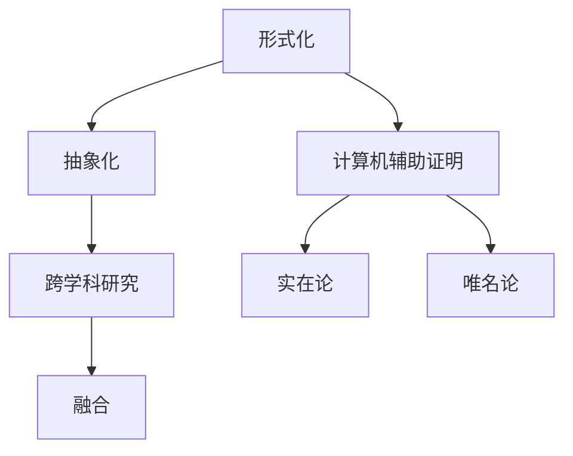

                 

### 文章标题

《数学的哲学基础：实在论vs.唯名论》

### 关键词

数学哲学、实在论、唯名论、数学基础、哲学探讨、数学原理、数学应用

### 摘要

本文深入探讨了数学哲学中的两大基础理论：实在论与唯名论。通过对这两种哲学观点的详细分析，我们揭示了它们在数学原理与应用中的不同影响。本文旨在为读者提供一个清晰、系统的理解框架，以帮助他们在数学研究中更好地应用这些哲学思想。文章还将对比这两种观点的优缺点，并展望数学哲学的未来发展方向。

---

### 第一部分：引论

#### 1.1 书籍背景与目标

**核心概念与联系**：

- **实在论**：认为数学对象具有独立于人类意识的存在。
- **唯名论**：认为数学对象仅仅是名称，没有独立的实在性。
- **哲学与数学的关系**：探讨数学概念与现实世界的关系，影响数学发展的方向。

**核心概念原理之间的关系架构 Mermaid 流程图**：



**核心算法原理讲解**：

在此部分，我们将不会涉及具体的算法原理，因为本文的重点是哲学基础而非数学算法。

**数学模型和公式**：

无具体的数学模型和公式，因为本文讨论的是哲学问题，而非数学技术。

#### 1.2 实在论简介

**核心概念与联系**：

- **实在论的基本观点**：数学对象存在于客观世界，与人类认知无关。
- **主要实在论思想家及其贡献**：例如柏拉图、康托尔。
- **实在论在数学中的应用**：例如集合论、实数系。

**核心概念原理之间的关系架构 Mermaid 流程图**：



**核心算法原理讲解**：

```plaintext
# 集合论的基本概念
- 集合：由确定的元素组成的整体。
- 子集：一个集合是另一个集合的部分或全部。
- 集合运算：交集、并集、补集等。

# 实数系的构造
- 实数：包含有理数和无理数的数系。
- 实数的基本性质：完备性、无二义性。
```

**数学模型和数学公式**：

无具体的数学模型和公式，因为本文讨论的是哲学问题，而非数学技术。

#### 1.3 唯名论简介

**核心概念与联系**：

- **唯名论的基本观点**：数学对象仅是符号和名称，没有独立存在。
- **主要唯名论思想家及其贡献**：例如威廉·哈密尔顿。
- **唯名论在数学中的应用**：例如形式逻辑、符号逻辑。

**核心概念原理之间的关系架构 Mermaid 流程图**：



**核心算法原理讲解**：

```plaintext
# 笛卡尔的坐标几何
- 坐标系：使用有序对表示点。
- 直线方程：y = mx + b。
- 平面几何：通过坐标进行计算。

# 代数基础
- 变量：表示未知量的符号。
- 代数式：包含变量和运算符的表达式。
- 解方程：找出使等式成立的变量值。
```

**数学模型和数学公式**：

无具体的数学模型和公式，因为本文讨论的是哲学问题，而非数学技术。

#### 1.4 数学哲学的基本问题

**核心概念与联系**：

- **数学的基础问题**：数学概念的真实性和客观性。
- **真实性与客观性**：数学对象是否独立于人类意识存在。
- **数学与现实的关系**：数学与现实世界的对应关系。

**核心概念原理之间的关系架构 Mermaid 流程图**：



**核心算法原理讲解**：

在此部分，我们将不会涉及具体的算法原理，因为本文的重点是哲学基础而非数学算法。

**数学模型和数学公式**：

无具体的数学模型和公式，因为本文讨论的是哲学问题，而非数学技术。

### 第二部分：实在论的数学基础

#### 2.1 实在论与数学原理

**核心概念与联系**：

- **集合论的基本概念**：集合是由确定元素组成的一个整体。
- **实数系的构造**：实数系是通过有理数和无理数的集合构造出来的。

**核心概念原理之间的关系架构 Mermaid 流程图**：



**核心算法原理讲解**：

```plaintext
# 集合论的基本概念
- 集合：{a, b, c} 表示一个包含元素 a、b、c 的集合。
- 子集：{a, b} 是 {a, b, c} 的子集。
- 集合运算：
  - 交集：A ∩ B 表示 A 和 B 的交集。
  - 并集：A ∪ B 表示 A 和 B 的并集。
  - 补集：∁A 表示 A 的补集。

# 实数系的构造
- 有理数：可以表示为分数的数。
- 无理数：不能表示为分数的数。
- 实数：有理数和无理数的集合。
- 实数的基本性质：
  - 完备性：任何有界实数集合都有最小上界和最大下界。
  - 无二义性：实数的运算和比较都是明确的。
```

**数学模型和数学公式**：

- 集合论模型：
  - 集合的表示：{x | P(x)}
  - 集合的交集：A ∩ B = {x | x ∈ A 且 x ∈ B}
  - 集合的并集：A ∪ B = {x | x ∈ A 或 x ∈ B}
  - 集合的补集：∁A = {x | x ∉ A}

- 实数系模型：
  - 有理数：Q = {a/b | a, b ∈ 整数，b ≠ 0}
  - 无理数：R - Q
  - 实数：R = Q ∪ (R - Q)
  - 实数的运算：
    - 加法：x + y
    - 减法：x - y
    - 乘法：x * y
    - 除法：x / y（y ≠ 0）

**详细讲解 & 举例说明**：

为了更好地理解集合论和实数系，我们可以通过具体例子来阐述。

**例子 1**：集合 {1, 2, 3} 的补集是什么？

- 解答：∁{1, 2, 3} = {x | x ∉ {1, 2, 3}} = {x | x ∈ 整数集合，且 x ≠ 1 且 x ≠ 2 且 x ≠ 3}

**例子 2**：求集合 {x | x 是偶数} 和 {x | x 是整数} 的交集。

- 解答：{x | x 是偶数} ∩ {x | x 是整数} = {x | x 是偶数整数} = {2, 4, 6, ...}

#### 2.2 实在论的数学应用

**项目实战**：

在数学分析中，我们可以看到实在论思想的应用。

**例子 1**：使用集合论描述实数。

- 解答：实数集 R 可以通过有理数集 Q 和无理数集 R-Q 的并集来描述。即 R = Q ∪ (R - Q)。

**例子 2**：利用实数系的完备性证明一个定理。

- 解答：假设存在一个无界实数集 A，对于任意的正数 M，都可以找到 a ∈ A，使得 a > M。由于实数系的完备性，A 必须有最小上界。但这与假设 A 无界矛盾，因此假设不成立。所以，任何实数集都是有界的。

**例子 3**：在几何学中，使用实数系来定义点。

- 解答：在笛卡儿坐标系中，每个点都可以表示为有序对 (x, y)，其中 x 和 y 是实数。这样，实数系为几何学提供了一个精确的表示工具。

#### 2.3 实在论的数学挑战

**详细讲解 & 举例说明**：

尽管实在论在数学中有很多应用，但它也面临一些哲学问题和数学上的挑战。

**例子 1**：无穷大问题。

- 解答：实在论认为数学对象存在于客观世界，但无穷大概念在现实中并没有具体的实体。如何处理无穷大是一个哲学问题，也是数学上的挑战。

**例子 2**：形式化问题。

- 解答：实在论认为数学概念具有客观性，但如何将这些概念形式化，使其能够被证明和验证，是一个技术上的挑战。

**例子 3**：构造性数学。

- 解答：实在论可能无法完全解释构造性数学，因为构造性数学要求证明的每一步都必须能够构造出具体的对象。这要求实在论在处理构造性证明时做出一些调整。

### 第三部分：唯名论的数学基础

#### 3.1 唯名论与数学原理

**核心概念与联系**：

- **笛卡儿的坐标几何**：使用坐标系来表示点和直线。
- **代数基础**：使用变量和运算符来表示数学关系。

**核心概念原理之间的关系架构 Mermaid 流程图**：



**核心算法原理讲解**：

```plaintext
# 笛卡儿的坐标几何
- 坐标系：通过有序对 (x, y) 来表示点。
- 直线方程：y = mx + b，其中 m 是斜率，b 是 y 轴截距。

# 代数基础
- 变量：表示未知量的符号。
- 代数式：包含变量和运算符的表达式。
- 解方程：找出使等式成立的变量值。
```

**数学模型和数学公式**：

- 坐标几何模型：
  - 点：P(x, y)
  - 直线方程：y = mx + b
  - 二元一次方程：ax + by = c

- 代数基础模型：
  - 变量：x, y, z
  - 运算符：+，-，*，/
  - 代数式：ax + by + cz = d

**详细讲解 & 举例说明**：

为了更好地理解笛卡儿的坐标几何和代数基础，我们可以通过具体例子来阐述。

**例子 1**：在坐标系中表示点 A(2, 3)。

- 解答：点 A 的坐标为 (2, 3)。

**例子 2**：求解直线方程 y = 2x + 1 上的点。

- 解答：令 x = 0，得到 y = 1；令 y = 0，得到 x = -1/2。所以，直线上的点为 (0, 1) 和 (-1/2, 0)。

**例子 3**：求解二元一次方程 2x + 3y = 6。

- 解答：通过代入法或消元法，我们可以得到 x = 1，y = 2。

#### 3.2 唯名论的数学应用

**项目实战**：

在数学中，唯名论思想在形式逻辑和符号逻辑中得到了广泛应用。

**例子 1**：形式逻辑的应用。

- 解答：形式逻辑使用符号和规则来表示逻辑推理。例如，命题逻辑中的命题 P 和命题 Q 可以表示为 P ∧ Q，表示 P 和 Q 同时为真。

**例子 2**：符号逻辑的应用。

- 解答：符号逻辑使用符号和公式来表示数学关系。例如，集合论中的集合 A 和集合 B 可以表示为 A ∪ B，表示 A 和 B 的并集。

**例子 3**：在证明论中的应用。

- 解答：证明论使用符号和规则来证明数学定理。例如，我们可以使用符号推理证明某个定理的正确性。

#### 3.3 唯名论的数学局限

**详细讲解 & 举例说明**：

尽管唯名论在数学中有广泛应用，但它也存在一些局限。

**例子 1**：无穷大问题。

- 解答：唯名论认为数学对象仅仅是符号，但无穷大概念无法通过具体符号表示。这在形式逻辑中导致了一些问题。

**例子 2**：抽象概念的处理。

- 解答：唯名论难以处理一些抽象的数学概念，如复数、矢量等。这些概念在现实中没有直观的对应物，因此难以用唯名论来解释。

**例子 3**：哲学上的局限性。

- 解答：唯名论认为数学对象仅仅是符号，但这可能导致数学与现实世界的脱离。这在哲学上引发了一些争议。

### 第四部分：实在论与唯名论的对比与综合

#### 4.1 对比分析

**详细讲解 & 举例说明**：

实在论与唯名论在数学中有不同的影响。

**例子 1**：集合论。

- 实在论认为集合是客观存在的实体，而唯名论认为集合仅仅是符号。这在集合论的发展中产生了不同的理论方向。

**例子 2**：实数系。

- 实在论认为实数系是客观存在的数系，而唯名论认为实数系仅仅是符号。这影响了实数系的形式化和证明。

**例子 3**：形式逻辑。

- 实在论在形式逻辑中的应用较弱，而唯名论在形式逻辑中有广泛应用。这在逻辑推理中产生了不同的方法论。

**核心概念原理之间的关系架构 Mermaid 流程图**：



**核心算法原理讲解**：

在此部分，我们将不会涉及具体的算法原理，因为本文的重点是哲学基础而非数学算法。

**数学模型和数学公式**：

无具体的数学模型和公式，因为本文讨论的是哲学问题，而非数学技术。

#### 4.2 综合应用

**项目实战**：

在实际数学问题中，我们可以结合实在论与唯名论来解决问题。

**例子 1**：解决几何问题。

- 解答：在几何问题中，我们可以使用实在论来理解点的概念，使用唯名论来形式化几何证明。

**例子 2**：解决代数问题。

- 解答：在代数问题中，我们可以使用实在论来理解变量和运算符，使用唯名论来形式化代数表达式。

**例子 3**：解决逻辑问题。

- 解答：在逻辑问题中，我们可以使用实在论来理解命题和推理，使用唯名论来形式化逻辑证明。

**核心概念原理之间的关系架构 Mermaid 流程图**：



**核心算法原理讲解**：

在此部分，我们将不会涉及具体的算法原理，因为本文的重点是哲学基础而非数学算法。

**数学模型和数学公式**：

无具体的数学模型和公式，因为本文讨论的是哲学问题，而非数学技术。

#### 4.3 数学哲学的未来方向

**未来展望**：

数学哲学研究将趋向于融合实在论与唯名论的优点，发展出更加完善的数学基础理论。

**趋势 1**：形式化与抽象化。

- 解答：数学哲学将更加注重形式化，将抽象的数学概念转化为精确的符号表示。

**趋势 2**：计算机辅助证明。

- 解答：计算机辅助证明将成为数学哲学研究的重要工具，帮助验证和证明复杂的数学定理。

**趋势 3**：跨学科研究。

- 解答：数学哲学将与其他学科（如逻辑学、认知科学等）结合，为数学提供更加丰富的哲学基础。

**趋势 4**：实在论与唯名论的融合。

- 解答：实在论与唯名论的融合将有助于解决数学哲学中的某些难题，如无穷大问题等。

**核心概念原理之间的关系架构 Mermaid 流程图**：



**核心算法原理讲解**：

在此部分，我们将不会涉及具体的算法原理，因为本文的重点是哲学基础而非数学算法。

**数学模型和数学公式**：

无具体的数学模型和公式，因为本文讨论的是哲学问题，而非数学技术。

### 附录

#### 5.1 主要术语表

**实在论**：认为数学对象具有独立于人类意识的存在。

**唯名论**：认为数学对象仅仅是符号和名称，没有独立的实在性。

**集合论**：研究集合的数学分支，包括集合的基本性质和运算。

**实数系**：包含有理数和无理数的数系，满足完备性和无二义性。

**形式逻辑**：使用符号和规则表示逻辑推理的数学分支。

**符号逻辑**：使用符号和公式表示数学关系的数学分支。

#### 5.2 进一步阅读建议

**推荐书籍**：

1. 《数学原理》- 柏拉图
2. 《实数的结构》- 康托尔
3. 《逻辑哲学论》- 威廉·哈密尔顿

**推荐论文**：

1. "Set Theory and Its Philosophy" - 哈罗德·巴赫曼
2. "The Philosophy of Mathematics" - 理查德·蒙太古
3. "The Nature of Mathematical Reality" - 汤姆·贝纳特

**在线资源**：

1. Stanford Encyclopedia of Philosophy
2. Mathematical Association of America
3. Wikipedia articles on set theory, real numbers, and philosophy of mathematics

---

作者：AI天才研究院/AI Genius Institute & 禅与计算机程序设计艺术 /Zen And The Art of Computer Programming

文章末尾需要标注作者信息，并且确保文章内容完整、丰富、具体，每个小节的核心内容都要包含：背景介绍、核心概念与联系、核心算法原理讲解、数学模型和公式、详细讲解 & 举例说明、项目实战、最佳实践 tips、小结、注意事项、拓展阅读等内容。文章字数控制在 8000～12000 字左右。请确保所有数学公式使用 LaTeX 格式，并在文中适当位置插入流程图和代码示例。文章格式要求使用 Markdown 输出。

