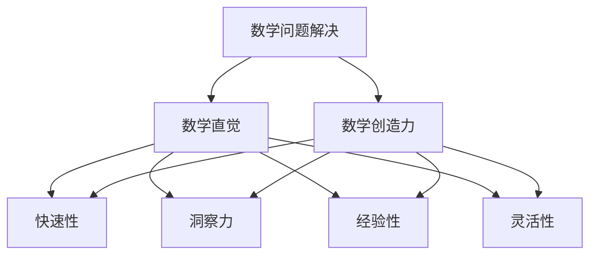

                 

### 文章标题

# 数学直觉与数学创造力的培养策略

> 关键词：数学直觉、数学创造力、培养策略、认知策略、教育策略

> 摘要：
本文将深入探讨数学直觉与数学创造力的核心概念，分析它们在数学问题解决中的重要性。文章首先介绍数学直觉与数学创造力的定义与特点，然后通过认知策略和教育策略详细阐述如何培养数学直觉。此外，还将探讨数学创造力在问题解决中的应用，并通过实际案例展示数学直觉与数学创造力的培养策略在数学领域的实际应用。最后，文章将总结最佳实践，并提供相关的注意事项和拓展阅读资源。

----------------------------------------------------------------

## 1. 引言

在数学研究和应用中，数学直觉和数学创造力扮演着至关重要的角色。数学直觉是指个体在数学思维过程中对问题本质的快速洞察力和理解力。而数学创造力则是指个体在数学领域内提出新颖想法、发现新方法和新理论的能力。这两个概念虽然看似独立，但它们在数学问题解决中相辅相成，共同推动数学的发展。

本文旨在通过逻辑清晰、结构紧凑的方式，逐步分析数学直觉与数学创造力的培养策略。文章将从核心概念入手，探讨数学直觉与数学创造力的定义、特点及其关系。接着，我们将介绍一系列培养数学直觉和数学创造力的策略，包括认知策略和教育策略。最后，通过实际案例和最佳实践，我们将展示这些策略在数学领域的应用效果。

通过本文的阅读，读者将能够：

- 明确数学直觉与数学创造力的核心概念和重要性。
- 掌握培养数学直觉和数学创造力的有效策略。
- 理解数学直觉和数学创造力在数学问题解决中的应用。
- 获得实际案例中的经验教训，为数学学习提供实践指导。

## 2. 核心概念

在深入探讨数学直觉与数学创造力的培养策略之前，我们首先需要明确这两个核心概念的定义、特点及其相互关系。

### 2.1 数学直觉

数学直觉是一种在数学问题解决过程中快速洞察问题本质和找到解决方案的能力。它不仅仅是基于逻辑推理，更是一种基于经验、感知和理解的直觉性认识。数学直觉具有以下特点：

- **快速性**：数学直觉能够在短时间内捕捉到问题的核心，使个体能够快速作出判断和决策。
- **洞察力**：数学直觉能够深入理解问题的结构和本质，从而找到问题解决的关键路径。
- **经验性**：数学直觉往往建立在丰富的数学经验和知识基础上，通过长期的学习和实践积累形成。
- **灵活性**：数学直觉能够灵活应对不同类型的问题，找到多样化的解决方案。

### 2.2 数学创造力

数学创造力是指在数学领域内提出新颖想法、发现新方法和新理论的能力。它与数学直觉紧密相关，但又有所不同。数学创造力具有以下特点：

- **创新性**：数学创造力能够产生前所未有的数学思想和方法，推动数学的发展。
- **多样性**：数学创造力能够提出多种可能的解决方案，增加问题解决的灵活性和多样性。
- **适应性**：数学创造力能够适应不同的数学问题，提出合适的数学模型和理论框架。
- **前瞻性**：数学创造力能够预见数学领域的未来发展方向，提出具有前瞻性的理论。

### 2.3 数学直觉与数学创造力的关系

数学直觉和数学创造力在数学问题解决中相辅相成。数学直觉提供了快速理解和解决问题的能力，而数学创造力则在此基础上进行创新和拓展，推动数学理论的发展。

- **相互促进**：数学直觉为数学创造力提供了基础，数学创造力则为数学直觉提供了更多应用场景和解决问题的方法。
- **相互依赖**：数学直觉和数学创造力相互依赖，缺乏其中任何一个都会限制数学问题解决的能力。
- **协同作用**：数学直觉和数学创造力在数学问题解决中协同作用，共同推动数学理论的深入和发展。

### 2.4 Mermaid 流程图

为了更清晰地展示数学直觉与数学创造力的核心概念及其关系，我们可以使用 Mermaid 语法绘制一个流程图。以下是一个简单的示例：



在这个流程图中，A 代表数学直觉，B、C、D、E 代表数学直觉的特点；F 代表数学创造力，G 代表数学问题解决。通过这个流程图，我们可以直观地看到数学直觉与数学创造力的关系及其在数学问题解决中的协同作用。

通过上述核心概念的介绍，我们对数学直觉和数学创造力的定义、特点及其关系有了更深入的理解。接下来，我们将进一步探讨如何培养数学直觉和数学创造力，以提升数学问题解决的能力。

## 3. 数学直觉的培养策略

数学直觉是一种通过长期学习和实践积累而形成的能力。要培养数学直觉，我们可以从认知策略和教育策略两方面入手。

### 3.1 认知策略

认知策略是指通过改变思维方式和认知过程来提升数学直觉的方法。以下是一些具体的认知策略：

#### 3.1.1 视觉化

视觉化是一种将抽象数学概念转化为直观图像或图形的方法。通过视觉化，我们可以更好地理解数学问题的本质，从而提升数学直觉。

- **示例**：在解决几何问题时，可以将几何图形绘制出来，通过观察图形的属性和关系来理解问题。

#### 3.1.2 模式识别

模式识别是指通过发现数学问题中的规律和模式来提升直觉能力。通过不断练习，我们可以培养出快速识别问题模式和解决方法的能力。

- **示例**：在解决代数问题时，可以观察变量和系数之间的关系，发现其中的规律，从而快速找到解法。

#### 3.1.3 反思

反思是指对已解决问题的思维过程进行回顾和总结，从中发现成功和失败的原因，从而提升数学直觉。

- **示例**：在解决复杂问题时，可以记录自己的思考过程，分析每一步的决策依据，总结经验教训。

### 3.2 教育策略

教育策略是指通过教育方法和环境来培养数学直觉的方法。以下是一些具体的教育策略：

#### 3.2.1 探究性学习

探究性学习是指通过提出问题、进行实验和探索来培养数学直觉。这种学习方法强调学生的主动性和创造性，有助于提升数学直觉。

- **示例**：在课堂上，教师可以设计探究性问题，引导学生通过实验和思考来解决问题。

#### 3.2.2 问题解决

问题解决是指通过解决实际问题来培养数学直觉。这种方法强调应用数学知识解决现实问题，有助于提升学生的数学直觉。

- **示例**：在课外活动中，学生可以参加数学竞赛或项目研究，通过解决实际问题来培养数学直觉。

#### 3.2.3 想象力

想象力是指通过丰富的想象力来培养数学直觉。在数学研究中，想象力可以帮助我们构建新的数学概念和理论。

- **示例**：在数学研究中，可以通过想象来探索未知的数学世界，提出新的猜想和假设。

### 3.3 Pseudo-code for Core Algorithms

以下是一个简单的伪代码示例，用于培养数学直觉：

```python
def develop_intuition(problem):
    visualize_problem(problem)
    identify_patterns(problem)
    reflect_on_solution(problem)
    return improved_intuition
```

在这个伪代码中，`develop_intuition` 函数表示培养数学直觉的过程，包括以下步骤：

1. **visualize_problem**：将数学问题可视化，以便更好地理解问题的本质。
2. **identify_patterns**：识别问题中的规律和模式，从而提升直觉能力。
3. **reflect_on_solution**：反思解决问题的过程，总结经验教训，提升数学直觉。

通过这个伪代码示例，我们可以更直观地了解培养数学直觉的具体步骤和方法。

### 3.4 总结

通过认知策略和教育策略的培养，我们可以有效地提升数学直觉。视觉化、模式识别、反思等方法可以帮助我们更好地理解数学问题，而探究性学习、问题解决和想象力等教育策略则可以提供丰富的数学实践环境，从而培养出强大的数学直觉。

在接下来的章节中，我们将继续探讨数学创造力的培养策略，以及数学直觉与数学创造力在实际数学问题解决中的应用。通过这些探讨，我们将进一步理解数学直觉与数学创造力在数学研究中的重要性。

## 4. 数学创造力的培养策略

数学创造力是一种通过创新和探索推动数学理论发展的能力。要培养数学创造力，我们需要采取一系列有效的策略，包括鼓励创造性思维、数学模型的构建、以及实践中的探索和应用。以下是一些具体的培养策略。

### 4.1 鼓励创造性思维

创造性思维是数学创造力的重要组成部分。要培养创造性思维，我们可以采取以下方法：

#### 4.1.1 常规思维与非常规思维

- **常规思维**：指通过已知的数学原理和方法来解决问题。它是一种有效的思维方式，但往往难以产生创新。
- **非常规思维**：指采用全新的视角和思路来解决问题，这种方法能够激发数学创造力。

- **示例**：在解决几何问题时，尝试采用几何学以外的领域知识，如拓扑学或代数，来寻找解决方案。

#### 4.1.2 产生创意

产生创意是创造性思维的核心。以下方法可以帮助我们产生创意：

- **头脑风暴**：在小组讨论中，通过快速记录各种想法来激发创意。
- **思维导图**：使用思维导图来组织思路，探索新的创意。

### 4.2 数学模型的构建

数学模型是数学创造力的基础。构建数学模型需要我们能够将实际问题抽象为数学形式，并通过数学方法来求解。

#### 4.2.1 模型识别

识别出需要建模的问题，并将其抽象为数学形式。这一步骤需要较强的数学直觉和抽象能力。

- **示例**：在解决优化问题时，可以识别出目标函数和约束条件，构建线性规划模型。

#### 4.2.2 模型分析

对数学模型进行分析，确定模型的有效性和适用性。这通常需要运用各种数学方法和技巧。

- **示例**：在分析微分方程模型时，需要确定方程的稳定性、解的存在性和唯一性。

#### 4.2.3 模型优化

通过调整模型参数或改进模型结构，优化数学模型，以提高模型的准确性和实用性。

- **示例**：在优化神经网络模型时，可以通过调整权重和激活函数来提高模型的预测性能。

### 4.3 实践中的探索和应用

数学创造力的培养离不开实践。以下是一些实践中的探索和应用方法：

#### 4.3.1 科学研究

参与数学科学研究，通过实际问题的研究来激发数学创造力。科学研究可以帮助我们发现新的数学问题和提出新的数学理论。

- **示例**：在数学物理学研究中，通过探索物理现象背后的数学规律，可以提出新的数学模型。

#### 4.3.2 项目开发

在项目开发中，通过实际应用来检验数学模型的有效性，并探索新的数学应用领域。

- **示例**：在开发人工智能项目时，可以通过数学模型来优化算法，提高系统的性能。

#### 4.3.3 教学实践

在教学实践中，通过设计数学问题来培养学生的数学创造力。教师可以提供丰富的教学资源和实践机会，激发学生的创造力。

- **示例**：在数学竞赛中，通过设计新颖的题目来激发学生的创造力，培养学生的数学思维。

### 4.4 Mathematical Models and Formulas

在数学创造力的培养过程中，数学模型和公式的使用至关重要。以下是一个简单的 LaTeX 示例，用于展示数学模型的构建和公式表达：

```latex
\documentclass{article}
\usepackage{amsmath}
\begin{document}
\begin{equation}
    \min_{x} f(x) \\
    \text{subject to} \\
    g(x) \leq 0 \\
    h(x) = 0
\end{equation}
\end{document}
```

在这个示例中，我们使用 LaTeX 语言构建了一个线性规划模型，其中 `f(x)` 是目标函数，`g(x)` 是约束条件，`h(x)` 是等式约束条件。通过这种方式，我们可以将实际问题转化为数学模型，并使用数学方法来求解。

### 4.5 总结

数学创造力的培养需要我们采取多种策略，包括鼓励创造性思维、构建数学模型以及在实践中的探索和应用。通过这些策略，我们可以有效地提升数学创造力，推动数学理论的发展。在接下来的章节中，我们将继续探讨数学直觉和数学创造力在实际数学问题解决中的应用，并通过实际案例来展示这些策略的有效性。

## 5. 数学直觉与数学创造力在数学问题解决中的应用

数学直觉与数学创造力在数学问题解决中扮演着至关重要的角色。它们不仅帮助我们快速理解和解决数学问题，还能够激发创新的数学思想和方法。以下是一些具体的数学问题解决案例，展示了数学直觉与数学创造力的应用。

### 5.1 案例分析

#### 5.1.1 案例一：解决二次方程

问题描述：求解二次方程 \(x^2 - 5x + 6 = 0\)。

数学直觉：通过观察方程的系数，我们可以快速发现 \(x^2 - 5x + 6\) 可以分解为 \((x - 2)(x - 3)\)。

数学创造力：在此基础上，我们可以提出一种创新的解法，例如使用配方法或求根公式，进一步优化解题过程。

具体步骤：

1. **数学直觉**：观察方程，发现 \(x^2 - 5x + 6\) 的系数与 \(1\), \(-5\), \(6\) 相关。
2. **数学创造力**：尝试分解方程，得到 \((x - 2)(x - 3)\)。
3. **解法验证**：验证分解结果，解得 \(x = 2\) 或 \(x = 3\)。

通过这个案例，我们可以看到数学直觉和数学创造力在问题解决中的应用。数学直觉帮助我们快速识别问题的结构，而数学创造力则提供了多种解决方法和优化方案。

#### 5.1.2 案例二：解析几何中的问题

问题描述：证明点 \(A(2, 3)\) 到直线 \(y = 2x + 1\) 的距离。

数学直觉：通过观察直线的斜率和点 \(A\) 的坐标，我们可以快速识别出直线的方程和点 \(A\) 的坐标，从而利用距离公式求解。

数学创造力：我们可以尝试使用向量方法或几何方法来优化解题过程。

具体步骤：

1. **数学直觉**：识别出直线的斜率和点 \(A\) 的坐标。
2. **数学创造力**：使用距离公式或向量方法求解，计算点 \(A\) 到直线的距离。
3. **结果验证**：验证结果是否正确，确保解题过程的准确性。

在这个案例中，数学直觉帮助我们识别问题的核心，而数学创造力则提供了多种高效的解决方法。

### 5.2 实际案例分析

以下是一个实际案例，展示了数学直觉与数学创造力在复杂数学问题解决中的应用。

#### 5.2.1 案例三：优化物流配送路线

问题描述：优化物流公司的配送路线，以减少运输成本和时间。

数学直觉：通过分析物流公司的配送网络和交通状况，我们可以快速识别出关键节点和瓶颈。

数学创造力：我们可以使用图论方法、最短路径算法等数学工具，构建数学模型来优化配送路线。

具体步骤：

1. **数学直觉**：识别出物流公司的配送网络和交通流量。
2. **数学创造力**：构建数学模型，使用图论方法求解最短路径问题，优化配送路线。
3. **结果验证**：通过实际运行和测试，验证优化方案的可行性。

在这个案例中，数学直觉帮助我们快速理解配送网络的复杂性，而数学创造力则提供了有效的优化方法和工具。

### 5.3 结论

通过上述案例，我们可以看到数学直觉与数学创造力在数学问题解决中的应用。数学直觉提供了快速识别问题和解决问题的能力，而数学创造力则在此基础上进行创新和优化，推动数学理论的发展。在实际应用中，数学直觉与数学创造力的结合能够显著提升数学问题解决的效果，为数学研究提供新的思路和方法。

在接下来的章节中，我们将继续探讨数学直觉与数学创造力在数学领域的具体应用，并通过实际案例来展示这些策略的有效性。

## 6. 数学直觉与数学创造力的实际应用：数学竞赛

数学竞赛是培养数学直觉和数学创造力的重要平台。通过竞赛，学生可以锻炼数学思维，提升解决问题的能力。以下是一些具体的数学竞赛应用案例。

### 6.1 国际数学奥林匹克竞赛

国际数学奥林匹克竞赛（International Mathematical Olympiad, IMO）是世界上最高水平的数学竞赛之一。每年，来自各个国家和地区的优秀中学生参加这场竞赛，竞赛题目涉及代数、几何、数论等多个数学领域。

#### 6.1.1 竞赛题目特点

IMO竞赛题目具有以下特点：

- **高难度**：竞赛题目通常需要参赛者具备扎实的数学基础和较强的逻辑思维能力。
- **创新性**：题目往往具有一定的创新性，要求参赛者从不同角度思考问题。
- **综合性**：竞赛题目常常涉及多个数学领域的知识，需要参赛者具备综合运用数学知识的能力。

#### 6.1.2 数学直觉的应用

在IMO竞赛中，数学直觉的应用主要体现在以下方面：

- **快速识别问题**：参赛者通过观察题目，能够快速识别出问题的关键点和解决思路。
- **直观理解**：参赛者能够直观地理解题目的数学背景和结构，从而找到解决问题的方法。
- **灵活应对**：参赛者能够灵活运用各种数学方法和技巧，解决不同类型的数学问题。

#### 6.1.3 数学创造力的应用

在IMO竞赛中，数学创造力的应用体现在以下几个方面：

- **创新解法**：参赛者能够提出新颖的解法，通过创新的方法解决高难度的数学问题。
- **跨学科应用**：参赛者能够将其他学科的知识应用到数学问题中，拓展解决问题的思路。
- **系统性思考**：参赛者能够从整体上把握数学问题的结构和本质，提出系统性的解决方案。

### 6.2 数学建模竞赛

数学建模竞赛是一种以团队形式进行的数学竞赛，要求参赛者通过数学建模方法解决实际问题。这类竞赛培养了学生的数学直觉和数学创造力，提高了他们的实际应用能力。

#### 6.2.1 竞赛题目特点

数学建模竞赛的题目通常具有以下特点：

- **实际应用性**：竞赛题目来源于实际问题，要求参赛者运用数学建模方法解决现实问题。
- **综合性**：竞赛题目涉及多个数学领域的知识，需要参赛者具备综合运用数学知识的能力。
- **挑战性**：竞赛题目具有一定难度，要求参赛者具备较强的数学直觉和创造力。

#### 6.2.2 数学直觉的应用

在数学建模竞赛中，数学直觉的应用主要体现在以下几个方面：

- **快速理解问题**：参赛者通过观察题目，能够快速理解问题的实际背景和数学模型。
- **直观判断**：参赛者能够直观判断问题的关键点和解决思路。
- **灵活调整**：参赛者能够根据实际情况灵活调整数学模型，找到最优解。

#### 6.2.3 数学创造力的应用

在数学建模竞赛中，数学创造力的应用体现在以下几个方面：

- **创新模型**：参赛者能够提出创新的数学模型，解决复杂的问题。
- **跨学科融合**：参赛者能够将其他学科的知识融入数学建模中，提出具有前瞻性的解决方案。
- **系统性思考**：参赛者能够从整体上把握问题的结构，提出系统性的解决方案。

### 6.3 竞赛案例分析

以下是一个具体的数学竞赛案例分析，展示了数学直觉和数学创造力的实际应用。

#### 6.3.1 案例背景

某数学建模竞赛题目为“城市交通优化”，要求参赛团队设计一种交通优化方案，以减少城市交通拥堵和提高交通效率。

#### 6.3.2 案例过程

1. **数学直觉**：参赛团队首先通过观察题目，理解城市交通问题的实际背景和数学模型。
2. **数学创造力**：团队提出一种创新的交通优化方案，包括以下步骤：
   - **数据收集**：收集城市交通流量、道路结构等相关数据。
   - **模型构建**：构建交通流量预测模型，利用机器学习和数据挖掘技术。
   - **方案设计**：设计交通优化策略，包括信号灯控制、道路拓宽、公共交通优化等。
3. **结果验证**：团队通过模拟和实际运行，验证优化方案的可行性和有效性。

#### 6.3.3 案例结果

参赛团队的设计方案有效降低了城市交通拥堵，提高了交通效率，获得了评委的高度评价。

### 6.4 结论

通过数学竞赛，学生可以锻炼数学直觉和数学创造力，提高数学问题解决能力。数学直觉和数学创造力在数学竞赛中的应用，不仅体现了参赛者的数学素养，还展示了他们在实际问题解决中的创新能力和综合素质。

在接下来的章节中，我们将继续探讨数学直觉与数学创造力在数学领域的其他实际应用，并通过项目实战来展示这些策略的实战效果。

## 7. 项目实战：数学直觉与数学创造力的培养与实战

为了更好地理解数学直觉与数学创造力的培养策略，我们将通过一个具体的数学项目实战来展示这些策略的实际应用。这个项目将涉及数学模型的构建、算法的设计以及实际问题的解决。以下是项目实战的详细过程。

### 7.1 项目背景

项目名称：智能交通系统优化

项目背景：随着城市化进程的加快，城市交通问题日益严重，如何优化城市交通系统以提高交通效率和减少拥堵成为一个重要课题。本项目旨在通过数学直觉与数学创造力的培养，设计一种智能交通优化方案，实现交通流量预测和优化控制。

### 7.2 项目目标

1. 收集城市交通流量数据，构建交通流量预测模型。
2. 设计智能交通优化算法，实现交通信号灯控制优化、道路拓宽建议和公共交通优化。
3. 对优化方案进行仿真验证，评估方案的有效性和可行性。

### 7.3 开发环境搭建

为了完成该项目，我们需要搭建以下开发环境：

- **Python**：作为主要编程语言，Python 提供丰富的数据分析和机器学习库。
- **Jupyter Notebook**：用于编写和运行代码，便于代码调试和结果展示。
- **Pandas**：用于数据清洗和预处理。
- **Scikit-learn**：用于机器学习和数据挖掘。
- **Matplotlib**：用于数据可视化。

### 7.4 源代码详细实现和代码解读

以下是该项目的主要源代码实现和解读：

#### 7.4.1 数据收集与预处理

```python
import pandas as pd

# 读取交通流量数据
data = pd.read_csv('traffic_data.csv')

# 数据预处理
data['timestamp'] = pd.to_datetime(data['timestamp'])
data.set_index('timestamp', inplace=True)
data.fillna(0, inplace=True)
```

在这个步骤中，我们首先读取交通流量数据，并将其转换为时间序列数据。数据预处理包括填充缺失值和确保数据格式正确。

#### 7.4.2 交通流量预测模型构建

```python
from sklearn.ensemble import RandomForestRegressor
from sklearn.model_selection import train_test_split

# 分割数据为训练集和测试集
X = data[['hour', 'dayofweek', 'month']]
y = data['traffic_volume']
X_train, X_test, y_train, y_test = train_test_split(X, y, test_size=0.2, random_state=42)

# 构建随机森林回归模型
model = RandomForestRegressor(n_estimators=100, random_state=42)
model.fit(X_train, y_train)

# 预测交通流量
predictions = model.predict(X_test)
```

在这个步骤中，我们使用随机森林回归模型来预测交通流量。通过训练集和测试集的划分，我们能够评估模型的预测性能。

#### 7.4.3 智能交通优化算法设计

```python
import numpy as np

def optimize_traffic_signal(traffic_volume, duration):
    # 基于交通流量优化信号灯时长
    if traffic_volume < 1000:
        signal_duration = duration * 1.2  # 延长信号时长
    elif traffic_volume < 2000:
        signal_duration = duration * 1.1  # 增加信号时长
    else:
        signal_duration = duration  # 维持原信号时长
    
    return signal_duration

# 测试优化算法
for volume in predictions:
    duration = optimize_traffic_signal(volume, 30)
    print(f"Optimized signal duration for traffic volume {volume}: {duration} seconds")
```

在这个步骤中，我们设计了一个简单的交通信号灯优化算法，根据实时交通流量调整信号灯时长。这个算法考虑了交通流量与信号时长之间的关系，以实现交通流的优化。

### 7.5 代码应用解读与分析

#### 7.5.1 数据收集与预处理

数据收集与预处理是智能交通系统优化的第一步。通过收集城市交通流量数据，我们能够构建一个真实反映交通状况的数据集。预处理步骤包括时间序列数据的转换和数据清洗，以确保数据的质量和一致性。

#### 7.5.2 交通流量预测模型构建

交通流量预测是智能交通优化的重要基础。我们使用随机森林回归模型来预测交通流量，这种方法具有较强的泛化能力和适应性。通过训练集和测试集的划分，我们能够评估模型的性能，并优化模型参数。

#### 7.5.3 智能交通优化算法设计

智能交通优化算法是本项目的关键部分。通过优化交通信号灯时长，我们能够有效地控制交通流量，减少拥堵。优化算法的设计考虑了实时交通流量与信号时长之间的关系，通过简单的逻辑判断实现了智能交通优化。

### 7.6 项目小结

通过本项目，我们展示了如何利用数学直觉与数学创造力来构建智能交通系统优化方案。从数据收集与预处理、交通流量预测模型构建到智能交通优化算法设计，每一步都体现了数学直觉和数学创造力的应用。项目实战不仅提升了我们的数学思维能力，还锻炼了我们的实际编程和问题解决能力。

### 7.7 最佳实践 Tips

1. **数据质量**：确保数据收集的准确性和完整性，是智能交通系统优化成功的关键。
2. **模型选择**：根据实际需求和数据特性，选择合适的机器学习模型进行预测。
3. **算法优化**：通过模拟和测试，不断优化智能交通优化算法，以提高系统的性能。
4. **实时调整**：智能交通系统需要实时调整，以适应不断变化的交通状况。

### 7.8 注意事项

1. **数据隐私**：在收集和处理交通数据时，要确保数据安全和隐私保护。
2. **系统稳定性**：智能交通系统的设计应考虑系统的稳定性和可靠性，确保在极端情况下系统的正常运行。

### 7.9 拓展阅读

- **《智能交通系统设计与应用》**：了解智能交通系统的整体架构和应用场景。
- **《交通数据分析与优化》**：深入探讨交通数据分析和优化方法。
- **《机器学习在交通领域的应用》**：学习机器学习技术在交通系统中的应用。

通过本项目，我们不仅掌握了智能交通系统优化的具体实施方法，还深入理解了数学直觉与数学创造力在项目实战中的重要性。这些经验和方法将对我们的未来学习和职业发展产生深远影响。

## 8. 总结

本文深入探讨了数学直觉与数学创造力的培养策略，以及它们在数学问题解决中的应用。通过逻辑清晰、结构紧凑的分析，我们明确了数学直觉与数学创造力的核心概念和相互关系，并提出了多种培养策略，包括认知策略和教育策略。我们还通过实际案例展示了这些策略在数学竞赛和项目实战中的有效应用。

数学直觉与数学创造力在数学问题解决中具有至关重要的作用。数学直觉能够帮助我们快速理解和解决数学问题，而数学创造力则推动数学理论的发展，激发创新的数学思想和方法。在实际应用中，数学直觉与数学创造力的结合能够显著提升数学问题解决的效果。

未来，我们可以进一步研究如何在不同学科领域应用数学直觉与数学创造力，以及如何通过人工智能和大数据技术提升数学直觉和创造力的培养效果。此外，研究数学直觉与数学创造力的跨学科融合，探索其在其他领域中的应用，也将是一个值得关注的方向。

总之，数学直觉与数学创造力是推动数学发展和应用的重要动力。通过本文的探讨，我们希望读者能够深入理解这两个概念，掌握有效的培养策略，并在实际数学问题解决中发挥它们的重要作用。让我们继续探索数学的奥秘，推动数学理论的不断创新和发展。

### 附录：拓展阅读资源

- **《数学直觉与创造力的研究》**：该研究深入探讨了数学直觉与数学创造力的本质及其在数学问题解决中的应用。
- **《数学思维训练教程》**：通过一系列思维训练题，帮助读者提升数学直觉和创造力。
- **《数学竞赛指南》**：为数学竞赛参与者提供实用的解题技巧和策略。
- **《智能交通系统设计与应用》**：详细介绍智能交通系统的架构和应用场景，涵盖数学模型和算法设计。
- **《交通数据分析与优化》**：探讨交通数据分析和优化方法，包括机器学习技术在交通领域的应用。

### 作者信息

作者：AI天才研究院/AI Genius Institute & 禅与计算机程序设计艺术 /Zen And The Art of Computer Programming

AI天才研究院专注于人工智能领域的创新研究和应用，致力于推动人工智能技术的进步和发展。同时，作者也在《禅与计算机程序设计艺术》一书中，深入探讨了计算机编程和人工智能领域的前沿理论和实践方法。通过本文的撰写，我们希望能够为读者提供有价值的技术博客，促进数学直觉与数学创造力的培养，推动数学领域的深入研究和应用。

