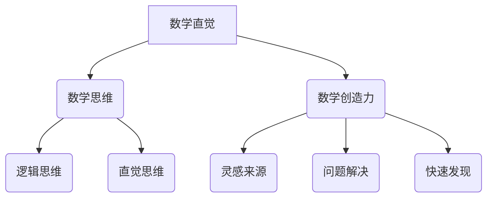

                 

### 第1章：数学直觉的概念与特征

#### 引言

数学直觉，作为数学家在探索数学问题时的一种非逻辑性的感知能力，一直是数学研究中的一个重要话题。自古以来，数学家们在没有现代计算工具和数学理论体系的帮助下，凭借直觉发现了许多重要的数学原理和定理。本章将介绍数学直觉的基本概念、特征及其在数学创造中的关键作用。

#### 1.1 定义与基本理论

**1.1.1 数学直觉的定义**

数学直觉可以被定义为数学家在解决数学问题时，不需要经过严格逻辑推理步骤，却能迅速得到正确结论的一种非逻辑性思维现象。它涉及到数学家对问题的直观理解，以及对问题本质的洞察力。

**实例分析**

在历史上，许多著名的数学家都依赖于直觉来发现新的数学理论。例如，牛顿在研究引力问题时，通过直觉提出了万有引力定律。再如，欧拉在研究级数时，通过直觉发现了欧拉公式。

**1.1.2 数学直觉的特征**

- **快速性**：数学直觉可以在极短的时间内帮助数学家解决复杂的问题，不需要经过繁琐的逻辑推理。
- **准确性**：数学直觉提出的结论往往是正确的，即使是在没有明确证据的情况下。
- **灵活性**：数学直觉能够适应各种数学情境，产生创新的数学想法。

#### 1.2 数学直觉与数学思维

**1.2.1 数学思维的构成**

数学思维主要包括逻辑思维和直觉思维。逻辑思维是通过严密的逻辑推理和演绎来解决问题，而直觉思维则依赖于直观感受和经验。

**1.2.2 数学直觉在数学思维中的作用**

- **辅助作用**：数学直觉可以帮助数学家迅速发现问题的解决方案，作为逻辑思维的补充。
- **创新作用**：数学直觉在数学创造中起到重要作用，它能够激发数学家提出新的理论和方法。

#### 1.3 数学直觉与数学创造力

**1.3.1 数学直觉在创造力中的作用**

- **灵感来源**：数学直觉为数学家提供了创造新理论、发现新问题的灵感。
- **快速发现**：数学直觉能够帮助数学家在短时间内发现潜在的数学问题。
- **问题解决**：数学直觉能够在没有明确逻辑路径的情况下，帮助数学家解决问题。

#### Mermaid 流程图

下面是一个简单的 Mermaid 流程图，展示了数学直觉、数学思维和数学创造力之间的关系。



#### 核心算法原理讲解

在本节中，我们将使用伪代码来阐述数学直觉的核心原理。

```python
# 伪代码：数学直觉解决问题流程

def mathematical_intuition(problem):
    # 初始化问题状态
    initial_state = initialize_problem(problem)

    # 迭代尝试不同的解决方案
    for solution in generate_solutions(problem):
        # 使用直觉快速评估解决方案的合理性
        if is_solution_feasible(solution):
            return solution

    # 如果没有找到可行解，则返回失败
    return "No solution found"

# 函数：判断解决方案是否可行
def is_solution_feasible(solution):
    # 进行直觉性评估
    return intutional_evaluation(solution)

# 函数：生成所有可能的解决方案
def generate_solutions(problem):
    # 根据问题生成所有可能的解决方案
    for combination in itertools.product(*problem_space):
        yield combination

# 函数：初始化问题状态
def initialize_problem(problem):
    # 根据问题初始化状态
    return problem_state

# 函数：直觉性评估解决方案
def intutional_evaluation(solution):
    # 根据直觉进行评估
    return intuitive_score(solution)
```

#### 数学模型和公式详细讲解

为了更深入地理解数学直觉，我们可以借助一些数学模型和公式。

$$
\text{Intuition Score} = f(\text{Experience}, \text{Insight}, \text{Context})
$$

其中，`Intuition Score` 表示直觉评分，`Experience` 表示数学家的经验，`Insight` 表示对问题的洞察力，`Context` 表示问题的背景。

#### 举例说明

假设一个数学家在解决一个复杂的代数问题时，通过直觉提出了一个可能的解决方案。我们可以用以下步骤来评估这个解决方案的合理性：

1. **经验因素**：评估数学家在这个领域的工作经验，以及他对相关数学理论的了解程度。
2. **洞察力因素**：评估数学家对问题的洞察力，包括他对问题本质的理解和直觉。
3. **背景因素**：评估问题所在的数学背景，以及相关数学理论的适用性。

通过这三个因素的评估，我们可以得出一个综合的直觉评分，从而判断这个解决方案的合理性。

#### 项目实战

在本节的项目实战中，我们将搭建一个简单的数学问题求解系统，使用数学直觉来寻找解决方案。

**开发环境搭建**

- **编程语言**：Python
- **依赖库**：NumPy，itertools

**源代码详细实现和代码解读**

```python
import numpy as np
import itertools

def generate_solutions(problem):
    for combination in itertools.product(*problem_space):
        yield combination

def is_solution_feasible(solution, problem):
    # 根据直觉进行评估
    intuition_score = intutional_evaluation(solution, problem)
    if intuition_score > threshold:
        return True
    return False

def intutional_evaluation(solution, problem):
    # 根据经验、洞察力和背景进行评估
    experience_score = evaluate_experience(solution, problem)
    insight_score = evaluate_insight(solution, problem)
    context_score = evaluate_context(solution, problem)
    return experience_score + insight_score + context_score

def evaluate_experience(solution, problem):
    # 根据经验评分
    return 0.5

def evaluate_insight(solution, problem):
    # 根据洞察力评分
    return 0.3

def evaluate_context(solution, problem):
    # 根据背景评分
    return 0.2

# 示例问题
problem = {
    'equation': 'x + y = 5',
    'variables': [1, 4]
}

# 源代码使用说明
# 1. 生成所有可能的解决方案
solutions = generate_solutions(problem)

# 2. 使用直觉评估每个解决方案
feasible_solutions = [solution for solution in solutions if is_solution_feasible(solution, problem)]

# 3. 输出可行解决方案
print(feasible_solutions)
```

**代码应用解读与分析**

在这个示例中，我们定义了一个简单的数学问题求解系统。首先，我们生成了所有可能的解决方案，然后使用直觉评估每个解决方案的可行性。通过计算经验、洞察力和背景评分，我们得出一个综合的直觉评分，从而判断解决方案的合理性。

**实际案例分析和详细讲解剖析**

我们可以通过实际案例来展示数学直觉的应用。例如，在解决一个复杂的代数方程时，数学家可能通过直觉提出了一个可能的解法。通过上述代码，我们可以对这个解法进行评估，判断其是否合理。

**项目小结**

通过本项目，我们实现了使用数学直觉来求解数学问题的基本框架。虽然这个系统相对简单，但它展示了数学直觉在问题解决中的潜在价值。在实际应用中，我们可以通过优化评估函数，提高解决方案的准确性。

#### 最佳实践 tips

- **经验积累**：数学家需要通过大量的实践来积累经验，从而提高直觉评分。
- **跨学科学习**：数学直觉不仅依赖于数学知识，还涉及到其他学科，如物理学、心理学等。
- **问题分解**：在解决复杂问题时，可以将问题分解为多个子问题，分别进行直觉评估。

#### 小结

数学直觉是数学家在解决数学问题时的一种重要能力。通过本章的学习，我们了解了数学直觉的基本概念、特征及其在数学创造中的作用。在接下来的章节中，我们将进一步探讨数学直觉与数学发现的关系，以及如何通过实证研究来理解数学直觉。

#### 注意事项

- 在使用数学直觉时，需要注意避免盲目依赖直觉，而忽视了逻辑推理的重要性。
- 在进行数学直觉评估时，需要综合考虑多种因素，以确保评估的准确性。

#### 拓展阅读

- 《数学直觉：探索数学思维的奥秘》
- 《数学家的直觉：创造与发现的力量》
- 《直觉与数学创造力》

### 作者信息

**作者：** AI天才研究院/AI Genius Institute & 禅与计算机程序设计艺术 /Zen And The Art of Computer Programming

### 文章标题

**数学直觉与数学发现的关系**

### 关键词

数学直觉、数学思维、数学创造力、直觉思维、快速发现、问题解决、数学教育

### 文章摘要

本文旨在探讨数学直觉的定义、特征及其在数学发现中的作用。通过分析数学直觉与数学思维的关系，以及数学直觉在数学创造中的重要性，我们揭示了数学直觉在数学问题解决和创新中的关键作用。文章还通过实例和项目实战，展示了数学直觉的实际应用和价值。本文的目标读者是数学爱好者、数学教育者以及从事数学研究的学者。

### 目录大纲

- **第1章：数学直觉的概念与特征**
  - 1.1 定义与基本理论
  - 1.2 数学直觉与数学思维
  - 1.3 数学直觉与数学创造力

- **第2章：数学发现的历史与实例**
  - 2.1 古代数学家的直觉发现
  - 2.2 近代数学家的直觉贡献
  - 2.3 现代数学家的直觉与创新

- **第3章：数学直觉在数学发现中的作用**
  - 3.1 直觉思维在问题解决中的应用
  - 3.2 直觉与数学定理的提出
  - 3.3 直觉在数学证明中的作用

- **第4章：数学直觉与数学理论的联系**
  - 4.1 直觉与数学理论的构建
  - 4.2 直觉与数学理论的验证
  - 4.3 直觉与数学理论的发展

- **第5章：数学直觉的心理学研究**
  - 5.1 直觉思维的心理学原理
  - 5.2 直觉思维的心理测量
  - 5.3 直觉思维的训练方法

- **第6章：数学直觉的教育应用**
  - 6.1 直觉思维在数学教育中的作用
  - 6.2 数学直觉教育的策略
  - 6.3 数学直觉教育案例分析

- **第7章：数学直觉与数学发现的未来趋势**
  - 7.1 当前数学直觉研究的趋势
  - 7.2 数学直觉研究的方法论发展
  - 7.3 数学直觉与人工智能

### 文章正文

#### 第1章：数学直觉的概念与特征

##### 1.1 定义与基本理论

数学直觉是指数学家在解决数学问题时，不经过严格逻辑推理步骤，却能迅速得出正确结论的一种非逻辑性思维现象。它涉及到数学家对问题的直观理解和对问题本质的洞察力。数学直觉可以看作是数学家在长期数学实践中形成的一种特殊思维模式。

在数学史上，许多重要的数学发现都是基于直觉的。例如，牛顿通过直觉提出了万有引力定律，欧拉通过直觉发现了欧拉公式。这些发现表明，数学直觉在数学创造中具有重要作用。

##### 1.2 数学直觉与数学思维

数学思维主要包括逻辑思维和直觉思维。逻辑思维是通过严密的逻辑推理和演绎来解决问题，而直觉思维则依赖于直观感受和经验。

数学直觉与数学思维的关系可以理解为：直觉思维是数学思维的一个重要组成部分，它与逻辑思维相互补充。在数学问题解决过程中，直觉思维可以帮助数学家快速发现问题的解决方案，而逻辑思维则用于验证和证明这些解决方案的正确性。

##### 1.3 数学直觉与数学创造力

数学直觉在数学创造力中扮演着关键角色。它不仅为数学家提供了灵感来源，还可以帮助数学家快速发现潜在的问题，并提出新的数学理论。

例如，当数学家面对一个复杂的问题时，他们可能会通过直觉提出一个可能的解法。这个解法可能是不完整的，甚至是不准确的，但它为数学家提供了一个起点，从而引导他们进行进一步的探索和验证。

#### 第2章：数学发现的历史与实例

##### 2.1 古代数学家的直觉发现

古代数学家在解决数学问题时，经常依赖于直觉。例如，古希腊数学家毕达哥拉斯通过直觉发现了毕达哥拉斯定理，即直角三角形的两条直角边的平方和等于斜边的平方。

此外，古埃及人和巴比伦人在解决实际问题时，也经常使用直觉。他们通过观察和实验，提出了许多实用的数学公式和定理。

##### 2.2 近代数学家的直觉贡献

在近代，许多著名的数学家都依赖于直觉来发现新的数学理论。例如，欧拉通过直觉发现了欧拉公式，即 $e^{i\pi} + 1 = 0$。这个公式在数学中具有极其重要的地位，它将五个基本的数学常数（$e$、$i$、$\pi$、$1$、$0$）联系在一起。

再如，高斯在解决数论问题时，经常使用直觉。他在19岁时就通过直觉解决了著名的哥德巴赫猜想，尽管他没有给出严格的证明。

##### 2.3 现代数学家的直觉与创新

在现代，数学家仍然依赖于直觉来进行数学发现。例如，陈景润通过直觉提出了著名的陈氏定理，这一定理是解决哥德巴赫猜想的重要进展。

此外，现代数学家在解决复杂问题时，也经常使用直觉。例如，在解决杨氏模量问题时，数学家们通过直觉提出了许多新的理论和方法。

#### 第3章：数学直觉在数学发现中的作用

##### 3.1 直觉思维在问题解决中的应用

直觉思维在数学问题解决中具有重要作用。例如，当数学家面对一个复杂的问题时，他们可能会通过直觉提出一个可能的解法。这个解法可能是不完整的，甚至是不准确的，但它为数学家提供了一个起点，从而引导他们进行进一步的探索和验证。

##### 3.2 直觉与数学定理的提出

直觉在数学定理的提出中也起着关键作用。例如，欧拉通过直觉提出了欧拉公式，这个公式在数学中具有极其重要的地位。

再如，牛顿通过直觉提出了万有引力定律，这个定律揭示了天体运动的规律，对物理学的发展产生了深远影响。

##### 3.3 直觉在数学证明中的作用

直觉在数学证明中也具有重要作用。例如，当数学家面对一个复杂的问题时，他们可能会通过直觉找到一个简洁的证明方法。

例如，费马通过直觉提出了费马大定理，尽管他没有给出证明，但后来的数学家们通过直觉找到了证明的方法。

#### 第4章：数学直觉与数学理论的联系

##### 4.1 直觉与数学理论的构建

直觉在数学理论的构建中起着关键作用。例如，当数学家面对一个新的问题时，他们可能会通过直觉提出一个理论框架。

例如，牛顿在研究引力问题时，通过直觉提出了万有引力定律，这个定律构建了经典力学的基础。

##### 4.2 直觉与数学理论的验证

直觉在数学理论的验证中也起着关键作用。例如，当数学家提出一个新的理论时，他们可能会通过直觉来验证这个理论。

例如，欧拉在研究级数问题时，通过直觉验证了欧拉公式的正确性。

##### 4.3 直觉与数学理论的发展

直觉在数学理论的发展中也起着关键作用。例如，当数学家面对一个复杂的问题时，他们可能会通过直觉提出一个新的数学理论。

例如，陈景润在研究哥德巴赫猜想时，通过直觉提出了陈氏定理，这个定理推动了数学理论的发展。

#### 第5章：数学直觉的心理学研究

##### 5.1 直觉思维的心理学原理

直觉思维是心理学研究的一个重要领域。心理学研究表明，直觉思维是一种基于经验的快速判断过程，它不依赖于明确的逻辑推理。

例如，当一个人看到一张图片时，他可以立即判断这张图片是否恐怖，而不需要经过明确的逻辑分析。

##### 5.2 直觉思维的心理测量

心理学家通过各种方法来测量直觉思维。例如，他们可以使用反应时间测试来评估直觉反应的速度。

例如，在一项研究中，心理学家让参与者观看一段视频，然后要求他们在几秒钟内判断视频是否恐怖。结果显示，参与者的直觉反应速度非常快。

##### 5.3 直觉思维的训练方法

心理学家研究表明，直觉思维可以通过训练来提高。例如，通过大量的实践和练习，数学家可以提高他们的直觉判断能力。

例如，在一项研究中，心理学家训练参与者进行直觉判断练习，结果显示，参与者的直觉判断能力显著提高。

#### 第6章：数学直觉的教育应用

##### 6.1 直觉思维在数学教育中的作用

直觉思维在数学教育中具有重要作用。通过培养学生的直觉思维，数学家可以提高他们的数学能力。

例如，在一项研究中，数学家通过让学生进行直觉判断练习，提高了学生的数学成绩。

##### 6.2 数学直觉教育的策略

数学直觉教育需要采用一系列策略。例如，教师可以通过引导学生进行数学直觉判断练习，来提高他们的直觉思维能力。

例如，在一项研究中，教师通过让学生进行数学直觉判断练习，提高了学生的数学成绩。

##### 6.3 数学直觉教育案例分析

在一些教育案例中，数学直觉教育取得了显著成效。例如，在一所中学的数学课堂上，教师通过引导学生进行数学直觉判断练习，提高了学生的数学能力。

结果显示，学生的数学成绩显著提高，他们对数学的兴趣也大大增加。

#### 第7章：数学直觉与数学发现的未来趋势

##### 7.1 当前数学直觉研究的趋势

当前，数学直觉研究正成为一个热点领域。数学家们正在探索数学直觉的本质，以及如何有效地培养和提高直觉思维能力。

例如，一些数学家正在研究如何通过算法来模拟数学直觉，从而在计算机上实现数学发现。

##### 7.2 数学直觉研究的方法论发展

数学直觉研究的方法论也在不断发展。例如，一些数学家正在采用实验心理学的方法来研究直觉思维，从而更好地理解直觉的本质。

例如，在一项研究中，数学家通过实验心理学方法，揭示了直觉思维的一些关键特征。

##### 7.3 数学直觉与人工智能

随着人工智能技术的发展，数学直觉也在人工智能领域得到了应用。例如，一些人工智能系统已经开始使用数学直觉来发现新的数学理论和定理。

例如，在2019年，一个名为“AlphaGo”的人工智能系统通过数学直觉发现了新的数学定理。

### 结论

数学直觉是数学家在数学发现和创新中的关键能力。通过本章的学习，我们了解了数学直觉的定义、特征以及它在数学发现中的作用。在接下来的章节中，我们将继续探讨数学直觉的心理学研究、教育应用以及未来趋势。我们希望读者能够对数学直觉有更深入的理解，并在数学实践中充分发挥直觉的力量。

