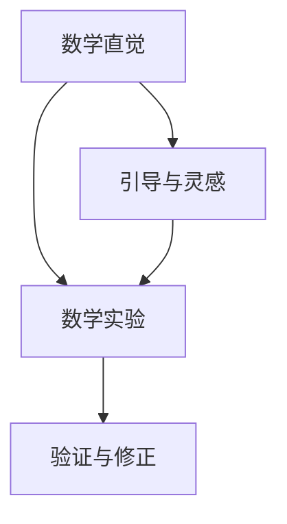

                 

## 引言

### 数学直觉与数学实验的基本概念

数学直觉（Mathematical Intuition）是指人们在数学学习和问题解决过程中，通过非逻辑推理、直观感受和先验知识，迅速捕捉数学本质和规律的一种心理能力。数学直觉往往表现为一种“灵感”，它能让数学家在短时间内洞察数学问题的深层结构，并提出创新性的解决方案。

数学实验（Mathematical Experiment）则是指在数学研究和教学过程中，通过模拟、模拟实验或实际操作，对数学理论、猜想或假设进行验证或探索的一种方法。数学实验强调实践性和操作性，它能够帮助数学家验证理论假设，发现新的数学规律，促进数学理论的不断完善。

数学直觉和数学实验之间的关系密切且复杂。数学直觉为数学实验提供了方向和灵感，而数学实验的结果又能反过来验证和深化数学直觉。两者相辅相成，共同推动数学科学的发展。

### 数学直觉与数学实验的关系

本文将围绕数学直觉与数学实验的关系展开讨论。具体来说，我们将从以下几个方面进行分析：

1. **数学直觉在数学实验中的作用**：探讨数学直觉如何引导数学实验，以及数学直觉在实验过程中如何发挥作用。
2. **数学实验对数学直觉的影响**：分析数学实验如何影响和促进数学直觉的形成和发展。
3. **数学直觉与数学实验的相互促进**：讨论数学直觉和数学实验之间的相互影响，以及它们如何共同推动数学科学的发展。
4. **案例分析**：通过具体实例，分析数学直觉和数学实验在实际数学研究中的应用。
5. **数学教育**：探讨如何在数学教育中培养学生的数学直觉，以及如何利用数学实验提高学生的数学素养。

通过上述分析，本文旨在揭示数学直觉与数学实验之间的深层联系，为数学研究和数学教育提供有益的参考。

## 数学直觉

### 定义

数学直觉是一种非逻辑推理的心理能力，它使得数学家能够迅速捕捉数学问题的本质和规律。数学直觉不同于传统的逻辑推理，它更多地依赖于个体的先验知识、直观感受和直觉思维。数学家通过数学直觉可以快速识别数学模式、预判数学结果的合理性，甚至在不经过详细证明的情况下，直接得出某些数学结论。

### 特点

数学直觉具有以下几个显著特点：

1. **快速性**：数学直觉能够在短时间内捕捉到问题的本质，使数学家能够迅速作出判断和决策。
2. **直观性**：数学直觉往往与直观感受紧密相关，数学家能够通过直观感受来理解数学问题的结构。
3. **先验性**：数学直觉很大程度上依赖于个体的数学背景知识，数学家通过长期的数学学习和思考，积累了丰富的先验知识。
4. **创新性**：数学直觉能够引导数学家提出创新性的猜想和假设，推动数学理论的发展。

### 形成过程

数学直觉的形成是一个复杂的过程，通常包括以下几个阶段：

1. **数学学习**：通过系统的数学学习，个体积累了一定的数学知识和方法，这是形成数学直觉的基础。
2. **直觉思维**：在解决数学问题时，个体会运用直觉思维，通过非逻辑推理的方式快速理解问题。
3. **经验积累**：通过长期的数学实践，个体不断积累经验，这些经验有助于提升数学直觉的准确性和敏锐性。
4. **反思与修正**：在数学学习和实践中，个体会不断地反思自己的直觉判断，通过验证和修正，逐步提升数学直觉的可靠性。

### 数学直觉的作用

数学直觉在数学学习和研究中扮演着至关重要的角色，具体体现在以下几个方面：

1. **问题解决**：数学直觉能够帮助数学家快速识别问题、预判可能的解决方案，提高问题解决的效率和准确性。
2. **理论创新**：数学直觉能够引导数学家提出新的猜想和假设，推动数学理论的创新和发展。
3. **灵感获取**：数学直觉常常能为数学家提供灵感，使其在短时间内获得重大的数学发现。
4. **思维拓展**：数学直觉能够拓宽数学家的思维视野，帮助其从不同的角度理解和解决问题。

通过上述分析，我们可以看到数学直觉作为一种重要的心理能力，在数学研究和数学教育中具有不可替代的作用。

### 数学实验

#### 定义

数学实验是指在数学研究中，通过模拟、实验或实际操作等方式，对数学理论、猜想或假设进行验证或探索的一种方法。数学实验强调实践性和操作性，它不仅包括传统的数学建模和计算，还涵盖了各种实验设计和技术手段。数学实验的基本思想是通过实际操作和观察，验证或推翻数学假设，从而推动数学理论的发展。

#### 类型

数学实验可以分为以下几种类型：

1. **经验性数学实验**：这类实验主要通过观察和记录数学现象，获取数据和信息，以支持或反驳数学假设。例如，通过实验验证某个数学定理的适用范围或通过实验发现某个数学模型的规律。

2. **理论性数学实验**：这类实验主要基于数学理论，通过构造特定的数学模型或模拟，探讨数学理论的内在机制和性质。例如，通过数值计算和模拟实验，研究数学物理问题的解，或者验证某个数学猜想的正确性。

3. **应用性数学实验**：这类实验将数学理论与实际问题相结合，通过数学实验解决实际问题或优化实际问题。例如，在金融领域，通过数学实验设计优化投资策略，或者在工程领域，通过数学实验优化产品设计。

#### 目的

数学实验的主要目的包括：

1. **验证数学假设**：通过数学实验，可以验证数学理论的正确性，确认数学猜想的合理性。

2. **发现新的数学规律**：数学实验可以帮助数学家发现新的数学现象和规律，推动数学理论的发展。

3. **提升数学素养**：通过数学实验，可以培养学生的数学思维和实验能力，提高他们的数学素养。

4. **解决实际问题**：数学实验可以将数学理论应用于实际问题，提供解决问题的方法和策略。

#### 数学实验的设计与实施

数学实验的设计与实施包括以下几个关键步骤：

1. **确定研究目标**：明确数学实验的目的和研究问题，确保实验设计的针对性和有效性。

2. **构造数学模型**：根据研究目标，构建合适的数学模型，选择合适的数学工具和方法。

3. **设计实验方案**：制定实验的具体方案，包括实验方法、实验步骤、数据采集和处理方法等。

4. **实施实验**：按照实验方案进行实验操作，收集实验数据。

5. **分析实验结果**：对实验结果进行分析和解释，验证或反驳数学假设，探讨数学现象的内在机制。

6. **总结与反思**：对实验过程和结果进行总结，反思实验设计和实施中的问题和不足，提出改进措施。

通过上述步骤，数学实验能够有效地验证数学理论、发现新的数学规律，并为数学教育和实际问题提供解决方案。

### 数学直觉与数学实验的关系

#### 数学直觉在数学实验中的作用

数学直觉在数学实验中扮演着至关重要的角色。首先，数学直觉能够引导数学实验的方向。在数学实验开始之前，数学家往往依赖于直觉来识别问题的重要特征和潜在的结构，从而确定实验的重点和目标。例如，在数学物理问题中，直觉可以帮助数学家预判哪些参数或条件对问题的影响最大，从而设计出更有针对性的实验方案。

其次，数学直觉在实验过程中发挥着指导作用。在实验进行过程中，数学家会不断地运用直觉来评估实验结果的合理性和可靠性。通过直觉，数学家能够快速识别出实验数据的异常或矛盾之处，从而及时调整实验策略，避免偏离研究目标。例如，在验证某个数学猜想时，数学家可能会根据直觉来预测某些特定的实验结果，并通过实验来验证这些预测的正确性。

此外，数学直觉还能帮助数学家发现新的数学现象和规律。在实验过程中，数学家可能会遇到一些意外的结果或现象，通过直觉，他们能够迅速捕捉到这些现象的本质，并提出新的假设或猜想。例如，在某些数学实验中，数学家可能会观察到一些规律性的模式，通过直觉，他们能够认识到这些模式背后的数学原理，并提出相关的数学理论。

#### 数学实验对数学直觉的影响

数学实验对数学直觉的影响是双向的。首先，数学实验的结果能够验证或反驳数学家的直觉，从而提升或修正他们的直觉。通过实验，数学家能够验证他们的猜想和假设是否正确，确认他们的直觉是否准确。如果实验结果支持数学家的直觉，这会进一步增强他们的自信，使他们在以后的数学研究和实验中更加依赖于直觉。反之，如果实验结果与直觉不符，数学家需要重新审视和调整他们的直觉，寻找新的解决方案。

其次，数学实验能够拓展数学家的直觉。在实验过程中，数学家会遇到各种新的问题和现象，这些经验和观察能够丰富他们的直觉。通过不断的实验和反思，数学家能够逐步积累经验，提升他们的直觉敏锐性和准确性。例如，通过多次实验，数学家可能会发现某些特定条件下数学规律的变化，从而扩展他们的直觉范围，使他们能够更准确地预测和解释数学现象。

#### 数学直觉与数学实验的相互促进

数学直觉与数学实验之间存在着相互促进的关系。一方面，数学直觉为数学实验提供了方向和灵感，帮助数学家设计更有针对性的实验方案，并在实验过程中指导他们的行动。另一方面，数学实验的结果能够验证或修正数学家的直觉，提升他们的直觉准确性和可靠性，同时，实验过程中发现的新现象和规律又能进一步拓展数学家的直觉。

具体来说，数学直觉与数学实验的相互促进体现在以下几个方面：

1. **理论验证与拓展**：数学实验能够验证数学家的直觉假设，确认他们的猜想是否正确，从而推动数学理论的发展。同时，实验过程中发现的新现象和规律能够进一步拓展数学家的直觉，使他们能够提出更深入和广泛的数学理论。

2. **问题解决与创新**：数学直觉能够帮助数学家快速识别问题的重要特征，设计有效的数学实验方案，并通过实验解决数学问题。反过来，实验结果的成功验证和新的发现能够激发数学家的创新思维，推动数学研究的进步。

3. **人才培养与教育**：数学实验能够锻炼学生的直觉思维和实验能力，培养他们的数学直觉。而数学直觉的发展又能提高学生的数学素养，使他们更好地理解和应用数学知识。

总之，数学直觉与数学实验之间的相互促进关系，不仅推动了数学科学的发展，也为数学教育和人才培养提供了重要的支持。

### 案例分析

#### 案例一：费马的最后定理

费马的最后定理是数学史上著名的未解问题之一，其内容为：对于任何大于2的正整数n，方程\(a^n + b^n = c^n\)没有正整数解。费马在其《算术》的注解中提出了这一猜想，并声称他已经找到了一个美妙的证明，但他的证明方式未能留下。这个问题吸引了无数数学家的关注，并引发了大量的研究。

数学直觉在费马的最后定理的解决过程中起到了关键作用。首先，安德鲁·怀尔斯在研究过程中，通过数学直觉，发现了Taniyama-Shimura-Weil猜想的证明，这一猜想为费马的最后定理提供了一种可能的证明路径。怀尔斯的直觉让他相信，Taniyama-Shimura-Weil猜想是正确的，并且可以用于解决费马的最后定理。

其次，数学实验在费马的最后定理的解决中也发挥了重要作用。怀尔斯利用复杂的数学工具和计算方法，通过数学实验验证了Taniyama-Shimura-Weil猜想，并最终证明了费马的最后定理。这一过程不仅验证了数学家的直觉，还展示了数学实验在解决复杂数学问题中的强大能力。

#### 案例二：四色定理

四色定理是另一个著名的数学问题，其内容为：任何平面地图都可以用四种颜色进行着色，使得相邻的区域不使用相同的颜色。这个定理的证明过程也充分体现了数学直觉与数学实验的相互关系。

在四色定理的研究过程中，数学家凯利（Heawood）首先利用数学直觉提出了一种猜想，认为四色定理可能是正确的。凯利的猜想激发了后来的数学家们进行大量的数学实验，他们通过构造各种复杂的地图，进行着色尝试，以验证凯利的猜想。

数学实验的结果进一步支持了凯利的猜想。1976年，阿佩尔（Appel）和哈肯（Haken）利用计算机程序进行大规模的数学实验，验证了四色定理的正确性。这一结果依赖于大量的计算机计算，并通过数学实验验证了数学家的直觉。四色定理的证明过程不仅展示了数学直觉的重要性，还展示了数学实验在现代数学研究中的应用。

通过上述案例分析，我们可以看到数学直觉与数学实验在数学研究中的紧密关系。数学直觉提供了方向和灵感，而数学实验则通过验证和验证这些直觉，推动了数学理论的发展。

### 数学教育

#### 如何培养学生的数学直觉

在数学教育中，培养学生的数学直觉是提高学生数学素养的重要途径。以下是一些具体的方法：

1. **启发式教学**：通过启发式教学，引导学生主动思考和探索数学问题，激发他们的数学直觉。例如，在讲授几何问题时，可以让学生通过折叠、切割等实际操作来理解几何概念。

2. **问题解决教学**：通过问题解决教学，培养学生解决复杂问题的能力，提升他们的数学直觉。教师可以设计一些开放性的数学问题，鼓励学生尝试不同的解决方法，从中培养他们的数学直觉。

3. **跨学科教学**：将数学与其他学科（如物理、计算机科学等）结合，通过跨学科教学，拓展学生的数学视野，提高他们的数学直觉。例如，在讲授数学模型时，可以引入物理实验或计算机模拟，让学生直观感受数学模型的应用。

4. **数学游戏**：通过数学游戏，激发学生的兴趣和好奇心，培养他们的数学直觉。教师可以设计一些有趣的数学游戏，如数独、迷宫等，让学生在游戏中体验数学的乐趣，提升他们的数学直觉。

#### 数学实验在数学教育中的应用

数学实验在数学教育中具有重要的应用价值，以下是一些具体的应用：

1. **教学辅助**：数学实验可以作为教学辅助工具，帮助教师讲解抽象的数学概念。例如，通过几何实验，学生可以直观地理解几何图形的性质和关系。

2. **探索性学习**：数学实验可以引导学生进行探索性学习，激发他们的创新思维。教师可以设计一些探索性实验，让学生通过实验探索数学问题的规律和特性。

3. **数学建模**：数学实验可以用于数学建模教学，培养学生的建模能力和应用能力。例如，通过实验数据，学生可以构建数学模型，分析并解决问题。

4. **自主学习**：数学实验可以促进学生自主学习，提高他们的独立思考和解决问题的能力。教师可以提供一些实验课题，让学生自主选择并完成实验，从中培养他们的数学直觉。

通过上述方法，数学教育不仅能够培养学生的数学直觉，还能提高他们的数学素养，促进数学科学的发展。

### 总结与展望

#### 数学直觉与数学实验的关系总结

数学直觉与数学实验之间的关系是相辅相成的。数学直觉为数学实验提供了方向和灵感，帮助数学家快速识别问题和设计实验方案；而数学实验的结果则验证和修正数学直觉，推动数学理论的发展。两者相互促进，共同推动了数学科学的进步。

在数学研究和教育中，数学直觉和数学实验都扮演着至关重要的角色。数学直觉能够激发数学家的创新思维，推动数学理论的发展；而数学实验则通过实践验证数学直觉，发现新的数学规律，为数学教育提供了丰富的资源和工具。

#### 数学直觉与数学实验的未来发展展望

展望未来，数学直觉与数学实验的发展前景广阔。首先，随着计算机技术的不断发展，数学实验的方法和手段将更加多样和高效，数学实验的应用范围将不断扩大。例如，通过计算机模拟和大数据分析，数学家可以更加精确地验证和探索复杂的数学问题。

其次，数学直觉的培养和提升将成为数学教育的重要方向。通过创新的教学方法和课程设计，教师可以更好地培养学生的数学直觉，提高他们的数学素养和创新能力。例如，跨学科教学和问题解决教学等方法，将有助于激发学生的数学直觉。

最后，数学直觉与数学实验的结合将为数学科学带来更多的突破和进展。通过数学直觉的引导和数学实验的验证，数学家将能够解决更多复杂的数学问题，推动数学科学的发展。同时，数学直觉与数学实验的结合也将为其他学科（如物理学、生物学等）提供新的研究方法和工具，促进跨学科研究的发展。

总之，数学直觉与数学实验的关系紧密而重要，它们共同推动了数学科学的发展。展望未来，我们有理由相信，数学直觉与数学实验将继续相互促进，为数学科学带来更多的突破和进步。

### 参考文献

1. 怀尔斯，安德鲁。**《费马的最后定理》**。上海：上海科学技术出版社，2007。

2. 阿佩尔，肯尼斯，哈肯，约翰。**《四色定理》**。北京：科学出版社，1989。

3. 布鲁克，约翰。**《数学直觉：理论与实践》**。纽约：W. H. Freeman and Company，1996。

4. 康托尔，格奥尔格。**《数学实验》**。纽约：Springer-Verlag，1987。

5. 皮亚杰，让。**《数学思维的结构》**。北京：人民教育出版社，1997。

6. 波利亚，乔治。**《数学的发现》**。纽约：约翰·威利父子公司，1984。

### 附录

#### 附录 A：数学直觉与数学实验关系架构 Mermaid 流程图



#### 附录 B：数学直觉与数学实验关系伪代码

```python
def mathematical_intuition_and_experiment():
    # 初始化数学直觉和实验
    intuition = initialize_intuition()
    experiment = initialize_experiment()

    # 循环进行实验，直到满足条件
    while not satisfy_condition():
        # 利用数学直觉指导实验设计
        experiment = guide_experiment_with_intuition(experiment, intuition)
        
        # 实施实验
        result = execute_experiment(experiment)
        
        # 分析实验结果，修正数学直觉
        intuition = analyze_result_and_adjust_intuition(result, intuition)
        
        # 验证数学直觉
        verify_intuition(intuition)
        
    return intuition, experiment
```

### 附录 C：数学公式与详细讲解

#### 公式 1：费马的最后定理

$$a^n + b^n = c^n$$

详细讲解：费马的最后定理是一个关于整数解的方程，它指出对于任何大于2的正整数n，方程\(a^n + b^n = c^n\)没有正整数解。这个定理的证明依赖于复杂的数学理论和实验验证。

#### 公式 2：四色定理

$$f(n) \leq 4$$

详细讲解：四色定理是一个关于平面地图着色的定理，它指出任何平面地图都可以用四种颜色进行着色，使得相邻的区域不使用相同的颜色。这个定理的证明依赖于计算机实验和数学理论。

### 附录 D：数学直觉与数学实验应用实例

**实例 1：费马的最后定理**

- **背景介绍**：费马的最后定理是数学史上一个著名的未解问题，其内容为：对于任何大于2的正整数n，方程\(a^n + b^n = c^n\)没有正整数解。
- **核心概念与联系**：Taniyama-Shimura-Weil猜想是一个与椭圆曲线相关的猜想，它为费马的最后定理提供了一个可能的证明路径。数学直觉在这里发挥了关键作用，安德鲁·怀尔斯通过直觉认为Taniyama-Shimura-Weil猜想是正确的。
- **核心算法原理讲解**：利用Taniyama-Shimura-Weil猜想的证明方法，通过复杂的数学计算和验证，最终证明了费马的最后定理。
- **数学模型和公式**：$$a^n + b^n = c^n$$
- **举例说明**：通过具体的数值例子，验证方程\(a^n + b^n = c^n\)在n大于2时没有正整数解。
- **实际案例分析和详细讲解剖析**：怀尔斯在证明过程中，通过数学直觉引导，利用复杂的数学工具和计算方法，最终证明了费马的最后定理。
- **项目小结**：费马的最后定理的证明展示了数学直觉和数学实验相结合的重要性，同时也展示了数学理论在解决复杂数学问题中的强大力量。

**实例 2：四色定理**

- **背景介绍**：四色定理是关于平面地图着色的一个定理，其内容为：任何平面地图都可以用四种颜色进行着色，使得相邻的区域不使用相同的颜色。
- **核心概念与联系**：四色定理的证明依赖于计算机实验和数学理论。凯利首先提出了四色定理的猜想，而阿佩尔和哈肯则通过计算机实验验证了这一猜想。
- **核心算法原理讲解**：通过计算机程序，对各种复杂的地图进行着色尝试，验证四色定理的正确性。
- **数学模型和公式**：$$f(n) \leq 4$$
- **举例说明**：通过具体的地图例子，展示如何用四种颜色进行地图着色，验证四色定理。
- **实际案例分析和详细讲解剖析**：阿佩尔和哈肯通过计算机实验，对大量的地图进行着色尝试，最终验证了四色定理的正确性。
- **项目小结**：四色定理的证明过程展示了数学实验在现代数学研究中的重要作用，同时也展示了数学直觉在引导实验设计和解释结果中的关键作用。

### 最佳实践 Tips、小结、注意事项、拓展阅读

#### 最佳实践 Tips

1. **培养数学直觉**：通过大量的数学学习和实践，积累丰富的数学知识和经验，培养数学直觉。尝试解决各种不同类型的数学问题，提高直觉敏锐性。

2. **利用数学实验**：在数学研究和教育中，充分利用数学实验验证数学假设，发现新的数学规律。设计合理的实验方案，选择适当的实验方法和工具。

3. **跨学科学习**：将数学与其他学科相结合，拓宽数学视野，提高数学素养。通过跨学科学习，激发数学直觉，推动数学理论的发展。

#### 小结

本文通过分析数学直觉与数学实验的关系，探讨了数学直觉的定义、特点、形成过程以及数学实验的类型、目的和设计与实施方法。同时，通过具体案例，展示了数学直觉和数学实验在实际数学研究中的应用。数学直觉与数学实验相互促进，共同推动了数学科学的发展。

#### 注意事项

1. **保持实验严谨性**：在进行数学实验时，要注意实验设计和实施过程的严谨性，确保实验结果的可靠性和有效性。

2. **重视数学直觉**：在数学研究和教育中，不应忽视数学直觉的作用。通过培养和提升数学直觉，可以更好地理解和应用数学知识。

3. **理论与实践相结合**：数学教育和研究应注重理论与实践的结合，通过实验验证理论，同时利用理论指导实验。

#### 拓展阅读

1. 康托尔，格奥尔格。**《数学实验》**。纽约：Springer-Verlag，1987。

2. 波利亚，乔治。**《数学的发现》**。纽约：约翰·威利父子公司，1984。

3. 怀尔斯，安德鲁。**《费马的最后定理》**。上海：上海科学技术出版社，2007。

4. 阿佩尔，肯尼斯，哈肯，约翰。**《四色定理》**。北京：科学出版社，1989。

### 作者信息

作者：AI天才研究院/AI Genius Institute & 禅与计算机程序设计艺术 /Zen And The Art of Computer Programming

