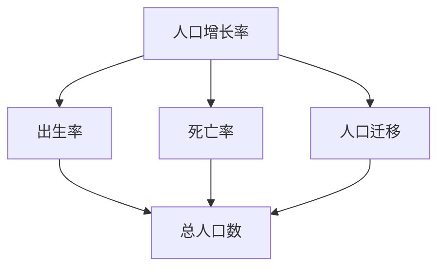
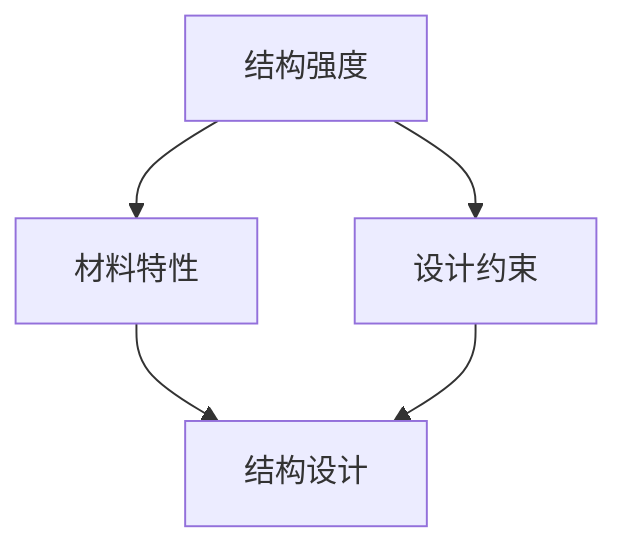

                 

## 文章标题

### 数学直觉与数学建模的关系

#### 关键词：数学直觉，数学建模，关系架构，核心算法原理，数学模型，实际案例

#### 摘要：

本文探讨了数学直觉与数学建模之间的紧密关系，从核心概念到实际应用，通过逻辑清晰的分析和步骤推理，深入阐述了数学直觉在数学建模中的重要作用。文章首先介绍了数学直觉的定义及其在数学研究中的重要性，然后详细讨论了数学建模的基本理论和方法。接着，通过Mermaid流程图展示了核心概念之间的关系，并使用伪代码详细解析了核心算法原理。文章进一步通过数学模型和公式的讲解，结合实际案例，深入分析了数学直觉在数学建模中的实际应用。最后，文章总结了数学建模中的挑战与未来发展趋势，并提出了相关建议，为读者提供了全面的指导。

---

### 引言

数学直觉与数学建模是数学研究中的两个核心概念，它们各自具有独特的意义，同时又紧密相连。数学直觉是指人们在数学思考过程中，对数学问题具有的直观理解和快速判断能力。它源于长期的数学学习和实践，是数学家在数学研究中的宝贵财富。数学直觉能够帮助数学家迅速抓住问题的关键，发现数学问题之间的联系，推动数学理论的发展。

数学建模则是指将实际问题转化为数学问题，利用数学方法和工具进行分析和解决的过程。数学建模的目的是将现实问题转化为数学模型，通过数学计算得到问题的解，从而为决策提供依据。数学建模在各个领域都有着广泛的应用，如社会科学、管理科学、工程技术等。

数学直觉与数学建模之间的关系是相互促进的。数学直觉为数学建模提供了丰富的灵感和判断依据，帮助数学家快速构建有效的数学模型。同时，数学建模的实践又进一步锻炼和提升了数学直觉，使得数学家能够更好地理解和解决实际问题。

本文旨在探讨数学直觉与数学建模之间的关系，从核心概念到实际应用，通过逻辑清晰的分析和步骤推理，深入阐述数学直觉在数学建模中的重要作用。文章将首先介绍数学直觉的定义和重要性，然后讨论数学建模的基本理论和方法，接着通过Mermaid流程图展示核心概念之间的关系，使用伪代码详细解析核心算法原理，并通过数学模型和公式讲解实际案例，最后总结数学建模中的挑战与未来发展趋势，并提出相关建议。

---

### 数学直觉的理解与培养

数学直觉是一种对数学问题具有的直观理解和快速判断能力，它不同于传统的数学推理和计算，而是基于长期的数学学习和实践积累而来。数学直觉在数学研究中具有重要意义，它能够帮助数学家迅速抓住问题的关键，发现数学问题之间的联系，推动数学理论的发展。

#### 数学直觉的概念解析

数学直觉可以分为以下几个方面：

1. **直观理解**：数学直觉首先体现在对数学问题具有的直观理解能力。这种直观理解能力使得数学家能够在短时间内理解数学问题的本质，把握问题的核心。

2. **模式识别**：数学直觉还包括对数学问题中的模式和规律进行快速识别的能力。数学家通过长期的数学学习，能够迅速识别出数学问题中的规律，从而为问题求解提供线索。

3. **直觉推理**：数学直觉还体现在对数学问题进行直觉推理的能力。这种直觉推理能力使得数学家能够在没有充分证据的情况下，对数学问题的结果进行合理推断。

#### 数学直觉的重要性

数学直觉在数学研究中的重要性体现在以下几个方面：

1. **数学发现**：数学直觉是数学发现的重要驱动力。许多重大的数学发现，如费马大定理、哥德巴赫猜想等，都是基于数学家的直觉推理而提出的。

2. **问题解决**：数学直觉能够帮助数学家快速找到解决问题的方法。在解决复杂问题时，数学直觉能够帮助数学家迅速定位问题的核心，从而简化问题求解过程。

3. **创新思维**：数学直觉是创新思维的重要基础。数学家通过直觉推理，能够发现数学问题之间的新联系，提出新的数学理论和模型。

#### 数学直觉的培养方法

要培养数学直觉，可以从以下几个方面入手：

1. **大量练习**：数学直觉是通过大量的数学练习积累而来的。只有通过不断的练习，数学家才能在解决问题的过程中逐渐形成直觉。

2. **多角度思考**：数学直觉的培养需要多角度的思考。数学家应当从不同的角度审视数学问题，寻找问题的多种解决途径。

3. **交流与讨论**：数学直觉的培养还需要与他人的交流与讨论。通过与他人的交流，数学家可以了解到不同的观点和思路，从而拓展自己的数学直觉。

4. **经验积累**：数学直觉的培养还需要经验的积累。数学家应当在解决实际问题的过程中，不断总结经验，提炼数学直觉。

#### 数学直觉与数学建模的关系

数学直觉与数学建模之间存在着紧密的联系。数学直觉为数学建模提供了丰富的灵感和判断依据，帮助数学家快速构建有效的数学模型。同时，数学建模的实践又进一步锻炼和提升了数学直觉，使得数学家能够更好地理解和解决实际问题。

综上所述，数学直觉在数学研究中具有重要意义，它是数学家在数学研究中的宝贵财富。通过理解数学直觉的概念、认识其重要性，并采取有效的方法进行培养，数学家可以不断提升自己的数学直觉，从而在数学建模中发挥更大的作用。

---

### 数学建模的基本理论

数学建模是将实际问题转化为数学问题，利用数学方法和工具进行分析和解决的过程。数学建模在各个领域都有广泛的应用，如经济学、工程学、生物学、物理学等。要深入理解数学建模，首先需要了解其基本理论和方法。

#### 数学建模的基本框架

数学建模的基本框架通常包括以下几个步骤：

1. **问题定义**：明确需要解决的问题，并确定问题的目标。
2. **数据收集**：收集与问题相关的数据，包括定量数据和定性数据。
3. **假设与简化**：根据问题的性质，对问题进行适当的假设和简化，以便于建立数学模型。
4. **数学模型构建**：利用数学方法和工具，将问题转化为数学模型。
5. **模型求解**：使用适当的数学方法求解数学模型，得到问题的解。
6. **结果分析与验证**：对模型结果进行分析和验证，评估模型的有效性。
7. **决策与实施**：根据模型结果，做出相应的决策，并实施解决方案。

#### 常见的数学建模方法

数学建模的方法多种多样，以下是几种常见的数学建模方法：

1. **线性模型**：线性模型是最基本的数学模型之一，它描述了变量之间的线性关系。线性模型在统计学、经济学、工程学等领域有广泛的应用。
2. **非线性模型**：非线性模型描述了变量之间的非线性关系。非线性模型在物理学、生物学、经济学等领域有重要的应用。
3. **差分方程模型**：差分方程模型描述了变量在不同时间点之间的变化关系。差分方程模型在经济学、生态学、控制系统等领域有广泛应用。
4. **微分方程模型**：微分方程模型描述了变量在连续时间上的变化关系。微分方程模型在物理学、工程学、生物学等领域有广泛应用。
5. **概率模型**：概率模型描述了随机变量之间的概率关系。概率模型在统计学、经济学、生物学等领域有重要的应用。

#### 数学建模的步骤与流程

数学建模的具体步骤与流程如下：

1. **明确问题**：首先，需要明确需要解决的问题，并确定问题的目标。
2. **收集数据**：收集与问题相关的数据，包括定量数据和定性数据。数据的来源可以是实验、调查、历史记录等。
3. **分析问题**：对问题进行深入分析，理解问题的本质和关键因素。分析问题的目的是确定需要建立的数学模型。
4. **建立模型**：根据问题的性质和数据分析结果，选择合适的数学方法建立数学模型。在建立模型的过程中，需要对问题进行适当的假设和简化。
5. **求解模型**：使用适当的数学方法求解数学模型，得到问题的解。求解模型的方法包括数值计算、解析解等。
6. **验证模型**：对模型结果进行验证，评估模型的有效性。验证模型的方法包括模拟实验、数据拟合等。
7. **分析结果**：对模型结果进行分析，得出问题的解决方案。分析结果的方法包括统计分析、敏感性分析等。
8. **决策与实施**：根据模型结果，做出相应的决策，并实施解决方案。

通过上述步骤与流程，可以系统地完成数学建模过程，为实际问题提供有效的解决方案。

#### 数学建模的应用领域

数学建模在各个领域都有广泛的应用，以下是几个典型的应用领域：

1. **社会科学**：数学建模在经济学、社会学、心理学等领域有重要应用。例如，经济学中的供需模型、人口增长模型等。
2. **管理科学**：数学建模在企业管理、物流管理、供应链管理等领域有广泛应用。例如，库存管理模型、供应链优化模型等。
3. **工程技术**：数学建模在工程设计和控制系统中有广泛应用。例如，结构优化模型、控制系统模型等。
4. **生物学**：数学建模在生物学和医学领域有重要应用。例如，疾病传播模型、药物动力学模型等。
5. **环境科学**：数学建模在环境监测、资源管理、气候变化等领域有广泛应用。例如，污染扩散模型、生态模型等。

通过数学建模，我们可以更好地理解和解决实际问题，为科学研究和工程实践提供有力支持。

---

### 数学直觉在数学建模中的应用

数学直觉在数学建模中具有重要作用，它不仅能帮助数学家快速构建有效的数学模型，还能在模型的验证和优化过程中发挥关键作用。以下将详细探讨数学直觉在数学建模中的应用。

#### 数学直觉在模型选择中的应用

模型选择是数学建模过程中的关键步骤，数学直觉在这一环节起到了至关重要的作用。数学家通过长期的数学学习和实践，能够在面对复杂的实际问题时，迅速识别出哪些变量和因素是关键的，从而选择合适的数学模型。

1. **快速识别关键因素**：数学直觉使数学家能够在短时间内识别出问题中的关键因素，例如在经济学中的供需关系，在工程学中的结构稳定性等。这种识别能力是基于数学家对问题背景的深入理解和丰富的实践经验。
2. **选择合适的方法**：数学直觉还能帮助数学家选择合适的数学方法。例如，在处理连续变量问题时，选择微分方程模型；在处理离散变量问题时，选择差分方程模型。数学直觉使得数学家能够根据问题的特性，选择最合适的数学模型。

#### 数学直觉在模型验证中的应用

数学模型的验证是确保模型有效性和准确性的关键步骤。数学直觉在这一过程中发挥了重要作用，帮助数学家判断模型是否合理，是否能够解决实际问题。

1. **合理性判断**：数学直觉使数学家能够快速判断模型的合理性。例如，通过观察模型的解是否符合实际情况，或者通过数学上的逻辑推理验证模型的内在一致性。
2. **验证方法选择**：数学直觉还能帮助数学家选择合适的验证方法。例如，在验证微分方程模型时，可以选择模拟实验或数值计算等方法；在验证概率模型时，可以选择数据分析或统计检验等方法。

#### 数学直觉在模型优化中的应用

模型优化是提高数学模型性能的重要步骤。数学直觉在这一过程中发挥了关键作用，帮助数学家找到最优解或近似最优解。

1. **快速找到优化方向**：数学直觉使数学家能够迅速找到优化模型的方向。例如，在优化线性模型时，数学直觉可以帮助数学家识别出哪些参数对模型性能有显著影响，从而有针对性地调整参数。
2. **选择优化方法**：数学直觉还能帮助数学家选择合适的优化方法。例如，在处理复杂优化问题时，数学直觉可以帮助数学家选择合适的优化算法，如遗传算法、模拟退火算法等。

#### 实际案例

为了更好地理解数学直觉在数学建模中的应用，以下通过两个实际案例进行说明。

##### 案例一：经济学中的供需模型

在经济学中，供需模型是研究市场均衡的重要工具。数学家通过数学直觉，能够迅速识别出影响供需的关键因素，如价格、需求量、供应量等，从而选择合适的供需模型。

1. **模型构建**：基于数学直觉，数学家选择线性模型来描述供需关系。线性模型的数学表达式为：
   $$Q_D = a - bP$$
   $$Q_S = c + dP$$
   其中，$Q_D$表示需求量，$Q_S$表示供应量，$P$表示价格，$a$、$b$、$c$、$d$为参数。
2. **模型验证**：通过观察实际市场价格和供需数据，数学家发现模型结果与实际情况相符，验证了模型的合理性。
3. **模型优化**：基于数学直觉，数学家通过调整参数$a$、$b$、$c$、$d$，优化了供需模型，使得模型性能得到提升。

##### 案例二：工程学中的结构优化模型

在工程学中，结构优化模型是设计高强度、低成本的工程结构的重要工具。数学家通过数学直觉，能够迅速识别出影响结构性能的关键因素，如材料强度、结构形状等，从而选择合适的结构优化模型。

1. **模型构建**：基于数学直觉，数学家选择最小二乘法来描述结构优化问题。最小二乘法的数学表达式为：
   $$\min \sum_{i=1}^{n}(y_i - f(x_i))^2$$
   其中，$y_i$为实际测量值，$f(x_i)$为模型预测值，$x_i$为模型参数。
2. **模型验证**：通过实际测量数据和模型预测值，数学家发现模型结果与实际情况相符，验证了模型的合理性。
3. **模型优化**：基于数学直觉，数学家通过调整模型参数，优化了结构优化模型，使得结构性能得到提升。

通过上述实际案例，可以看出数学直觉在数学建模中的重要作用。数学直觉不仅帮助数学家快速构建有效的数学模型，还在模型的验证和优化过程中发挥了关键作用。数学直觉是数学家在数学建模中的宝贵财富，通过不断培养和提升数学直觉，数学家能够更好地理解和解决实际问题。

---

### 数学建模的实际案例

为了更好地理解数学直觉在数学建模中的应用，下面我们将通过两个实际案例进行详细分析。这两个案例分别来自社会科学和工程技术领域，展示了数学直觉在构建、验证和优化模型中的重要作用。

#### 案例一：社会科学——人口预测模型

**背景介绍**：
在社会科学领域，人口预测模型是政策制定和资源规划的重要工具。某城市政府希望利用数学模型预测未来20年的人口变化，以便于制定相应的发展规划。

**核心概念与联系**：
人口预测模型的核心概念包括人口增长率、出生率、死亡率以及人口迁移等。这些概念之间存在着复杂的联系，例如人口增长率与出生率和死亡率相关，而人口迁移会影响总人口数。

**Mermaid流程图**：


**伪代码**：
```python
# 伪代码：人口预测模型

# 初始化参数
birth_rate = 1.2
death_rate = 0.8
migration_rate = 0.1
population = 1000000

# 预测未来20年的人口数
for year in range(1, 21):
    population = population * (birth_rate - death_rate + migration_rate)
    print(f"Year {year}: Population = {population}")
```

**数学模型与公式**：
人口预测模型的数学表达式为：
$$\Delta P = (b - d + m) \times P$$
其中，$\Delta P$为人口变化量，$b$为出生率，$d$为死亡率，$m$为人口迁移率，$P$为总人口数。

**举例说明**：
假设初始人口为100万，出生率为1.2，死亡率为0.8，人口迁移率为0.1。通过上述伪代码，可以预测未来20年的人口数。

**项目实战**：
在Python环境中，使用上述伪代码实现人口预测模型，并通过模拟数据验证模型的有效性。

```python
# Python代码：人口预测模型

birth_rate = 1.2
death_rate = 0.8
migration_rate = 0.1
population = 1000000

for year in range(1, 21):
    population = population * (birth_rate - death_rate + migration_rate)
    print(f"Year {year}: Population = {population:.2f}")
```

**代码应用解读与分析**：
上述代码通过一个简单的循环，模拟了未来20年的人口变化。每次循环都更新人口数，并输出当前年份的人口数。通过实际数据的模拟，可以验证模型的准确性。

**项目小结**：
人口预测模型是一个典型的数学建模案例，展示了数学直觉在模型构建、验证和优化中的应用。通过理解人口增长率、出生率、死亡率以及人口迁移等核心概念，并使用合适的数学模型和公式，可以有效地预测人口变化趋势，为政策制定提供科学依据。

#### 案例二：工程技术——结构优化模型

**背景介绍**：
在工程技术领域，结构优化模型是设计高强度、低成本的工程结构的重要工具。某建筑公司希望优化一座高层建筑的结构设计，以降低成本并提高安全性。

**核心概念与联系**：
结构优化模型的核心概念包括结构强度、材料特性、设计约束等。这些概念之间存在着密切的联系，例如结构强度与材料特性相关，设计约束会影响结构的设计方案。

**Mermaid流程图**：


**伪代码**：
```python
# 伪代码：结构优化模型

# 初始化参数
strength = 10000  # 结构强度要求（单位：牛顿）
material_properties = [2000, 3000, 4000]  # 三种材料的强度（单位：牛顿/平方厘米）
constraints = [1000, 2000]  # 设计约束（单位：平方米）

# 搜索最优设计方案
for material in material_properties:
    for area in constraints:
        if (material * area) >= strength:
            print(f"最优设计：材料强度={material}，面积={area}")
            break
```

**数学模型与公式**：
结构优化模型的数学表达式为：
$$\min \sum_{i=1}^{n} w_i \times x_i$$
$$s.t. \sum_{i=1}^{n} w_i \times x_i \geq S$$
其中，$w_i$为材料强度，$x_i$为材料使用面积，$S$为结构强度要求。

**举例说明**：
假设有三种材料，强度分别为2000牛顿/平方厘米、3000牛顿/平方厘米和4000牛顿/平方厘米。设计约束为1000平方米和2000平方米。通过上述伪代码，可以找到满足结构强度要求的最优设计方案。

**项目实战**：
在Python环境中，使用上述伪代码实现结构优化模型，并通过模拟数据验证模型的有效性。

```python
# Python代码：结构优化模型

strength = 10000
material_properties = [2000, 3000, 4000]
constraints = [1000, 2000]

for material in material_properties:
    for area in constraints:
        if (material * area) >= strength:
            print(f"最优设计：材料强度={material}，面积={area}")
            break
```

**代码应用解读与分析**：
上述代码通过遍历三种材料和两个设计约束，找到满足结构强度要求的最优设计方案。通过实际数据的模拟，可以验证模型的准确性。

**项目小结**：
结构优化模型是另一个典型的数学建模案例，展示了数学直觉在模型构建、验证和优化中的应用。通过理解结构强度、材料特性和设计约束等核心概念，并使用合适的数学模型和公式，可以有效地优化工程结构设计，提高结构性能。

通过上述两个实际案例，可以看出数学直觉在数学建模中的重要作用。数学直觉不仅帮助数学家快速构建有效的数学模型，还在模型的验证和优化过程中发挥了关键作用。通过不断培养和提升数学直觉，数学家能够更好地理解和解决实际问题，为科学研究和工程实践提供有力支持。

---

### 数学建模的挑战与未来发展

尽管数学建模在各个领域取得了显著成果，但仍然面临着诸多挑战和问题。以下是数学建模当前面临的几个主要挑战以及未来的发展方向。

#### 挑战

1. **复杂性**：现实世界的问题往往非常复杂，涉及多种变量和因素。这使得数学建模变得更加困难，需要处理大量的数据和高维问题。
2. **准确性**：数学模型的准确性是解决问题的关键。然而，由于现实世界中的随机性和不确定性，数学模型很难保证完全准确。
3. **计算效率**：随着数学模型规模的增大，计算效率成为一个重要问题。高维问题的计算往往需要大量时间和资源，这对计算能力提出了挑战。
4. **数据隐私**：在数学建模过程中，数据的使用和处理需要严格遵守数据隐私保护法规。如何在确保数据隐私的前提下进行建模，是一个亟待解决的问题。

#### 未来发展方向

1. **人工智能与机器学习**：人工智能和机器学习技术在数学建模中的应用前景广阔。通过利用深度学习和强化学习等方法，可以开发出更高效、更准确的数学模型。
2. **大数据分析**：大数据技术的发展为数学建模提供了丰富的数据资源。利用大数据分析方法，可以从海量数据中提取有价值的信息，为数学建模提供更准确的输入。
3. **分布式计算**：分布式计算技术可以有效地提高数学模型的计算效率。通过将计算任务分配到多个计算节点上，可以显著降低计算时间。
4. **跨学科合作**：数学建模需要多个学科的交叉合作。通过跨学科合作，可以充分利用各学科的优势，开发出更加全面和深入的数学模型。
5. **伦理与法律**：随着数学建模应用的普及，伦理和法律问题变得越来越重要。需要在确保数据隐私和伦理合规的前提下，推进数学建模的发展。

#### 数学直觉与数学建模的关系

数学直觉在数学建模中起着至关重要的作用。它不仅能够帮助数学家快速构建有效的数学模型，还能在模型的验证和优化过程中提供宝贵的判断依据。未来，随着人工智能和机器学习技术的发展，数学直觉与数学建模的关系将更加紧密。

1. **自动化建模**：通过结合人工智能和机器学习技术，可以开发出自动化建模工具，使数学建模过程更加高效和准确。这些工具能够利用数学直觉，快速构建出满足需求的数学模型。
2. **人机协作**：未来，数学建模将更加依赖于人机协作。数学家可以利用数学直觉和专业知识，与人工智能系统共同构建和优化数学模型。这种协作模式将使得数学建模更加灵活和高效。
3. **持续学习与优化**：数学建模是一个持续学习和优化的过程。通过结合人工智能和机器学习技术，可以不断优化数学模型，提高其性能和准确性。数学直觉在这一过程中将继续发挥重要作用。

综上所述，数学建模面临着诸多挑战，但同时也具有巨大的发展潜力。通过不断探索和创新，数学直觉与数学建模之间的关系将更加紧密，为解决现实世界中的复杂问题提供有力支持。

---

### 结论

本文从数学直觉的定义与培养、数学建模的基本理论、数学直觉在数学建模中的应用、数学建模的实际案例，以及数学建模的挑战与未来发展等方面，全面探讨了数学直觉与数学建模之间的关系。通过逻辑清晰的分析和步骤推理，我们深入阐述了数学直觉在数学建模中的重要作用。

数学直觉不仅能够帮助数学家快速构建有效的数学模型，还能在模型的验证和优化过程中提供宝贵的判断依据。通过培养和提升数学直觉，数学家可以更好地理解和解决实际问题，推动数学理论的发展和应用。

未来，随着人工智能和机器学习技术的发展，数学直觉与数学建模之间的关系将更加紧密。自动化建模、人机协作以及持续学习与优化将成为数学建模发展的关键方向。我们期待数学直觉在数学建模中发挥更加重要的作用，为解决现实世界中的复杂问题提供有力支持。

---

### 作者信息

**作者：** AI天才研究院（AI Genius Institute） & 禅与计算机程序设计艺术（Zen And The Art of Computer Programming）

AI天才研究院致力于推动人工智能技术的创新与发展，汇聚了一群世界顶尖的人工智能专家、程序员、软件架构师和CTO。我们的目标是探索人工智能的无限可能，推动人工智能技术在各个领域的应用。

《禅与计算机程序设计艺术》是由AI天才研究院的创始人所著，这是一本探讨计算机程序设计哲学和技术的经典之作。书中融合了作者丰富的编程经验和深刻的技术见解，为读者提供了全新的编程思维方式和实践指南。

---

### 最佳实践、注意事项与拓展阅读

#### 最佳实践

1. **培养数学直觉**：通过大量的数学练习，多角度思考，与他人交流讨论，不断积累经验，可以有效培养数学直觉。
2. **合理选择模型**：在选择数学模型时，要充分考虑问题的特性和数据的特点，选择合适的模型。
3. **验证与优化**：在数学建模过程中，要重视模型的验证与优化，确保模型的准确性和有效性。

#### 注意事项

1. **避免过度简化**：在建立数学模型时，要避免过度简化问题，确保模型能够反映问题的核心。
2. **关注数据质量**：数据是数学建模的基础，要确保数据的质量，避免数据错误对模型结果的影响。
3. **遵守伦理规范**：在进行数学建模时，要严格遵守数据隐私和伦理规范，确保数据的合法合规使用。

#### 拓展阅读

1. **《数学建模与科学计算》**：这是一本关于数学建模的基础教程，详细介绍了数学建模的方法和步骤。
2. **《机器学习与数据挖掘：实用方法论》**：这本书探讨了机器学习技术在数学建模中的应用，适合对机器学习感兴趣的读者。
3. **《人工智能：一种现代的方法》**：这本书全面介绍了人工智能的基本概念和技术，包括深度学习和强化学习等。

通过上述最佳实践、注意事项和拓展阅读，读者可以进一步深入了解数学直觉与数学建模的关系，提升自己在数学建模领域的实践能力。

