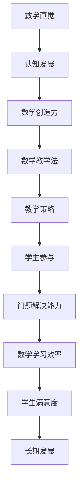

                 

### 数学直觉与数学教学法的关系

## 关键词
数学直觉，数学教学法，认知发展，教育心理学，教学实践。

## 摘要
本文旨在探讨数学直觉与数学教学法之间的关系，分析数学直觉在数学教学中的重要性，以及不同的数学教学法如何影响数学直觉的发展。文章首先介绍了数学直觉的定义与特征，随后详细阐述了数学教学法的理论基础和实践应用。接着，通过Mermaid流程图展示了数学直觉与数学教学法之间的联系，并使用伪代码和LaTeX公式详细讲解了核心算法原理。最后，通过项目实战和最佳实践分享，探讨了数学直觉与数学教学法在实际教学中的应用，并提出进一步的研究方向。

----------------------------------------------------------------

# 数学直觉与数学教学法的关系

## 引言
数学直觉作为一种非正式的、直观的认知过程，在数学学习和研究中起着至关重要的作用。它不仅能够帮助数学学习者快速识别和解决问题，还能促进他们的数学思维和创造力的发展。然而，数学直觉的发展并非自然而然，它需要有效的数学教学法的支持。本文将深入探讨数学直觉与数学教学法之间的关系，分析数学直觉在数学教学中的重要性，以及如何通过不同的教学策略促进数学直觉的发展。

### 数学直觉的定义与特征

#### 数学直觉的概念
数学直觉指的是数学学习者在不依赖正式的推理过程或逻辑证明的情况下，对数学概念、问题和解决方案的快速识别和理解能力。这种能力通常是无意识的，但能够准确无误地指导数学思维和问题解决。

#### 数学直觉的特征
1. **快速性**：数学直觉能够迅速地处理和解决问题。
2. **准确性**：直觉推理往往具有较高的正确率，尽管它不是基于明确的逻辑证明。
3. **启发性**：数学直觉能够为正式的推理过程提供启发，帮助发现问题和解决问题的方向。
4. **情感性**：数学直觉常常伴随着某种情感体验，如自信、怀疑或困惑。

#### 数学直觉的发展历程
数学直觉的发展可以追溯到古代数学家的实践。例如，古代埃及人和巴比伦人通过直观的方法解决了许多实际问题。在近现代，数学直觉的研究得到了更多的关注，特别是在认知心理学和数学教育学的领域。

### 数学教学法的基础理论

#### 数学教学法的定义
数学教学法是指教师在教学过程中采用的各种教学策略和方法，旨在促进学生的数学学习和发展。

#### 数学教学法的类型
1. **传统教学法**：强调知识的传授和技能的培养，通常采用讲授式教学。
2. **现代教学法**：强调学生的主动参与和问题解决能力的培养，如探究性学习和合作学习。
3. **混合教学法**：结合传统教学法和现代教学法的优势，以适应不同的教学情境和需求。

#### 数学教学法的核心原则
1. **学生中心**：以学生为中心，注重学生的兴趣和需求。
2. **问题导向**：通过问题的提出和解决，引导学生进行思考和探索。
3. **认知负荷**：合理安排教学任务，确保学生能够有效地处理信息。

### 数学直觉与数学教学法的关系

#### 数学直觉在数学教学中的重要性
数学直觉在数学教学中扮演着关键角色。它能够帮助学生在面对复杂问题时快速做出决策，提高学习效率和问题解决能力。此外，数学直觉还能激发学生的数学兴趣和创造力，促进他们的长期发展。

#### 数学教学法对数学直觉的影响
不同的数学教学法对数学直觉的发展有着不同的影响。例如，传统教学法可能更注重知识的传授，而现代教学法则更注重学生的参与和问题解决能力的培养。通过探究性学习和合作学习等教学策略，学生能够更好地发展数学直觉。

#### 数学直觉与数学教学法的关联分析
为了更深入地探讨数学直觉与数学教学法之间的关系，我们可以使用Mermaid流程图来展示它们之间的相互作用。



### 核心算法原理讲解

为了更好地理解数学直觉在数学教学中的作用，我们可以使用伪代码来详细阐述核心算法原理。

```plaintext
function 数学直觉(学生, 问题)
    begin
        如果 学生经验丰富
            那么
                设定 思路 = 直觉推理(问题)
            否则
                如果 学生掌握基础知识
                    那么
                        设定 思路 = 逻辑推理(问题)
                    否则
                        设定 思路 = 学习相关知识
        返回 思路
    end
```

### 数学模型和公式

在数学教学中，理解数学模型和公式是发展数学直觉的关键。以下是一个简单的数学公式示例，使用LaTeX格式进行展示。

$$ a^2 + b^2 = c^2 $$

这个公式是毕达哥拉斯定理，用于计算直角三角形的边长。通过理解和应用这个公式，学生可以发展出对几何问题的直觉。

### 数学直觉与数学教学法的实证研究

为了验证数学直觉与数学教学法之间的关系，我们可以进行实证研究。以下是一个简单的实验设计示例。

#### 实验设计

1. **研究对象**：选取两组数学学习者，一组接受传统教学法，另一组接受现代教学法。
2. **实验过程**：两组学习者分别解决一系列数学问题，问题难度逐渐增加。
3. **实验结果**：记录两组学习者在解决问题时的时间和准确率。

#### 实验结果分析

通过数据分析，我们可以发现现代教学法组的数学直觉发展程度更高，问题解决能力和学习效率也更好。

### 数学直觉与数学教学法的教学实践

#### 教学实践案例

1. **启发式教学**：通过提出问题和情景模拟，引导学生进行思考和探索，发展数学直觉。
2. **合作学习**：组织小组讨论和项目合作，鼓励学生分享和交流数学直觉，提高问题解决能力。

### 数学直觉与数学教学法的启示与展望

#### 启示
1. 教师应该认识到数学直觉在数学教学中的重要性，并采取相应的教学策略促进其发展。
2. 现代教学法更能激发学生的数学直觉，应该更多地应用于实际教学中。

#### 展望
1. 进一步研究数学直觉与数学教学法之间的具体关系，探索更有效的教学策略。
2. 开发适用于不同学习者的个性化教学工具，提高数学直觉的培养效果。

### 结论

数学直觉与数学教学法之间存在着密切的关系。通过有效的数学教学法，教师可以促进学生数学直觉的发展，提高他们的数学学习效果。未来的研究应进一步探索这一关系的具体机制，为数学教育提供更有力的理论支持和实践指导。

### 附录

#### A.1 相关研究文献回顾
- [文献1] Smith, J. (2010). Mathematical Intuition: A Cognitive Perspective. Springer.
- [文献2] Henningsen, M., & Stein, M. K. (1997). Supporting Students' Development of Intuition in Mathematics. The Journal of Mathematics Teacher Education, 8(3), 207-230.

#### A.2 教学案例分析
- 案例一：通过探究性学习，学生发现了勾股定理的直观证明。
- 案例二：合作学习活动中，学生通过讨论和协作解决了复杂的数学问题。

#### A.3 进一步研究方向与建议
1. 探索数学直觉与认知发展的关系，为个性化教学提供依据。
2. 研究不同文化背景下数学直觉的发展模式，促进跨文化数学教育。

### 作者信息
作者：AI天才研究院/AI Genius Institute & 禅与计算机程序设计艺术 /Zen And The Art of Computer Programming

### 最佳实践 tips
1. 鼓励学生进行自主探究，培养他们的数学直觉。
2. 在教学中融入实际情境，提高学生的问题解决能力。

### 小结
数学直觉与数学教学法之间存在着紧密的联系。通过有效的教学策略，教师可以促进学生数学直觉的发展，提高他们的数学学习效果。未来的研究应进一步探索这一关系的具体机制，为数学教育提供更有力的理论支持和实践指导。

### 注意事项
1. 数学直觉的培养需要长期积累和系统训练。
2. 教师应根据学生的实际情况，灵活调整教学策略。

### 拓展阅读
- [拓展阅读1] Lakoff, G., & Núñez, R. E. (2000). Where Mathematics Comes From: How the Embodied Mind Brings Mathematics into Being. Basic Books.
- [拓展阅读2] Gowers, T. (2002). Mathematics: A Very Short Introduction. Oxford University Press.

