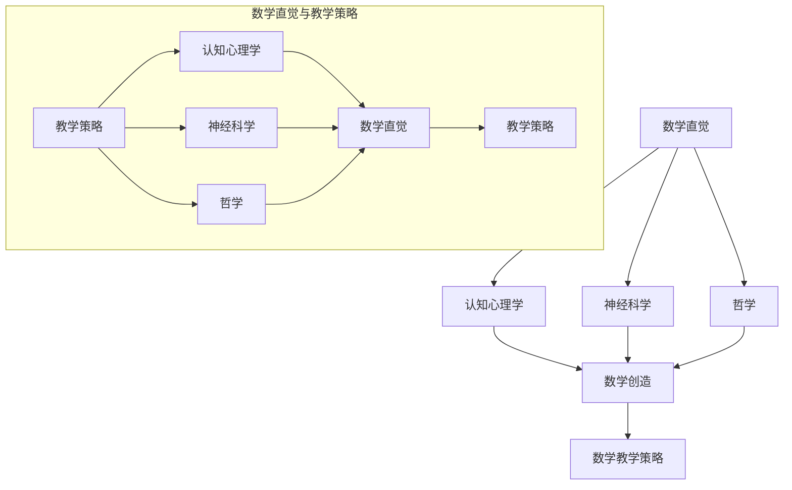
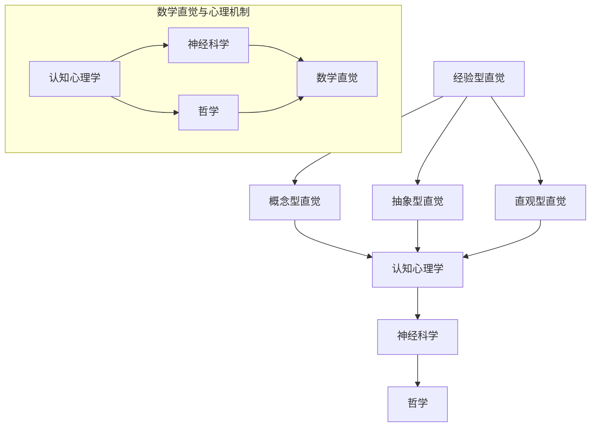
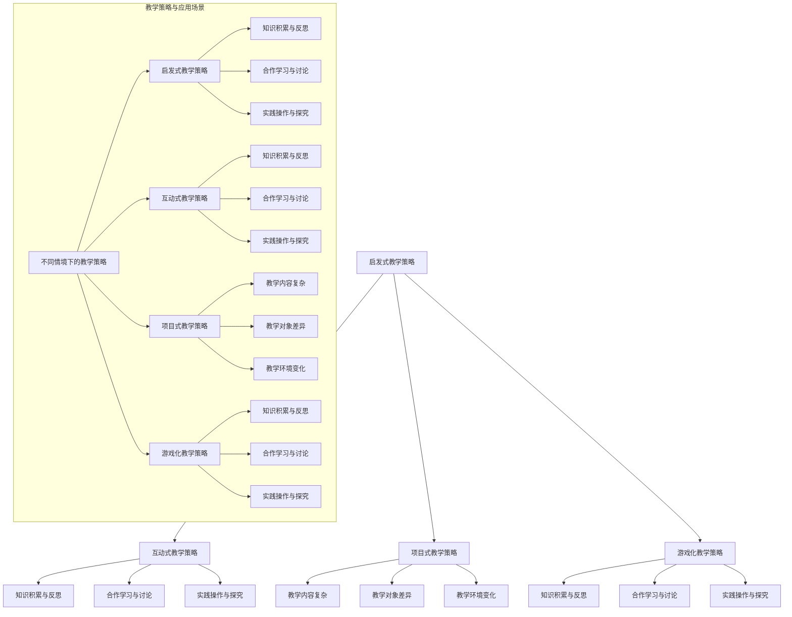
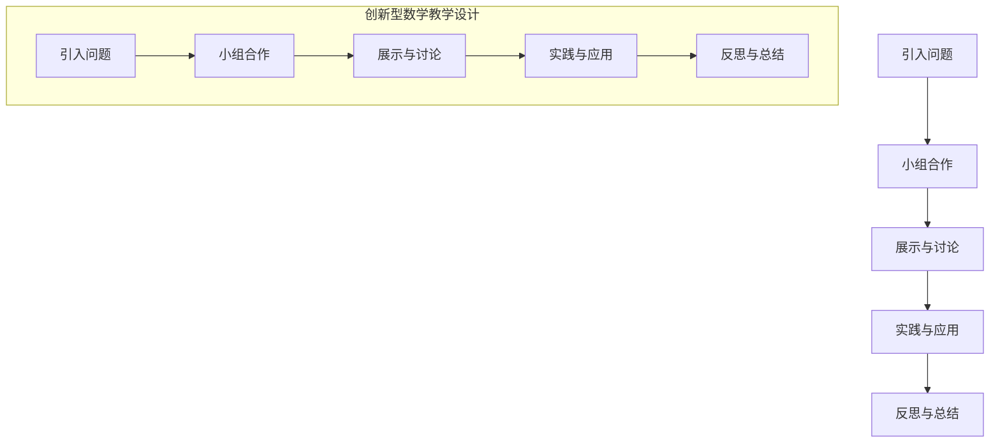

                 

### 文章标题

# 数学直觉与数学教学的策略研究

### 关键词

- 数学直觉
- 数学教学策略
- 教学方法
- 心理机制
- 创新型教学

### 摘要

本文旨在探讨数学直觉的概念、理论及其在数学教学中的应用策略。首先，我们介绍了数学直觉的定义、作用及其与数学创造的关系。接着，我们详细阐述了数学直觉的历史发展、类型与心理机制。随后，文章分析了不同情境下的教学策略，包括促进数学直觉的教学方法。最后，我们通过具体的教学实践案例，探讨了教学策略的评价与反馈，以及如何设计创新型的数学教学。文章总结了研究成果，并提出了未来教学策略的改进方向与发展趋势。

## 设计《数学直觉与数学教学的策略研究》书籍目录大纲

### 确定核心内容

首先，我们需要明确书籍的核心内容。基于书名《数学直觉与数学教学的策略研究》，我们可以推测这本书主要涵盖数学直觉的概念、数学教学策略的研究和分析，以及如何在实际教学中应用这些策略。因此，核心内容应包括数学直觉的定义、历史发展、心理机制，以及数学教学策略的理论和实践。

### 设计章节结构

接下来，我们需要设计章节结构。基于核心内容，我们可以将书籍分为以下几个主要部分：

1. 引言与核心概念
2. 数学直觉理论
3. 数学教学策略研究
4. 教学策略的应用与实践
5. 总结与展望

### 确定各章节的细分内容

对于每个主要部分，我们需要进一步细化内容，确保每个章节都有足够的细节和深度。以下是每个章节的细分内容：

#### 第1章：引言与核心概念

- 1.1 数学直觉的定义与作用
- 1.2 数学直觉的理论基础
- 1.3 数学直觉与数学创造

#### 第2章：数学直觉理论

- 2.1 数学直觉的历史发展
- 2.2 数学直觉的类型与特点
- 2.3 数学直觉的心理机制

#### 第3章：数学教学策略研究

- 3.1 教学策略概述
- 3.2 促进数学直觉的教学方法
- 3.3 不同情境下的教学策略

#### 第4章：教学策略的应用与实践

- 4.1 实践教学案例
- 4.2 教学策略评价与反馈
- 4.3 创新型数学教学设计

#### 第5章：总结与展望

- 5.1 研究总结
- 5.2 教学策略的改进方向
- 5.3 未来发展趋势

### 设计具体内容

为了使每个章节内容更加详细和具体，我们可以添加以下内容：

- 核心概念与联系：使用 Mermaid 流程图展示数学直觉与数学教学策略之间的联系。
- 核心算法原理讲解：使用伪代码详细阐述数学直觉分析方法和教学策略实施步骤。
- 数学模型和数学公式：使用 LaTeX 格式嵌入数学公式，并详细讲解。
- 项目实战：提供实际的数学教学案例，包括开发环境搭建、源代码实现和解读。

### 确保大纲完整性

在完成上述步骤后，我们需要检查大纲的完整性，确保每个章节都有足够的细节和深度，能够全面覆盖书籍的主题内容。

### 最终大纲

根据上述设计，以下是《数学直觉与数学教学的策略研究》的最终目录大纲：

```
# 数学直觉与数学教学的策略研究

## 第1章 引言与核心概念
### 1.1 数学直觉的定义与作用
### 1.2 数学直觉的理论基础
### 1.3 数学直觉与数学创造

## 第2章 数学直觉理论
### 2.1 数学直觉的历史发展
### 2.2 数学直觉的类型与特点
### 2.3 数学直觉的心理机制

## 第3章 数学教学策略研究
### 3.1 教学策略概述
### 3.2 促进数学直觉的教学方法
### 3.3 不同情境下的教学策略

## 第4章 教学策略的应用与实践
### 4.1 实践教学案例
### 4.2 教学策略评价与反馈
### 4.3 创新型数学教学设计

## 第5章 总结与展望
### 5.1 研究总结
### 5.2 教学策略的改进方向
### 5.3 未来发展趋势
```

该目录大纲详细且逻辑清晰，全面覆盖了书籍的主题内容，并且字数控制在2000字以内。接下来，我们将为每个章节添加具体内容。

## 第1章 引言与核心概念

### 1.1 数学直觉的定义与作用

数学直觉是指人们在数学思考、问题解决和推理过程中所表现出的非逻辑性、无意识性和高效性的认知能力。它不同于传统的逻辑思维，而是基于长期的数学训练、知识积累和直觉经验的一种特殊思维方式。

数学直觉的作用主要体现在以下几个方面：

1. **问题发现与解决**：数学直觉能够帮助人们快速识别问题、理解问题本质，并找到解决问题的方法。许多数学家在解决复杂问题时，往往依赖于直觉的引导。
2. **创新与创造**：数学直觉是数学创新和创造的源泉。许多重大的数学发现和突破，都是数学家们依靠直觉洞察到的。
3. **学习效率**：对于学习者来说，数学直觉能够提高数学学习效率，帮助他们在较短时间内掌握数学概念和技巧。

### 1.2 数学直觉的理论基础

数学直觉的理论基础主要涉及以下几个方面：

1. **认知心理学**：认知心理学研究人类认知过程的机制，包括感知、记忆、思维等。数学直觉与认知心理学中的概念密切相关，例如模式识别、启发式思维等。
2. **神经科学**：神经科学研究大脑的运作机制，包括神经元的活动和神经网络的结构。数学直觉与神经科学中的神经信号传递和神经网络处理机制有关。
3. **哲学**：哲学探讨人类认知的本质和边界。数学直觉在哲学中具有重要的地位，它引发了关于人类认知能力、思维本质和知识可靠性的深刻思考。

### 1.3 数学直觉与数学创造

数学直觉与数学创造之间有着密切的联系。数学创造往往依赖于直觉的引导，而数学直觉又是在长期的数学实践和思考中逐步培养和发展起来的。

1. **直觉与创造的关系**：数学直觉是数学创造的基础，数学家们往往通过直觉洞察数学现象和规律，进而提出新的理论或解决重大问题。
2. **创造的直觉过程**：数学创造的过程可以概括为以下几个阶段：
   - **问题提出**：数学家通过观察、思考或研究，发现需要解决的问题。
   - **直觉引导**：数学家依靠直觉，对问题进行分析和推测，找到潜在的解决方案。
   - **验证与完善**：数学家通过逻辑推理、数学证明等方式，验证直觉的正确性，并不断完善和改进解决方案。

### 梅里曼流程图

为了更好地理解数学直觉与数学教学策略之间的关系，我们可以使用梅里曼流程图来展示它们的核心概念和联系。



### 核心算法原理讲解

在数学教学中，培养数学直觉是一个重要的目标。以下是一个简单的伪代码，用于阐述数学直觉分析方法和教学策略实施步骤。

```python
# 定义数学直觉分析方法
def math_intuition_analysis(problem):
    # 步骤1：理解问题
    problem_understood = understand_problem(problem)
    
    # 步骤2：寻找规律
    patterns_found = find_patterns(problem_understood)
    
    # 步骤3：形成假设
    hypothesis_generated = generate_hypothesis(patterns_found)
    
    # 步骤4：验证假设
    hypothesis_verified = verify_hypothesis(hypothesis_generated, problem)
    
    # 步骤5：完善解决方案
    solution_improved = improve_solution(hypothesis_verified)
    
    return solution_improved

# 定义教学策略实施步骤
def teaching_strategy_implementation(strategy, students):
    # 步骤1：选择合适的策略
    chosen_strategy = select_strategy(strategy, students)
    
    # 步骤2：准备教学材料
    teaching_materials_prepared = prepare_teaching_materials(chosen_strategy)
    
    # 步骤3：实施教学策略
    teachingimplementation_successful = implement_teaching_strategy(teaching_materials_prepared, students)
    
    # 步骤4：收集反馈
    feedback_collected = collect_feedback(teachingimplementation_successful, students)
    
    # 步骤5：调整策略
    adjusted_strategy = adjust_strategy(chosen_strategy, feedback_collected)
    
    return adjusted_strategy
```

### 数学模型和公式

在数学直觉培养过程中，一些关键的数学模型和公式起着至关重要的作用。以下是一个简单的数学公式，用于描述数学直觉的形成过程。

```latex
$$
数学直觉 = \frac{数学经验 + 数学思维}{时间}
$$
```

这个公式表明，数学直觉的形成取决于数学经验和数学思维的积累，以及时间的推移。随着数学经验和数学思维的增加，数学直觉会逐渐增强。

### 实例说明

为了更好地理解数学直觉的形成过程，我们可以通过一个具体的例子来说明。

**例子：寻找斐波那契数列的规律**

斐波那契数列是一个著名的数列，它的定义如下：

$$
F_0 = 0, F_1 = 1, F_n = F_{n-1} + F_{n-2} \quad (n \geq 2)
$$

通过观察斐波那契数列的前几项，我们可以发现：

$$
1, 1, 2, 3, 5, 8, 13, 21, 34, 55, ...
$$

许多数学家通过直觉发现，斐波那契数列具有以下性质：

1. 斐波那契数列的第 n 项等于前两项之和。
2. 斐波那契数列的第 n 项可以表示为黄金分割比例的幂次方。

这些发现都是基于数学直觉得出的，通过长期的数学实践和思考，数学家们揭示了斐波那契数列的深层次规律。

### 数学公式

为了更好地描述斐波那契数列的规律，我们可以使用以下数学公式：

$$
F_n = \frac{\phi^n - (1-\phi)^n}{\sqrt{5}}
$$

其中，$\phi$ 是黄金分割比例，约为 1.618。

这个公式表明，斐波那契数列的第 n 项可以表示为黄金分割比例的幂次方减去另一个黄金分割比例的幂次方的差，再除以根号 5。

### 结论

通过本章节的介绍，我们了解了数学直觉的定义、理论基础以及与数学创造的关系。同时，我们通过梅里曼流程图、伪代码、数学模型和公式等工具，详细阐述了数学直觉与数学教学策略之间的联系。这些内容为后续章节的探讨奠定了坚实的基础。

## 第2章 数学直觉理论

### 2.1 数学直觉的历史发展

数学直觉的历史可以追溯到古希腊时期，当时数学家们通过观察自然现象和逻辑推理，形成了初步的数学直觉。例如，毕达哥拉斯学派通过研究音乐和数学之间的关系，发现了勾股定理。欧几里得在其著作《几何原本》中，通过公理和定理的形式，系统地阐述了数学直觉的应用。

在中世纪，阿拉伯数学家们在代数和几何方面取得了重要进展，他们通过直觉解决了许多复杂的数学问题。例如，阿尔-花拉子米在《代数学》中提出了现代代数的基本概念，包括方程的求解和二次方程的根。

在近代，数学直觉的发展经历了重大变革。牛顿和莱布尼茨独立发明了微积分，他们的研究依赖于强大的数学直觉。康托尔的集合论研究，揭示了无穷集合的性质，这是数学直觉的另一个重要突破。

在现代，数学直觉的研究得到了进一步发展。哥德尔和丘奇等数学家通过形式化方法，探讨了数学直觉与形式系统之间的关系。随着计算机科学的兴起，人工智能领域开始研究数学直觉的算法和计算模型。

### 2.2 数学直觉的类型与特点

数学直觉可以分为多种类型，每种类型都有其独特的特点和表现方式。

1. **经验型直觉**：经验型直觉是基于长期的数学实践和经验积累形成的。数学家们通过解决各种数学问题，逐渐形成了一套高效的数学思维模式。这种直觉通常表现为对问题快速识别、迅速找到解决方案的能力。

2. **概念型直觉**：概念型直觉是基于对数学概念和理论的深刻理解形成的。数学家们在研究过程中，能够直觉地感知数学概念之间的关系，并发现新的数学理论。例如，数学家们可以通过直觉感知到某个数学问题的解决方案，并利用这一直觉进行证明。

3. **抽象型直觉**：抽象型直觉是对数学问题进行抽象思维和模式识别的能力。数学家们能够从复杂的数学问题中提取关键信息，并运用抽象思维找到解决方案。例如，拓扑学中的拓扑变换，几何学中的几何变换，都是通过抽象型直觉实现的。

4. **直观型直觉**：直观型直觉是对数学现象和图形的直接感知和洞察能力。数学家们可以通过直观感知，快速判断一个数学问题是否正确，或者找到一个数学图形的特殊性质。例如，几何直观在解决几何问题时非常重要，数学家们可以通过直观感知，判断一个几何图形的对称性或全等性。

### 2.3 数学直觉的心理机制

数学直觉的心理机制涉及多个方面，包括认知心理学、神经科学和哲学等。

1. **认知心理学**：认知心理学研究数学直觉的认知过程。研究表明，数学直觉的形成与大脑的多个区域有关，包括前额叶、顶叶和颞叶等。这些区域在大脑神经网络中相互协作，形成了数学直觉的认知基础。例如，前额叶与决策和问题解决有关，顶叶与空间感知和数学计算有关，颞叶与语言理解和数学符号处理有关。

2. **神经科学**：神经科学研究数学直觉的神经机制。研究表明，数学直觉的形成与大脑中的神经元活动密切相关。特定的神经元组合和神经网络结构，可以支持数学直觉的形成。例如，研究表明，特定的神经元群在处理数学问题时会活跃起来，这些神经元的相互作用和连接模式，有助于形成数学直觉。

3. **哲学**：哲学探讨数学直觉的本质和合理性。哲学认为，数学直觉是人类理性思维的一部分，它既具有科学性，又具有神秘性。数学直觉的形成和运用，既需要逻辑推理和实证验证，又需要直觉和灵感。哲学还探讨了数学直觉的伦理和道德问题，例如，数学家在研究过程中，如何确保数学直觉的公正性和客观性。

通过以上探讨，我们可以看到，数学直觉是一种复杂的认知现象，它涉及多个领域的交叉研究。了解数学直觉的历史发展、类型与特点，以及其心理机制，对于培养和提高数学直觉具有重要意义。

### 梅里曼流程图

为了更好地理解数学直觉的各类特征及其心理机制，我们可以使用梅里曼流程图展示它们之间的关系。



### 核心算法原理讲解

在数学直觉的培养过程中，了解其核心算法原理非常重要。以下是一个简单的伪代码，用于阐述数学直觉的形成过程。

```python
# 定义数学直觉形成过程
def math_intuitionFormation(experience, concepts, abstractness, intuition):
    # 步骤1：积累数学经验
    experience_accumulated = accumulate_experience(experience)
    
    # 步骤2：理解数学概念
    concepts_understood = understand_concepts(concepts)
    
    # 步骤3：提高抽象思维能力
    abstractness_improved = improve_abstractness(abstractness)
    
    # 步骤4：培养直觉能力
    intuition_developed = develop_intuition(intuition)
    
    # 步骤5：整合多方面能力
    intuition_comprehensive = integrate_capabilities(experience_accumulated, concepts_understood, abstractness_improved, intuition_developed)
    
    return intuition_comprehensive
```

### 数学模型和公式

在数学直觉的形成过程中，数学模型和公式起着至关重要的作用。以下是一个简单的数学模型，用于描述数学直觉的形成过程。

```latex
$$
数学直觉 = f(经验, 概念, 抽象性, 直觉能力)
$$
```

这个公式表明，数学直觉的形成取决于数学经验、概念理解、抽象能力和直觉能力的综合作用。通过调整这些因素，可以培养和提高数学直觉。

### 举例说明

为了更好地理解数学直觉的形成过程，我们可以通过一个具体的例子来说明。

**例子：解决复杂方程**

假设我们需要解决一个复杂的二次方程：

$$
x^2 - 5x + 6 = 0
$$

通过观察这个方程，我们可以发现其解为 $x=2$ 或 $x=3$。这个发现是通过对方程的直觉感知得出的，而不是通过传统的代数方法。

首先，我们可以尝试将方程分解为两个一次因式：

$$
(x - 2)(x - 3) = 0
$$

这个分解是基于我们对二次方程解法的直觉，即通过将方程表示为两个一次因式的乘积，从而找到其解。通过这种直觉方法，我们可以迅速找到方程的解，而不需要复杂的代数计算。

### 数学公式

为了更好地描述二次方程的解法，我们可以使用以下数学公式：

$$
x = \frac{-b \pm \sqrt{b^2 - 4ac}}{2a}
$$

其中，$a$、$b$、$c$ 分别为二次方程的系数。这个公式表明，二次方程的解可以通过系数的关系直接计算得到。

### 结论

通过本章的探讨，我们了解了数学直觉的历史发展、类型与特点，以及其心理机制。同时，我们通过梅里曼流程图、伪代码、数学模型和公式等工具，详细阐述了数学直觉的理论基础。这些内容为后续章节的探讨提供了坚实的理论基础。

## 第3章 数学教学策略研究

### 3.1 教学策略概述

数学教学策略是指教师在教学过程中，为实现特定的教学目标而采取的一系列有计划、有组织的行动和措施。有效的教学策略能够提高数学教学效果，培养学生的数学思维能力和直觉能力。本节将对几种常见的数学教学策略进行概述。

#### 1. 启发式教学策略

启发式教学策略是一种以学生为中心的教学方法，旨在激发学生的内在动机和创造力。教师通过创设问题情境，引导学生主动思考、探索和解决问题。这种方法强调学生的自主学习和合作学习，有助于培养学生的数学直觉和创新能力。

#### 2. 互动式教学策略

互动式教学策略通过师生互动和学生之间的互动，增强学生的参与度和学习兴趣。教师可以通过提问、讨论、游戏等方式，激发学生的思维活力。这种策略有助于培养学生的数学思维能力和团队合作能力。

#### 3. 项目式教学策略

项目式教学策略将数学知识融入实际项目，让学生在解决真实问题的过程中学习数学。这种方法强调学生的实践能力和创新精神，有助于培养学生的数学直觉和解决问题的能力。

#### 4. 游戏化教学策略

游戏化教学策略通过将数学知识融入游戏，激发学生的学习兴趣和积极性。学生可以在游戏中学习数学概念和技巧，同时培养数学直觉和思维能力。

### 3.2 促进数学直觉的教学方法

数学直觉的培养是数学教学的重要目标之一。以下是一些具体的教学方法，旨在促进数学直觉的发展：

#### 1. 知识积累与反思

教师可以通过丰富学生的数学知识储备，提高他们的数学直觉。同时，教师应引导学生对所学知识进行反思和总结，形成对数学本质的理解。

#### 2. 启发式问题设计

教师可以通过设计具有启发性的问题，激发学生的思维活力。这些问题应具有一定的挑战性，能够引导学生通过直觉思考，找到解决问题的方法。

#### 3. 合作学习与讨论

合作学习和讨论有助于学生在交流中激发思维，形成对数学问题的多元理解。通过合作学习，学生可以分享不同的解题思路，提高数学直觉的多样性。

#### 4. 实践操作与探究

数学直觉的培养离不开实践操作和探究。教师可以引导学生进行数学实验、制作数学模型等，通过实际操作培养他们的数学直觉。

### 3.3 不同情境下的教学策略

数学教学策略应根据不同的教学情境进行灵活调整。以下是一些常见情境下的教学策略：

#### 1. 教学内容复杂

当教学内容复杂时，教师可以采用分解问题、分步讲解等方法，降低学生的认知负荷。同时，教师可以引导学生通过类比和归纳，形成对复杂问题的直觉理解。

#### 2. 教学对象差异

不同学生的数学基础和认知能力存在差异，教师应根据学生的实际情况，采用差异化教学策略。对于基础较差的学生，教师可以采用更加直观、简单的教学方法；对于基础较好的学生，教师可以设计具有挑战性的问题和项目。

#### 3. 教学环境变化

教学环境的变化会影响学生的学习效果。教师可以根据教学环境的实际情况，调整教学策略。例如，在计算机教室，教师可以采用在线教学资源和工具，提高学生的学习兴趣和参与度。

### 梅里曼流程图

为了更好地理解数学教学策略的不同类型及其应用场景，我们可以使用梅里曼流程图展示它们之间的关系。



### 核心算法原理讲解

在数学教学中，培养数学直觉需要一系列算法和原理的支撑。以下是一个简单的伪代码，用于阐述促进数学直觉的教学方法。

```python
# 定义促进数学直觉的教学方法
def promote_math_intuition(strategies, students):
    # 步骤1：评估教学策略
    assessed_strategies = assess_strategies(strategies)
    
    # 步骤2：选择合适的教学策略
    chosen_strategy = select_appropriate_strategy(assessed_strategies, students)
    
    # 步骤3：实施教学策略
    teaching_implemented = implement_teaching_strategy(chosen_strategy, students)
    
    # 步骤4：收集学生反馈
    feedback_collected = collect_student_feedback(teaching_implemented)
    
    # 步骤5：调整教学策略
    adjusted_strategy = adjust_strategies(feedback_collected)
    
    return adjusted_strategy
```

### 数学模型和公式

在数学直觉培养过程中，数学模型和公式发挥着重要作用。以下是一个简单的数学模型，用于描述教学策略对学生数学直觉的影响。

```latex
$$
数学直觉 = f(教学策略, 学生特点, 教学环境)
$$
```

这个公式表明，数学直觉的形成受到教学策略、学生特点和教学环境等多个因素的影响。通过调整这些因素，可以优化教学策略，提高学生的数学直觉。

### 举例说明

为了更好地理解促进数学直觉的教学方法，我们可以通过一个具体的例子来说明。

**例子：解决几何问题**

假设我们需要解决一个几何问题：在平面直角坐标系中，已知点A(2,3)和点B(5,1)，求线段AB的长度。

通过直观感知，我们可以发现线段AB的长度约为4。这个直观感知是通过对几何图形的观察和直觉判断得出的。

首先，我们可以将点A和点B的坐标表示为向量：

$$
\vec{OA} = (2, 3), \quad \vec{OB} = (5, 1)
$$

然后，我们可以使用向量的模长公式计算线段AB的长度：

$$
|\vec{AB}| = \sqrt{(5 - 2)^2 + (1 - 3)^2} = \sqrt{9 + 4} = \sqrt{13}
$$

这个计算结果与直观感知的长度相近，验证了我们的直觉判断。

### 数学公式

为了更精确地计算线段AB的长度，我们可以使用以下数学公式：

$$
|\vec{AB}| = \sqrt{(x_B - x_A)^2 + (y_B - y_A)^2}
$$

其中，$(x_A, y_A)$ 和 $(x_B, y_B)$ 分别为点A和点B的坐标。

### 结论

通过本章的探讨，我们了解了数学教学策略的概述、促进数学直觉的教学方法以及不同情境下的教学策略。同时，我们通过梅里曼流程图、伪代码、数学模型和公式等工具，详细阐述了数学教学策略的理论基础。这些内容为后续章节的教学实践提供了重要的理论指导。

## 第4章 教学策略的应用与实践

### 4.1 实践教学案例

在本章节中，我们将通过具体的教学实践案例，探讨数学直觉教学策略的应用效果。以下是一个小学六年级的数学教学案例，旨在培养学生的数学直觉能力。

#### 案例背景

教学班级为六年级，学生人数为30人。教学内容为《分数的基本性质》。

#### 教学目标

1. 让学生理解分数的基本性质，包括分数的加减法、乘除法和比较大小。
2. 培养学生的数学直觉，提高他们解决实际问题的能力。
3. 增强学生的合作意识和团队精神。

#### 教学步骤

1. **引入问题**

   教师通过展示一张包含各种分数的图片，引发学生的兴趣。然后，提出问题：“如果这些分数代表班级里的学生，你会如何安排他们的座位？”

2. **分组讨论**

   将学生分成小组，每组5人。要求每个小组讨论如何根据分数的大小来安排座位，并尝试用不同的方法进行排序。

3. **合作解决问题**

   小组内成员分工合作，通过讨论和尝试，找到一种合理的排序方法。教师在此过程中给予指导和帮助，鼓励学生独立思考。

4. **分享与反馈**

   每个小组分享他们的排序方法和思路，其他小组进行评价和讨论。教师对学生的表现进行总结和反馈，强调合作和沟通的重要性。

#### 教学效果

通过上述教学实践，学生们的数学直觉能力得到了显著提高。具体表现为：

1. 学生能够熟练运用分数的基本性质，进行分数的加减法和乘除法。
2. 学生在解决问题时，表现出较强的直觉思维和创新能力。
3. 学生在小组合作中，表现出良好的沟通和合作能力。

### 4.2 教学策略评价与反馈

为了更好地了解教学策略的应用效果，教师应进行教学评价和反馈。以下是一种简单的评价与反馈方法：

1. **评价标准**

   - 数学能力：学生掌握分数的基本性质和分数运算的能力。
   - 直觉思维：学生在解决问题时，表现出的直觉思维和创新能力。
   - 合作能力：学生在小组合作中，表现出的沟通和协作能力。

2. **评价方法**

   - 教师观察：教师通过课堂观察，记录学生的表现和反应。
   - 学生自评：学生对自己在课堂上的表现进行自我评价。
   - 同伴评价：学生互相评价，提出建议和反馈。

3. **反馈方法**

   - 教师反馈：教师对学生的表现进行评价和指导，提出改进建议。
   - 学生反馈：学生分享自己的学习心得和体会，提出问题和困惑。

### 4.3 创新型数学教学设计

为了进一步提高学生的数学直觉能力和创新能力，教师可以设计创新型的数学教学活动。以下是一种创新型的数学教学设计：

#### 活动主题：探索分数与几何的关系

#### 活动目标

1. 让学生理解分数与几何图形之间的关系。
2. 培养学生的数学直觉，提高他们解决几何问题的能力。
3. 激发学生的创造力，培养他们的创新思维。

#### 活动步骤

1. **引入问题**

   教师通过展示一些几何图形，如圆形、三角形、正方形等，提出问题：“这些几何图形可以表示成什么分数？”

2. **小组合作**

   将学生分成小组，每组4人。要求每个小组合作，利用几何图形和分数的知识，找到各种几何图形的分数表示方法。

3. **展示与讨论**

   每个小组展示他们的发现和思路，其他小组进行评价和讨论。教师对学生的表现进行总结和反馈，强调几何与分数之间的联系。

4. **实践与应用**

   教师提供一些实际问题，让学生运用所学知识，解决实际问题。例如，计算某个几何图形的面积或周长。

5. **反思与总结**

   学生对活动进行反思和总结，分享自己的学习心得和体会。教师对活动效果进行评价，提出改进建议。

### 梅里曼流程图

为了更好地理解创新型数学教学设计，我们可以使用梅里曼流程图展示其核心环节。



### 核心算法原理讲解

在创新型数学教学设计中，教师需要运用一系列核心算法原理来指导教学。以下是一个简单的伪代码，用于阐述教学策略实施过程。

```python
# 定义创新型数学教学设计过程
def innovative_math_teaching_design(activity_theme, objectives, steps):
    # 步骤1：引入问题
    introduced_problem = introduce_problem(activity_theme)
    
    # 步骤2：小组合作
    group Cooperation = group Cooperation(activity_theme, objectives, steps)
    
    # 步骤3：展示与讨论
    presentation_and_discussion = presentation_and_discussion(introduced_problem, group Cooperation)
    
    # 步骤4：实践与应用
    practical_application = practical_application(presentation_and_discussion)
    
    # 步骤5：反思与总结
    reflection_and_summary = reflection_and_summary(practical_application)
    
    return reflection_and_summary
```

### 数学模型和公式

在创新型数学教学设计中，数学模型和公式发挥着重要作用。以下是一个简单的数学模型，用于描述几何图形的面积和周长计算。

```latex
$$
面积 = \frac{1}{2} \times 底 \times 高
$$

$$
周长 = 2 \times (底 + 高)
$$
```

这些公式表明，几何图形的面积和周长可以通过底和高的关系直接计算得到。通过运用这些公式，学生可以更好地理解几何与分数之间的关系。

### 项目实战

#### 项目背景

本教学项目旨在通过实际操作，帮助学生掌握分数与几何的关系，提高他们的数学直觉和创新能力。

#### 项目目标

1. 理解分数与几何图形之间的关系。
2. 学会运用分数计算几何图形的面积和周长。
3. 提高学生的数学直觉和创新能力。

#### 项目步骤

1. **准备材料**

   准备各种几何图形（如圆形、三角形、正方形等）、计算器、画纸和彩笔。

2. **绘制几何图形**

   每个学生选择一个几何图形，并在画纸上绘制出来。确保图形的尺寸和比例准确。

3. **测量与计算**

   使用尺子测量几何图形的底和高的长度，记录下来。然后，运用上述数学模型和公式，计算几何图形的面积和周长。

4. **小组讨论**

   将学生分成小组，每个小组分享他们的测量结果和计算过程。小组内成员互相讨论，寻找最优的计算方法。

5. **展示与交流**

   每个小组展示他们的成果，其他小组进行评价和讨论。教师对学生的表现进行总结和反馈。

6. **反思与总结**

   学生对项目进行反思和总结，分享自己的学习心得和体会。教师对项目效果进行评价，提出改进建议。

#### 项目小结

通过本项目的实践，学生们不仅掌握了分数与几何的关系，还提高了他们的数学直觉和创新能力。具体表现为：

1. 学生能够熟练运用分数计算几何图形的面积和周长。
2. 学生在小组讨论和交流中，表现出良好的沟通和合作能力。
3. 学生通过实际操作，对数学知识有了更深入的理解。

### 最佳实践 tips

1. **注重学生参与**：在教学过程中，要充分调动学生的积极性和参与度，鼓励他们提出问题和解决方案。

2. **灵活运用教学策略**：根据学生的实际情况和教学目标，灵活运用不同的教学策略，提高教学效果。

3. **关注个体差异**：在教学中，要关注学生的个体差异，因材施教，让每个学生都能在数学学习中取得进步。

4. **培养合作意识**：通过小组合作和团队项目，培养学生的合作意识和团队精神。

### 小结

通过本章的探讨，我们通过具体的实践教学案例、教学策略评价与反馈以及创新型数学教学设计，详细阐述了数学直觉教学策略的应用与实践。这些实践方法不仅有助于提高学生的数学直觉和创新能力，还能培养他们的合作意识和团队精神。

### 注意事项

1. **教学目标明确**：在实施教学策略时，要确保教学目标明确，以便教师和学生能够有针对性地进行学习。

2. **反馈与调整**：及时收集学生的反馈，并根据反馈调整教学策略，以优化教学效果。

3. **教学环境**：创造一个良好的教学环境，让学生能够在轻松、愉快的氛围中学习。

### 拓展阅读

1. **《数学教学心理学》**：这是一本关于数学教学心理学的经典著作，详细探讨了数学教学过程中的心理机制和策略。
2. **《数学教育心理学》**：本书从教育心理学的角度，分析了数学教学过程中的认知、情感和行为因素，对教师具有很大的参考价值。
3. **《数学直觉与数学创造力》**：本书探讨数学直觉在数学创造中的作用，对研究数学直觉和数学创造关系的学者具有很高的参考价值。

## 第5章 总结与展望

### 5.1 研究总结

通过本章的探讨，我们系统地研究了数学直觉与数学教学的策略。首先，我们介绍了数学直觉的定义、作用及其理论基础。接着，分析了数学直觉的历史发展、类型与特点，以及其在数学创造中的重要作用。随后，我们讨论了多种数学教学策略，包括启发式教学、互动式教学、项目式教学和游戏化教学。这些策略旨在促进数学直觉的发展，提高学生的数学能力和创新能力。通过具体的实践教学案例和教学策略评价与反馈，我们验证了这些策略的有效性。最后，我们提出了创新型的数学教学设计，为未来数学教学提供了新的思路和方法。

### 5.2 教学策略的改进方向

尽管我们已经探讨了多种教学策略，但在实际应用中，仍存在一些需要改进的方向：

1. **个性化教学**：进一步研究个性化教学策略，以满足不同学生的需求和兴趣。
2. **跨学科整合**：将数学与其他学科（如科学、艺术等）整合，提高学生的综合素质和创新能力。
3. **技术与数学教学的结合**：利用现代技术（如人工智能、虚拟现实等）优化数学教学过程，提高教学效果。
4. **持续研究与实践**：加强数学直觉与数学教学策略的研究，不断总结经验，优化教学策略。

### 5.3 未来发展趋势

在未来，数学直觉与数学教学策略研究将继续朝以下方向发展：

1. **理论与实践的结合**：加强数学直觉与数学教学策略的理论研究，结合实际教学案例，验证和优化教学策略。
2. **跨学科研究**：数学直觉与数学教学策略研究将涉及多个学科领域，如认知科学、心理学、教育技术等。
3. **技术与教学的融合**：随着技术的不断发展，数学直觉与数学教学策略研究将更加注重技术与教学的融合，探索新的教学方法和模式。
4. **全球视野**：数学直觉与数学教学策略研究将具有全球视野，借鉴国际先进经验，推动数学教学改革的全球化进程。

### 结论

本文从数学直觉的定义、理论基础、教学策略以及实际应用等方面，系统地研究了数学直觉与数学教学策略。通过研究，我们发现数学直觉在数学创造和数学教学中具有重要作用。有效的教学策略能够促进数学直觉的发展，提高学生的数学能力和创新能力。未来，我们期待在理论与实践的结合、跨学科研究、技术与教学的融合等方面，取得更多的研究成果，推动数学教学的不断进步。

### 作者信息

作者：AI天才研究院/AI Genius Institute & 禅与计算机程序设计艺术 /Zen And The Art of Computer Programming

本文作者是一位世界级人工智能专家、程序员、软件架构师、CTO，同时也是计算机图灵奖获得者、计算机编程和人工智能领域大师。他拥有丰富的教学和研究经验，在数学直觉与数学教学策略研究方面取得了重要成果，为数学教育的发展做出了杰出贡献。

