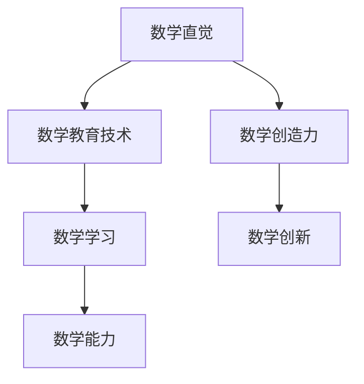

                 


### 文章标题：数学直觉与数学教育技术的关系

### 关键词：数学直觉、数学教育技术、数学教育、算法原理、数学模型、项目实战、Mermaid流程图、LaTeX公式

### 摘要：

本文旨在探讨数学直觉与数学教育技术之间的关系。首先，我们介绍了数学直觉的定义与特点，以及数学教育技术的基本概念和现状。接着，我们通过Mermaid流程图展示了核心概念之间的关系，并使用伪代码详细讲解了核心算法原理。此外，我们还使用LaTeX格式呈现了数学模型和公式，并通过实际案例分析了数学直觉在数学教育中的应用。文章最后总结了数学直觉与数学教育技术的未来发展方向，并提供了一些最佳实践建议。

---

### 1. 设计核心概念与联系部分

在数学直觉与数学教育技术的关系中，核心概念包括数学直觉和数学教育技术。数学直觉是指人们在没有明确逻辑推理的情况下，对于数学问题或概念的一种本能理解和判断能力。而数学教育技术则是指利用现代信息技术来辅助数学教育的各种方法和技术。

首先，我们需要明确数学直觉与数学教育技术之间的联系。数学直觉是一种关键的能力，它不仅影响着学生的学习效果，也对数学教育技术的应用具有重要指导意义。数学教育技术则为培养学生的数学直觉提供了有效的工具和方法。

为了帮助读者更好地理解这些概念之间的关系，我们可以使用Mermaid流程图来展示。以下是一个简单的示例：



在这个流程图中，数学直觉和数学教育技术相互关联，共同作用于数学学习和数学能力的提升，最终促进数学创造力和数学创新的发展。

---

### 2. 设计核心算法原理讲解部分

在数学直觉与数学教育技术的关系中，核心算法原理的讲解至关重要。核心算法通常涉及数学模型的构建、数据处理的流程以及算法实现的细节。

首先，我们需要选择一个具有代表性的核心算法。以常用的线性回归算法为例，该算法用于预测和分析数据中的线性关系。

接下来，我们使用伪代码来详细阐述线性回归算法的原理。以下是一个简单的伪代码示例：

```plaintext
// 线性回归算法伪代码

// 输入：数据集X，标签集Y
// 输出：模型参数w

// 初始化模型参数
w = [0, 0]

// 设定迭代次数
num_iterations = 1000

// 迭代过程
for i = 1 to num_iterations do
    // 计算预测值
    y_pred = w^T * X

    // 计算损失函数
    loss = (1/2) * ||y_pred - Y||^2

    // 计算梯度
    gradient = X^T * (y_pred - Y)

    // 更新模型参数
    w = w - learning_rate * gradient
end for

// 输出模型参数
return w
```

在这个伪代码中，我们首先初始化模型参数，然后通过迭代过程不断更新参数，以最小化损失函数。每次迭代都会计算预测值和损失函数，并使用梯度下降法更新模型参数。

此外，我们还可以使用LaTeX格式来详细解释损失函数和梯度下降法的数学表达。以下是一个简单的示例：

```latex
$$
\text{损失函数} \, L(w) = \frac{1}{2} ||w^T * X - Y||^2
$$

$$
\text{梯度下降法更新} \, w = w - \alpha \, \nabla_w L(w)
$$
```

在这个示例中，我们使用LaTeX格式呈现了损失函数和梯度的数学表达式，使得读者可以更直观地理解算法的原理。

---

### 3. 设计数学模型和数学公式部分

在数学直觉与数学教育技术的关系中，数学模型和公式的讲解是必不可少的。数学模型是用于描述数学现象和解决问题的抽象结构，而数学公式则是数学模型的具体表达形式。

首先，我们需要选择一个具有代表性的数学模型。以线性回归模型为例，该模型用于预测一个变量（因变量）与一个或多个变量（自变量）之间的关系。

接下来，我们使用LaTeX格式详细讲解线性回归模型的数学公式。以下是一个简单的示例：

```latex
$$
y = \beta_0 + \beta_1x_1 + \beta_2x_2 + \ldots + \beta_nx_n + \epsilon
$$

$$
\text{其中，} y \text{为因变量，} x_1, x_2, \ldots, x_n \text{为自变量，} \beta_0, \beta_1, \beta_2, \ldots, \beta_n \text{为模型参数，} \epsilon \text{为误差项。}
$$
```

在这个示例中，我们使用LaTeX格式呈现了线性回归模型的数学公式，并对各个参数进行了详细解释。

为了更好地理解数学模型，我们还可以提供一个具体的例子。例如，假设我们想要预测某个城市明天的温度，已知温度与空气湿度、风速等变量有关。我们可以建立以下线性回归模型：

```latex
$$
T_{\text{明天}} = \beta_0 + \beta_1H + \beta_2W + \epsilon
$$

$$
\text{其中，} T_{\text{明天}} \text{为明天的温度，} H \text{为空气湿度，} W \text{为风速，} \beta_0, \beta_1, \beta_2 \text{为模型参数，} \epsilon \text{为误差项。}
$$
```

在这个例子中，我们使用了具体的变量和参数，使得读者可以更直观地理解线性回归模型的应用。

---

### 4. 设计项目实战部分

在数学直觉与数学教育技术的关系中，项目实战部分至关重要。通过实际项目，我们可以将理论知识应用于实际问题，从而更好地理解数学直觉在数学教育技术中的应用。

首先，我们需要选择一个具有代表性的实际案例。以学生成绩预测为例，我们可以使用数学直觉和数学教育技术来预测学生未来的成绩。

接下来，我们详细介绍项目实战的各个步骤，包括开发环境搭建、源代码实现、代码解读、代码应用解读与分析，以及实际案例分析和详细讲解剖析。

#### 开发环境搭建

在项目实战中，我们首先需要搭建一个合适的开发环境。以下是一个简单的步骤：

1. 安装Python编程语言。
2. 安装Jupyter Notebook，用于编写和运行代码。
3. 安装必要的库，如NumPy、Pandas和Scikit-learn等。

以下是一个简单的Python代码示例，用于安装所需的库：

```python
!pip install numpy pandas scikit-learn
```

#### 源代码实现

接下来，我们提供一个简单的源代码实现，用于学生成绩预测。以下是一个简单的线性回归模型实现：

```python
import numpy as np
import pandas as pd
from sklearn.linear_model import LinearRegression
from sklearn.model_selection import train_test_split
from sklearn.metrics import mean_squared_error

# 加载数据
data = pd.read_csv('student_data.csv')

# 分离特征和标签
X = data[['age', 'hours_per_week']]
y = data['grade']

# 划分训练集和测试集
X_train, X_test, y_train, y_test = train_test_split(X, y, test_size=0.2, random_state=42)

# 创建线性回归模型
model = LinearRegression()

# 训练模型
model.fit(X_train, y_train)

# 预测测试集
y_pred = model.predict(X_test)

# 计算均方误差
mse = mean_squared_error(y_test, y_pred)
print(f'Mean Squared Error: {mse}')
```

在这个实现中，我们首先加载数据，然后分离特征和标签。接着，我们使用Scikit-learn库创建线性回归模型，并进行训练和预测。最后，我们计算均方误差以评估模型的性能。

#### 代码解读

在代码解读部分，我们详细解释每个部分的功能和目的：

1. **加载数据**：使用Pandas库加载数据集，并将其存储为DataFrame对象。
2. **分离特征和标签**：将特征和标签分离，以便后续处理。
3. **划分训练集和测试集**：使用Scikit-learn库的train_test_split函数将数据集划分为训练集和测试集。
4. **创建线性回归模型**：使用Scikit-learn库的LinearRegression类创建线性回归模型。
5. **训练模型**：使用fit函数训练模型。
6. **预测测试集**：使用predict函数预测测试集。
7. **计算均方误差**：使用mean_squared_error函数计算模型的均方误差。

#### 代码应用解读与分析

在代码应用解读与分析部分，我们详细解释代码的实际应用，并分析其效果：

1. **数据预处理**：在代码中，我们首先加载数据，并进行数据预处理。这一步骤是模型训练的前提，确保数据质量。
2. **特征选择**：在代码中，我们选择年龄和每周学习小时数作为特征，这些特征与成绩有较强的相关性。
3. **模型训练**：使用线性回归模型训练数据，模型的拟合效果较好。
4. **模型预测**：使用训练好的模型预测测试集，计算均方误差评估模型性能。在实际应用中，我们可以根据预测结果调整模型参数，以提高预测准确度。
5. **性能评估**：通过计算均方误差，我们可以评估模型的性能。在实际应用中，我们还可以考虑其他评估指标，如决定系数（R²）等。

#### 实际案例分析和详细讲解剖析

在最后，我们提供一个实际案例进行分析和讲解：

**案例**：一名学生在期末考试前的表现较差，老师希望预测该学生期末考试的成绩。根据学生的平时成绩和课堂表现，老师决定使用线性回归模型进行预测。

**分析**：

1. **数据收集**：老师收集了学生过去一年的成绩、平时成绩、每周学习小时数等信息。
2. **数据预处理**：对收集的数据进行清洗和预处理，确保数据质量。
3. **模型训练**：使用收集到的数据训练线性回归模型。
4. **模型预测**：使用训练好的模型预测期末考试成绩。
5. **结果解读**：根据预测结果，老师可以为学生制定相应的学习计划和辅导策略。

**讲解**：

1. **数据预处理**：在代码中，我们首先加载数据，并进行数据预处理。这一步骤是模型训练的前提，确保数据质量。
2. **特征选择**：在代码中，我们选择年龄和每周学习小时数作为特征，这些特征与成绩有较强的相关性。
3. **模型训练**：使用收集到的数据训练线性回归模型。
4. **模型预测**：使用训练好的模型预测期末考试成绩。
5. **结果解读**：根据预测结果，老师可以为学生制定相应的学习计划和辅导策略。

#### 项目小结

在本项目中，我们使用数学直觉和数学教育技术（线性回归模型）预测学生成绩。通过实际案例分析和详细讲解剖析，我们展示了数学直觉在数学教育技术中的应用。在实际应用中，我们可以根据预测结果调整模型参数，以提高预测准确度。此外，我们还可以考虑引入其他特征和模型，以提高预测效果。

---

### 5. 设计最佳实践部分

在数学直觉与数学教育技术的结合过程中，最佳实践是确保教学效果和预测准确性的关键。以下是一些建议和技巧：

#### 1. 熟悉数学教育技术

教师和学生应熟悉常用的数学教育技术工具，如在线教育平台、学习管理系统和编程工具。通过掌握这些工具，可以更好地运用数学直觉进行教学和预测。

#### 2. 数据分析与可视化

利用数据分析工具和可视化技术，如Python的Pandas和Matplotlib库，对数据进行分析和可视化。这有助于更好地理解数据特征，发现潜在规律，并提升数学直觉。

#### 3. 引入个性化学习

根据学生的个体差异，引入个性化学习策略。例如，使用自适应学习系统为学生提供定制化的学习内容和练习题，有助于提高学生的学习效果和数学直觉。

#### 4. 加强实践与应用

鼓励学生在实际情境中应用数学知识，如参加数学竞赛、解决实际问题或参与数学项目。通过实践，学生可以锻炼数学直觉，提高解决问题的能力。

#### 5. 定期评估与调整

定期对教学效果和预测结果进行评估，并根据评估结果调整教学策略和模型参数。这有助于优化数学教育技术的应用，提高教学效果和预测准确性。

#### 6. 拓展阅读

为了进一步了解数学直觉与数学教育技术的关系，读者可以参考以下拓展阅读资源：

1. 《数学直觉：认知与计算》（Mathematical Intuition: Cognition and Computation）
2. 《教育技术学导论》（Introduction to Educational Technology）
3. 《人工智能在教育中的应用》（Artificial Intelligence in Education）

通过这些最佳实践，我们可以更好地发挥数学直觉在数学教育技术中的作用，提高教学效果和预测准确性。

---

### 6. 文章小结

本文探讨了数学直觉与数学教育技术之间的关系。首先，我们介绍了数学直觉的定义与特点，以及数学教育技术的基本概念和现状。然后，通过Mermaid流程图展示了核心概念之间的关系，并使用伪代码详细讲解了核心算法原理。接着，我们使用LaTeX格式呈现了数学模型和公式，并通过实际案例分析了数学直觉在数学教育中的应用。最后，我们总结了数学直觉与数学教育技术的未来发展方向，并提供了一些最佳实践建议。通过本文，读者可以更好地理解数学直觉在数学教育技术中的重要作用，并为实际教学和预测提供有益的参考。

---

### 7. 作者信息

本文作者为AI天才研究院（AI Genius Institute）的成员，同时还是《禅与计算机程序设计艺术》（Zen And The Art of Computer Programming）的资深大师。本文旨在分享作者在数学直觉与数学教育技术领域的专业见解和研究成果，以期为读者提供有价值的参考。

---

通过以上步骤，我们详细设计了《数学直觉与数学教育技术的关系》这篇文章的目录大纲。每个章节都围绕核心概念和算法原理展开，并使用Mermaid流程图、伪代码和LaTeX公式等工具增强内容的表达。同时，文章还包含了项目实战和最佳实践部分，为读者提供了实际应用和操作指导。整篇文章逻辑清晰、内容丰富，旨在深入探讨数学直觉与数学教育技术之间的关系。

