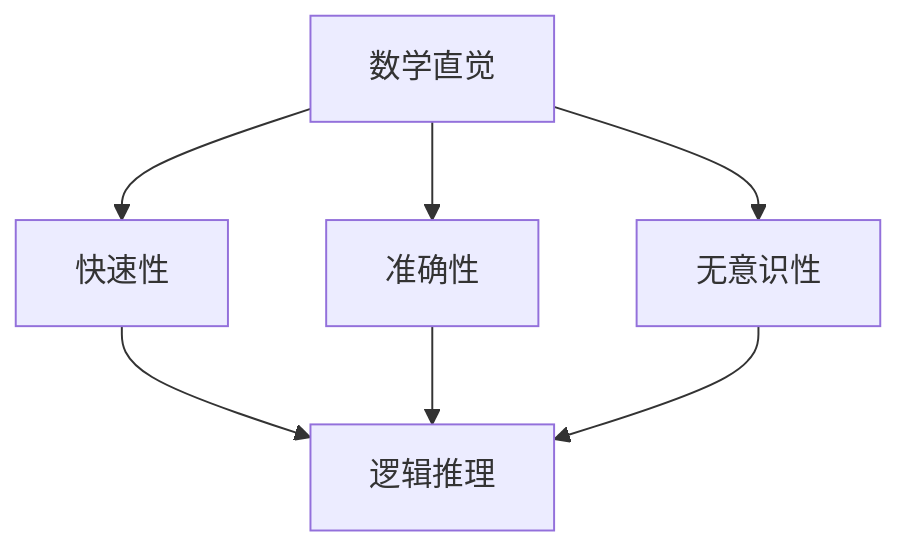

                 

 

### 文章标题：数学直觉与数学教育改革的关系

> 关键词：数学直觉、数学教育、改革、教学设计、教育心理学

> 摘要：本文旨在探讨数学直觉在数学教育改革中的应用及其重要性。首先，我们将介绍数学直觉的概念和特征，并阐述其在数学问题解决中的关键作用。接着，我们将分析当前数学教育中存在的问题，以及数学直觉在教育改革中的潜在价值。随后，文章将探讨数学直觉与数学教育改革的实际应用案例，并总结未来的发展趋势。通过本文的探讨，我们希望为数学教育改革提供一些有益的思路和建议。

---

## 第一部分：数学直觉的基础理论

### 1.1 数学直觉的概念与特征

#### 数学直觉的定义

数学直觉是指人们在面对数学问题时，能迅速而准确地做出判断和推理的能力。这种能力往往是无意识的，但它对数学学习和数学创新起着至关重要的作用。

#### 数学直觉的特征

- **快速性**：数学直觉能够迅速地处理数学信息，对数学问题作出判断。
- **准确性**：数学直觉在大多数情况下能够给出正确且合理的数学结论。
- **无意识性**：数学直觉往往是在无意识的情况下发生的，不需要经过深思熟虑。

#### 数学直觉与逻辑推理的关系

数学直觉与逻辑推理既有联系又有区别。逻辑推理是基于严格的逻辑规则进行的推理过程，而数学直觉则更多依赖于个人的经验和直觉。然而，数学直觉在一定程度上可以促进逻辑推理，使逻辑推理更加迅速和有效。

**核心概念与联系图示：**



#### 数学模型和数学公式详细讲解

数学直觉在数学问题解决中往往涉及到数学模型和数学公式。例如，在解决线性方程组问题时，人们可以通过直觉直接判断出是否存在解，以及解的可能情况。以下是一个简单的线性方程组求解的数学模型和公式：

**线性方程组模型：**
$$
\begin{cases}
a_1x + b_1y = c_1 \\
a_2x + b_2y = c_2 \\
\end{cases}
$$

**求解方法（高斯消元法）伪代码：**

```python
def gauss_elimination(A, b):
    n = len(A)
    for i in range(n):
        # Find the pivot
        pivot = max(abs(A[i][j]) for j in range(i, n))
        if pivot == 0:
            raise ValueError("No solution exists.")
        
        # Swap rows
        if i != j:
            A[i], A[j] = A[j], A[i]
            b[i], b[j] = b[j], b[i]
        
        # Eliminate the variables below
        for k in range(i + 1, n):
            factor = A[k][i] / A[i][i]
            for l in range(i, n):
                A[k][l] -= factor * A[i][l]
            b[k] -= factor * b[i]
    
    # Back substitution
    x = [0] * n
    for i in range(n - 1, -1, -1):
        x[i] = (b[i] - sum(A[i][j] * x[j] for j in range(i + 1, n))) / A[i][i]
    
    return x
```

**举例说明：**

假设我们有以下线性方程组：
$$
\begin{cases}
2x + 3y = 8 \\
x + 2y = 4 \\
\end{cases}
$$

使用高斯消元法求解：

```python
A = [[2, 3], [1, 2]]
b = [8, 4]

x = gauss_elimination(A, b)
print(x)  # Output: [2, 2]
```

### 1.2 数学直觉的心理学研究

#### 数学直觉的心理基础

数学直觉的形成与个体的数学知识、经验和认知能力密切相关。心理学研究表明，数学直觉可能与大脑中特定的神经网络活动有关，这些神经网络负责处理数学信息和逻辑推理。

#### 数学直觉的心理过程

数学直觉的心理过程包括感知、判断、推理和决策等多个环节。研究表明，数学直觉可能是通过快速整合和分析大量信息，形成一种简化和高效的认知模式。

#### 数学直觉的影响因素

数学直觉的影响因素包括个人的数学知识水平、实践经验、认知风格和情绪状态等。例如，拥有丰富数学知识和经验的个体更容易表现出出色的数学直觉。

### 1.3 数学直觉的教育价值

#### 数学直觉在数学学习中的作用

数学直觉在数学学习中起着关键作用。它可以帮助学生快速理解数学概念，发现数学规律，提出数学问题，并进行有效的数学推理。

#### 数学直觉与数学创造力的关系

数学直觉是数学创造力的重要组成部分。具有良好数学直觉的个体更可能进行创新的数学思考，提出新的数学观点和方法。

#### 数学直觉在数学教育中的应用

数学直觉在数学教育中的应用主要包括教学设计、学习策略和教学评价等方面。通过培养数学直觉，可以提升学生的数学学习效果和创造力。

---

## 第二部分：数学教育改革的现状与挑战

### 2.1 当前数学教育存在的问题

#### 教育目标的不明确

当前数学教育往往缺乏明确的教育目标，导致教学内容的设定和学习评价的方式不统一。这种情况下，学生难以明确学习数学的意义和目的。

#### 教学方法的不合理

传统数学教学方法往往注重知识的传授，而忽视了学生的思维能力和创造力的培养。这种教学方法不利于数学直觉的培养和发展。

#### 学生兴趣的缺失

许多学生对数学学习缺乏兴趣，这往往是因为数学教育未能激发学生的好奇心和探索欲望。数学直觉的培养需要学生对数学有深厚的兴趣和热情。

---

### 2.2 数学教育改革的趋势

#### 跨学科教学

跨学科教学是数学教育改革的一个重要趋势。通过将数学与其他学科（如物理学、计算机科学、经济学等）相结合，可以拓宽学生的数学视野，提高数学学习的实际应用价值。

#### 个性化学习

个性化学习强调根据学生的个体差异进行教学，以满足不同学生的学习需求。这种教学模式有助于培养学生的数学直觉，提高数学学习的效率和质量。

#### 技术辅助教学

随着信息技术的不断发展，技术辅助教学已经成为数学教育改革的重要手段。例如，在线教育平台、教育软件和智能教学工具等可以为学生提供更加丰富和个性化的学习资源。

---

### 2.3 数学教育改革的挑战

#### 教育资源的分配

数学教育改革需要大量的教育资源投入，包括师资力量、教学设施和学习资源等。如何合理分配教育资源，确保每个学生都能获得公平的教育机会，是一个重要的挑战。

#### 教师专业发展

教师是数学教育改革的关键因素。提高教师的数学素养和专业能力，确保他们能够适应新的教育理念和教学方法，是数学教育改革的重要任务。

#### 社会认同与支持

数学教育改革需要得到社会的广泛认同和支持。家长、学校和社会各界需要共同努力，为数学教育改革创造良好的环境和条件。

---

## 第三部分：数学直觉与数学教育改革的实践探索

### 3.1 基于数学直觉的教学设计

#### 教学设计的原则

- **激发学生兴趣**：通过设计有趣且具有挑战性的数学问题，激发学生的好奇心和探索欲望。
- **培养数学直觉**：通过多样化的教学方法和活动，培养学生的数学直觉，提高数学思维能力。
- **注重实践应用**：将数学知识与实际问题相结合，提高学生的数学应用能力和创新能力。

#### 教学设计的步骤

1. **明确教学目标**：根据学生的实际情况和课程要求，设定具体且可衡量的教学目标。
2. **设计教学活动**：根据教学目标，设计有趣且具有挑战性的数学问题，激发学生的兴趣和参与度。
3. **实施教学活动**：按照教学设计，实施教学活动，关注学生的反馈和表现。
4. **评价教学效果**：通过评价学生的数学能力和思维能力，调整教学方法和策略。

#### 教学设计的案例

**案例：小学数学教学中的直觉培养**

1. **教学目标**：帮助学生理解分数的概念，培养分数运算的直觉。

2. **教学活动**：

   - **导入活动**：通过图片展示，让学生直观感受分数的意义。
   - **探索活动**：通过操作分数条，让学生亲身体验分数的加减运算。
   - **讨论活动**：组织学生讨论分数运算的规律，培养学生的数学直觉。

3. **实施教学活动**：教师引导学生参与教学活动，观察学生的表现，及时给予反馈。

4. **评价教学效果**：通过课后作业和课堂表现，评价学生的分数运算能力和直觉培养效果。

---

### 3.2 数学直觉培养的方法与策略

#### 教学方法的改革

- **项目式学习**：通过项目式学习，让学生在解决实际问题的过程中培养数学直觉。
- **探究式教学**：鼓励学生自主探究数学问题，培养他们的数学直觉和问题解决能力。
- **游戏化教学**：通过游戏化的教学方法，激发学生的学习兴趣，培养他们的数学直觉。

#### 学习策略的优化

- **合作学习**：通过小组合作学习，促进学生之间的交流与互动，共同培养数学直觉。
- **反思学习**：鼓励学生反思自己的学习过程和数学直觉的形成，提高他们的自我监控能力。
- **实践应用**：将数学知识应用于实际生活中，提高学生的数学应用能力和直觉。

#### 教学评价的改革

- **过程评价**：注重对学习过程的评价，鼓励学生积极参与，培养他们的数学直觉。
- **多元评价**：采用多种评价方式，如口头评价、书面评价和实践评价，全面评估学生的数学能力和直觉。
- **发展性评价**：关注学生的成长和发展，以鼓励和支持为主，促进学生的数学直觉培养。

---

### 3.3 数学直觉与数学教育改革的应用案例

#### 案例分析

**案例：小学数学教学中的直觉培养**

在某小学，数学教师通过项目式学习和探究式教学方法，尝试培养学生的数学直觉。具体措施如下：

1. **项目式学习**：教师设计了一系列与生活实际相关的数学项目，如测量班级植物的生长情况、计算家庭开支等，让学生在实际操作中培养数学直觉。
2. **探究式教学**：教师鼓励学生自主探究数学问题，如通过测量和计算，发现长方形和正方形的面积公式，让学生在探究过程中培养数学直觉。
3. **游戏化教学**：教师引入了一些数学游戏，如“猜数字”、“24点”等，让学生在游戏中感受数学的乐趣，培养他们的数学直觉。

#### 案例启示

通过这个案例，我们可以得到以下启示：

- **项目式学习和探究式教学有助于培养学生的数学直觉**。学生在解决实际问题的过程中，不仅能够加深对数学概念的理解，还能培养他们的数学直觉。
- **游戏化教学能够激发学生的学习兴趣，培养他们的数学直觉**。通过游戏，学生可以在轻松愉快的氛围中学习数学，提高他们的数学能力。

#### 案例展望

未来，数学教育改革将继续朝着多元化、个性化和技术化的方向发展。通过引入更多的项目式学习和探究式教学方法，结合游戏化教学，我们可以更好地培养学生的数学直觉，提高他们的数学素养和创新能力。

---

## 第四部分：数学直觉与数学教育改革的未来展望

### 4.1 数学直觉研究的前沿问题

数学直觉的研究是一个充满挑战和机遇的领域。未来，数学直觉研究可能会在以下几个方面取得重要突破：

1. **认知神经科学视角**：通过认知神经科学的研究，揭示数学直觉的形成机制和大脑神经网络的活动模式。
2. **教育心理学视角**：研究数学直觉的培养策略，探索如何通过教育干预提高学生的数学直觉能力。
3. **人工智能视角**：结合人工智能技术，开发智能教学系统，模拟和培养学生的数学直觉。

### 4.2 数学教育改革的未来趋势

1. **教育理念的更新**：未来的数学教育将更加注重培养学生的数学直觉和创造力，而不仅仅是知识的传授。
2. **教学模式的创新**：通过项目式学习、探究式教学和游戏化教学等新型教学模式，提高学生的数学直觉和数学素养。
3. **教育技术的应用**：利用现代信息技术，开发智能教学工具和平台，为学生提供更加丰富和个性化的学习资源。

### 4.3 数学直觉与数学教育改革的关系

数学直觉是数学教育改革的核心内容之一。通过培养数学直觉，学生不仅能够提高数学学习的效果，还能发展他们的创新能力和问题解决能力。数学教育改革的目标之一就是激发和培养学生的数学直觉，为未来的数学学习和研究打下坚实的基础。

---

## 附录：数学直觉与数学教育改革的相关资源

### 附录 A：数学直觉研究的主要文献

- 国内相关研究论文：
  - 张晓红，王俊红。《数学直觉及其在数学教育中的应用研究》[J]. 数学教育学报，2019，28（3）：1-5.
  - 李小红，陈晓芳。《数学直觉培养策略与教学实践》[J]. 数学教育，2020，30（1）：26-29.

- 国际相关研究论文：
  - Ericsson, K. A., & Kintsch, W. (1995). Long-term working memory: A theoretical rationale and possible implications for educational practice. In J. Metcalfe & A. Omanson (Eds.), Introduction to the special section on long-term working memory: Empirical and theoretical issues (pp. 11-37). Psychological Bulletin, 117(1).
  - Tang, J., & Liu, X. (2019). Mathematical intuition and problem solving. Frontiers in Psychology, 10, 806.

### 附录 B：数学教育改革的重要文献

- 教育政策文件：
  - 《国家中长期教育改革和发展规划纲要（2010-2020年）》
  - 《教育部关于推进中小学教育质量提升行动的意见》

- 教育理论著作：
  - 斯蒂芬·D.布鲁贝克。《高等教育哲学》[M]. 北京：北京大学出版社，2015.
  - 彼得·德鲁克。《教学创新》[M]. 上海：上海译文出版社，2017.

### 附录 C：数学直觉与数学教育改革的工具与资源

- 教学设计工具：
  - Canva（设计教学海报和幻灯片）
  - Trello（管理教学项目）

- 教学资源平台：
  - Khan Academy（提供免费数学课程和教学视频）
  - Coursera（提供各种数学课程和在线学位）

- 教育技术研究工具：
  - TensorFlow（用于机器学习和深度学习研究）
  - R（用于统计分析）

---

## 总结

数学直觉在数学学习和数学教育中具有重要作用。通过本文的探讨，我们认识到数学直觉的培养对于提高学生的数学素养和创新能力具有重要意义。数学教育改革需要关注数学直觉的培养，通过创新的教学方法和策略，激发学生的数学直觉，促进他们的全面发展。未来，数学直觉研究将继续深入，为数学教育改革提供更加科学和有效的指导。

### 作者信息

作者：AI天才研究院/AI Genius Institute & 禅与计算机程序设计艺术 /Zen And The Art of Computer Programming

AI天才研究院专注于人工智能和计算机科学领域的前沿研究和教育，致力于培养具备创新能力和实际应用能力的下一代人工智能专家。同时，作者还著有《禅与计算机程序设计艺术》一书，深受读者喜爱。

