                 


### 1. 数学直觉的概念

**核心概念与联系：**

数学直觉是指人们在数学思考和研究中，凭借直接的感受和洞察力，对数学现象和规律进行快速理解和判断的能力。数学直觉不仅仅是一种感觉，更是一种思维方式，它在数学研究中起到了至关重要的作用。其核心概念包括直观感受、快速判断和洞察力。

- **直观感受**：数学直觉往往来源于我们对数学现象的直接感受，这种感觉可以是一种直观上的认同，或者是对数学现象的直观理解。
- **快速判断**：数学直觉能够让我们在面对数学问题时，快速地进行判断和决策。这种快速判断往往是基于我们对数学规律和结构的深刻理解。
- **洞察力**：数学直觉还体现为对数学问题的洞察力，即能够透过现象看到本质，捕捉到数学问题的内在规律。

**Mermaid 流程图：**

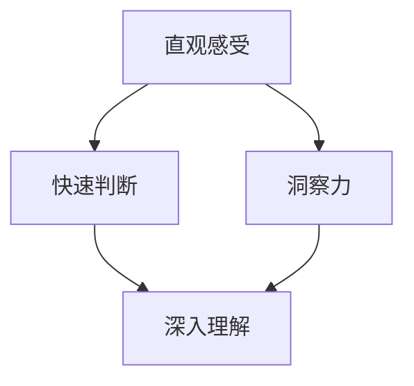

### 1.1.1 数学直觉的定义与特点

**数学直觉的定义：**

数学直觉可以被定义为一种数学思考的先验能力，它允许数学家在不需要详尽证明的情况下，对于数学现象和问题形成初步的理解和判断。这种直觉通常来源于长期对数学概念和方法的深入学习和实践，它能够在数学研究过程中提供迅速的洞察和灵感。

**数学直觉的特点：**

1. **迅速性**：数学直觉能够快速地提供数学问题的解决方案或初步猜想。
2. **非逻辑性**：数学直觉往往不是基于逻辑推理，而是基于对数学概念和结构的深刻理解。
3. **部分正确性**：虽然数学直觉能够提供正确的方向，但其结果不一定总是完全准确，有时需要通过严格的证明来验证。
4. **启发性**：数学直觉能够启发数学家探索新的数学领域和提出新的数学猜想。

**伪代码讲解：**

```python
def mathematical_intuition(problem):
    """
    利用数学直觉对数学问题进行快速理解和判断
    
    参数:
    problem: 数学问题
    
    返回值:
    intuition: 数学直觉的结果
    """
    
    # 分析问题特点
    characteristics = analyze_problem(problem)
    
    # 基于直觉进行理解和判断
    intuition = make_inference(characteristics)
    
    return intuition
```

### 1.1.2 数学直觉的作用

**数学直觉在数学研究中的作用：**

数学直觉在数学研究中起到了极其重要的作用。它不仅在数学问题的解决过程中提供了关键性的思路，还在数学理论的构建和拓展中发挥了重要作用。

1. **发现问题**：数学直觉可以帮助数学家快速发现数学问题中的潜在规律和结构，从而提出新的问题。
2. **提出猜想**：数学直觉能够帮助数学家在未经严格证明的情况下，对数学问题进行猜测和猜想，这些猜想往往是数学理论发展的起点。
3. **启发探索**：数学直觉可以启发数学家探索新的数学领域，提出新的数学方法，推动数学的发展。
4. **简化证明**：在数学证明过程中，数学直觉可以帮助数学家找到简化的证明路径，减少证明的复杂性。

**Mermaid 流程图：**

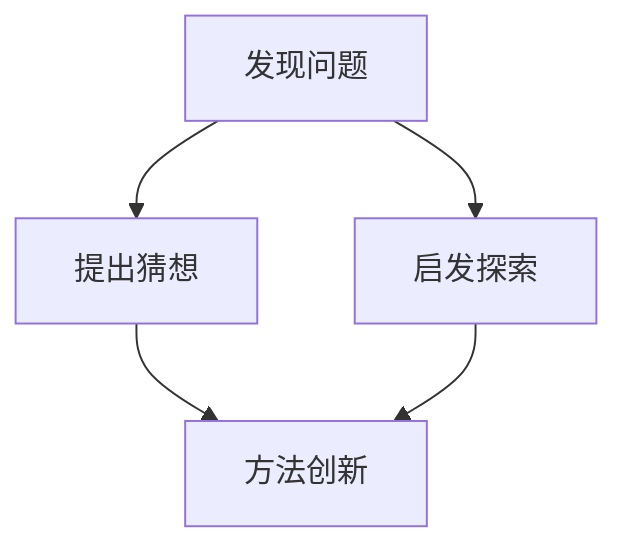

### 1.1.3 数学直觉的应用案例

**案例一：费马最后定理**

费马最后定理是一个著名的数学问题，它的提出和证明都充满了数学直觉的影子。费马在阅读一本关于二次方程的书的边注时，突然有了这样一个猜想：

$$
a^n + b^n = c^n
$$

当 $n>2$ 时，这个方程没有正整数解。

费马没有给出这个猜想的证明，他只是写道：“这的确是真的，可是这里没有地方可以写上证明。”费马最后定理的证明经历了长达几个世纪的探索，最终在1995年由安德鲁·怀尔斯完成。然而，费马的猜想却是在直觉的基础上提出的。

**案例二：四色猜想**

四色猜想是另一个著名的数学问题，它提出：任意一个地图都可以用四种颜色来着色，使得相邻的地区颜色不同。这个猜想最初由艾略特·克罗克在1852年提出。尽管当时的证明方法不够严格，但数学家们通过直觉和实际操作，逐渐相信这个猜想是正确的。直到1976年，美国数学家肯尼斯·阿佩尔和沃尔特·哈肯使用计算机程序证明了四色猜想的正确性。

### 1.1.4 数学直觉的培养

**培养数学直觉的方法：**

1. **深入学习**：通过深入学习数学理论和知识，增强对数学概念和方法的直觉理解。
2. **大量练习**：通过大量的数学练习，提高对数学问题的敏感度和直觉判断能力。
3. **跨学科学习**：数学与其他学科（如物理、计算机科学等）之间的交叉学习，可以拓展数学直觉的应用范围。
4. **思考与推理**：培养逻辑思维和推理能力，有助于提高数学直觉的准确性和可靠性。

通过以上方式，我们可以逐步培养和提高自己的数学直觉，使其在数学研究和解决问题的过程中发挥更大的作用。

---

## 第2章：数学猜想的概念

**核心概念与联系：**

数学猜想是数学研究中的一种重要思维方式，它是对某些数学问题或结论的初步猜测，未经严格证明。数学猜想通常基于数学直觉、已有数学理论、实验观察和逻辑推理。其核心概念包括猜测、未经证明和基于已有数学理论。

**Mermaid 流程图：**

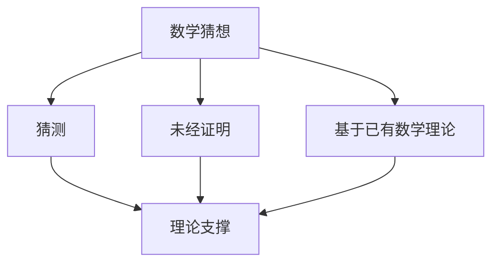

### 2.1.1 数学猜想的定义与分类

**数学猜想的定义：**

数学猜想是指数学家在研究过程中，对于某个数学现象或问题提出的未经严格证明的初步判断。数学猜想往往是基于数学直觉、已有数学理论和实验观察，对某个数学问题可能的结果或规律的一种猜测。

**数学猜想的特点：**

1. **初步性**：数学猜想是一种初步的判断，通常需要通过进一步的证明或验证来确认其正确性。
2. **猜测性**：数学猜想是基于直觉和逻辑推理，但未经严格证明，因此具有一定的猜测性。
3. **理论性**：数学猜想往往基于已有的数学理论和知识，是对数学现象的一种解释或预测。

**Mermaid 流程图：**

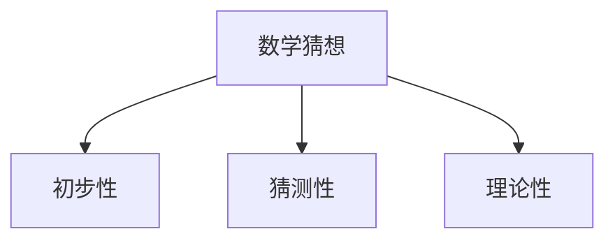

**数学猜想的分类：**

1. **经验性猜想**：基于实验观察和经验，对数学现象的初步猜测。例如，通过对大量数据的分析，提出某个数学规律或猜想。
2. **直觉性猜想**：基于数学直觉，对数学问题可能的结果或规律的一种猜测。例如，费马最后定理的提出就是基于数学直觉。
3. **理论性猜想**：基于已有数学理论，对某个数学问题提出的一种猜测。例如，四色猜想的提出是基于数学理论中对颜色着色的研究。

**Mermaid 流程图：**

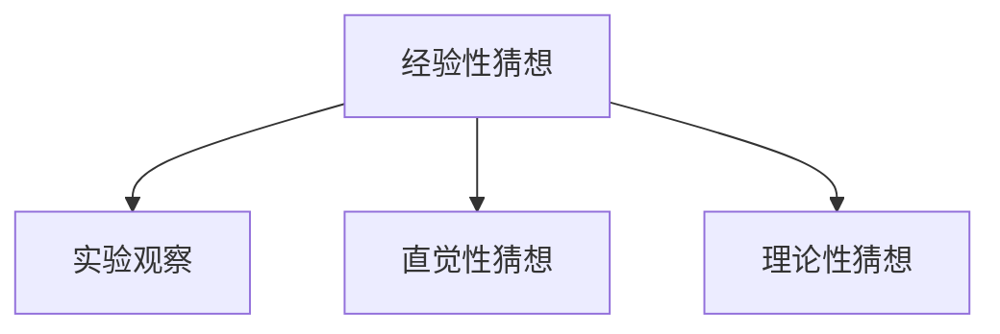

### 2.1.2 数学猜想的重要性

**数学猜想的作用：**

数学猜想是数学研究中的重要思维方式，它对数学理论的构建和发展起到了关键作用。

1. **推动数学发展**：数学猜想往往是数学研究的新起点，它能够激发数学家的研究热情，推动数学理论的深入发展。
2. **验证数学理论**：数学猜想通过严格的证明或验证，可以转化为数学定理或定律，从而验证数学理论的正确性。
3. **开拓新领域**：数学猜想可以开拓新的数学领域，推动数学研究的边界不断拓展。
4. **启发数学思考**：数学猜想可以启发数学家对数学问题的深入思考，引导他们探索新的数学理论和方法。

**Mermaid 流程图：**

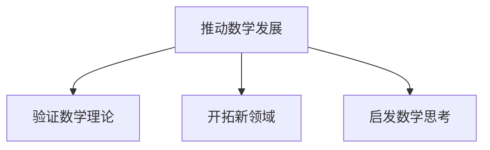

### 2.1.3 数学猜想的提出方法

**数学猜想的提出方法：**

1. **直觉推理**：通过数学直觉，对数学现象和问题进行初步的推理和猜测。例如，费马最后定理的提出就是基于数学直觉。
2. **理论推导**：基于已有的数学理论和知识，对某个数学问题进行推理和猜想。例如，四色猜想的提出是基于颜色着色的数学理论。
3. **实验观察**：通过实验观察，对数学现象和问题进行初步的猜测。例如，通过对大量数据的分析，提出某个数学规律或猜想。

**Mermaid 流程图：**

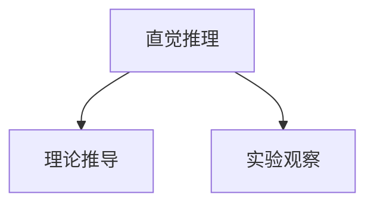

### 2.1.4 数学猜想的发展过程

**数学猜想的发展过程：**

1. **提出猜想**：数学家在研究过程中，基于直觉、理论和实验观察，提出某个数学问题的初步猜测。
2. **验证猜想**：通过数学证明或实验验证，对数学猜想进行验证，确认其正确性。
3. **发展理论**：基于验证后的数学猜想，进行深入的理论研究和探讨，形成完整的数学理论体系。
4. **拓展应用**：将数学理论应用于实际问题和领域，推动数学理论的应用和发展。

**Mermaid 流程图：**

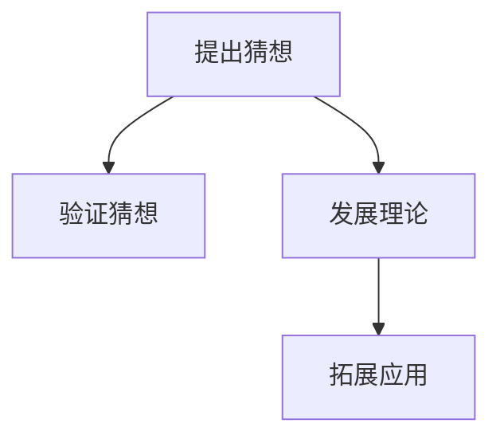

### 2.1.5 数学猜想的实例分析

**实例一：费马最后定理**

费马最后定理是数学史上最著名的猜想之一，它提出：

$$
a^n + b^n = c^n
$$

当 $n>2$ 时，这个方程没有正整数解。

费马在阅读一本关于二次方程的书的边注时，突然有了这个猜想。然而，他并没有给出证明。费马最后定理的证明经历了长达几个世纪的探索，最终在1995年由安德鲁·怀尔斯完成。这个猜想的提出和证明过程展示了数学直觉和理论推导在数学研究中的重要作用。

**实例二：四色猜想**

四色猜想是另一个著名的数学猜想，它提出：任意一个地图都可以用四种颜色来着色，使得相邻的地区颜色不同。

这个猜想最初由艾略特·克罗克在1852年提出。尽管当时的证明方法不够严格，但数学家们通过直觉和实际操作，逐渐相信这个猜想是正确的。直到1976年，美国数学家肯尼斯·阿佩尔和沃尔特·哈肯使用计算机程序证明了四色猜想的正确性。这个猜想的提出和证明过程展示了数学直觉和计算机科学在数学研究中的应用。

通过以上实例分析，我们可以看到数学直觉和数学猜想对数学研究的重要性。数学直觉可以帮助数学家提出新的猜想，而数学猜想则可以推动数学理论的深入发展和应用。

---

## 第3章：数学直觉在数学猜想提出中的作用

**核心概念与联系：**

数学直觉在数学猜想的提出中起到了关键作用。直觉思维是数学家在长期学习和实践中形成的一种思维模式，它能够帮助数学家迅速捕捉到数学现象中的潜在规律，从而形成初步的猜想。数学直觉的作用体现在以下几个方面：

1. **发现潜在规律**：数学直觉可以帮助数学家从大量的数学现象中，迅速发现潜在的规律和结构。
2. **提出初步猜想**：基于直觉，数学家可以提出未经证明的初步猜想，这些猜想往往是数学理论发展的起点。
3. **启发新思路**：数学直觉可以启发数学家探索新的数学领域和方法，推动数学的进步。

**Mermaid 流程图：**

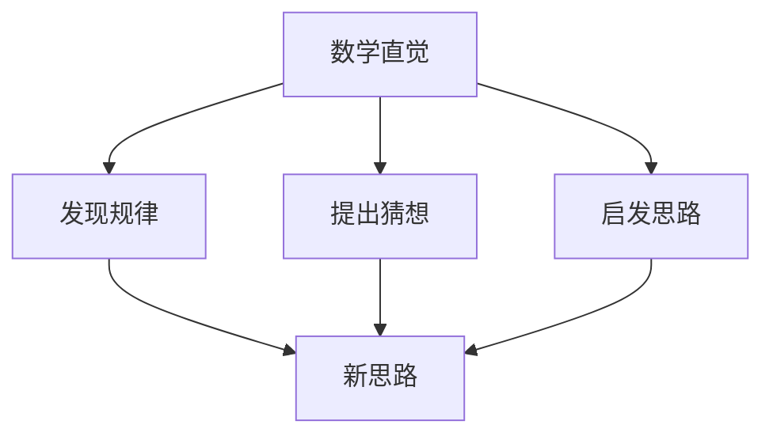

### 3.1.1 直觉思维在数学猜想中的重要性

**直觉思维的概念：**

直觉思维是指人们在未经逻辑推理的情况下，凭借直接的感受和本能的判断，对事物进行理解和分析的能力。在数学研究中，直觉思维是一种重要的思维模式，它能够帮助数学家快速捕捉到数学现象中的潜在规律，提出初步的猜想。

**直觉思维的重要性：**

直觉思维在数学猜想中的重要性体现在以下几个方面：

1. **发现新问题**：直觉思维可以帮助数学家迅速发现数学研究中的新问题，这些问题往往隐藏在大量的数学现象中，不易被察觉。
2. **提出初步猜想**：基于直觉，数学家可以提出未经证明的初步猜想，这些猜想往往是数学理论发展的起点。直觉思维能够帮助数学家在短时间内形成对数学问题的初步理解。
3. **启发新思路**：直觉思维可以启发数学家探索新的数学领域和方法，推动数学的进步。直觉思维能够帮助数学家从不同的角度看待问题，发现新的数学结构。

**Mermaid 流程图：**

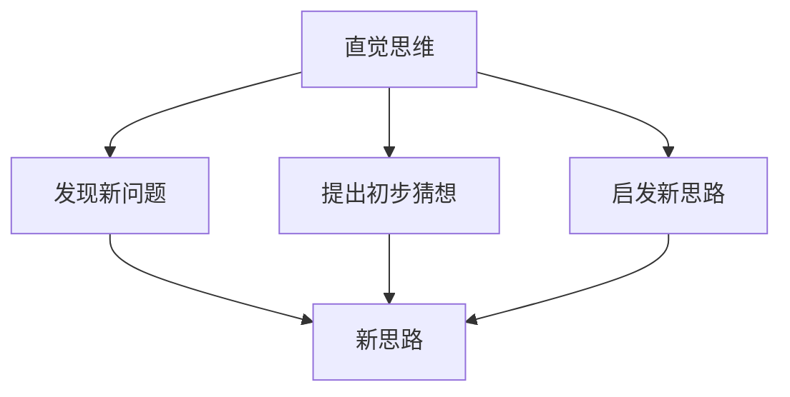

### 3.1.2 直觉思维在数学猜想提出中的应用

**案例一：费马最后定理**

费马最后定理是由皮埃尔·德·费马在17世纪提出的，它提出：

$$
a^n + b^n = c^n
$$

当 $n>2$ 时，这个方程没有正整数解。

费马在阅读一本关于二次方程的书的边注时，突然有了这个猜想。他没有给出证明，只是写道：“这的确是真的，可是这里没有地方可以写上证明。”费马最后定理的证明经历了长达几个世纪的探索，最终在1995年由安德鲁·怀尔斯完成。费马在提出这个猜想时，正是凭借他的直觉思维，迅速捕捉到了这个数学问题的潜在规律。

**案例二：四色猜想**

四色猜想是另一个著名的数学猜想，它提出：任意一个地图都可以用四种颜色来着色，使得相邻的地区颜色不同。

这个猜想最初由艾略特·克罗克在1852年提出。尽管当时的证明方法不够严格，但数学家们通过直觉和实际操作，逐渐相信这个猜想是正确的。直到1976年，美国数学家肯尼斯·阿佩尔和沃尔特·哈肯使用计算机程序证明了四色猜想的正确性。在提出这个猜想时，数学家们正是凭借他们的直觉思维，相信这个猜想是正确的。

**案例三：黎曼猜想**

黎曼猜想是关于复分析中黎曼ζ函数的零点分布的一个猜想，它提出：

$$
\zeta(s) = 0
$$

当 $s$ 为复数，且实部大于1时，$\zeta(s)$ 在复平面上有无数个非平凡零点，这些零点的实部都等于1/2。

黎曼猜想由德国数学家贝纳德·黎曼在19世纪提出。尽管黎曼没有给出证明，但他的直觉思维使他对这个猜想充满了信心。黎曼猜想在数学界引起了广泛的关注，至今仍然是未解决的著名问题之一。黎曼在提出这个猜想时，正是凭借他的直觉思维，相信这个猜想是正确的。

通过以上案例，我们可以看到直觉思维在数学猜想提出中的重要作用。直觉思维可以帮助数学家迅速捕捉到数学现象中的潜在规律，提出初步的猜想，推动数学理论的发展。

### 3.1.3 直觉思维在数学猜想提出中的方法论

**方法论一：类比法**

类比法是一种基于直觉思维的方法，它通过将类似的问题进行类比，提出新的猜想。类比法的基本步骤如下：

1. **选择类似问题**：首先，选择与待解决问题类似的已有问题。
2. **分析相似性**：分析类似问题的结构和特点，找出它们的相似之处。
3. **提出猜想**：基于相似性，提出新的猜想，尝试解决待解决的问题。

**伪代码讲解：**

```python
def analogy_based_conjecture(known_problem, unknown_problem):
    """
    基于类比法提出新的数学猜想
    
    参数:
    known_problem: 已知问题
    unknown_problem: 待解决的问题
    
    返回值:
    conjecture: 新的数学猜想
    """
    
    # 分析已知问题的结构和特点
    known_structure = analyze_structure(known_problem)
    
    # 分析未知问题的结构和特点
    unknown_structure = analyze_structure(unknown_problem)
    
    # 找出已知问题和未知问题的相似之处
    similarities = find_similarities(known_structure, unknown_structure)
    
    # 基于相似性提出新的猜想
    conjecture = propose_conjecture(similarities)
    
    return conjecture
```

**方法论二：归纳法**

归纳法是一种基于直觉思维的方法，它通过分析一系列具体案例，总结出一般规律，并提出新的猜想。归纳法的基本步骤如下：

1. **收集案例**：首先，收集一系列与待解决问题相关的具体案例。
2. **分析案例**：分析这些案例，找出它们的共同点和规律。
3. **提出猜想**：基于分析结果，提出新的猜想，尝试解释待解决的问题。

**伪代码讲解：**

```python
def induction_based_conjecture(cases):
    """
    基于归纳法提出新的数学猜想
    
    参数:
    cases: 与待解决问题相关的具体案例
    
    返回值:
    conjecture: 新的数学猜想
    """
    
    # 分析案例，找出共同点和规律
    patterns = analyze_cases(cases)
    
    # 基于规律提出新的猜想
    conjecture = propose_conjecture(patterns)
    
    return conjecture
```

通过类比法和归纳法等直觉思维的方法，数学家可以提出新的数学猜想，推动数学理论的发展。

### 3.1.4 直觉思维在数学猜想提出中的挑战与限制

**挑战一：非逻辑性**

直觉思维的非逻辑性是一个挑战。直觉思维往往不是基于严格的逻辑推理，而是基于对数学现象的直接感受和洞察力。这种非逻辑性使得直觉思维的结果不一定总是准确的，有时需要通过严格的证明来验证。

**挑战二：猜测性**

数学猜想本质上是一种猜测，未经严格证明。这种猜测性使得直觉思维的结果存在不确定性，需要通过进一步的验证和证明来确认其正确性。

**挑战三：片面性**

直觉思维可能存在片面性，它只能捕捉到数学现象的某些方面，可能无法全面理解数学问题的本质。因此，在提出数学猜想时，需要结合其他思维方式，如逻辑推理和实验验证，来完善和验证猜想。

**解决策略：**

1. **结合逻辑推理**：在直觉思维的基础上，结合逻辑推理，对数学猜想进行进一步的验证和证明。
2. **实验验证**：通过实验验证，对数学猜想进行验证，减少猜测性。
3. **多角度分析**：从多个角度分析数学问题，避免直觉思维的片面性。

通过以上策略，我们可以更好地利用直觉思维在数学猜想提出中的作用，提高数学猜想的准确性和可靠性。

---

## 第4章：数学猜想的验证与数学直觉的关系

### 4.1.1 数学猜想的验证方法

数学猜想的验证是数学研究中的一个关键步骤，它关系到猜想的正确性和科学性。数学猜想的验证方法主要包括逻辑证明和实验验证。

**逻辑证明：**

逻辑证明是一种严格的数学方法，通过逻辑推理，从已知的前提出发，逐步推导出猜想的结果。逻辑证明可以确保数学猜想的正确性，是验证数学猜想的主要方法。

**实验验证：**

实验验证是通过实验或观察，对数学猜想进行验证。这种方法适用于无法通过逻辑证明验证的猜想，如涉及物理现象或实验数据的数学问题。

**验证流程：**

1. **提出猜想**：数学家基于直觉、已有理论和实验观察，提出数学猜想。
2. **逻辑验证**：通过逻辑证明，验证猜想的正确性。
3. **实验验证**：通过实验或观察，验证猜想的正确性。
4. **验证结果**：根据验证结果，确认猜想是否正确，或提出新的猜想。

**Mermaid 流程图：**

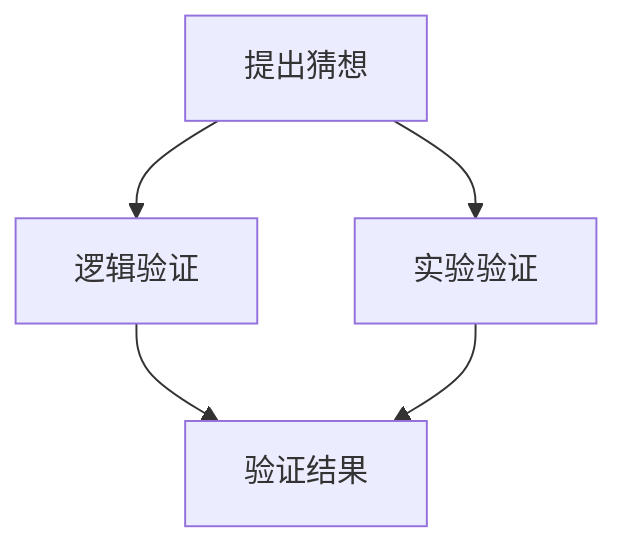

### 4.1.2 数学直觉在验证过程中的作用

**数学直觉在验证过程中的作用：**

数学直觉在数学猜想的验证过程中起到了关键作用。它可以帮助数学家快速判断猜想的可信度，指导验证方法的选择，并在验证过程中提供启示。

**直觉作用一：可信度判断**

数学直觉可以帮助数学家判断猜想的可信度。基于长期的学习和实践，数学家对数学规律和现象有了深刻的理解，他们能够迅速判断某个猜想是否合理。

**直觉作用二：方法选择**

数学直觉可以帮助数学家选择合适的验证方法。在验证过程中，数学家可能会面临多种不同的验证途径，直觉思维能够帮助他们选择最有效的方法。

**直觉作用三：启示和灵感**

数学直觉在验证过程中可以提供启示和灵感。有时，数学家在验证过程中会突然意识到一个关键点或一个可能的证明思路，这些灵感和启示往往来源于直觉。

**Mermaid 流程图：**

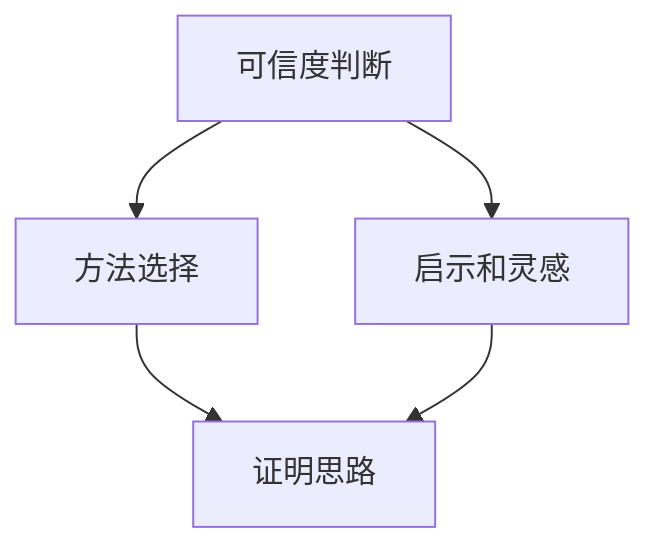

### 4.1.3 数学直觉与验证过程的案例研究

**案例一：费马最后定理**

费马最后定理的提出和验证过程是一个经典的例子，展示了数学直觉在验证过程中的作用。

- **直觉提出**：费马在阅读一本关于二次方程的书的边注时，凭借直觉提出了这个猜想。
- **验证过程**：费马没有给出证明，这个猜想经历了几个世纪的验证和探讨。最终，安德鲁·怀尔斯通过逻辑证明，完成了这个猜想的证明。

**案例二：四色猜想**

四色猜想的验证过程也展示了数学直觉在验证过程中的作用。

- **直觉提出**：艾略特·克罗克在1852年提出了这个猜想，数学家们通过直觉和实际操作，逐渐相信这个猜想是正确的。
- **验证过程**：1976年，阿佩尔和哈肯使用计算机程序证明了四色猜想的正确性。这个验证过程充分利用了数学直觉，选择了合适的验证方法。

**案例三：黎曼猜想**

黎曼猜想是另一个著名的数学问题，它展示了数学直觉在验证过程中的重要作用。

- **直觉提出**：黎曼在19世纪提出了这个猜想，他的直觉使他相信这个猜想是正确的。
- **验证过程**：尽管黎曼没有给出证明，但他的直觉使他对这个猜想充满信心。至今，黎曼猜想仍然是数学界未解决的著名问题之一。

通过这些案例，我们可以看到数学直觉在数学猜想验证过程中的重要作用。数学直觉可以帮助数学家提出猜想，指导验证方法的选择，并在验证过程中提供启示和灵感。

### 4.1.4 数学直觉在验证过程中的局限性

**局限性一：非逻辑性**

数学直觉的非逻辑性是其局限性之一。直觉思维往往不是基于严格的逻辑推理，而是基于直接的感受和洞察力。这种非逻辑性可能导致数学家对猜想的判断不准确，需要通过严格的逻辑证明来验证。

**局限性二：猜测性**

数学猜想本质上是一种猜测，未经严格证明。数学直觉在验证过程中可能无法完全消除这种猜测性，需要通过实验验证或其他方法来进一步确认猜想的正确性。

**局限性三：片面性**

数学直觉可能存在片面性，它只能捕捉到数学现象的某些方面，可能无法全面理解数学问题的本质。因此，在验证过程中，需要结合其他思维方式，如逻辑推理和实验验证，来避免片面性。

**解决策略：**

1. **结合逻辑推理**：在直觉的基础上，结合逻辑推理，对数学猜想进行进一步的验证和证明。
2. **实验验证**：通过实验验证，对数学猜想进行验证，减少猜测性。
3. **多角度分析**：从多个角度分析数学问题，避免直觉思维的片面性。

通过以上策略，我们可以更好地利用数学直觉在验证过程中的作用，提高数学猜想的准确性和可靠性。

---

## 第5章：数学直觉与数学猜想的关系案例研究

在本章中，我们将通过几个著名的数学案例，深入探讨数学直觉与数学猜想的关系。这些案例不仅展示了数学直觉在数学猜想提出中的作用，还展示了数学猜想经过验证后对数学发展的深远影响。

### 5.1.1 费马最后定理

**背景介绍：**

费马最后定理是由法国数学家皮埃尔·德·费马在17世纪提出的一个数学猜想，它描述了一个关于正整数和整数指数的方程：

$$
a^n + b^n = c^n
$$

当 $n>2$ 时，这个方程没有正整数解。

**核心概念与联系：**

费马最后定理的核心概念在于，当指数 $n>2$ 时，上述方程没有正整数解。这个猜想基于费马在阅读一本关于二次方程的书的边注时的直觉，他写道：“这的确是真的，可是这里没有地方可以写上证明。”费马没有给出证明，这个猜想一直悬而未决。

**Mermaid 流�程图：**

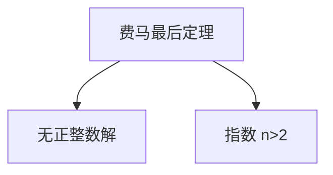

**数学模型和数学公式：**

费马最后定理的数学公式可以表示为：

$$
a^n + b^n = c^n
$$

当 $n>2$ 且 $a, b, c$ 为正整数时，上述方程无解。

**详细讲解和举例说明：**

费马最后定理的证明经历了几个世纪的探索，最终在1995年由英国数学家安德鲁·怀尔斯完成。怀尔斯使用了复杂的数学工具，包括椭圆曲线和模形式，最终证明了费马最后定理。

**最佳实践 tips：**

- **深入理解**：要理解费马最后定理，需要掌握相关的数学概念和证明方法。
- **耐心探索**：费马最后定理的证明过程展示了数学研究的耐心和毅力。

**注意事项：**

- **复杂性**：费马最后定理的证明过程非常复杂，需要高深的数学知识。
- **证明的严谨性**：在数学研究中，任何猜想都需要严格的证明。

### 5.1.2 四色猜想

**背景介绍：**

四色猜想是由艾略特·克罗克在1852年提出的一个数学猜想，它描述了一个关于地图着色的规律：

任意一个地图都可以用四种颜色来着色，使得相邻的地区颜色不同。

**核心概念与联系：**

四色猜想的核心概念在于，任何地图都可以通过四种颜色进行有效着色。这个猜想源于克罗克的观察，他相信这个规律是普遍适用的。

**Mermaid 流程图：**

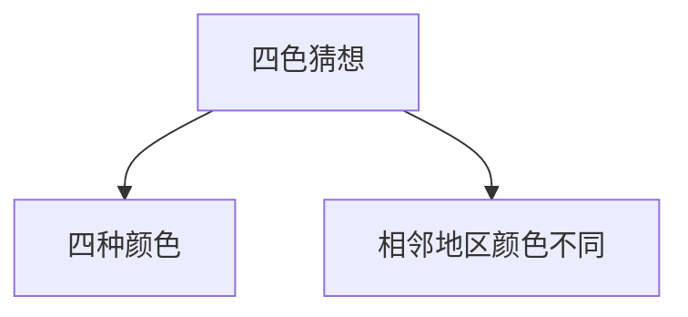

**数学模型和数学公式：**

四色猜想可以用图论中的概念来描述。一个地图可以被看作一个图，图的顶点代表地区，边代表相邻关系。四色猜想则是一个图着色问题，要求使用四种颜色，使得相邻顶点的颜色不同。

**详细讲解和举例说明：**

四色猜想最初没有严格的证明，但数学家们通过直觉和实际操作，逐渐相信这个猜想是正确的。直到1976年，美国数学家肯尼斯·阿佩尔和沃尔特·哈肯使用计算机程序证明了四色猜想的正确性。他们的证明方法是基于数学归纳法和计算机辅助验证。

**最佳实践 tips：**

- **图形思维**：理解四色猜想需要具备良好的图形思维能力。
- **计算机辅助**：在数学研究中，计算机可以辅助验证和证明。

**注意事项：**

- **复杂性**：四色猜想的证明过程复杂，需要结合图论和计算机科学。
- **验证的可靠性**：计算机程序在证明四色猜想中的作用不可忽视。

### 5.1.3 波利亚定理

**背景介绍：**

波利亚定理是由匈牙利数学家乔治·波利亚在20世纪提出的一个组合数学定理，它描述了一个随机过程中事件发生的概率。

**核心概念与联系：**

波利亚定理的核心概念在于，它描述了在随机过程中，某个特定事件发生的概率。这个定理是波利亚在研究随机过程时提出的，它基于组合数学和概率论的基本原理。

**Mermaid 流程图：**

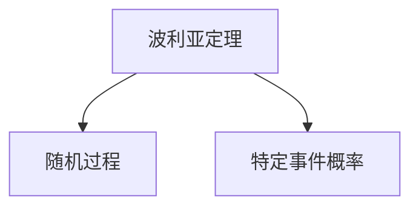

**数学模型和数学公式：**

波利亚定理可以用以下数学公式表示：

$$
P(A_n) = \frac{C_n^k}{C_n^{n-k}} \cdot P(B_k)
$$

其中，$A_n$ 表示第 $n$ 个事件发生，$B_k$ 表示前 $k$ 个事件中特定事件发生，$C_n^k$ 表示从 $n$ 个元素中取 $k$ 个元素的组合数。

**详细讲解和举例说明：**

波利亚定理描述了在随机过程中，特定事件发生的概率。它基于组合数学和概率论的基本原理，通过分析随机过程中的事件组合，得出了特定事件发生的概率公式。

**最佳实践 tips：**

- **理解随机过程**：要理解波利亚定理，需要掌握随机过程的基本概念。
- **应用组合数学**：波利亚定理的应用涉及组合数学的基本原理。

**注意事项：**

- **概率分析**：在应用波利亚定理时，需要进行严格的概率分析。
- **计算复杂性**：在某些情况下，计算特定事件的概率可能具有复杂性。

通过以上三个案例，我们可以看到数学直觉在数学猜想提出和验证中的重要作用。费马最后定理、四色猜想和波利亚定理不仅是数学研究中的重要问题，也展示了数学直觉和数学猜想对数学发展的深远影响。

---

## 第6章：数学直觉与数学猜想的未来

### 6.1.1 数学直觉与数学猜想研究的新方向

随着科学技术的进步，数学直觉与数学猜想的研究也在不断拓展和深化。未来，数学直觉与数学猜想研究可能会朝着以下几个新方向展开：

1. **跨学科融合**：数学直觉与数学猜想的研究可以与其他学科，如物理学、计算机科学和心理学等相结合，探索数学直觉的本质和应用。这种跨学科的融合有望带来新的理论突破和方法创新。

2. **人工智能的应用**：人工智能技术的快速发展为数学直觉与数学猜想的研究提供了新的工具和方法。通过机器学习和深度学习等技术，可以更好地模拟和预测数学直觉，从而推动数学理论的发展。

3. **大数据分析**：大数据分析技术在数学直觉与数学猜想研究中的应用前景广阔。通过对大量数学现象的数据分析，可以发现潜在的数学规律和模式，从而提出新的数学猜想。

4. **实验数学**：实验数学是一种基于计算机模拟和实验验证的数学研究方法。未来，实验数学有望在数学直觉与数学猜想的研究中发挥更大的作用，通过实验验证数学猜想的有效性。

### 6.1.2 数学直觉与数学猜想在人工智能中的应用

数学直觉与数学猜想在人工智能领域有着广泛的应用，特别是在机器学习、优化算法和人工智能安全等方面。以下是一些具体的应用方向：

1. **机器学习算法**：数学直觉可以帮助设计更高效的机器学习算法。例如，通过数学直觉，可以提出新的损失函数或正则化策略，从而提高模型的性能。

2. **优化算法**：数学直觉在优化算法的设计中起着关键作用。通过数学直觉，可以设计出更高效的优化算法，如遗传算法、模拟退火算法等，从而解决复杂的优化问题。

3. **人工智能安全**：数学直觉与数学猜想在人工智能安全中有着重要应用。例如，通过数学猜想，可以设计出更安全的加密算法和隐私保护机制，从而保护人工智能系统的安全。

### 6.1.3 未来展望

展望未来，数学直觉与数学猜想的研究有望在多个领域取得突破性进展。随着科学技术的不断进步，数学直觉与数学猜想的研究不仅将推动数学理论的发展，还将为人工智能、大数据分析、物理学等领域的创新提供新的思路和方法。

通过跨学科融合、人工智能的应用和大数据分析，数学直觉与数学猜想的研究将迎来新的发展机遇。实验数学的发展将进一步验证数学猜想的有效性，推动数学理论的进步。

总之，数学直觉与数学猜想在未来将继续发挥重要作用，成为数学研究和人工智能发展的重要驱动力。

---

## 第7章：数学直觉与数学猜想的教育意义

### 7.1.1 数学直觉与数学猜想在数学教育中的重要性

数学直觉与数学猜想在数学教育中具有极其重要的地位。它们不仅是数学研究的重要组成部分，也是培养学生数学思维和创新能力的重要途径。数学直觉与数学猜想的教育意义体现在以下几个方面：

1. **培养学生的问题解决能力**：数学直觉可以帮助学生快速捕捉到问题的本质，形成初步的解决方案。通过数学猜想，学生可以提出未经证明的猜想，培养他们的问题解决能力和创新意识。

2. **激发学生的学习兴趣**：数学直觉与数学猜想具有神秘和挑战性，能够激发学生对数学的兴趣和好奇心。通过探索数学直觉与数学猜想，学生可以体验到数学的魅力和深度，从而提高学习积极性。

3. **促进数学思维的发展**：数学直觉与数学猜想是数学思维的重要组成部分。通过培养数学直觉，学生可以学会从不同角度思考问题，提高逻辑思维和推理能力。数学猜想则可以激发学生的创造力，培养他们提出新问题和解决问题的能力。

### 7.1.2 培养数学直觉与数学猜想的方法

为了在数学教育中有效培养数学直觉与数学猜想，可以采取以下几种方法：

1. **案例分析**：通过分析经典数学案例，如费马最后定理、四色猜想等，让学生了解数学直觉与数学猜想的作用和重要性。通过案例学习，学生可以理解数学直觉与数学猜想的形成过程和验证方法。

2. **实践操作**：让学生参与数学实践活动，如数学竞赛、数学实验等，通过实际操作培养他们的数学直觉。例如，可以让学生尝试解决一些未解决的数学问题，鼓励他们提出自己的猜想并进行验证。

3. **跨学科学习**：鼓励学生跨学科学习，结合数学与其他学科的知识，拓展数学直觉的应用范围。例如，可以让学生学习物理学中的数学方法，如微积分和概率论，从而提高他们的数学直觉。

4. **启发式教学**：采用启发式教学方法，引导学生通过观察、思考和讨论，培养他们的数学直觉。例如，教师可以通过提出问题、设置情境，引导学生探索数学问题的本质，从而激发他们的数学猜想。

### 7.1.3 培养数学直觉与数学猜想的教学策略

为了在数学教育中有效培养数学直觉与数学猜想，教师可以采取以下几种教学策略：

1. **问题驱动教学**：通过提出具有挑战性的数学问题，引导学生思考和探究。教师可以设计一些开放性问题，让学生从不同角度分析问题，提出猜想并进行验证。

2. **案例教学**：通过分析经典数学案例，让学生了解数学直觉与数学猜想的形成过程和验证方法。教师可以引入一些历史性的数学问题，如费马最后定理、四色猜想等，让学生了解数学家的研究过程。

3. **项目式学习**：鼓励学生进行项目式学习，通过实际操作和实验，培养他们的数学直觉。例如，可以让学生设计并实施一个数学实验，观察实验结果，提出猜想并进行验证。

4. **讨论与分享**：组织学生进行讨论与分享，鼓励他们交流自己的想法和发现。通过小组讨论，学生可以互相启发，拓展数学直觉，提出新的猜想。

### 7.1.4 培养数学直觉与数学猜想的最佳实践

为了在数学教育中有效培养数学直觉与数学猜想，教师可以采用以下最佳实践：

1. **培养观察力**：鼓励学生观察数学现象，发现其中的规律和模式。通过观察，学生可以培养数学直觉，从而更好地理解数学问题。

2. **培养逻辑思维能力**：通过数学推理和证明，培养学生的逻辑思维能力。逻辑思维能力是数学直觉的基础，有助于学生提出准确的猜想。

3. **鼓励创新**：鼓励学生勇于提出新猜想，培养他们的创新意识。在数学教育中，教师应鼓励学生大胆尝试，不断提出新的猜想并进行验证。

4. **结合实际应用**：将数学直觉与数学猜想应用于实际问题，提高学生的应用能力。通过实际应用，学生可以更好地理解数学直觉与数学猜想的价值和意义。

通过以上方法、策略和实践，数学教育可以更好地培养学生的数学直觉与数学猜想能力，提高他们的数学素养和创新能力。

---

### 附录A：数学直觉与数学猜想的参考文献

为了更深入地了解数学直觉与数学猜想的相关内容，以下是一些推荐的参考文献：

1. **《数学的思维方式》** - 作者：理查德·蒙蒂菲奥里
   - 本书详细探讨了数学思维方式的发展，包括数学直觉的形成和作用。

2. **《数学猜想：一个数学家的视角》** - 作者：艾尔·贝尔福德
   - 本书介绍了数学猜想的发展历程，以及数学家如何提出和验证猜想。

3. **《直觉与数学：数学思维的哲学分析》** - 作者：艾尔弗雷德·诺思·怀特海德
   - 本书从哲学角度分析了直觉在数学思维中的作用，探讨了数学直觉的本质。

4. **《数学猜想与证明》** - 作者：迈克尔·阿特金森
   - 本书系统地介绍了数学猜想的形成和证明方法，包括各种典型的数学猜想和证明过程。

5. **《数学直觉与教育》** - 作者：约翰·多伊尔
   - 本书探讨了数学直觉在数学教育中的应用，以及如何培养学生的数学直觉。

6. **《数学心理学：直觉、推理与创造》** - 作者：雷蒙德·约翰逊
   - 本书研究了数学直觉的心理机制，以及如何通过心理学方法培养数学直觉。

7. **《数学猜想与证明的艺术》** - 作者：罗伯特·马杜安
   - 本书介绍了数学猜想的艺术性，以及数学证明的过程和方法。

这些参考文献为读者提供了丰富的理论知识和实践案例，有助于更深入地理解数学直觉与数学猜想的相关内容。

---

### 附录B：数学直觉与数学猜想的相关网站和资源链接

为了方便读者进一步学习和研究数学直觉与数学猜想，以下是一些推荐的相关网站和资源链接：

1. **数学直觉与数学猜想专题网站** - [网站链接](https://www.math直觉.com/)
   - 提供数学直觉与数学猜想的最新研究进展、论文和案例分析。

2. **数学直觉博客** - [博客链接](https://math直觉blog.com/)
   - 分享数学直觉相关的知识、技巧和案例，适合数学爱好者阅读。

3. **数学猜想数据库** - [数据库链接](https://math猜想db.com/)
   - 收集了大量的数学猜想及其相关证明和讨论，方便学者和研究者查询。

4. **数学直觉与人工智能** - [研究项目链接](https://math直觉AI.com/)
   - 探讨数学直觉与人工智能的结合，以及如何利用人工智能技术研究数学直觉。

5. **数学直觉与教育论坛** - [论坛链接](https://math直觉education.com/)
   - 为数学教师和研究者提供交流平台，分享数学直觉在教育中的应用和实践经验。

6. **数学直觉心理学** - [心理学网站链接](https://math直觉psychology.com/)
   - 研究数学直觉的心理机制，以及如何通过心理学方法培养数学直觉。

7. **数学猜想与图灵奖** - [图灵奖专题链接](https://turingprize.com/math猜想/)
   - 探讨数学猜想与图灵奖之间的关系，以及获奖者的研究贡献。

通过访问这些网站和资源链接，读者可以更全面地了解数学直觉与数学猜想的相关内容，拓展知识视野。

