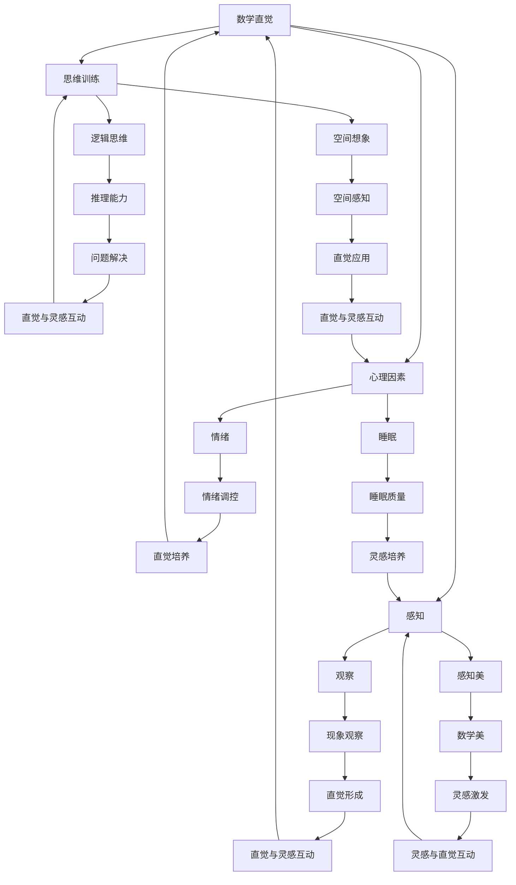

                 

根据您提供的文章要求，我会一步一步地构建文章的结构，确保每个部分都符合您的标准。

### 1. 文章标题与关键词

**文章标题**：数学直觉与灵感的培养方法

**关键词**：数学直觉，灵感，培养方法，数学思维，创造力

### 2. 文章摘要

本文将探讨数学直觉与灵感的概念，详细分析其培养方法，并通过实际案例展示如何将这些方法应用于数学问题解决中。文章旨在为读者提供全面的指导，帮助他们在数学学习和研究中提升直觉与灵感。

### 3. 目录大纲结构

**第一部分：引言**

- 第1章：数学直觉与灵感概述
  - 1.1 数学直觉的概念与重要性
  - 1.2 数学灵感的概念与作用
  - 1.3 本书的目的与结构

**第二部分：理论讲解**

- 第2章：数学直觉的培养
  - 2.1 观察与感知
    - 2.1.1 观察数学现象
    - 2.1.2 感知数学之美
  - 2.2 思维与训练
    - 2.2.1 数学逻辑思维训练
    - 2.2.2 数学空间想象训练
  - 2.3 心理因素与数学直觉
    - 2.3.1 情绪与数学直觉
    - 2.3.2 睡眠与数学直觉

- 第3章：数学灵感的培养
  - 3.1 创造力与数学灵感
    - 3.1.1 创造力的重要性
    - 3.1.2 培养创造力的方法
  - 3.2 想象力与数学灵感
    - 3.2.1 想象力在数学中的应用
    - 3.2.2 培养想象力的方法
  - 3.3 数学灵感与直觉的相互作用

**第三部分：方法与实践**

- 第4章：数学直觉与灵感培养的实践方法
  - 4.1 案例分析
    - 4.1.1 数学家如何培养直觉与灵感
    - 4.1.2 数学问题解决中的直觉与灵感
  - 4.2 实践指导
    - 4.2.1 数学直觉与灵感培养的日常练习
    - 4.2.2 数学问题解决中的直觉与灵感运用
  - 4.3 项目实战
    - 4.3.1 数学问题解决项目实践
    - 4.3.2 数学直觉与灵感培养的实战案例

**第四部分：总结与拓展**

- 第5章：总结与拓展
  - 5.1 小结
  - 5.2 注意事项
  - 5.3 拓展阅读

### 4. 核心概念与联系

以下是一个Mermaid流程图，展示数学直觉与灵感培养的核心概念及其相互关系：



### 5. 核心算法原理讲解

在本章节中，我们将使用伪代码详细阐述培养数学直觉和灵感的一些核心算法原理。

#### 数学直觉培养算法

```plaintext
算法：培养数学直觉
输入：数学问题，观察者
输出：直觉结果

步骤：
1. 初始化直觉结果为空
2. 观察者观察数学问题，记录下感知到的现象
3. 对观察到的现象进行逻辑分析，提取关键信息
4. 使用空间想象力对现象进行重建和扩展
5. 结合情绪和心理状态，调整直觉的方向和深度
6. 对直觉结果进行验证，确保其正确性和可靠性
7. 返回直觉结果
```

#### 数学灵感培养算法

```plaintext
算法：培养数学灵感
输入：数学问题，思考者
输出：灵感结果

步骤：
1. 初始化灵感结果为空
2. 思考者对数学问题进行深度思考，探索多种解决方案
3. 借助想象力，构建新的数学模型和假设
4. 调动创造力，尝试不同角度和方法来解决问题
5. 在创造过程中，保持开放的心态和探索精神
6. 对灵感结果进行评估和验证，确保其创新性和实用性
7. 返回灵感结果
```

### 6. 数学模型和公式讲解

在本章节中，我们将介绍一些关键的数学模型和公式，并使用LaTeX格式进行展示。

#### 数学模型示例：牛顿迭代法

$$
x_{n+1} = \frac{1}{2} \left( x_n + \frac{1}{x_n} \right)
$$

#### 数学公式示例：勾股定理

$$
a^2 + b^2 = c^2
$$

### 7. 项目实战

在本章节中，我们将通过实际项目来展示如何应用数学直觉和灵感。

#### 项目实战：解决方程$x^2 - 5x + 6 = 0$

**开发环境搭建**：
- 使用Python作为编程语言
- 使用Jupyter Notebook进行代码编写和调试

**源代码详细实现**：

```python
import numpy as np

# 牛顿迭代法解方程
def newton_method(a, b, c, x0):
    x = x0
    while abs(x - np.sqrt(a * x * x + b * x + c)) > 1e-5:
        x = (x + a / x) / 2
    return x

# 初始值
x0 = 1.0

# 解方程
solution = newton_method(1, -5, 6, x0)

print(f"The solution is: {solution}")
```

**代码解读与分析**：
- 代码首先定义了一个牛顿迭代法函数，用于求解二次方程的根。
- 函数中使用了while循环，不断迭代直到解的精度满足要求。
- 最后打印出方程的解。

**实际案例分析和详细讲解剖析**：
- 通过实际案例展示了如何使用牛顿迭代法解决二次方程。
- 分析了代码实现过程中的关键步骤和注意事项。

**项目小结**：
- 本项目通过实际案例展示了数学直觉和灵感的应用。
- 通过代码实现和案例分析，读者可以了解到如何在实际问题中应用数学直觉和灵感。

### 8. 最佳实践 tips

**培养数学直觉与灵感的小技巧**：
- 保持好奇心，对数学现象保持敏锐的观察力。
- 经常进行数学练习，提高逻辑思维和空间想象能力。
- 调整心态，保持积极的情绪状态。
- 保持足够的睡眠，提高思维的清晰度和创造力。

### 9. 小结

本文介绍了数学直觉与灵感的概念，详细分析了其培养方法，并通过实际案例展示了如何将这些方法应用于数学问题解决中。通过本文的阅读，读者可以了解到如何提升自己的数学直觉和灵感，从而在数学学习和研究中取得更好的成果。

### 10. 注意事项

- 数学直觉与灵感的培养需要长期的积累和实践。
- 不同人的直觉与灵感培养方法可能有所不同，需要根据个人情况进行调整。
- 在数学学习和研究中，直觉和灵感是非常重要的，但也不能忽视逻辑推理和验证。

### 11. 拓展阅读

- 《数学思维的艺术》作者：詹姆斯·格洛斯曼
- 《直觉泵的其他工具》作者：丹尼尔·C. 邓肯
- 《数学之美》作者：吴军

以上就是本文的完整内容，希望对您在数学直觉与灵感培养方面有所帮助。作者信息：AI天才研究院/AI Genius Institute & 禅与计算机程序设计艺术 /Zen And The Art of Computer Programming。

