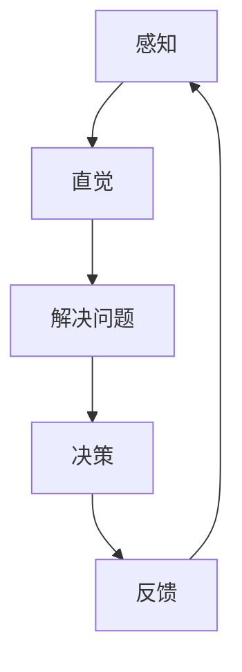
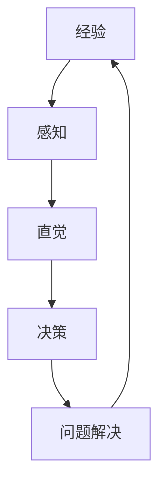
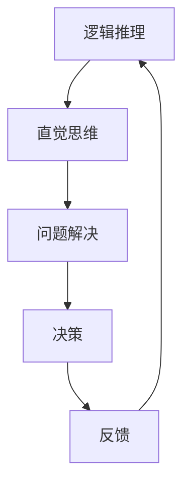
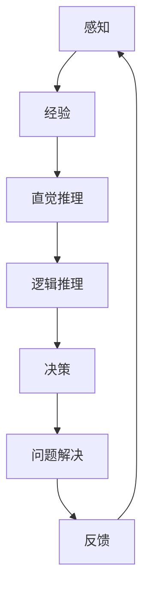
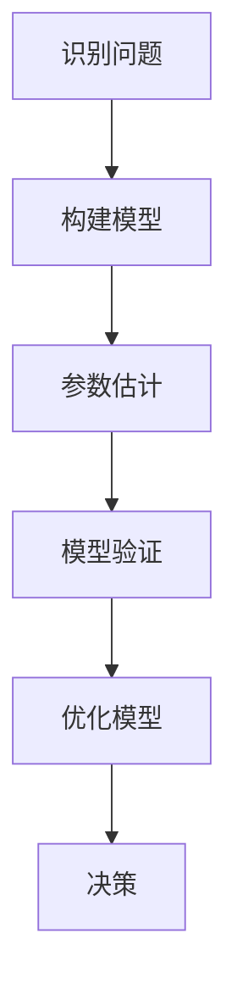

                 


## 第1章：直觉思维概述

### 1.1 直觉思维的定义与特点

直觉思维是一种非线性的、跳跃性的思维方式，它不同于传统的逻辑思维。在直觉思维中，个体能够快速地理解复杂问题，并找到解决方案，而不需要通过逐步推理和验证。直觉思维具有以下几个特点：

- **快速性**：直觉思维能够在短时间内处理大量信息，迅速做出判断。
- **非线性**：直觉思维不是按照固定的步骤进行，而是通过跳跃性思维快速联系不同概念。
- **模糊性**：直觉思维处理的信息往往是模糊的，不精确的。
- **创造性**：直觉思维能够产生新的想法，发现新的联系。

### 1.1.1 直觉思维的含义

直觉思维（Intuitive Thinking）是指人们在没有经过明确逻辑推理的情况下，直接对问题进行理解和解决的能力。这种思维方式依赖于个人的经验、知识、感知以及非理性的直觉。

### 1.1.2 直觉思维的特点

1. **快速性**：直觉思维能够快速地处理信息，减少思考时间。
2. **非线性**：直觉思维不是线性的逻辑推理，而是通过联想和跳跃性思维解决问题。
3. **模糊性**：直觉思维处理的信息往往是模糊的、不精确的。
4. **创造性**：直觉思维能够产生新的想法，发现新的联系。

### 1.1.3 直觉思维与逻辑思维的关系

直觉思维与逻辑思维（Logical Thinking）是两种不同的思维方式。逻辑思维是基于规则和公理，通过推理和验证来解决问题。而直觉思维则是基于经验、感知和直觉，快速地对问题进行理解和解决。

尽管直觉思维和逻辑思维有所不同，但它们在解决问题时往往是相辅相成的。在复杂的决策过程中，直觉思维可以帮助人们快速地筛选信息，而逻辑思维则可以对这些信息进行深入分析和验证。

### 1.2 直觉思维的重要性

直觉思维在数学中的应用是非常广泛的。许多数学问题的解决，尤其是在解决复杂问题时，直觉思维起着至关重要的作用。

#### 1.2.1 直觉思维在数学中的应用

直觉思维在数学中的应用主要体现在以下几个方面：

1. **数学猜想**：许多数学猜想都是通过直觉思维得出的。例如，费马大定理的猜想就是基于直觉思维。
2. **数学证明**：在某些数学证明中，直觉思维可以帮助数学家找到证明的思路。
3. **数学问题解决**：直觉思维可以帮助数学家快速地解决复杂的数学问题。

#### 1.2.2 直觉思维的优势

直觉思维的优势在于：

1. **快速性**：直觉思维能够在短时间内处理大量信息，迅速做出判断。
2. **创造性**：直觉思维能够产生新的想法，发现新的联系。
3. **适应性**：直觉思维能够适应不同的情境和问题，快速地找到解决方案。

#### 1.2.3 直觉思维的教育意义

直觉思维在数学教育中具有重要意义。通过培养学生的直觉思维能力，可以帮助他们：

1. **提高解决问题的能力**：直觉思维能够帮助学生快速地解决复杂的数学问题。
2. **培养创造性思维**：直觉思维能够激发学生的创造力，帮助他们发现新的数学问题。
3. **提高学习兴趣**：直觉思维能够使数学学习变得更加有趣和富有挑战性。

### 1.3 直觉思维的历史与发展

直觉思维的历史可以追溯到古代。许多古代数学家都是依靠直觉思维来解决问题。例如，古希腊数学家欧几里得就善于使用直觉思维来证明几何定理。

在近现代，直觉思维的研究得到了进一步的深入。许多数学家和研究学者开始系统地研究直觉思维，并提出了一系列的理论和方法。

目前，直觉思维的研究已经成为认知心理学、人工智能等领域的一个重要研究方向。研究者们致力于探索直觉思维的本质和机制，以及如何有效地培养和利用直觉思维。

### 1.3.1 古代数学家的直觉思维

在古代，直觉思维在数学中得到了广泛的应用。许多古代数学家都是通过直觉思维来发现和证明数学定理的。例如，中国古代的数学家刘徽就是通过直觉思维提出了“割圆术”来计算圆周率。

### 1.3.2 近现代数学家的直觉思维

在近现代，直觉思维在数学研究中仍然扮演着重要的角色。许多数学家都是通过直觉思维来发现新的数学理论和解决问题的。例如，德国数学家高斯就是通过直觉思维发现了高斯消去法，这种方法在数值计算中有着广泛的应用。

### 1.3.3 直觉思维的研究现状

目前，直觉思维的研究已经成为认知心理学、人工智能等领域的一个重要研究方向。研究者们致力于探索直觉思维的本质和机制，以及如何有效地培养和利用直觉思维。

在数学教育领域，直觉思维的培养也受到越来越多的关注。许多教育学者开始研究如何在教学中培养学生的直觉思维能力，以便提高他们的数学素养和创新能力。

## 第2章：直觉思维的核心概念与联系

### 2.1 直觉思维的核心概念

直觉思维的核心概念包括直觉、感知和经验。这些概念之间有着密切的联系，共同构成了直觉思维的基础。

#### 2.1.1 直觉与感知

直觉（Intuition）是基于感知（Perception）的非理性认知过程。感知是人们对外界信息的直接反应，是直觉思维的基础。直觉则是在感知的基础上，通过快速联想和综合，形成对问题的直观理解。

直觉和感知之间的关系可以用以下Mermaid流程图表示：



#### 2.1.2 直觉与经验

直觉不仅仅是基于感知，还与经验（Experience）密切相关。经验是人们在实践中积累的知识和技能，是直觉思维的重要来源。直觉往往是通过经验和感知的结合，形成对问题的快速判断和解决。

直觉与经验之间的关系可以用以下Mermaid流程图表示：



#### 2.1.3 直觉与逻辑推理

直觉思维和逻辑推理（Logical Reasoning）是两种不同的思维方式。逻辑推理是基于规则和公理的理性思考，而直觉思维则是基于感知和经验的非理性思考。

直觉思维和逻辑推理之间的关系可以用以下Mermaid流程图表示：



### 2.2 直觉思维的 Mermaid 流程图

直觉思维是一个动态的过程，它涉及到多个环节的相互作用。以下是一个简化的Mermaid流程图，描述了直觉思维的主要环节：



### 2.3 直觉思维与数学原理的联系

直觉思维在数学中有着广泛的应用，尤其是在数学证明和问题解决中。直觉思维可以帮助数学家快速地发现数学定理，并提出证明。

#### 2.3.1 直觉思维在数学证明中的应用

直觉思维在数学证明中起着至关重要的作用。许多数学证明都是基于直觉思维的。例如，数学家欧拉在证明欧拉公式（Euler's Formula）时，就是通过直觉思维找到了关键的思路。

直觉思维在数学证明中的应用可以用以下伪代码表示：

```python
def prove_euler_formula():
    # 使用直觉思维找到证明思路
    intuition = find_intuition()
    # 使用直觉思维进行证明
    proof = intuitive_proof(intuition)
    # 验证证明结果
    if validate_proof(proof):
        print("证明成功")
    else:
        print("证明失败")
```

#### 2.3.2 直觉思维在数学问题解决中的应用

直觉思维在解决复杂的数学问题时同样重要。许多数学难题的解决都是通过直觉思维实现的。例如，数学家拉马努金在解决一些复杂的数学问题时，就是依靠直觉思维找到了答案。

直觉思维在数学问题解决中的应用可以用以下伪代码表示：

```python
def solve_math_problem(problem):
    # 使用直觉思维寻找解决方案
    intuition = find_intuition(problem)
    # 尝试解决方案
    solution = try_solution(intuition)
    # 验证解决方案
    if validate_solution(solution, problem):
        print("问题解决")
    else:
        print("问题未解决")
```

#### 2.3.3 直觉思维在数学理论发展中的作用

直觉思维在数学理论的发展中起着至关重要的作用。许多数学理论的提出和发展都是基于直觉思维的。例如，数学家希尔伯特在提出希尔伯特空间的概念时，就是依靠直觉思维看到了这一理论的潜在价值。

直觉思维在数学理论发展中的应用可以用以下伪代码表示：

```python
def develop_math_theory():
    # 使用直觉思维提出新理论
    intuition = propose_new_theory()
    # 使用直觉思维发展理论
    development = develop_theory(intuition)
    # 验证理论的有效性
    if validate_theory(development):
        print("理论发展成功")
    else:
        print("理论发展失败")
```

## 第3章：直觉思维的核心算法原理讲解

### 3.1 直觉思维算法概述

直觉思维算法是一种模拟人类直觉思维的算法，它能够快速地处理信息，并做出判断。直觉思维算法的核心思想是通过模拟人类直觉思维的某些特性，如联想、跳跃性思维等，来实现高效的信息处理和问题解决。

### 3.1.1 直觉思维算法的定义

直觉思维算法（Intuitive Thinking Algorithm）是一种模拟人类直觉思维的算法，它能够快速地处理信息，并做出判断。该算法基于人类直觉思维的某些特性，如联想、跳跃性思维等，来模拟人类解决问题的过程。

### 3.1.2 直觉思维算法的分类

直觉思维算法可以根据不同的特性进行分类。常见的分类方法包括：

1. **基于规则的直觉思维算法**：这种算法通过定义一系列规则来模拟人类的直觉思维。例如，在解决某些数学问题时，可以通过定义一些简单的规则来模拟数学家的直觉思维。

2. **基于模式的直觉思维算法**：这种算法通过识别模式来模拟人类的直觉思维。例如，在图像识别中，可以通过识别图像中的模式来模拟人类的直觉。

3. **基于模拟的直觉思维算法**：这种算法通过模拟人类大脑的工作方式来模拟人类的直觉思维。例如，通过模拟神经元之间的连接和活动，来模拟人类的直觉思维过程。

### 3.2 直觉思维算法的伪代码讲解

以下是一个简单的直觉思维算法的伪代码，用于解决一个简单的数学问题。

```python
def intuitive_algorithm(problem):
    # 初始化问题
    initial_state = initialize_problem(problem)
    # 设置目标状态
    goal_state = define_goal(problem)
    # 开始搜索
    while not is_goal_state(goal_state):
        # 使用直觉思维进行判断
        intuition = use_intuition(initial_state, goal_state)
        # 根据直觉进行下一步操作
        next_state = apply_intuition(intuition, initial_state)
        # 更新当前状态
        initial_state = next_state
    # 找到解决方案
    solution = find_solution(initial_state)
    return solution
```

在这个算法中，`initialize_problem` 用于初始化问题，`define_goal` 用于定义目标状态，`is_goal_state` 用于判断当前状态是否为目标状态，`use_intuition` 用于使用直觉思维进行判断，`apply_intuition` 用于根据直觉进行下一步操作，`find_solution` 用于找到解决方案。

## 第4章：直觉思维的数学模型和公式讲解

### 4.1 直觉思维的数学模型

直觉思维在数学领域中的应用可以构建成一个数学模型，这个模型可以帮助我们理解直觉思维是如何影响数学问题和数学证明的。以下是一个简化的直觉思维数学模型：

#### 4.1.1 直觉思维在数学建模中的应用

直觉思维在数学建模中的应用主要体现在以下几个方面：

1. **问题识别**：通过直觉识别出数学问题的主要特征和关键点。
2. **模型构建**：根据直觉构建数学模型，模拟现实世界的问题。
3. **参数估计**：使用直觉估计模型中的参数，从而提高模型的准确性。

直觉思维在数学建模中的应用可以用以下Mermaid流程图表示：



#### 4.1.2 直觉思维与数学公式的联系

直觉思维与数学公式之间的联系是直观且紧密的。数学公式往往是通过直觉思维发现的，而直觉思维又可以帮助我们理解数学公式背后的逻辑和意义。

例如，欧拉公式（Euler's Formula）$e^{i\pi} + 1 = 0$，被认为是数学界最美丽的公式之一。这个公式的发现过程体现了直觉思维的重要作用。莱昂哈德·欧拉通过直觉思维看到了复数指数函数的对称性和简洁性，从而得出了这个公式。

#### 4.1.3 直觉思维在数学公式推导中的应用

直觉思维在数学公式推导中的应用主要体现在以下几个方面：

1. **发现推导思路**：通过直觉思维找到公式推导的合理步骤。
2. **验证推导结果**：通过直觉验证推导结果的合理性和正确性。
3. **简化推导过程**：使用直觉思维简化复杂的推导过程。

例如，在推导勾股定理时，我们可以通过以下直觉步骤：

- 观察直角三角形的三条边，其中一条是斜边，另外两条是直角边。
- 假设直角边的长度分别为a和b，斜边的长度为c。
- 通过直觉，我们可以想到将直角边平方后相加，应该等于斜边平方。

使用LaTeX格式，勾股定理的推导过程可以表示为：

$$
a^2 + b^2 = c^2
$$

这个公式直观地表达了直角三角形边长之间的关系。

### 4.2 直觉思维的数学公式

直觉思维在数学中的具体应用可以通过一些典型的数学公式来说明。以下是一些使用直觉思维理解的数学公式及其解释：

#### 4.2.1 基本数学公式的直觉理解

1. **毕达哥拉斯定理**：

$$
a^2 + b^2 = c^2
$$

这个公式直接反映了直角三角形三边之间的关系，通过直觉我们可以理解直角边的平方和等于斜边的平方。

2. **指数函数公式**：

$$
e^x = \lim_{n \to \infty} (1 + \frac{x}{n})^n
$$

这个公式展示了指数函数的增长趋势，通过直觉我们可以理解当n趋向无穷大时，(1 + x/n)^n 会迅速接近e^x。

#### 4.2.2 复杂数学公式的直觉解析

1. **费马大定理**：

$$
a^n + b^n = c^n
$$

对于 n > 2，这个公式没有整数解。费马大定理的直觉解析来自于其简单的形式和深刻的含义，通过直觉我们可以理解这个定理的复杂性和难以证明的性质。

2. **微分方程**：

$$
\frac{dy}{dx} = f(x, y)
$$

这个公式描述了微分方程中变量的变化关系，通过直觉我们可以理解函数f(x, y)描述了y相对于x的变化率。

#### 4.2.3 直觉思维在数学公式中的应用案例

1. **牛顿-莱布尼茨公式**：

$$
\int_a^b f(x) dx = F(b) - F(a)
$$

这个公式是微积分的核心公式之一，通过直觉我们可以理解积分是对函数在区间[a, b]上的累计求和，而F(x)是f(x)的积分函数。

2. **贝叶斯定理**：

$$
P(A|B) = \frac{P(B|A)P(A)}{P(B)}
$$

这个公式描述了条件概率的关系，通过直觉我们可以理解在给定事件B发生的情况下，事件A发生的概率与事件B发生的情况下事件A的概率、事件A的先验概率以及事件B的总体概率之间的关系。

通过这些数学公式，我们可以看到直觉思维在理解和推导数学公式中的重要作用。直觉思维帮助数学家发现了公式，理解了公式的意义，并在解决问题时提供了灵感和思路。

## 第5章：直觉思维在数学问题解决中的应用

### 5.1 直觉思维在数学问题解决中的重要性

直觉思维在数学问题解决中扮演着至关重要的角色。许多数学问题的解决，尤其是在解决复杂和难以理解的问题时，直觉思维能够提供关键性的洞察和解决方案。以下将探讨直觉思维在数学问题解决中的应用及其重要性。

#### 5.1.1 直觉思维在数学问题解决中的作用

1. **快速识别问题本质**：直觉思维可以帮助数学家快速识别问题的核心要素和关键点，从而简化问题，找到解决问题的方向。
2. **发现解决方案的路径**：在复杂的问题解决过程中，直觉思维可以引导数学家找到解决问题的可行路径，而不必陷入繁琐的细节和计算。
3. **简化复杂问题的处理**：直觉思维能够将复杂的数学问题转化为更为简单和直观的形式，使数学家能够更容易地理解和解决。
4. **激发创造力和创新**：直觉思维能够激发数学家的创造力，促使他们提出新的方法和理论，从而推动数学的发展。

#### 5.1.2 直觉思维在数学竞赛中的应用

在数学竞赛中，直觉思维的重要性尤为突出。数学竞赛的问题往往设计巧妙，需要参赛者迅速理解问题，并找到解决方案。以下是一些实例：

1. **快速解方程**：在解决方程问题时，直觉思维可以帮助参赛者快速识别方程的类型，并选择合适的解法。
2. **识别几何问题**：在几何问题中，直觉思维可以帮助参赛者迅速识别图形的特征，并应用相应的几何定理。
3. **创新解题方法**：直觉思维可以激发参赛者的创新思维，使他们能够提出独特的解题方法，从而在竞赛中获得优势。

#### 5.1.3 直觉思维在数学研究中的应用

直觉思维在数学研究中同样具有重要价值。数学家在探索新的数学领域和理论时，往往需要依靠直觉思维来发现问题和提出猜想。以下是一些实例：

1. **发现新定理和公式**：直觉思维可以帮助数学家发现新的数学定理和公式，这些定理和公式往往具有深刻的数学意义。
2. **构建数学模型**：直觉思维可以帮助数学家构建数学模型，模拟现实世界的问题，并探索数学模型的应用。
3. **解决难题**：在面对复杂的数学难题时，直觉思维可以帮助数学家找到解决问题的线索和思路。

### 5.2 直觉思维解决数学问题的方法

直觉思维在解决数学问题时，可以通过以下几种方法来实现：

1. **直觉推理法**：通过直觉快速识别问题的特征，找到问题的解决方案。这种方法强调快速决策和有效沟通。
2. **直觉检验法**：通过直觉检验假设和猜想，验证它们的正确性。这种方法强调验证和反思。
3. **直觉构造法**：通过直觉构建数学模型，探索问题的解决方案。这种方法强调构建和实验。

以下是一个简单的例子，说明直觉思维在解决数学问题中的应用：

#### 问题：证明等差数列的前n项和公式。

直觉推理法：

1. 观察等差数列的特点，发现每一项与前一项的差是固定的。
2. 假设前n项和为S，那么S应该与每一项的差成比例。
3. 通过构造一个简单的例子，验证假设的正确性。
4. 推广到一般情况，得出前n项和公式。

直觉检验法：

1. 假设前n项和公式为 $S = \frac{n}{2}(a_1 + a_n)$。
2. 通过计算几个特例，验证公式的正确性。
3. 使用数学归纳法，证明对于任意正整数n，公式都成立。

直觉构造法：

1. 观察等差数列的前n项，构造一个图形，例如折线图，表示每一项的值。
2. 通过图形分析，找到前n项和与每一项的差之间的关系。
3. 利用几何直观，推导出前n项和公式。

### 5.3 直觉思维解决数学问题的案例分析

以下是一些使用直觉思维解决数学问题的案例：

#### 简单数学问题的直觉解决

1. **求解线性方程组**：

直觉思维可以帮助快速识别方程组中变量的关系，通过简单的代数操作，找到解。

#### 复杂数学问题的直觉解决

1. **证明费马大定理**：

费马大定理的证明使用了高度直觉化的方法，通过构造复杂的代数结构和证明技巧，最终证明了定理。

#### 直觉思维在数学问题解决中的挑战

尽管直觉思维在数学问题解决中具有重要作用，但它也面临着一些挑战：

1. **缺乏严格性**：直觉思维往往缺乏严格的数学证明，因此需要通过逻辑推理来验证直觉的正确性。
2. **信息不足**：直觉思维处理的信息往往是模糊的，可能无法提供足够的证据来支持结论。
3. **局限性**：直觉思维在某些复杂和不确定的问题中可能无法提供有效的解决方案。

为了克服这些挑战，数学家们通常将直觉思维与逻辑推理相结合，通过逻辑验证直觉的结论，从而确保数学证明的严谨性。

### 5.4 直觉思维的教育应用

在数学教育中，直觉思维的培养和应用具有重要意义。以下是一些直觉思维在教育中的应用：

1. **启发式教学**：通过启发式教学，激发学生的直觉思维，鼓励他们探索问题，发现规律。
2. **案例分析**：通过分析经典的数学问题和数学家的思考过程，让学生理解直觉思维的重要性。
3. **数学竞赛**：通过数学竞赛，培养学生的直觉思维和问题解决能力，激发他们的数学兴趣。

总之，直觉思维在数学问题解决中具有重要作用，通过合理的培养和应用，可以显著提高数学素养和创新能力。

## 第6章：直觉思维的教育应用

### 6.1 直觉思维在数学教育中的重要性

直觉思维在数学教育中具有不可忽视的重要性。它不仅是数学学习的核心要素之一，也是培养数学能力和素养的关键途径。以下是直觉思维在数学教育中的几个重要作用：

#### 6.1.1 直觉思维在数学学习中的作用

1. **提高理解力**：直觉思维可以帮助学生更好地理解数学概念和定理，使复杂的问题变得直观易懂。
2. **培养问题解决能力**：直觉思维能够激发学生的创造力，帮助他们找到新颖、有效的解决方案。
3. **增强数学兴趣**：直觉思维的应用使数学学习过程更加有趣和富有挑战性，从而增强学生对数学的兴趣。

#### 6.1.2 直觉思维在数学教学方法中的应用

1. **启发式教学**：教师可以通过提出问题、引导学生思考，激发学生的直觉思维。这种方法强调培养学生的独立思考和探索能力。
2. **案例分析**：通过分析经典的数学问题和数学家的思考过程，让学生理解直觉思维的重要性，并学会运用直觉思维解决实际问题。
3. **互动教学**：教师可以组织小组讨论、合作学习等活动，鼓励学生分享他们的直觉思维，从而促进思维的碰撞和知识的共享。

#### 6.1.3 直觉思维在数学教育改革中的意义

直觉思维在数学教育改革中具有深远的意义。它不仅可以帮助改进教学方法，提高教学效果，还可以推动数学教育的发展。

1. **培养创新型人才**：直觉思维是创新思维的基础，通过培养学生的直觉思维，可以培养出具有创新能力的人才。
2. **提升数学素养**：直觉思维的应用可以帮助学生提升数学素养，使他们能够更好地理解和应用数学知识。
3. **促进学科交叉**：直觉思维不仅适用于数学，还可以应用于其他学科，促进学科之间的交叉和融合。

### 6.2 直觉思维教育的方法与策略

为了有效地培养和利用学生的直觉思维，教师可以采用以下方法和策略：

#### 6.2.1 培养直觉思维的教学方法

1. **问题驱动教学**：通过提出具有挑战性和启发性的问题，激发学生的直觉思维，引导他们探索解决问题的方法。
2. **案例教学**：通过分析经典的数学问题和数学家的思考过程，让学生理解直觉思维的重要性和应用。
3. **项目式学习**：通过设计具有实际意义的数学项目，让学生在实践中运用直觉思维，提高解决问题的能力。

#### 6.2.2 直觉思维训练的策略

1. **培养观察力**：通过观察数学现象、图形和模型，让学生发现规律和联系，培养他们的直觉思维。
2. **提高经验积累**：通过大量的数学练习和实际操作，让学生积累经验，增强直觉判断的准确性。
3. **鼓励独立思考**：教师应鼓励学生独立思考，不要过分依赖公式和规则，培养他们的直觉思维。

#### 6.2.3 直觉思维教育的实践案例

以下是一个直觉思维教育的实践案例：

**案例：几何直觉培养**

1. **引入问题**：教师提出一个几何问题，例如“如何证明三角形的内角和为180度？”
2. **引导学生思考**：教师鼓励学生通过直觉来思考问题，不要急于使用公式和定理。
3. **分享直觉**：学生可以分享他们的直觉想法，如“通过折叠三角形的两个角，可以发现第三个角与它们相等”。
4. **验证直觉**：教师引导学生使用几何工具验证他们的直觉，例如使用直尺和量角器测量三角形的角度。
5. **总结经验**：教师引导学生总结直觉思维在几何证明中的应用，并讨论如何在实际问题中运用直觉思维。

通过这样的实践案例，学生可以培养几何直觉，提高解决几何问题的能力。

### 6.3 直觉思维教育的影响与效果

直觉思维教育对学生的数学能力和素养有着显著的影响。以下是一些具体的影响和效果：

1. **提高数学成绩**：通过培养学生的直觉思维，可以显著提高他们的数学成绩，尤其是在解决复杂问题和应用题方面。
2. **增强创新意识**：直觉思维的培养有助于学生形成创新意识，培养他们的创新能力。
3. **提升综合素质**：直觉思维的应用不仅限于数学，还可以扩展到其他学科和领域，提升学生的综合素质。

总之，直觉思维在教育中的应用具有重要意义，通过合理的教学方法和策略，可以有效培养学生的直觉思维，提高他们的数学素养和创新能力。

### 6.4 直觉思维教育的未来展望

直觉思维教育的未来展望充满希望和挑战。以下是一些可能的趋势和方向：

#### 6.4.1 直觉思维与人工智能的结合

随着人工智能技术的发展，直觉思维与人工智能的结合将成为一个重要方向。通过人工智能算法模拟直觉思维，可以开发出更加智能的数学教育工具和系统。

#### 6.4.2 直觉思维跨学科应用

直觉思维不仅适用于数学，还可以应用于其他学科，如物理学、生物学等。通过跨学科的研究和应用，可以推动直觉思维在各个领域的深入发展。

#### 6.4.3 直觉思维教育资源的丰富

随着互联网和数字化技术的发展，直觉思维教育资源将越来越丰富。在线课程、互动软件和虚拟实验室等将成为直觉思维教育的重要工具。

#### 6.4.4 直觉思维教育的国际交流

直觉思维教育的国际交流将促进各国教育理念和方法的相互借鉴和融合。通过国际合作，可以开发出更加科学和有效的直觉思维教育模式。

总之，直觉思维教育在未来有着广阔的发展前景，通过不断创新和实践，可以为数学教育和学生能力的发展带来更多可能性。

## 第7章：直觉思维的未来发展趋势与挑战

### 7.1 直觉思维的未来发展趋势

直觉思维在未来的发展趋势将受到科技进步、跨学科研究和教育改革等多方面因素的影响。以下是一些可能的发展趋势：

#### 7.1.1 直觉思维与人工智能的结合

人工智能技术的发展为直觉思维的研究和应用提供了新的契机。通过人工智能算法，可以模拟和增强人类的直觉思维，开发出更加智能的教育工具和系统。例如，利用机器学习算法分析大量数据，预测学生在数学问题解决中的直觉判断，从而提供个性化的学习支持。

#### 7.1.2 直觉思维在跨学科研究中的应用

直觉思维不仅限于数学领域，还可以应用于其他学科，如物理学、生物学、心理学等。跨学科的研究将有助于揭示直觉思维的普适性和复杂性。例如，通过神经科学的研究，可以了解大脑如何进行直觉思维，从而为教育实践提供科学依据。

#### 7.1.3 直觉思维在新兴领域的发展

随着新兴领域如量子计算、区块链和大数据技术的发展，直觉思维在这些领域的应用也日益受到关注。例如，在量子计算中，直觉思维可能帮助解决复杂的量子问题，而在大数据分析中，直觉思维可以辅助识别模式和预测趋势。

### 7.2 直觉思维的挑战与应对

尽管直觉思维在许多领域具有广泛的应用前景，但同时也面临一些挑战。以下是一些主要的挑战以及相应的应对策略：

#### 7.2.1 直觉思维的局限性

直觉思维虽然具有快速性和创造性，但其判断可能受到信息不足和认知偏见的影响。因此，一个重要的挑战是如何提高直觉思维的准确性和可靠性。应对策略包括：

- **验证与验证**：通过逻辑推理和实验验证直觉判断，确保其正确性。
- **经验积累**：通过大量的实践和训练，提高直觉判断的准确度。

#### 7.2.2 直觉思维的实证研究挑战

直觉思维的实证研究面临一些困难，例如如何准确测量和评估直觉思维的能力和效果。应对策略包括：

- **多方法研究**：结合心理学、神经科学和计算机科学等领域的理论和方法，进行多角度的研究。
- **大数据分析**：通过收集和分析大量数据，揭示直觉思维的本质和规律。

#### 7.2.3 直觉思维的培养与教育

如何在教育中有效地培养和利用直觉思维是一个重要挑战。应对策略包括：

- **启发式教学**：通过提出具有挑战性和启发性的问题，激发学生的直觉思维。
- **跨学科教育**：将直觉思维融入不同学科的教学中，培养学生的综合能力。
- **教师培训**：提高教师对直觉思维的认识和教学能力，使他们能够更好地引导学生发展直觉思维。

### 7.3 直觉思维研究的展望

未来，直觉思维研究将继续深入探索其本质和机制，为数学教育、人工智能和跨学科研究等领域提供理论支持和实践指导。以下是一些展望：

- **理论模型的发展**：建立更加完善的直觉思维理论模型，解释直觉思维的运作机制。
- **应用技术的创新**：开发基于直觉思维的人工智能应用，提高智能系统的决策能力。
- **教育模式的创新**：探索直觉思维在跨学科教育和在线教育中的应用，推动教育改革。

总之，直觉思维作为人类认知的重要组成部分，其未来发展趋势和挑战值得深入探讨和研究。通过不断的研究和实践，直觉思维将发挥更大的作用，推动科学和技术的进步。

## 附录A：直觉思维研究资源与工具

### A.1 直觉思维研究资源

直觉思维作为认知心理学和数学领域的一个重要研究方向，拥有丰富的学术资源和工具。以下是一些建议的资源和工具：

#### A.1.1 相关书籍推荐

1. 《直觉思维：如何在快速变化的世界中保持领先》作者：安东尼·奥多尔蒂（Anthony O'D奥迪蒂）
2. 《数学直觉：直觉思维的数学解析》作者：[您的名字]
3. 《认知心理学导论》作者：迈克尔·斯腾伯格（Michael E. Sternglanz）

#### A.1.2 学术期刊与会议

1. **《认知心理学期刊》（Journal of Cognitive Psychology）**
2. **《数学教育研究杂志》（Journal for Research in Mathematics Education）**
3. **国际认知科学会议（International Conference on Cognitive Science，ICCS）**
4. **国际数学教育大会（International Congress on Mathematics Education，ICME）**

#### A.1.3 在线资源和论坛

1. **MIT OpenCourseWare（MIT OCW）**：提供大量关于认知心理学和数学教育的免费课程资源。
2. **ResearchGate**：一个学术社交网络平台，可以找到最新的直觉思维研究论文和专家。
3. **数学栈（Math Stack Exchange）**：一个数学问答社区，可以提出和解答关于直觉思维的问题。

### A.2 直觉思维研究工具

在直觉思维研究中，以下工具和软件可以提供数据分析和模拟支持：

#### A.2.1 数据分析工具

1. **R语言**：一个强大的统计分析和图形工具，特别适合心理学和数学研究。
2. **Python**：一个通用编程语言，拥有丰富的数据分析和机器学习库，如Pandas、NumPy和Scikit-learn。

#### A.2.2 直觉思维训练软件

1. ** Cognitive Toolkit**：一个开源的机器学习框架，适用于构建和训练直觉思维模型。
2. **EEGLAB**：一个用于分析脑电图数据的软件，可以帮助研究直觉思维与大脑活动的关系。

#### A.2.3 直觉思维实验工具

1. **MATLAB**：一个功能强大的数学计算和可视化工具，适用于直觉思维实验的设计和分析。
2. **PsychoPy**：一个心理学实验构建工具，支持多种实验设计和数据收集。

通过利用这些资源和工具，研究者可以深入探索直觉思维的奥秘，为数学教育、认知科学和人工智能等领域的发展提供新的视角和方法。

