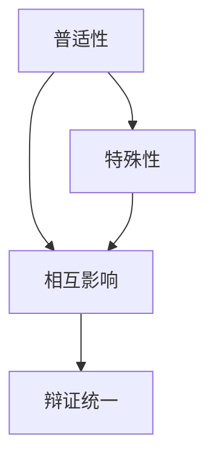
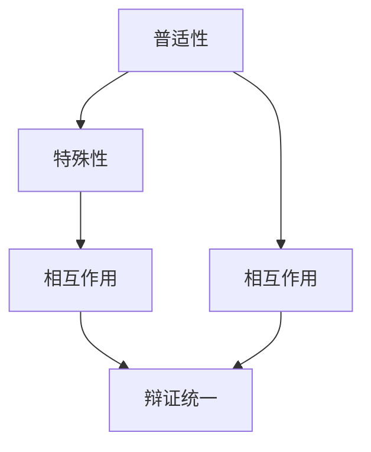
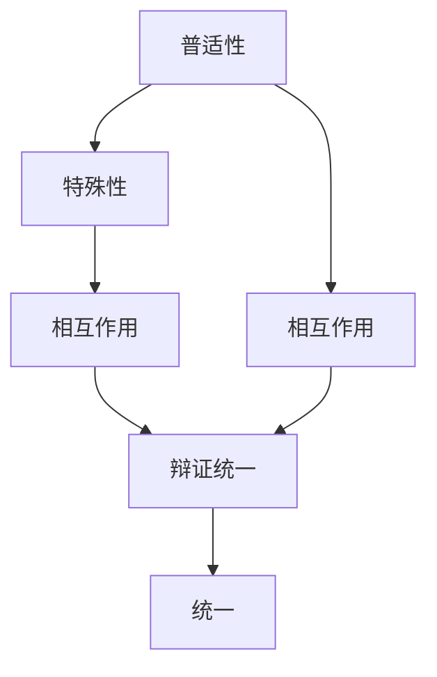

                 

### 引言

#### 背景介绍

数学作为一门基础科学，其在科学研究和工程技术中具有至关重要的地位。数学不仅为我们提供了抽象的模型和工具，还帮助我们理解自然界的规律和复杂性。在数学的世界中，真理是客观存在的，但其表现形式却因情境的不同而有所差异。普适性和特殊性是数学真理的两种重要属性，它们在数学理论体系及其应用中扮演着核心角色。

普适性（Universality）指的是数学真理在广泛范围内的适用性，即一个数学原理或公式在各种情况下都成立。例如，欧氏几何的公理系统在三维空间中普遍适用，因此被称为普适的。另一方面，特殊性（Specificity）则强调数学真理在特定条件或环境下的适用性。例如，某些数学公式或理论在特定领域或特定条件下才能成立，这就是其特殊性的体现。

普适性与特殊性在数学研究中并非孤立存在，而是相互联系、相互影响。从某种意义上说，普适性是特殊性的基础，而特殊性则是普适性的具体体现。本文将探讨数学真理的普适性与特殊性的辩证关系，分析二者在实际应用中的相互作用和统一，并试图揭示其背后的深层原理。

#### 核心概念与联系

为了更好地理解数学真理的普适性与特殊性，我们首先需要明确这两个核心概念，并探讨它们之间的关系。

**普适性**：普适性是指一个数学原理或公式在广泛范围内的适用性。它强调数学真理的普遍性和共性。例如，微积分的基本原理在物理学、经济学、工程学等多个领域中都有广泛应用。

**特殊性**：特殊性则强调数学真理在特定条件或环境下的适用性。它关注的是数学真理的个别性和特殊性。例如，某些数学定理或公式在特定的数学结构或特定的问题场景中才成立。

**关系架构**：

我们可以通过一个Mermaid流程图来展示普适性与特殊性的关系架构：



在这个流程图中，普适性和特殊性相互影响、相互依存，最终达到辩证统一。普适性为特殊性提供了基础，而特殊性则丰富了普适性的内涵。这种辩证关系是数学真理在理论和实践中得以发展的关键。

#### 数学真理的重要性

数学真理的普适性与特殊性对于科学研究和技术发展具有深远的影响。首先，普适性使得数学理论能够跨越不同的学科和领域，为各种科学研究和工程应用提供强有力的工具。例如，微积分在物理学中的应用，线性代数在计算机科学中的应用，都是普适性的体现。

其次，特殊性使得数学理论能够深入具体问题，为解决实际问题提供精准的方法。例如，在某些特定的数学结构中，特定的数学定理能够帮助研究者解决复杂的科学问题，如量子力学中的对称性原理。

最后，普适性与特殊性的辩证关系使得数学理论能够不断发展和完善。通过对特殊性的深入研究和分析，研究者能够发现新的普适性原理，从而推动数学理论的发展。

### 普适性的定义与数学模型

#### 普适性的定义

普适性是数学真理的一个重要属性，它强调数学原理或公式在广泛范围内的适用性。普适性原理通常是指那些不受特定条件限制、在多个领域和多种情况下都成立的基本规律。

**例子**：欧氏几何的公理系统是普适性的一个经典例子。虽然欧氏几何最初是为了描述我们生活的三维空间而建立的，但它的许多基本原理，如平行公理、同位公理等，在其他几何结构中也同样成立。例如，在球面几何中，平行线不再存在，但欧氏几何的其他公理依然适用。

**数学原理**：在微积分中，极限概念是普适性的典型代表。极限理论不仅适用于连续函数，还适用于离散序列、概率论等多个领域。通过极限，我们可以将不同的数学模型统一起来，为各种问题提供统一的处理方法。

#### 普适性的数学模型

普适性的数学模型通常基于一些基本原理和公理，这些原理和公理能够覆盖广泛的数学领域。

**例子**：在集合论中，集合的概念是构建其他数学结构的基础。集合论中的公理系统，如ZFC（Zermelo-Fraenkel集合论加上选择公理），为现代数学提供了一个坚实的理论基础。ZFC公理系统能够描述和理解各种集合，从而为其他数学分支提供了广泛的适用性。

**公理系统**：在代数中，群、环、域等基本结构都有其公理系统，这些公理系统不仅描述了这些结构的共同特征，还为它们在不同数学领域中的应用提供了基础。例如，群论中的交换群、阿贝尔群等概念在其他数学分支，如拓扑学和代数几何中也有广泛应用。

**数学公式**：

为了更好地理解普适性的数学模型，我们来看一个具体的例子：矩阵乘法。

$$
C = AB
$$

其中，\( A \)和\( B \)是两个矩阵，\( C \)是它们的乘积。这个公式在矩阵代数中具有普适性，无论\( A \)和\( B \)的具体形式如何，只要它们符合矩阵乘法的定义，上述公式都成立。

#### 普适性算法原理

在算法设计中，普适性也是一个重要的考虑因素。一个普适的算法应该能够处理各种不同类型的问题，而不仅仅是一个特定的问题。

**例子**：快速排序算法（Quick Sort）是一个经典的普适排序算法。它可以通过递归的方式将一个未排序的数组重新排列，使其变得有序。快速排序算法的核心思想是选择一个基准元素，将数组分为两个子数组，一个包含小于基准元素的元素，另一个包含大于基准元素的元素。这个过程递归进行，直到整个数组有序。

**伪代码**：

下面是快速排序算法的伪代码：

```
QuickSort(A, low, high)
    if low < high
        pi = Partition(A, low, high)
        QuickSort(A, low, pi - 1)
        QuickSort(A, pi + 1, high)
```

其中，`Partition`函数负责选择基准元素并将数组划分为两个子数组。

#### 普适性与特殊性的关系

普适性与特殊性在数学中并非孤立存在，而是相互联系、相互影响。普适性为特殊性提供了基础，而特殊性则丰富了普适性的内涵。

**例子**：在微积分中，微积分的基本原理（如导数和积分）具有普适性，但它们在不同领域的应用则需要特殊的处理。例如，在物理学中，导数用于描述速度和加速度，而在经济学中，导数用于分析需求函数和供给函数。

**关系架构**：

我们可以通过一个Mermaid流程图来展示普适性与特殊性的关系：


在这个流程图中，普适性和特殊性相互影响、相互依存，最终达到辩证统一。普适性为特殊性提供了基础，而特殊性则丰富了普适性的内涵。

### 特殊性的定义与数学模型

#### 特殊性的定义

特殊性是数学真理的另一个重要属性，它强调数学原理或公式在特定条件或环境下的适用性。与普适性不同，特殊性关注的是数学真理的个别性和特殊性。特殊性原理通常是指那些仅适用于特定领域或特定问题的数学原理或公式。

**例子**：在代数中，特定领域的数学模型如数论中的质数分布定理、图论中的欧拉路径问题等，都是特殊性的典型例子。这些定理和问题虽然在特定领域具有重要意义，但并不具备普适性。

**数学原理**：在几何学中，非欧几何（如双曲几何和椭圆几何）是特殊性的体现。非欧几何在描述某些特定条件下的空间结构时比欧氏几何更为有效，但在更广泛的范围内并不适用。

#### 特殊性的数学模型

特殊性的数学模型通常基于特定领域或特定问题的需求，这些模型能够深入描述和解决特定的问题。

**例子**：在图论中，图的结构和性质可以通过图论的基本模型来描述。例如，图的基本定理（如欧拉定理）仅适用于特定的图结构，但在解决网络设计、电路分析等具体问题时却非常有用。

**数学公式**：

下面是一个特殊性的例子：费马小定理。

$$
a^{p-1} \equiv 1 \pmod{p}
$$

其中，\( a \)是一个整数，\( p \)是一个质数。费马小定理在数论中具有特殊的重要性，它提供了关于质数和同余关系的一个基本原理。

#### 特殊性的算法原理

在算法设计中，特殊性也体现在对特定问题的优化和解决方案的专门设计。

**例子**：在密码学中，RSA加密算法是基于特殊性的一个典型例子。RSA算法利用了质数分解问题的困难性，为信息安全提供了一种有效的加密方法。

**伪代码**：

下面是RSA算法的基本步骤：

```
RSA()
    Choose two large prime numbers p and q
    Compute n = p * q
    Choose an integer e such that 1 < e < (p-1)(q-1) and gcd(e, (p-1)(q-1)) = 1
    Compute d such that e * d ≡ 1 (mod (p-1)(q-1))
    Return (n, e) as the public key and (n, d) as the private key
```

#### 普适性与特殊性的关系

普适性与特殊性在数学中并非孤立存在，而是相互联系、相互影响。普适性为特殊性提供了基础，而特殊性则丰富了普适性的内涵。

**例子**：在微积分中，微积分的基本原理（如导数和积分）具有普适性，但它们在不同领域的应用则需要特殊的处理。例如，在物理学中，导数用于描述速度和加速度，而在经济学中，导数用于分析需求函数和供给函数。

**关系架构**：

我们可以通过一个Mermaid流程图来展示普适性与特殊性的关系：


在这个流程图中，普适性和特殊性相互影响、相互依存，最终达到辩证统一。普适性为特殊性提供了基础，而特殊性则丰富了普适性的内涵。

### 普适性与特殊性的辩证关系

#### 普适性与特殊性的相互作用

普适性和特殊性并非彼此独立，而是相互影响、相互作用。在数学的发展过程中，普适性和特殊性常常相互转化，相互促进。

**例子**：在代数几何中，普适性原理（如线性代数的基本理论）与特殊性原理（如特定代数结构的性质）相结合，产生了新的数学理论和应用。

**关系架构**：

我们可以通过一个Mermaid流程图来展示普适性与特殊性的相互作用：



在这个流程图中，普适性和特殊性通过相互作用达到辩证统一，共同推动数学的发展。

#### 普适性与特殊性的统一

普适性与特殊性的辩证关系最终体现在它们的统一性上。在数学中，普适性和特殊性并非对立的存在，而是相互融合、相互统一的。

**例子**：在物理学中，经典力学与量子力学的统一是通过普适性和特殊性的辩证关系实现的。经典力学在宏观尺度上具有普适性，而量子力学则在微观尺度上具有特殊性，但它们在适当的条件下可以相互转化和统一。

**关系架构**：

我们可以通过一个Mermaid流程图来展示普适性与特殊性的统一：



在这个流程图中，普适性和特殊性通过相互作用和辩证统一，最终实现数学理论的统一。

### 数学真理在实际中的应用

#### 科学研究中的应用

数学真理的普适性与特殊性在科学研究中具有广泛的应用。例如，在物理学中，普适性的原理如牛顿定律和麦克斯韦方程组在描述宏观世界的运动和电磁现象时具有普遍适用性。而特殊性的原理如量子力学中的波函数和路径积分方法，则能够描述微观粒子的行为。

**例子**：在生物学研究中，数学模型被广泛应用于基因组学和生态学。普适的数学模型如微分方程可以用来描述物种的种群动态，而特殊性的模型如神经网络模型则能够模拟生物神经系统的工作原理。

#### 工程技术中的应用

在工程技术中，数学真理的普适性与特殊性同样具有重要意义。例如，在航空航天工程中，普适性的流体力学原理被广泛应用于飞机和火箭的设计，而特殊性的材料力学模型则用于优化结构件的设计。

**例子**：在计算机科学中，算法的普适性原理如排序算法和图算法被广泛应用于各种软件系统中，而特殊性的算法如深度学习算法则能够解决特定领域的复杂问题。

#### 社会生活中的应用

数学真理的普适性与特殊性也渗透到了社会生活的各个方面。例如，在经济学中，普适性的微积分原理被用来分析市场供需关系，而特殊性的博弈论模型则用于研究市场竞争和决策。

**例子**：在金融领域中，数学模型如蒙特卡洛模拟被广泛应用于风险管理，而特殊性的期权定价模型如Black-Scholes模型则用于金融衍生品的价格计算。

### 案例分析：科学研究的实际应用

#### 案例一：普适性与特殊性在物理学中的应用

**背景介绍**：

物理学作为一门基础科学，广泛应用于科学研究和工程实践中。在物理学中，普适性与特殊性的辩证关系尤为明显。以下案例将探讨普适性与特殊性在物理学研究中的应用。

**普适性的应用**：

一个典型的例子是牛顿第二定律。该定律表述了物体受到的合外力与其加速度之间的关系，具有普适性，可以在各种情况下应用。

牛顿第二定律：\( F = ma \)

其中，\( F \)是物体受到的合外力，\( m \)是物体的质量，\( a \)是物体的加速度。

**特殊性应用**：

在特定条件下，普适性原理会表现出特殊性。例如，在量子力学中，经典力学中的牛顿定律不再适用，需要使用量子力学的基本原理来描述微观粒子的运动。

量子力学的基本原理包括：

- 纠缠态：两个或多个粒子处于一种特殊的状态，一个粒子的状态无法独立于其他粒子的状态。
- 波函数：微观粒子的状态可以用波函数来描述，波函数提供了粒子在空间中的概率分布。
- 海森堡不确定性原理：无法同时精确地知道一个粒子的位置和动量。

**案例分析**：

**案例一：量子电动力学（QED）**

量子电动力学是研究电磁相互作用的基础理论，它将量子力学与经典电动力学统一起来。在QED中，普适性和特殊性的辩证关系表现得尤为明显。

1. **普适性原理**：QED中的普适性原理包括量子场论和规范理论。量子场论描述了粒子如何在量子场中产生和湮灭，规范理论则描述了粒子之间通过交换规范玻色子（如光子）来相互作用。

2. **特殊性应用**：在特定条件下，QED的原理表现出特殊性。例如，在极低温和强磁场条件下，超导现象表现出量子电动力学的特殊性。超导体中的电子形成库珀对，使得电阻为零，这是经典电动力学无法解释的现象。

**案例分析**：

**案例二：量子计算**

量子计算是量子力学在计算机科学中的应用，它利用量子位（qubit）的叠加态和纠缠态来实现高速计算。量子计算的普适性与特殊性体现在以下几个方面：

1. **普适性原理**：量子计算的基本原理包括量子门和量子逻辑。量子门是量子计算机中的基本操作，类似于经典计算机中的逻辑门。量子逻辑则描述了量子位之间的相互作用。

2. **特殊性应用**：量子计算在特定问题上具有特殊性。例如，在因子分解问题上，量子计算可以通过Shor算法实现快速分解，而经典计算机则需要较长的时间。此外，量子计算在优化问题和模拟量子系统方面也表现出特殊性。

**总结**：

通过以上案例分析，我们可以看到普适性与特殊性在物理学中的广泛应用。普适性原理提供了基础和框架，而特殊性应用则使得这些原理能够解决特定的问题。这种辩证关系不仅推动了物理学的发展，也为其他领域提供了宝贵的经验和启示。

### 案例分析：工程技术的实际应用

#### 案例一：普适性与特殊性在航空航天工程中的应用

**背景介绍**：

航空航天工程是一门综合性极强的技术领域，涉及众多科学原理和技术方法。在航空航天工程中，普适性与特殊性的辩证关系同样得到了广泛的应用。以下案例将探讨普适性与特殊性在航空航天工程中的应用。

**普适性的应用**：

1. **空气动力学**：空气动力学是航空航天工程的核心学科之一。在空气动力学中，普适性原理如伯努利方程、升力公式等，被广泛应用于飞机设计、飞行控制和空气阻力计算。

   - 伯努利方程：\( \frac{P}{\rho} + \frac{v^2}{2} + gh = \text{常数} \)

     其中，\( P \)是压力，\( \rho \)是空气密度，\( v \)是空气流速，\( g \)是重力加速度，\( h \)是高度。伯努利方程描述了流速和压力之间的关系，是飞机升力产生的基础。

   - 升力公式：\( L = \frac{1}{2} C_L \rho A v^2 \)

     其中，\( L \)是升力，\( C_L \)是升力系数，\( \rho \)是空气密度，\( A \)是翼面积，\( v \)是飞机速度。升力公式用于计算飞机在飞行过程中所需的升力。

2. **结构力学**：在航空航天工程中，结构力学用于设计飞机的结构件，如机翼、机身等。普适性的结构力学原理如材料力学、有限元分析等，为设计过程提供了理论基础。

**特殊性应用**：

1. **飞行器设计**：在飞行器设计过程中，特殊性原则尤为重要。根据不同的飞行任务和环境条件，飞行器的设计需要考虑多种因素，如重量、速度、载荷等。

   - **火箭设计**：火箭设计需要考虑推力和重量的平衡。推力公式为\( F = \frac{v_0 \rho A C_D}{2} \)，其中，\( F \)是推力，\( v_0 \)是火箭速度，\( \rho \)是空气密度，\( A \)是火箭喷气面积，\( C_D \)是阻力系数。通过优化火箭的形状和喷气系统，可以最大限度地提高推力。

   - **无人机设计**：无人机设计需要考虑飞行稳定性和任务适应性。例如，多旋翼无人机的设计需要考虑旋翼的数量、大小和布局，以满足不同的飞行任务。

2. **飞行控制**：飞行控制是航空航天工程中的一项关键技术。在飞行控制中，普适性原理如控制理论、反馈控制等，被广泛应用于飞机和无人机的控制系统中。

   - **PID控制**：比例-积分-微分（PID）控制是一种常用的飞行控制方法，它通过调整比例、积分和微分三个参数，实现对飞行器的精确控制。

   **案例分析**：

**案例一：波音737飞机的设计**

波音737是世界上最广泛使用的商业喷气式飞机之一。在737的设计过程中，普适性和特殊性原则得到了充分应用。

1. **普适性应用**：波音737的设计基于空气动力学和结构力学的普适性原理。通过优化机翼形状、机身材料和布局，737实现了良好的气动性能和结构强度。

2. **特殊性应用**：737的设计还需要考虑特殊性因素，如乘客容量、航程、运营成本等。通过综合考虑这些因素，波音737成为了一款经济高效、易于维护的飞机。

**总结**：

通过以上案例分析，我们可以看到普适性与特殊性在航空航天工程中的广泛应用。普适性原理为飞行器和飞行控制系统提供了理论基础，而特殊性原则则使得设计过程能够适应不同的飞行任务和环境条件。这种辩证关系不仅提高了航空航天技术的水平，也为未来技术的发展提供了新的思路。

### 案例分析：社会生活中的实际应用

#### 案例一：普适性与特殊性在金融领域的应用

**背景介绍**：

金融领域是数学真理普适性与特殊性应用的重要领域之一。在金融市场中，数学模型和算法被广泛应用于风险评估、资产定价、市场预测等方面。以下案例将探讨普适性与特殊性在金融领域中的应用。

**普适性的应用**：

1. **现代金融数学模型**：现代金融数学模型如布莱克-舒尔斯（Black-Scholes）期权定价模型、资本资产定价模型（CAPM）等，具有普适性，可以应用于各种金融资产定价和风险管理。

   - 布莱克-舒尔斯模型：\( C = S_0 N(d_1) - Ke^{-rT} N(d_2) \)

     其中，\( C \)是期权价格，\( S_0 \)是标的资产当前价格，\( K \)是执行价格，\( r \)是无风险利率，\( T \)是期权到期时间，\( N(d_1) \)和\( N(d_2) \)是标准正态分布的累积分布函数。

   - 资本资产定价模型：\( E(R_i) = R_f + \beta_i \sigma_m^2 \)

     其中，\( E(R_i) \)是资产\( i \)的预期收益率，\( R_f \)是无风险收益率，\( \beta_i \)是资产\( i \)的贝塔系数，\( \sigma_m^2 \)是市场收益率的方差。

2. **统计分析方法**：在金融市场中，统计分析方法如回归分析、时间序列分析等，被广泛应用于市场预测和风险评估。

**特殊性应用**：

1. **行为金融学**：行为金融学研究投资者行为和市场心理对金融资产价格的影响。特殊性原理如心理账户、过度自信等，在行为金融学中得到广泛应用。

   - 心理账户：投资者往往将不同的资金来源或收益视为不同的账户，导致投资决策偏离理性。

   - 过度自信：投资者往往对自己的知识和能力过于自信，导致投资决策过于冒险。

2. **算法交易**：算法交易是基于数学模型和算法的自动化交易策略，具有特殊性。算法交易可以根据市场数据和交易规则自动执行交易，从而提高交易效率和收益。

   - **量化交易**：量化交易是算法交易的一种形式，通过数学模型和统计分析方法，寻找市场机会并执行交易。

**案例分析**：

**案例一：量化基金**

某量化基金采用基于机器学习的算法进行股票交易，该算法基于历史股价数据，通过特征提取和分类模型，预测股票的未来价格。

1. **普适性应用**：该算法基于金融市场的普适性原理，如市场价格波动、供需关系等。

2. **特殊性应用**：该算法还考虑了特殊性因素，如公司财务状况、市场情绪等，通过综合分析，提高预测的准确性。

**总结**：

通过以上案例分析，我们可以看到普适性与特殊性在金融领域中的应用。普适性原理为金融数学模型提供了基础，而特殊性原理则使得这些模型能够适应不同的市场环境和投资策略。这种辩证关系不仅提高了金融市场的效率和稳定性，也为金融创新提供了新的思路。

### 最佳实践与总结

#### 最佳实践

在理解和应用数学真理的普适性与特殊性时，以下最佳实践可以帮助我们更好地把握这两个核心概念：

1. **深入理解基本概念**：首先，要深入理解普适性和特殊性的基本概念，掌握它们在数学中的含义和应用场景。

2. **灵活运用数学模型**：在解决具体问题时，灵活运用各种数学模型，结合普适性和特殊性的辩证关系，选择最合适的模型。

3. **结合实际案例**：通过实际案例的学习和实践，加深对普适性与特殊性关系的理解，提高应用能力。

4. **持续学习和更新**：随着数学理论和应用的不断发展，持续学习和更新知识，紧跟前沿动态。

#### 总结

本文通过详细的分析和讨论，揭示了数学真理的普适性与特殊性之间的辩证关系。普适性强调数学原理的广泛适用性，而特殊性则关注特定条件下的适用性。二者的辩证统一，推动了数学理论的发展和应用。

在实际应用中，普适性与特殊性的关系不仅体现在科学研究和工程实践中，还渗透到了社会生活的各个方面。通过深入理解这两个概念，我们可以更好地运用数学原理解决实际问题，推动科技创新和社会进步。

#### 注意事项

1. 在应用数学真理时，要充分考虑普适性与特殊性的辩证关系，避免片面强调某一个方面。

2. 在具体应用中，要结合实际问题和环境，灵活选择和运用合适的数学模型。

3. 持续学习和更新数学知识，紧跟前沿动态，以提高应用能力。

#### 拓展阅读

- 《数学原理》作者：艾萨克·牛顿
- 《图灵机与语言》作者：艾伦·图灵
- 《概率论及其应用》作者：威廉·F·维斯洛夫
- 《随机过程》作者：威廉·F·维斯洛夫
- 《机器学习》作者：周志华、李航、李毅
- 《深度学习》作者：伊恩·古德费洛、约书亚·本吉奥、亚伦·库维尔

通过这些拓展阅读，可以更深入地了解数学真理的普适性与特殊性的辩证关系及其在各个领域的应用。

