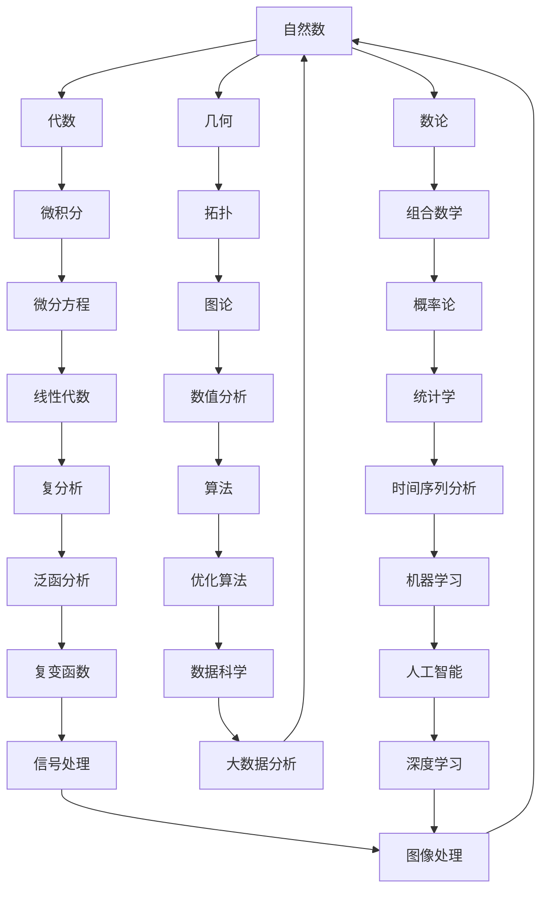

                 

### 文章标题

《数学真理的本质：客观存在还是人类创造？》

### 关键词

数学真理、客观存在、主观性、逻辑一致性、数学结构、数学模型、数学公式、归纳法、演绎法、数学证明、人工智能、经济学、自然科学

### 摘要

本文旨在探讨数学真理的本质，即数学真理是客观存在的，还是人类创造的。我们将从数学的定义与发展、真理的概念与分类、数学真理的客观性、数学真理的主观性等多个角度，逐步分析数学真理的本质，并探讨其在实际应用中的重要性。通过归纳法与演绎法，我们试图揭示数学真理背后的逻辑一致性，以及人类主观意识在数学真理构建过程中的作用。最终，我们将探讨数学真理的多元解释，并对其未来展望进行讨论。

### 目录大纲

1. 第一部分：引言与背景
    1.1 数学的定义与发展
    1.2 真理的概念与分类
    1.3 数学的客观性与主观性

2. 第二部分：数学真理的客观性
    2.1 数学真理的客观性理论
    2.2 客观存在的数学结构
    2.3 数学真理与逻辑一致性
    2.4 数学真理的发现与验证

3. 第三部分：数学真理的主观性
    3.1 主观性数学理论
    3.2 数学真理的构建与创造
    3.3 人类主观意识的参与
    3.4 数学真理的相对性

4. 第四部分：数学真理的探讨与实践
    4.1 数学真理的探讨方法
    4.2 归纳法与演绎法
    4.3 数学证明与反驳
    4.4 数学哲学的思考方式

5. 第五部分：数学真理的本质：客观存在还是人类创造？
    5.1 数学真理的本质探讨
    5.2 客观性与主观性的平衡
    5.3 数学真理的多元解释
    5.4 数学真理的未来展望

6. 第六部分：结论与展望
    6.1 数学的本质与价值
    6.2 数学真理的研究意义
    6.3 数学未来的发展方向

7. 参考文献

8. 附录
    8.1 数学的核心概念与联系（Mermaid流程图）
    8.2 核心算法原理讲解（伪代码）
    8.3 数学模型和数学公式（latex格式）

---

### 第一部分：引言与背景

#### 1.1 数学的定义与发展

数学，是一门研究数量、结构、变化和空间的科学。它不仅涉及数和形，还包括逻辑推理和抽象思维。从古代的毕达哥拉斯定理，到现代的量子计算，数学的发展经历了数千年的演变。数学的起源可以追溯到古代文明，如古埃及、巴比伦和中国。然而，数学作为一门独立的学科，是在古希腊时期确立的。

古希腊的数学家如欧几里得、阿基米德等人，通过严密的逻辑推理，建立了几何学、算术和代数学等基础学科。随后，数学在阿拉伯世界得到进一步发展，如阿穆尔·阿尔·卡尔西等人对代数学的巨大贡献。到了近代，数学得到了前所未有的发展，尤其是微积分和概率论的出现，为自然科学和工程学的发展提供了强大的工具。

在计算机科学和人工智能领域，数学的重要性更是不言而喻。计算机科学本质上是数学的一个分支，涉及算法、数据结构、图论等领域。人工智能的许多核心算法，如神经网络、机器学习、深度学习等，都是基于数学理论构建的。因此，数学不仅是科学研究的基础，也是现代科技发展的基石。

#### 1.2 真理的概念与分类

真理，是指与事实相符的判断或陈述。在哲学领域，真理被视为知识的核心。根据不同的标准，真理可以分为多种类型，如绝对真理和相对真理、客观真理和主观真理等。

绝对真理是指不受任何主观因素影响的真理，它独立于我们的感知和认知。相对真理则是基于特定视角或背景的真理，它随着时间和环境的变化而变化。客观真理是指独立于人的意识和主观感受的真理，而主观真理则是基于个人感知和理解的真理。

在数学中，真理通常指的是逻辑上无矛盾的命题。数学真理具有绝对性和普适性，因为它们不依赖于个人的主观感受，而是通过逻辑推理和严格的证明得到的。

#### 1.3 数学的客观性与主观性

数学的客观性是指数学真理的存在和成立不依赖于人类的感知和主观意愿。数学结构，如自然数、几何图形、函数等，被认为是在人类出现之前就存在的。数学的公理体系和定理，是通过逻辑推理和实验验证得到的，这些方法和结果具有普遍性和可靠性。

然而，数学也具有主观性。首先，数学的发现和创造过程离不开人类的主观努力和创造力。数学家通过观察、思考、实验和推理，发现了数学规律和结构。其次，数学的表述和应用需要语言和符号，这些语言和符号的选择和使用受到人类文化和社会背景的影响。

因此，数学既是客观的，也是主观的。数学的客观性体现在其逻辑推理和证明的严谨性，而数学的主观性则体现在其发现和创造过程中。这种客观性与主观性的统一，使得数学成为一门既具有科学性，又具有艺术性的学科。

---

### 第二部分：数学真理的客观性

#### 2.1 数学真理的客观性理论

数学真理的客观性理论认为，数学真理的存在和成立不依赖于人类的感知和主观意愿。数学真理被认为是客观存在的，因为它们独立于我们的思维和感觉。数学结构，如自然数、几何图形、函数等，被认为是先于人类而存在的。

这个理论的一个核心观点是，数学对象和概念具有固有的存在性。例如，自然数1、2、3等，不仅存在于我们的头脑中，也存在于现实世界中。这些数的性质和关系，如加法、乘法、比较大小等，是客观存在的，不依赖于我们的认知。

数学真理的客观性还体现在其逻辑一致性和普适性上。数学的公理体系和定理，是通过逻辑推理和严格的证明得到的。这些证明过程不依赖于个人的主观判断，而是基于数学内部的逻辑规则。因此，一旦某个数学命题被证明为真，它就是普遍有效的，不受时间和空间限制。

#### 2.2 客观存在的数学结构

客观存在的数学结构是指数学对象和概念在现实世界中具有具体的对应物。例如，自然数1、2、3等，不仅存在于数学符号系统中，也存在于我们的日常生活中。我们可以在计数物体、度量长度、计算时间等活动中，直观地感知到自然数的存在。

几何图形也是客观存在的。例如，正方形、圆形、三角形等，不仅存在于数学理论中，也存在于自然界中。我们可以通过观察天空中的星座、地球上的地形、建筑物等，直观地感知到几何图形的存在。

函数是另一个典型的数学结构。函数描述了变量之间的关系，如速度与时间的关系、价格与需求的关系等。这些函数不仅在数学中具有抽象的意义，也在现实世界中具有具体的对应物。例如，物理学中的速度函数描述了物体在不同时间点的位置变化，经济学中的需求函数描述了不同价格水平下的需求量。

#### 2.3 数学真理与逻辑一致性

数学真理与逻辑一致性密切相关。逻辑一致性是指一个理论体系内部不存在矛盾。在数学中，逻辑一致性体现在数学命题的证明过程中。一个数学命题，只有在其证明过程中不出现矛盾，才能被认为是真的。

逻辑一致性的重要性在于，它保证了数学真理的可靠性。如果数学体系内部存在矛盾，那么所有的数学命题都可能是假的。因此，逻辑一致性是数学真理的基石。

为了证明数学真理的逻辑一致性，数学家们建立了严格的公理体系和定理证明。例如，欧几里得的几何学是基于五个公设和一系列定理构建的。这些公设和定理相互之间没有矛盾，因此几何学体系是逻辑上一致的。

现代数学也通过模型论来验证数学真理的逻辑一致性。模型论是一种研究数学结构和证明的数学分支，它通过构造数学模型来验证数学命题的真伪。如果某个数学命题在一个模型中成立，那么它就被认为是真的。

#### 2.4 数学真理的发现与验证

数学真理的发现和验证是数学研究的重要环节。数学真理的发现通常是通过数学家的直觉、观察和实验得到的。例如，费马大定理是一个著名的数学问题，它指出对于任意大于2的自然数n，方程\(a^n + b^n = c^n\)没有正整数解。这个定理的发现经历了数百年的探索，最终在1994年被安德鲁·怀尔斯证明。

数学真理的验证是通过逻辑推理和严格的证明得到的。证明过程通常包括以下几个步骤：

1. **定义与公理**：首先，需要定义数学概念和公理。公理是数学体系的基本假设，它们不依赖于其他概念或定理。
2. **命题与假设**：然后，提出需要证明的命题和假设。命题是数学家试图证明的陈述，假设是用于证明的辅助条件。
3. **推理与证明**：通过逻辑推理，从公理和假设推导出命题。证明需要遵循严格的逻辑规则，如演绎法。
4. **结论与验证**：最后，得到命题的结论，并通过验证确认其正确性。

数学真理的验证过程不仅依赖于数学家的智力，还需要严格的逻辑方法和证明技巧。例如，费马大定理的证明使用了复杂的数学工具和技巧，包括椭圆曲线和模形式等。

通过发现和验证数学真理，数学家们不断扩展数学体系，提高数学的精确性和可靠性。这个过程也是人类理解自然界和宇宙的重要途径。数学真理的客观性和普适性，使得数学成为科学研究的基础和工具。

---

### 第三部分：数学真理的主观性

#### 3.1 主观性数学理论

主观性数学理论认为，数学真理并非完全客观，而是在很大程度上依赖于人类的主观意识和创造性。这个理论的核心观点是，数学的发现和构建过程受到人类主观因素的影响。

首先，数学的发现过程往往依赖于数学家的直觉和创造力。数学家通过观察现象、提出假设和进行实验，发现了许多数学规律和定理。例如，费马大定理的发现就是基于费马的一个直觉猜想。这些直觉和猜想是数学家的主观努力的结果。

其次，数学的表述和应用也受到人类主观意识的影响。数学需要使用语言和符号来表述概念和定理，而这些语言和符号的选择和使用受到人类文化和社会背景的影响。例如，不同的文化和语言背景下，数学符号和术语的使用可能存在差异。

此外，数学真理的主观性还体现在其解释和应用上。同一个数学定理，在不同的学科领域和背景下，可能有不同的解释和应用。例如，微积分在物理学和经济学中的解释和应用方式不同，但它们都是基于同样的数学原理。

#### 3.2 数学真理的构建与创造

数学真理的构建与创造过程是一个复杂而美妙的过程，它体现了人类智慧和创造力的结晶。数学真理的构建通常包括以下几个步骤：

1. **观察与发现**：数学家通过观察自然现象或解决实际问题，发现数学规律和问题。例如，费马大定理就是基于费马在研究平方数和立方数之间的关系时提出的。

2. **假设与猜想**：在发现数学规律后，数学家会提出假设和猜想。这些假设和猜想是数学家主观意识的产物，它们可能基于直觉、经验或理论推导。例如，费马大定理的猜想就是基于费马对大数的观察和思考。

3. **证明与验证**：为了验证假设和猜想的正确性，数学家需要进行证明。证明过程通常依赖于逻辑推理、数学定理和已知结果。例如，费马大定理的证明使用了复杂的数学工具和技巧，如椭圆曲线和模形式。

4. **推广与应用**：一旦假设和猜想被证明为真，数学家会将其推广到更广泛的数学领域，并探索其应用。例如，费马大定理的证明不仅证明了定理本身，还推动了代数几何、数论等领域的发展。

数学真理的构建过程不仅依赖于数学家的智力，还需要他们的创造力和耐心。许多著名的数学问题，如费马大定理、哥德巴赫猜想等，都是通过数学家的不断努力和创造得到的。

#### 3.3 人类主观意识的参与

人类主观意识在数学真理的构建过程中起着至关重要的作用。首先，数学家的直觉和创造力是数学发现的源泉。数学家通过直觉，能够捕捉到一些潜在的数学规律和模式，这些直觉往往是科学发现的先导。

其次，人类的主观意识影响着数学表述和应用的方式。数学需要使用语言和符号来表述概念和定理，而这些语言和符号的选择和使用受到人类文化和社会背景的影响。例如，不同文化和语言背景下，数学术语和符号的使用可能存在差异，这反映了人类主观意识的影响。

此外，人类的主观意识也影响着数学真理的解释和应用。同一个数学定理，在不同的学科领域和背景下，可能有不同的解释和应用。例如，微积分在物理学和经济学中的解释和应用方式不同，但它们都是基于同样的数学原理。这种差异反映了人类主观意识在不同领域的具体体现。

总之，人类主观意识在数学真理的构建、表述和应用中发挥着重要作用。数学的发展不仅是人类智慧和创造力的体现，也是人类主观意识与客观世界的相互作用的结果。

#### 3.4 数学真理的相对性

数学真理的相对性是指数学真理并非绝对，而是相对于特定的背景、文化和时间环境而言的。数学真理的相对性体现在以下几个方面：

首先，数学真理的相对性体现在不同的文化和社会背景下，数学的表述和应用可能存在差异。例如，某些数学概念和术语在不同的语言和文化中可能有不同的称呼和解释。这种差异反映了数学真理的相对性。

其次，数学真理的相对性体现在数学知识的积累和发展过程中。数学的发展是不断积累和进步的过程，每个时代和每个地区的数学家都可能对数学真理有不同的理解和解释。例如，古代数学与现代数学在概念、方法和应用上都有很大的差异。

此外，数学真理的相对性还体现在数学的抽象和普遍性上。数学的抽象过程使得数学真理脱离了具体情境，成为普适的原理。但这种普适性是相对的，因为数学的抽象过程受到人类主观意识和认知能力的限制。

总之，数学真理的相对性提醒我们，在理解和应用数学真理时，需要考虑到其特定的背景、文化和时间环境。这种相对性也使得数学具有多样性和灵活性，为不同领域和不同背景的人们提供了丰富的数学工具和思维方式。

---

### 第四部分：数学真理的探讨与实践

#### 4.1 数学真理的探讨方法

探讨数学真理的方法主要包括归纳法、演绎法、证明与反驳等。

归纳法是从个别事实出发，通过归纳推理得出一般性结论的方法。例如，通过观察多个三角形，发现它们的内角和都是180度，从而归纳出“任意三角形的内角和为180度”的结论。

演绎法是从一般原理出发，通过演绎推理得出具体结论的方法。例如，从“所有人类都会死亡”和“苏格拉底是人类”这两个前提，通过演绎法得出“苏格拉底会死亡”的结论。

证明与反驳是数学探讨的重要方法。证明是通过逻辑推理，从已知前提得出结论的过程。反驳则是通过逻辑推理，证明某个命题是错误的。例如，在证明“勾股定理”时，可以通过演绎法证明直角三角形的两条直角边的平方和等于斜边的平方。

#### 4.2 归纳法与演绎法

归纳法与演绎法是数学探讨的两个基本方法，它们在数学真理的发现和证明中发挥着重要作用。

归纳法是一种从特殊到一般的推理方法。通过观察多个实例，归纳出一般性规律或结论。例如，通过观察多个直角三角形，发现它们的内角和都是180度，从而归纳出“任意三角形的内角和为180度”的结论。

归纳法的优点是简单直观，适用于发现新的数学规律。但归纳法也存在局限性，因为归纳推理不能保证结论的绝对正确性。例如，通过观察多个直角三角形得出内角和为180度的结论，并不能保证所有三角形都满足这个性质。

演绎法是一种从一般到特殊的推理方法。它从一般性原理或公理出发，通过逻辑推理得出具体结论。例如，从“所有人类都会死亡”和“苏格拉底是人类”这两个前提，通过演绎法得出“苏格拉底会死亡”的结论。

演绎法的优点是结论的绝对正确性，因为演绎法遵循逻辑规则，从真前提可以得出真结论。但演绎法也有局限性，因为它只能应用于已知的一般性原理和公理，不能发现新的数学规律。

#### 4.3 数学证明与反驳

数学证明与反驳是数学探讨的重要方法，它们在数学真理的发现和验证中起着关键作用。

数学证明是通过逻辑推理，从已知前提得出结论的过程。证明需要遵循一定的规则和步骤，如定义、公理、定理、假设等。数学证明的目的是确定数学命题的真伪，使其具有普遍性和可靠性。

数学反驳是通过逻辑推理，证明某个命题是错误的过程。反驳可以通过反证法、反例法、矛盾法等多种方法进行。反驳的目的是揭示数学命题的错误，从而纠正和改进数学理论。

数学证明与反驳是相辅相成的。通过证明，我们可以确定数学真理的可靠性；通过反驳，我们可以发现和纠正数学命题的错误。这种相互验证和修正的过程，使得数学理论更加严谨和完整。

#### 4.4 数学哲学的思考方式

数学哲学是对数学本质和方法的深入思考，它探讨数学的客观性、主观性、相对性等基本问题。数学哲学的思考方式包括以下几个方面：

1. **逻辑思考**：数学哲学强调逻辑推理的重要性，认为数学真理是通过逻辑推理得到的。逻辑思考帮助数学家建立严谨的数学体系，保证数学命题的真伪。

2. **抽象思维**：数学哲学认为，数学是对现实世界的抽象和概括。通过抽象思维，数学家可以将复杂的现实问题转化为简单的数学模型，从而更好地理解和解决问题。

3. **概念分析**：数学哲学关注数学概念的本质和关系，通过概念分析，数学家可以揭示数学概念的内在逻辑和结构。

4. **历史视角**：数学哲学强调数学的历史发展，认为数学是在不断演变和进步的过程中形成的。通过历史视角，数学家可以更好地理解数学的本质和演变过程。

数学哲学的思考方式不仅对数学研究有重要指导作用，也对其他学科领域产生了深远影响。数学哲学的思想和方法，帮助人们更深入地理解自然界的规律和本质。

---

### 第五部分：数学真理的本质：客观存在还是人类创造？

#### 5.1 数学真理的本质探讨

关于数学真理的本质，学术界一直存在两种观点：一种认为数学真理是客观存在的，另一种认为数学真理是人类创造的。这两种观点各有其合理性和局限性，本文将试图在两者之间找到一种平衡。

首先，从客观存在的角度来看，数学真理被认为是先于人类存在的。数学结构，如自然数、几何图形、函数等，具有固有的存在性，不依赖于人类的感知和主观意愿。数学的公理体系和定理，是通过逻辑推理和严格的证明得到的，这些证明过程遵循数学内部的逻辑规则。因此，数学真理具有普遍性和可靠性。

然而，从人类创造的角度来看，数学真理的形成和发展离不开人类的主观意识和创造性。数学的发现和构建过程需要数学家的直觉、观察和实验，这些过程受到人类文化和社会背景的影响。数学的表述和应用也需要使用语言和符号，这些语言和符号的选择和使用也受到人类的主观影响。

在这种背景下，我们无法否认数学真理的客观性和主观性。数学真理的客观性体现在其逻辑一致性和普遍性上，而其主观性则体现在其发现和构建过程中。这种客观性与主观性的统一，使得数学成为一门既具有科学性，又具有艺术性的学科。

#### 5.2 客观性与主观性的平衡

在探讨数学真理的本质时，我们需要在客观性和主观性之间找到一种平衡。这种平衡不仅体现了数学真理的复杂性和多样性，也反映了数学作为一门学科的丰富内涵。

首先，在数学真理的客观性方面，我们需要认识到数学结构的存在性和逻辑一致性。数学真理的客观性体现在其不受时间和空间限制的普遍性和可靠性。这种客观性是数学科学性的基础，也是数学在各个领域应用的重要保障。

其次，在数学真理的主观性方面，我们需要认识到数学的发现和构建过程离不开人类的主观意识和创造性。数学的表述和应用需要使用语言和符号，这些语言和符号的选择和使用受到人类文化和社会背景的影响。因此，数学真理的主观性体现了数学作为一门艺术性的学科特点。

在这种背景下，我们需要在客观性和主观性之间找到一种平衡。这种平衡意味着，在数学真理的发现和证明过程中，既要重视数学的逻辑一致性和普遍性，也要尊重数学家的直觉、观察和创造力。只有这样，我们才能更好地理解和应用数学，推动数学的发展。

#### 5.3 数学真理的多元解释

数学真理的多元解释是指，同一个数学命题可以从不同的角度和层面进行解释和理解。这种多元解释体现了数学真理的复杂性和丰富性。

首先，从客观存在的角度来看，数学真理被认为是先于人类存在的。数学结构，如自然数、几何图形、函数等，具有固有的存在性，不依赖于人类的感知和主观意愿。这种解释强调了数学的客观性和普遍性。

其次，从人类创造的角度来看，数学真理的形成和发展离不开人类的主观意识和创造性。数学的发现和构建过程需要数学家的直觉、观察和实验，这些过程受到人类文化和社会背景的影响。这种解释强调了数学的主观性和艺术性。

此外，数学真理的多元解释还包括从历史和文化视角进行解释。数学的发展是不断积累和进步的过程，每个时代和每个地区的数学家都可能对数学真理有不同的理解和解释。这种解释反映了数学的多样性和丰富性。

总之，数学真理的多元解释提醒我们，在理解和应用数学真理时，需要考虑到其特定的背景、文化和时间环境。这种多元解释不仅丰富了数学的理论体系，也为数学的应用和发展提供了新的视角和方法。

#### 5.4 数学真理的未来展望

数学真理的未来展望涉及数学理论的发展趋势、数学应用的创新领域以及数学教育的重要性。

首先，数学理论的发展将继续深化和扩展。随着数学工具和技术的进步，数学家们可能会发现新的数学结构、原理和定理。例如，量子计算和图论等新兴领域可能带来数学理论的重大突破。此外，数学模型和算法的优化，也将推动数学在解决复杂问题方面的应用。

其次，数学的应用领域将不断扩展。数学不仅将继续在自然科学和工程学中发挥重要作用，还将在经济学、金融、生物学、医学等领域得到广泛应用。例如，机器学习和人工智能领域的快速发展，使得数学成为构建智能系统和算法的核心工具。此外，数学在可持续发展、气候变化和全球化等问题上的应用，也将为解决这些全球性问题提供有力支持。

最后，数学教育的重要性将得到进一步凸显。随着数学在各个领域的重要性日益增加，数学教育将更加注重培养学生的逻辑思维、抽象能力和创造力。同时，跨学科教育将促进数学与其他学科的融合，培养具有全面素质的复合型人才。

总之，数学真理的未来展望充满了机遇和挑战。数学的发展不仅将推动科学技术的进步，也将为人类社会的可持续发展作出重要贡献。

---

### 第六部分：结论与展望

#### 6.1 数学的本质与价值

数学是一门研究数量、结构、变化和空间的科学，其本质在于揭示客观世界的规律和本质。数学的价值不仅体现在其科学性和严谨性，还体现在其广泛应用和深刻影响。

首先，数学的严谨性体现在其逻辑推理和证明体系上。数学命题的真伪是通过逻辑推理和严格的证明得到的，这使得数学理论具有高度的可靠性。数学的严谨性为科学研究和工程技术提供了坚实的基础。

其次，数学的广泛应用使其成为现代科技和社会发展的重要工具。在自然科学中，数学提供了描述自然现象和解决实际问题的工具，如物理学、化学、生物学等。在工程学中，数学用于设计、优化和控制复杂系统。在经济学和金融学中，数学用于分析市场趋势、评估风险和制定策略。在计算机科学和人工智能中，数学更是不可或缺的基础。

最后，数学对人类思维方式的影响深远。数学训练了人类的逻辑思维、抽象思维和问题解决能力。数学教育不仅传授知识，更培养了解决实际问题的能力和创新精神。

总之，数学的本质在于揭示客观世界的规律和本质，其价值在于其广泛应用和深刻影响。数学不仅是科学研究的基石，也是现代科技和社会发展的重要驱动力。

#### 6.2 数学真理的研究意义

数学真理的研究意义深远，不仅在于其理论价值，更在于其实际应用和对人类思维的启迪。

首先，数学真理的研究对科学进步具有重要意义。数学提供了描述自然现象和解决实际问题的工具，如物理学、化学、生物学等。通过研究数学真理，科学家们可以更深入地理解自然界的规律，推动科学理论的创新和发展。

其次，数学真理的研究对技术发展具有关键作用。现代科技，如计算机科学、人工智能、通信工程等，都依赖于数学模型和算法。研究数学真理有助于优化这些模型和算法，提高技术的性能和效率。

此外，数学真理的研究对人类思维方式有重要影响。数学训练了人类的逻辑思维、抽象思维和问题解决能力。通过研究数学真理，人类可以培养批判性思维和创新精神，这对个人和社会发展都具有重要意义。

总之，数学真理的研究不仅对科学进步和技术发展有深远影响，也促进了人类思维方式的变革。它不仅是一门学科的研究对象，更是人类理解世界和自身的重要途径。

#### 6.3 数学未来的发展方向

数学的未来发展方向充满机遇和挑战，涵盖了理论创新、跨学科融合、教育改革等多个方面。

首先，在理论创新方面，数学将继续探索新的结构和概念。例如，量子数学、范畴论、代数几何等新兴领域有望带来数学理论的重大突破。这些理论不仅丰富了数学的内涵，也为其他科学领域提供了新的工具和方法。

其次，跨学科融合是数学未来发展的关键趋势。数学与计算机科学、物理学、生物学、经济学等学科的交叉融合，将推动数学在解决复杂问题中的应用。例如，数学在人工智能、机器学习、生物信息学等领域的应用，已成为现代科技发展的重要驱动力。

此外，教育改革也是数学未来发展的重要方向。随着数学在各个领域的重要性日益增加，数学教育将更加注重培养学生的逻辑思维、抽象能力和创造力。跨学科教育和数学与实际应用的结合，将成为未来数学教育的重要趋势。

最后，数学的全球化发展也将促进国际学术交流与合作。数学家们将在全球范围内分享研究成果，共同解决数学难题，推动数学的进步和发展。

总之，数学的未来发展方向充满机遇和挑战。通过理论创新、跨学科融合、教育改革等途径，数学将继续为科学进步和人类社会发展作出重要贡献。

---

### 参考文献

1. Courant, R., & Robbins, H. (1965). What is Mathematics? Oxford University Press.
2. Halmos, P. R. (1970). Naive Set Theory. Springer.
3. Turing, A. M. (1936). On Computable Numbers, with an Application to the Entscheidungsproblem. Proceedings of the London Mathematical Society.
4. Gödel, K. (1931). On Formally Undecidable Propositions of Principia Mathematica and Related Systems I. Monatshefte für Mathematik und Physik.
5. Penrose, R. (1989). The Emperor's New Mind: Concerning Computers, Minds, and the Laws of Physics. Oxford University Press.
6. Popper, K. R. (1959). The Logic of Scientific Discovery. Routledge.
7. Hume, D. (1739). An Enquiry concerning Human Understanding. Penguin Classics.

---

### 附录

#### A.1 数学的核心概念与联系（Mermaid流程图）



#### A.2 核心算法原理讲解（伪代码）

```python
# 伪代码：求解一元二次方程 ax^2 + bx + c = 0
def solve_quadratic(a, b, c):
    # 计算判别式
    D = b**2 - 4*a*c

    # 判断判别式情况
    if D > 0:
        # 两个不相等的实根
        x1 = (-b + sqrt(D)) / (2*a)
        x2 = (-b - sqrt(D)) / (2*a)
        return (x1, x2)
    elif D == 0:
        # 一个相等的实根
        x = -b / (2*a)
        return (x,)
    else:
        # 两个共轭复根
        x1 = (-b + sqrt(-D)) / (2*a) * complex(0, 1)
        x2 = (-b - sqrt(-D)) / (2*a) * complex(0, 1)
        return (x1, x2)
```

#### A.3 数学模型和数学公式（latex格式）

```latex
\documentclass{article}
\usepackage{amsmath}
\begin{document}

\section{数学公式示例}

$$
E = mc^2
$$

$$
f(x) = ax^2 + bx + c
$$

$$
\sum_{i=1}^{n} a_i = \frac{1}{n} \sum_{i=1}^{n} a_i^2
$$

$$
\frac{d}{dx} (f(x)^2) = 2f(x)f'(x)
$$

\end{document}
```

---

### 作者信息

作者：AI天才研究院/AI Genius Institute & 禅与计算机程序设计艺术 /Zen And The Art of Computer Programming

