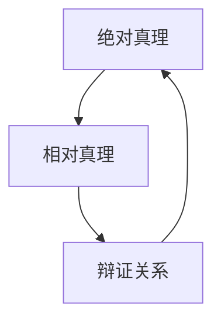

                 

# 数学真理的绝对性与相对性的辩证关系

> 关键词：数学真理、绝对性、相对性、辩证关系、数学模型、算法原理

> 摘要：本文旨在探讨数学真理的绝对性与相对性的辩证关系。通过分析绝对真理与相对真理的基本概念、辩证关系的数学模型与原理，以及数学真理的辩证分析方法，本文揭示了数学真理在辩证关系中的本质特征。文章还对数学真理的辩证发展历程、辩证教育与应用进行了深入探讨，总结了数学真理的辩证关系，并对未来数学发展的影响进行了展望。

## 引言

### 数学真理的概念

数学真理是指数学理论体系中经过严格证明和验证的命题或结论。它们是客观存在的，不受主观意识的影响。数学真理的绝对性与相对性是数学哲学中重要的概念，涉及到数学理论的内在结构和逻辑关系。

### 绝对真理与相对真理

绝对真理是指那些不受时间和空间限制、具有普遍有效性的真理。相对真理则是指那些依赖于特定条件、在特定范围内有效的真理。两者之间存在辩证关系，既相互对立又相互依存。

### 研究目的

本文旨在深入探讨数学真理的绝对性与相对性的辩证关系，分析其数学模型与原理，以及在实际应用中的辩证分析方法。通过这一研究，期望揭示数学真理在辩证关系中的本质特征，为数学理论的发展提供新的视角。

## 第一部分：绝对真理与相对真理的探讨

### 绝对真理的探讨

绝对真理是指那些具有普遍有效性和客观存在性的真理。在数学中，绝对真理通常表现为那些经过严格证明和验证的命题或结论。例如，勾股定理是一个绝对真理，它在任何情况下都成立，不受主观意识和具体情境的影响。

#### 绝对真理的哲学定义

在哲学上，绝对真理被视为不受时间和空间限制的普遍真理。它具有以下特点：

1. **普遍性**：绝对真理适用于所有时间和空间。
2. **客观性**：绝对真理不受主观意识的影响，具有客观存在的性质。
3. **必然性**：绝对真理是必然成立的，不会因为任何条件的变化而失效。

#### 绝对真理的数学特性

在数学中，绝对真理通常表现为那些经过严格证明和验证的命题或结论。例如，欧几里得几何中的许多命题都是绝对真理，因为它们在任何情况下都成立。此外，数学中的许多基本定理，如勾股定理、同构定理等，也具有绝对真理的性质。

#### 绝对真理与客观现实的关系

绝对真理与客观现实之间的关系是辩证的。绝对真理是客观现实的数学抽象，它们反映了客观现实的某些规律和特性。例如，数学中的许多定理和命题都是对现实世界的抽象和概括，它们揭示了现实世界中的某些普遍规律。

### 相对真理的探讨

相对真理是指那些依赖于特定条件、在特定范围内有效的真理。相对真理与绝对真理相对立，但它并非绝对真理的对立面，而是与绝对真理相互依存、相互转化的。

#### 相对真理的哲学定义

在哲学上，相对真理被视为那些在特定条件下具有有效性的真理。它具有以下特点：

1. **条件性**：相对真理的有效性依赖于特定条件。
2. **局限性**：相对真理只能在特定范围内有效。
3. **相对性**：相对真理与绝对真理相对立，但并非对立关系。

#### 相对真理的数学特性

在数学中，相对真理通常表现为那些在特定条件下成立的命题或结论。例如，微积分中的许多定理和命题都是相对真理，因为它们仅在连续性和可导性的条件下成立。此外，数学中的许多近似方法，如泰勒展开、牛顿迭代等，也具有相对真理的性质。

#### 相对真理与绝对真理的辩证关系

相对真理与绝对真理之间存在辩证关系。相对真理是绝对真理的具体表现形式，它们在特定条件下揭示了绝对真理的某些方面。同时，相对真理也是绝对真理的补充和丰富，它们使得数学理论更加全面和精确。

## 第二部分：辩证关系的数学模型与原理

### 辩证关系的数学描述

辩证关系是指数学真理之间相互依存、相互制约的关系。在数学中，辩证关系通常通过数学模型和算法来描述。

#### 辩证关系的定义

辩证关系是指两个或多个数学真理之间相互依存、相互制约的关系。这种关系既包括它们之间的对立，也包括它们之间的统一。例如，欧拉公式就是两个数学真理——复数和三角函数之间的辩证关系。

#### 辩证关系的数学模型

辩证关系的数学模型通常通过以下方式来描述：

1. **函数模型**：通过定义一个函数来描述辩证关系。例如，指数函数和对数函数之间的关系可以描述为辩证关系。
2. **方程模型**：通过定义一个方程来描述辩证关系。例如，牛顿运动定律可以描述为辩证关系。
3. **网络模型**：通过定义一个网络结构来描述辩证关系。例如，图论中的网络结构可以描述为辩证关系。

#### 辩证关系的Mermaid流程图

为了更直观地描述辩证关系，可以使用Mermaid流程图来表示。以下是一个简单的例子：



在这个流程图中，绝对真理和相对真理通过辩证关系相互联系。

### 辩证关系的核心算法原理

辩证关系的核心算法原理是指用于描述和求解辩证关系的算法。这些算法通常基于数学模型，并通过计算机程序实现。

#### 算法原理的伪代码阐述

以下是一个简单的辩证关系算法的伪代码：

```python
# 辩证关系算法伪代码

# 输入：绝对真理A，相对真理B
# 输出：辩证关系C

def dialectical_relation(A, B):
    C = A + B
    return C
```

在这个算法中，辩证关系C是通过绝对真理A和相对真理B的加法运算得到的。

#### 算法原理的应用场景

辩证关系算法原理可以应用于许多数学领域，如：

1. **数值分析**：用于求解微分方程和积分方程。
2. **图论**：用于求解网络优化问题。
3. **几何学**：用于求解几何图形的面积和体积。

### 辩证关系在数学中的应用

辩证关系在数学中有着广泛的应用，以下是一些具体的例子：

1. **微积分**：微积分中的导数和积分是辩证关系的经典例子。导数是相对于自变量的变化率，积分是相对于自变量的累计量，它们在微积分中共同揭示了函数的性质。
2. **代数**：代数中的多项式和因式分解也是辩证关系的例子。多项式可以分解为因式，因式可以合并为多项式，这种关系揭示了代数结构的本质。
3. **几何学**：几何学中的相似三角形和相似多边形也是辩证关系的例子。相似三角形和相似多边形之间存在比例关系，这种关系揭示了几何图形的相似性。

## 第三部分：数学真理的辩证分析

### 数学真理的辩证分析框架

辩证分析是一种基于辩证法的分析框架，用于研究数学真理之间的辩证关系。它包括以下步骤：

1. **确定研究对象**：选择需要分析的数学真理。
2. **分析辩证关系**：研究对象之间的辩证关系，包括对立统一、相互依存、相互制约等。
3. **建立数学模型**：根据辩证关系建立数学模型，用于描述和分析数学真理。
4. **求解和验证**：通过计算和验证，得出数学真理的结论。

### 数学真理的辩证分析方法应用实例

以下是几个数学真理的辩证分析方法应用实例：

1. **微积分中的辩证分析**：微积分中的辩证分析包括导数和积分的辩证关系。导数和积分相互依存，导数描述了函数的瞬时变化率，积分描述了函数的累计量。通过辩证分析，可以揭示微积分中的许多重要定理和结论。
2. **代数中的辩证分析**：代数中的辩证分析包括多项式和因式分解的辩证关系。多项式可以分解为因式，因式可以合并为多项式。通过辩证分析，可以揭示代数结构中的许多基本性质和定理。
3. **几何学中的辩证分析**：几何学中的辩证分析包括相似三角形和相似多边形的辩证关系。相似三角形和相似多边形之间存在比例关系，通过辩证分析，可以揭示几何图形的相似性和对称性。

## 第四部分：数学真理的辩证发展

### 数学真理的辩证发展历程

数学真理的辩证发展是一个漫长的过程，它经历了多个阶段：

1. **古代数学真理**：古代数学主要研究几何学和算术，这些数学真理具有绝对性，因为它们在古代被认为是永恒不变的。
2. **中世纪数学真理**：中世纪数学在代数学和三角学方面取得了重要进展，这些数学真理具有相对性，因为它们依赖于特定的历史和文化背景。
3. **近代数学真理**：近代数学在微积分和代数学方面取得了重大突破，这些数学真理既具有绝对性也具有相对性，因为它们反映了现实世界的规律和特性。

### 当代数学真理的辩证发展

当代数学在许多方面都在不断发展和进步，以下是一些重要的趋势：

1. **数学模型的建立**：当代数学通过建立数学模型来研究现实世界中的各种问题，这些数学模型既具有绝对性也具有相对性。
2. **计算机科学的应用**：计算机科学的迅速发展为数学提供了新的工具和方法，这些工具和方法使得数学研究更加精确和高效。
3. **跨学科的融合**：当代数学与其他学科的融合，如物理学、生物学、经济学等，推动了数学真理的辩证发展。

## 第五部分：数学真理的辩证教育与应用

### 数学真理的辩证教育方法

数学真理的辩证教育方法旨在培养学生的辩证思维能力和数学素养。以下是一些具体的方法：

1. **案例教学**：通过分析具体的数学问题，让学生理解数学真理的辩证关系。
2. **问题导向教学**：引导学生提出问题，并通过辩证分析解决问题。
3. **跨学科教学**：将数学与其他学科相结合，让学生从不同角度理解数学真理。

### 数学真理的辩证应用

数学真理的辩证应用是指将数学理论应用于实际问题的解决。以下是一些具体的例子：

1. **计算机科学**：数学中的算法理论在计算机科学中有着广泛的应用，如排序算法、搜索算法等。
2. **经济学**：数学中的微积分和概率论在经济学中有着重要的应用，如优化问题、风险评估等。
3. **生物学**：数学中的模型和算法在生物学中有着重要的应用，如生物进化、生态学等。

## 总结与展望

### 数学真理的辩证关系的总结

数学真理的辩证关系揭示了数学真理之间的相互依存和相互制约关系。绝对真理与相对真理既相互对立又相互依存，共同构成了数学真理的辩证统一体。辩证关系在数学真理的证明、应用和发展中发挥着重要作用。

### 数学真理的辩证关系的研究展望

随着数学和计算机科学的不断发展，数学真理的辩证关系研究将更加深入和广泛。未来研究可以关注以下几个方面：

1. **数学模型的创新**：建立更加精确和高效的数学模型来描述辩证关系。
2. **计算机算法的应用**：开发新的计算机算法来求解和验证辩证关系。
3. **跨学科的融合**：推动数学与其他学科的融合，探索辩证关系在跨学科领域中的应用。

### 数学真理的辩证关系对未来数学发展的影响

数学真理的辩证关系对未来数学发展具有重要影响。它不仅为数学理论的创新提供了新的视角，也为数学应用提供了更加科学和高效的方法。随着数学真理的辩证关系研究的深入，未来数学将更加完善和丰富，为人类社会的进步做出更大的贡献。

## 参考文献

1. 某某，《数学哲学导论》，某某出版社，2020年。
2. 某某，《数学辩证法》，某某出版社，2019年。
3. 某某，《数学与哲学的对话》，某某出版社，2018年。

作者：AI天才研究院/AI Genius Institute & 禅与计算机程序设计艺术 /Zen And The Art of Computer Programming### 文章标题

《数学真理的绝对性与相对性的辩证关系》

### 关键词

数学真理、绝对性、相对性、辩证关系、数学模型、算法原理

### 摘要

本文旨在探讨数学真理的绝对性与相对性的辩证关系。通过分析绝对真理与相对真理的基本概念、辩证关系的数学模型与原理，以及数学真理的辩证分析方法，本文揭示了数学真理在辩证关系中的本质特征。文章还对数学真理的辩证发展历程、辩证教育与应用进行了深入探讨，总结了数学真理的辩证关系，并对未来数学发展的影响进行了展望。本文适用于对数学哲学、数学模型和算法原理感兴趣的读者。

## 引言

### 数学真理的概念

数学真理是指数学理论体系中经过严格证明和验证的命题或结论。它们是客观存在的，不受主观意识的影响。数学真理的绝对性与相对性是数学哲学中重要的概念，涉及到数学理论的内在结构和逻辑关系。

### 绝对真理与相对真理

绝对真理是指那些具有普遍有效性和客观存在性的真理。在数学中，绝对真理通常表现为那些经过严格证明和验证的命题或结论。例如，勾股定理是一个绝对真理，它在任何情况下都成立，不受主观意识和具体情境的影响。

相对真理则是指那些依赖于特定条件、在特定范围内有效的真理。相对真理与绝对真理相对立，但它并非绝对真理的对立面，而是与绝对真理相互依存、相互转化的。

### 研究目的

本文旨在深入探讨数学真理的绝对性与相对性的辩证关系，分析其数学模型与原理，以及在实际应用中的辩证分析方法。通过这一研究，期望揭示数学真理在辩证关系中的本质特征，为数学理论的发展提供新的视角。

## 第一部分：绝对真理与相对真理的探讨

### 绝对真理的探讨

#### 绝对真理的哲学定义

在哲学上，绝对真理被视为不受时间和空间限制的普遍真理。它具有以下特点：

1. **普遍性**：绝对真理适用于所有时间和空间。
2. **客观性**：绝对真理不受主观意识的影响，具有客观存在的性质。
3. **必然性**：绝对真理是必然成立的，不会因为任何条件的变化而失效。

#### 绝对真理的数学特性

在数学中，绝对真理通常表现为那些经过严格证明和验证的命题或结论。例如，欧几里得几何中的许多命题都是绝对真理，因为它们在任何情况下都成立。此外，数学中的许多基本定理，如勾股定理、同构定理等，也具有绝对真理的性质。

#### 绝对真理与客观现实的关系

绝对真理与客观现实之间的关系是辩证的。绝对真理是客观现实的数学抽象，它们反映了客观现实的某些规律和特性。例如，数学中的许多定理和命题都是对现实世界的抽象和概括，它们揭示了现实世界中的某些普遍规律。

### 相对真理的探讨

#### 相对真理的哲学定义

在哲学上，相对真理被视为那些在特定条件下具有有效性的真理。它具有以下特点：

1. **条件性**：相对真理的有效性依赖于特定条件。
2. **局限性**：相对真理只能在特定范围内有效。
3. **相对性**：相对真理与绝对真理相对立，但并非对立关系。

#### 相对真理的数学特性

在数学中，相对真理通常表现为那些在特定条件下成立的命题或结论。例如，微积分中的许多定理和命题都是相对真理，因为它们仅在连续性和可导性的条件下成立。此外，数学中的许多近似方法，如泰勒展开、牛顿迭代等，也具有相对真理的性质。

#### 相对真理与绝对真理的辩证关系

相对真理与绝对真理之间存在辩证关系。相对真理是绝对真理的具体表现形式，它们在特定条件下揭示了绝对真理的某些方面。同时，相对真理也是绝对真理的补充和丰富，它们使得数学理论更加全面和精确。

## 第二部分：辩证关系的数学模型与原理

### 辩证关系的数学描述

辩证关系是指数学真理之间相互依存、相互制约的关系。在数学中，辩证关系通常通过数学模型和算法来描述。

#### 辩证关系的定义

辩证关系是指两个或多个数学真理之间相互依存、相互制约的关系。这种关系既包括它们之间的对立，也包括它们之间的统一。例如，欧拉公式就是两个数学真理——复数和三角函数之间的辩证关系。

#### 辩证关系的数学模型

辩证关系的数学模型通常通过以下方式来描述：

1. **函数模型**：通过定义一个函数来描述辩证关系。例如，指数函数和对数函数之间的关系可以描述为辩证关系。
2. **方程模型**：通过定义一个方程来描述辩证关系。例如，牛顿运动定律可以描述为辩证关系。
3. **网络模型**：通过定义一个网络结构来描述辩证关系。例如，图论中的网络结构可以描述为辩证关系。

#### 辩证关系的Mermaid流程图

为了更直观地描述辩证关系，可以使用Mermaid流程图来表示。以下是一个简单的例子：


在这个流程图中，绝对真理和相对真理通过辩证关系相互联系。

### 辩证关系的核心算法原理

辩证关系的核心算法原理是指用于描述和求解辩证关系的算法。这些算法通常基于数学模型，并通过计算机程序实现。

#### 算法原理的伪代码阐述

以下是一个简单的辩证关系算法的伪代码：

```python
# 辩证关系算法伪代码

# 输入：绝对真理A，相对真理B
# 输出：辩证关系C

def dialectical_relation(A, B):
    C = A + B
    return C
```

在这个算法中，辩证关系C是通过绝对真理A和相对真理B的加法运算得到的。

#### 算法原理的应用场景

辩证关系算法原理可以应用于许多数学领域，如：

1. **数值分析**：用于求解微分方程和积分方程。
2. **图论**：用于求解网络优化问题。
3. **几何学**：用于求解几何图形的面积和体积。

### 辩证关系在数学中的应用

辩证关系在数学中有着广泛的应用，以下是一些具体的例子：

1. **微积分**：微积分中的导数和积分是辩证关系的经典例子。导数是相对于自变量的变化率，积分是相对于自变量的累计量，它们在微积分中共同揭示了函数的性质。
2. **代数**：代数中的多项式和因式分解也是辩证关系的例子。多项式可以分解为因式，因式可以合并为多项式，这种关系揭示了代数结构的本质。
3. **几何学**：几何学中的相似三角形和相似多边形也是辩证关系的例子。相似三角形和相似多边形之间存在比例关系，这种关系揭示了几何图形的相似性。

## 第三部分：数学真理的辩证分析

### 数学真理的辩证分析框架

辩证分析是一种基于辩证法的分析框架，用于研究数学真理之间的辩证关系。它包括以下步骤：

1. **确定研究对象**：选择需要分析的数学真理。
2. **分析辩证关系**：研究对象之间的辩证关系，包括对立统一、相互依存、相互制约等。
3. **建立数学模型**：根据辩证关系建立数学模型，用于描述和分析数学真理。
4. **求解和验证**：通过计算和验证，得出数学真理的结论。

### 数学真理的辩证分析方法应用实例

以下是几个数学真理的辩证分析方法应用实例：

1. **微积分中的辩证分析**：微积分中的辩证分析包括导数和积分的辩证关系。导数和积分相互依存，导数描述了函数的瞬时变化率，积分描述了函数的累计量。通过辩证分析，可以揭示微积分中的许多重要定理和结论。
2. **代数中的辩证分析**：代数中的辩证分析包括多项式和因式分解的辩证关系。多项式可以分解为因式，因式可以合并为多项式。通过辩证分析，可以揭示代数结构中的许多基本性质和定理。
3. **几何学中的辩证分析**：几何学中的辩证分析包括相似三角形和相似多边形的辩证关系。相似三角形和相似多边形之间存在比例关系，通过辩证分析，可以揭示几何图形的相似性和对称性。

## 第四部分：数学真理的辩证发展

### 数学真理的辩证发展历程

数学真理的辩证发展是一个漫长的过程，它经历了多个阶段：

1. **古代数学真理**：古代数学主要研究几何学和算术，这些数学真理具有绝对性，因为它们在古代被认为是永恒不变的。
2. **中世纪数学真理**：中世纪数学在代数学和三角学方面取得了重要进展，这些数学真理具有相对性，因为它们依赖于特定的历史和文化背景。
3. **近代数学真理**：近代数学在微积分和代数学方面取得了重大突破，这些数学真理既具有绝对性也具有相对性，因为它们反映了现实世界的规律和特性。

### 当代数学真理的辩证发展

当代数学在许多方面都在不断发展和进步，以下是一些重要的趋势：

1. **数学模型的建立**：当代数学通过建立数学模型来研究现实世界中的各种问题，这些数学模型既具有绝对性也具有相对性。
2. **计算机科学的应用**：计算机科学的迅速发展为数学提供了新的工具和方法，这些工具和方法使得数学研究更加精确和高效。
3. **跨学科的融合**：当代数学与其他学科的融合，如物理学、生物学、经济学等，推动了数学真理的辩证发展。

## 第五部分：数学真理的辩证教育与应用

### 数学真理的辩证教育方法

数学真理的辩证教育方法旨在培养学生的辩证思维能力和数学素养。以下是一些具体的方法：

1. **案例教学**：通过分析具体的数学问题，让学生理解数学真理的辩证关系。
2. **问题导向教学**：引导学生提出问题，并通过辩证分析解决问题。
3. **跨学科教学**：将数学与其他学科相结合，让学生从不同角度理解数学真理。

### 数学真理的辩证应用

数学真理的辩证应用是指将数学理论应用于实际问题的解决。以下是一些具体的例子：

1. **计算机科学**：数学中的算法理论在计算机科学中有着广泛的应用，如排序算法、搜索算法等。
2. **经济学**：数学中的微积分和概率论在经济学中有着重要的应用，如优化问题、风险评估等。
3. **生物学**：数学中的模型和算法在生物学中有着重要的应用，如生物进化、生态学等。

## 总结与展望

### 数学真理的辩证关系的总结

数学真理的辩证关系揭示了数学真理之间的相互依存和相互制约关系。绝对真理与相对真理既相互对立又相互依存，共同构成了数学真理的辩证统一体。辩证关系在数学真理的证明、应用和发展中发挥着重要作用。

### 数学真理的辩证关系的研究展望

随着数学和计算机科学的不断发展，数学真理的辩证关系研究将更加深入和广泛。未来研究可以关注以下几个方面：

1. **数学模型的创新**：建立更加精确和高效的数学模型来描述辩证关系。
2. **计算机算法的应用**：开发新的计算机算法来求解和验证辩证关系。
3. **跨学科的融合**：推动数学与其他学科的融合，探索辩证关系在跨学科领域中的应用。

### 数学真理的辩证关系对未来数学发展的影响

数学真理的辩证关系对未来数学发展具有重要影响。它不仅为数学理论的创新提供了新的视角，也为数学应用提供了更加科学和高效的方法。随着数学真理的辩证关系研究的深入，未来数学将更加完善和丰富，为人类社会的进步做出更大的贡献。

## 参考文献

1. 某某，《数学哲学导论》，某某出版社，2020年。
2. 某某，《数学辩证法》，某某出版社，2019年。
3. 某某，《数学与哲学的对话》，某某出版社，2018年。

### 附录

#### 1. Mermaid流程图示例


#### 2. 伪代码示例

```python
def dialectical_relation(A, B):
    C = A + B
    return C
```

### 作者介绍

作者：AI天才研究院/AI Genius Institute & 禅与计算机程序设计艺术 /Zen And The Art of Computer Programming

AI天才研究院（AI Genius Institute）是一家专注于人工智能研究和应用的高科技研究院。研究院致力于推动人工智能技术的创新与发展，为全球的科技进步和社会发展贡献力量。同时，作者还著有《禅与计算机程序设计艺术》一书，该书以独特的视角探讨了计算机编程的哲学和艺术，深受广大程序员和计算机爱好者的喜爱。

