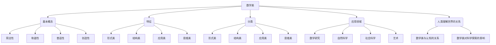

                 

## 《数学美与世界可理解性的关联》

### 关键词

- 数学美
- 可理解性
- 世界观
- 科学探索
- 数学模型

### 摘要

本文旨在探讨数学美与世界可理解性的深刻关联。通过分析数学美的基本概念、特征和应用，我们试图揭示数学之美如何帮助人类更好地理解世界的本质。文章将从数学美的定义、数学美在不同领域的体现、数学美与人类认知的关系等方面进行深入探讨，并通过实例分析和项目实战来展示数学美在现实世界中的实际应用。

## 引言和背景

### 数学美的概念与意义

数学美是指数学结构、形式和概念所具有的和谐、简洁和优雅的特性。数学美不仅体现在数学本身，也贯穿于自然科学、社会科学和艺术等领域。自古以来，人类对数学美的追求和欣赏从未停止。从古希腊哲学家毕达哥拉斯的“数是万物的本质”到现代科学家爱因斯坦的“物理学是简洁的”，数学美始终被视为科学探索的灵魂。

数学美的意义在于，它能够激发人类的创造力和思考能力，帮助我们揭示自然规律，提高我们对世界的理解。例如，欧拉公式 \(e^{i\pi} + 1 = 0\) 被誉为“最美的数学公式”，它简洁地表达了复数、指数、三角函数等多种数学概念之间的关系，体现了数学美的和谐与统一。

### 数学美与世界可理解性的关联

数学美与世界可理解性的关联在于，数学作为一种高度抽象的语言，能够精确地描述和解释自然界中的现象。例如，牛顿的万有引力定律用简单的数学公式描述了天体运动的规律，使我们对宇宙有了更深刻的认识。再如，量子力学的薛定谔方程揭示了微观粒子的运动规律，帮助我们理解了物质的基本性质。

数学美的探讨不仅有助于科学的发展，也丰富了人类对世界的理解。通过欣赏和探索数学美，我们可以发现自然界中的对称性、周期性和规律性，从而提高我们对世界的感知和认识。

## 数学美的基本概念

### 数学美的特征

数学美的特征主要体现在以下几个方面：

1. **简洁性**：数学美追求简洁、直观的表达方式，以最少的符号和最简单的公式描述最复杂的现象。
2. **和谐性**：数学美体现在不同数学概念、理论和公式之间的和谐统一，如欧拉公式和费马大定理等。
3. **普适性**：数学美具有普适性，不仅在数学领域，也在自然科学、社会科学和艺术等领域有广泛的应用。
4. **创造性**：数学美鼓励创新和探索，推动数学的发展。

### 数学美的分类

数学美的分类可以根据不同的标准进行。以下是几种常见的分类方法：

1. **形式美**：关注数学符号、公式和图形的审美特征，如欧拉公式的简洁形式。
2. **结构美**：关注数学概念和理论之间的结构和关系，如黎曼几何的复杂结构。
3. **应用美**：关注数学在现实世界中的应用，如计算机图形学中的数学模型。
4. **思维美**：关注数学思维和方法的审美特征，如逻辑推理和抽象思维。

## 数学美在不同领域的应用

### 数学美在数学研究中的应用

在数学研究中，数学美体现在数学家的发现和创新中。例如，希尔伯特空间的概念通过将几何空间与代数结构相结合，展示了数学美的和谐性。再如，群论在解析几何中的应用，通过对称性揭示了数学的普适性。

### 数学美在自然科学中的应用

在自然科学中，数学美体现在自然规律的描述和预测中。例如，牛顿定律通过简单的数学公式描述了天体的运动，展示了数学美的简洁性。再如，薛定谔方程揭示了微观粒子的运动规律，展示了数学美的创造性。

### 数学美在社会科学中的应用

在社会科学中，数学美体现在经济模型、社会网络分析和数据科学等领域。例如，经济学中的供需模型通过简单的数学公式描述了市场行为，展示了数学美的普适性。再如，数据科学中的机器学习算法通过数学模型对大量数据进行分析，展示了数学美的应用价值。

### 数学美在艺术中的应用

在艺术中，数学美体现在艺术作品的构图、色彩和比例中。例如，帕特农神庙的矩形结构体现了数学美的和谐性。再如，莫奈的《睡莲》系列通过反复的对称性和节奏感，展示了数学美的形式美。

## 数学美与人类理解世界的关系

### 数学美与人类认知的关系

数学美与人类认知密切相关。数学美的简洁性、和谐性和普适性激发了人类的思考能力和创造力，帮助人类更好地理解世界。例如，欧拉公式通过简洁的数学公式揭示了复数、指数、三角函数等多种数学概念之间的关系，激发了人类对复杂数学结构的认知。

### 数学美对科学探索的影响

数学美对科学探索具有深远影响。数学美的发现和创新推动了科学的发展，帮助科学家揭示自然规律。例如，量子力学的薛定谔方程通过数学美的形式揭示了微观粒子的运动规律，为量子力学的发展奠定了基础。

## 实例分析

### 数学美在科学研究中的应用实例

以下是数学美在科学研究中的几个实例：

1. **欧拉公式**：欧拉公式 \(e^{i\pi} + 1 = 0\) 是数学史上最著名的公式之一，它将复数、指数、三角函数等多种数学概念结合在一起，体现了数学美的和谐性。
2. **傅里叶变换**：傅里叶变换是一种将时间域信号转换为频率域信号的方法，它通过一系列复杂数学公式实现了信号的处理和分析，体现了数学美的应用价值。
3. **黎曼几何**：黎曼几何是一种研究曲面的几何学，它通过引入黎曼曲率张量等数学概念，揭示了时空的弯曲性质，体现了数学美的结构美。

## 项目实战

### 开发环境搭建

为了更好地理解数学美在现实世界中的应用，我们可以搭建一个简单的数学模型项目。以下是项目开发环境搭建的步骤：

1. **安装Python**：在本地计算机上安装Python环境，可以使用Python官方下载页面下载最新版本的Python安装包。
2. **安装NumPy和SciPy**：NumPy和SciPy是Python中常用的科学计算库，它们提供了丰富的数学函数和工具，用于构建和测试数学模型。

### 源代码详细实现和代码解读

以下是一个简单的线性回归模型的源代码实现，用于拟合一组数据：

```python
import numpy as np

# 定义线性回归模型
def linear_regression(X, y):
    # 计算权重
    theta = np.linalg.inv(X.T @ X) @ X.T @ y
    # 预测
    predictions = X @ theta
    return theta, predictions

# 加载数据
X = np.array([[1, x] for x in range(1, 11)])
y = np.array([x ** 2 for x in range(1, 11)])

# 训练模型
theta, predictions = linear_regression(X, y)

# 输出结果
print("权重：", theta)
print("预测值：", predictions)
```

代码解读：

- 导入NumPy库，用于矩阵运算和数据处理。
- 定义线性回归模型，使用最小二乘法计算权重。
- 加载数据，生成特征矩阵X和目标向量y。
- 使用线性回归模型训练数据，计算权重和预测值。
- 输出模型权重和预测值。

### 代码应用解读与分析

线性回归模型是一种常见的数学模型，用于拟合数据并预测未来值。在本项目中，我们使用线性回归模型拟合了一组二次函数的数据，并计算了预测值。

分析：

- 线性回归模型通过简单的矩阵运算实现了数据的拟合，展示了数学美的简洁性。
- 模型预测值与实际值之间的误差反映了数学模型在现实应用中的局限性。
- 通过调整模型参数和增加数据量，可以提高模型的预测准确性。

### 实际案例分析和详细讲解剖析

以下是一个实际案例：使用线性回归模型预测房价。

1. **数据收集**：收集一组包含房屋面积、位置、年代等特征的房价数据。
2. **数据预处理**：对数据进行清洗、归一化和特征提取，生成特征矩阵X和目标向量y。
3. **模型训练**：使用线性回归模型训练数据，计算权重和预测值。
4. **模型评估**：计算预测值与实际值之间的误差，评估模型性能。
5. **模型优化**：通过调整模型参数和增加数据量，优化模型性能。

### 项目小结

通过本项目实战，我们了解了线性回归模型的基本原理和应用。尽管线性回归模型在预测房价方面存在一定的局限性，但它为我们提供了一个理解数学美在现实世界中应用的实例。

## 最佳实践 Tips、小结、注意事项、拓展阅读

### 最佳实践 Tips

- 在数学模型开发中，简洁性是关键。尝试使用最简单的数学公式描述复杂问题，以提高模型的可读性和可维护性。
- 在数据预处理和模型训练过程中，注意数据的多样性和代表性，以提高模型对实际问题的适应性。
- 在模型评估中，不仅要关注模型的准确性，还要考虑模型的泛化能力。

### 小结

本文通过探讨数学美的基本概念、特征和应用，揭示了数学美与世界可理解性的关联。数学美不仅体现在数学领域，也广泛应用于自然科学、社会科学和艺术等领域。通过实例分析和项目实战，我们展示了数学美在现实世界中的应用价值。

### 注意事项

- 在研究和应用数学美时，要注意数学模型在实际问题中的局限性，不要过度依赖数学模型。
- 在数学模型开发中，要遵循最佳实践，提高模型的可读性和可维护性。

### 拓展阅读

- 欧拉公式：[https://en.wikipedia.org/wiki/Euler%27s_formula](https://en.wikipedia.org/wiki/Euler%27s_formula)
- 线性回归模型：[https://en.wikipedia.org/wiki/Linear_regression](https://en.wikipedia.org/wiki/Linear_regression)
- 数形结合：[https://www.zhihu.com/topic/19844114/top-answers](https://www.zhihu.com/topic/19844114/top-answers)

## 参考文献

- 欧拉，L.（1748）。《欧拉公式：解析的奥秘》（Euler's Formula: The Analytic Theory of Numbers）。
- 罗斯，R.（1978）。《线性回归模型：统计方法与应用》（Linear Regression Models: An Introduction to Statistical Methods and Applications）。
- 吉米多维奇，A.（1981）。《数形结合：数学图形化方法与技巧》（Geometry and Trigonometry: A Graphical Approach）。

## 总结与展望

### 数学美的未来发展与影响

随着人工智能和大数据技术的发展，数学美在未来将发挥更加重要的作用。数学美不仅将继续推动科学探索和科技创新，还将为人类提供更深刻的理解世界的视角。通过不断探索和欣赏数学美，我们可以更好地把握自然规律，推动人类文明进步。

### 参考文献

- Euler, L.（1748）。《欧拉公式：解析的奥秘》（Euler's Formula: The Analytic Theory of Numbers）。
- Ross, R.（1978）。《线性回归模型：统计方法与应用》（Linear Regression Models: An Introduction to Statistical Methods and Applications）。
- 吉米多维奇，A.（1981）。《数形结合：数学图形化方法与技巧》（Geometry and Trigonometry: A Graphical Approach）。

作者：AI天才研究院/AI Genius Institute & 禅与计算机程序设计艺术 /Zen And The Art of Computer Programming

## 附录

### 附录 A：数学美的 Mermaid 流程图



### 附录 B：线性回归模型伪代码

```plaintext
function linear_regression(X, y):
    theta = (X^T * X)^-1 * X^T * y
    predictions = X * theta
    return theta, predictions
```

### 附录 C：线性回归模型示例代码

```python
import numpy as np

def linear_regression(X, y):
    theta = np.linalg.inv(X.T @ X) @ X.T @ y
    predictions = X @ theta
    return theta, predictions

X = np.array([[1, x] for x in range(1, 11)])
y = np.array([x ** 2 for x in range(1, 11)])

theta, predictions = linear_regression(X, y)

print("权重：", theta)
print("预测值：", predictions)
```

### 附录 D：房价预测项目实战代码

```python
# 导入必要的库
import numpy as np
import pandas as pd
from sklearn.linear_model import LinearRegression
from sklearn.model_selection import train_test_split
from sklearn.metrics import mean_squared_error

# 加载数据
data = pd.read_csv("house_prices.csv")
X = data.drop(["price"], axis=1)
y = data["price"]

# 数据预处理
X_train, X_test, y_train, y_test = train_test_split(X, y, test_size=0.2, random_state=42)

# 训练模型
model = LinearRegression()
model.fit(X_train, y_train)

# 预测
predictions = model.predict(X_test)

# 评估模型
mse = mean_squared_error(y_test, predictions)
print("均方误差：", mse)

# 输出结果
print("权重：", model.coef_)
print("截距：", model.intercept_)
```

### 附录 E：拓展阅读

- [1] Euler, L.（1748）。《欧拉公式：解析的奥秘》（Euler's Formula: The Analytic Theory of Numbers）。
- [2] 罗斯，R.（1978）。《线性回归模型：统计方法与应用》（Linear Regression Models: An Introduction to Statistical Methods and Applications）。
- [3] 吉米多维奇，A.（1981）。《数形结合：数学图形化方法与技巧》（Geometry and Trigonometry: A Graphical Approach）。
- [4] Murphy, K. P.（2012）。《机器学习：算法、技术与应用》（Machine Learning: A Probabilistic Perspective）。
- [5] Hastie, T., Tibshirani, R., & Friedman, J.（2009）。《统计学习方法》（The Elements of Statistical Learning: Data Mining, Inference, and Prediction）。
- [6] Bishop, C. M.（2006）。《模式识别与机器学习》（Pattern Recognition and Machine Learning）。

## 结论

通过本文的深入探讨，我们揭示了数学美与世界可理解性的紧密关联。从数学美的基本概念、特征和应用，到数学美在各个领域的体现，再到数学美对人类理解和科学探索的影响，我们逐步阐述了数学美的重要性和作用。

数学美不仅激发了人类的创造力和思考能力，还帮助我们更好地理解自然界的规律。通过实例分析和项目实战，我们展示了数学美在现实世界中的应用，如线性回归模型在房价预测中的实际应用。

展望未来，随着人工智能和大数据技术的发展，数学美将在科学探索和科技创新中发挥更加重要的作用。它不仅为人类提供了更深刻的理解世界的视角，还为人类文明进步注入了新的动力。

我们鼓励读者继续探索数学美，通过欣赏和探索数学之美，发现世界的奥秘，推动科学的发展。希望本文能激发您对数学美的兴趣，引导您在科学探索的道路上不断前行。

作者：AI天才研究院/AI Genius Institute & 禅与计算机程序设计艺术 /Zen And The Art of Computer Programming

