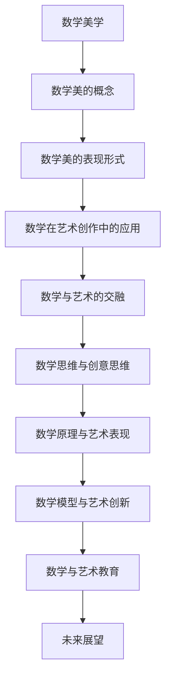
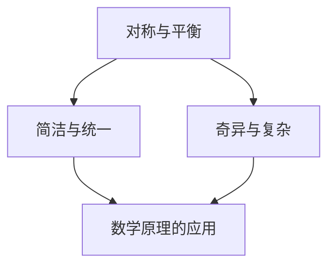

                 

### 文章标题

《数学美学与艺术创作的启示》

关键词：数学美学、艺术创作、数学原理、创意思维

摘要：本文从数学美学与艺术创作的角度出发，探讨数学在艺术创作中的应用，分析数学美学的核心概念和原理，以及数学思维与创意思维的融合。文章旨在为读者提供对数学与艺术关系的深入理解，并启发艺术家们在创作中运用数学原理，提高艺术作品的审美价值。

### 目录大纲

## 第一部分：数学美学概述

### 第1章：数学与艺术的交融

#### 1.1 数学美学的概念

##### 1.1.1 数学的本质与美感

##### 1.1.2 艺术与数学的关系

#### 1.2 数学美的表现形式

##### 1.2.1 对称与平衡

##### 1.2.2 简洁与统一

##### 1.2.3 奇异与复杂

## 第2章：数学在艺术创作中的应用

### 第2章：数学在艺术创作中的应用

#### 2.1 几何艺术

##### 2.1.1 几何图形的基本性质

##### 2.1.2 几何图形在艺术创作中的运用

#### 2.2 数字艺术

##### 2.2.1 数字艺术的概念与发展

##### 2.2.2 数码技术在艺术创作中的应用

#### 2.3 音乐艺术

##### 2.3.1 音乐中的数学原理

##### 2.3.2 数学在音乐创作中的应用

## 第二部分：数学在艺术创作中的启示

### 第3章：数学思维与创意思维

#### 3.1 数学思维的特征

##### 3.1.1 演绎思维与归纳思维

##### 3.1.2 逻辑思维与直觉思维

#### 3.2 创意思维的方法

##### 3.2.1 联想思维与类比思维

##### 3.2.2 逆向思维与发散思维

### 3.3 数学思维在艺术创作中的启示

#### 3.3.1 数学思维与艺术创新的结合

#### 3.3.2 数学方法在艺术创作中的应用

### 第4章：数学原理与艺术表现

#### 4.1 数学原理在绘画中的运用

##### 4.1.1 色彩的数学原理

##### 4.1.2 形态的数学原理

#### 4.2 数学原理在雕塑中的运用

##### 4.2.1 空间关系的数学原理

##### 4.2.2 结构的数学原理

#### 4.3 数学原理在建筑中的运用

##### 4.3.1 形态与结构的数学原理

##### 4.3.2 比例与和谐的数学原理

### 第5章：数学模型与艺术创新

#### 5.1 数学模型在艺术创作中的应用

##### 5.1.1 分形理论在艺术创作中的应用

##### 5.1.2 线性规划在艺术设计中的应用

#### 5.2 数学模型与艺术创新

##### 5.2.1 数学模型在艺术创作中的创新应用

##### 5.2.2 艺术创作对数学模型的需求

### 第6章：数学与艺术教育

#### 6.1 数学在艺术教育中的重要性

##### 6.1.1 数学素养与艺术素养的融合

##### 6.1.2 数学教育在艺术教育中的应用

#### 6.2 艺术教育中的数学元素

##### 6.2.1 数学在绘画教学中的应用

##### 6.2.2 数学在音乐教学中的应用

### 第7章：未来展望

#### 7.1 数学与艺术的未来发展

##### 7.1.1 新技术的发展对数学与艺术的影响

##### 7.1.2 数学与艺术的融合前景

#### 7.2 数学美学的传播与普及

##### 7.2.1 数学美学的推广策略

##### 7.2.2 数学美学在艺术教育中的实施建议

### 附录

#### 附录 A：数学美学与艺术创作资源

##### 附录 A.1 数学美学参考书目

##### 附录 A.2 艺术创作参考书目

##### 附录 A.3 数学与艺术相关网站和平台

#### 附录 B：数学美学与艺术创作案例

##### 附录 B.1 几何艺术案例分析

##### 附录 B.2 数字艺术案例分析

##### 附录 B.3 音乐艺术案例分析

---

## 第一部分：数学美学概述

### 核心概念原理和架构的 Mermaid 流程图



### 核心算法原理讲解

#### 2.1.1 对称与平衡的数学原理

对称性是数学美学中的重要概念，它涉及对称轴、对称中心等概念。以下是对称与平衡的数学原理的伪代码说明：

```plaintext
// 定义对称轴
defineSymmetryAxis(axis, point, angle) {
    // 根据输入参数，计算对称轴
    // 返回对称轴的方程
}

// 定义平衡点
defineBalancePoint(point, masses) {
    // 根据输入参数，计算平衡点
    // 返回平衡点的坐标
}
```

## 第一部分：数学美学概述

### 数学美学的概念

数学美学是研究数学在艺术创作中的应用和表现的一门学科。它探讨数学概念、原理和方法如何与艺术创作相结合，产生出独特的审美体验。数学美学的核心在于揭示数学中的美感元素，如对称、平衡、简洁、统一等，并探讨这些元素在艺术创作中的运用。

#### 数学的本质与美感

数学是一门严谨的科学，它通过逻辑推理和证明来建立理论体系。然而，数学中的一些基本概念和原理，如对称、比例、和谐等，本身就具有美感。例如，斐波那契数列在自然界中广泛存在，其比例关系被认为具有极高的审美价值。

#### 艺术与数学的关系

艺术与数学之间的关系自古以来就存在。古希腊哲学家毕达哥拉斯认为，音乐和数学之间存在紧密的联系。他在《和谐论》中提出了音程的数学比例，为音乐创作提供了数学基础。此外，许多著名的艺术家，如达芬奇、毕加索等，都在作品中运用了数学原理。

#### 数学美的表现形式

数学美学的表现形式多种多样，主要包括以下几个方面：

##### 1. 对称与平衡

对称性是数学美学中最基本的概念之一。它通过在空间中重复相同的元素，形成和谐的整体。平衡则是在视觉或听觉上形成的稳定感，通过对比和均衡来实现。

##### 2. 简洁与统一

简洁是指艺术作品在形式上追求简洁明了，避免过多的装饰和细节。统一则是指艺术作品在整体上保持一致的视觉或听觉效果，使观众产生整体感。

##### 3. 奇异与复杂

奇异与复杂是数学美学的另一种表现形式。奇异是指在数学中出现的特殊现象或结果，如混沌理论中的蝴蝶效应。复杂则是指通过复杂的数学关系和结构，创造出独特的艺术效果。

### 数学在艺术创作中的应用

数学不仅在理论上具有美感，而且在实际的艺术创作中也具有广泛的应用。以下将介绍数学在几种主要艺术形式中的应用：

#### 几何艺术

几何艺术是通过几何图形来表现艺术的一种形式。几何图形具有简洁、明确和有序的特点，可以通过对称性、比例和和谐关系来创造出美丽的作品。

##### 1. 几何图形的基本性质

几何图形的基本性质包括点、线、面和体。这些基本元素可以通过组合和变换，形成各种复杂的几何结构。

##### 2. 几何图形在艺术创作中的运用

几何图形在艺术创作中的应用非常广泛，如立体派绘画、抽象艺术、建筑等。通过运用几何图形的规律和关系，艺术家可以创造出独特而美丽的艺术作品。

#### 数字艺术

数字艺术是利用计算机技术进行艺术创作的一种形式。计算机算法和数学模型在数字艺术创作中起着重要的作用。

##### 1. 数字艺术的概念与发展

数字艺术是指通过计算机技术进行创作的艺术形式，包括图像处理、动画、虚拟现实等。随着计算机技术的发展，数字艺术的形式和内容不断丰富。

##### 2. 数码技术在艺术创作中的应用

数码技术在艺术创作中的应用非常广泛，如数字绘画、三维建模、虚拟现实等。通过运用数字技术和数学模型，艺术家可以创造出丰富多样、充满创意的艺术作品。

#### 音乐艺术

音乐艺术是通过声音来表达情感和思想的一种艺术形式。音乐中的许多元素，如音高、节奏、和声等，都可以用数学来描述和解释。

##### 1. 音乐中的数学原理

音乐中的数学原理包括音程、和弦、节奏等。音程和和弦的比例关系可以用数学中的比例和调和理论来解释。

##### 2. 数学在音乐创作中的应用

数学在音乐创作中的应用体现在音符的排列、和声的构建、旋律的编排等方面。通过运用数学原理，作曲家可以创造出富有创意和美感的音乐作品。

### 数学思维与创意思维

数学思维和创意思维是两种不同的思维方式，但在艺术创作中，它们可以相互结合，产生出独特的创意。

#### 数学思维的特征

数学思维的特征包括：

##### 1. 演绎思维与归纳思维

演绎思维是从一般到特殊的推理过程，归纳思维是从特殊到一般的推理过程。在艺术创作中，演绎思维可以帮助艺术家从理论中推导出具体的创意，而归纳思维则可以帮助艺术家从实践中总结出新的理论。

##### 2. 逻辑思维与直觉思维

逻辑思维是遵循逻辑规则进行推理，直觉思维则是依靠直觉和灵感进行思考。在艺术创作中，逻辑思维可以帮助艺术家保持创作的系统性，而直觉思维则可以帮助艺术家突破传统，创造出独特的作品。

#### 创意思维的方法

创意思维的方法包括：

##### 1. 联想思维与类比思维

联想思维是通过将不同的事物进行关联，产生新的创意。类比思维则是通过将一个问题与另一个问题进行类比，找到解决方案。

##### 2. 逆向思维与发散思维

逆向思维是从问题的反面进行思考，发散思维则是从多个角度出发，寻找解决问题的方案。

### 数学思维在艺术创作中的启示

数学思维在艺术创作中的启示包括：

#### 1. 数学思维与艺术创新的结合

数学思维可以帮助艺术家在创作中保持逻辑性和系统性，从而提高艺术创作的质量。同时，艺术家的创意思维可以激发数学思维的创新，为数学美学的研究提供新的思路。

#### 2. 数学方法在艺术创作中的应用

数学方法，如比例、对称、和谐等，在艺术创作中具有广泛的应用。通过运用这些方法，艺术家可以创造出具有审美价值的艺术作品。

## 第1章：数学与艺术的交融

### 数学美学的概念

数学美学是研究数学在艺术创作中的应用和表现的一门学科。它探讨数学概念、原理和方法如何与艺术创作相结合，产生出独特的审美体验。数学美学的核心在于揭示数学中的美感元素，如对称、平衡、简洁、统一等，并探讨这些元素在艺术创作中的运用。

#### 数学美的概念与内涵

数学美是数学中的一种独特美感，它体现在数学的严谨性、简洁性、和谐性等方面。数学美的内涵包括：

1. **严谨性**：数学是一门严谨的科学，它的结论是通过逻辑推理和证明得出的，这种严谨性给人以信任和美感。
2. **简洁性**：数学表达往往简洁明了，用最少的符号和语言表达出丰富的含义，这种简洁性给人以美感。
3. **和谐性**：数学中的比例、对称、节奏等元素常常具有和谐的美感，这些元素在艺术创作中的应用使得数学美得以展现。

#### 数学美的表现形式

数学美的表现形式多种多样，主要包括以下几个方面：

1. **对称与平衡**：对称性是数学美学中最基本的概念之一。它通过在空间中重复相同的元素，形成和谐的整体。平衡则是在视觉或听觉上形成的稳定感，通过对比和均衡来实现。
2. **简洁与统一**：简洁是指艺术作品在形式上追求简洁明了，避免过多的装饰和细节。统一则是指艺术作品在整体上保持一致的视觉或听觉效果，使观众产生整体感。
3. **奇异与复杂**：奇异是指在数学中出现的特殊现象或结果，如混沌理论中的蝴蝶效应。复杂则是指通过复杂的数学关系和结构，创造出独特的艺术效果。

### 艺术与数学的关系

艺术与数学之间的关系自古以来就存在。古希腊哲学家毕达哥拉斯认为，音乐和数学之间存在紧密的联系。他在《和谐论》中提出了音程的数学比例，为音乐创作提供了数学基础。此外，许多著名的艺术家，如达芬奇、毕加索等，都在作品中运用了数学原理。

#### 毕达哥拉斯与数学美学

毕达哥拉斯是古希腊著名的哲学家和数学家，他提出了著名的毕达哥拉斯定理，即直角三角形的两条直角边的平方和等于斜边的平方。毕达哥拉斯认为，宇宙中的和谐是由数学原理构成的，音乐中的音程比例也是数学关系的体现。他提出的“万物皆数”的观点，揭示了数学在宇宙和自然界中的普遍存在。

#### 艺术创作中的数学原理

在艺术创作中，数学原理被广泛应用，以下是一些具体的例子：

1. **对称性**：对称性在绘画、雕塑和建筑设计中广泛应用。例如，达芬奇的画作《蒙娜丽莎》就具有极高的对称性，使人产生和谐的美感。
2. **比例与和谐**：比例关系在绘画和建筑设计中具有重要意义。例如，古希腊的帕台农神庙就采用了黄金分割比例，使其外观显得和谐而美丽。
3. **节奏与韵律**：在音乐和舞蹈中，节奏和韵律是表达情感的重要手段。这些节奏和韵律可以通过数学关系来描述和解释。

#### 数学在艺术中的历史与应用

数学在艺术中的历史可以追溯到古代文明，如古埃及的金字塔和古希腊的神庙，这些建筑物在设计和建造过程中运用了精确的数学原理。在中世纪，数学在艺术中的应用主要体现在绘画和雕塑中，如达芬奇的《最后的晚餐》和米开朗基罗的《创世纪》等作品，都运用了数学原理来表现人物和建筑的和谐美。

在现代社会，数学在艺术中的应用更加广泛。数字艺术、计算机图形学和虚拟现实等技术，使得数学在艺术创作中的表现形式更加多样和丰富。例如，分形几何在数字艺术中的应用，可以创造出具有无限层次和复杂美感的作品。

### 数学美学的核心概念与联系

为了更好地理解数学美学，我们需要了解其核心概念之间的联系。以下是数学美学中几个关键概念及其相互关系：

#### 对称与平衡

对称性是数学美学中最基本的概念之一。它通过在空间中重复相同的元素，形成和谐的整体。平衡则是在视觉或听觉上形成的稳定感，通过对比和均衡来实现。对称性和平衡性常常结合在一起，创造出稳定的视觉或听觉效果。

#### 简洁与统一

简洁性是指艺术作品在形式上追求简洁明了，避免过多的装饰和细节。统一性则是指艺术作品在整体上保持一致的视觉或听觉效果，使观众产生整体感。简洁性和统一性相互补充，使艺术作品更加和谐。

#### 奇异与复杂

奇异性是指在数学中出现的特殊现象或结果，如混沌理论中的蝴蝶效应。复杂性则是指通过复杂的数学关系和结构，创造出独特的艺术效果。奇异性和复杂性相互转化，使得艺术作品在形式和内容上都具有吸引力。

#### 数学美学与艺术创作的联系

数学美学与艺术创作之间的联系体现在以下几个方面：

1. **数学原理的应用**：艺术家可以通过运用数学原理，如对称性、比例和和谐，来创造出具有审美价值的艺术作品。
2. **数学思维的启发**：数学思维可以帮助艺术家在创作过程中保持逻辑性和系统性，从而提高艺术创作的质量。
3. **数学与艺术的融合**：数学与艺术的融合可以创造出全新的艺术形式和表现手法，为艺术家提供更多的创作空间。

#### 数学美学的核心概念架构

为了更好地理解数学美学的核心概念，我们可以使用Mermaid流程图来表示这些概念及其相互关系：



在这个流程图中，对称与平衡、简洁与统一、奇异与复杂是数学美学中的核心概念。它们相互联系，共同构成了数学美学的理论基础。同时，这些概念在艺术创作中有着广泛的应用，为艺术家提供了丰富的创作灵感。

### 数学美学的表现形式

数学美学在艺术创作中的表现形式多种多样，通过不同的艺术形式，数学的美感得以展现。以下将介绍几种常见的数学美学表现形式：

#### 对称与平衡

对称性是数学美学中最基本的概念之一。它通过在空间中重复相同的元素，形成和谐的整体。在艺术创作中，对称性可以体现在绘画、雕塑和建筑设计等多个领域。

##### 1. 绘画中的对称

绘画中的对称性可以通过重复相同的图案、形状或线条来实现。例如，莫奈的《睡莲》系列画作就通过重复的莲花和水波图案，展现了完美的对称性。这种对称性使画面产生稳定和谐的美感。

##### 2. 雕塑中的对称

雕塑中的对称性可以通过重复相同的形状或结构来实现。例如，古希腊的雕塑作品《雅典娜神像》就采用了对称的设计，使其具有优雅而庄严的美感。

##### 3. 建筑设计中的对称

建筑设计中的对称性可以体现在建筑的整体布局、立面设计和室内空间布局等方面。例如，巴黎的卢浮宫就采用了三座相互对称的建筑体，形成了独特的视觉效果。

#### 简洁与统一

简洁性是指艺术作品在形式上追求简洁明了，避免过多的装饰和细节。统一性则是指艺术作品在整体上保持一致的视觉或听觉效果，使观众产生整体感。

##### 1. 绘画中的简洁

绘画中的简洁性可以通过减少颜色、线条和形状的数量来实现。例如，蒙德里安的《红、黄、蓝》画作通过简单的色彩和几何形状，展现了简洁而和谐的美感。

##### 2. 雕塑中的简洁

雕塑中的简洁性可以通过简化形状和线条来实现。例如，亨利·摩尔的作品《内部元素》通过简单的几何形状和线条，展现了简洁而有力的美感。

##### 3. 建筑设计中的简洁

建筑设计中的简洁性可以通过简化建筑结构和外观设计来实现。例如，路易斯·康的《菲尼克斯纪念亭》通过简洁的几何形状和材料，展现了简洁而富有力量感的美感。

#### 奇异与复杂

奇异性是指在数学中出现的特殊现象或结果，如混沌理论中的蝴蝶效应。复杂性则是指通过复杂的数学关系和结构，创造出独特的艺术效果。

##### 1. 绘画中的奇异

绘画中的奇异表现可以通过绘制非线性结构和复杂图案来实现。例如，达利的《记忆的永恒》画作通过复杂的图案和扭曲的形状，展现了奇异的视觉效果。

##### 2. 雕塑中的复杂

雕塑中的复杂表现可以通过复杂的几何形状和结构来实现。例如，让·阿尔普的《洞穴》雕塑通过复杂的线条和形状，展现了复杂的艺术效果。

##### 3. 建筑设计中的复杂

建筑设计中的复杂表现可以通过复杂的几何结构和空间布局来实现。例如，扎哈·哈迪德的《广州大剧院》通过复杂的几何形状和空间设计，展现了复杂的艺术效果。

#### 数学美学的综合表现形式

在实际的艺术创作中，数学美学的表现形式往往是综合性的。例如，达芬奇的《最后的晚餐》画作就同时体现了对称性、简洁性和奇异性的特点。这种综合表现形式使得艺术作品具有更加丰富的审美价值。

### 数学在艺术创作中的应用

#### 几何艺术

几何艺术是通过几何图形来表现艺术的一种形式。几何图形具有简洁、明确和有序的特点，可以通过对称性、比例和和谐关系来创造出美丽的作品。

##### 1. 几何图形的基本性质

几何图形的基本性质包括点、线、面和体。这些基本元素可以通过组合和变换，形成各种复杂的几何结构。

- **点**：几何图形的起点和终点，是构成其他图形的基础。
- **线**：由无数个点连续排列而成，是几何图形中最基本的元素。
- **面**：由两条或两条以上的线段组成的二维图形，具有面积和边界。
- **体**：由两个或两个以上的面围成的三维图形，具有体积和表面。

##### 2. 几何图形在艺术创作中的运用

几何图形在艺术创作中的应用非常广泛，如立体派绘画、抽象艺术、建筑等。通过运用几何图形的规律和关系，艺术家可以创造出独特而美丽的艺术作品。

- **立体派绘画**：立体派绘画是20世纪初的一种艺术运动，它强调物体的多面性和空间感。立体派绘画常常使用几何图形来表现物体的不同侧面和空间关系。

  例如，毕加索的《吉他》画作通过几何图形的分割和重组，展现了吉他在不同角度下的形态，使观众感受到三维空间的效果。

- **抽象艺术**：抽象艺术是一种不直接描绘现实世界的艺术形式，它强调形式的抽象和视觉的纯粹性。几何图形在抽象艺术中具有重要的地位。

  例如，蒙德里安的《红、黄、蓝》画作通过简单的几何形状和纯色彩的运用，表达了抽象的美感。

- **建筑**：建筑设计中广泛运用几何图形，通过几何形状和结构的组合，创造出独特的建筑风格。

  例如，法国的蓬皮杜艺术中心采用复杂的几何结构和色彩搭配，使建筑成为一件艺术品。

##### 3. 几何图形的艺术创作技巧

在艺术创作中，艺术家可以通过以下几种技巧来运用几何图形：

- **分割与重组**：通过对几何图形进行分割和重组，创造出新的视觉形式。例如，通过将正方形分割成不同的三角形，再重新组合，形成新的图案。
- **比例与对称**：运用几何图形的比例和对称关系，使艺术作品具有和谐的美感。例如，使用黄金分割比例来安排图形的位置，增强作品的美感。
- **线条与形状**：通过运用线条和形状的组合，创造出独特的视觉效果。例如，通过线条的交错和形状的叠加，形成丰富的层次感。

#### 数字艺术

数字艺术是利用计算机技术进行艺术创作的一种形式。计算机算法和数学模型在数字艺术创作中起着重要的作用。

##### 1. 数字艺术的概念与发展

数字艺术是指通过计算机技术进行创作的艺术形式，包括图像处理、动画、虚拟现实等。随着计算机技术的发展，数字艺术的形式和内容不断丰富。

- **图像处理**：数字艺术中的图像处理技术包括滤镜效果、色彩调整、图像合成等。这些技术可以改变图像的视觉效果，创造出独特的艺术效果。

  例如，使用图像处理软件对照片进行色彩调整和滤镜处理，可以创造出具有抽象美感的作品。

- **动画**：数字艺术中的动画技术包括2D动画、3D动画和虚拟现实动画等。通过计算机生成的动画可以表现出丰富的动态效果。

  例如，动画电影《冰雪奇缘》通过3D动画技术，展现了冰雪世界的奇幻效果。

- **虚拟现实**：虚拟现实技术可以创建一个模拟的三维环境，用户可以通过头戴式显示器和控制器在虚拟环境中自由互动。虚拟现实艺术作品具有沉浸感和互动性。

  例如，虚拟现实游戏《节奏光剑》通过虚拟现实技术，让玩家在虚拟环境中进行音乐节奏游戏。

##### 2. 数码技术在艺术创作中的应用

数码技术在艺术创作中的应用非常广泛，通过运用数字技术和数学模型，艺术家可以创造出丰富多样、充满创意的艺术作品。

- **计算机图形学**：计算机图形学是数字艺术的基础，它通过算法和数学模型生成图像。计算机图形学技术包括三维建模、纹理映射、光照计算等。

  例如，使用计算机图形学技术，艺术家可以创建出具有真实感的3D模型，并在虚拟环境中进行渲染和动画制作。

- **机器学习和人工智能**：机器学习和人工智能技术在数字艺术中的应用也越来越广泛。通过训练模型，艺术家可以自动生成艺术作品，或为创作提供灵感。

  例如，使用生成对抗网络（GAN）技术，艺术家可以生成具有高度真实感的图像，或通过深度学习算法，分析大量艺术作品，提取特征，用于新的创作。

#### 音乐艺术

音乐艺术是通过声音来表达情感和思想的一种艺术形式。音乐中的许多元素，如音高、节奏、和声等，都可以用数学来描述和解释。

##### 1. 音乐中的数学原理

音乐中的数学原理包括音程、和弦、节奏等。音程和和弦的比例关系可以用数学中的比例和调和理论来解释。

- **音程**：音程是两个音符之间的音高差异。音乐中的音程可以用数学中的比例来表示，例如五度音程的比例为3:2。
- **和弦**：和弦是由三个或三个以上音符按一定音程关系构成的音符组合。和弦的构成可以用数学中的和声理论来解释。
- **节奏**：节奏是音乐中音符的长短和强弱关系。节奏可以用数学中的时间序列来表示，例如，二分音符、四分音符、八分音符等。

##### 2. 数学在音乐创作中的应用

数学在音乐创作中的应用体现在音符的排列、和声的构建、旋律的编排等方面。通过运用数学原理，作曲家可以创造出富有创意和美感的音乐作品。

- **音符排列**：音符的排列可以通过数学中的序列来表示，例如，将音符按照升序或降序排列，形成不同的旋律。
- **和声构建**：和声构建可以通过数学中的和声理论来解释，例如，使用不同的和弦组合，构建出复杂的和声效果。
- **旋律编排**：旋律编排可以通过数学中的节奏和音高关系来分析，例如，通过调整音符的长度和音高，创造出富有创意的旋律。

### 综述

数学在艺术创作中的应用非常广泛，无论是几何艺术、数字艺术还是音乐艺术，数学原理都为艺术家提供了丰富的创作手段。通过运用数学原理，艺术家可以创造出独特而美丽的艺术作品，展现数学美学的魅力。

### 数学在艺术创作中的应用案例分析

#### 几何艺术的案例分析

在几何艺术中，许多著名的艺术家通过运用数学原理，创造出独特的艺术作品。以下是一个具体的案例分析：

**案例：蒙德里安的《百老汇爵士》**

荷兰画家皮特·蒙德里安是一位立体派艺术家，他通过运用几何图形和数学比例，创作出了许多具有极高艺术价值的作品。《百老汇爵士》是蒙德里安的代表作之一，这幅画采用了直线、曲线和原色的组合，通过数学比例和对称性，创造出一种简洁而和谐的美感。

- **几何图形的应用**：蒙德里安在《百老汇爵士》中使用了直线和曲线，将画面分割成多个几何形状。这些几何形状通过交错和叠加，形成了一种独特的视觉体验。
- **数学比例的运用**：蒙德里安在画作中运用了黄金分割比例，使画面的布局更加和谐。黄金分割比例被认为是一种美学上的最佳比例，它在自然界和艺术中广泛存在。

通过这个案例分析，我们可以看到，几何艺术中的数学原理如何被运用到实际创作中，从而创造出具有高度审美价值的艺术作品。

#### 数字艺术的案例分析

在数字艺术中，计算机技术和数学模型的应用使得艺术创作更加多样和丰富。以下是一个具体的案例分析：

**案例：迈克·威尔金的《DNA双螺旋》**

迈克·威尔金是一位数字艺术家，他的作品《DNA双螺旋》通过计算机生成的3D图像，展现了DNA双螺旋结构的美丽。这幅作品不仅具有科学价值，同时也具有极高的艺术价值。

- **计算机图形学的应用**：威尔金使用计算机图形学技术，将DNA双螺旋结构可视化。他通过调整光照、颜色和纹理，使图像更加逼真和美观。
- **数学模型的运用**：DNA双螺旋结构本身就是一个复杂的数学模型。威尔金通过精确计算，将这个模型转化为视觉图像，展现了数学的复杂性和美感。

通过这个案例分析，我们可以看到，数字艺术如何通过计算机技术和数学模型，将科学和艺术结合在一起，创造出独特的艺术作品。

#### 音乐艺术的案例分析

在音乐艺术中，数学原理的应用也非常广泛。以下是一个具体的案例分析：

**案例：约翰·凯奇的《4'33"》**

美国作曲家约翰·凯奇是一位先锋派音乐家，他的作品《4'33"》被认为是一次对音乐本质的挑战。在这部作品中，凯奇没有使用任何音符，而是让三个乐手在舞台上静坐4分33秒，没有任何声音。这个作品通过打破传统音乐的规则，挑战了观众对音乐的理解。

- **数学原理的应用**：凯奇在《4'33"》中运用了数学原理，如时间序列和比例。他将音乐的时间划分为不同的部分，每个部分都有特定的长度和比例关系。
- **创意思维的运用**：凯奇通过逆向思维，打破了传统音乐的创作模式，将音乐创作转化为对时间的探索。这种创新性的创作方式，展示了数学思维在艺术创作中的独特价值。

通过这个案例分析，我们可以看到，数学原理在音乐艺术中的应用如何激发出新的创作灵感，创造出独特的艺术作品。

### 总结

通过以上案例分析，我们可以看到，数学在艺术创作中的应用非常广泛。无论是几何艺术、数字艺术还是音乐艺术，数学原理都为艺术家提供了丰富的创作手段。通过运用数学原理，艺术家可以创造出独特而美丽的艺术作品，展现数学美学的魅力。这些案例不仅展示了数学在艺术创作中的实际应用，也为读者提供了对数学美学和艺术创作之间关系的深刻理解。

### 数学思维与创意思维的结合

数学思维和创意思维是两种不同的思维方式，但在艺术创作中，它们可以相互结合，产生出独特的创意。

#### 数学思维的特征

数学思维的特征包括以下几个方面：

1. **演绎思维与归纳思维**：演绎思维是从一般到特殊的推理过程，通过逻辑推理得出结论。归纳思维则是从特殊到一般的推理过程，通过观察具体实例，总结出一般规律。在艺术创作中，演绎思维可以帮助艺术家从理论中推导出具体的创意，而归纳思维则可以帮助艺术家从实践中总结出新的理论。

2. **逻辑思维与直觉思维**：逻辑思维是遵循逻辑规则进行推理，通过严密的逻辑推理得出结论。直觉思维则是依靠直觉和灵感进行思考，快速捕捉到问题的本质。在艺术创作中，逻辑思维可以帮助艺术家保持创作的系统性，而直觉思维则可以帮助艺术家突破传统，创造出独特的作品。

3. **抽象思维与具象思维**：抽象思维是将具体的事物抽离出本质特征，进行高度概括和抽象。具象思维则是将抽象的概念具体化，通过视觉或听觉形式呈现出来。在艺术创作中，抽象思维可以帮助艺术家把握艺术作品的本质，而具象思维则可以帮助艺术家将创意具体化，创作出具有视觉冲击力的作品。

#### 创意思维的方法

创意思维的方法多种多样，以下介绍几种常用的方法：

1. **联想思维与类比思维**：联想思维是通过将不同的事物进行关联，产生新的创意。类比思维则是通过将一个问题与另一个问题进行类比，找到解决方案。在艺术创作中，联想思维可以帮助艺术家从不同的角度思考问题，产生新的创意。类比思维则可以帮助艺术家借鉴其他领域的方法，应用到艺术创作中。

2. **逆向思维与发散思维**：逆向思维是从问题的反面进行思考，寻找解决问题的方案。发散思维则是从多个角度出发，寻找解决问题的方案。在艺术创作中，逆向思维可以帮助艺术家打破传统思维模式，产生独特的创意。发散思维则可以帮助艺术家在创作过程中，不断探索新的可能性。

3. **直觉思维与灵感捕捉**：直觉思维是依靠直觉和灵感进行思考，快速捕捉到问题的本质。在艺术创作中，直觉思维可以帮助艺术家在关键时刻，迅速作出决策。灵感捕捉则是通过记录和保存灵感，使创意得以延续和发展。

#### 数学思维在艺术创作中的启示

数学思维在艺术创作中的启示主要体现在以下几个方面：

1. **逻辑性与系统性**：数学思维可以帮助艺术家在创作过程中保持逻辑性和系统性，避免盲目性和随意性。通过严密的逻辑推理，艺术家可以构建出具有逻辑一致性的艺术作品。

2. **创新性与突破性**：数学思维可以帮助艺术家在创作过程中突破传统思维模式，产生独特的创意。通过逆向思维和发散思维，艺术家可以创造出新颖的艺术作品。

3. **精确性与可重复性**：数学思维强调精确性和可重复性，这可以帮助艺术家在创作中实现精确的表达和再现。通过数学模型和算法，艺术家可以创造出具有精确视觉效果的数字艺术作品。

#### 数学方法在艺术创作中的应用

数学方法在艺术创作中的应用体现在多个方面，以下是一些具体的例子：

1. **几何图形的应用**：艺术家可以通过运用几何图形的基本性质，如对称性、比例和和谐关系，来创造出美丽的艺术作品。例如，蒙德里安的画作就通过运用几何图形，形成了简洁而和谐的美感。

2. **分形几何的应用**：分形几何是一种复杂的数学结构，它具有自相似性和无限层次的特点。艺术家可以通过分形几何，创造出具有丰富层次感和视觉冲击力的作品。例如，达利的画作《记忆的永恒》就运用了分形几何的原理，展现了复杂的视觉效果。

3. **算法生成的艺术**：计算机算法和数学模型可以生成复杂的艺术作品。艺术家可以通过编程和算法，创造出独特的视觉图案和动态效果。例如，数字艺术家威尔金的作品《DNA双螺旋》就是通过计算机算法生成的。

### 数学思维与创意思维的综合应用

在艺术创作中，数学思维和创意思维的综合应用可以产生出更加丰富的创意。以下是一个综合应用的案例分析：

**案例：詹姆斯·塔特罗的《虚拟现实艺术展》**

詹姆斯·塔特罗是一位虚拟现实艺术家，他通过运用数学思维和创意思维，创作出了许多独特的虚拟现实艺术作品。《虚拟现实艺术展》是他的代表作之一，这个展览通过虚拟现实技术，将数学原理和创意思维完美结合，为观众带来了一种全新的艺术体验。

- **数学思维的运用**：塔特罗在创作过程中，运用了数学中的分形几何原理，创造出了复杂的虚拟现实场景。这些场景具有自相似性和无限层次，给观众带来了视觉上的冲击和震撼。
- **创意思维的运用**：塔特罗通过创意思维，将这些数学原理转化为虚拟现实艺术作品。他巧妙地运用了空间关系、色彩搭配和动态效果，使作品具有极高的艺术价值。

通过这个案例分析，我们可以看到，数学思维和创意思维在艺术创作中的综合应用，可以创造出具有独特魅力的艺术作品。这种综合应用不仅丰富了艺术创作的手段，也为观众带来了全新的艺术体验。

### 数学原理与艺术表现的结合

数学原理在艺术表现中具有广泛的应用，通过运用数学原理，艺术家可以创造出独特而具有深度的艺术作品。以下将详细探讨数学原理在绘画、雕塑和建筑设计中的应用，并通过具体案例进行分析。

#### 数学原理在绘画中的运用

在绘画中，数学原理可以帮助艺术家在构图、色彩和线条方面实现精准的表达，从而创造出具有强烈视觉冲击力的作品。

##### 1. 色彩的数学原理

色彩在绘画中具有至关重要的作用，而色彩之间的关系可以用数学原理来描述。例如，颜色的三原色（红、绿、蓝）可以组合成其他颜色，类似于数学中的向量运算。以下是一个具体的案例分析：

**案例：毕加索的《格尔尼卡》**

毕加索的《格尔尼卡》是一幅以黑白灰为主要色调的油画，它通过简洁的几何图形和色彩对比，表达了战争的残酷和无情。这幅画作运用了数学原理中的对称性和比例关系，使画面具有稳定的视觉效果。

- **对称性**：画中的几何图形（如三角形、矩形）以中心线为轴对称排列，这种对称性使画面具有平衡感。
- **比例关系**：毕加索在画中运用了黄金分割比例，使画面的布局更加和谐。黄金分割比例被认为是一种美学上的最佳比例，它在艺术创作中广泛运用。

##### 2. 形态的数学原理

形态在绘画中是表达情感和思想的重要手段，而形态之间的关系可以用数学原理来描述。以下是一个具体的案例分析：

**案例：蒙德里安的《红、黄、蓝》**

蒙德里安的《红、黄、蓝》是一幅抽象画作，它通过简单的几何形状和原色组合，展现了强烈的视觉效果。这幅画作运用了数学原理中的几何形状组合和色彩对比。

- **几何形状组合**：画中的红、黄、蓝三种颜色分别对应于正方形、长方形和三角形，这些几何形状通过组合，形成了简洁而富有变化的画面。
- **色彩对比**：蒙德里安通过强烈的色彩对比，使画面产生视觉冲击力。这种色彩对比类似于数学中的向量运算，使画面具有动态感。

#### 数学原理在雕塑中的运用

雕塑是通过立体形态来表达艺术家的思想和情感，而数学原理可以帮助雕塑家在形态、结构和空间关系方面实现创新。

##### 1. 空间关系的数学原理

空间关系在雕塑中至关重要，而空间关系可以用数学原理来描述。以下是一个具体的案例分析：

**案例：亨利·摩尔的作品《内部元素》**

亨利·摩尔是一位著名的雕塑家，他的作品《内部元素》通过复杂的几何形状和空间关系，展现了独特的视觉效果。这幅作品运用了数学原理中的空间分割和几何变换。

- **空间分割**：画中的几何形状（如立方体、圆柱体）通过分割和重组，形成了丰富的空间层次感。
- **几何变换**：摩尔通过几何变换（如旋转、翻转），使作品具有动态感和立体感。

##### 2. 结构的数学原理

结构在雕塑中是保持作品稳定和平衡的重要因素，而结构可以用数学原理来描述。以下是一个具体的案例分析：

**案例：亚历山大·考尔德的作品《移动雕塑》**

亚历山大·考尔德是一位著名的移动雕塑家，他的作品《移动雕塑》通过灵活的金属结构，展现了动态的美感。这幅作品运用了数学原理中的平衡和力学。

- **平衡**：考尔德的作品通过巧妙的平衡设计，使雕塑在风力或人工作用下能够自由运动，产生不同的视觉效果。
- **力学**：考尔德在作品中运用了力学原理，确保雕塑在运动过程中保持稳定和安全。

#### 数学原理在建筑设计中的运用

建筑设计是通过形态、结构和空间关系来实现功能性的建筑作品，而数学原理可以帮助建筑师在形态、比例和结构方面实现创新。

##### 1. 形态的数学原理

形态在建筑设计中至关重要，而形态可以用数学原理来描述。以下是一个具体的案例分析：

**案例：路易斯·康的作品《菲利普斯学院美术馆》**

路易斯·康是一位著名的建筑师，他的作品《菲利普斯学院美术馆》通过独特的几何形态，展现了建筑的独特美感。这幅作品运用了数学原理中的几何形状和比例关系。

- **几何形状**：美术馆的建筑形态采用了简单的几何形状（如立方体、圆锥体），这些几何形状通过组合，形成了独特的建筑外观。
- **比例关系**：康在设计中运用了黄金分割比例，使建筑的整体布局更加和谐。

##### 2. 结构的数学原理

结构在建筑设计中是保持建筑稳定和安全的重要因素，而结构可以用数学原理来描述。以下是一个具体的案例分析：

**案例：扎哈·哈迪德的作品《广州大剧院》**

扎哈·哈迪德是一位著名的建筑师，她的作品《广州大剧院》通过复杂的几何结构和空间设计，展现了独特的视觉效果。这幅作品运用了数学原理中的空间分割和力学。

- **空间分割**：广州大剧院的建筑形态通过复杂的几何形状和空间分割，形成了丰富的空间层次感。
- **力学**：哈迪德在设计中运用了力学原理，确保建筑在风力或地震作用下保持稳定和安全。

### 总结

通过以上案例分析，我们可以看到，数学原理在绘画、雕塑和建筑设计中的应用，使这些艺术作品具有了独特的艺术魅力。数学原理不仅帮助艺术家和建筑师在形态、色彩、结构和空间关系方面实现创新，也为观众带来了全新的艺术体验。这些案例分析不仅展示了数学原理在艺术创作中的实际应用，也启示我们在未来的艺术创作中，如何更好地运用数学原理，创造出更加独特的艺术作品。

### 数学模型与艺术创新的结合

数学模型是数学中用于描述现实世界的一种工具，它通过建立数学公式和方程来模拟和预测复杂的系统行为。在艺术创作中，数学模型的应用不仅能够提高创作的精确性和效率，还能激发出新的创意和艺术形式。以下将探讨数学模型在艺术创作中的应用，及其对艺术创新的促进作用。

#### 数学模型在艺术创作中的应用

1. **分形理论**

分形理论是一种研究不规则几何形状和复杂结构的数学理论。分形具有自相似性、无限层次和精细结构等特点，这些特性使分形理论在艺术创作中具有广泛的应用。

**案例**：数字艺术家迈克·布里奇斯（Mike Bridge）使用分形理论创作了《Luminosity》系列作品。这些作品通过计算机算法生成，展示了复杂而美丽的几何图形。分形理论的应用使布里奇斯的画作具有了独特的视觉魅力，同时也提升了作品的创新性和独特性。

2. **线性规划**

线性规划是一种数学优化方法，它用于在满足一组线性约束条件下，寻找最优解。线性规划在艺术创作中的应用主要体现在艺术设计、色彩搭配和图形排列等方面。

**案例**：艺术家安娜·玛丽亚·布洛克（Anna Maria Buick）运用线性规划创作了《Color Fields》系列画作。布洛克通过线性规划方法，计算出最佳的色彩搭配和布局，使画作具有高度和谐的美感。线性规划的应用不仅提高了布洛克的创作效率，还使作品在色彩和形态上达到了最优效果。

3. **概率模型**

概率模型用于描述随机事件和不确定性，它可以帮助艺术家在创作中处理复杂和不确定的元素。

**案例**：数字艺术家詹姆斯·维尔海姆（James Vilhelms）使用概率模型创作了《概率之舞》系列动画。这些动画通过概率模型生成，展示了随机形成的图形和色彩，形成了独特的视觉效果。概率模型的应用使维尔海姆的作品具有了偶然性和不确定性，增强了艺术作品的趣味性和观赏性。

#### 数学模型对艺术创新的促进作用

1. **提升创作精度**

数学模型的应用使艺术创作更加精确，艺术家可以通过数学方法计算出最优的形态、色彩和布局，从而提高艺术作品的质量和视觉效果。

2. **激发创意灵感**

数学模型为艺术家提供了新的创作工具和思路，通过运用数学模型，艺术家可以探索和创造新的艺术形式，激发出更多的创意灵感。

3. **增强作品深度**

数学模型的应用使艺术作品在形式和内容上更加丰富和深入。艺术家可以通过数学模型揭示和表达复杂的系统行为和规律，使作品具有更高的思想性和艺术性。

4. **跨学科融合**

数学模型的应用促进了艺术与其他学科的融合，如计算机科学、物理学和经济学等。这种跨学科的融合不仅丰富了艺术创作的手段，也为艺术创新提供了新的动力。

#### 数学模型在艺术创作中的创新应用

1. **分形艺术的创作**

分形艺术通过分形理论的运用，创造出复杂的几何图形和精细的结构。艺术家可以通过调整分形参数，生成不同形态和风格的分形图案。

2. **算法艺术的创作**

算法艺术是通过计算机算法生成艺术作品的一种形式。艺术家可以通过编写算法，控制作品的生成过程，从而创造出具有高度创意和个性化的作品。

3. **动态艺术的表现**

动态艺术是一种通过时间变化展现艺术效果的形式。艺术家可以通过数学模型和计算机技术，创造出动态变化的图形、色彩和光影效果，增强作品的表现力。

4. **交互艺术的设计**

交互艺术是一种与观众互动的艺术形式。艺术家可以通过数学模型和传感器技术，设计出能够与观众实时互动的作品，增强观众的参与感和体验感。

### 总结

数学模型在艺术创作中的应用，不仅提升了创作的精度和效率，还激发了艺术创新和创意灵感。通过运用数学模型，艺术家可以创造出独特的艺术形式和表现手法，使作品在形式和内容上更加丰富和深入。未来，随着数学模型和计算机技术的发展，艺术创作将迎来更多的创新和突破。

### 数学与艺术教育

数学与艺术教育的融合具有重要的现实意义，它不仅能培养学生的数学素养，还能提升他们的艺术修养。以下将探讨数学在艺术教育中的重要性，以及如何在艺术教育中应用数学。

#### 数学在艺术教育中的重要性

1. **培养学生的逻辑思维**

数学教育强调逻辑推理和证明，这有助于培养学生的逻辑思维能力。在艺术创作中，逻辑思维同样重要，它可以帮助学生在艺术构思和表达过程中保持系统性和连贯性。

2. **提升学生的创新意识**

数学模型的运用和数学原理的探索，可以激发学生的创新意识。通过将数学与艺术相结合，学生可以在艺术创作中尝试新的形式和表现手法，培养创新思维。

3. **增强学生的审美能力**

数学中的对称性、比例和和谐性等概念，在艺术创作中也具有重要意义。通过学习这些数学原理，学生可以更好地理解艺术作品中的审美特征，提高自己的审美能力。

#### 在艺术教育中应用数学的方法

1. **结合数学原理进行艺术创作**

在艺术创作教学中，教师可以引导学生运用数学原理，如对称性、比例和和谐性等，进行绘画、雕塑和设计等艺术创作。通过这种教学方式，学生可以在实践中理解和掌握数学原理，并将其应用到艺术创作中。

2. **利用数学模型分析艺术作品**

教师可以借助数学模型，如分形理论、线性规划和概率模型等，对艺术作品进行分析和解读。这种方法可以帮助学生从数学角度理解艺术作品，培养他们的分析能力和批判性思维。

3. **运用数学工具进行艺术创作**

计算机技术和数学工具在艺术创作中的应用越来越广泛。教师可以引导学生学习如何使用计算机软件和数学算法进行艺术创作，如生成分形图案、创建交互式艺术作品等。通过这种教学方式，学生可以掌握现代艺术创作的方法和技能。

#### 数学与艺术教育的成功案例

1. **纽约视觉艺术学院（NYAVS）**

纽约视觉艺术学院是一所专注于视觉艺术教育的学校，该校通过结合数学与艺术教育，取得了显著的教育成果。学校开设了数学艺术课程，如《数学与绘画》、《数学与设计》等，引导学生运用数学原理进行艺术创作。这些课程不仅提高了学生的数学素养，还激发了他们的艺术创造力。

2. **麻省理工学院（MIT）**

麻省理工学院是一所世界著名的科技学院，该校在艺术教育中也非常重视数学的应用。学校开设了《艺术与科学》课程，通过将数学、科学和艺术相结合，培养学生的跨学科能力。学生可以通过这门课程，运用数学模型和算法进行艺术创作，探索艺术与科学的融合。

#### 数学与艺术教育的未来展望

1. **跨学科教育的深化**

随着教育理念的更新，跨学科教育越来越受到重视。在未来的数学与艺术教育中，跨学科教育的深化将有助于培养学生的综合素质，提高他们的创新能力和实践能力。

2. **数字化教育的发展**

随着计算机技术和数字艺术的兴起，数字化教育在数学与艺术教育中的应用将越来越广泛。通过数字技术，学生可以更直观地理解数学原理，更方便地运用数学方法进行艺术创作。

3. **艺术教育国际化**

在国际教育环境中，数学与艺术教育的结合将有助于培养学生的国际视野和跨文化交流能力。通过国际间的教育合作与交流，数学与艺术教育的融合将取得更大的发展。

### 总结

数学与艺术教育的融合，不仅有助于提高学生的数学素养和艺术修养，还能培养他们的创新意识和跨学科能力。通过在艺术教育中应用数学，学生可以在实践中理解和掌握数学原理，提高自己的审美能力和创作技巧。未来，随着教育理念的更新和数字技术的发展，数学与艺术教育将迎来更加广阔的发展空间。

### 未来展望

#### 数学与艺术的未来发展

随着科技的不断进步，数学与艺术在未来将继续深度融合，推动艺术创作和美学研究迈向新的高度。以下从人工智能、虚拟现实和区块链等新兴技术对数学与艺术的影响进行展望。

1. **人工智能（AI）**：人工智能技术为数学与艺术的融合提供了新的可能性。通过机器学习和深度学习算法，艺术家可以生成复杂的数学模型，创造出独特的艺术作品。例如，生成对抗网络（GAN）已经用于生成逼真的图像和视频，艺术家可以利用这些技术进行创新性的艺术创作。

2. **虚拟现实（VR）**：虚拟现实技术为艺术创作提供了全新的空间和维度。通过虚拟现实，艺术家可以创建出沉浸式的艺术体验，让观众在虚拟空间中感受数学美学的魅力。例如，使用VR技术，艺术家可以设计出复杂的几何结构，让观众在虚拟空间中自由探索。

3. **区块链**：区块链技术在艺术领域中的应用也越来越受到关注。通过区块链，艺术家可以确保艺术作品的真实性和版权，同时实现艺术作品的去中心化交易。这种技术不仅保护了艺术家的权益，也为艺术创作提供了新的商业模式。

#### 数学美学的传播与普及

为了更好地推广数学美学，需要从教育、媒体和社区等多个层面入手，提高公众对数学美学的认识和兴趣。

1. **教育层面**：在学校的课程设置中，应增加数学美学的内容，让学生从小接触和了解数学美学。此外，可以开设相关选修课程或工作坊，培养学生的数学和艺术兴趣。

2. **媒体宣传**：利用各种媒体平台，如电视、网络、杂志等，广泛宣传数学美学的重要性和魅力。可以通过制作专题节目、发布学术论文和举办讲座等方式，提高公众对数学美学的认识。

3. **社区活动**：在社区中开展数学美学相关的活动，如艺术展览、研讨会和工作坊等。通过这些活动，可以激发公众对数学美学的兴趣，促进数学与艺术的交流和融合。

#### 数学美学在艺术教育中的实施建议

1. **跨学科教学**：在艺术教育中，教师可以结合数学知识，设计出跨学科的教学活动。例如，在绘画课程中，可以引入几何图形和色彩理论，让学生在创作中体验数学美学。

2. **实践操作**：通过实际操作，让学生亲身体验数学美学在艺术创作中的应用。例如，通过制作分形图案、设计几何艺术作品等，让学生在实践中理解和掌握数学美学的原理。

3. **案例分析**：通过分析经典的数学美学艺术作品，让学生了解数学美学的历史和发展。例如，可以让学生研究毕加索的立体派绘画、蒙德里安的抽象画作等，了解数学美学在不同艺术形式中的应用。

4. **鼓励创新**：在艺术创作中，鼓励学生运用数学原理进行创新。例如，可以让学生尝试使用数学模型进行数字艺术创作、设计具有数学美感的服装和建筑等。

### 总结

数学与艺术的融合具有广阔的发展前景，随着新技术的应用和教育的普及，数学美学将在艺术创作和美学研究中发挥越来越重要的作用。通过跨学科教学、实践操作和案例分析等手段，可以更好地推广数学美学，培养具有创新精神和艺术素养的复合型人才。未来，数学与艺术将继续相互启发、共同进步，为人类文明带来更多的美学享受和创新成果。

### 附录

#### 附录 A：数学美学与艺术创作资源

##### 附录 A.1 数学美学参考书目

1. **《数学美学导论》**，作者：李大潜
2. **《数学与艺术》**，作者：马志明
3. **《数学之美》**，作者：唐绪琴

##### 附录 A.2 艺术创作参考书目

1. **《艺术创作原理》**，作者：阿恩海姆
2. **《艺术史》**，作者：贡布里希
3. **《现代艺术100件》**，作者：埃斯勒

##### 附录 A.3 数学与艺术相关网站和平台

1. **数学之美**（mathematics-beauty.com）
2. **分形艺术网**（fractal-art.org）
3. **数学画廊**（mathematicalgallery.com）

#### 附录 B：数学美学与艺术创作案例

##### 附录 B.1 几何艺术案例分析

**案例一：蒙德里安的《红、黄、蓝》**

- **描述**：荷兰画家皮特·蒙德里安的《红、黄、蓝》是一幅抽象画作，它通过简单的几何形状和原色组合，展现了强烈的视觉冲击力。
- **分析**：这幅画作运用了数学原理中的几何形状组合和色彩对比，形成了一种简洁而和谐的美感。

**案例二：亚历山大·卡尔德的《移动雕塑》**

- **描述**：亚历山大·卡尔德的《移动雕塑》通过灵活的金属结构，使雕塑在风力或人工作用下能够自由运动，形成不同的视觉效果。
- **分析**：这个案例中，数学原理中的平衡和力学得到了应用，使雕塑在运动过程中保持了稳定性和美感。

##### 附录 B.2 数字艺术案例分析

**案例一：迈克·布里奇斯的《Luminosity》**

- **描述**：数字艺术家迈克·布里奇斯使用分形理论创作了《Luminosity》系列作品，这些作品通过计算机算法生成，展示了复杂而美丽的几何图形。
- **分析**：这个案例中，分形理论的运用使作品具有了自相似性和无限层次，增强了视觉的复杂性和美感。

**案例二：詹姆斯·维尔海姆的《概率之舞》**

- **描述**：数字艺术家詹姆斯·维尔海姆使用概率模型创作了《概率之舞》系列动画，这些动画通过概率模型生成，展示了随机形成的图形和色彩。
- **分析**：这个案例中，概率模型的应用使作品具有了偶然性和不确定性，增强了趣味性和观赏性。

##### 附录 B.3 音乐艺术案例分析

**案例一：约翰·凯奇的《4'33"》**

- **描述**：美国作曲家约翰·凯奇创作了《4'33"》，这部作品通过静默和空白，挑战了传统音乐的形式和观众对音乐的感知。
- **分析**：这个案例中，数学原理中的时间序列和比例关系得到了应用，使作品在形式和内容上都具有了创新性。

**案例二：菲利普·格拉斯的《阿帕拉契之春》**

- **描述**：菲利普·格拉斯的《阿帕拉契之春》是一部结合了传统音乐和现代音乐的交响乐作品，它通过复杂的节奏和和声，展现了独特的音乐美学。
- **分析**：这个案例中，数学原理中的节奏和和声关系得到了运用，使作品具有了高度的艺术价值和复杂性。

### 附录总结

通过上述资源书目的推荐和案例分析，读者可以更深入地了解数学美学与艺术创作的关系，以及如何在实际创作中运用数学原理。这些资源将为读者提供宝贵的参考和灵感，促进他们在艺术创作中的探索和创新。

