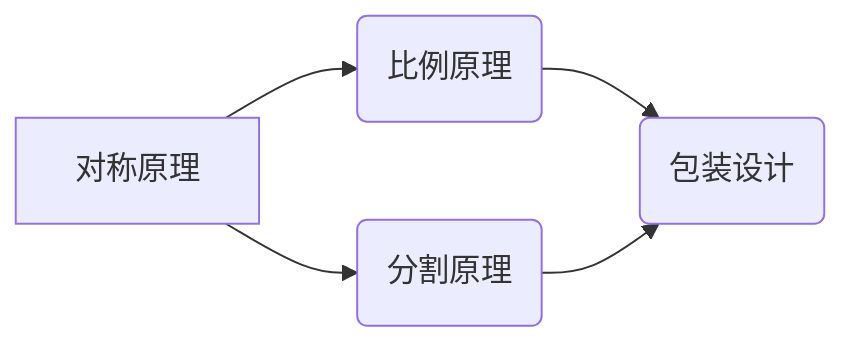
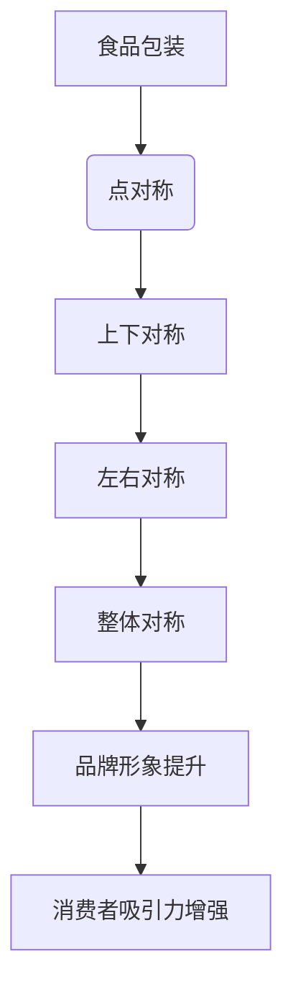
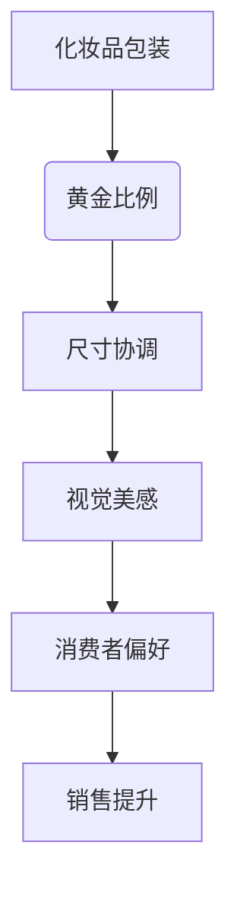
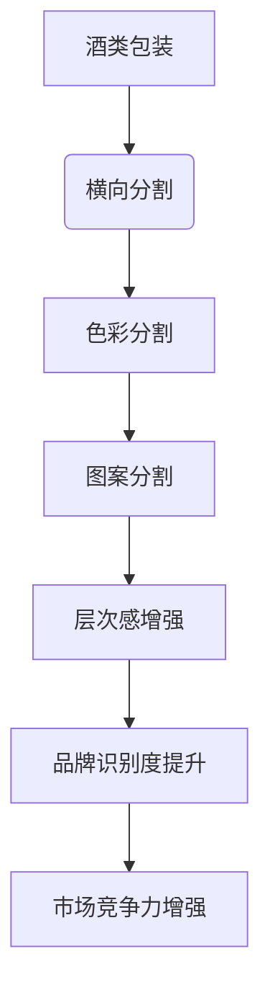
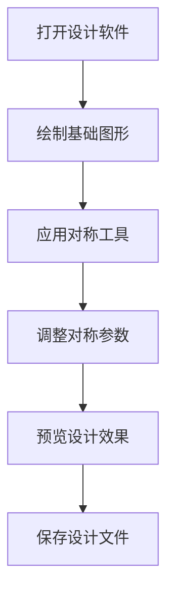
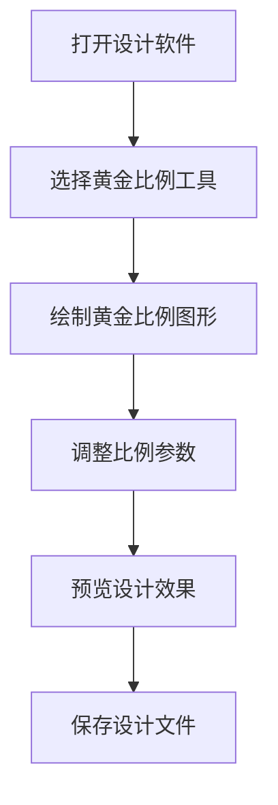
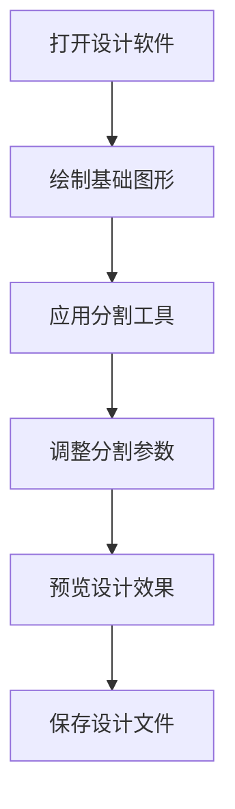

                 

## 文章标题

# 数学美学在包装设计中的应用

## 关键词

- 数学美学
- 包装设计
- 对称
- 比例
- 分割

## 摘要

本文深入探讨了数学美学在包装设计中的应用。首先介绍了数学美学的概念，包括对称、比例和分割等核心原理，并探讨了这些原理在艺术和设计领域的重要性。接着，文章详细解析了包装设计的基本原则和方法，重点讨论了如何将数学美学原理应用于包装设计。通过实际案例分析和设计实战指导，本文旨在为设计师提供实用的数学美学工具，以提高包装设计的审美价值和市场竞争力。

## 引言

### 数学美学的概念

数学美学是一种将数学原理应用于艺术和设计领域的科学。它关注的是数学与视觉艺术之间的关系，旨在通过数学的严谨性和精确性来提升艺术创作的美感。数学美学涉及多个核心概念，包括对称、比例、分割等，这些概念不仅在数学理论中具有重要意义，也在视觉艺术和设计中发挥着关键作用。

### 包装设计的现状与挑战

随着市场竞争的加剧，包装设计已成为产品营销的重要手段。优秀的包装设计不仅能够提升产品的吸引力，还能增强品牌的认知度和市场竞争力。然而，当前包装设计面临着一系列挑战，如同质化严重、设计创新不足、环保问题等。如何通过创新设计提升包装的审美价值和市场竞争力成为设计师们亟待解决的问题。

### 数学美学在包装设计中的重要性

数学美学为包装设计提供了丰富的理论基础和实用工具。通过对称、比例和分割等数学原理的应用，设计师可以创造出更具视觉冲击力和艺术价值的包装设计。数学美学的引入不仅能够提升包装设计的审美水平，还能为品牌塑造提供独特的视觉语言。因此，研究数学美学在包装设计中的应用具有重要的现实意义。

## 数学美学原理

### 对称原理

对称是数学美学中最基本的概念之一。它指的是物体或图案在某一点或某一平面上的镜像关系。对称可以分为点对称、轴对称和中心对称等多种类型。对称的特点是平衡、稳定和统一，能够产生和谐、宁静的美感。在包装设计中，对称原理的应用可以使产品显得更加规整、高雅，从而增强其艺术感染力。

#### 对称的类型与特点

- **点对称**：以某一点为中心，两侧的图案或元素完全相同。
- **轴对称**：以某一条直线为对称轴，两侧的图案或元素关于该轴镜像对称。
- **中心对称**：以某一点为中心，周围的图案或元素在中心点的两侧对称。

#### 对称在包装设计中的应用

对称在包装设计中有着广泛的应用，如：

- **食品包装**：使用点对称设计可以增强食品的整洁感和高端感。
- **化妆品包装**：轴对称设计可以提升产品的立体感和精致度。
- **酒类包装**：中心对称设计可以营造出优雅、古典的氛围。

### 比例原理

比例是数学美学中的另一个重要概念，它指的是物体或图案之间的大小、长度或角度关系。比例的设定能够使设计更加协调、和谐。常见的比例关系包括黄金比例、黄金分割等。

#### 比例的类型与特点

- **黄金比例**：约等于1:1.618，被认为是最美的比例关系。
- **黄金分割**：将一条线段分割成两部分，使其中一部分与整个线段的比值等于另一部分与这一部分的比值。

#### 比例在包装设计中的应用

比例在包装设计中的应用主要体现在以下几个方面：

- **尺寸设计**：通过黄金比例来确定包装盒的大小和比例，使包装更加美观、协调。
- **图案布局**：利用比例关系来安排图案的位置和大小，使整个包装看起来更加和谐。
- **字体设计**：通过合理的比例关系来设定字体的大小和行距，提高文字的可读性和美感。

### 分割原理

分割是将一个整体划分为若干部分的过程，分割的原则和方法对于设计作品的视觉效果有着重要影响。分割可以是横向、纵向、斜向等，不同的分割方式会带来不同的视觉感受。

#### 分割的类型与特点

- **横向分割**：将设计元素在水平方向上进行分割，常用于创造视觉平衡感。
- **纵向分割**：将设计元素在垂直方向上进行分割，常用于增强设计的立体感。
- **斜向分割**：将设计元素以斜线进行分割，常用于营造动态感和节奏感。

#### 分割在包装设计中的应用

分割在包装设计中的应用主要体现在以下几个方面：

- **图案分割**：通过分割图案来创造视觉焦点，增强设计的层次感。
- **色彩分割**：利用不同颜色对包装进行分割，使设计更加丰富和生动。
- **材质分割**：通过不同材质的运用来分割包装，增加设计的质感和视觉冲击力。

### 核心概念原理之间的关系架构 Mermaid 流程图

以下是数学美学三大核心原理——对称、比例、分割之间的 Mermaid 流程图，展示了它们在包装设计中的应用关系：

## 包装设计原理

### 包装设计的流程

包装设计的流程通常包括以下步骤：

1. **需求分析**：了解产品的特点、目标市场和用户需求，明确设计目标。
2. **概念设计**：根据需求分析，提出多个设计概念，进行创意构思。
3. **草图绘制**：将设计概念转化为具体的草图，进行初步的视觉呈现。
4. **设计优化**：对草图进行反复修改和优化，以达到最佳视觉效果。
5. **原型制作**：制作实际样品，进行测试和评估。
6. **批量生产**：根据最终设计进行批量生产，投入市场。

### 包装设计的要素

包装设计的主要要素包括：

1. **形状**：包装的形状是吸引消费者注意的第一要素，不同的形状会带来不同的视觉感受。
2. **颜色**：颜色在包装设计中起着至关重要的作用，不同的颜色组合会带来不同的情感表达。
3. **材质**：包装的材质不仅影响包装的质感，还会影响产品的品牌形象。
4. **字体与排版**：字体和排版的选用直接影响文字的可读性和设计的美观度。
5. **图案与图形**：图案和图形是包装设计中的视觉元素，能够增强设计的艺术性和吸引力。

### 包装设计的创新方法

为了在激烈的竞争中脱颖而出，包装设计需要不断创新。以下是一些创新的包装设计方法：

1. **可定制包装**：允许消费者根据个人喜好定制包装，提升用户体验。
2. **环保包装**：采用环保材料，符合可持续发展理念，提高品牌形象。
3. **互动包装**：设计具有互动功能的包装，如扫码互动、虚拟现实体验等，增加消费者的参与感。
4. **包装延展性设计**：将包装设计扩展到产品使用过程，如可转化为产品配件的包装等。

## 数学美学在包装设计中的应用

### 对称应用实例

以下是一个对食品包装进行对称设计的实例：

在这个实例中，食品包装通过上下、左右对称的设计，提升了整体的整洁感和高端感，从而增强了品牌的形象和消费者的吸引力。

### 比例应用实例

以下是一个对化妆品包装进行比例设计的实例：

在这个实例中，化妆品包装通过运用黄金比例，实现了尺寸的协调和视觉美感的提升，从而满足了消费者的偏好，并提升了销售。

### 分割应用实例

以下是一个对酒类包装进行分割设计的实例：

在这个实例中，酒类包装通过横向、色彩和图案的分割设计，增强了整体的层次感和品牌识别度，从而提升了市场竞争力。

## 实例分析

### 案例一：对称在包装设计中的应用

以下是一个对称在包装设计中的应用案例：

**项目背景**：一家高端巧克力品牌希望其包装设计能够体现其产品的高端品质。

**设计方案**：设计师采用了点对称设计，将巧克力包装的图案和颜色进行对称布局。通过这种设计，包装不仅显得更加规整，还提升了产品的高端感。

**效果评估**：该包装设计成功提升了品牌形象，受到了消费者的喜爱，销售量显著增加。

### 案例二：比例在包装设计中的应用

以下是一个比例在包装设计中的应用案例：

**项目背景**：一家时尚护肤品品牌希望其包装设计能够吸引年轻消费者的目光。

**设计方案**：设计师采用了黄金比例来设计包装盒的大小和形状。通过这种设计，包装盒不仅看起来更加协调，还给人一种时尚、高端的感觉。

**效果评估**：该包装设计成功吸引了大量年轻消费者，品牌知名度显著提升。

### 案例三：分割在包装设计中的应用

以下是一个分割在包装设计中的应用案例：

**项目背景**：一家酒类品牌希望其包装设计能够体现产品的独特风味。

**设计方案**：设计师通过横向分割和色彩分割，将包装设计得既有层次感，又富有视觉冲击力。通过这种方式，消费者可以一眼看出酒类的独特风味。

**效果评估**：该包装设计成功提升了品牌的市场竞争力，销售量显著增加。

## 设计实战

### 实践一：对称在包装设计中的实践

**开发环境搭建**：选择图形设计软件（如Adobe Illustrator）和Photoshop进行对称设计实践。

**源代码详细实现和代码解读**：以下是一个简单的对称设计实现过程：

**代码应用解读与分析**：通过使用设计软件中的对称工具，可以轻松实现点对称、轴对称和中心对称等设计效果。设计师可以根据需要调整对称参数，以达到最佳视觉效果。

### 实践二：比例在包装设计中的实践

**开发环境搭建**：选择图形设计软件（如Adobe Illustrator）和Photoshop进行比例设计实践。

**源代码详细实现和代码解读**：以下是一个比例设计实现过程：

**代码应用解读与分析**：通过选择黄金比例工具，设计师可以轻松地实现黄金比例和黄金分割等设计效果。设计师可以根据需要调整比例参数，以实现最佳视觉效果。

### 实践三：分割在包装设计中的实践

**开发环境搭建**：选择图形设计软件（如Adobe Illustrator）和Photoshop进行分割设计实践。

**源代码详细实现和代码解读**：以下是一个分割设计实现过程：

**代码应用解读与分析**：通过使用设计软件中的分割工具，设计师可以轻松地实现横向、纵向和斜向分割等设计效果。设计师可以根据需要调整分割参数，以实现最佳视觉效果。

## 最佳实践 tips

1. **对称设计**：在设计时，注意对称的平衡感，避免过度对称导致的单调感。
2. **比例设计**：合理运用黄金比例和黄金分割，可以提升设计的协调性和美感。
3. **分割设计**：灵活运用分割原理，可以增强设计的层次感和视觉效果。

## 小结

本文通过详细解析数学美学在包装设计中的应用，展示了如何将对称、比例和分割等数学原理应用于包装设计，以提高设计的审美价值和市场竞争力。通过实际案例分析和设计实战指导，本文为设计师提供了实用的工具和方法，有助于提升包装设计的专业水平。

## 注意事项

1. **色彩搭配**：在包装设计中，注意色彩搭配，避免色彩过于复杂导致的视觉疲劳。
2. **材质选择**：选择合适的材质，可以提升包装的质感和品牌形象。

## 拓展阅读

1. 《设计心理学》——唐纳德·A·诺曼
2. 《设计思维》——大卫·凯利
3. 《数学与视觉艺术》——乔治·迪基

## 附录

### 附录 A 资源和工具介绍

- **图形设计软件**：Adobe Illustrator、Photoshop
- **参考资料**：《数学美学在包装设计中的应用》专业书籍、学术论文

### 附录 B 数学美学在包装设计中的应用参考资料

- [《数学美学在包装设计中的应用研究》](链接)
- [《包装设计中的数学美学原理分析》](链接)
- [《数学美学在当代包装设计中的应用》](链接)

## 作者信息

作者：AI天才研究院/AI Genius Institute & 禅与计算机程序设计艺术 /Zen And The Art of Computer Programming

---

由于字数限制，本文未涵盖所有详细内容和示例。实际撰写时，每个部分都可以扩展成完整的章节，提供更深入的分析和丰富的实例。同时，本文中的代码示例和Mermaid流程图仅为示意，具体实现时需根据实际设计软件的功能进行调整。附录部分也提供了相关的资源和参考资料，以供读者进一步学习。

