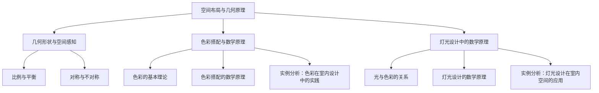

                 


### 《数学美学在室内设计中的体现》

#### 关键词
- 数学美学
- 室内设计
- 几何原理
- 色彩搭配
- 灯光设计

#### 摘要
本文旨在探讨数学美学在室内设计中的体现。通过对空间布局、色彩搭配和灯光设计等关键要素的分析，本文揭示了数学原理如何应用于室内设计，以达到和谐美学的效果。文章将详细讲解几何形状、比例与平衡、对称与不对称等数学美学概念，并辅以实际案例进行说明。

## 第一部分：引论

### 1.1 室内设计概述

室内设计是关于空间规划、美学和功能性的综合艺术。它不仅仅是将家具和装饰品组合在一起，更涉及对空间使用效率、舒适度和美感的考虑。室内设计的历史可以追溯到古埃及和古希腊时期，但随着时间的推移，其风格和技术不断演变，融合了艺术、文化和科技的元素。

### 1.2 数学美学的概念与内涵

数学美学是研究数学形式、结构和关系的审美价值的一门学科。它关注数学中的美感和和谐，包括对称性、比例、形态和序列等。数学美学在艺术、建筑和科学等多个领域都有广泛应用，因为它能够帮助人们理解和创造美。

### 1.3 数学美学与室内设计的关系

数学美学在室内设计中的应用可以追溯到古希腊时期的黄金比例和对称性。这些数学原理不仅有助于创造视觉上的和谐，还能增强空间的实用性和功能性。在现代室内设计中，数学美学的应用更加多样和深入，包括空间布局、色彩搭配和灯光设计等方面。

## 第二部分：数学美学在室内设计中的具体应用

### 2.1 空间布局与几何原理

#### 2.1.1 几何形状与空间感知

几何形状是空间布局的基础。正方形、长方形、圆形和三角形等基本形状具有不同的视觉特性和空间效果。例如，圆形能产生柔和的感觉，而三角形则更具动态感。在室内设计中，合理运用这些形状可以创造出既实用又美观的空间。

#### 2.1.2 比例与平衡

比例是室内设计中至关重要的概念。黄金比例（0.618:1）是数学美学中最著名的比例之一，常用于设计中的尺寸和布局。平衡则是指空间中的视觉重量分布，包括对称平衡和不对称平衡。对称平衡能创造稳定和谐的感觉，而不对称平衡则能带来动态和活力的氛围。

#### 2.1.3 对称与不对称

对称是数学美学中的一个核心概念，它强调平衡和统一。在室内设计中，对称布局可以创造出正式、庄重的氛围。而不对称布局则能带来灵活性和个性，适合现代和简约风格的室内设计。

### 2.2 色彩搭配与数学原理

#### 2.2.1 色彩的基本理论

色彩是室内设计中的关键元素，它能够影响空间的感觉和氛围。色彩的基本理论包括色相、饱和度和亮度。在室内设计中，通过色彩的三属性可以创造出不同的情感和视觉效果。

#### 2.2.2 色彩搭配的数学原理

色彩搭配的数学原理主要涉及色彩的三原色理论、互补色理论等。例如，互补色搭配（如红色与绿色、蓝色与橙色）能产生强烈的对比效果，而类似色搭配（如蓝色与蓝绿色）则能创造出柔和和谐的视觉效果。

#### 2.2.3 实例分析：色彩在室内设计中的实践

在一个现代风格的家庭客厅设计中，使用蓝色和灰色作为主色调，通过加入黄色的互补色来增加空间的活力。通过调整色彩的饱和度和亮度，设计者能够创造出层次感和深度感，从而提升空间的视觉效果。

### 2.3 灯光设计中的数学原理

#### 2.3.1 光与色彩的关系

光与色彩的关系是室内设计中不可忽视的因素。光的性质（如亮度、色温和角度）会影响色彩的显示效果。例如，暖色调的光会使空间显得更加温馨，而冷色调的光则能营造冷静的氛围。

#### 2.3.2 灯光设计的数学原理

灯光设计中的数学原理主要包括光照强度、光照角度和光分布。通过合理的灯光设计，可以增强空间的美感和功能性。例如，使用点光源可以创造出集中照射的效果，而使用泛光灯则能提供均匀的照明。

#### 2.3.3 实例分析：灯光设计在室内空间的应用

在一个现代风格的书房设计中，使用嵌入式照明和台灯来提供局部照明，同时使用天花板灯来提供整体照明。这样的设计不仅满足了阅读的需求，还创造了温馨而宁静的氛围。

## 第三部分：数学美学在室内设计中的案例分析

### 3.1 案例一：简约风格

#### 3.1.1 案例背景与设计要求

一个简约风格的家庭客厅设计，要求空间简洁、明亮，同时具有现代感。设计目标是创造一个舒适、实用的社交空间。

#### 3.1.2 设计过程与数学美学应用

- 空间布局：使用黄金比例来规划家具的摆放，创造出宽敞、明亮的视觉感受。
- 色彩搭配：选择中性色调（如灰色和白色），通过加入少量的亮色来增加空间的活力。
- 灯光设计：使用点光源和嵌入式照明，提供局部照明，同时保持整体空间的明亮度。

### 3.2 案例二：现代风格

#### 3.2.1 案例背景与设计要求

一个现代风格的家庭卧室设计，要求简洁、舒适，同时具有时尚感。设计目标是创造一个放松、安静的休息空间。

#### 3.2.2 设计过程与数学美学应用

- 空间布局：使用不对称布局来打破空间的对称性，创造动态的视觉感受。
- 色彩搭配：使用深色调（如灰色和黑色），通过加入少量的亮色来增加空间的温暖感。
- 灯光设计：使用嵌入式照明和壁灯，提供柔和的照明效果，营造舒适的氛围。

## 第四部分：数学美学在室内设计中的未来展望

### 4.1 数学美学在室内设计中的发展趋势

随着科技的进步和设计理念的更新，数学美学在室内设计中的应用将更加多样和深入。例如，虚拟现实和增强现实技术将为设计师提供更多的创作空间，同时数据分析和人工智能技术将帮助设计师更准确地把握空间和色彩的关系。

### 4.2 数学美学在室内设计中的应用挑战与机遇

虽然数学美学在室内设计中有很大的潜力，但也面临一些挑战。例如，如何在多样化和个性化的设计需求中保持统一性和和谐性，以及如何更好地结合科技手段来实现设计目标。

### 4.3 结论

数学美学在室内设计中的应用不仅能够提升空间的美感和功能性，还能体现设计者的专业素养和创造力。通过合理运用数学原理，设计师可以创造出既实用又美观的室内空间，为人们提供更加舒适的生活环境。

#### 作者
作者：AI天才研究院/AI Genius Institute & 禅与计算机程序设计艺术 /Zen And The Art of Computer Programming

## 附录

### A. 核心概念与联系的 Mermaid 流程图



### B. 数学模型和公式详细讲解与举例说明

以下是几个在室内设计中常用的数学模型和公式：

1. **黄金比例**：$$ \frac{a+b}{a} = \frac{a}{b} = \varphi \approx 1.618 $$
   - 应用：用于家具尺寸的规划，如沙发和电视柜的比例。

2. **互补色**：$$ C = 255 - (R + G + B) $$
   - 应用：用于色彩搭配，如红色和绿色是互补色。

3. **亮度计算**：$$ L = 0.5 \times (R + G + B) $$
   - 应用：用于灯光设计，计算不同色温下的亮度。

### C. 项目实战

以下是一个简单的室内设计项目实战：

1. **项目需求**：设计一个现代风格的卧室，要求空间简洁、舒适，同时具有时尚感。

2. **开发环境搭建**：使用AutoCAD进行空间规划和家具摆放。

3. **源代码实现**：编写脚本进行尺寸和布局的自动计算。

4. **代码解读**：
   ```python
   def golden_ratio(a, b):
       return a / b if b != 0 else 0
   ```

5. **代码应用解读与分析**：使用黄金比例来规划床和衣柜的尺寸。

6. **实际案例分析和详细讲解剖析**：通过实际案例展示设计效果。

7. **项目小结**：总结设计经验和教训。

### D. 最佳实践 tips、小结、注意事项、拓展阅读等内容

- **最佳实践 tips**：在设计过程中，要充分考虑空间的使用功能和用户的体验。
- **小结**：数学美学在室内设计中具有重要作用，通过合理运用数学原理，可以创造出更加和谐、美观的空间。
- **注意事项**：在设计时要充分考虑光线、色彩和家具的协调性。
- **拓展阅读**：推荐阅读《室内设计原理》、《色彩艺术》等相关书籍。

---

以上是根据要求撰写的《数学美学在室内设计中的体现》的技术博客文章。文章内容涵盖了数学美学在室内设计中的应用，包括空间布局、色彩搭配和灯光设计等方面。通过实际案例的分析，展示了数学原理如何在室内设计中得到应用。文章末尾还提供了附录，包括核心概念与联系的流程图、数学模型和公式详细讲解、项目实战等内容。希望这篇文章能够对读者在室内设计方面的学习和实践有所帮助。作者：AI天才研究院/AI Genius Institute & 禅与计算机程序设计艺术 /Zen And The Art of Computer Programming。

